## Random Access Machine (RAM)

The _random access machine_ is a theoretical model of computation that is used to analyze sequential algorithms.

- **Infinity Memory**: the machine has an infinite amount of memory cells;
- **Arbitrary Integer Size**: each memory cell can store an integer of arbitrary size;
- **Uniform Cost Model**: each basic operation (arithmetic, memory access, etc.) takes exactly one time unit.

### RAM Complexity Analysis

The complexity of an algorithm is measured by:

- **Time complexity** ($T(n)$): number of steps to complete the algorithm with input size $n$.
- **Space complexity** ($S(n)$): number of memory cells used during the execution of the algorithm with input size $n$.

## Parallel Random Access Machine (PRAM)

The _parallel random access machine_ is a theoretical model of computation that is used to analyze parallel algorithms.

$$M' = \langle M, X, Y, A \rangle$$

- $M$: is a set of RAM machines (processors) with the ability to recognize its own index;
- $X$: is a set of input cells shared by all the processors;
- $Y$: is a set of output cells shared by all the processors;
- $A$: is a set of shared memory cells.

Each time step, each processor can simultaneously perform:

- Read from shared memory ($A, X$);
- Read from internal memory;
- Perform an internal computation;
- Write to internal memory;
- Write to shared memory ($A, Y$).

Each RAM is synchronized with the others by a global clock. This allows to have all the processors perform the same step at the same time, removing synchronization mechanisms.

When a PRAM has a bounded number of processors $p'$, it's possible to simulate it with a PRAM with $p$ processors. This is done by dividing the work among the $p$ processors, each processor simulating $\lceil \frac{p}{p'} \rceil$ processors of the original PRAM. This increase the time complexity by a factor of $\lceil \frac{p}{p'} \rceil$.

### PRAM Classification

PRAMs are classified on how they handle concurrent access to the shared memory.

Read from the shared memory can happen in two ways:

- **Exclusive Read** (ER): All processors can read _distinct_ memory cells at the same time.
- **Concurrent Read** (CR): Two or more processors can access the _same_ memory cell at the same time.

Write in the shared memory can happen in two ways:

- **Exclusive Write** (EW): All processors can write in _distinct_ memory cells at the same time.
- **Concurrent Write** (CW): Two or more processors can access the _same_ memory cell at the same time.
  - **Priority**: each processor has a priority level. The highest is the one allow to write.
  - **Common**: all processors must write the same value (If not, the behavior is undefined).
  - **Random**: one of the processors is chosen randomly to write.

The classification is done by combining the two types of access.

### PRAM Complexity

The complexity of a PRAM algorithm is measured by:

| Metric              | Symbol    | Formula                                             | Context / Meaning                                                                                                                          |
| :------------------ | :-------- | :-------------------------------------------------- | :----------------------------------------------------------------------------------------------------------------------------------------- |
| **Elapsed Time**    | $T_p(n)$  | -                                                   | The number of steps (time) to complete the algorithm of size $n$ using $p$ processors.                                                     |
| **Sequential Time** | $T^*(n)$  | -                                                   | The time complexity of the **best known sequential algorithm** for the same problem. $\mathbf{T^*(n) \neq T_1(n)}$.                        |
| **Speedup**         | $SU_p(n)$ | $\frac{T^*(n)}{T_p(n)}$                             | Measures how much **faster** the parallel algorithm is compared to the best sequential one. Ideally, $SU_p(n) \approx p$ (linear speedup). |
| **Efficiency**      | $E_p(n)$  | $\frac{SU_p(n)}{p} = \frac{T_1(n)}{p \cdot T_p(n)}$ | Measures the **average utilization** of the $p$ processors. $0 \leq E_p(n) \leq 1$. An efficiency close to 1 is considered **optimal**.    |
| **Cost**            | $C_p(n)$  | $p \cdot T_p(n)$                                    | Amount of time of the algorithm multiplied by the number of processors used                                                                |
| **Work**            | $W(n)$    |                                                     | The total number of operations performed by **all** $p$ processors during the execution. ($W \leq C$)                                      |

### Examples

#### Vector Sum

The sum of a vector on a sequential RAM is done in $O(n)$ time, as each element must be read and added to the total sum.

In a PRAM with $n$ processors, the vector sum can be performed in $O(\log n)$ time.

The algorithm works by performing pairwise sums in parallel:

1. In the first step, each pair of adjacent elements is summed by a separate processor, resulting in $n/2$ sums.
2. In the second step, the sums are paired again and summed, resulting in $n/4$ sums.
3. This process continues until only one sum remains.

#### Matrix-Vector Multiplication

The matrix-vector multiplication on a sequential RAM takes $O(n^2)$ time, as each row of the matrix must be multiplied by the vector.

A PRAM with $n^2$ processors can perform the matrix-vector multiplication in $O(\log n)$ time, as all the multiplications can be done in parallel, followed by a sum the results for each row.

The efficiency of this algorithm is $E_p(n) = \frac{n^2 / \log n}{n^2} = \frac{1}{\log n}$.

#### Matrix-Matrix Multiplication

In a sequential RAM, the matrix-matrix multiplication takes $O(n^3)$ time, as each element of the resulting matrix must be computed by summing the products of the corresponding row and column.

A PRAM with $n^3$ processors can perform the matrix-matrix multiplication in $O(\log n)$ time, as all the multiplications can be done in parallel, followed by a sum the results for each row.

The efficiency of this algorithm is $E_p(n) = \frac{n^3 / \log n}{n^3} = \frac{1}{\log n}$, which decreases as the size of the input increases.

#### Logical Functions

Logical functions can be evaluated in parallel using a PRAM Common Concurrent Write models.

- `AND` operation with $n$ elements can be performed in $O(1)$ time with $n$ processors by having each processor read one element, initialize a shared variable to `1`, and if any processor reads a `0`, it writes `0` to the shared variable.
- `OR` operation with $n$ elements can be performed in $O(1)$ time with $n$ processors by having each processor read one element, initialize a shared variable to `0`, and if any processor reads a `1`, it writes `1` to the shared variable.

### Scaling

The scaling is the ability of an algorithm to efficiently use an increasing number of processors.

The scaling is the relationship between three parameters:

- Problem Size ($n$): the size of the input data;
- Number of Processors ($p$): the number of processors used in the computation;
- Time ($T$): the time taken to complete the computation.

The scaling is classified in two types:

#### Strong Scaling

In strong scaling the problem size ($n$) is kept constant and the goal is to improve performance ($T$) by increasing the number of processors ($p$) (**Fixed Size Problem**).

To analyze strong scaling, we use **Amdahl's Law**:

$$SU_p(n) = \frac{1}{(1 - f) + \frac{f}{p}}$$

- $f$: fraction of the algorithm that can be parallelized;
- $1 - f$: fraction of the algorithm that is sequential (cannot be parallelized).

Due to the sequential part, there is a limit to the speedup that can be achieved by adding more processors.

$$\lim_{p \to \infty} SU_p(n) = \frac{1}{1 - f}$$

This means that even with an infinite number of processors, the speedup is limited by the sequential portion of the algorithm.

Ideally, for strong scaling, we want:

$$T \propto \frac{1}{p}$$

#### Weak Scaling

In weak scaling, the problem size ($n$) is increased and the goal is to keep the execution time ($T$) constant by increasing the number of processors ($p$) (**Fixed Time Problem**).

To analyze weak scaling, we use **Gustafson's Law**:

$$SU_p(n) = s + P \cdot (1 - s)$$

- $s$: fraction of the algorithm that is sequential (cannot be parallelized);
- $1 - s$: fraction of the algorithm that can be parallelized.

This law suggests that as we increase the number of processors, the speedup can grow linearly with $p$, assuming the parallelizable portion is significant.

Ideally, for weak scaling, we want:

$$T \propto P$$

## Randomized Algorithm

A **Randomized Algorithm** is an algorithm that incorporates random choices into its logic. This introduces an element of chance into the execution path, even for a fixed input.

While the performance of a _deterministic algorithm_ can vary based on the input (e.g., Insertion Sort is $O(n)$ on sorted input, $O(n^2)$ worst-case), a randomized algorithm uses randomness to work with a high probability on an average-case performance level, rather than being vulnerable to a worst-case scenario.

Some randomization techniques are:

- _Randomizing Input Order_: Pre-processing the input randomly to prevent worst-case arrangements (e.g., randomly shuffling an array before processing).
- _Random Selection (Pivots/Candidates)_: Randomly selecting key elements (e.g., selecting a random pivot in Quicksort). This ensures that the pivot is likely to be good, minimizing the probability of a consistently bad partition.
- _Random Number Generation_: Using random numbers to make decisions during the algorithm's execution (e.g., randomized algorithms for primality testing).
- _Randomized Deterministic Algorithm_: Randomly choosing among several deterministic algorithms to solve the same problem, which can help avoid worst-case scenarios associated with any single algorithm.

### Types of Randomized Algorithms

Randomized algorithms are generally divided into two main categories based on what they guarantee: the **correctness of the output** or the **running time**.

### Las Vegas

**Las Vegas algorithms** always provide the **correct solution**, but the running _time is random_.

They keep iterating until a solution is reached and are efficient if the average case is polynomial.

### Monte Carlo

**Monte Carlo algorithms** have a _fixed_, or _bound_, running time but may produce **incorrect results** with a certain probability.

They are efficient if the complexity is polynomial in the worst case and the probability of error is low.

These algorithms are often used for decision problems, where the output is either "yes" or "no".

The Monte Carlo algorithms can be further classified based on the nature of their errors:

- **One-sided error**: The algorithm may produce incorrect results in only one direction (e.g., false positives or false negatives).
- **Two-sided error**: The algorithm may produce incorrect results in both directions (e.g., both false positives and false negatives).

## Mincut

Given an undirected graph $G = (V, E)$ with $n = |V|$ and $m = |E|$, a cut is a partition of the vertices $V$ into two non-empty sets $(S, V \setminus S)$. The size of the cut is the number of edges crossing the partition (edges between $S$ and $V \setminus S$). The Mincut problem is to find a cut of the minimum size.

### Karger's Contraction Algorithm

The Karger's algorithm is a randomized approach to find the Mincut.

The main idea is to randomly select two nodes and contract them into a single node, merging their edges. Edge between the two nodes are removed.

This process is repeated until only two nodes remain. The edges between these two nodes represent a cut in the original graph.

The solution might not be the best, but is feasible, the probability to find the best solution is ${Pr}\ge \frac{1}{\binom n2}$ with a complexity of $O(n^2)$.

It's possible to repeat $l$ times the algorithm, keeping all the results and choosing the best one, increasing the probability to find the best solution to $1 - (1 - \frac{1}{\binom n2})^{l\binom n2}$.

Choosing $l = c \log n$ the probability become $\le \frac{1}{n^c}$ with a complexity of $O(n^2 \cdot l)$. The optimal $l$ is $n^2\log n$ to get a final complexity of $O(n^4 \log n)$.

### Karger-Stein Algorithm

Stein used a telescopic approach to improve the Karger algorithm as contracting edges from the mincut is less probable when the graph is big.

If the graph has less than 6 nodes a deterministic algorithm is used to find the mincut as the constants are high for small graphs.

If the graph has more than 6 nodes, the algorithm contract the graph to two graphs with number of vertices equal to $\frac{n}{\sqrt{2}}$ (with a probability of not having contracted the min cut of $\frac{1}{2}$).

Then it duplicate the graph and contract both of them.

Then it recurses on both graphs and returns the best result.

This have a total complexity of $O(n^2 \log n)$, this algorithm can be run $l$ times with a complexity of $O(n^2 \log n \cdot l)$ (the optimal $l$ is $O(\log^2 n)$).

## Sorting

### Quicksort

The quicksort is an efficient _in-place_ algorithm, based on the _divide and conquer_ paradigm.

- _divide_ (partition): Select a pivot element and rearrange the array such that all elements less than the pivot are to its left, and all elements greater than the pivot are to its right. The pivot is then in its final sorted position;
- _conquer_: Recursively sort the two sub-arrays (left and right of the pivot);
- _combine_: The combination step is trivial (zero time), as the sub-arrays are sorted in place.

```plaintext
quicksort(array A, int low, int high):
    if low < high:
        pivotIndex = partition(A, low, high)
        quicksort(A, low, pivotIndex - 1)
        quicksort(A, pivotIndex + 1, high)

partition(array A, int low, int high):
    pivot = A[low]              // Choose the first element as pivot
    i = low + 1                 // i is the boundary of the 'less than pivot' region

    for j from low + 1 to high:
        if A[j] < pivot:        // Element belongs to 'less than pivot' region
            swap A[i] and A[j]
            i = i + 1

    swap A[low] and A[i]        // Place pivot in its final position

    return i
```

The partition completes in $O(n)$ time, as it requires a single pass through the array to rearrange the elements around the pivot.

The worst-case scenario occurs when the pivot selection consistently results in unbalanced partitions, leading to a time complexity of $O(n^2)$. This can happen if the array is already sorted or reverse sorted and the first or last element is always chosen as the pivot.

The best-case and average-case time complexity of quicksort is $O(n \log n)$, which occurs when the pivot divides the array into two roughly equal halves at each recursive step.

#### Randomized Quicksort

The choice of the pivot is crucial for the performance of the algorithm. A poor choice can lead to unbalanced partitions, resulting in suboptimal performance.

To mitigate the probability to find the worst scenario, it's possible to randomize the pivot, instead of taking always the first one. This make the probability to get any configuration of partition $\frac{1}{n}$.

### Decision Tree

The Decision Tree model is used to prove the theoretical lower bound for any comparison-based sorting algorithm.

- Each internal node represents a comparison between two elements;
- Each branch represents the outcome of the comparison (less than, greater than);
- Each leaf node represents a possible permutation ($n!$) of the input array.

The minimum number of comparisons required to sort $n$ elements is at least the height $h$ of the decision tree. A binary tree of height $h$ has at most $2^h$ leaves ($n! \leq 2^h$).

$$h \geq \log_2(n!) \approx n \log_2(n)$$

This establishes that any comparison-based sorting algorithm must make at least $\Omega(n \log n)$ comparisons in the worst case.

### Counting Sort

The **Counting Sort** is a non-comparison based sorting algorithm that is _stable_ (preserves the relative order of equal elements).

The algorithm is based on 3 main steps:

1. Count the occurrences of each unique element of the input array in an auxiliary array $C$ of size $k$ (where $k$ is the range of the input values);
2. Modify the auxiliary array $C$ such that $C[x]$ stores the final position of the element $x$ in the sorted output array, this is done by summing the counts of all previous elements (`C[x] = C[x] + C[x - 1]`);
3. Iterate backwards through the input array $A$, placing each element in its correct position in the output array based on the values in $C[A[i]]$, and decrementing the count in $C[A[i]]$ for each placed element.

The complexity is $O(n + k)$, where:

- $n$ is the number of elements in the input array;
- $k$ is the range of the input values.

### Radix Sort

Radix Sort is an algorithm that sorts numbers by processing individual digits (or bits) from least significant to most significant, using the counting sort to sort the digits (the counting is used because it allows for stable sorting of the digits).

Chosen the amount of bits to consider $r$, the algorithm processes the input array $A$ in multiple passes, each time sorting the array based on a specific digit (or group of bits).

The number of passes required is $\lceil \frac{b}{r} \rceil$, where $b$ is the number of bits in the largest number.

The size of the auxiliary array is fixed to $2^r$.

A bigger base decreases the amount of iteration, but increases the size of the auxiliary array.

The complexity is $O(\frac{b}{r} (n + 2^r))$.

An ideal r is $\ln(n)$ that gives a complexity of $\theta(\frac{b \cdot n}{ \log n})$.

During the last phase there is low caching as the accessed positions are almost random.

## Order Statistics

The **Order Statistics** problem is to find the $i$-th smallest element in an unsorted array of $n$ elements.

### Randomized divide and conquer

This algorithm is based on the quicksort partitioning method.

A random pivot is selected and the array is partitioned in two sub-arrays.

If the index of the pivot is equal to the searched one, the pivot is returned, otherwise if the index is greater the algorithm recurses on the left sub-array, otherwise on the right one.

The average complexity is $\Theta(n)$, but the worst case is $O(n^2)$ when the pivot is always the smallest or the biggest element.

### Deterministic divide and conquer

This algorithm use a more complex method to select the pivot and guarantee a worst case of $O(n)$.

1. Divide the $n$ elements into $\lfloor \frac{n}{5} \rfloor$ groups of 5, with at most 4 elements remaining;
2. Find the median of each group (by sorting the group and selecting the middle element) with a constant complexity of $O(1)$ per group, as the size is fixed;
3. Take all the medians and choose the median $x$ of these medians;
4. Partition the original array around $x$;
5. if the index of $x$ is equal to the searched one, return $x$, otherwise if the index is greater recurse on the left sub-array, otherwise on the right one.

Dividing in groups of 5 ensure that at least half of the medians are greater than $x$ and at least half are smaller than $x$, this guarantee that at least $30\%$ of the elements are greater than $x$ and at least $30\%$ are smaller than $x$.

## Primality testing

The **Primality Testing** problem is to determine if a number $n$ is prime or composite.

### Trial Division

The classical deterministic method is **Trial Division**: check if $n$ is divisible by any integer $d$ from $2$ up to $\sqrt{n}$.

The complexity is $O(\sqrt{n})$.

On a modern computer this is allow to compute in a couple of minute a number with 50 bit, but for cryptography this is too slow.

### Monte Carlo Primality Test

Using _monte carlo_ it's possible to improve the time by performing an heuristics based on the _Fermat's little theorem_:

> If $p$ is a prime number and $a$ is an integer such that $1 < a < p$, then:
> $$a^{p-1} \mod p \equiv 1$$

It's possible for a composite number to satisfy this property for some base $a$, these numbers are called **pseudo-primes**.

If a number is pseudo-prime for all the bases $a$ it's called a **Carmichael number**.

It is possible to create an algorithm that:

1. Select a random base $a$ in the range $[2, n - 2]$;
2. Compute $a^{n-1} \mod n$;
3. If the result is not equal to 1, return _"composite"_, otherwise return _"probably prime"_.

The algorithm can be repeated $k$ times to increase the probability to find a prime number.

#### Efficient Exponentiation

The exponentiation can be computed efficiently with the method of _fast exponentiation_ that reduces the number of multiplications needed by using the properties of exponents:

1. If $b$ is even: $a^b = (a^2)^{b/2}$
2. If $b$ is odd: $a^b = a \cdot (a^2)^{(b-1)/2}$

```plaintext
function fastExponentiation(a, b):
    if b == 0:
        return 1
    elif b is even:
        return fastExponentiation(a * a, b / 2)
    else:
        return a * fastExponentiation(a * a, (b - 1) / 2)
```

The complexity of this algorithm is $O(\log b)$ multiplications.

During the computation it's possible to perform the **non trivial square root** $a^2 \mod p = 1$, where a is the value calculated at each step.

This makes the complexity of the primality test $O(k \cdot \log^2 n \cdot \log p)$, where $k$ is the number of iterations, $n$ is the number to test, and $p$ is the exponent.

### Cryptography

This algorithm is highly used in asymmetric encryption.

The core idea is based on the computational difficulty of factoring the product of two large primes.

The keys are generated by:

1. Select two _prime_ numbers $p$ and $q$ with 500+ bits, the primality test is used here;
2. Calculate the modulus $n = p \cdot q$;
3. Calculate the totient $\phi(n) = (p - 1) \cdot (q - 1)$;
4. Choose the **public exponent** $e$ such that $1 < e < \phi(n)$ and is relative prime to $\phi(n)$ ($\gcd(e, \phi(n)) = 1$);
5. Choose the **private exponent** $d$ such that $d \cdot e \mod \phi(n) = 1$ (the modular multiplicative inverse of $e$ modulo $\phi(n)$);
6. Public key is $(e, n)$, this will be used to encrypt messages;
7. Private key is $(d, n)$, this will be used to decrypt messages.

## Randomized Data Structure

A dictionary is collection of elements identified by an unique key.

A dictionary support three main operations:

- **Search**: given a key, return the associated value;
- **Insertion**: add a new key-value pair to the dictionary;
- **Deletion**: remove a key-value pair from the dictionary.

This can be implemented with multiple data structures, like:

- Ordered array;
- Unordered array;
- Binary Search Tree;
- Hash Table;

It's possible to use randomized data structures to improve the performance of the dictionary operations.

### Random Treaps

The **Treap** (tree + heap) is a randomized collection that maintains two properties:

- **Binary Search Tree Property**: The keys are organized in a binary search tree structure: for any given node, all elements in the left subtree are less than the node, and all elements in the right subtree are greater;
- **Heap Property**: The priorities are organized in a min-heap structure: for any given node, the priority of the node is less than the priorities of its children.

Each node contains a key and a priority. The keys are unique, while the priorities are assigned randomly when the node is created with a uniform distribution [0, 1). When two priorities are equal a new bit is added until there is a difference.

The insertion follows these steps:

1. Choose a priority for x;
2. Append x as a leaf like for a binary tree;
3. Restore the heap priority with right/left rotations until $\text{priority}(\text{parent}(x)) > \text{priority}(x)$.

Using this method gives an expected number of rotations equals to 2, keeping the tree balanced and a complexity of $O(\log n)$.

The height of the treaps has an expected depth of $1.39 \dot  \log n$.

The search complexity is based on the height of the tree, so it's $O(\log n)$ in average, like the binary search tree.

Splitting a treap is done by inserting a new node with priority $-\infty$ and key equal to the split key, then the left and right subtree of this node are the two resulting treaps.

### Skip List

The **Skip List** is a probabilistic data structure that uses multiple levels of linked lists.

The base level is a standard sorted linked list containing all the elements. The upper levels randomly include some elements from the lower levels, creating "express lanes" that allow for faster traversal of the list.

The search operation starts from the highest level and moves downwards, skipping over elements until the target element is found or determined to be absent.

The complexity to find an element is equivalent $N_\text{skip} + \frac{N_\text{normal}}{N_\text{skip}}$

During the insertion the element is added to the base list, then it is promoted to the upper list with a probability of $1/2$. This process is repeated until a fail.

With this method the expected number of levels is $\log n$, and the expected search complexity is $O(2 \cdot \log n) \equiv O(\log n)$.

## Dynamic Programming

**Dynamic Programming** is an algorithmic technique for solving complex problems by breaking them down into simpler subproblems.

It is based on two main principles:

- **Optimal Substructure**: An optimal solution to a problem contains the optimal solution to any subproblem.
- **Overlapping Subproblems**: The recursive solution to the problem involves solving the same subproblems repeatedly.

Dynamic programming can be implemented using two main approaches:

- **Memoization**: is a top-down approach that starts with the original problem and recursively breaks it down into subproblems, storing the results of solved subproblems in a table to avoid redundant computations.
- **Tabulation**: is a bottom-up approach that starts with the smallest subproblems and iteratively builds up solutions to larger subproblems, storing the results in a table.

Tabulation is generally more efficient, as it avoids the overhead of recursive calls, but memoization can be easier to implement and doesn't need to solve all subproblems if not necessary.

### LCS Algorithm

The **LCS** problem finds the longest subsequence (a sequence that can be derived from another sequence by deleting some or no elements without changing the order of the remaining elements) common to two input sequences, $X$ of length $m$ and $Y$ of length $n$.

The basic idea is to check if all the possible sequences are present in the other sequence. This has a $O(n)$ to search $2^n$ subsequences.

A better approach is use the optimal substructure property of the problem: If the longest common subsequence of $X$ and $Y$ is $Z$, then $Z$ without its last element must be the LCS of the prefixes of $X$ and $Y$.

Starting from the last elements of both sequences:

- if the elements are equal, they are part of the LCS, and we move to the previous elements in both sequences;
- if the elements are not equal, we recurse by moving back in either sequence and taking the maximum LCS found.

```plaintext
table[m, n] // memoization table

function LCS(X, Y, m, n):
    if m == 0 or n == 0:
        return 0

    if table[m, n] is defined: // check memoization to avoid recomputation
        return table[m, n]

    if X[m-1] == Y[n-1]:
        table[m, n] = 1 + LCS(X, Y, m-1, n-1)
    else:
        table[m, n] = max(LCS(X, Y, m, n-1),
                          LCS(X, Y, m-1, n))

    return table[m, n]
```

This allows to have a complexity of $O(m \cdot n)$ in time and space, where $m$ and $n$ are the lengths of the two sequences.

Than it's possible to reconstruct the LCS by backtracking the table from `table[m, n]` to `table[0, 0]`.

### BDD

It's possible to represent logical functions with truth tables, but for functions with many variables this become unfeasible.

A clever way is to use **binary decision diagrams** (BDD), a compressed tree representation that can perform operation without decompressing it.

- _Node_: represent a variable of the function;
- _Edge_: represent the two possible values of the variable (0 or 1);
- _Leaf_: represent the result of the function (0 or 1).

To find the evaluation of the function for a given input, start from the root node and follow the edges according to the values of the variables until reaching a leaf node that contains the result.

#### Reduced and Ordered BDD

BDDs must be in canonical form to be useful, this is done by applying two rules:

- **Ordered Binary Decision Diagram** (OBDD): variables must appear in the same order on all paths from the root to the leaves. The order impact the size of the BDD.
- **Reduced Binary Decision Diagram** (RBDD): minimize the BDD by:
  - Merge identical subtrees (the subtree represent the same subfunction);
  - Remove nodes whose children are the same (both point to the same node).

#### BDD Implementation

##### ITE Operator

Each node can be represented with the triple $f = (v, g, h)$, where $v$ is the value of the node, $g$ is the right pointer, and $h$ is the left pointer.

The **ITE** (if-then-else) operator is used to implement logical operations between BDDs.

$$\text{ITE}(f, g, h) = fg + \overline{f}h$$

- $f$ is the condition;
- $g$ is the value if $f$ is true;
- $h$ is the value if $f$ is false.

##### Unique Table

The unique table is used to store each node only once in the BDD.

Before creating a new node, the unique table is checked to see if a node with the same triple $(v, g, h)$ already exists. If it does, the existing node is reused; otherwise, a new node is created and added to the unique table.

This ensures that the BDD remains reduced (canonic), as identical subtrees are merged automatically.

##### Computed Table

The computed table is used to store the results of operations between two BDDs to avoid re-computation.

When two BDDs are combined using the ITE operator, the computed table is checked to see if the result of the operation has already been computed. If it has, the existing result is reused; otherwise, the operation is performed, and the result is stored in the computed table.

#### BDD Inversion

It's possible to store the inverted value of a BDD without creating a new BDD by using _complement edges_.

A complement edge is a special type of edge that indicates that the value of the subtree it points to should be inverted.

This is implemented by using the least significant bit of the pointer to indicate if the edge is a complement edge (1) or a normal edge (0).

When traversing the BDD, if a complement edge is encountered, the value of the subtree is inverted.

This is possible because the addresses of nodes are aligned to 4 bytes, so the two least significant bits are always 0.

#### Reordering and Garbage Collection

Since BDDs are highly shared and manipulated through pointers, memory management is necessary:

- **Reference Counting**: A counter is associated with each node, tracking how many other nodes or external variables point to it. When the counter hits zero, the node is safely deleted.
- **Mark and Sweep**: When memory runs low, the system starts from all external root pointers (the BDDs currently in use).
  - **Mark**: Traverse the BDDs recursively, marking every reachable node.
  - **Sweep**: Iterate through all nodes in the memory space; any node not marked is unreachable and is reclaimed (deleted).

## Amortized Analysis

**Amortized Analysis** is a technique used to analyze the cost of a sequence of operations, where a single operation may be expensive, but that expensive operation happens rarely. The goal is to determine the average cost per operation in the worst-case sequence.

An example is with a collection which size increase along with the insertions.

Each time there is overflow need to create a new memory and copy all the values with a complexity of $O(n)$, but this happen only $\log n$ times across $n$ insertions.

The analysis can be performed with three methods:

### Aggregate method

This method calculate the total cost of a sequence of operations and then divide it by the number of operations to get the average cost per operation.

| i    | 1   | 2     | 3     | 4   | 5     |
| ---- | --- | ----- | ----- | --- | ----- |
| size | 1   | 2     | 4     | 4   | 8     |
| $c$  | 1   | 1(+1) | 1(+2) | 1   | 1(+4) |

The total cost for $n$ insertions is $\sum_{i=1}^n c_i \leq n + \sum_{j=0}^{\lfloor \log n \rfloor} 2^j \leq n + 2n = 3n$, so the average cost per insertion is $\frac{3n}{n} = 3 \equiv O(1)$.

### Accounting Method

This method assign to each operation a _amortized cost_ that might be different from the actual cost ($\sum_{i=1}^n c_i \leq \sum_{i=1}^n \hat{c}_i$).

- if $\hat{c}_i < c_i$, the operation is expensive and use stored _credit_ from previous operations;
- if $\hat{c}_i > c_i$, the operation is cheap and store the extra cost as _credit_ for future operations.

The credit must be non-negative at any time.

The amortized cost is an upper bound on the actual cost, so the complexity would be $O(\hat{c})$.

| i         | 1   | 2     | 3     | 4   | 5     |
| --------- | --- | ----- | ----- | --- | ----- |
| size      | 1   | 2     | 4     | 4   | 8     |
| $c$       | 1   | 1(+1) | 1(+2) | 1   | 1(+4) |
| $\hat{c}$ | 2   | 3     | 3     | 3   | 3     |
| credit    | 1   | 2     | 2     | 5   | 2     |

### Potential Energy

This method is similar to the accounting method, but instead of storing credit with each object, it uses a _potential function_ $\phi$ to represent the stored energy in the entire data structure $D_i$.

- The initial potential is $\phi(D_0) = 0$;
- The potential is always non-negative $\phi(D_i) \geq 0$ for all $i \geq 0$;
- The amortized cost of the $i$-th operation is defined as: $\hat{c}_i = c_i + \Delta(\phi(D_i))$.

$\Delta(\phi(D_i)) = \phi(D_i) - \phi(D_{i-1})$ and represent the _potential difference_.

- $\Delta(\phi(D_i)) > 0$, than $\hat{c}_i > c_i$ and the operation stores energy in the data structure;
- $\Delta(\phi(D_i)) < 0$, than $\hat{c}_i < c_i$ and the operation uses stored energy.

The total amortized cost over a sequence of $n$ operations is:

$$\sum_{i=1}^n \hat{c}_i = \sum_{i=1}^n c_i + \phi(D_n) - \phi(D_0) \geq \sum_{i=1}^n c_i$$

To determine the complexity must find the function that bounds the amortized cost.

> The formula of the potential energy in the case would be $2i - 2^{\log n}$

## Competitive Analysis

**Competitive Analysis** is used to evaluate the performance of **online algorithms**, which make decisions based on partial information without knowledge of future inputs, compared to an **optimal offline algorithm** that has complete knowledge of the input sequence.

An online algorithm $A$ is considered $\alpha$-competitive if its performance is within a factor of $\alpha$ of the optimal offline algorithm for all possible input sequences.

$$C_A = \alpha C_A^{opt} + k$$

- $C_A$: cost incurred by the online algorithm $A$;
- $C_A^{opt}$: cost incurred by the optimal offline algorithm;
- $\alpha$: competitive ratio (a constant factor);
- $k$: an additive constant (independent of the input size).

### Self Organizing List

**Self Organizing Lists** are data structure that reorder elements based on the access frequency of the items to minimize the access time for frequently accessed elements.

This can be done by storing a access counter to each element and sort based on that, but that is inefficient in an online scenario.

A better approach is done by using a simple heuristic called **Move-to-Front** that moves the most recently accessed element to the front of the linked-list.

The potential function is calculates as $\phi(L_i) = 2 \cdot \text{\# inversions}$, where an inversion is a pair of elements that are out of order compared to the optimal list. Each movement create/destroy 1 inversion.

The amortized cost of the $i$-th operation is: $\hat{c}_i = c_i + \Delta \phi(L_i) = 4c_i$, making the algorithm 4-competitive. Using a linked list the cost of the transposition is free, allowing to be 2-competitive.

## Parallel programming

Ideally, parallelization should be automatically implemented by the compiler by converting a sequential code into a parallel one. In practice this is not feasible as is impossible to guarantee data safety (like overlapping memory access).

It's better, and safer, to let the programmer decide what to parallelize.

### Type of Parallelism

Parallelism can be implemented at different levels of granularity:

- **Bit Level**: Processing multiple bits simultaneously within a single instruction. While crucial for hardware implementation (ASIC/FPGA), it is also relevant in software for operations like bit-packing.
- **Instruction Level (ILP)**: Executing different instructions simultaneously on the same core. This is supported by superscalar architectures, pipelines, and SIMD units and is generally extracted by compilers.
- **Task Level**: Breaking a program into discrete sections (tasks) that run on multiple processors. This is difficult to extract automatically and requires explicit management.

#### Task Graph

A parallel program can be represented as a **task graph**, where each node represents a task and edges represent dependencies or communication between tasks.

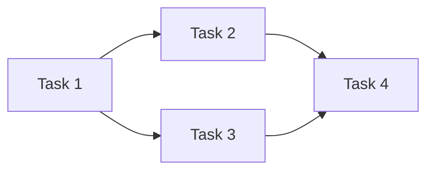

Each task needs some time $T$ to be executed.

The sum of all the times is the **work** $W = \sum T$ (time to execute the program on a single processor).

The longest path from the start to the end of the graph is the critical path, **Span** $S$ (time to execute the program with infinite processors).

Based on these two values it's possible to calculate the **parallelism** of the program: $P = \frac{W}{S}$ (average amount of work that can be done in parallel, or the average number of processors that are not idle).

A good parallel program has a high parallelism (many tasks can be executed in parallel) and a low span (the critical path is short).

#### Pipeline

A **pipeline** is a series of processing stages where the output of one stage is the input to the next. Each stage can operate concurrently, allowing multiple data items to be processed simultaneously.

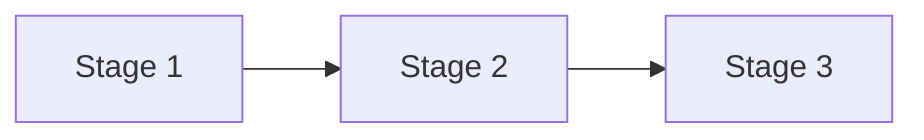

#### Vectorization

**Vectorization** is the process of converting scalar operations to vector operations, allowing multiple data points to be processed in parallel using SIMD (Single Instruction, Multiple Data) instructions.

#### Communication

Data sharing describe the communication between the processors:

- **Shared Memory**: All tasks share a global address space. Modifications by one processor are visible to others.
- **Message Passing**: Each task has private memory and interacts by explicitly sending/receiving messages

### Parallel Programming Technologies

There is no single standard for parallel programming. There is an inverse relationship between _abstraction level_ and _Overhead_.

#### Verilog / VHDL

Verilog and VHDL are Hardware Description Languages (HDL) used to design and model digital systems at the hardware level.

They have a very low level of abstraction, allowing precise control over hardware resources, maximizing parallelism and performance.

Requires specific hardware knowledge and specialized tools FPGA/ASIC.

#### MPI

The Message Passing Interface (MPI) is a standardized and portable message-passing system designed to function on a wide variety of parallel computing architectures with distributed memory.

This is highly scalable and works on diverse architectures.

Explicit message-based communication can introduce significant overhead and complexity in programming.

MPI is only a standard, then there are different implementations like OpenMPI. Each implementation provides:

- `libmpi.so`: the library containing the MPI functions;
- `mpicc`: compiler wrapper for C programs;
- `mpirun`/`mpiexec`: command to run MPI programs.

##### Initialization and Finalization

An MPI program starts with the initialization of the MPI environment using `MPI_Init`.

```c
#include <mpi.h>

int MPI_Init(int *argc, char ***argv, int required, int *provided);
```

Where:

- `argc` and `argv`: command-line arguments;
- `required`: desired level of thread support;
- `provided`: actual level of thread support provided (`MPI_THREAD_SINGLE` < `MPI_THREAD_FUNNELED` < `MPI_THREAD_SERIALIZED` < `MPI_THREAD_MULTIPLE`).

Then to finalize the MPI environment use `MPI_Finalize`.

```c
#include <mpi.h>

int MPI_Finalize(void);
```

This is the last MPI function called in the program and after this it's not more possible to initialize new MPI processes.

All the MPI functions returns a status code, where `MPI_SUCCESS` indicates successful completion.

##### Communicator

A **communicator** is a group of MPI processes that can communicate with each other. They are identified by a unique handle of type `MPI_Comm`.

The base communicator groups are:

- `MPI_COMM_WORLD`: This group involves all the MPI processes.
- `MPI_COMM_SELF`: This group involves only the current process.

Each process in a communicator has a unique identifier called **rank**, which ranges from `0` to `size - 1`, where `size` is the total number of processes in the communicator.

```c
#include <mpi.h>

int MPI_Comm_size(MPI_Comm comm, int *size);
int MPI_Comm_rank(MPI_Comm comm, int *rank);
```

Where:

- `comm`: the communicator handle;
- `size`: pointer to store the number of processes in the communicator;
- `rank`: pointer to store the rank of the calling process within the communicator.

The rank can be used to differentiate the behavior of each process in the parallel program.

##### Point-to-Point Communication

Point-to-point communication involves sending and receiving messages between pairs of MPI processes.

The functions are mainly related to sending and receiving messages, but the communication can be:

- **Synchronous** (`MPI_Ssend`): the sender waits until the receiver has received the message;
- **Buffered** (`MPI_Bsend`): the message is copied to a buffer, allowing to send multiple messages without waiting for the receiver;
- **Standard** (`MPI_Send` / `MPI_Recv`): the MPI implementation decides the best way to send the message;
- **Ready** (`MPI_Rsend`): the receiver must be ready to receive the message, otherwise the behavior is undefined.

```c
#include <mpi.h>

int MPI_Send(const void *buf, int count, MPI_Datatype datatype,
                 int dest, int tag, MPI_Comm comm);
int MPI_Ssend(const void *buf, int count, MPI_Datatype datatype,
                  int dest, int tag, MPI_Comm comm);
int MPI_Bsend(const void *buf, int count, MPI_Datatype datatype,
                  int dest, int tag, MPI_Comm comm);
int MPI_Rsend(const void *buf, int count, MPI_Datatype datatype,
                  int dest, int tag, MPI_Comm comm);
```

Where:

- `buf`: pointer to the data to be sent;
- `count`: number of elements to send;
- `datatype`: data type of the elements (e.g., `MPI_INT`, `MPI_FLOAT`);
- `dest`: rank of the destination process;
- `tag`: message tag to identify the message;
- `comm`: communicator handle;

This operation are blocking and the function returns only when the `buf` is safe to be modified or reused. For the `synchronous` send, this means that the receiver has received the message.

```c
#include <mpi.h>

int MPI_Recv(void *buf, int count, MPI_Datatype datatype,
                 int source, int tag, MPI_Comm comm, MPI_Status *status);
```

Where:

- `buf`: pointer to the buffer to store the received data;
- `count`: maximum number of elements to receive;
- `datatype`: data type of the elements (e.g., `MPI_INT`, `MPI_FLOAT`);
- `source`: rank of the source process;
- `tag`: message tag to identify the message;
- `comm`: communicator handle;
- `status`: pointer to the status object to store information about the received message.

This operation is blocking until a message matching the specified source and tag is received and the data is copied into `buf`.

It is possible to use `MPI_ANY_SOURCE` and `MPI_ANY_TAG` to receive messages from any source or with any tag.

To check information about the receiving message without copying the data to the buffer, use `MPI_Probe`.

```c
#include <mpi.h>

int MPI_Probe(int source, int tag, MPI_Comm comm, MPI_Status *status);
```

Where:

- `source`: rank of the source process (or `MPI_ANY_SOURCE`);
- `tag`: message tag to identify the message (or `MPI_ANY_TAG`);
- `comm`: communicator handle;
- `status`: pointer to the status object to store information about the received message.

##### Non-blocking Communication

The communication can also be non-blocking using `MPI_Isend` and `MPI_Irecv`, which return immediately and allow the program to continue executing while the communication is in progress.

```c
#include <mpi.h>

int MPI_Isend(const void *buf, int count, MPI_Datatype datatype,
                  int dest, int tag, MPI_Comm comm, MPI_Request *request);
int MPI_Irecv(void *buf, int count, MPI_Datatype datatype,
                  int source, int tag, MPI_Comm comm, MPI_Request *request);
```

Where the `request` parameter is used to track the status of the non-blocking operation.

Using `MPI_Wait` (blocking) or `MPI_Test` (non-blocking), it's possible to check if the operation has completed.

```c
#include <mpi.h>

int MPI_Wait(MPI_Request *request, MPI_Status *status);
int MPI_Test(MPI_Request *request, int *flag, MPI_Status *status);
```

Where:

- `request`: pointer to the request object;
- `flag`: pointer to an integer that is set to true if the operation has completed;
- `status`: pointer to the status object to store information about the completed operation.

To cancel a non-blocking operation before it completes, use `MPI_Cancel`.

```c
#include <mpi.h>

int MPI_Cancel(MPI_Request *request);
```

Where `request` is a pointer to the request object of the operation to be canceled.

#### PThread

The POSIX Threads (Pthreads) is a standard for multithreading in C/C++.

It provides a low-level API for creating and managing threads, allowing fine-grained control over thread behavior and synchronization.

There is a higher complexity and overhead in managing threads and synchronization.

##### Creation

A new thread is created using the `pthread_create` function.

```c
#include <pthread.h>

int pthread_create(pthread_t *thread, const pthread_attr_t *attr,
                   void *(*start_routine)(void*), void *arg);
```

Where:

- `thread`: pointer to the thread identifier;
- `attr`: thread attributes:
  - _Joinable_ or _detached_: determines if other threads can wait for its completion;
  - _Stack size_: size of the thread's stack;
  - _Scheduling_: thread scheduling policy and priority;
- `start_routine`: function to be executed by the thread;
- `arg`: argument to be passed to the function.

##### Termination

The thread can terminate itself by calling `pthread_exit`, which allows it to return a value to any joining threads.

```c
#include <pthread.h>

void pthread_exit(void *retval);
```

Where `retval` is a pointer to the return value.

The thread can also be terminated by another thread using `pthread_cancel`, which sends a cancellation request to the target thread.

```c
#include <pthread.h>

int pthread_cancel(pthread_t thread);
```

Where `thread` is the identifier of the thread to be canceled.

##### Joining

A thread can wait for a _joinable_ thread to complete using `pthread_join`, which blocks the calling thread until the specified thread terminates.

```c
#include <pthread.h>

int pthread_join(pthread_t thread, void **retval);
```

Where:

- `thread`: identifier of the thread to wait for;
- `retval`: pointer to store the return value of the terminated thread.

##### Barriers

A barrier is a synchronization primitive that allows multiple threads to wait until all threads have reached a certain point in their execution before proceeding.

A barrier is initialized using `pthread_barrier_init`, threads wait at the barrier using `pthread_barrier_wait`, and the barrier is destroyed using `pthread_barrier_destroy`.

```c
#include <pthread.h>

int pthread_barrier_init(pthread_barrier_t *barrier,
                           const pthread_barrierattr_t *attr,
                           unsigned count);

int pthread_barrier_wait(pthread_barrier_t *barrier);
int pthread_barrier_destroy(pthread_barrier_t *barrier);
```

Where:

- `barrier`: pointer to the barrier object;
- `attr`: barrier attributes (usually NULL);
- `count`: number of threads that must call `pthread_barrier_wait` before any of them can proceed.

##### Mutex

A mutex (mutual exclusion) is a synchronization primitive used to protect shared resources from concurrent access by multiple threads.

A mutex is initialized using `pthread_mutex_init`, locked using `pthread_mutex_lock`, unlocked using `pthread_mutex_unlock`, and destroyed using `pthread_mutex_destroy`.

```c
#include <pthread.h>

int pthread_mutex_init(pthread_mutex_t *mutex,
                        const pthread_mutexattr_t *attr);
int pthread_mutex_lock(pthread_mutex_t *mutex);
int pthread_mutex_unlock(pthread_mutex_t *mutex);
int pthread_mutex_destroy(pthread_mutex_t *mutex);
```

Where:

- `mutex`: pointer to the mutex object;
- `attr`: mutex attributes (usually NULL).

##### Conditional Variables

A condition variable is a synchronization primitive that allows threads to wait for certain conditions to be met.

A condition variable is initialized using `pthread_cond_init`, threads wait on the condition variable using `pthread_cond_wait`, signal other threads using `pthread_cond_signal` or `pthread_cond_broadcast`, and the condition variable is destroyed using `pthread_cond_destroy`.

```c
#include <pthread.h>

int pthread_cond_init(pthread_cond_t *cond,
                        const pthread_condattr_t *attr);
int pthread_cond_wait(pthread_cond_t *cond, pthread_mutex_t *mutex);
int pthread_cond_signal(pthread_cond_t *cond);
int pthread_cond_broadcast(pthread_cond_t *cond);
int pthread_cond_destroy(pthread_cond_t *cond);
```

Where:

- `cond`: pointer to the condition variable object;
- `attr`: condition variable attributes (usually NULL);
- `mutex`: pointer to the associated mutex that must be locked before calling `pthread_cond_wait`.

#### OpenMP

OpenMP is an API that supports multi-platform shared memory multiprocessing programming in C, C++, and Fortran.

It provides a higher-level abstraction for parallel programming, allowing developers to easily parallelize code using compiler directives.

The main target are multi-core CPUs with shared memory architecture.

OpenMP is mainly composed by compiler pragmas that specify parallel regions, work-sharing constructs, and synchronization mechanisms.

A pragma directive is a special instruction for the compiler, and it looks like this:

```c
#pragma omp <directive> [clause[,...]]
```

Parallelism is based on the fork-join paradigm, where the main thread forks multiple threads to execute parallel regions and then joins them back together.

A program is divided in **parallel regions**, where multiple threads execute concurrently, and **serial regions**, where only the main thread executes. The default behavior is to execute code in serial regions and a parallel region starts only with the directive:

```c
#pragma omp parallel [if(<condition>)] [num_threads(<num>)]
{
    // Code executed by multiple threads
}
```

The `if` clause allows to conditionally execute the parallel region based on a runtime condition, while the `num_threads` clause specifies the number of threads to be created for the parallel region. If the number of threads is not specified, the default number of threads can be set using the `omp_set_num_threads` function or the `OMP_NUM_THREADS` environment variable.

It is possible to nest multiple parallel regions and all the threads will have ids based on their level of nesting.

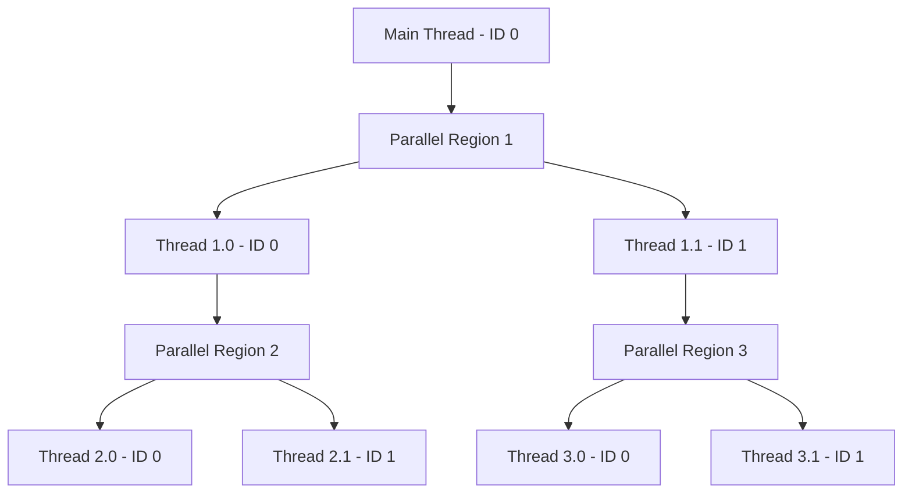

##### Work-Sharing Constructs

Work-sharing constructs divide the execution of a parallel region among the threads.

The most common work-sharing construct is the `for` directive, which distributes the iterations of a loop among the threads:

```c
#pragma omp for [schedule(<type>[, <chunk_size>])] [nowait]
{
    // Loop to be parallelized
}
```

Where:

- `schedule`: defines how iterations are divided among threads:
  - `static`: iterations are divided into chunks of equal size and assigned to threads in a round-robin fashion;
  - `dynamic`: iterations are assigned to threads dynamically as they finish their work, with optional chunk size;
  - `guided`: similar to dynamic scheduling, but the chunk size decreases over time;
- `nowait`: allows threads to proceed without waiting for all threads to finish the loop.

Another work-sharing construct is the `sections` directive, which allows different sections of code to be executed by different threads:

```c
#pragma omp sections
{
    #pragma omp section
    {
        // Code for section 1
    }
    #pragma omp section
    {
        // Code for section 2
    }
}
```

Where each `section` is executed by a different thread.

It's also possible to use the `single` directive to specify that a block of code should be executed by only one thread:

```c
#pragma omp single
{
    // Code executed by a single thread
}
```

Or the `master` directive to specify that a block of code should be executed by the master thread only:

```c
#pragma omp master
{
    // Code executed by the master thread
}
```

##### SIMD Vectorization

OpenMP provides the `simd` directive to enable vectorization of loops, allowing multiple data points to be processed in parallel by a single thread using SIMD instructions:

```c
#pragma omp simd [safelen(<length>)]
{
    // Loop to be vectorized
}
```

Where:

- `safelen`: specifies the maximum number of iterations that can be safely executed in parallel without data dependencies.

To separate the vector between threads it's possible to use the `parallel for simd` directive, which combines parallelization and vectorization:

```c
#pragma omp parallel for simd [schedule(simd:<type>[, <chunk_size>])]
{
    // Loop to be parallelized and vectorized
}
```

Where the `schedule` clause works the same as in the `for` directive.

To declare a function to use SIMD vectorization, the `declare simd` directive is used:

```c
#pragma omp declare simd [uniform(var [, var2])] [linear(var [, var2]: <step>)] [inbranch|notinbranch]
<return_type> function_name(<parameters>);
```

Where:

- `uniform`: specifies that the variable is the same for all SIMD lanes;
- `linear`: specifies that the variable changes linearly across SIMD lanes with a given step;
- `inbranch`: indicates that the function may be called in a branch, requiring additional handling for divergent execution;
- `notinbranch`: indicates that the function is never called in a branch, allowing for better optimization.

##### Synchronization

OpenMP provides several synchronization mechanisms to coordinate the execution of threads.

The `critical` directive defines a critical section that can be executed by only one thread at a time:

```c
#pragma omp critical
{
    // Code executed by one thread at a time
}
```

The `barrier` directive synchronizes all threads in a parallel region, making them wait until all threads reach the barrier:

```c
#pragma omp barrier
```

The `atomic` directive ensures that a specific memory operation is performed atomically, preventing race conditions:

```c
#pragma omp atomic
variable += value;
```

##### Data Environment

OpenMP allows to specify the scope of variables in parallel regions using data-sharing attributes:

```c
#pragma omp <directive> private(var [, var2])
```

All the variable defined in the `private` clause are private to each thread, meaning that each thread has its own copy of the variable.

```c
#pragma omp <directive> shared(var [, var2])
```

All the variable defined in the `shared` clause are shared among all threads, meaning that all threads access the same memory location for the variable.

This is the default behavior.

```c
#pragma omp <directive> firstprivate(var [, var2])
```

All the variable defined in the `firstprivate` clause are private to each thread, but they are initialized with the value of the variable before entering the parallel region.

```c
#pragma omp <directive> lastprivate(var [, var2])
```

All the variable defined in the `lastprivate` clause are private to each thread, but after the parallel region, the value of the variable from the last iteration is copied back to the original variable.

It is possible to override the default data-sharing attributes using the `default` clause:

```c
#pragma omp <directive> default(shared|none)
```

If `shared` is specified, all variables are shared by default. If `none` is specified, all variables must be explicitly declared with a data-sharing attribute.

To perform reductions on variables, OpenMP provides the `reduction` clause:

```c
#pragma omp <directive> reduction(<operator>: var [, var2])
```

Where `<operator>` can be one of the following: `+`, `-`, `*`, `/`, `&`, `|`, `^`, `&&`, `||`, `max`, `min`.

##### Memory Model

OpenMP follows a relaxed memory model, which means that there are no guarantees about the order in which memory operations are performed across different threads.

To ensure memory consistency, OpenMP provides the `flush` directive that must be executed by all the threads, which enforces a memory synchronization point:

```c
#pragma omp flush([var [, var2]])
```

##### Thread Cancellation

OpenMP supports thread cancellation, allowing threads to be terminated before they complete their execution.

To cancel a thread, the `cancel` directive is used:

```c
#pragma omp cancel <construct>
```

Where `<construct>` can be one of the following: `parallel`, `for`, `sections`, `task`, `taskgroup`.

Other threads can check for cancellation points using the `cancellation point` directive:

```c
#pragma omp cancellation point <construct>
```

If other threads have issued a cancel directive for the same construct, the thread will terminate at the cancellation point.

This check is also performed at `barrier` directives.

##### Tasks

OpenMP supports task-based parallelism, allowing the creation of independent units of work that can be executed by different threads.

Tasks are useful for irregular parallelism and dynamic workloads.

```c
#pragma omp task depend(out: var [, var2]) depend(in: var3 [, var4])
{
    // Code for the task
}
```

Where:

- `depend`: specifies the dependencies of the task:
  - `out`: variables that the task will produce (write);
  - `in`: variables that the task will consume (read).

It is possible to create a task group using the `taskgroup` directive, which allows to group multiple tasks together:

```c
#pragma omp taskgroup
{
    // Code for the task group
}
```

To synchronize tasks, the `taskwait` directive is used to make the current task wait until all its child tasks have completed.

```c
#pragma omp taskwait
```

To use tasks in a parallel region, the `taskloop` directive is used to distribute loop iterations among tasks:

```c
#pragma omp taskloop [grainsize(<size>)] [num_tasks(<num>)]
{
    // Loop to be parallelized with tasks
}
```

Where:

- `grainsize`: specifies the minimum number of iterations per task;
- `num_tasks`: specifies the total number of tasks to be created.

#### CUDA

CUDA (Compute Unified Device Architecture) is a parallel computing platform and programming model developed by Nvidia for general-purpose computing on Nvidia GPUs.

It allows developers to leverage the massive parallel processing power of GPUs for computationally intensive tasks.

#### OpenCL

OpenCL (Open Computing Language) is an open standard for parallel programming of heterogeneous systems, including CPUs, GPUs, and FPGAs, hiding the hardware specifics.

Hiding hardware specifics can lead to suboptimal performance compared to platform-specific solutions.

#### Apache Spark

Apache Spark is an open-source distributed computing system designed for big data processing and analytics.

Abstract parallelization and communication.

#### Comparison of Parallel Technologies

| Technology     | Type                          | Target               | Memory model              |
| -------------- | ----------------------------- | -------------------- | ------------------------- |
| Verilog / VHDL | Hardware Description Language | ASIC/FPGA            | Hardware-level            |
| MPI            | Library                       | Multi-CPUs (Cluster) | Message Passing           |
| Pthread        | Library                       | Multi-core CPU       | Shared Memory             |
| OpenMP         | C/Fortran Extension           | Multi-core CPU       | Shared Memory             |
| CUDA           | C Extension                   | Nvidia GPU + CPU     | Shared Memory             |
| OpenCL         | C/C++ Extension & API         | CPU/GPU/FPGA         | Distributed Shared Memory |
| Apache Spark   | API                           | Cluster              | Distributed               |

| Technology     | Parallelism         | Bit   | Instruction | Task  | Communication       |
| -------------- | ------------------- | ----- | ----------- | ----- | ------------------- |
| Verilog / VHDL | Explicit            | Yes   | Yes         | No    | Explicit            |
| MPI            | Implicit            | (Yes) | (Yes)       | Yes   | Explicit            |
| Pthread        | Explicit            | (Yes) | (Yes)       | Yes   | Implicit            |
| OpenMP         | Explicit            | (Yes) | (Yes)       | Yes   | Implicit            |
| CUDA           | Implicit (Explicit) | (Yes) | No          | (Yes) | Implicit (Explicit) |
| OpenCL         | Explicit/Implicit   | (Yes) | No          | Yes   | Explicit/Implicit   |
| Apache Spark   | Implicit            | (Yes) | No          | (Yes) | Implicit            |

## Parallel Programming Design

Designing a **parallel algorithm** starts by understanding the problem, analyzing the dependencies, and identifying opportunities for parallelism in a machine-independent environment.

After that, it's possible to design a **parallel program** selecting the architecture, the language, communication model, etc.

### PCAM Methodology

A common methodology to design parallel algorithms is the **PCAM** (Partitioning, Communication, Agglomeration, Mapping) methodology.

#### PCAM - Partitioning

The goal of this phase is to identify the parallelism in the problem by decomposing the problem into a large number of smaller tasks. This done with two approaches:

- **Domain (Data) Decomposition**: Decompose the data into smaller chunks that can be processed independently.
- **Functional Decomposition**: Decompose a problem into task without dependencies with each other.

Some guidelines for partitioning:

- The number of tasks should exceed the number of processors to ensure efficient utilization and overlap of computation and communication.
- Avoid redundant computation and storage to enhance scalability.
- Each task should perform a similar amount of work to balance the load across processors.
- The number of tasks should scale with the problem size, in line with Gustafson's Law.

#### PCAM - Communication

If tasks need to exchange data, define the communication model to ensure efficient data transfer and synchronization.

Communication can be classified based on several criteria:

- **Local or Global**: Local communication avoids overhead by minimizing data movement, improving performance.
- **Structured or Unstructured**: Structured communication organizes data access regularly, enhancing predictability and efficiency.
- **Static or Dynamic**: Static communication has fixed quantities and partners, while dynamic communication determines them at runtime based on conditions.
- **Implicit or Explicit**: Implicit communication uses shared memory, whereas explicit communication relies on message passing.
- **Synchronous or Asynchronous**: Synchronous communication requires acknowledgment before proceeding, while asynchronous allows continuation without waiting.
- **Point-to-Point or Collective**: Point-to-point involves direct exchange between two tasks, whereas collective communication engages multiple tasks simultaneously.

Communication overhead can degrade performance compared to sequential execution. To mitigate this, overlap communication with computation where possible. Balance the load by ensuring each task transfers roughly the same amount of data, and minimize conflicts between communication and computation phases.

#### PCAM - Agglomeration

This step transitions from abstract parallel tasks to concrete implementation by grouping smaller tasks into larger ones.

The goal is to reduce the number of tasks to increase the granularity, minimizing communication overhead and improving load balancing.

#### PCAM - Mapping

This phase assigns each task to a specific processor in the target architecture.

- Placing tasks on different processors increase the physical parallelism, but also the communication overhead.
- Grouping tasks on the same processor reduce communication overhead, but also the physical parallelism.

Mapping is NP-Complete, so heuristics are used to find a good solution:

- **Static Mapping**: Tasks are assigned to processors before execution based on estimated workloads and communication patterns.
- **Dynamic Mapping**: Tasks are assigned to processors by a runtime load balancer during execution.

### Memory Architecture

Parallel architectures can be classified based on their memory model:

- **Shared Memory**: All processors share a common address space, allowing direct access to shared data. This model simplifies programming but can lead to contention and synchronization issues.
- **Distributed Memory**: Each processor has its own private memory, and data is exchanged through message passing. This model scales well but requires explicit communication management.
- **Hybrid Memory**: Combines shared and distributed memory models, often seen in clusters of multi-core processors.

### Thread

Inside of a process the memory is divided into:

- **Kernel Space**: Reserved for the operating system and low-level system functions.
- **User Space**: Used by user applications, further divided into:
  - **Stack**: Stores local variables and function call information.
  - **Heap**: Used for dynamic memory allocation.
  - **Data Segment**: Contains global and static variables.
  - **Text Segment**: Contains the executable code of the program.

Each thread has its own stack, while the heap and data segment are shared among all threads in a process.

The main advantage of threads is the low overhead to create and manage them, as they share the same memory space.

The thread execute independently, making them non-deterministic, but need synchronization when accessing shared data to avoid problems like:

- **Race Condition**: Two or more threads access shared data concurrently, and at least one thread modifies the data, leading to inconsistent results.
- **Deadlock**: Two or more threads are blocked forever, each waiting for the other to release a resource.
- **Livelock**: Two or more threads continuously change their state in response to each other without making progress.
- **Starvation**: A thread is perpetually denied access to resources it needs to proceed, often due to other threads monopolizing those resources.

Synchronization can be done with:

- **Mutex**: A mutual exclusion lock that allows only one thread to access a resource at a time.
- **Semaphore**: A signaling mechanism that controls access to a resource pool, allowing multiple threads to access a limited number of instances of a resource.
- **Barrier**: A synchronization point where threads must wait until all threads reach the barrier before any can proceed.
- **Condition Variable**: A synchronization primitive that allows threads to wait for certain conditions to be met before proceeding.

### Dependencies

A parallel program must be _correct_, meaning that the result must be the same of the sequential version.

A **dependency** arise when the order of two statements $S1$ and $S2$ affect the final result.

There are three types of dependencies:

- **True (flow) dependency**: $S2$ depend on the result of $S1$ (Read after Write - RAW);
- **Output dependency**: both $S1$ and $S2$ write to the same variable (Write after Write - WAW);
- **Anti-dependency**: $S1$ read a variable and $S2$ write to the same variable (Write after Read - WAR).

The Output dependency and Anti-dependency are _name_ dependencies, meaning that they depend only on the variable names, not on the actual values. Name dependencies can be removed by renaming variables.

Dependencies can be represented with a **dependence graph**, where nodes are instructions and edges are dependencies. Dependencies can be detected by comparing the $IN$ and $OUT$ sets of each instruction.

#### Loop Dependencies

Loops are a major source of parallelism, but there can be dependencies between different iterations of the loop. Based on the dependencies it's possible to classify loops into:

- **DoAll Loops**: All iterations are independent and can be executed in parallel.
- **Loop-Carried Dependencies**: All the iterations depend on the previous one (e.g. `a[i] = a[i-1] + 1`), making parallelization impossible, but may allow pipelining.
- **Loop-Independent Dependencies**: Dependencies exist within the same iteration, but not between iterations (e.g. `a[i] = a[i + 10] + 2`), allowing partial parallelization.

The dependency can be:

- **Lexical forward** if the source came before the sink in the code;
- **Lexical backward** if the source came after the sink in the code;

## Parallel Patterns

Parallel patterns are recurring strategies for organizing parallel computations. They can be categorized into structural patterns (like nesting) and control patterns (how tasks are orchestrated).

Patterns can be **nested**, involving organizing tasks in a hierarchical structure. A task may spawn sub-tasks, which in turn may spawn further sub-tasks.

### Control Patterns

Control patterns define how tasks are ordered and executed. While serial programming relies on sequence, selection, iteration, and recursion, parallel programming adapts these concepts to allow concurrent execution.

#### Serial Control Structures

- **Sequence**: In serial execution, tasks run one after another ($A \to B$). In parallel, a sequence implies a dependency where $B$ cannot start until $A$ finishes.
- **Selection**: In serial execution, a condition determines which branch to take (if-else). In parallel execution, **speculative execution** allows multiple branches to run concurrently before the condition is fully evaluated, discarding the incorrect results later.
- **Iteration**: In serial execution, loops run sequentially. In parallel execution, iterations can be distributed across processors (**Parallel Loop**), provided there are no loop-carried dependencies.
- **Recursion**: In serial execution, functions call themselves sequentially. In parallel execution, recursive calls can be spawned as independent tasks (e.g., in Merge-sort), operating on distinct data subsets.

#### Fork-join

**\*Fork-Join** is a parallel programming model where a task is divided into multiple subtasks (fork) that are executed concurrently, and then the results are combined (join) once all subtasks are complete.

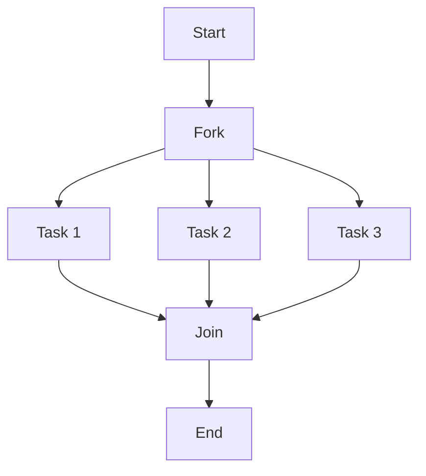

#### Map

**Map** is a pattern that applies a given function to each element of a collection independently.

Thanks to the independence of each operation, all the tasks can be executed in parallel.

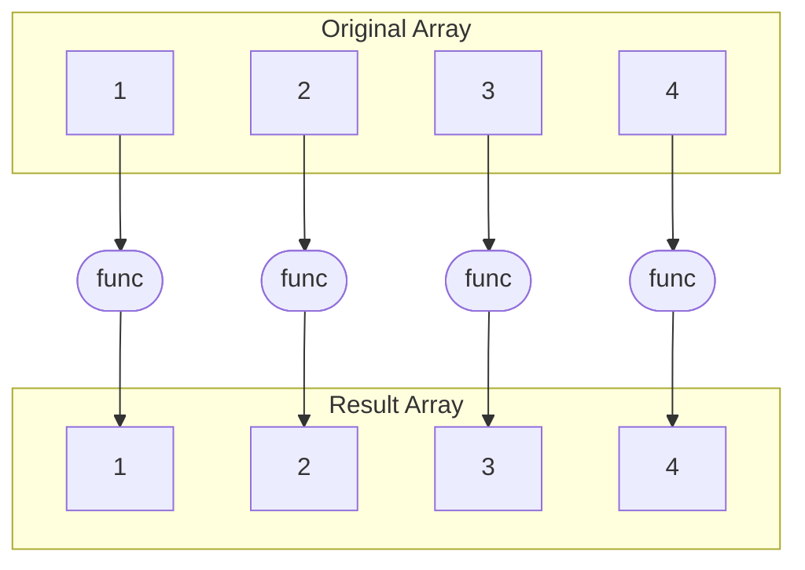

A code example in pseudocode:

```plaintext
function map(collection, func):
    result = new collection of same size
    parallel for each element in collection:
        result[element.index] = func(element)
    return result
```

In a sequential program the complexity is $O(n)$, while in a parallel program with $p$ processors the complexity is $O(\frac{n}{p} + \log p)$, where $\log p$ is the overhead to manage the parallel tasks.

Without overhead the complexity can be $O(1)$.

Map can be unary (single input collection) or n-ary (multiple input collections).

To optimize multiple map it's possible:

- **Fusion**: combine multiple map operations into a single pass over the data, reducing the number of iterations and improving cache performance;
- **Cache Fusion**: group together operations that access the same data to improve cache locality and reduce memory access latency.

#### Stencil

**Stencil** is a generalization of Map, where each element in a grid or array is updated based on a function based on the values of its neighboring elements.

The neighbor are the one before the execution of the function, making the operations independent and parallelizable.

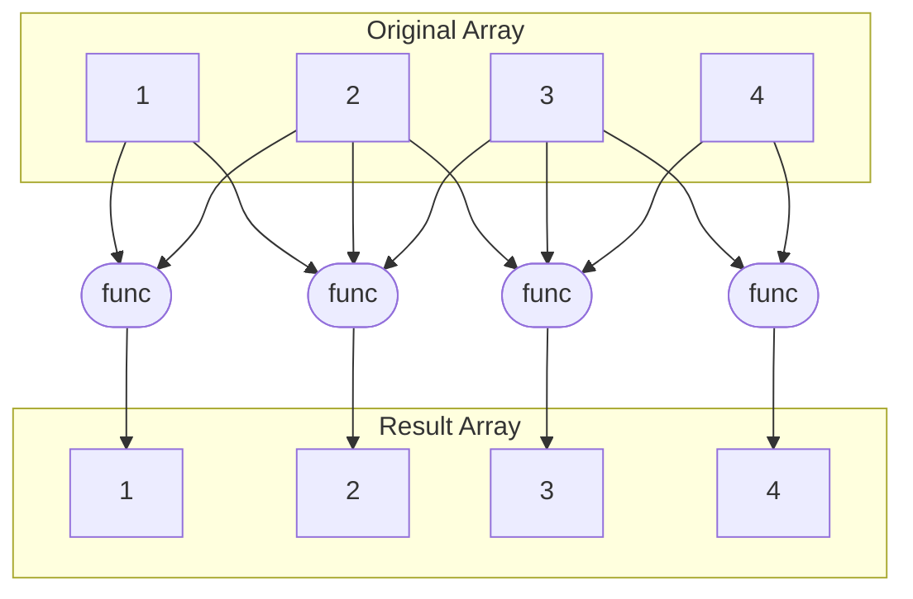

#### Reduce

**Reduce** is a pattern that combines the results of a collection into a single result using a specified operation (e.g., sum, max), allowing for concurrent aggregation of data.

In a parallel program, the collection is divided into smaller chunks, each chunk is reduced independently, and then the intermediate results are combined to produce the final result.

To allow parallelization, the operation must be **associative** (e.g., addition, multiplication) and sometimes **commutative**.

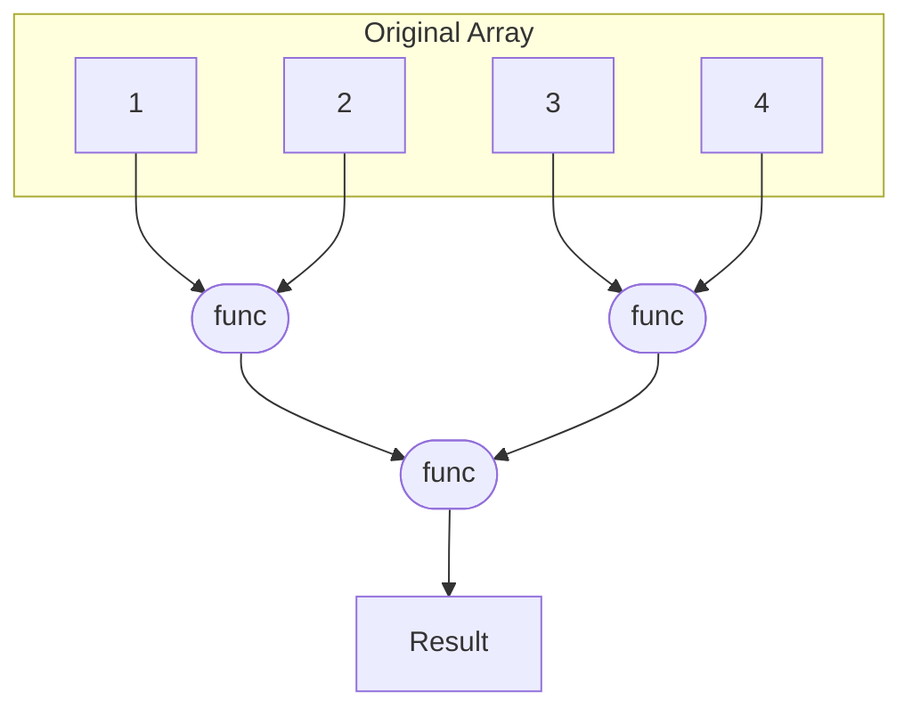

#### Scan

**Scan** is a pattern that computes all the partial reduction results for a sequence of elements, allowing for concurrent computation of prefix sums or other associative operations.

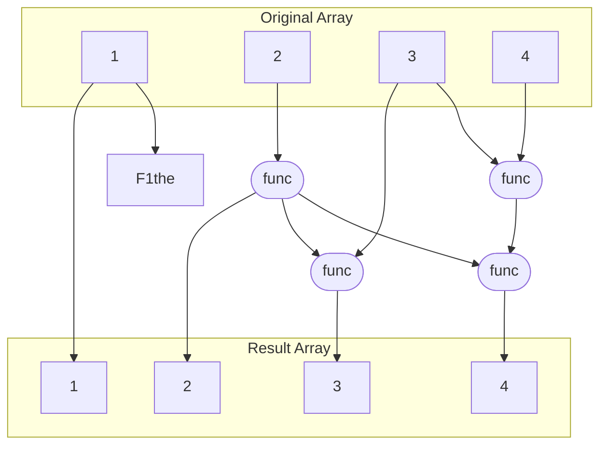

#### Recurrence

**Recurrence** is a more complex version of the _map_ where the computation of an element depends on the results of previous elements.

To be computed there must be serial order of the elements.

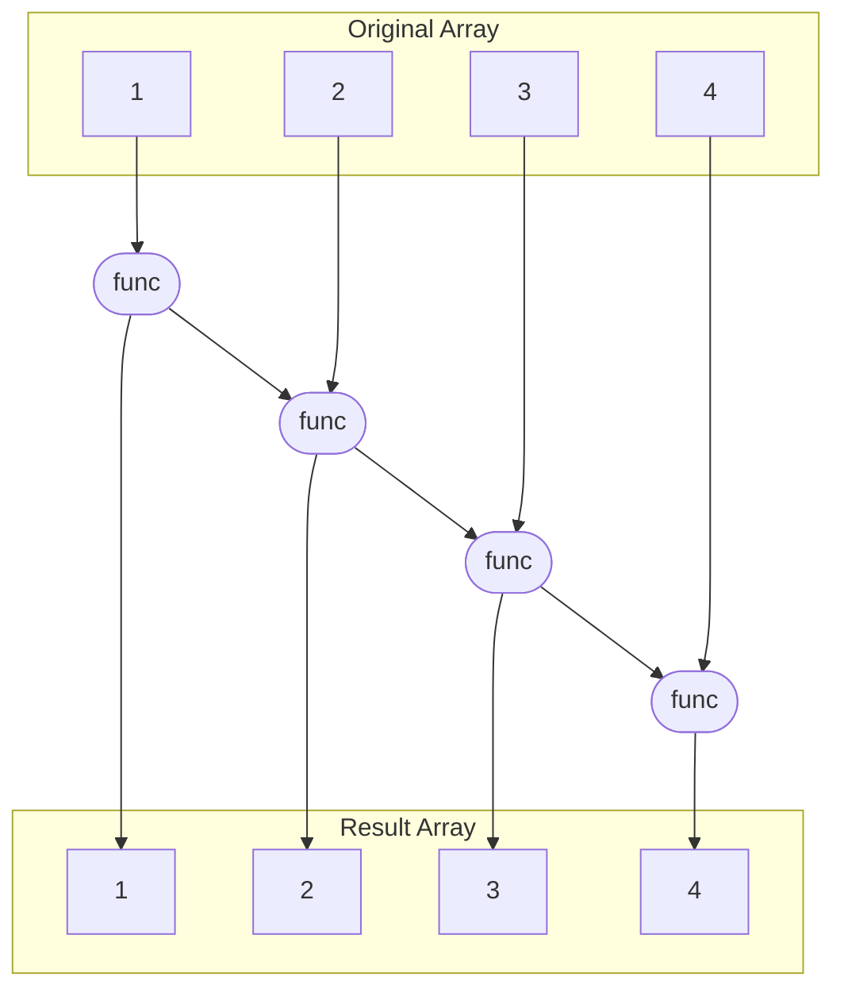

### Data Management Pattern

Data management patterns focus on how data is organized, accessed, and manipulated in parallel computing environments. Efficient data management is crucial for performance and scalability.

Data movement is often more expensive than computation, so minimizing data transfer and optimizing data locality are key considerations.

When dealing with structures and arrays it's possible to have:

- **Array of Structures (AoS)**: Each element is a structure containing multiple fields. This layout is intuitive and easy to use and is good for cache on random access patterns.
- **Structure of Arrays (SoA)**: Each field of the structure is stored in a separate array. This layout is good for vectorized operations.

#### Serial Data Management Patterns

In serial programming, data can be managed in various ways:

- **Random Read/Write**: Allows direct access to any memory location at any time, typically using pointers. This flexibility enables efficient data manipulation but can lead to aliasing issues, where multiple pointers reference the same location, complicating parallelization due to potential race conditions.
- **Stack Allocation**: Memory is managed in a last-in-first-out (LIFO) manner, ideal for local variables and function calls. Allocation and deallocation are fast and automatic, preserving data locality and simplifying management. Each thread in a parallel context maintains its own stack, ensuring isolation.
- **Heap Allocation**: Supports dynamic memory allocation and deallocation during runtime. While powerful for variable-sized data structures, it introduces overhead and complexity, such as fragmentation and manual management. In parallel programs, threads may use separate heap pools to avoid contention.
- **Objects**: Encapsulate data and behavior, promoting modularity. In serial code, objects handle state changes predictably, but in parallel environments, shared objects require synchronization to prevent concurrent access issues.

#### Pack

**Pack** is a pattern that involves reorganizing data to eliminate unused or irrelevant elements, thereby reducing memory usage and improving cache performance.

To restore the original structure, an **unpack** operation is performed, which reinserts the unused elements back into their original positions.

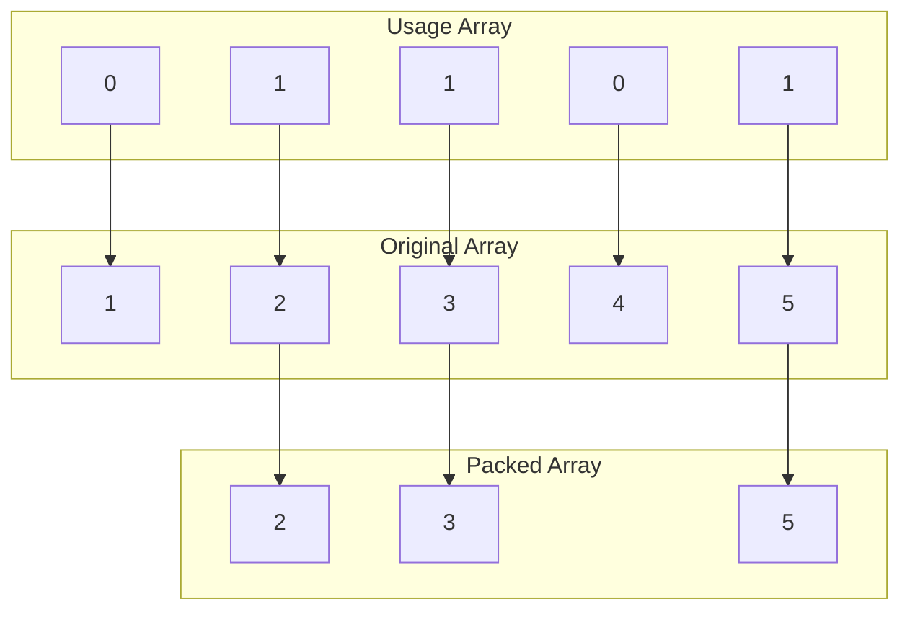

A parallel pseudocode implementation for a PRAM model:

```plaintext
function pack(original, usage):
    n = length(original)
    m = count(usage == 1)

    mask_sum = new array of size n
    result = new array of size m

    mask_sum[0] = 0

    // Compute prefix sum of usage array using ex scan

    parallel for i from 0 to n-1:
        if usage[i] == 1:
            result[mask_sum[i]] = original[i]

    return result
```

Some special cases of the pack pattern are:

- **Split**: where the data is divided into two separate arrays based on a condition on the independent elements;
- **Bin**: where the data is divided into multiple arrays (bins) based on a range of values.

```plaintext
function bin(original, group):
    n = length(original)
    k = max(group) + 1

    prefix_mask = new matrix of size k x n
    offsets = new array of size k

    // Initialize offsets
    parallel for i from 0 to k-1:
        offsets[i] = 0

    // Count elements for each bin
    parallel for i from 0 to n-1:
        offsets[group[i]] += 1

    // Compute prefix sum for prefix_mask using parallel exclusive scan
    parallel for i from 0 to k-1:
        prefix_mask[i] = scan(prefix_mask, func: (a, b) => a + b) // this is wrong

    result = new array of size n

    // Distribute elements into bins
    parallel for i from 0 to n-1:
        position = offsets[original[i]] + prefix_mask[original[i]][i]
        result[position] = original[i]

    return result
```

#### Pipeline

**Pipeline** is a pattern that divides a task into a series of stages, where each stage processes data and passes it to the next stage. This works in a producer-consumer way.

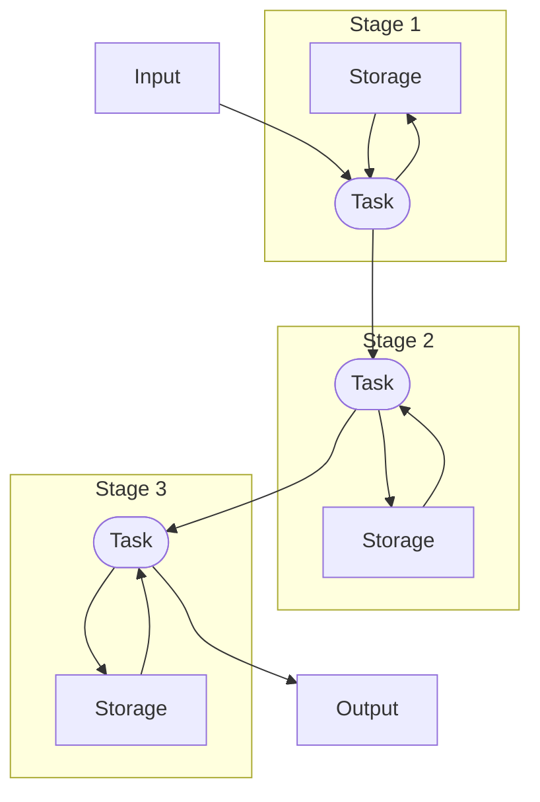

#### Geometric Decomposition

**Geometric Decomposition** is a pattern that divides a large data structure (e.g., array, matrix) into smaller substructures that can be processed independently in parallel.

The substructures can be overlapping.

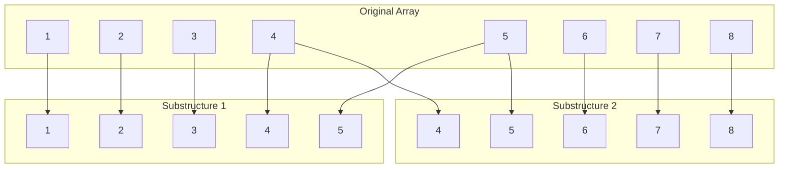

On shared memory is possible to avoid data duplication by sharing the regions.

#### Gather

**Gather** is a pattern that collects elements from a source array into a destination array. The index array specifies the positions of the elements to be gathered from the source array.

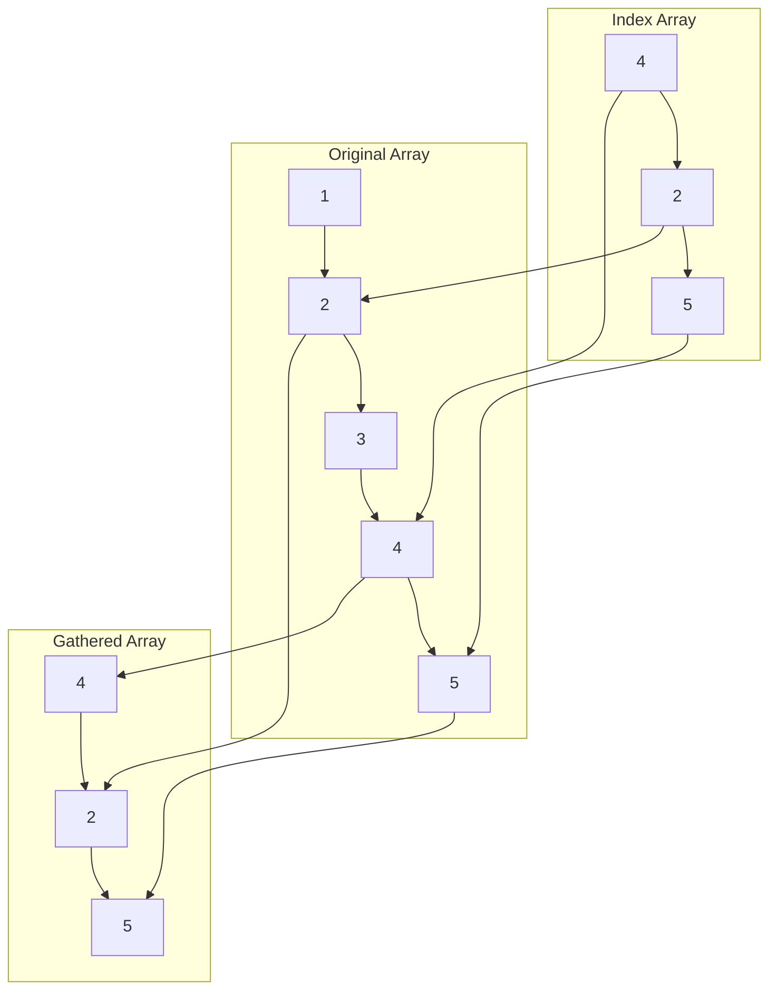

A parallel pseudocode implementation for a PRAM model:

```plaintext
function gather(original, usage):
    n = length(usage)
    result = new array of size n

    parallel for i from 0 to n-1:
        result[i] = original[usage[i]]

    return result
```

Some special cases of the gather pattern are:

- **Shift**: where each element is moved by a fixed offset;
- **Zip**: where n arrays are interleaved into a single array;
- **Unzip**: where a single array is split into n arrays by separating elements based on an offset;

#### Scatter

**Scatter** is a pattern that distributes elements from a source array into a destination array. The index array specifies the positions where the elements from the source array should be placed in the destination array.

Scatter can lead to collisions if two elements are scattered to the same position. This can be resolved by:

- **Atomic Scatter**: using atomic operations to ensure that only one write occurs at a time for each position;
- **Permutation Scatter**: check for collisions in the index array and avoid them by reordering the input data or using a different index array;
- **Merge Scatter**: allow multiple writes to the same position and combine them using a specified operation (e.g., sum, max).
- **Priority Scatter**: assign priorities to the elements being scattered and only allow the highest priority element to be written to a position in case of collisions.

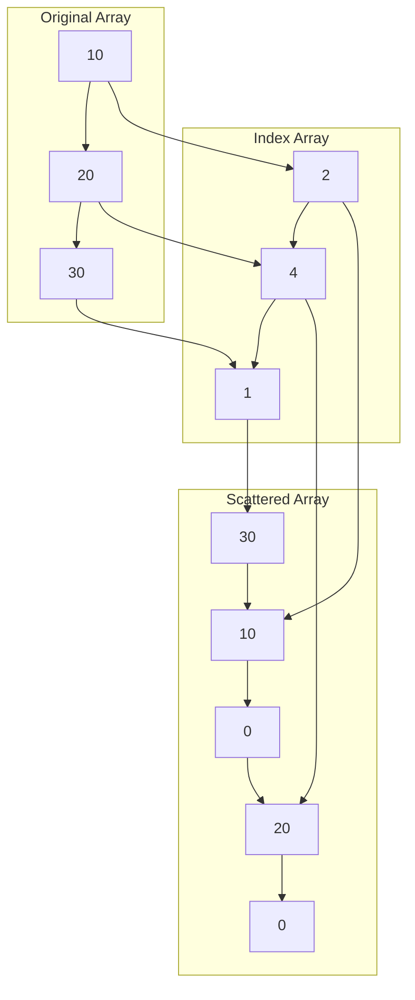

A parallel pseudocode implementation for a PRAM model:

```plaintext
function scatter(original, usage, result):
    n = length(original)

    parallel for i from 0 to n-1:
        result[usage[i]] = original[i]
```
