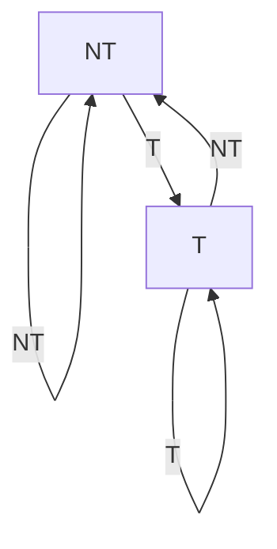
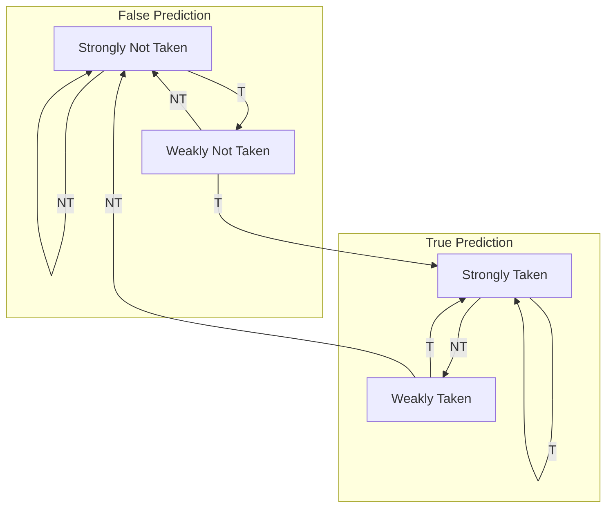
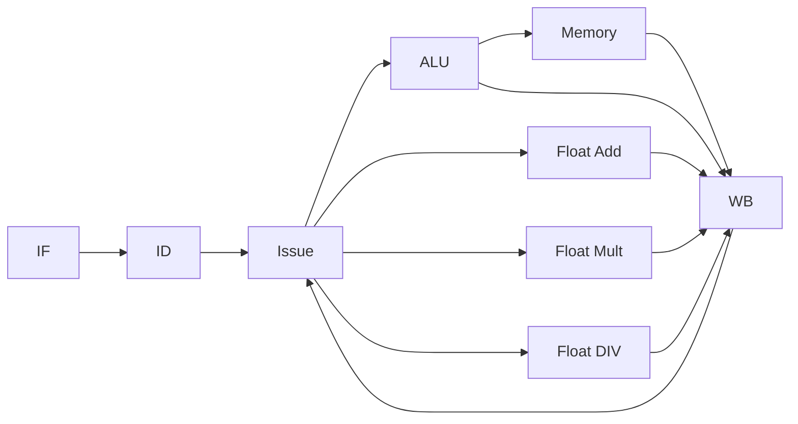
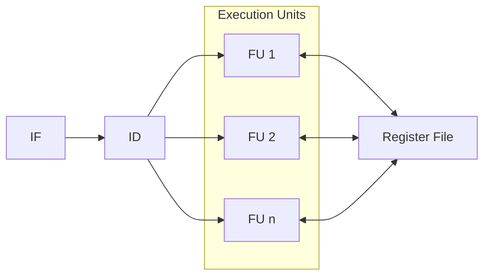
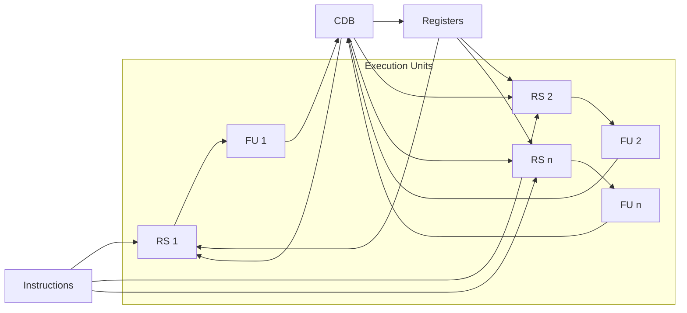

Computer architecture is fundamentally about **trade-offs**: every design decision involves balancing competing goals.

## Performance Metrics

Performance cannot be reduced to a single number. Instead, different metrics capture different aspects:

**Time-Based Metrics:**

- **Latency**: Time for a single operation to complete (relevant for interactive applications)
- **Throughput**: Operations completed per unit time (relevant for batch processing and servers)

**Frequency and Instruction Execution:**

- **CPI (Cycles Per Instruction)**: The average number of clock cycles required to execute one instruction. This directly reflects how efficiently the architecture executes code. It is based on the ideal CPI (theoretical minimum) and structural hazards, data hazards, and control hazards.
- **Clock Speed**: The frequency at which the CPU operates, measured in GHz. Raw frequency says little about real-world performance.

$$\text{Performance} = 1 / (\text{Clock Speed} × \text{CPI})$$

**Throughput-Oriented Metrics:**

- **Throughput**: Instructions executed per unit time
- **MIPS (Million Instructions Per Second)**: Useful for comparing general-purpose performance
- **MFLOPS (Million Floating Point Operations Per Second)**: Useful for scientific and graphics workloads

**Power Consumption:**

Energy efficiency is critical because:

- Heat dissipation limits clock speed
- Battery life constrains mobile devices
- Data center operational costs are dominated by power

### Comparing Architectures

Two architectures can be compared using two main approaches:

#### Speedup

The **speedup** of a new architecture compared to a baseline is calculated as:

$$\text{Speedup} = \frac{\text{Execution Time}_{\text{baseline}}}{\text{Execution Time}_{\text{new}}} = 1 + \frac{n}{100}$$

If Architecture A is 20% faster than B: $\text{Speedup} = 1.2$

#### Testing

An architecture can be tested using two types of programs:

- **Benchmark**: Standardized, reproducible test suite (e.g., SPEC CPU)
- **Workload**: Real-world application mix representative of actual use

### Design Trade-offs by Use Case

Different devices prioritize different metrics:

| Use Case | Goal | Constraint |
| ---------- | ------------- | ------------ |
| Mobile | Power efficiency, Latency (responsiveness) | Heat dissipation |
| Desktop | Cost-performance ratio | Reasonable power |
| Server | Throughput, Reliability | Power density |
| Embedded | Latency, Power | Size/cost |

### Heterogeneous Architectures

Modern systems often combine multiple types of processors, each optimized for different workloads:

- **CPU**: General-purpose, low latency
- **GPU**: High throughput for parallel tasks (graphics, ML)
- **TPU**: Specialized for tensor operations in ML
- **FPGA**: Reconfigurable hardware for custom workloads

## Processor Architecture and Execution

### Instruction Set Architecture (ISA)

The ISA defines the set of instructions that a processor can execute, along with the data types, registers, and memory addressing modes. It serves as the interface between software and hardware.

The most common ISAs include:

- **MIPS**: A simple, RISC architecture used in education and embedded systems
- **x86**: A complex, CISC architecture dominant in desktops and servers
- **ARM**: A RISC architecture widely used in mobile and embedded devices
- **RISC-V**: An open-source ISA gaining popularity for research and custom designs

### Computing Infrastructure

A cpu is composed of two main components:

- **Control Unit**: Decodes instructions and generates control signals to orchestrate instruction execution
- **Data Path**: Contains the registers, ALU, and memory interfaces that perform actual data processing

The **main memory** stores both instructions and data that the CPU needs to access during execution.

The CPU and main memory communicate via three key buses:

- **Address Bus**: Carries memory addresses from the CPU to memory
- **Data Bus**: Carries data between the CPU, memory, and registers
- **Control Bus**: Carries control signals from the control unit to coordinate all components

#### Instruction Stages

The execution of an instruction can be broken down into several stages:

1. **Fetch (F)**: Load instruction from memory into the Instruction Register (IR)
2. **Decode (D)**: Interpret the instruction — determine operation and identify operands
3. **Execute (E)**: Perform the operation (ALU computation, address calculation, etc.)
4. **Memory Access (M)**: Access memory if the instruction requires it (load/store)
5. **Write-back (W)**: Store the result back to the registers

#### Instructions

The ISA defines a set of instructions that the processor can execute, such as:

| Instruction Type | IF (2 ns) | ID (1 ns) | EX (2 ns) | MEM (2 ns) | WB (1 ns) | Total Time |
| ---------------- | -- | -- | -- | --- | -- | -- |
| ALU | fetch instruction from memory & increase PC to next instruction | read source registers (rs1, rs2) | perform the operation in the ALU | | write to the destination register (rd) | 6 ns |
| Memory Load | fetch instruction from memory & increase PC to next instruction | read base register (rs1) | compute effective address | read memory | load data into destination register (rd) | 8 ns |
| Memory Store | fetch instruction from memory & increase PC to next instruction | read base register (rs1) and source register (rs2) | compute effective address | write memory | | 7 ns |
| Conditional Jump | fetch instruction from memory & increase PC to next instruction | read source registers (rs1, rs2) | compare rs1 and rs2 & compute target address | Update PC | | 5 ns |

Each instruction type requires different execution time depending on the stages it uses.

**Single-cycle architecture**: All instructions complete in one cycle, but the cycle time is constrained by the longest instruction (8 ns in the example above).

**Multi-cycle architecture**: By dividing execution into separate stages with individual latches between them, each stage operates on a shorter cycle time (2 ns).

### Pipelining

**Pipelining** is a technique that overlaps the execution stages of multiple instructions, enabling them to be processed simultaneously. While a single instruction takes longer to complete, the overall system throughput improves dramatically: instead of issuing one instruction every 8ns, the pipeline issues one instruction every 2ns once it reaches steady state.

Latches between each pipeline stage store intermediate results and control signals. As one instruction moves to the next stage, the following instruction enters the current stage.

#### Hazards

Hazards are situations where the next instruction has a dependency on the previous instruction that has not yet completed.

There are three main types of hazards:

##### Structural Hazards

**Structural Hazards** occur when the hardware resources required by an instruction are not available at the time it needs them. This can happen when multiple instructions try to use the same resource simultaneously.

For example there is a WB and a ID stage where both need to access the register file, if the register file can only handle one access at a time, this creates a structural hazard.

This is solved by splitting the write and read between two different stages within the same cycle, so that the register file can handle both accesses without conflict. (ID happens during rising edge, WB happens during falling edge)

This can be solved by increasing the number of hardware resources, but this increases cost and complexity.

##### Data Hazards

**Data Hazards** occur when an instruction depends on data from a previous instruction that has not yet been written to the register file. This is the most critical hazard type because it can cause incorrect computation. There are three subtypes:

- **Read After Write (RAW)**: An instruction reads a register before a previous instruction has written to it. Example: Instr1 writes R1, Instr2 reads R1. This is the _only true data hazard_ that causes incorrect results if unhandled.
- **Write After Read (WAR)**: An instruction writes to a register before a previous instruction has finished reading from it. Example: Instr1 reads R1, Instr2 writes R1. The read must complete before the write.
- **Write After Write (WAW)**: Two instructions write to the same register, and their order matters. Example: Instr1 writes R1, Instr2 writes R1. Just need to ensure the correct order of writes.

**Solutions for RAW hazards**:

1. **Stalling** (inserting bubbles): The pipeline inserts **NOP** (no operation) instructions to delay dependent instructions until the result is available. This is simple but wasteful.
2. **Compiler rescheduling**: The compiler reorders instructions to place independent instructions between dependent ones, keeping the pipeline busy. Example: Load R1, [independent instruction], Use R1.
3. **Forwarding**: An hardware optimization that passes results directly from one pipeline stage to another, bypassing the register file. Common forwarding paths:
    - **EX→EX**: Result from Execute stage forwarded to the next instruction's Execute stage
    - **MEM→EX**: Result from Memory stage forwarded to the next instruction's Execute stage  
    - **MEM→ID**: Result from Memory stage forwarded to the next instruction's Decode stage

Forwarding eliminates many data hazards without stalling, but some load instructions still require one stall.

##### Control Hazards

When a branch instruction is encountered, the processor must decide whether to follow the true branch or false branch. However, the branch outcome is not known until the condition is evaluated in the EX stage and the PC is updated in the MEM stage. This means the pipeline has already fetched instructions before knowing which path to take, creating a **control hazard**.

## Branch Prediction

A naive approach to control hazards is to stall the pipeline until the branch outcome is known, but this will incur a significant performance penalty:

- **Stall until resolved**: 3-cycle penalty (simplest but slowest)
- **Forward from EX to IF**: 2-cycle penalty (better)
- **Early branch computation in ID**: 1-cycle penalty by computing the branch outcome and **Branch Target Address** (BTA) in the ID stage (faster, but can introduce new RAW hazards)

The presence of branches will change the ideal CPI from 1 to $1 + (\text{branch frequency} \times \text{misprediction penalty})$.

Another approach is to **speculatively fetch** instructions from the predicted path of the branch before the actual outcome is known. This technique is called **Branch Prediction** and if correct, there is **zero penalty**, if wrong, the pipeline flushes and resumes with a **2-cycle misprediction penalty**. The accuracy of prediction is critical to overall performance.

Branch prediction can be categorized into two main types:

### Static Branch Prediction

Static prediction determines the branch outcome at compile time. The prediction is **fixed** for each branch instance and encoded into the binary. This requires no hardware support for tracking branch history.

Some techniques for static branch prediction include:

- **Branch Always Not Taken**: The compiler assumes that the probability of a jump is low, so the branch will not be taken, and it fetches instructions from the next instruction.
- **Branch Always Taken**: The compiler assumes that the branch will be taken, so it fetches instructions from the branch target address.
- **Backward Taken, Forward Not Taken**: The compiler assumes that backward branches (loops) are taken and forward branches (if statements) are not taken.
- **Profile-Driven Prediction**: The compiler collects runtime profiling information to determine the most likely outcome of each branch and generates code accordingly. This can improve performance but requires additional compilation time.
- **Delayed Branching**: The compiler fills **delay slots** (a fixed number of instruction slots immediately after the branch for its resolution) with independent instructions that execute regardless of the branch outcome. This keeps the pipeline busy while the branch is being resolved. Three strategies:
  - **From Before**: Move an independent instruction that appears before the branch into the delay slot
  - **From Target**: Move an instruction from the branch target (useful when the branch is likely taken)
  - **From Fall-Through**: Use the instruction that would naturally follow (useful when the branch is unlikely)

### Dynamic Branch Prediction

Dynamic prediction determines the branch outcome **at runtime** based on historical patterns. The prediction adapts as the branch behaves, making it highly accurate for repeated patterns.

During the fetch stage, the processor uses two components to predict the branch outcome:

- **Branch History Table (BHT)**: A table indexed by the branch instruction address that stores the most recent outcomes of that branch. It predicts whether the branch will be taken or not taken based on historical behavior. The BHT must be initialized with a default policy (e.g., "all not taken") on startup.
- **Branch Target Buffer (BTB)**: A small cache that stores the target addresses of recently taken branches, indexed by the branch instruction address.

The IF stage uses the BHT to predict the branch outcome and if the prediction is true, it uses the BTB to fetch the BTA instruction. If the prediction is false, it continues fetching the next sequential instruction.

After the execution, these tables are updated based on the actual outcome of the branch, allowing the predictor to learn and improve over time.

As these tables are indexed by the lowest bits of the branch instruction address, they cannot store information for every possible branch, so they are typically small (e.g., 256 entries) it is possible to have collisions where different branches map to the same entry.

The BHT can be seen a state machine:



#### Saturating Counters

With **saturating counters**, the BHT can track not just the last outcome but the last n outcomes, providing a more robust prediction. The prediction only changes after n consecutive mispredictions, which prevents oscillation for branches that alternate between taken and not taken.

The most common implementation is the 2-bit saturating counter, as provides a good balance between accuracy and hardware complexity. This creates four possible states:

- **Strongly Not Taken (SN - 00)**: Very confident the branch will not be taken
- **Weakly Not Taken (WN - 01)**: Likely not taken
- **Strongly Taken (ST - 11)**: Very confident the branch will be taken
- **Weakly Taken (WT - 10)**: Likely taken



#### Correlating Branch Prediction

BHT predictions only consider the branch's own history, but branch outcomes are often correlated to other branches.

**Global History Table (GHT)** captures the history of multiple branches. It tracks the last $k$ branch outcomes (global history). Instead of indexing the BHT solely by the current branch address, it uses also the global history as the index.

A GHT is indicated by the tuple $(m, n)$ where:

- $m$ bits of global history (leading to $2^m$ separate BHTs)
- $n$-bit saturating counters in each BHT

The optimal balance between accuracy and hardware complexity is typically achieved with a $(2, 2)$ predictor, which uses the last 2 branch outcomes and 4 BHTs, each with 2-bit counters. This allows the predictor to capture simple correlations between branches without excessive hardware overhead.

## Instruction Level Parallelism

**Instruction Level Parallelism (ILP)** is the technique of executing multiple instructions concurrently by exploiting instruction independence, meaning they have:

- **No data dependencies**: no RAW, WAR, or WAW hazards
- **No structural dependencies**: instructions do not compete for the same hardware resources
- **No control dependencies**

To enable ILP, modern processors include multiple functional units specialized for different operation types (ALU, memory, floating-point add, floating-point multiply, etc.), each with its own independent pipeline.

### Issue Stage

To exploit ILP, the processor must determine which instructions can execute in parallel. This is done in the **Issue stage**, which is responsible to check for RAW hazards and structural hazards before allowing instructions to proceed to execution.

> The Issue stage will now ensure that there are no WAR and WAW hazards to proceed with the next instruction.



This architecture uses **in-order issue**, meaning that instructions are issued in the order they appear in the program, but they can execute and complete out of order leading to out-of-order write-back that will be happen in the first half of the cycle allowing reading in the second half of the cycle. In case of multiple WB in the same cycle, the older instruction will be executed first.

### Very Long Instruction Words (VLIW)

**VLIW** uses _static scheduling_, where the compiler is responsible for analyzing dependencies and scheduling independent instructions to execute in parallel. The goal is to achieve CPI < 1 by fetching multiple instructions and issuing them at the same time.

This is achieved by encoding multiple operations (4-16, fixed by the architecture) into a single fixed long instruction word (64–256 bits), where each operation corresponds to a specific functional unit. The hardware simply executes the operations specified in the instruction word without needing complex dynamic scheduling logic.

| Time | ALU Operation 1 | ALU Operation 2 | Memory Operation | FP Add Operation | FP Mul Operation |
| ---- | --------------- | --------------- | ---------------- | ---------------- | ----------------- |
| Cycle 1 | Operation A | Operation B | NOP | Operation D | Operation E |
| Cycle 2 | Operation C | NOP | Operation F | Operation G | Operation H |
| Cycle 3 | ... | ... | ... | ... | ... |



#### Static Scheduling

The compiler performs static scheduling by analyzing the instruction stream and determining which instructions can be executed in parallel. The process involves:

1. **Analyze dependencies** between instructions
2. **Schedule independent operations** into appropriate slots
3. **Maximize parallelism** trying to fill all available slots
4. **Insert NOPs** (no-operation) in slots where no independent operation is available to fill the instruction word

The compiler performs scheduling within **dependency-free regions**, where instructions have no dependencies on each other, they can be freely reordered. A **Basic Block** is a sequence of instructions with no branches where the compiler can perform scheduling. A **Trace** is a sequence of basic blocks that include branches.

The compiler needs to perform optimization on these traces to maximize ILP while ensuring correctness.

##### Loop Optimizations

The body of loops are often independent between iterations, allowing some transformations to enable more parallelism.

The structure of a loop can be divided into three parts:

- **Prolog**: Initialization phase where the pipeline fills with instructions
- **Loop iteration**: Steady-state phase (one iteration per cycle after prolog)
- **Epilog**: Cleanup phase where the pipeline drains

**Loop Unrolling:**

The compiler replicates the loop body multiple times, increasing the number of independent instructions available for scheduling. For example, unrolling a loop that iterates 4 times into a single iteration that performs 4 operations can expose more parallelism.

```c
for (int i = 0; i < N; i+=4) {
    A[i] = B[i] + C[i];
    A[i+1] = B[i+1] + C[i+1];
    A[i+2] = B[i+2] + C[i+2];
    A[i+3] = B[i+3] + C[i+3];
}
```

**Loop Pipelining:**

The compiler overlaps the execution of different iterations of the loop, allowing operations from different iterations to execute in parallel. This is achieved by scheduling instructions from iteration $i+1$ before iteration $i$ has completed.

##### Trace Scheduling

Programs are divided into **Basic Blocks** (sequences of instructions with a single entry and exit point and no branches) and **Traces** (sequences of basic blocks that include branches).

Inside a basic block, the compiler can perform aggressive scheduling to maximize ILP. However, basic blocks are often small, limiting the amount of parallelism that can be exploited.

To overcome this, the compiler can perform **trace scheduling**, which allows it to schedule instructions across basic blocks within a trace, effectively treating the entire trace as a single unit for scheduling.

Trace are chosen based on profiling information, selecting the most frequently executed paths through the program. As the path is guessed, the compiler might choose a wrong path, so it needs to insert **compensation code** to ensure correctness in case of misprediction. This compensation code is executed if the actual path taken differs from the predicted path, correcting any side effects of the incorrectly scheduled instructions.

## Dynamic Scheduling

**Dynamic Scheduling** allows the CPU to determine at runtime which instructions can execute in parallel. Unlike VLIW, the hardware dynamically resolves dependencies and issues instructions out of program order.

The hardware must track the status of each functional unit:

| Functional Unit | Busy | Operation | Destination Register | Source Register 1 | Source Register 2 |
|-----------------|------|-----------|----------------------|-------------------|-------------------|
| ALU             | No   |           |                      |                   |                   |
| Memory          | Yes  | LOAD      | R4                   | R5                |                   |

This allows to avoid:

- Structural hazards: by checking if the required functional unit is busy
- RAW hazards: by checking for the source registers of the next instruction in the destination column
- WAR hazards: by checking if destination register of the next instruction is in the source column of any issued instruction
- WAW hazards: by checking if destination register of the next instruction is in the destination column of any issued instruction

### Scoreboard

The **Scoreboard** is a centralized **hazard detection unit** positioned between the instruction fetch/decode and the functional units. It tracks the status of all issued instructions and functional units to determine when instructions can safely proceed through the pipeline without causing hazards.

For each functional unit scoreboard tracks:

- Busy flag (whether it has an instruction)
- Operation being performed
- Destination register
- $S_{j,k}$: The source registers $i$ and $j$ of the instruction
- $Q_{j,k}$: Which FU (if any) has ownership of the source register
- $R_{j,k}$: Whether the source register is still needed by the instruction
  - **Yes**: Register is being used by the instruction in Read or Execute stage
  - **No + $Q_{j,k}$ empty**: Register is free for other instructions to use
  - **No + $Q_{j,k}$ set**: The instruction is waiting for the register to be produced by the FU indicated in $Q_{j,k}$

#### Scoreboard Pipeline

The Scoreboard pipeline is divided into four stages:

1. **Issue**: Decode the instruction and wait if structural hazards or WAW hazards are present.
2. **Read Operands**: Wait until there are no RAW hazards then read the source operands from the register file.
3. **Execute**: Use the functional unit to perform the operation. Each functional unit is characterized by its latency (number of cycles to complete) and the initiation interval (number of cycles before it can accept a new instruction).
4. **Write Result**: Check for WAR hazards before writing the result back to the register file. Only one instruction can write back per cycle, so if multiple instructions complete in the same cycle, the older instruction is given priority.

This allows to achieve out-of-order execution while maintaining in-order issue.

#### Register Renaming

**Register Renaming** eliminates WAR and WAW hazards by mapping **logical registers** (from instructions) to **physical registers** (actual hardware registers). This is done to decouple the instruction's logical register name from the actual hardware storage.

A **Physical Register File (PRF)** that contains many more registers than the logical register set defined by the ISA is introduced. When an instruction is issued, its destination logical register is renamed to an unused physical register. All subsequent instructions that reference that logical register are updated to use the physical register instead.

This is done by introducing a **Freelist**, implemented as a circular buffer, that tracks which physical registers are currently free and can be allocated for new instructions. The Register file need to track the mapping with the logical registers, so that instructions can read the correct physical register.

With this the lifecycle of an instruction is as follows:

1. **Issue**: Allocate a free physical register for the instruction's destination logical register and update the mapping. Old instruction will still reference the old physical register.
2. **Read Operands**: Instructions read from the physical registers based on the current mapping.
3. **Execute**: Perform the operation.
4. **Write-back**: Write the result to the physical register and free the old physical register if it is no longer needed by any instruction.

### Tomasulo Algorithm

**Tomasulo** is a dynamic scheduling algorithm based on distributed controllers named **Reservation Stations (RS)** that are placed before each functional unit. They track the status of instructions waiting to execute, allowing for dynamic scheduling and out-of-order execution while avoiding hazards.

Each Reservation Station holds:

- The operation to perform
- **Busy flag**: Indicates whether this RS slot is in use
- $V_j$, $V_k$: **Values** of the source operands (if available)
- $Q_j$, $Q_k$: **Pointers** to the Reservation Station that will produce the source operands (if not yet ready)

By storing the value of the register instead of a reference to it, Tomasulo performs **register renaming** implicitly, eliminating WAR and WAW hazards.

All the communication is done through the **Common Data Bus (CDB)** a broadcast bus that:

- Carries write-back results from functional units
- Connects to the inputs of all Reservation Stations
- Allows write-back results to be immediately captured by waiting operations

Note: The CDB is a serialization point—only one write-back can occur per cycle.



#### Tomasulo Pipeline

Tomasulo's pipeline consists of three main stages:

1. **Issue**: Fetch the instuction and place it in a free Reservation Station. If the source operands are not yet available, store the pointer to the producing RS in $Q_j$ and $Q_k$. If the operands are available, store their values in $V_j$ and $V_k$.

2. **Execution**: When all the operands of an instruction are available, the instruction can begin execution in the corresponding functional unit. If the operands are not available, the RS waits until they are produced.

3. **Write-back**: Once the instruction completes and the CDB is free, the result is broadcast on the CDB with its source RS tag. All Reservation Stations listening for this tag capture the result immediately (**daisy-chaining**), and the RS slot is freed for future instructions.

Tomasulo allows in-order issue and out-of-order execution.

#### ReOrder Buffer

To maintain correct program semantics while allowing out-of-order execution, Tomasulo uses a **ReOrder Buffer (ROB)** to hold the results of instructions to allow **in-order commit**. This allows the processor to recover from mispredictions and exceptions by discarding uncommitted instructions without affecting the memory.

The reorder buffer is placed before the register file and is implemented as a circular buffer with **head** and **tail** pointers. Each entry in the ROB corresponds to an issued instruction and holds:

- The instruction type (ALU/load, store, branch)
- The destination field, which can be a register or memory address
- The value
- Status flags

With the ROB, the instruction lifecycle is as follows:

1. **Issue**: Entry is allocated in the ROB, making it the destination of the instruction (To be issued, there must be a free entry in the ROB)
2. **Execute**: Result is computed
3. **Write-back**: Result is written in the CDB and the ROB entry is updated with the result
4. **Commit**: When the instruction is at the head of the ROB and all prior instructions have committed, the result is written to the register file

> Registers are tagged with their ROB entry, allowing reservation stations to read the value from it if it is not yet committed, reducing stalls.

The commit stage can have three outcomes:

1. **Normal Commit**: Instruction at head of ROB completed successfully, the result is written to the register file, and the ROB entry is freed
2. **Store Commit**: same as normal commit, but the result is written to memory instead of the register file
3. **Branch Misprediction**: If branch prediction was wrong, the ROB is flushed, discarding all uncommitted instructions, and the PC is updated to the correct target address.

### Superscalar

**Superscalar** is a dynamic scheduling approach that is able to issue $w$ multiple instructions per cycle (typically 2–8), exploiting more ILP per clock cycle. This allows to achieve an ideal CPI of $1/w < 1$.

In an ideal scenario, with unlimited resources and perfect predictions, the only limiting factor to achieving CPI of $1/w$ is the presence of data dependencies (RAW hazards) between instructions. Checking for this requires performing $w^2 - w$ comparisons per instruction.

Superscalar processors are typically implemented extending the Tomasulo algorithm with multiple buses.

This approach is typically used in high-performance desktop and server CPUs, where maximizing single-thread performance is critical. However, it comes with increased hardware complexity and power consumption due to the need for multiple functional units, reservation stations, and complex scheduling logic.
