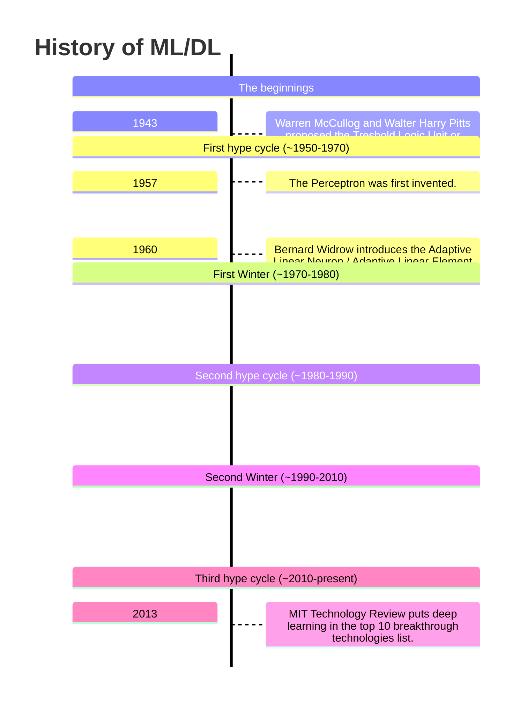

# Introduction

**Machine learning** consists in the extraction of a mapping between features of an input to the corresponding output. **Deep learning**, which is a subset of machine learning, consists in having the computer also decide which features are important and measure them itself. The training phase, both in ML and DL, happens at once.

There are three types of machine learning paradigms:

- **Supervised learning**: the computer learns to associate the correct outputs to the inputs given a sample of data (e.g. **classification**);
- **Unsupervised learning**: the computer exploits the regularities in the data to use it later(e.g. **clustering**);
- **Reinforcement learning**: the most effective one, the computer learns to maximize the reward associated with the decision it takes.

The most important events in ML/DL history will be depicted in this timeline.

The most important thing for ML/DL is the data. With that, you can create models doing whatever you want. Also, it is important to have the right powerful hardware.

# Neural networks

## Perceptrons

The **perceptron** is the first kind of neural network ever invented. It is almost 100 years old, as it was invented in the 1940s. The idea was to create an hardware architecture different from the Von Neumann one, inspired by the human brain, that could be adapted to be higly parallel, redundant and distributed.

Let $I$ be the number of inputs, $w_0 = b$ be a parameter called *bias**, $w_1, \dots, w_i$ the set of parameters called **weights**, $x_1, \dots, x_I$ be the inputs and $x_0 = 1$, then the perceptron can be modeled as

$$
h_j(x | w, b) = h_j(\sum_{i=1}^I w_i \cdot x_i - b) = h_j(\sum_{i=0}^I w_i \cdot x_i) = h_j(x^T x)
$$

$h_j$ is called **activation function** and drives the output of the perceptron. There are many different activation function, examples of which are the **Heaveside step** and the **sign** functions.

A perceptron with the sign activation function can learn associations between binary inputs and outputs with the **Hebbian learning** rule.

Let $\eta$ be the so-called **learning rate**, $x_i^k$ the $i$-th input at time $k$ and $t^k$ the desired output at time $k$, then the Hebbian learning algorithm can be summarized as follows:

1. Start from random weights $w$ and a chosen learning rate $\eta$;
2. Iterate over all the data and, for each record that is not correctly predicted, apply the Hebbian learning rule (see later) to update the weights;
3. Repeat step (2) until no updates happen.

The Hebbian learning rule is
$$
w_i^{k+1} = w_i^k + \eta \cdot x_i^k \cdot t^k
$$

If the update happens only when the target is not correctly predicted, the procedure is called **supervised Hebbian learning**, otherwise, if it happens always, it is called **unsupervised Hebbian learning**.

The Hebbian learning rule is based on the fact that we want to move the $w$ vector in the weights space in the direction that gives the most correct results: when a prediction is not correct, the dot product makes the update go in a different direction.

The Hebbian learning algorithm does NOT guarantee convergence or that the result is consistent across multiple runs: it all depends on the starting set of random weights.

The perceptron as-is is a subset of a Von Neumann machine, as it cannot learn the XOR function. Geometrically speaking, each binary input is a set of coordinate living in the input-space and the learning procedure is to identify if each input lives in the 0-subspace or in the 1-subspace.

The following image shows how different multi-layer perceptrons (architectures where the output of a perceptron is fed into the next layer) can learn how to split the input-space in the 0-subspace and 1-subspace.

](assets/lippmann.png)

## Feed-forward neural networks

A **feed-forward neural network** are composed by multiple layers of perceptrons. Those kind of networks are called **fully-connected** if all the outputs of each layer are connected to each input of the next layer through weights (that are specific per each connection).

Each neuron can have it's own activation function but, usually, the activation function is assigned layer-wise.

Any kind of activation function can be used, a few of the most used ones are summarized in the following table.

| Name | Value | Derivative | Notes |
| --- | --- | --- |
| Linear | $g(a) = a$ | $g'(a) = 1$ | A model with all linear activation functions can be collapsed to a single perceptron. |
| Sigmoid | $g(a) = \frac{1}{1 + \exp(-a)}$ | $g'(a) = g(a)(1 - g(a))$ | Almost equivalent to the step function. |
| tanh | $g(a) = \frac{\exp(a) - \exp(-a)}{\exp(a) + \exp(-a)}$ | $g'(a) = 1 - g(a)^2$ | Almost equivalent to the sign function. |

It is usually a good idea to use nonlinear-differentiable functions as activation functions for intermediate (**hidden**) layers.

Those kind of networks are used for three main kind of tasks:

- **Regression**: the output must span a real range
  - Use linear function for output layer or, if output range is known for sure, any other one before a rescale.
- **Classification**: the output is boolean
  - Use either tanh or sigmoid and interpret results accordingly.
- **Multiclass classification**
  - Use one-hot encoding and softmax.

::: {.callout .callout-theorem title="Universal Approximation Theorem"}
A single hidden layer feed-forward neural network is S shaped activation functions can approximate any measurable function to any desired degree of accuracy on a compact set.
:::

The **Universal Approximation Theorem** tells us that there always exist a neural network like described that can be used to approximate any given _useful_ function. The problem lies in the fact that there is no guarantee that a learning algorithm can find the necessary weights or that the neural network does not need to have a gazillion of neurons.

Classification is not included in the set of _measurable functions_. For those, an extra layer of neurons is needed.

<!-- 02:21 -->