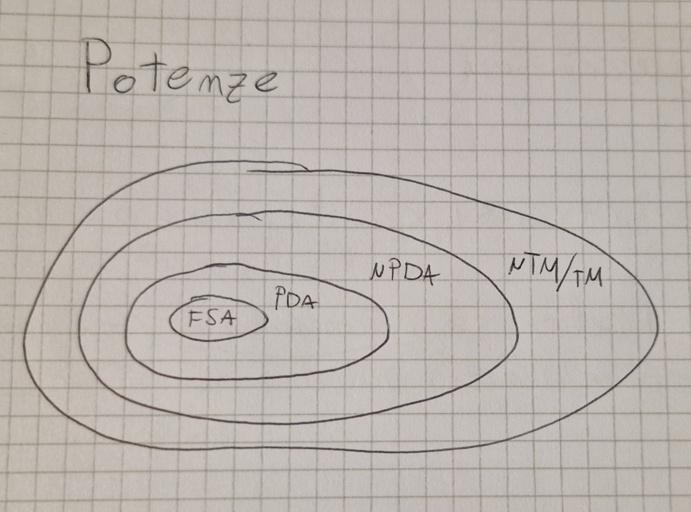
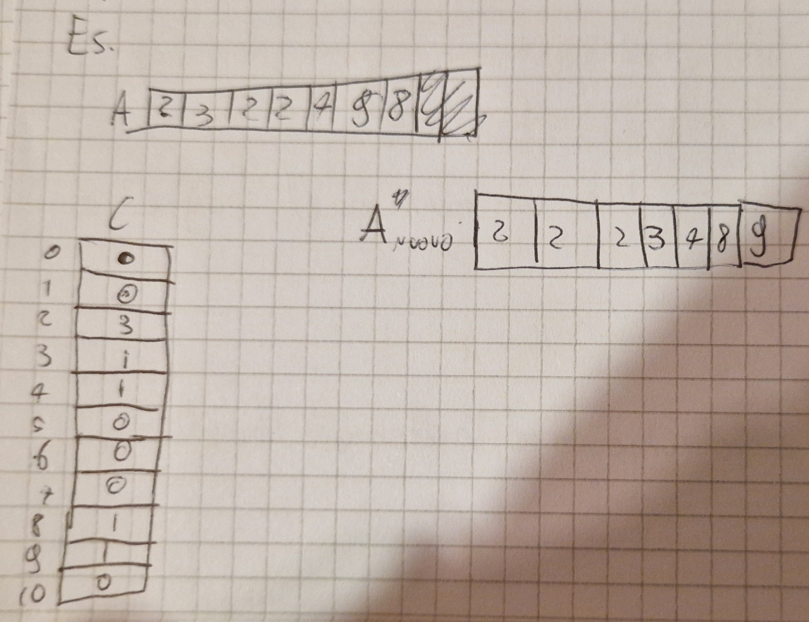
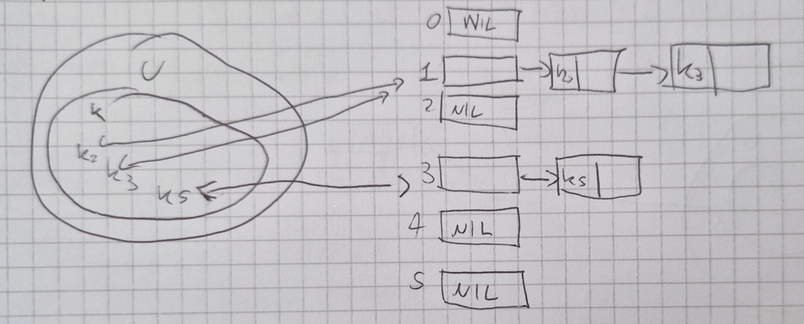
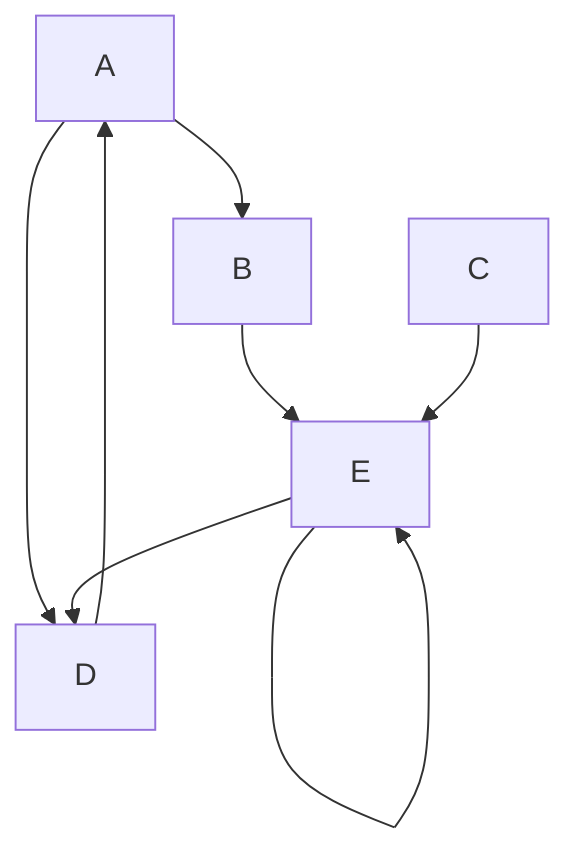
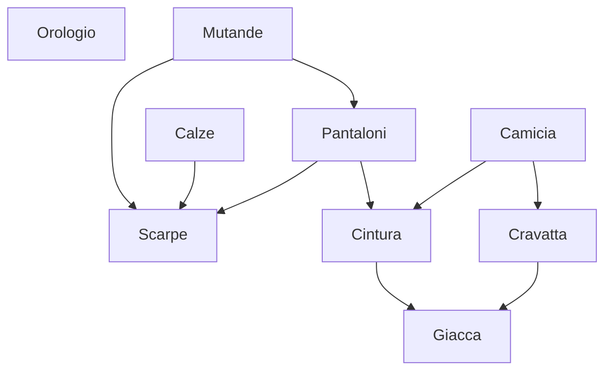

# Definizioni iniziali

## Lunghezza di una stringa

La **lunghezza** di una stringa è il numero di simboli contenuti in una stringa (anche detta 
cardinalità e si indica con $|x|$).

La stringa **vuota** è la stringa che ha zero elementi ($|\varepsilon| = 0$).

Due stringhe sono **uguali** se e solo se:

- $|x| = |y|$
- $x_i = y_i \quad \forall 1 \le i \le n$

## Operazioni sui linguaggi

- Unione
- Intersezione
- Complemento
- Differenza
- Concatenazione
- Potenze n-esime
- Chiusura di Kleene

Prima di iniziare delle spiegazioni useremo le stringhe $L_1$ e $L_2$ così composte:

$$
L_1 = \{ \varepsilon, a, b, c, bc, ca \} \\
L_2 = \{ ba, bb, bc, ca, cb, cc \}
$$

Bene partiamo con la carrellata di operazioni.

### Unione ($L_1 \bigcup L_2$)

$L_1 \bigcup L_2 = \{ \varepsilon, a, b, c, ba, bb, bc, ca, cb, cc\}$ tutti gli elementi **SENZA** ripetizioni.

### Intersezione ($L_1 \bigcap L_2$)

$L_1 \bigcap L_2 = \{bc, ca\}$ **SOLO** elementi comuni.

### Differenza ($L_1 \setminus L_2$ o $L_1 - L_2$)

$L_1 \setminus L_2 = \{ba, bb, cb, cc\}$ **SOLO** elementi **NON** comuni.

### Complemento ($L^c = A^* \setminus L$)

$A$ è l'alfabeto su cui $L$ è definito.

$*$ vuol dire tutte le ripetizioni possibili di quell'insieme, $\varepsilon$ compreso.

$L_1^c =$ tutte le stringhe su $\{a, b, c\}*$ tranne stringhe di lunghezza 2 che iniziano con "b", "c".

### Concatenazione ($L_1 \cdot L_2$ o $L_1 L_2$) **NON** è commutativa

$$
L_1 \cdot L_2 = \{ba, bb, bc, ca, cb, cc, aba, abb, abc, aca, acb, acc, bba, bbb, bbc, bca, bcb, bcc, cba, cbb, cbc, cca, ccb, ccc, bcba, bcbb, bcbc, bcca, bccb, bccc, caba, cabb, cabc, caca, cacb, cacc\}
$$

### Potenza $n$-esima ($L^n$) concanetamento con se stesso $n$ volte

$$
L^i = \begin{cases}
    \varepsilon & i = 0 \\
    L ^ {i - 1} \cdot L & i \gt 0
\end{cases}
$$

La potenza **È** associativa.

### Chiusura di Kleene

$$
L^* = \bigcup_{n=0}^\infty L^n \\ \ \\
L^* = L^+ \bigcup L^0 = L^+ \bigcup \{\varepsilon\} \\ \ \\
L^+ = \bigcup_{n=1}^\infty L^n \\ \ \\
L^+ = L \cdot L^* \\ \ \\
\{\varepsilon\} \not = \emptyset \\
$$

# Automi a stati finiti

## FSA (Finite State Automaton)

Un **FSA** ha un insieme finito di stati ovvero un numero limitato di configurazioni.

Es.

- {ON, OFF}
- {Canali TV}

Un FSA è definito su un alfabeto (a, b, c o anche on, off, anche 1, 2, 3, insomma simboli o parole che noi definiamo come "input" anche C o Java possono essere definiti come tale).

Quando si riceve un input, il sistema cambia il suo stato (**transizione**).

Gli FSA sono rappresentati tramite una tupla $\lang Q, A, \delta, q_0, F \rang$:

- $Q$ insieme finito di stati
- $A$ alfabeto di ingresso
- $\delta$ funzione di transizione
- $q_0 \in Q$ **stato iniziale**
- $F \subseteq Q$ insieme **stati finali**

Per far sì  che gli FSA riconoscano un linguaggio è necessario:

- Sapere le condizioni iniziali del sistema
- Sapere gli stati finali ammisibili

Una sequenza di mosse è di accettazione se raggiunge uno degli stati finali.

Esempio di un FSA:

## Trasduttori a stati finiti

### FST (Finite State Transducer)

Sono FSA con 2 nastri.

È una tupla $ \lang Q, I, \delta, q_0, F, O, \eta \rang$:

- $\lang Q, I, \delta, q_0, F \rang$ come gli accettori (FSA)
- $O$ alfabeto di uscita
- $\eta \colon Q \times I \longrightarrow O^*$

Esempio FST

### Pumping Lemma

Se in un sistema a stati finiti si va da uno stato $q_1$ a $q_1$ (ovvero si attraversa un ciclo) vuol dire che lo si può fare n volte.

Perciò se:

$x \in L$ e $|x| \ge |Q| \implies q \in Q \land w \in I^+$:

- $x = ywz$
- $\delta^*(q, w) = q$

Dunque:

- $\forall n \ge 0 yw^nz \in L$

Conseguenze:

$L = \empty$ se $\exist x \in L \iff \exist y \in L, |y| \lt |Q|$

$|L| = \infty$ se $\exist x \in L |Q| \impliedby |x| \lt 2|Q|$

Problemi:

- Per "contare" un numero $n$ molto grande servirebbe memoria infinita

### Operazioni su FSA

N.B. se un sistema è **chiuso** rispetto a un operazione vuol dire che il risultato è sempre parte dell'insieme.

Operazioni:

- Intersezione ( $\bigcap$ )
- Unione ( $\bigcup$ )
- Complemento ( $^c$ )

Sono operazioni **CHIUSE** negli FSA. 

## PDA (PushDown Automata)

Sono FSA con una pila.

La stringa d'ingresso $x$ è accettata se:

- il PDA la legge tutta
- Quando finisce si trova in uno stato di accettazione

Un PDA è una tupla $\lang Q, I, \Gamma, \delta, q_0, Z_0, F \rang$:

- $Q$ insieme finito di stati
- $I$ alfabeto di ingresso
- $\Gamma$ alfabeto di pila
- $\delta$ funzione di transizione
- $q_o \in Q$ è lo stato iniziale
- $Z_0 \in \Gamma$ simbolo iniziale di pila
- $F \subseteq Q$ insieme stati finiti

Esempio PDA:

#### Configurazione

- Mostra lo stato corrente del dispositivo di controllo
- Posizione della stringa d'ingresso
- La pila

È una tripla $\lang q, x, \gamma \rang$

- $q \in Q$ stato corrente dispositivo
- $x \in I^*$ posizione **non** letta della stringa d'ingresso
- $\gamma \in \Gamma^*$ stringa simboli di pila

Le transizioni tra configurazioni ($\vdash$) mostra come commutare tra un PDA e un altro

Esempio

Dato $\delta(q, i, A) =  \lang q', \alpha \rang$ è definita

$c = \lang q, x, \gamma \rang \vdash c'= \lang q', x', \gamma \rang$

- $\gamma = A \beta$
- $x = iy$

allora

- $\gamma' = \alpha \beta$
- $x' = y$

**Condizione di accettazione**

$$
\forall x \in I^* (x \in L \iff \exist q \exist \gamma c_0 = \lang q_0, x, Z_0 \rang \vdash^* c_f = \lang q, \varepsilon, \gamma \rang \land q \in F)
$$

La stringa viene accettata se c'è un cammino coerente che va sallo stato iniziale a uno stato finale.

#### PDA VS FSA

- Gli FSA **NON** riconoscono $a^n b^n$ i PDA si
- Ogni linguaggio regolare (FSA) è riconosciuto da PDA
- I PDA sono più potendi dei FSA

I PDA non si fermano sempre dopo le mosse, ogni PDA si può trasformare in un PDA aciclico (si ferma sempre dopo le mosse).

### PDT (PushDown Trasducer)

I PDT sono una tupla $\lang Q, I, \Gamma, \delta, q_0, Z_0, F, O, \eta \rang$:

- $\lang Q, I, \Gamma, \delta, q_0, Z_0, F \rang$ come nei PDA
- $O$ alfabeto d'uscita
- $\eta \colon Q \times (I \bigcup \{ \varepsilon\} ) \times \Gamma \to O^*$

**Configurazione** <$q, x, \gamma, z$>:

- $\lang q, x, \gamma \rang$ come nei PDA
- $z$ stringa già scritta sul nastro d'uscita

**Condizione di accettazione**:

$$
\forall x \in I^* \forall z \in O^* (x \in L \land z = \tau(x) \iff \exist q \exist \gamma \colon c_0 = \lang q_0, x, Z_0, \varepsilon \rang \vdash^* c_f = \lang q, \varepsilon, \gamma, z \rang \land q \in F )
$$

La traduzione è definita se e solo se $x$ è accettata.

Esempio di PDT

I PDT **NON** sono chiusi rispetto a Unione, Intersezione e Complemento.

## Turing Machine (TM)

I PDA **NON** riconoscono $a^n b^n c^n$ o $a^n b^n \cup a^n b^{2n}$.

La pila è una memoria distruttiva, letto un elemento viene eliminato.

C'è bisogno di **NASTRI DI MEMORIA**.

Le TM usano i nastri come memorie:

- Non distruttivi
- Scorrevoli in entrambi i sensi

I nastri sono sequenze infinite di celle con "Blank" (segnato come "$\cancel{b}$", "_" o "$-$").

##### Mosse

Uguali a prima con aggiunta di:

Spostamento testine dichiarato con 3 movimenti:

- Sposta a destra (R)
- Sposta a sinistra (L)
- Fermo (S)

Si esplicita **SEMPRE**.

Le TM sono una tupla $\lang Q, I, \Gamma, \delta, q_0, Z_0, F \rang$:

- $Q$ insieme finito di stati
- $I$ alfdabeto di ingresso
- $\Gamma$ alfabeto di memoria
- $\delta$ funzione di transizione
- $q_0 \in Q$ stato iniziale
- $Z_0 \in \Gamma$ simbolo iniziale di memoria
- $F \subseteq Q$ insieme stati finali

Esempio di TM

La **Configurazione** di una TM con k nastri è una (k+2)-tupla:

$$
c = \lang q, x \uparrow iy, \alpha_1 \uparrow A_1 \beta_1, \dots, \alpha_k \uparrow A_k \beta_k \rang
$$

- $q \in Q$
- $x, y \in I^*$,  $i \in I$
- $\alpha_r, \beta_r \in \Gamma^*$, $A_r \in \Gamma \forall r \quad 1 \le r \le k$
- $\uparrow \notin I \cup \Gamma$

$\uparrow$ indica la posizione della testina.

**Condizione di accettazione**:

$\exist q \exist x' \exist i \exist y \exist \alpha_1 \exist A_1 \exist \beta_1 \dots \exist \alpha_k \exist A_k \exist \beta_k \colon c_0 = \lang q_0, \uparrow x, \uparrow Z_0, \dots, \uparrow Z_0 \rang \vdash_m^* c_F = \lang q, x'\uparrow iy, \alpha_1 \uparrow A_1 \beta_1, \dots, \alpha_k \uparrow A_k \beta_k \rang$ con $q \in F$ e $x = x'iy$

#### TM VS PDA

- $a^n b^n c^n$ **NON** sono riconosciuti da PDA ma da TM
- Se un linguaggio è riconosciuto da PDA allora è riconosciuto da TM

I linguaggi accettati da TM sono detti **ricorsivamente enumerabili**.

#### TM e Macchine di Von Neumann (VNM)

La differenza sta nell'accesso alla memoria:

- TM : Sequenziale
- VNM : Diretto

Il tipo di accesso **NON** cambia la potenza.

Le TM possono simulare le VNM.

##### Operazioni TM

Le TM sono **chiuse** rispetto a:

- Intersezione $(\bigcap)$
- Unione $(\bigcup)$
- Concatenazione
- Stella di Kleene

**NON** sono chiuse rispetto a:

- Complemento
- Differenza

Se esistessero TM acicliche sarebbero chiuse al complemento, il problema sta dove le computazioni non terminano.

### TM Trasduttrice

Le TM trasuttrici a k nastri sono una tupla di 9 elementi $\lang Q, I, \Gamma, O, \delta, \eta, q_0, Z_0, F \rang$:

- $\lang Q, I, \Gamma, \delta, q_0, Z_0, F \rang$ come le TM
- $O$ alfabeto d'uscita
- $\eta$ funzione d'uscita

N.B. Le testine di uscita si muovono in 2 direzioni:

- Destra (R)
- Ferme (S)

Esempio di TM traduttrice

**Configurazione**

$c = \lang q, x \uparrow iy, \alpha_1 \uparrow A_1 \beta_1, \dots, \alpha_k \uparrow A_k \beta_k, u \uparrow o \rang$

- $\uparrow \in I \bigcup \Gamma \bigcup o$

Le TM possono:

- Riconoscere linguaggi
- Tradurre linguaggi accettati
- Calcolare funzioni

Le TM sono computer con accesso sequenziale alla memoria (Modello astratto).

Le TM possono avere nastri a n dimensioni.

N.B. Più dimensioni **NON** aggiungono potenza.

# Modelli non deterministici

Di solito un algotimo ha una sequenza deterministica.

Il non deterministmo (ND) è un modello di computazione, utile per algoritmi di ricerca.

### NFSA

Gli NFSA sono gli FSA non deterministici e sono una tupla : $\lang Q, I, \delta, q_0, F \rang$

- $\lang Q, I, q_0, F \rang$ uguali a FSA
- $\delta \colon Q \times I \to \mathcal{P} (Q)$

$$
\delta^* (q, \varepsilon) = \{q\}
\\
\delta^* (q, y, i) = \bigcup \delta\{q', i\}
$$

**Condizione di accettazione**

$x \in L \iff \delta^* (q_0, x) \bigcap F \not ={\emptyset}$

Basta che una vada a buon fine.

ND **esistenziale**

$\delta^* (q_0, x) \subseteq F$

#### DFA VS NFA

- Stesso potere
- Da un NFA si può sintetizzare **automaticamente** un DFA

Se $A_{ND} = \lang Q, I, \delta, q_0, F \rang \implies A_{D} = \lang Q_D, I, \delta_D, q_{0D}, F_D \rang$

- $Q_D = \mathcal{P}(Q)$
- $\delta_D (q_D, i) = \bigcup \delta (q, i)$
- $q_{0D} = \{q_0\}$
- $F_D = \{q_D | q_D \in Q_D \land q_D \bigcap F\not ={\emptyset} \}$

Perchè il ND ? (già è difficile di suo ora ci complichiamo la vita)

Gli NFA hanno pari potenza di DFA, ma non sono inutili (purtroppo):

- A volte gli NFA sono più semplici
- Possono essere esponenzialmente più piccoli (NFA a 5 stati nel peggiore dei casi è un DFA a $2^5$ stati)

Esempio di NFA

### TM non deterministici (NTM)

Per definire una NTM occorre cambiare la funzione di transizione e la funzione di traduzione.

- Elementi uguali alla DTM
- $\delta \colon (Q-F) \times I \times \Gamma^k \to \mathcal{P}(Q \times \Gamma^k \times \{R, L, S\}^{k+1})$
- $\eta \colon (Q-F) \times I \times \Gamma^k \to \mathcal{P}(O \times \{R, S\})$

Esempio NTM

**Condizione di accettazione**

Una stringa è accettata se e solo se esiste unna computazione con uno stato di accettazione.

Che cosa è la visita dell'albero computazionale ?

Diverse modalità :

- In profondità (Depth-first)
- In ampiezza (Breadth-first)

**Si può** costruire una DTM che visita un albero livello dopolivello ma è un processo molto lungo e noioso.

ND **NON** aggiunge potere alle TM

### PDA non deterministici (NPDA)
L e $\varepsilon$-mosse avevano il seguente vincolo:

$$
\delta(q, \varepsilon, A) \not ={\bot}\implies\delta(q, i, A) = \bot; \forall i \in I
$$

Senza di esso i PDA sarebbero intrinsicamente ND.

Un NPDA è una tupla $\lang Q, I, \Gamma, \delta, q_0, Z_0, F \rang$

- $\lang Q, I, \Gamma, q_0, Z_0, F \rang$ come nel PDA
- $\delta$ è la funzione di transazione definita come:
$$
\delta \colon Q \times (I \bigcup \{\varepsilon\}\times \Gamma \to \mathcal{P_F}(Q \times \Gamma^*))
$$

$\mathcal{P_F}$ indica i sottoinsiemi finiti di $Q \times \Gamma^*$

Esempio di NPDA

**Condizione di accettazione**

Dato un NPDA:

$\forall x \in I^* (x \in L(P) \iff \exist q \exist \gamma c_0 = \lang q_0, x, Z_0 \rang \vdash^* c_F = \lang q, \varepsilon, \gamma \rang$ e $q \in F)$

Una stringa è accettata se **c'è un cammino** coerente con $x$ che va dallo stato inizio a uno di fine.

ND noi PDA **aggiunge** potere, riconosce $\{ a^nb^n | n\ge 1\} \bigcup \{a^nb^{2n} | n \ge 1\}$

I linguaggi riconoscibili dai PDA sono detti **context-free**.

DPDA chiusi rispetto al complemento.

**NON** chiusi rispetto unione, intersezione e differenza.

NPDA chiusi rispetto unione.

**NON** chiusi rispetto intersezione, complemento e differenza.

| Proprietà chiusura | FSA | DPDA | NPDA | TM  |
| ------------------ | --- | ---- | ---- | --- |
| Unione             | SI  | NO   | SI   | SI  |
| Intersezione       | SI  | NO   | NO   | SI  |
| Complemento        | SI  | SI   | NO   | NO  |
| Concanetazione     | SI  | NO   | SI   | SI  |
| Stella di Klenee   | SI  | NO   | SI   | SI  |

# Grammatiche

Esistono 2 tipi di modelli:

- Modelli operazionali (Automi): Riconoscono/accettano, traducono e calcolano linguaggi.
- Modelli generativi (Grammatiche): Descrivono come generare un linguaggio.

I modelli generativi producono stringhe (grammatica).

Una grammatica è un insieme di parole per costruire le frasi di un linguaggio $\to$ tramite **riscrittura** (insieme di metodi).

## Regole linguistiche

Le regole linguistiche descrivono un "oggetto principale" con una sequenza di componenti.

I componenti vengono dettagliati fino ad andare alla base (vuol dire che es. da staccionata si arriva a Assi, Martello, Chiodi).

Una grammatica è una tupla $\lang V_N, V_T, P, S \rang$

- $V_N$ alfabeto **NON TERMINALE**
- $V_T$ alfabeto **TERMINALE**
- $V = V_N \bigcup V_T$
- $P = \subseteq V_N^+ \times V^*$ insieme finito di **regole di riscrittura**
- $S \in V_N$ è un particolare elemento di $V_N$ chiamato **assioma**

Una grammatica genera un linguaggio sull'alfabeto $V_T$

## Produzioni

Elemento di $V_N^+ \times V^* (\lang \alpha, \beta \rang | \alpha \in V_N^+, \beta \in V^*)$

Si indica con $\alpha \to \beta$

- $\alpha$ sequenza si,boli **NON** terminali.
- $\beta$ sequenza (potenzialmente vuota) di simboli (terminali o non)

### Gerarchia Chomsky

Esistono 4 tipi di grammatiche

| Tipo | Nome                         | Produzioni                                                                                                                                                                                | Macchine                                                                 |
| ---- | ---------------------------- | ----------------------------------------------------------------------------------------------------------------------------------------------------------------------------------------- | ------------------------------------------------------------------------ |
| 3    | Regolari                     | (Destre) $A \to \alpha, A \to aB (A \to \varepsilon) con A,B \in V_N, a \in V_T$                                                                                                          | FSA                                                                      |
| 2    | Context-free                 | $A \to B, A \in V_N$                                                                                                                                                                      | NPDA                                                                     |
| 1    | Context-sensitive e monotone | $S \to \varepsilon, \alpha A \beta \to \alpha \gamma \beta$ con $A \in V_N, \alpha, \beta, \gamma \in V^+$ (ora monotone) $\alpha \to \beta$ con $\vert \alpha \vert = \vert \beta \vert$ | Automi lineari (NTM usano uno spazio di memoria proporzionale all'input) |
| 0    | Generali o non ristrette     | $P \subseteq V_N^+ \times V^+$                                                                                                                                                            | TM |

### Reazioni di derivazione immediata

$\alpha \implies \beta$ ($\beta$ è ottenuta immediatamente da $\alpha$)

- $\alpha \in V_N^+$ e $\beta \in V^*$

se e solo se

$\alpha = \alpha_1 \alpha_2 \alpha_3, \beta = \alpha_1 \beta_2 \alpha_3$ e $\alpha_2 \to \beta_2 \in P$

$\alpha_2$ riscritta come $\beta_2$ nel contesto $\lang \alpha_1, \alpha_3 \rang$

Es.

$$
V_N = \{S,A, B, C, D\}\\
V_T = \{a, b, c\}\\
S\\
P = \{S \to AB, BA \to cCD, CBS \to ab, A \to \varepsilon\}\\
aaBAS \implies aacCDS \\
bcCBSAdd \implies bcabAdd
$$

#### Linguaggio generato

Data $G = \lang V_N, V_T, P, S \rang$

$\forall x (x \in L(G) \iff x \in V_T^* \land S \implies(+) x)$

Il linguaggio generato da $G$ è l'insieme di tutte le stringhe:

- Solo simboli terminali
- Derivante da $S$ in $n$ numeri di passi con $n \ge 1$

ES.

$$
G_2 = \lang \{S\}, \{a, b\}, \{S \to a Sb | ab\}, S \rang \\
S \to aSb |ab = S \to aSb, S \to ab
$$
Derivazioni
$$
S \implies ab \\
S \implies aSb \implies aabbb \\
S \implies aSb \implies aaSbb \implies aaabbb
$$
Generalizzo $L(G_2) = \{a^nb^n|n> 0\}$

### Regular Grammar (RG) VS FSA

Sia $A$ un FSA, si può costruire un RG $G$ ad esso equivalente.

$G$ genera esattamente lo stesso linguaggio riconosciuto da $A$.

Le RG, FSA e espressioni regolari descrivono lo stesso linguaggio in modelli diversi.

Le context-free grammar (CFG) sono identiche alle Backus-Naus Form (BNF) usate per definire la sintassi dei linguaggi di programmazione.

Le grammatiche regolari sono anche non contestuali

I linguaggi possono essere rappresentati tramite molti modelli tra cui :

- Pattern
- Espressioni Regolari (RE)

## Pattern

È una tripla $\lang A, V, p \rang$

- $A$ è un alfabeto
- $V$ insieme di variabili $| A \bigcap V = \emptyset$
- $p$ è una stringa su $A \bigcup V$ detta pattern

Il pattern genera un linguaggio che ha tutte le stringhe di $A$ ottenute da $p$ sostituendo ogmi variabile in $p$ con una stringa su $A$.

Es.
$\lang \{0, 1\}, \{v_1, v_2\}, v_1v_1 \circ v_2 \rang$

- Stringhe che iniziano con $0 (v_1 = \varepsilon)$
- Stringhe che iniziano con una stringa su A ripetuta due volte, seguita da uno $0$ e da una qualunque stringa (inclusa $\varepsilon$)

## RE: sintassi e semantica

Definizione di un RE su un alfabeto $A \colon$

- $\emptyset$ è una RE
- $\varepsilon$ è una RE
- ogni simbolo di $A$ è una RE

Siano $r$ e $s$ due RE, allora:

- $(r.s)$ è una RE
- $r^*$ è una RE
- Nient'altro è una RE

Es.

$((0.(0|1)^*)|((0|1)^*.0))$ è una RE su $\{0, 1\}$

- stringhe che iniziano con $0$
- stringhe che finiscono con $0$

### RE e Pattern

Le RE hanno la stessa idea dei Pattern ma diverso potere.

$RE \not ={Pattern}$.

$\{xx | x \in \{0, 1\}^*\}$ NO RE

Pattern corrispondente $\lang \{0, 1\}, \{x\}, xx \rang$

Linguaggio denotato da $0^*1^*$ **NON ESPREMIBILE** tramite Pattern.

### RG e RE

$RG = RE$.

### RE POSIX (Linux/Unix)

Caratteri meta: ( ) . [ ] ^ \ $ * + | { }

N.B. "." indica qualunque carattere, **NON** concatenazione.

[$\alpha$] indica un singolo carattere $\in \alpha ([abc]$ indica $\{a, b, c\})$.

[^$\alpha$] negazione: qualunque carattere non in $\alpha$.

^ e $ indicano $\varepsilon$ corrispettivamente all'inizio e alla fine della riga.

*, +, |, (, ) uguali a sempre.

\ "escape" (\ $ indica il simbolo $).

$\alpha ?$ indica $\alpha$ opzionale.

$\alpha \{n\}$ indica $\alpha^n$

$\alpha \{n, m\}$ indica $\alpha^n \bigcup \alpha ^{n+1} \bigcup \dots \bigcup \alpha^m$

# Logica

Esistono vari linguaggi logici :

- Logica Proposizionale
- FOL (First-Order Logic)

La logica è un formalismo "universale" e si applica in molti ambiti :

- Architetture (porte logiche)
- Ingegneria del software
- Linguaggi di programmazione
- Database
- AI

Gli insiemi possono essere visti come abbreviazioni di formule FOL.

Es.

$\{a^nb^n | n \ge 0\} \to$ abbreviata di $\forall x (x \in L \longleftrightarrow \exist n (n \ge 0 \land x = a^n.b^n))$

$x^n ?$

$\forall n \forall x ((n=0 \to x^n = \varepsilon) \land (n > 0 \to x^n = x^{n-1}.x))$

Ora faremo un bell' elenco di operazioni logiche, buon viaggio ; )

$L_1 = a^*b^*$

$L_1$ è il linguaggio delle stringhe su $\{a, b\}$ con tutte le "$a$" all'inizio.

Più precisamente $L_1$ è:

- stringa vuota.
- composta da un prefisso "$a$" e un suffiso $y$ (sempre in $L_1$).
- prefisso $y$ (sempre in $L_1$) e un suffisso "$b$".

Esprimibile come:

$\forall x (x \in L_1 \longleftrightarrow (x = \varepsilon) \lor \exist y (x=ay \land y \in L_1) \lor \exist y (x=yb \land y \in L_1))$

$L_2 = a^*b^*c^*$

Una stringa appartiene a $L_2$ se è:

- in $L_1$
- in $L_3 (b^*c^*)$
- composta da un prefisso $'a'$ e da un suffisso $y$
- composta da un prefisso $y$ e da un suffisso $'c'$

In FOL:

$\forall x (x \in L_2 \longleftrightarrow (x \in L_1) \lor (x \in L_3) \lor \exist y (x = ay \land (y \in L_2 \lor y \in L_3)) \lor (x=yc \land (y \in L_2) \lor y \in L_1))$

Esempio

$L_4 = \{x \in \{a,b\}^* |numero\ di\ 'a'\ uguale\ al\ numero\ di \ 'b'\}$

- $\#(x,a)$ arietà 2, conta il numero di occorenze del simbolo $'a'$ nella stringa $x$

In FOL: $\forall x (x \in L_4 \longleftrightarrow \# (x,a)= \# (x,b))$

### MFO: Logica monadica del prim'ordine

- I linguaggi esprimibili mediante MFO sono chiusi rispetto a unione, intersezione e complemento
- In MFO non si può esprimere il linguaggio $L_p$ fatto di tutte le sole parole di lunghezza pari con $l = \{a\}$
- MFO è strettamente meno potente degli FSA
- MFO chiuso rispetto alla $*$
- La formula MFO $a(0) \land a(1) \land last(1)$ definisce $L_{aa}$ fatto della sola parola $\{aa\}$ di lunghezza 2.
- Abbiamo che $L_p = L_{aa}^*$
- MFO definisce linguaggi star-free, definibili tramite unione, intersezione, complemento e concatenazione di linguaggi finiti.

### MSO: Logica monadica del secondo ordine

- Può avere lo stesso potere degli FSA basta permettere di quantificare sui predicati monadici
- Ammettiamo formule del tipo $\exist x(\phi), x$ è una variabile il cui dominio è l'insieme dei predicati monadici
- Assegnamento delle variabili del $II$ ordine (insieme $v_2$) è una funzione $v_2 : V_2 \to ([0..|w|-1])$

    - $w, v_1, v_2 \vDash X(x) \ sse\ v_1(x) \in v_2 (x)$
    - $w, v_1, v_2 \vDash \exist X (\phi) \ sse \ w, v_1, v_2' \vDash \phi \ per \ qualche \ v_2' con v_2'(Y); Y\not ={x}$
- La formula descrive il linguaggio $L_p$

$\exist P (\forall x (\neg P(0) \land (\neg P(x) \Longleftrightarrow P(x+1))\land a(x)\land (last(x) \implies P(x))))$

**Per ogni FSA esiste un MSO equivalente**

Da una MSO $\phi$ è possibile costruire un FSA (**Teorema di Büchi-Elgot-Trakhtenbrot**)

I linguaggi definibili da fomrule MSO è linguaggi regolari

Quando si programma una funzione è importante definire **COSA FA**.

**Precondizione**: indica cosa deve valere **prima** che la funzione sia invocata.

**Postcondizione**: indica cosa deve valere **dopo** che la funzione ha finito la propria esecuzione.

Struttura generale (**notazione di Hoare**)

- {Precondizione: $Pre$}
- {Programma: $P$}
- {Postcondizione: $Post$}

$P$ deve essere tale che se $Pre$ vale prima dell'esecuzione, allora $Post$ vale dopo l'esecuzione.

- $Pre$ e $Post$ possono essere definiti in diversi modi

    - Linguaggio naturale
    - Linguaggi per le asserzioni
    - Linguaggi ad-hoc

$\to$ FOL può essere usata per questo scopo.

### Abbreviazioni logiche

- $y=x+1 \ \ \ x<y \land \neg \exist z (x<z \land z<y)$ N.B. è vero se $x$ è l'ultima posizione

- $y=x+2 \ \ \ \exist z(z=x+1 \land y=z+1) $

$\forall k \in \mathbb{N}, k \ge 1$ ($k$ fissato NON si può quantificare !!!)

- $y=x+k : \ \ \exist z (z=x+(k-1) \land y= z+1)$

- $First(x,P) = P(x) \land \forall y (y<x \implies \neg P(y))$

- $Last (x,P) = P(x) \land \forall y (x<y \implies \neg P(y))$

- $Next (x,y,P) = P(x) \land P(y) \land \forall z ((x<z \land z<y)\implies P(z))$

- $Odd(Q,P) = \forall x (Q(x) \iff (First (x,y) \land \exist y \exist z (Next (z,x,P) \land Next (y,z,P) \land Q(y))))$

Vero sse $Q \subseteq P \ Q$ contiene la $I, II, V$ posizione di $P$.

# Computabilità

### Algoritmo di ricerca

$Pre$: l'array è ordinato.

$Post$: la variabile logica "found(un flag)" dev'essere vera sse l'elemento cercato esiste nell'array.

$$
Pre \{\forall i (1 \le i \le n-1 \to a[i] \le a[i+1])\}
\\
P
\\
Post \{found \longleftrightarrow \exist i (1 \le i \le n \land a[i] = x)\}
$$

### Ordinamento

$Pre$: l'array NON contiene ripetizioni.

$Post$: l'array ottenuto è ordinato.

Formalmente

$$
\{\neg \exist i, j (1 \le i \le n \land 1 \le j \le n \land i \not ={j} \land a[i] = a[j])\}
\\
ORD
\\
\{\forall i (1 \le i \le n-1 \to a[i] \le a[i+1])\}
$$

### Tesi di Church (Parte 1)

**Non c'è nessun formalismoper modellare il calcolo meccanico che sia più potente della TM (o formalismi equivalenti)**

Algoritmo: Procedura per risolvere problemi mediante un dispositivo di calcolo automatico.

### Tesi di Church (Parte 2)

**Ogni algoritmo può essere codificato mediante una TM (o formalismo equivalente)**

Una TM può essere vista come un computer astratto, non programmabile, predisposto per un uso speciale.

Un insieme $S$ può essere enumerato algoritmicamente $(E)$ se possiamo trovare una biiezione tra $S$ e $\natnums$.

- $E: S \longleftrightarrow \natnums$

Esempio

$\{a,b\}^*$

$\varepsilon\ a\ b\ aa\ ab\ ...$

$0\ 1\ 2\ 3\ 4\ ...$

**Le TM possono essere enumerate algoritmicamente**

Ipotesi:

- TM a nastro singolo
- Alfabeto fissato $A (esempio\ |A|=3, A=\{0, 1,\_ \})$

Esempio: TM con due stati

$2^2=4$ stati finali possibili.

Quante funzioni $f: D \to R ? \to |R|^{|D|}$

Con $|Q| = 2, |A|=3, (2 * 3+3+1)^{(2*3)} = 19^6$ con 2 stati considerando i $2^2$ scelte di stati finali, abbiamo (al più) $19^6 * 2^2$ TM.

Ordiniamo TM: $\{M_0,...,M_{19^6*2^2 -1} \}$

Otteniamo un'enumerazione $E: \{TM\} \to \natnums$

$E(M)$ è detto **numero di Gödel** di $M$ e $E$ è una **Gödelizzazione**

Le TM modellano computer programmabili? Si

- Consideriamo la **Macchina di Turing Universale** (UTM)

UTM computa $g(y, x)=f_y(x)$

funzione calcolata dalla y-esima TM sull'ingresso x.

Possiamo codificare $g(y,x)$ come una $g^{(n)} = g(d^{-1}(n))$ con $n= d(y,x), (y,x) = d^{-1} (n)$

Le TM computano **tutte** le funzioni da $\natnums$ a $\natnums?$

No, ci sono funzioni che possono essere computate dalla UTM.

Esistono $2^{\alef_0}$ funzioni $f: \natnums \to \natnums$.

$\alef_0$ si legge "alef con zero"

#### Il "problema dell'arresto" (halting problem)

- Costruisco un programma 
- Gli do dei dati in ingresso
- So che in generale il programma potrebbe non terminare la propria esecuzione

In termini di TM:

$g(y,x) =1\  se\ f_y(x) \not ={\bot}, g(y,x)=0\ se \ f_y(x)=\bot$

C'è TM che calcola $g?$ 

No

### Dimostrazione per diagonalizzazione

Listiamo le funzioni calcolabili da $\natnums$ a $\natnums$ e i loro valori, disponendo ogni valore $f_y(x)$ in una tabella:

Definiamo una funzione $\phi: \natnums \to \natnums$ che differisce dalla diagonale in ogni valore.

Nessuna TM può decidere se, data una generica TM $M$ e un generico ingresso $x$, $M$ si arresta con l'ingresso $x$.

### Lemma importante

$h'(x)=$ se $f_x(x)\not ={\bot}$ allora $1$ altrimenti $0$

Un problema non risolvibile può avere un caso particolare risolvibile.

Se un problema è risolvibile, una generalizzazione può non essere risolvibile.

#### Problemi di decisione

Domanda con due possibili risposte: si e no.

Semidecidibile se c'è un algoritmo che dice si se la risposta è si

- può andsre in loop se la risposta è no

### Insiemi Ricorsivi

Concentriamoci sui problemi a risposta binaria:

Problema= $x$ appartiene all'insieme $S? (S \le N)
$

$C_S(x)=\ se \ x \in S\ allora\ 1\ altrimenti\ 0$

Un insieme $S$ è **ricorsivo** sse la sua funzione caratteristica è computabile.

$S$ è **ricorsivamente enumerabile** sse:

- $S$ è l'insieme vuoto, o
- $S$ è l'immagine di una funzione $g_s$ totale e computabile

$$
S=l_{g_s}=\{x|x=g_s(y),y\in \natnums\}
\\
\implies
\\
S=\{g_s(0), g_s(1), g_s(2),...\}
$$

#### Teorema (1/2+1/2=1)

- Se $S$ è ricorsivo, allora è RE
- $S$ è ricorsivo sse sia $S$ sia il suo complemento $S^\wedge = N-S$ sono RE

La classe di insiemi decidibili è chiusa rispetto al complemento.

#### Teorema del punto fisso di Klenne

Sia $t$ una funzione totale e computabile. Allora si può sempre trovare un intero $p$ tale che $f_p=f_{t_{(p)}}$

- La funzione $f_p$ è detta punto fisso di $t$

#### Teorema di Rice

Sia $f$ un insieme di funzioni computabili l'insieme &S& degli indici delle TM che calcolano le funzioni di $F$

$S=\{x|f_x \in F\}$

è decidibile sse:

- o $F = \emptyset$
- o $F$ è l'insieme di tutte le funzioni computabili

$\to$ in tutti i casi non banali $S$ non è decidibile!

Dal teorema di RIce

Implicazioni negative

- C'è una lista sconfinata di problemi interessanti la cui indecidibilità segue banalmente dal teorema di Rice.

Dato $F=\{g\}$, per Rice non è decidibile se una generica TM calcoli $g$ o meno.

#### Teorema di Rice (variante)

Sia $S \subseteq \mathbb{N}$ tale che 

1. $S \not = \empty$
2. $S \not = \mathbb{N}$
3. se $s \in S$ e la TM n-esima è equivalente alla TM m-esima allora $m \in S$
($S$ è l'insieme di tutte e sole le codifiche di certe  TM/prog/funz. computabili)

Allora $S$ non è decidibile.

Esempio di utilizzo

Esistano TM M e M' tali che M è equivalente a M'

$H = \{ n \in \mathbb{N} | M=\lang n \rang \ e\ M(\varepsilon) \downarrow \}$
è decidibile ?

1. $H \not = \empty$: ci sono TM che terminano su $\varepsilon$
2. $H \not = \mathbb{N}$: ci sono TM che NON terminano su $\varepsilon$
3. se $M=M'$ e $\lang M \rang = n$ e $\lang M' \rang = n$ e $n \in H$ allora $H (\varepsilon) \downarrow$ e poichè $M=M'$ anche $M'(\varepsilon) \downarrow$ e dunque $n' \in H$

Quindi Rice è soddisfatto e $H$ **NON** è decidibile.

#### Riduzione di problemi

Un problema $P'$ è **ridotto** a un problema $P$ se un algoritmo per risolvere $P$ viene usato per risolvere $P'$

- $P$ è risolvibile
- C'è un algoritmo che, per ogni data istanza di $P'$
1. Determina una corrispondente istanza di $P$
2. Costruisce algoritmicamente la soluzione dell'istanza di $P'$ dalla soluzione dell'sistanza di $P$

# Complessità del calcolo

Per la tesi di Curch-Turing, un problema è calcolabile o meno indipendentemente dallo strumento usato.

Per la complessità del calcolo ?

- Una somma unaria ha efficienza diversa da una di basa $b > 1$
- Calcolare una traduzione $y=T(x)$ decidendo se $\exist z \in L_\tau = \{x \$ y | y=\tau (x)\}$ può essere molto meno efficiente del calcolare la traduzione in qualche caso.

Data la computazione $c_0 \vdash c_1 \vdash c_2 \vdash ... \vdash c_r$ di $M$ (a k nastri) deterministica.

La complessità temporale è $T_M (x)=r$ se $M$ termina in $c_r$

- $\infty$ se non termina.

$M$ è deterministica $\implies$ computazione unica sull'ingresso $x$

Complessità spaziale

$$
S_M(x) = \Sigma _{j=1}^k max_{i \in \{0,...,r\}} (|a_{ij}|)
$$

Somma della quantità massime occupate
$$
\forall x: \dfrac{S_M (x)}{k} \le T_M (x)
$$

Notazione

$\Omicron$-grande : limite asintotico superiore

$\Omega$-grande: limite asintotico inferiore

$\Theta$-grande: limite asintotico sia superiore che inferiore

$\Omicron$-grande

Data $g(n), \Omicron(g(n))$ è l'insieme $\Omicron(g(n))=\{f(n) | \exist c > 0, n_0 >0\ tali\ che\ \forall n>n_0, 0 \le f(n) \le c*g(n)\}$

$\Omega$-grande

Data $g(n), \Omega(g(n))$ è l'insieme $\Omega(g(n))=\{f(n) | \exist c > 0, n_0 >0\ tali\ che\ \forall n>n_0, 0 \le c*g(n) \le f(n) \}$

$\Theta$-grande

Data $g(n), \Theta(g(n))$ è l'insieme $\Theta(g(n))=\{f(n) | \exist c_1 > 0, c_2 >0, n_0 >0\ tali\ che\ \forall n>n_0, 0 \le c_1*g(n) \le f(n) \le c_2*g(n) \}$

Proprità notevoli

$f(n) \in \Theta(g(n)) \iff f(n) \in \Omicron(g(n)) \land f(n) \in \Omega (g(n))$

Transitività
$$
f(n) \in \Theta(g(n)) \land g(n) \in \Theta(h(n)) \implies f(n) \in \Theta (h(n))
\\
f(n) \in \Omicron(g(n)) \land g(n) \in \Omicron(h(n)) \implies f(n) \in \Omicron(h(n))
\\
f(n) \in \Omega(g(n)) \land g(n) \in \Omega(h(n)) \implies f(n) \in \Omega(h(n))
$$

Riflessività
$$
f(n) \in \Theta(f(n))
\\
f(n) \in \Omicron(f(n))
\\
f(n) \in \Omega(f(n))
$$

Simmetria: $f(n) \in \Theta(g(n)) \iff g(n) \in \Theta(f(n))$

Simmetria trasposta: $f(n) \in \Omicron(g(n)) \iff g(n) \in \Omega(f(n))$

$\Theta$ è una relazione di equivalenza.

Teorema

Se $L$ è accettato da una TM $M$ a $k$ nastri in $S_M (n), \forall c \in \reals^+$ posso costruire una TM $M'$ a $k$ nastri che accetta $L$ con $S_{M'} < c*S_M(n)$

Teorema

Se $L$ è accettato da una TM $M$ a $k$ nastri in $S_M(n)$, posso costruire una TM $M'$ a 1 nastro (non nastro singolo) che accetta $L$ con $S_{M'}(n) = S_M(n)$

Teorema

Se $L$ è accettato da una TM $M$ a $k$ nastri in $S_M(n), \forall c \in \reals^+$ posso costruire una TM $M'$ a 1 nastro accetta $L$ con $S_{M'}(n)< c*S_M(n)$

Teorema

Se $L$ è accettato da una TM $M$ a $k$ nastri in $T_M(n), \forall c \in \reals^+$ posso costruire una TM $M'$ a $k+1$ nastri accetta $L$ con $T_{M'}(n) = max (n+1, c*T_M(n))$

## Macchina RAM

La macchina RAM è dotata di un nastro di lettura 
$In$ e uno di scrittura $Out$ come la TM.

È dotata di una memoria con accesso a indirizzamento diretto $N[n], n \in \natnums$ al posto dei nastri di memoria: l'accesso non necessita di scorrimento delle celle.

Le istruzioni di un programma usano normalmente come sorgente il primo operando e come destinazione $N[0]$

Riconoscere $L=\{wcw^R\}$
$$
T_{RAM}(n) = \Theta (n)
\\
S_{RAM}(n) = \Theta (n)
$$

### Ricerca Binaria

Input: una sequenza ordinata di interi ed un numero da cercare in essa.

Output: 1 se l'elemento cercato esiste nella sequenza, 0 altrimenti.

Consideriamo il caso del calcolo di $2^{2n}$ con una RAM
$$
read (n);
\\
x=2;
\\
for (int i=0; i<n; i++)\ x=x*x;
\\
write(x);
$$

Complessità temporale: $T_{RAM} (n)= k_1+k_2+nk_3+k_4= \Theta (n)$

Servono $2^n$ bit per scrivere il risultato !!!

Complessità a costo logaritmico: $T_{RAM} (n)= \Omicron(log(n)+n(2^{n-1}+2^{2n-2}+2^n+3log(n))+2^n)=\Omicron(n2^{2n-2})$

(Tesi) di correlazione polinomiale

Sotto "ragionevoli" ipotesi di criterio di costo, se un problema è risolvibile mediante il modello $M_1$ con complessità $c_1(n)$, allora è risolvibile da un qualsiasi altro modello (turing equivalente) $M_2$ con complessità $c_2(n) \le \pi (c_1(n))$, dove $\pi(*)$ è un opportuno polinomio.

# Algoritmi

Si usa **pseudocodice**

Esempio: Ordinamento
$$
INSERTION-SORT(A)
\\
for\ j :=2\ to \ A.length
\\
key:=A[j]
\\
//inserisce\ A[j]\ nella\ sequenza\ ordinata\ A[1...j-1]
\\
i:=j-1
\\
while\ i>0\ and\ A[i]>key
\\
A[i+1]:=A[i]
\\
i:=i-1
\\
A[i+1]:=key
$$

Visto che questa lezione si basa su scrivere codici e analizzarne solo certe parti io mi limiterò a scrivere le parti più importanti.

- Dati composti sono organizzati in oggetti
- Gli oggetti hanno degli attributi (il valore dell'attributo (attr.) di un oggetto x, scriviamo x.attr)
- Una variabile che corrisponde ad un oggetto è un puntatore all'oggetto.

I paramentri sono passati per valore.

Quando un oggetto viene passato come paramentro, ciò che viene passato è il **puntatore** all'oggetto.

La macchina RAM esegue gli algoritmi in pseudocodice.

Si adotta il criterio di costo costante (tempo costante $c_i$) ci concentriamo solo sulla complessità temporale.

Algoritmo ordinamento complessità temporale

$T(n)=c_1n+c_2(n-1)+c_4(n-1)+c_5\Sigma_{j=2}^n t_j+c_7\Sigma_{j=2}^n(t_j-1)+c_8(n-1)$

Se l'array è già ordinato $T(n)=an+b \implies T(n) = \Theta (n)$

Se ordinato ma in ordine decrescente $T(n)=an^2+bn+c \implies T(n)=\Theta(n^2)$

### Merg-Sort (del tipo "divide et impera")

Si ordina dividendo l'array in 2 sotto-array, si ordinano e si fondono.

**Complessità di un algoritmo divide et impera**

Equazione di ricorrenza
$$
\begin{cases}
    \Theta (1)\ se\  n<c
    \\
    D(n) + aT(n/b)+ C(n)
\end{cases}
$$

$a$ si divide in sottoinsiemi di dimensione $1/b$ ognuno.

$D(n)$ costo di dividere il problema, $C(n)$ costo di ricombinare i sottoproblemi e $T(n)$ è il costo per risolvere il problema totale.

**Ricorrenza per Merge-Sort**
$$
T(n)= \begin{cases}
    \Theta (1)\ se\  n<2
    \\
    2T(n/2)+\Theta(n)\ altrimenti
\end{cases}
\\
a=b=c=2, D(n)= \Theta(1), C(n)=\Theta(n)
$$

**Teorema dell'esperto (master theorem) $\implies$ NON COPRE TUTTI I CASI**
$$
(a \ge 1, b \ge 1 \ e \ n/b\ è\ o\ \lfloor n/b \rfloor\ o\ \lceil n/b \rceil)
$$

1. Se $f(n) = \Omicron (n^{log_ba-\varepsilon}) \varepsilon >0,\ allora\ T(n) = \Theta(n^{log_ba})$
2. Se $f(n) = \Theta (n^{log_ba}),\ allora\ T(n) = \Theta(n^{log_ba}log(n))$
3. Se $f(n) = \Omega (n^{log_ba+\varepsilon}) \varepsilon >0,\ e\ af(n/b) \le cf(n)$ per qualche $c<1$ e per tutti gli $n$ grandi a sufficienza, allora $T(n) = \Theta (f(n))$

- $af(n/b) \le cf(n)$ è detta regolarità

**Teorema dell'esperto MERGE-SORT**

$T(n) = 2 T(n/2) + \Theta (n)$
$$
a=b=2
\\
f(n)=n
\\
n^{log_ba}=n'=n
$$

Secondo caso

$T_{MERGE-SORT}(n)= \Theta (nlog(n))$

Caso particolare

Se $f(n)$ è una funzione $\Theta (n^k)$ per qualche $k$:

- se $k < log_ba$, allora $T(n)= \Theta (n^{log_ba})$
- se $k=log_ba$, allora $T(n)=\Theta (n^k log (n))$
- se $k>log_ba$, allora $T(n)=\Theta (n^k)$

nel $3°$ caso la regolarità è verificata automaticamente.

Condizione di regolarità

Sia $T(n) = T(n/2)+n(2-cos(n)), a=1\ b=2$

$f(n)=n(2-cos(n))=\Omega (n)>n^{log_ba}=\Theta (1)$

### HEAPSORT

È un algoritmo di ordinamento efficace (ordina in tempo $\Theta (n log(n))$) ma ordina sul posto.

Un **heap binario** è un albero quasi completo

Un **max heap** è  un heap tale che $\forall$ nodo $x$ dell'albero, il valore contenuto nel padre di $x$ è $\ge$ del contenuto di $x$.

**Complessità di MAX-HEAPIFY**

$T_{MAX-HEAPIFY} = \Omicron (n)$, $n$ altezza albero $= \Omicron(log(n))$ poichè l'albero è quasi completo $\implies T_{MAX-HEAPIFY}=\Omicron(log(n))$

### QUICKSORT (tipo "divide et impera")

- Ordina sul posto.
- Caso pessimo complessità $\Theta(n^2)$
- In media $\Theta (n log(n))$

### Albero di decisione (binario)

Ogni albero binario di altezza $n$ ha un numero di foglie al più $2^n$

**TEOREMA**

Ogni albero di decisione di ordinamento di $n$ elementi ha altezza $\Omega (nlog(n))$

**Ricorrenze di ordine costante**

$a_i$ intero $\ge 0$
$$
T(n)= \begin{cases}
    \Theta (1)\ se\  n \le m \le h
    \\
    \Sigma_{1\le i\le n} a_i T(n-i)+cn^k\ se\ n>m
\end{cases}
\\
a=\Sigma_{1\le i\le n} a_i
$$

se $a=1$, allora $T(n)= \Omicron(n^{k+1})$

se $a \ge 2$, allora $T(n) = \Omicron(a^n n^k)$

Esempio $T(n)=T(n-1)+\Theta(n)$ ottengo $T(n) = \Omicron(n^2)$

Versione ricorsiva di INSERTION-SORT

### Conting-Sort

Ordinamento per conteggio, **NON** per confronto.

Ipotesi: numeri naturali da $0$ a $k$.

# Strutture Dati

Le strutture dati sono usate per contenere oggetti.

Rappresentano collezioni di oggetti.

Spesso, ma non sempre, gli oggetti di una struttura dati hanno:

- Una chiave, per indirizzare l'oggetto
- Dati satelliti associati

Due tipi di operazioni sulle strutture dati:

- Operazioni che modificano la collezione
- Operazioni che interrogano la collezione

**ELENCO OPERAZIONI**

- $SEARCH(S,k)$
- $INSERT(S,x)$
- $DELETE(S,x)$
- $MINIMUM(S)$
- $MAXIMUM(S)$
- $SUCCESSOR (S,x)$
- $PREDECESSOR(S,x)$

### Pila (Stack)

Collezione di oggetti sulla quale fare le seguenti operazioni:

- Controllare se è vuota
- Inserire elementi (PUSH)
- Togliere elementi (POP)

Si gestisce con la politica LIFO (Last In First Out).

Si può implementare come un array.

### Coda (Queue)

Simile alla pila a FIFO (First In First Out)

Stesse operazioni:

- Controllare se è vuota
- Inserire elementi (ENQUEUE)
- Togliere elementi (DEQUEUE)

N.B. DEQUEUE restituisce l'elemento tolto

Anche la coda può essere implementata tramite array.

### Liste (doppiamente) concatenate

È simile a una lista dinamica in cui ogni oggetto ha 3 attributi:

- key, contenuto dell'oggetto
- next, puntatore oggetto seguente
- prev, puntatore oggetto precedente
- $x.next = NIL$, $x$ non ha successore
- $x.prev = NIL$, $x$ non ha predecessore

Altri tipi di lista:

- Concatenate in modo singolo
  - NO puntatore prev
- Ordinate
  - l'ordinamento avviene tramite chiavi, dalla minore alla maggiore
- NON Ordinate
- Circolari
  - .prev della testa punta alla coda, e .next della coda punta alla testa.

Dizionario: insieme dinamico che supporta solo le operazioni di $INSERT,\ DELETE,\ SEARCH.$

Si accede agli oggetti tramite le chiavi.

Si assume che le chiavi siano numeri naturali.

## Tabelle Hash

Una tabella hash usa una memoria proporzionale al numero di chiavi effettivamente memorizzate nel dizionario.

**Idea fondamentale:** oggetto di chiave $k$ è memorizzato in una cella di indice $h(k)$, dove $h$ è una **funzione hash.**

### Collisioni

Problema: ho $|U|$ possibili chiavi ed una funzione che le deve mappare su un numero $m < |U|$ di slot o bucket della tabella

- Avrò delle chiavi diverse (molte) $k_1, k_2$ tali che $h(k_1)=h(k_2)$
- Ho **collisioni**

Una possibile soluzione è il concatenamento (**chaining**)

Operazioni:

- $INSERT$
- $SEARCH$
- $DELETE$

**Analisi complessità**

Nel caso pessimo, tutti gli $n$ elementi vengono memorizzati nello stesso slot quindi la complessità è quella di cercare in una lista di $n$ elementi, cioè $\Omicron(n)$

- In media non accade

Siano:

- $m$ la dimensione della tabella
- $\alpha$ il fattore di carico, $\alpha= n/m$

siccome $0 \le n \le |U|$ avremo $0 \le \alpha \le |U|/m$

### Ipotesi dell'hashing uniforme semplice

Ogni chiave ha $1/m$ probabilità di finire in qualsiasi delle $m$ celle di $T$, la lunghezza media di una lista è:
$$
E[n_j]=\frac{1}{m} \Sigma_{i=1}^m n_i = \frac{n}{m} = \alpha
$$

Il tempo medio per cercare una chiave $k$ NON presente è $\Theta (1+\alpha)$ ($\Omicron (1)$ tempo per calcolare $h(k)$)

$\Theta (1+\alpha)$ è il tempo anche per trovare una chiave $k$ presente.

$\Omicron (1)$ per le operazioni ($INSERT$, etc.)

## Funzioni Hash

Come si sceglie bene una funzione $h$ ?

Ne dovrei prendere una che soddisfa l'ipotesi di hashing uniforme semplice, per farlo devo sapere la distribuzione di probabilità (NON ANCHE QUIIIIIIII :( ) delle chiavi da inserire.

**Assunzione:** la chiave $k$ è un intero non-negativo.

### Metodo di divisione

$h(k) = k\ mod\ m$

Facile da realizzare e veloce

Evitare valori di $m$ come:

- potenze di 2

di solito ad $m$ si assegna un numero primo lontano da una potenza di 2.

Esempio
$$
h(k) = k\ mod\ m
\\
m=5
\\
Inseriamo:\ 38,12,18
\\
\frac{5}{38}*5=3,...\ hash(38)= 3
\\
si\ ha\ h(38)=3, h(12)=2, h(18)=3
\\
T=[NIL,NIL,lista(12),lista(18,38),NIL]
$$

### Metodo di moltiplicazione

Moltiplichiamo $k$ per una costante $A$ reale tale che $0 < A < 1$, quindi prendiamo solo la parte ffrazionaria di $kA$, lo moltiplichiamo per $m$ e prendiamo la parte intera.

cioè $h(k)=\lfloor m(kA\ mod\ 1)\rfloor$ di cui $x\ mod\ 1 = x - \lfloor x \rfloor$ è la parte frazionaria di $x$.

$m$ può essere valore di $A$

È meglio prendere $u valore di $A$ che sia della forma $s/2^w$ con $w$ dimensione della parola di memoria del calcolatore.

Un valore di $A$ proposto (da Knuth) è:
$$
A=(\sqrt{5}-1)/2
$$

Inveso sezione aurea

Esempio
$$
h(k)=\lfloor m(kA\ mod\ 1)\rfloor
\\
A=(\sqrt{5}-1)/2
\\
m=5
\\
38,18,12
\\
\lfloor 38*A \rfloor =0,484
\\
\lfloor m*(38*A) \rfloor=2
\\
h(38)=2,h(12)=2,h(18)=0
\\
T=[lista(18),NIL,lista(12,38),NIL,NIL]
$$
### Indirizzamento aperto

Altro metodo per evitare collisioni

La tabella contiene tutte le chiavi, senza memoria aggiuntiva.

L'idea è quella di calcolare lo slot in cui va memorizzato l'oggetto.

h ora diventa:

$h:U \times \{0,1,...,m-1\} \to \{0,1,...,m-1\}$

la sequenza di ispezione deve essere una permutazione $\lang 0,...,m-1 \rang$

**Analisi di complessità indirizzamento aperto**

Ricordiamo che è necessario fare una permutazione $m!$ per ogni $\lang 0,...,m-1 \rang$.

L'analisi viene fatta con fattore $\alpha = n/m,n\le m,0 \le \alpha \le 1$

Il numero medio di ispezioni necessarie per effettuare l'inserimento del nuovo oggetto nella tabella è $m$ se $\alpha=1$, e non più di $\frac{1}{(1-\alpha)}$ se $\alpha < 1$

Numero medio ispezioni per trovare un elemento presente è $(m+1)/2$ se $\alpha =1$, non più di $\frac{1}{\alpha} *log(1/(1-\alpha))$ se $\alpha<1$

Tre tecniche di ispezione

- ispezione lineare
- ispezione quadratica
- doppia hashing

Queste tre tecniche fanno uso di una **funzione hash ausiliara**
$$
h':U \to \{0,1,...,m-1\}
$$

### Ispezione lineare

$h(k,i)=(h'(k)+i)\ mod\ m$

si parte da $h'(k)$ e poi $h'(k)+1$, fino a $m-1$

genera solo $m$ sequenze di ispezioni distinte.

Soffre del fenomeno dell'**addensamento**(clustering) **primario**
  -   lunghe celle occupate consecutivamente che aumentano il tempo medio di ricerca

Esempio
$$
h(k,i)=(h'(k)+i)\ mod\ m
\\
m=5
\\
h'(k)=k\ mod\ m
\\
38,12,18
\\
h(38,0)=3, h(12,0)=2, h(18,0)=3\ occupato!!
\\
allora\ h(18,1)=4
\\
T=[NIL, NIL, 12, 38, 18]
\\
Cancelliamo\ 38 : T=[NIL,NIL,12,DEL,18]
\\
Inseriamo\ 43\ h(43,0)=3 \to T=[NIL,NIL,12,43,18]
$$

### Ispezione quadratica

$h(k,i)=(h'(k)+c_1i+c_2i^2)\ mod\ m$

- $c_1$ e $c_2$ costanti ausiliarie $(c_2 \not ={0})$
- $c_1$ e $c_2$ scelti in modo che si percorra tutta la tabella
- come prima $m$ sequenze di ispezione distinte
- Soffre dell'**addensamento secondario**
  - chiavi con stessa posizione iniziale danno luogo alla stessa sequenza di ispezione

### Hashing doppio

$h(k,i)=(h_1(k)+ih_2(k))\ mod\ m$

- $h_1$ e $h_2$ sono funzioni hash ausiliarie $\to h_2$ deve essere primo rispetto a $m$
- numero di sequenza generate ora è $\Theta (n^2)$ in quanto ogni coppia $(h_1(k), h_2(k))$ produce una sequenza di ispezione distinta.

# Alberi e grafi

## Alberi Binari

Gli alberi binari si rappresentano mediante strutture dati concatenate, ogni noda ha:

- key, chiave del nodo.
- p, puntatore al nodo padre.
- left, puntatore al sottoalbero sinistro.
- right, puntatore al sottoalbero destro.

Ogni albero $T$ ha un attributo, $T.root$, che è il puntatore alla radice dell'albero.

$x.p=NIL$ sse è la radice.

$s.left=NIL$ se sottoalbero sinistro del nodo è vuoto.

$s.right=NIL$ se è quello destro.

Ogni padre ha al massimo 2 figli.

### Binary Search Tree

È un albero che soddisfa la seguente proprietà:

**per tutti i nodi $x$ del BST, se $l$ è un nodo nel sottoalbero sinistro, allora $l.key \le x.key$, se $r$ è un nodo del sottoalbero destro, allora $x.key \le r.key$**

Operazione tipica: attraversamento(walk through)

Scopo: produrre gli elementi dell'albero.

Attraversamento simmetrico (**inorder tree walk**):

- prima sinistro e si retsituisce
- poi radice e si restituisce
- poi destro e si restituisce

**Algoritmo ricorsivo**

Altre stratege di attraversamento

- Anticipato (**preorder tree walk**), prima radice e poi sottoalberi come prima
- Posticipato (**postorder tree walk**), prima sottoalberi come prima e per ultima la radice.

#### Operazioni sui BST

**Ricerca (algoritmo intuitivo)**

Tempo di esecuzione $\Omicron(h)$, $h$ altezza albero.

**Massimo e minimo**

Anche qui è intuitivo soprattutto se si ricorda la priprietà del BST.

Tempo $\Omicron(h)$

**Successore e Predecessore**

Il successore (predecessore) di un oggetto $x$ in un BST è l'elemento $y$ del BST tale che $y.key$ è la più piccola (grande) tra le chiavi che sono più grandi (piccole) di $x.key$.

Tempo $\Omicron(h)$

**Inserimento**

Idea banale con confronto si trova il posto dell'elemento e si inserisce.

**Cancellazione**

Idea banale ma con 3 casistiche ovvero l'elemneto $z$ da cancellare:

- non ha sottoalberi
- ha 1 sottoalbero
- ha 2 sottoalberi

Primo caso semplice si mette a $NIL$ il puntatore del padre.

Secondo caso si sposta **tutto** il sottoalbero all'insù di un livello.

Terzo caso si trova il successore dell'elemento da cancellare e si sostituisce con l'elemento cancellato spostando il sottoalbero.

Tempo $\Omicron(h)$

Tutte le operazioni sui BST hanno tempo $\Omicron (h)$

**Altezza BST**

Per un albero completo $h=\Theta (log(n))$

Caso pessimo (in linea), $h=\Theta(n)$

#### Alberi bilanciati

$\Theta (log(n))$ anche nel caso di alberi bilanciati.

Un albero è bilanciato sse non ci sono 2 foglie nell'albero tali che una è "molto più lontana" dalla radice, banalmente devono essere alla stessa altezza o al massimo avere una differenza di altezza di 1.

Diverse tecniche per mantenere un albero bilanciato:

- alberi rosso-neri (red-black)
- alberi AVL (Adelson-Velskii e Landis)
- Altri
 
L'altezza attesa di un albero costruito inserendo le chiavi in ordine casuale con distribuzione uniforme è $\Omicron(log(n))$

### Alberi R-B

Altezza $\Omicron (log(n))$

Operazioni più importanti in tempo $\Omicron(log(n))$

È un albero bilanciato.

Idea:

- Ogni nodo ha un colore, rosso o nero.
- Colori distribuiti in modo che non si superi una differenza di altezza pari a 2.

Ogni nodo ha 5 attributi:

- key
- left
- right
- p
- color

Un BST è un RB se soddisfa queste 5 proprietà:

1. Ogni nodo è o nero o rosso.
2. La radice è nera.
3. Le foglie $(NIL)$ sono tutte nere
4. I figli di un nodo rosso sono entrambi neri.
5. Per ogni nodo $x$ tutti i cammini da $x$ alle foglie sue discendenti contengono lo stesso numero $bh(x)$ di nodi neri.
   - $bh$ (black height)
   - il nodo $x$ non è contato

Un albero RB con $n$ nodi interni ha altezza $h \le 2log_2(n+1)$.

Il numero di nodi interni di un sottoalbero con radice $x$ è $\ge 2^{bh(x)}-1$.

Per la 4$^a$ priprietà almeno metà dei nodi dalla radice $x$ ad una foglia sono neri, quindi $bh(x) \ge h/2$, e $n \ge 2^{h/2}-1$, da cui si discende $h \le 2log_2(n+1)$

Come conseguenza le operazioni richiedono tempo $\Omicron(log(n))$

$INSERT$ e $DELETE$ funzionano come prima ma con una modifica per mantenere la 5$^a$ proprietà, ovvero una rotazione a destra ($RIGHT-ROTATE$) o sinistra ($LEFT-ROTATE$)

**Inserimento**

Uguale a BST ma ruotando per ristabilire le proprietà se necessario, si chiama $INSERT-FIXUP$.

$RB-INSERT-FIXUP$ sempre su un nodo $z$ tale che $z.color=RED$.

L'inserimento può dare vita ha 3 casistiche:

Primo caso: $y$ rosso

Secondo caso: $y$ nero e $z$ figlio destro di $x$

Terzo caso: $y$ nero e $z$ figlio sinistro di $x$

Può essere invocato $\Omicron(h)$ volte, cioè $\Omicron(log(n))$

**Funzionamento di $RB-DELETE$**

Uguale al $DELETE$ ma con $T.nil$ al posto di $NIL$.

Se viene cancellato un nodo rosso non c'è problema.

Per com'è fatto viene eliminato un nodo $(y)$ con al più un figlio diverso da $T.nil$, e se $y.color=RED$ il nodo $x$ che prende il posto di $y$ è perforza nero.

Se invece $y$ è nero si può aver violato delle proprietà:

- 1(radice rossa, se $y$ è  la radice e $x$ è rosso)
- 3(due rossi consecutivi se $y.p$ e $x$ sono rossi)
- 5 (i cammini con $y$ hanno un nero in meno)

5 casistiche:

Caso 0: $x$ è un nodo rosso, oppure è la radice (ricordo che viene eliminato $y$)

Caso 1: $x$ è un nodo nero, il suo fratello destro $w$ è rosso, e di conseguenza il padre $x.p$ è nero.

Caso 2: $x$ è nero, suo fraltello destro è nero con figli entrambi neri.

Caso 3: $x$ è nero, suo fratello destro $w$ è nero con figlio sinistro rosso e figlio destro nero.

Caso 4: $x$ è nero, suo fratello destro $w$ è nero con figlio destro rosso.

## Grafi

### Richiamo ai grafi

Un grafo è una coppia $G=(V,E)$ in cui:

- $V$ è un insieme di nodi (detti vertici)
- $E$ è un insieme di archi (detti anche lati, o edges)

Un arco è una connessione tra 2 vertici

- 2 vertici connessi da un arco sono detti adiacenti
- se un arco e connette 2 vertici $u$ e $v$, può essere rappresentato dalla coppia $(u,v)$ di vertici che connette, quindi $E \sube V^2$
- $|V|$ è il numero di vertici del grafo, mentre $|E|$ è il numero di archi, $0 \le |E| \le |V|^2$

Ci sono 2 tipi di grafi: orientati e non orientati.

- In un grafo non orientato, un arco $(u,v)$ è lo stesso di $(v,u)$ (non c'è direzione)
- In un grafo orientato $(u,v)$ "va dal" nodo $u$ "al" nodo $v$, ed è diverso da $(v,u)$.

**Rappresentazione di grafi in memoria**

2 tecniche principali:

- liste di adiacenza
- matrice di adiacenza

#### DIiensione delle rappresentazioni dei grafi

Nel caso di liste di adiacenza abbaimo un array di liste:

- una lista per ogni nodo del grafo
- per ogni vertice $v$, la lista corrispondente contiene i vertici adiacenti a $v$.

Nella matrice di adiacenza $M$, l'elemento $m_{ij}$ è 1 se c'è un arco dal nodo $i$ al $j$, 0 altrimenti.

In entrambi i casi, dato un nodo $u$ in un grafo $G$, l'attributo $u.Adj$ rappresenta l'insieme di vertici adiacenti a $u$.

Liste di Adiacenza:

- Numero totale di elementi nelle liste è $|E|$.
- Numeri di elementi nell'array è $|V|$.
- Complessità spaziale $\Theta (|V|+|E|)$

Matrice di Adiacenza:

- La dimensione della matrice è $|V|^2$, complessità $\Theta (|V|^2)$

Liste migliori quando $|E| \not ={\Theta (|V|^2)}$, cioè grafo sparso, si ricorda $|E| \le |V|^2$ cioè $|E|=\Omicron (|V|^2)$.

Se grafo completo (o quasi), tanto vale usare la matrice.

Un grafo è completo quando per ogni coppia di nodi $u$ e $v$, sia l'arco $(u,v)$ che l'arco $(v,u)$ sono in $E$.

#### Rappresentazione di grafi non orientati

L'arco $(u,v)$ non orientato come 2 archi orientati uno da $u$ a $v$ e uno da $v$ a $u$.

Matrice di adiacenza simmetrica, quindi basta guardare la diagonale superiore principale.

### Visita in Ampiezza (Breadth-First Search)

Problema:

- input: un grafo $G$, e un nodo $s$ (sorgente) di $G$.
- output: visitare tutti i nodi di $G$ che sono raggiungibili da $s$.

**Algoritmo Breadth-First Search**

Idea: prima visitiamo i nodi che distano 1 da $s$, poi 2, poi 3, etc.

Qunado si visita un nodo, si tiene traccia della distanza da $s$ in un attributo $u.dist$.

Mentre si visitano i nodi si colorano:

- bianco, NON visitato
- grigio, visitato ma dobbiamo ancora visitare i nodi adiacenti
- nero, visitato e concluso

Complessità di BFS $\Omicron (|V| + |E|)$

### Ricerca in Profondità (Depth-First Search)

BFS politica FIFO

DFS invece LIFO

Idea: ogni volta che mettiamo un nodo in cima allo stack, si comincia subito a visitare i nodi adiacenti.

Problema risolto dall'algoritmo DFS

- input: un grafo $G$
- output: visitare tutti i nodi di $G$, con BFS si raggiungono solo i nodi raggiungibili da $s$

DFS usato spesso come sottoalgoritmo, stessa colorazione di BFS.

Complessità di DFS è $\Theta (|V| + |E|)$.

### Grafo Orientato Aciclico

Supponiamodi avere un grafo orientato aciclico (directed acyclic grafh, DAG) che rappresenta le precedenze tra gli eventi.

Esempio

### Ordinamento Topologico

Un ordinamento topologico di un DAG è un ordinamento lineare dei nodi del grafo tale che, se nel DAG c'è un arco $(u,v)$, allora nodo $u$ precede $v$.

Esempio con il grafo sopra:

- Ordinamento topologico fornisce ordinamento che rispetta le precedenze degli eventi.
- Problema del DAG:
  - input: un DAG $G$
  - output: ordinamentto topologico di $G$

Idea:

- Visito DAG con algoritmo DFS.
- Quando un nodo $u$ di $G$ viene colorato di nero, inseriamo il nodo $u$ in testa alla lista.
- Restituisco la lista.

Tempo: $\Theta (|V|+|E|)$.

# Argomenti Avanzati (NON presenti nell'esame)

### Cammini Minimi

Si vuole avere il cammino minimo tra due nodi.

Ingresso: $G=(V,E)$ orientato, funzione di peso $W:E\to R$

Peso cammino
$$
p= \lang v_0, v_1,...,v_k\rang 
\\
W(p)=\Sigma_{i=1}^k w(v_{i-1},v_i)
$$

Peso cammino minimo tra $u$ e $v$:
$$
\delta (u,v)=\begin{cases}
    min\{w(p):u \to^p v\}\ se\ esiste\ cammino\ p\ da\ u\ a\ v
    \\
    \infty\ altrimenti
\end{cases}
$$

Non sono ammessi cicli negativi.

Calcoliamo i cammini minimi da nodo fissato $s$.

Uscita:$\forall v \in V: d[v]=\delta (s,v)$

- inizio $d[v]=\infty$
- Progressivamente ridotto, ma $d[v] \ge \delta (s,v)$ sempre.
- $d[v]$ stima di cammino minimo.
- $Pi[v]=$ predecessore di $v$ nel cammino min da $s$.

### Programmazione dinamica

Come divide-et-impera, si scompone il problema, si risolvono i sotto-problemi e si ricompone.

Spesso usata per l'ottimizzazione.

**Problema:Taglio delle aste**

- Prezzo asta dipende dalla lunghezza
- Problema: date delle aste di lunghezza $n$ che posso tagliare in pezzi più corti, trovare il modo ottimale di tagliare le aste per massimizzare il ricavo che posso derivare dalla vendita delle aste.
- Potrei vendere l'asta intera.

Esempio tabella

Se asta lunga 4 posso vederlo: $[4](9);[1,3](9);[2,2](10);[3,1](9);[1,1,2](7);[1,2,1](7);[2,1,1](7);[1,1,1](4)$ 

taglio ottimale:$[2,2]$

Data lunghezza $n$, ci sono $2^{n-1}$ modi di taglio.

$r_n$ ricavo massimo.

$r_4=10,r_{10}=30$(venduta intera).

$r_n$ è della forma $r_i+r_{n-1}$

In altre parole:

$r_n=max(p_n,r_1+r_{n-1},...,r_{n-1}+r_1) \implies r_n = max_{1\le i\le n}(p_i+r_{n-i})$.

Procedura ricorsiva di questa espressione ha costo temporale: $T(n)=c+\Sigma_{j=0}^{n-1} T(j)$

### Algoritmi golosi

A volte non serve  provare tutte le soluzioni basta dimostrare che sia una quella ottimale, ciò è chiamato algoritmo goloso (greedy).

In generale gli algoritmi golosi si muovono per ottimi locali (soluzioni).

Spesso in problemi difficili però l'ottimo locale rappresenta una buona approsimazione dell'ottimo globale.

$n$ attivita $a_1,a_2,...,a_n$ usano stessa risorsa.

Ogni $a_i$ ha un tempo di inizio $s_i$ ed un tempo di fine $f_i$ con $s_i <f_i$.

$a_i$ occupa la risorsa nell'intervallo temporale $[s_i,f_i)$.

$a_i$ e $a_j$ compatibili se $[s_i,f_i)$ e $[s_j,f_j)$ disgiunti.

Esempio

Insieme di attività computabili : $\{a_3, a_9, a_{11}\}$.

Max numero attività computabili: 4

Esempio: $\{a_2, a_4, a_9, a_{11}\}$.

Definiamo $s_{ij}$ l'insieme delle attività che iniziano dopo la fine di $a_i$ e terminano prima dell'inizio di $a_j$.

$A_{ij}$ insieme massimo attività computabili in $S_{ij}$.

Mettiamo in una tabella $c$, $c[i,j]=|A_{ij}|$

$\implies c[i,j]=c[i,k]+c[k,j]+1$.

Per risolvere il problema di ottimizzazione basta ogni volta scegliere l'attività che finisce prima, quindi ripetere l'operazione sulle attività che iniziano dopo quella scelta.

Complessità $\Theta(n)$.

### Complessità e non determinismo

Data funzione $T(n)$, indichiamo con $DTIME(T)$ l'insieme dei problemi tali che esiste un algorirmo che li risolve in tempo $T(n)$.

$DTIME(T)$ classe dei linguaggi riconducibili in tempo $T$ mediante macchine di Turing deterministiche a $k$ nastri di memoria, idem $DSPACE(T)$.

$NTIME(T)$ e $NSPACE(T)$ uguali ma macchine Turing non deterministiche.

Fondamentale classe di problemi:

$P=U_{i\ge 1} DTIME(O(n^i))$, chiamati trattabili.

$NP=U_{i \ge 1} NTIME(O(n^i))$

$P=NP?$ Probabilmente no, ma non si è ancora dimostrato.

$\mathcal{L}$ classe di linguaggi, diciamo che un linguaggio L è $\mathcal{L}$-difficile rispetto alle riduzioni in tempo polinomiale sse, $\forall L' \in \mathcal{L}$, è riducibile in tempo polinomiale a L.

L è $\mathcal{L}$-completo se è $\mathcal{L}$-difficile ed è in $\mathcal{L}$.

### Computer quantistici

Qubit può non solo trovarsi a $0$ e $1$, ma anche in sovrapposizione tra i due stati.

**Supremazia quantistica:** risolve problemi difficili molto più efficiente che con i computer classici.

I computer quantistici possono risolvere efficientemente i problemi $NP-$difficili? No.