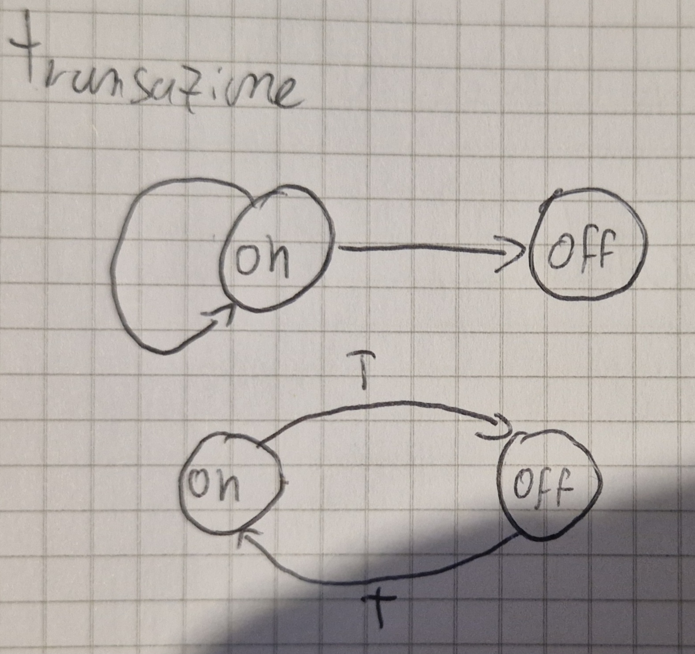

# Definizioni iniziali
## Lunghezza di una stringa
La **lunghezza** di una stringa è il numero di simboli contenuti in una stringa (anche detta 
cardinalità e si indica con |$x$|)

La stringa **vuota** è la stringa che ha zero elementi (|$\varepsilon$|)

Due stringhe sono **uguali** se e solo se:

- |$x$| = |$y$|
- $x$i = $y$i  $\forall$ 1$\le$i$\le$n

## Operazioni sui linguaggi

- Unione
- Intersezione
- Complemento
- Differenza
- Concatenazione
- Potenze n-esime
- Chiusura di Kleene

Prima di iniziare delle spiegazioni useremo le stringhe $L_1$ e $L_2$ così composte:

$L_1$ = {$\varepsilon$, a, b, c, bc, ca}

$L_2$ = {ba,bb, bc, ca, cb, cc}

Bene partiamo con la carrellata di operazioni

### Unione ($L_1$ $\bigcup$ $L_2$)

$L_1$ $\bigcup$ $L_2$ = {$\varepsilon$, a, b, c, ba, bb, bc, ca, cb, cc} tutti gli elementi **SENZA** ripetizioni

### Intersezione ($L_1$ $\bigcap$ $L_2$)

$L_1$ $\bigcap$ $L_2$ = {bc, ca} **SOLO** elementi comuni

### Differenza ($L_1$/$L_2$ o $L_1$-$L_2$)

$L_1$/$L_2$ = {ba, bb, cb, cc} **SOLO** elementi **NON** comuni

### Complemento ($L^c$ = $A^*$/$L$)

$A$ è l'alfabeto su cui $L$ è definito

$*$ vuol dire tutte le ripetizioni possibili di quell'insieme, $\varepsilon$ compreso.

$L_1^c$ = tutte le stringhe su {a, b, c}* tranne stringhe di lunghezza 2 che iniziano con "b", "c"

### Concatenazione ($L_1$$\cdot$$L_2$ o $L_1L_2$) **NON** è commutativa

$L_1$$\cdot$$L_2$ = {ba, bb, bc, ca, cb, cc, aba, abb, abc, aca, acb, acc, bba, bbb, bbc, bca, bcb, bcc, cba, cbb, cbc, cca, ccb, ccc, bcba, bcbb, bcbc, bcca, bccb, bccc, caba, cabb, cabc, caca, cacb, cacc}

### Potenza n-esima ($L^n$) concanetamento con se stesso n volte

$L^0$ = {$\varepsilon$}

$L^i$ = $L^{i-1}$$\cdot$$L$

La potenza **È** associativa

### Chiusura di Kleene

$L^*$ = $\bigcup_{n=0}^\infty L^n$

$L^+$ = $\bigcup_{n=1}^\infty L^n$

$L^*$ = $L^+ \bigcup L^0$ = $L^+ \bigcup$ {$\varepsilon$}

$L^+$ = $L \cdot L^*$

{$\varepsilon$} $\not ={\varnothing}$

# Automi a stati finiti

## FSA (Finite State Automaton)

Un **FSA** ha un insieme finito di stati ovvero un numero limitato di configurazioni

Es.

- {ON, OFF}
- {Canali TV}

Un FSA è definito su un alfabeto (a, b, c o anche on, off, anche 1, 2, 3, insomma simboli o parole che noi definiamo come "input" anche C o Java possono essere definiti come tale)

Quando si riceve un input, il sistema cambia il suo stato (**transizione**)

Gli FSA sono rappresentati tramite una tupla <$Q, A, \delta, q_0, F$>

- $Q$ insieme finito di stati
- $A$ alfabeto di ingresso
- $\delta$ funzione di transizione
- $q_0 \in Q$ **stato iniziale**
- $F \subseteq Q$ insieme **stati finali**

Per far sì  che gli FSA riconoscano un linguaggio è necessario:

- Sapere le condizioni iniziali del sistema
- Sapere gli stati finali ammisibili

Una sequenza di mosse è di accettazione se raggiunge uno degli stati finali

Esempio di un FSA:

## Trasduttori a stati finiti

### FST (Finite State Transducer)

Sono FSA con 2 nastri

È una tupla <$Q, I, \delta, q_0, F, O, \eta$>

- <$Q, I, \delta, q_0, F$> come gli accettori (FSA)
- $O$ alfabeto di uscita
- $\eta$ : $Q \times I \longrightarrow O^*$

Esempio FST

### Pumping Lemma

Se in un sistema a stati finiti si va da uno stato $q_1$ a $q_1$ (ovvero si attraversa un ciclo) vuol dire che lo si può fare n volte

Perciò se:

$x \in L$ e $|x| \ge |Q| \Rightarrow q \in Q$ && $w \in I^+$

- $x$ = $ywz$
- $\delta^*(q,w)$ = $q$

Dunque:

- $\forall n \ge 0 yw^nz \in L$

Conseguenze 

$L$ = $\empty$ se $\exist x \in L \longleftrightarrow \exist y \in L, |y| < |Q|$

$|L|$ = $\infty$ se $\exist x \in L  |Q| \Leftarrow |x| < 2|Q|$

Problemi

Per "contare" un numero n molto grande servirebbe memoria infinita

### Operazioni su FSA

N.B. se un sistema è **chiuso** rispetto a un operazione vuol dire che il risultato è sempre parte dell'insieme

Operazioni:

- Intersezione ( $\bigcap$ )
- Unione ( $\bigcup$ )
- Complemento ( $^c$ )

Sono operazioni **CHIUSE** negli FSA 

## PDA (PushDown Automata)

Sono FSA con una pila 

La stringa d'ingresso $x$ è accettata se:

- il PDA la legge tutta
- Quando finisce si trova in uno stato di accettazione

Un PDA è una tupla <$Q, I, \Gamma, \delta, q_0, Z_0, F$>

- $Q$ insieme finito di stati
- $I$ alfabeto di ingresso
- $\Gamma$ alfabeto di pila
- $\delta$ funzione di transizione
- $q_o \in Q$ è lo stato iniziale
- $Z_0 \in \Gamma$ simbolo iniziale di pila
- $F \subseteq Q$ insieme stati finiti

Esempio PDA:

#### Configurazione

- Mostra lo stato corrente del dispositivo di controllo
- Posizione della stringa d'ingresso
- La pila

È una tripla <$q, x, \gamma$>

- $q  \in Q$ stato corrente dispositivo
- $x \in I^*$ posizione **non** letta della stringa d'ingresso
- $\gamma \in \Gamma^*$ stringa simboli di pila

Le transizioni tra configurazioni ($\vdash$) mostra come commutare tra un PDA e un altro

Esempio

Dato $\delta(q, i, A) = <q', \alpha>$ è definita

$c=<q, x, \gamma> \vdash c'=<q', x', \gamma>$

- $\gamma =A\beta$
- $x = iy$

allora

- $\gamma' = \alpha\beta$
- $x' = y$

**Condizione di accettazione**

$\forall x \in I^* (x \in L \Longleftrightarrow \exist q \exist \gamma c_0 = <q_0, x, Z_0> \vdash^* c_f =<q, \varepsilon, \gamma>$ e $q\in F)$

La stringa viene accettata se c'è un cammino coerente che va sallo stato iniziale a uno stato finale

#### PDA VS FSA

- Gli FSA **NON** riconoscono $a^nb^n$ i PDA si
- Ogni linguaggio regolare (FSA) è riconosciuto da PDA
- I PDA sono più potendi dei FSA

I PDA non si fermano sempre dopo le mosse, ogni PDA si può trasformare in un PDA aciclico (si ferma sempre dopo le mosse)

### PDT (PushDown Trasducer)

I PDT sono una tupla <$Q, I, \Gamma, \delta, q_0, Z_0, F, O, \eta$>

- ($Q, I, \Gamma, \delta, q_0, Z_0, F$) come nei PDA
- $O$ alfabeto d'uscita
- $\eta$ : $Q \times (I \bigcup$ {$\varepsilon$} $)$ $\times \Gamma \longrightarrow O^*$

**Configurazione** <$q, x, \gamma, z$>

- $<q, x, \gamma>$ come nei PDA
- $z$ stringa già scritta sul nastro d'uscita

**Condizione di accettazione**

$\forall x \in I^* \forall z \in O^* (x \in L \bigwedge z = \tau(x) \Longleftrightarrow \exist q \exist \gamma c_0 = <q_0, x, Z_0, \varepsilon> \vdash^* c_f =<q, \varepsilon, \gamma, z>$ e $q \in F )$

La traduzione è definita solo se $x$ è accettata

Esempio di PDT

I PDT **NON** sono chiusi rispetto a Unione, Intersezione e Complemento

## Turing Machine (TM)

I PDA **NON** riconoscono $a^nb^nc^n$ o $a^nb^n \bigcup a^nb^{2n}$

La pila è una memoria distruttiva, letto un elemento viene eliminato

C'è bisogno di **NASTRI DI MEMORIA**

Le TM usano i nastri come memorie:

- Non distruttivi
- Scorrevoli in entrambi i sensi

I nastri sono sequenze infinite di celle con "Blank" (segnato come "$\cancel{b}$", "_" o "$-$")

##### Mosse

Uguali a prima con aggiunta di:

Spostamento testine dichiarato con 3 movimenti:

- Sposta a destra (R)
- Sposta a sinistra (L)
- Fermo (S)

Si esplicita **SEMPRE**

Le TM sono una tupla $<Q, I, \Gamma, \delta, q_0, Z_0, F>$

- $Q$ insieme finito di stati
- $I$ alfdabeto di ingresso
- $\Gamma$ alfabeto di memoria
- $\delta$ funzione di transizione
- $q_0 \in Q$ stato iniziale
- $Z_0 \in \Gamma$ simbolo iniziale di memoria
- $F \subseteq Q$ insieme stati finali

Esempio di TM

La **Configurazione** di una TM con k nastri è una (k+2)-tupla

$c=<q, x\uparrow iy, \alpha_1 \uparrow A_1 \beta_1,...,\alpha_k \uparrow A_k \beta_k>$

- $q \in Q$
- $x, y \in I^*; i\in I$
- $\alpha_r, \beta_r \in \Gamma^*, A_r \in \Gamma \forall r; 1\le r \le k$
- $\uparrow \notin I\bigcup \Gamma$

$\uparrow$ indica la posizione della testina

**Condizione di accettazione**

$\exist q \exist x' \exist i \exist y \exist \alpha_1 \exist A_1 \exist \beta_1....\exist \alpha_k \exist A_k \exist \beta_k$

$c_0 = <q_0, \uparrow x, \uparrow Z_0,...,\uparrow Z_0> \vdash_m^* c_F =<q, x'\uparrow iy, \alpha_1 \uparrow A_1 \beta_1,...,\alpha_k \uparrow A_k \beta_k>$ con $q \in F$ e $x = x'iy$

#### TM VS PDA

- $a^nb^nc^n$ **NON** sono riconosciuti da PDA ma da TM
- Se un linguaggio è riconosciuto da PDA allora è riconosciuto da TM

I linguaggi accettati da TM sono detti **ricorsivamente enumerabili**

#### TM e Macchine di Von Neumann (VNM)

La differenza sta nell'accesso alla memoria

- TM : Sequenziale
- VNM : Diretto

Il tipo di accesso **NON** cambia la potenza

Le TM possono  simulare le VNM

##### Operazioni TM

Le TM sono **chiuse** rispetto a:

- Intersezione $(\bigcap)$
- Unione $(\bigcup)$
- Concatenazione
- Stella di Kleene

**NON** sono chiuse rispetto a:

- Complemento
- Differenza

Se esistessero TM acicliche sarebbero chiuse al complemento, il problema sta dove le computazioni non terminano

### TM Trasduttrice

Le TM trasuttrici a k nastri sono una tupla di 9 elementi $<Q, I, \Gamma, O, \delta, \eta, q_0, Z_0, F>$

- $<Q, I, \Gamma, \delta, q_0, Z_0, F>$ come le TM
- $O$ alfabeto d'uscita
- $\eta$ funzione d'uscita

N.B. Le testine di uscita si muovono in 2 direzioni:

- Destra (R)
- Ferme (S)

Esempio di TM traduttrice

**Configurazione**

$c=<q, x\uparrow iy, \alpha_1 \uparrow A_1 \beta_1,...,\alpha_k \uparrow A_k \beta_k, u \uparrow o>$

- $\uparrow \in I \bigcup \Gamma \bigcup o$

Le TM possono:

- Riconoscere linguaggi
- Tradurre linguaggi accettati
- Calcolare funzioni

Le TM sono computer con accesso sequenziale alla memoria (Modello atratto)

Le TM possono avere nastri a n dimensioni

N.B. Più dimensioni **NON** aggiungono potenza

