## Introduction

Hello reader this is a short summary of our notes about the course "Biochip". If you find an error or you think that one point isn't clear please tell me and I fix it (sorry for my bad english). -NP

## Chapter Zero: Bases

**Definition of Biosensor:** A (chemical) sensor based on a biological entity.

Biosensor work with an Analyte and Receptors:

- Analyte: target molecule;
- Receptors: Receive the target and bind with it.

Analyte $\xrightarrow{bind}$ Receptor $\xrightarrow{change}$ Electronic transformation

**Planar configuration:** Receptor is immobilized on the sensor.

**Technological issue:** how to attach the molecule to a solid substrate while presenting its function (in a liquid environment) $\implies$ chemical functionalization.

**Geometrical Parameters (for simplify analysis):**

- Contour Length $(L):$ length of the macro molecule backbone.
- Radius of gyration $(R_g):$ for a folder, globular macromolecule is the average between the extremes.

Motion of fluids $\to$ Navier-Stokes

We work with fluids + particles and simple fluids.

## Chapter One: Fluids Law

Main properties of fluid:

- Density $(\rho)$
- Viscosity $(\eta)$
- Surface tension $(\gamma)$

Simple fluids:

- Newtonian
- Non-Newtonian

Complex fluids:

- Electrolytes: simple fluids + ions in solution
- Suspensions: simple fluids + large particles
- Complex fluids: fluids + heterogeneity change the properties

### 1.1 Properties

Density: $\rho = \frac{\text{Mass}}{\text{Volume}}[\frac{kg}{m^3}] \implies$ important to set flowing and sedimentation time of particles $\to$ decrease with temperature (higher is the temperature lowest is the density)

Viscosity: $\eta = \frac{F}{A} * \frac{y}{u} [P_a * s]$ but $\frac{F}{A}$ is called **shear stress** $\tau \to \eta = \tau * \frac{y}{u} \implies$ Express the resistance to deformation by $\tau$

- $F:$ force applied to win the resistance and to maintain a constant velocity $u$ of top plate (Area $A$)
- $u:$ velocity

Viscosity increase with the temperature (low temperature, high viscosity)

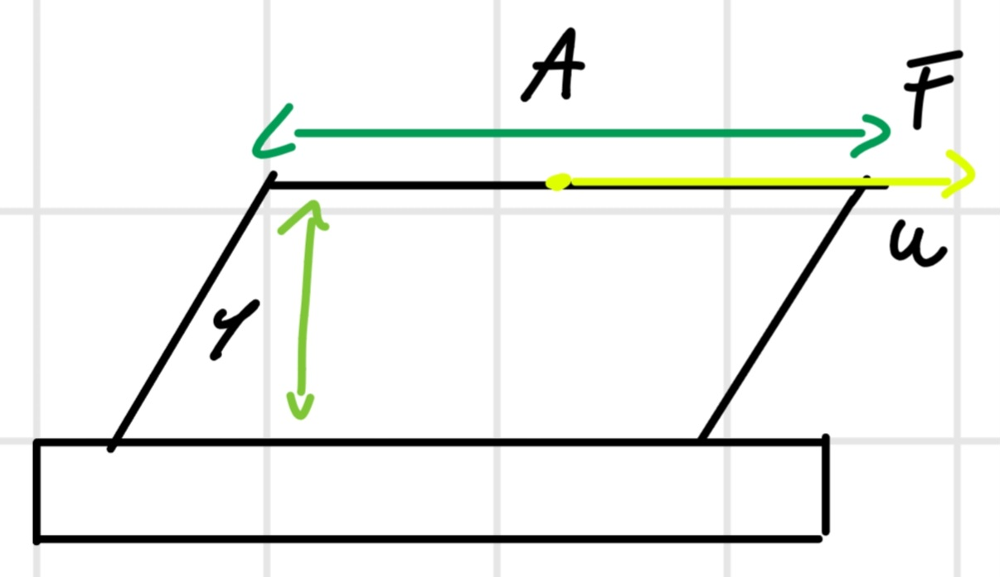

$\eta (T) = \eta_0 e^{-bT}$

Viscosity of blood estimates greater than water ($5,5$ vs $1$)

Non-Newtonian fluids

- Newtonian like water: $\eta$ independent by $\tau$
- Non-Newtonian like blood: $\eta$ dependent by $\tau$

Pseudo-Plastic: non-newtonian at some point the $\eta$ decrease and it's simplest to move (honey)

Dilatant: non-newtonian at some point the $\eta$ increase and it's hardest to move

### 1.2 Flow Regimes

**Laminar Flow**

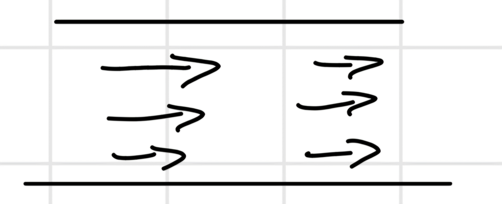

- No turbulence
- Reversible
- Minimum dissipation
- Unique solution

**Turbulent Flow**

Chaotic flow with vortex

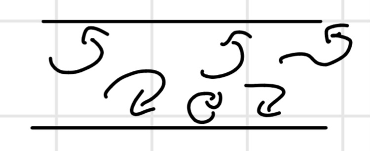

Reynolds Number: $R_e = \frac{\rho * 2r * v}{\eta}$

- $v:$ fluid velocity $[\frac{m}{s}]$
- $r:$ channel radius $[m]$
- $\rho :$ density $[\frac{kg}{m^3}]$
- $\eta :$ viscosity $[P_a * s]$

$R_e < 2300$ laminar flow.

$R_e > 3000$ turbulent flow. 

We work with $R_e < 1$ usually

For non-circular conduits we use an approximation to work to an equivalent circular radius

$r_{eq} = \frac{2*Area}{Perimeter}$

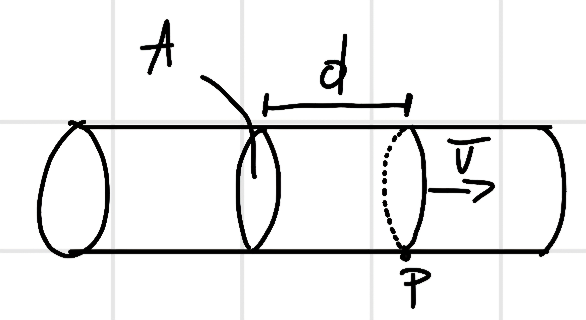

$\overline{v} = \frac{d}{t}$

$Q = \frac{V}{t} = \frac{A*d}{t} = A*\overline{v}$

- $Q:$ Volumetric flow rate $[\frac{m^3}{s}]$
- $V:$ Volume $= A*d$
- $v:$ velocity

### 1.3 Velocity profiles

For pressure-driven laminar flow, the no slip condition at the conduit walls implies that $v=0 \implies$ parabolic velocity profiles.

We have difference due the slip with the wall, so:

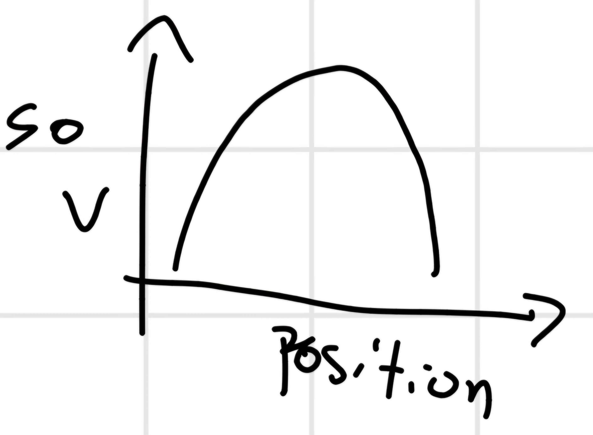

The velocity change with the channel changes

### 1.4 Resistance to Flow 

The energy dissipated in the friction of the fluid against the conduit walls requires a pressure difference $\Delta P$ to create a flow rate $Q [\frac{m^3}{s}]$

**Poiseuille law:** $Q = \frac{\Delta P}{R}$

$R:$ fluidic resistance, depends on the conduit section $[\frac{P_a * s}{m^3}]$

The analogous of $Q$ is $I = \frac{\Delta V}{R}$, will be a lot of analogy with electronic law and fluids one.

How calculate $R$ know the characteristic of the conductor:

$R = \frac{8*\eta*L}{\pi * r^4} [\frac{P_a * s}{m^3}]$

Whit rectangular section (so, without approximation)

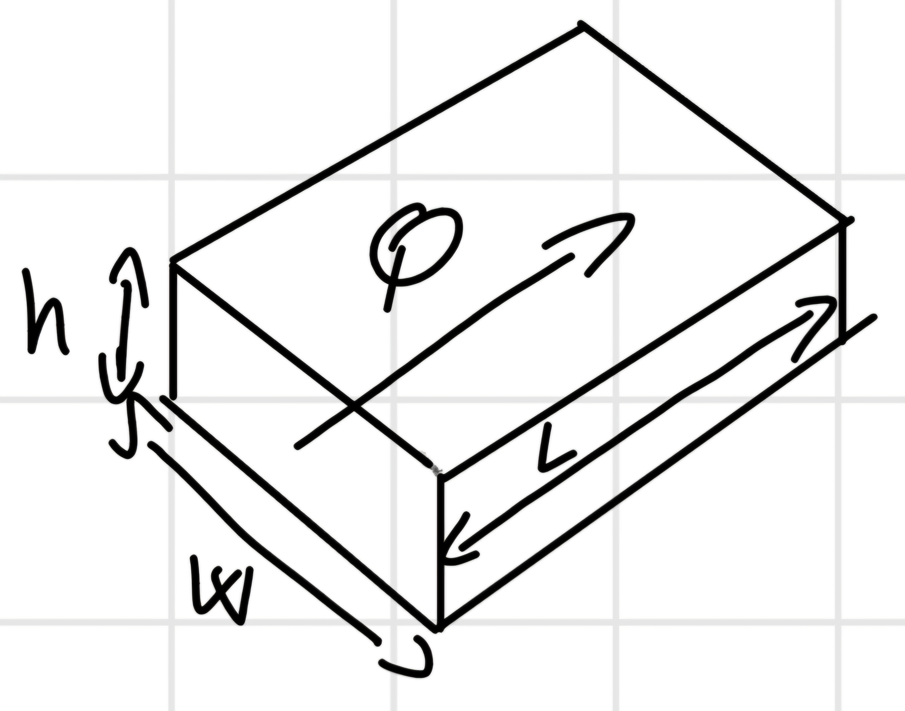

$R = \frac{12* \eta * L}{C(\frac{w}{h}) * h^3 *w}$

$C:$ friction factor.

So in our case, if $\frac{w}{h}>1,4$ use the formula without approximation, otherwise the other one.

$C(\frac{w}{h}) = (1 - 0,63 \frac{h}{w})$

Mass conservation Law: like Kirchhoff

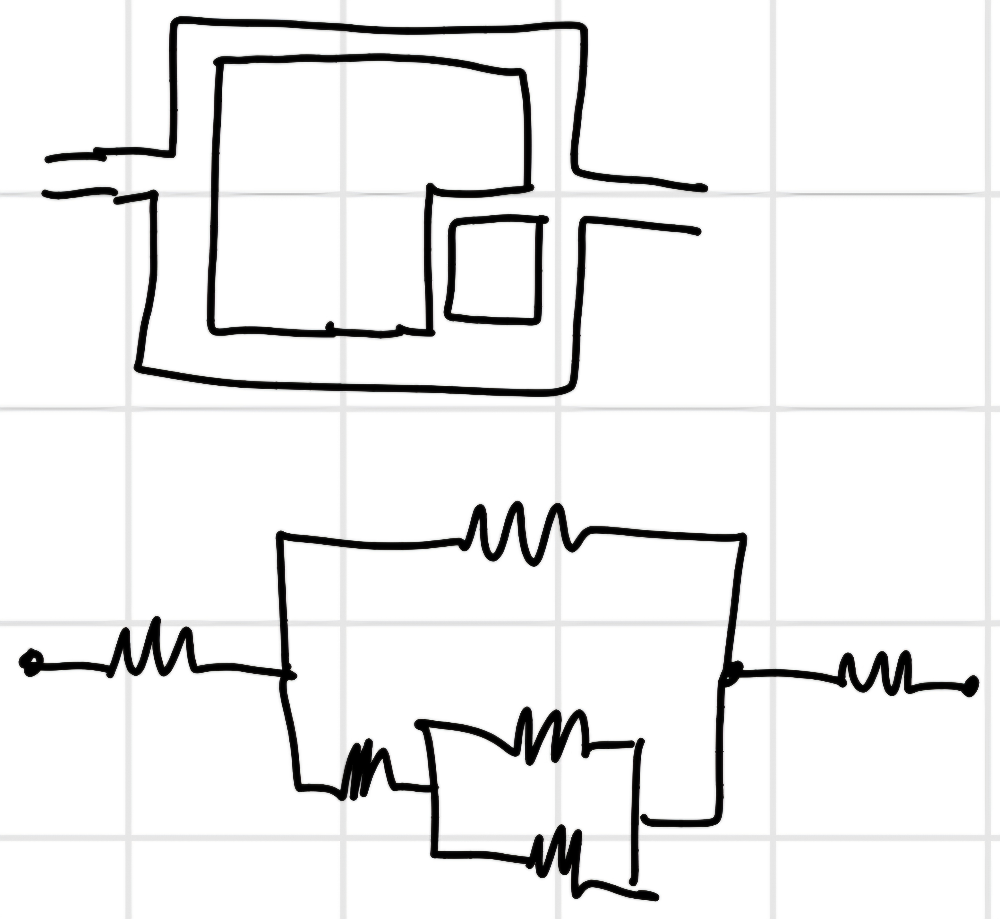

We can use the same law of the conservation of voltage in the fluids case.

### 1.5 Hydrodynamic Capacitance

$Q = C_h \frac{d \Delta P}{dt}$

$C_h = \frac{\int{Q(t) dt}}{\Delta P} = \frac{Volume}{\Delta P} [\frac{m^3}{P_a}] \implies$ analogous with electronic capacity.

Time constant: $R_h * C_h [s]$

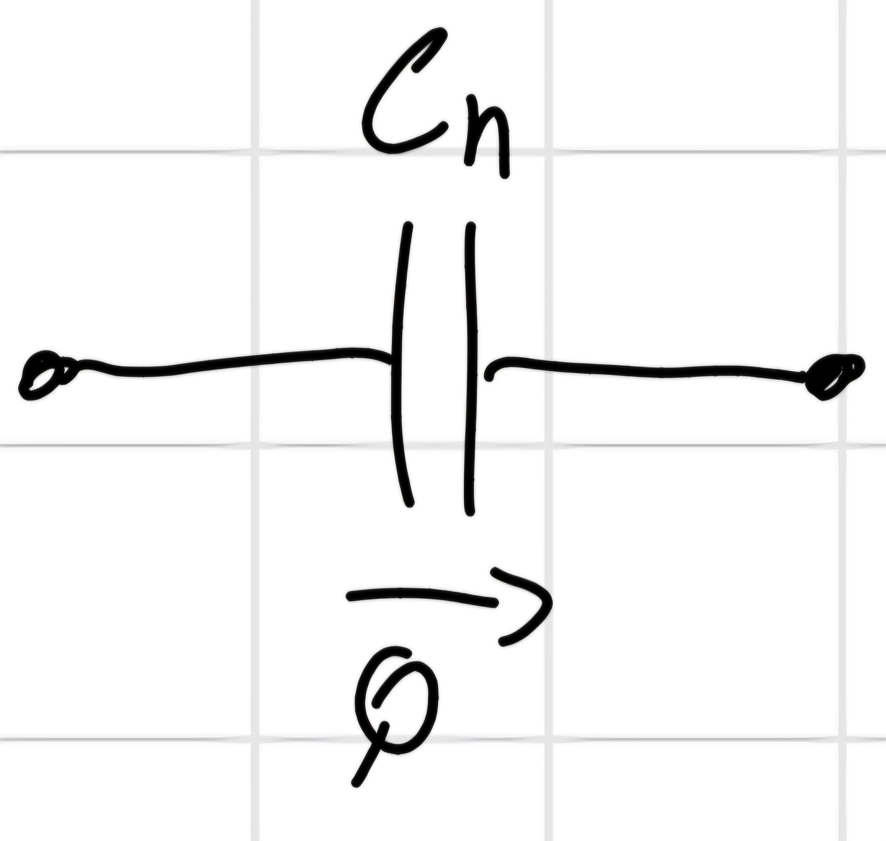

Type of walls:

- Rigid wall, incompressible $C_h = 0$
- Rigid wall, incompressible fluid, bubble with ideal gas: $C_h = \frac{p_0 * V_0}{p^2}$
- Flexible wall, incompressible fluid: $C_h$ is a function of geometry and material properties.

### 1.6 Surface Tension

Force necessary to break the surface

$F = 2\gamma * L + mg$

$\gamma:$ surface tension coefficient $[\frac{N}{m}]$

Meniscus in a capillarity

- Concave $F_{\text{adhesion}} > F_{\text{cohesion}}$
- Convex $F_{\text{adhesion}} < F_{\text{cohesion}}$

POV of the surface

**Wettability:** Ability of a liquid to adhere to a solid surface.

In case of water, the surface can be:

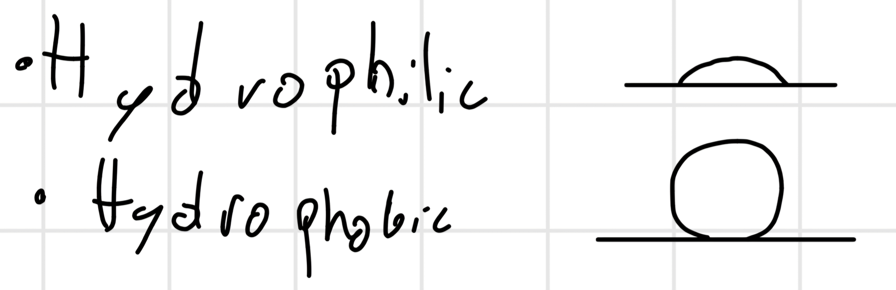

We can determine the wettability using the **contact angle** $\theta_c$ 

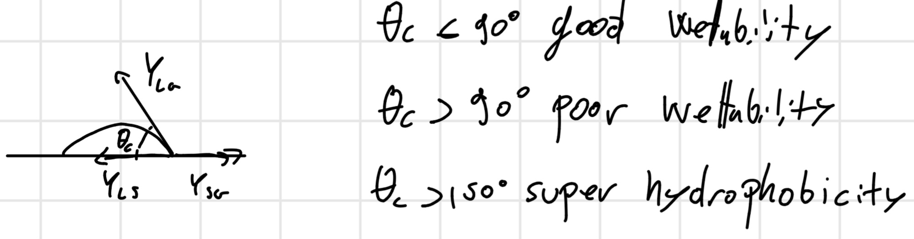

It possible uses the electricity to modify the surface wettability, liquid must contain ions.

### 1.7 Forces in Micro fluidic system

#### 1.7.1 Diffusion

If we put a drop of ink in a cup of water, we can see the diffusion $\implies$ Brownian motion $\to$ tends to the equilibrium with a random walk.

A spatial gradient of molecule $(mass)$ concentration $C[\frac{kg}{m^3}]$

**Fick's law:** $J = -D \frac{\partial C}{\partial x}$

$D:$ diffusion coefficient $[\frac{m^2}{s}]$

$J: \frac{\partial m}{\partial t \partial A}$

$L_{diff} = \cong \sqrt{D t}$

Diffusion coefficient: $D = \frac{k*T}{6*\pi*\eta*r} \to$ spherical particles at low $R_e$

Diffusion time is a lot, diffusion is slow: 

- $L = 1cm \to \Delta t = 7$ hours.
- $L = 10 \mu m \to \Delta t = 25 ms$ at minus scale is acceptable.

$1fM \implies D = 1,5*10^{-6} \frac{cm^2}{s}$

Peclet Number: $P_e = \frac{v * L}{D}$

- $v:$ fluid velocity;
- $L:$ length scale;
- $D:$ diffusion coefficient.

Quantitative figure of merit of the competition between forced flow and diffusion transport.

#### 1.7.2 Drag Force

A particle moving in a viscous fluid (viscosity $\eta$) with relative velocity $v \to$ friction force (drag).

For spherical particles of radius $r$ and $R_e$ low: $F_{drag} = -6 * \pi * \eta * r * v$

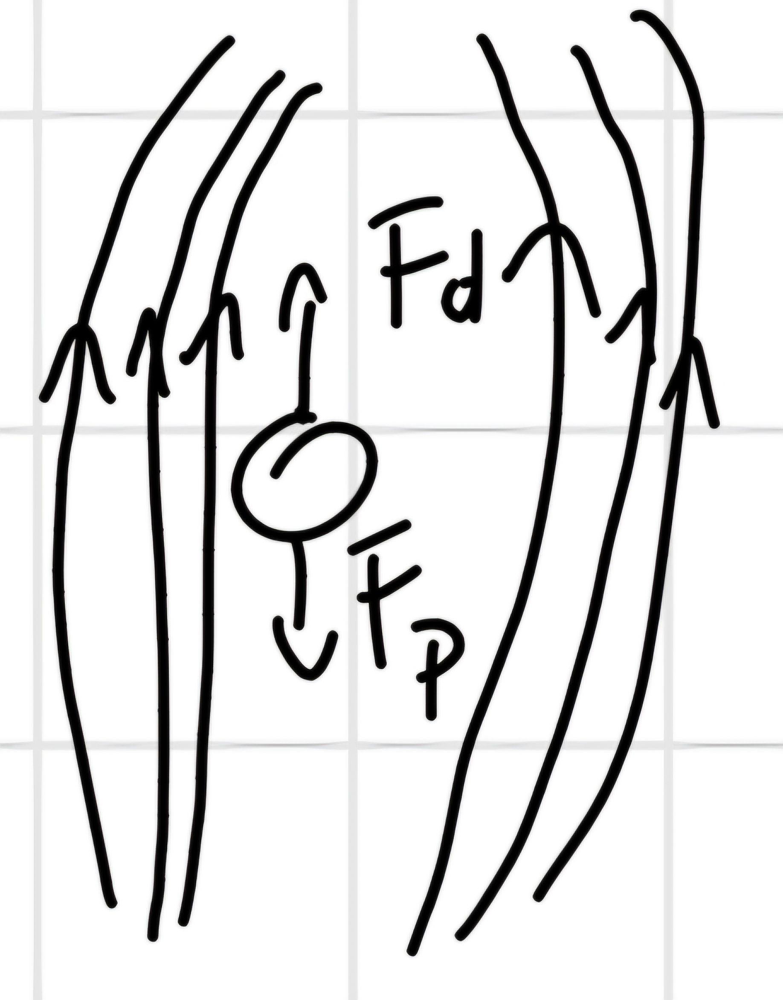

Electrokinetics: Electrostatic Coulomb force on a charged particle $(q)$ immersed in an electric field $E$

$F_E = q* E = F_d = 6 \pi \eta r v \implies$ migration velocity: $v = \frac{q}{6 \pi \eta r} E = \mu * E \to \mu = \frac{q}{6 \pi \eta r}$

$\mu:$ electrophoretic mobility

In constant $E$, the transit time depends on the mobility of the molecule. $\mu \cong \frac{q}{r},$ depends on the size.

In this case we don't use water but gel $\to$ higher viscosity.

#### 1.7.3 Dielectrophoresis (DEP)

Neutral dielectric particles in liquids can moved by means of DEP, a net force that acts on the particle in a non-uniform electric field (gradient).

- **Polarization:** ability of the particle to be polarized in an external field $E$, $\vec{p} = \alpha \vec{E}$

$\alpha = \frac{\vec{p}}{\vec{E}} [\frac{cm^2}{V}]$

- **Permittivity:** every material have a permittivity constant, $\varepsilon$, to study the function of frequency we need the complex one, $\varepsilon^* = \varepsilon + \frac{\sigma}{jw}$

$\sigma:$ conductivity

- **DEP Force:** $\vec{F} = \vec{P} * \nabla E = \alpha * \nabla E^2$

For homogeneous spherical particle (radius $r$, permittivity $\varepsilon_p$) in a surrounding medium $\varepsilon_m$ the force is:

$\vec{F} = 2 *\pi * r^3 * \varepsilon_m * Re\{K_{CM}(w)\} * \nabla E^2$

Clausius-Mossoni Factor: $K_{CM}(w) = \frac{\varepsilon_p^* - \varepsilon_m^*}{\varepsilon_p^* + 2*\varepsilon_m^*}$

$Re\{K_{CM}(w)\} \to$ DEP force.

$Im\{K_{CM}(w)\} \to$ Electrorotation.

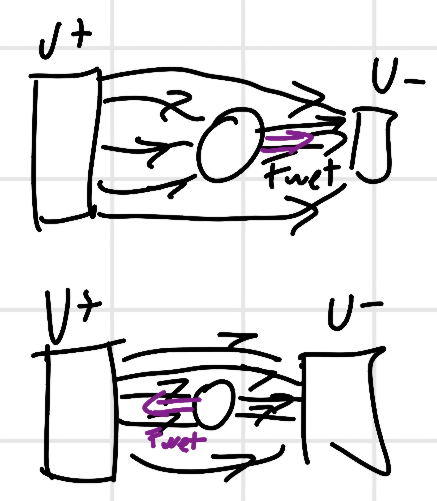

Digital Microfluidics $\to$ based on the manipulation of single droplets.

$2$ way:

- Channel based;
- Surface based.

How manipulate one droplets:

- Fluids (pomps and same way seen);
- Electrowetting, use electricity to move the droplet $cos(\theta) = cos(\theta_0) + \frac{1}{2*\gamma} C * V^2$