## Introduction

Hello reader this is a short summary of our notes about the course "FAI". If you find an error or you think that one point isn't clear please tell me and I fix it (sorry for my bad english). -NP

## Chapter  One: The cell

**Cell**: Unit of living being

Divided in:

- Prokaryotes
- Eucaryotes

**Prokaryotes**: Have a nucleus not clearly separated from the rest of cellular matter. Are unicellular organisms.

Structure:

- Cell wall;
- Plasma membrane;
- Cytoplasm;
- Chromosome;
- Ribosome;
- Flagellum.

**Eukaryote**: enclosed by a plasma membrane that contain:

- Cytoplasm;
- Nucleus, enclosed by nuclear envelope.

### 1.1 The Big Four

All the cell are constituted by 4 main types of macromolecules:

- Proteins -> constituted by aminoacids;
- Polysaccharides;
- Lipids;
- Nucleic acids (e.g DNA).

Aminoacids' structure:

1 Central atom of carbon ($C$) linked with:

- 1 atom of $H$
- 1 amino group ($-NH_2$)
- 1 carboxylate group ($-COOH$)
- 1 side-chain ($R$)

Nucleic acids:

- **Ribonucleic acids, or RNA**
- **Deoxyribonucleic acids, or DNA**

**DNA**= contains ALL the genetic information that is necessary for the life of the host organism. It's organized in chromosomes.

Prokaryotes have only one chromosomes.

A cell can be haploid, diploid, triploid,...

This means that the n° of the chromosomes are $n$, $2n$, $3n$,...

### 1.2 Mitosis

**Mitosis** -> Asexual reproduction for a single cell.

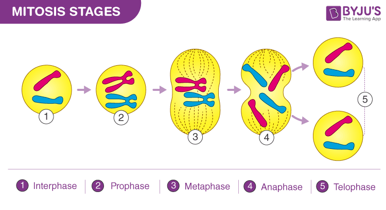

### 1.3 Meiosis

**Meiosis** -> Sexual Reproduction between:

- One male sexual cell -> spermatozoon
- One female sexual cell -> ovum

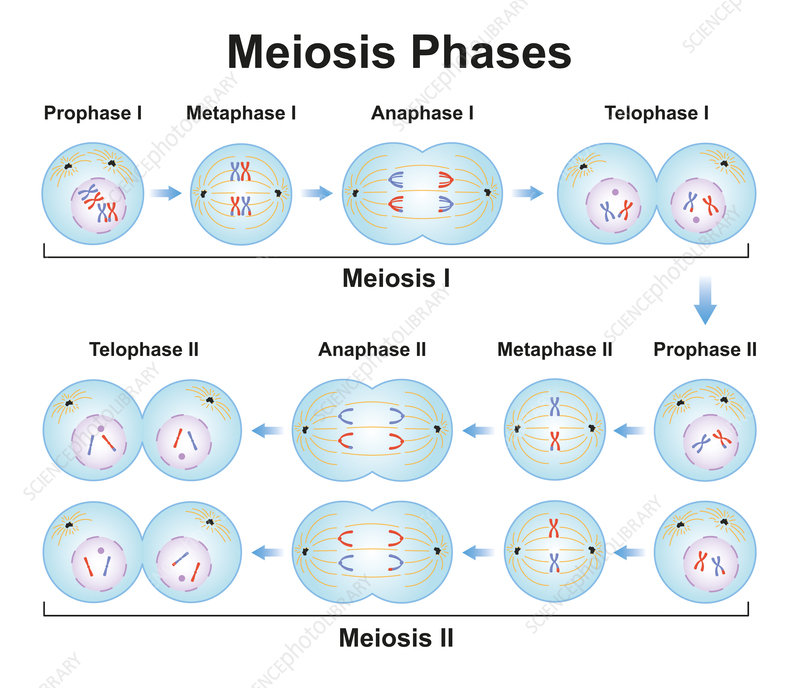

## Chapter Two: Mendelian Genetics

In the 1865 Gregor Mendel create the **inheritance transmission laws**

### 2.1 First Law: Law of dominance 

Mendel crossed plans that differ for only one alternative discrete character so pure dominant ($RR$) and pure recessive ($rr$)

The result that him obtain was all the four children displayed only dominant traits.

### 2.2 Second Law: law of segregation

- Each individual produces equal quantity of gametes with one or the other allele
- Gametes combine **randomly**

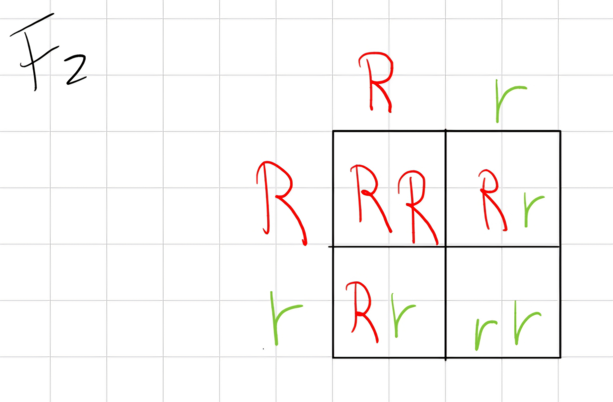

Ratio is $3:1$

3 dominant;

1 recessive.

### 2.3 Third law: law of trait independent segregation

In F3 with 2 traits ratio is $(3:1) * (3:1) = 9:3:3:1$

9 dominant;

3 dominant trait and recessive

3 recessive and dominant

1 pure recessive

The second law evident that:

- The number of traits in an organism is much largest than the number of chromosomes -> each chromosome must contain more than one gene.

- Gene are not always inherited independently.

**Linkcage:** association between genes or groups of gene.

Thomas H. Morgan demonstrated the association among different genes of a chromosome exists, but is not total.

**crossing - over**: during meiosis, homolog chromosomes can exchange genetic material.

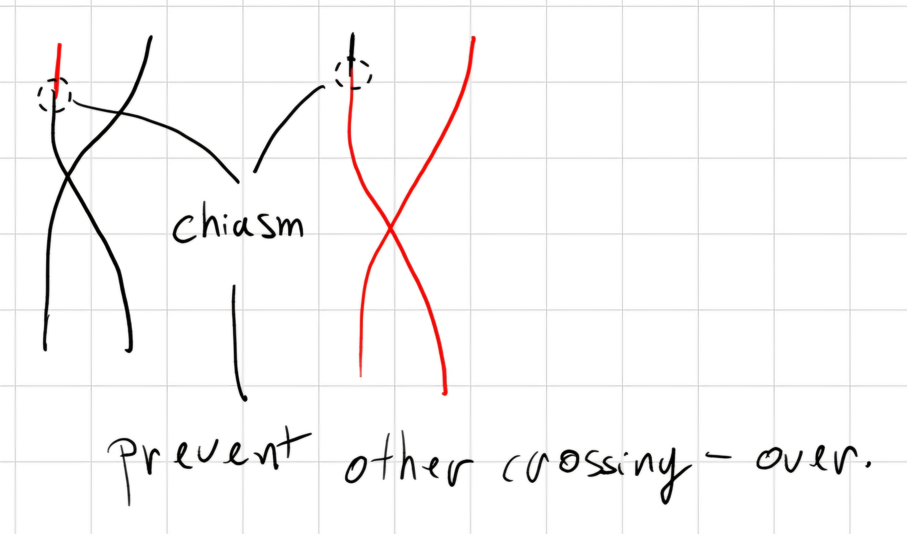

1 centimorgan $\implies$ percentage of a recombined chromosomes in off springs, as a measure of the relative distance for a gene pair.

The percentage of recombination between two genes is proportional to their relative distance.

### 2.4 Sexual characters

Inheritance of genetic characters has particular importance for genes located on sexual chromosomes.

Sexual chromosomes: $X$ and $Y$

- $XX$ -> female
- $XY$ -> male

In human, genes located in $X$ and $Y$ are associated with sex.

There are traits, influenced by sex and limited by sex.

Some pathologies linked to genetic alterations on $X$ or $Y$:

- Color blindness ("Daltonismo", incidence $8\%$ men, $0.00064\%$ women);
- Hemophilia ("Emofilia");
- Turner's syndrome (one $X$ chromosome in female sex, it brings short height and sterility);
- Klinefelter's syndrome (an extra $X$ chromosome in male sex, so $XXY$);
- Aneuploidy: anomaly in the number of chromosomes.

For the genetic transmission the normal allele is dominant, the mutated one is recessive.

Gene can interact, generating unpredicted phenotypes and anomaly, like:

- Incomplete dominance -> pink flowers (red x white)
- Co-dominance -> AB blood group
- Polygenic inheritance -> expression of more than one gene

**Phenotype**:  group of observable characteristics.

phenotype: genotype + environment 

Same genotype can express different phenotype example: a female bee with the same chromosome complement of others, can became queen bee only if fed with royal jelly, otherwise it becomes workers bee.

1908, G.Hardy and W. Weimberg $\implies$ in a balance population frequencies of genes and genotype tend to remain constant.

Given the distribution of paired $A$ and $a$ alleles we want to know the relative frequencies.

Pair: $AA, Aa, aa$ -> the frequencies of $A$ is unknown because it is present in $AA$ and in $Aa.$

$p:$ frequency of $A$.

$q:$ frequency of $a$.

$p+q = 100 \% \implies p = 1 - q \rightleftarrows q = 1 - p$

$AA: p^2$

$aa: q^2$

$aA: 2pq$

So if $AA + 2Aa + aa = (A+a)^2 = 1$

::: {.callout .callout-definition title="Hardy - Weimberg's law"}
$p^2 + 2pq + q^2 = (p+q)^2 = 1$.
:::

Now we proved that the frequencies remain constant.

Given as known that $AA$ is $p^2$, $Aa$ is $pq$ we can said that $f_A: p^2 + pq$, but we know that $q = 1 - p$ so:

$$
\begin{align*}
    f_a : p^2 + p(1-p) \implies p
\end{align*}
$$

we can do same reasoning fo $f_a$

When this happen we said that the population is balanced.

**Fitness:** The measure of reproductive ability of an individual.

## Chapter Three: Molecular genetics

### 3.1 DNA

DNA (Deoxyribonucleic Acid)

- Biggest macromolecule in the cell.
- Polymer composed by 4 monomers, **nucleotides**:

  - 1 molecule of sugar, with 5 atoms of carbon that bond with:

    - 1 phosphate group (phosphoric acid $-P$)
    - 1 molecule containing nitrogen ($N$) ($1$ of the $4$ nitrogenous bases: $A,C,G,T$)

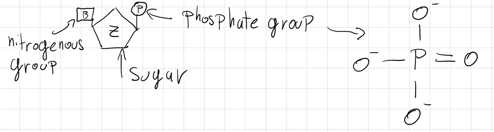

**DNA Chain:** long sequence of nucleotides linked by the bond between the phosphoric acid of a nucleotide and the sugar of the subsequent nucleotide.

This bond is called $3' - 5'$

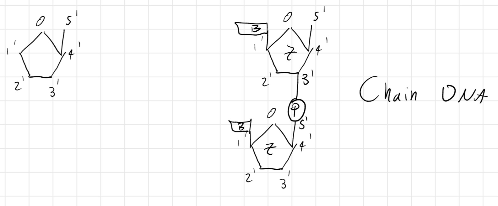

- Adenine ($A$) and Guanine ($G$) $\implies$ Purines
- Thymine ($T$), Cytosine ($C$) and Uracil ($U$) $\implies$ Pyrimidines

In 1953, Watson and Crick defined the exact spatial structure of DNA considering two experimental result:

- DNA base's composition;
- Diffraction spectra from $X-rays$ of pure DNA fiber's crystals.

In 1945 Chargaff found that in the DNA of each organism.

::: {.callout .callout-definition title="Chargaff's rules"}
- $n°\text{Adenine}(A) = n°\text{Thymine}(T)$.
- $n°\text{Cytosine}(C) = n°\text{Guanine}(G)$
- or $\frac{A}{T} = \frac{C}{G} = 1$
:::

In 1945 Rosalind Franklin and M. Wilkins obtained the first photographs of diffraction spectra from x rays of pure DNA fibers' crystals, that showed:

- DNA with helix structure.
- 2 characteristic periodicity, at $0.034 \mu m$ and $0.0034 \mu m$ on the main molecular axis.

From this information:

- Model of double helix;
- The structure of the DNA spontaneously arranges the temperature, pH (acidity) and humidity, with following characteristics:

  1. Double helix, two polynucleotide chains, right-handed coil. 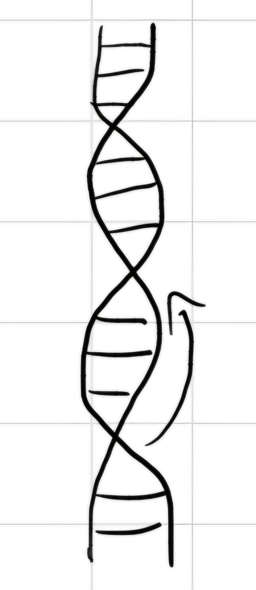
  2. Nucleotide bases are arranged in the internal part of the helix, backbone sugar-phosphate is in the external part.
  3. Nucleotide bases interact by weak hydrogen bonds ($H$)
     -   $A$ and $T$, $2 H-$ bonds.
     -   $C$ and $G$, $3 H-$ bonds.
         
         $A-T$ and $C-G$ are called **pairs of complementary bases**
  4. $H-$ bonds are also strengthen structure of the helix.
  5. There are $10$ pairs of bases for each helix turn. Pairs are spaced of $0.00034 \mu m \implies$ pitch $0.0034 \mu m \implies$ double helix diameter: $0.002 \mu m$
  6. The two nucleotide chains are anti-parallel $\implies$ opposite direction (one from $3'$ to $5'$, the other from $5'$ to $3'$)
  7. Double helix has $2$ grooves on the surface, one bigger than the other, in these grooves, protein interactions occur for DNA replication and genetic transcription.

**bp:** base pair $\implies n°$ of base pair before a regular behaviour

DNA's structure types:

- Double helix of Watson and Crick $\implies$ **B-Shape** characteristic of living cells, if humidity is low DNA is more compact and wide $\implies$ **A-Shape**.
- Exist also a DNA structure $\implies$ **Z-Shape**, with zigzag course backbone sugar-phosphate, thinner structure and left-handed coiling.

Each human cell $\to$ $1m$ of DNA $\implies$ **packaging**, technique that ultra compress the DNA.

### 3.2 RNA Structure

RNA is the protagonist in the synthesis of proteins.

Structural different point of view, RNA to DNA:

- Ribose as sugar.
- $U \to$ Uracil instead of $T$.
- Always exists as single chain -> in a complex tridimensional structures.

In some living being without DNA, RNA plays a leading role in reproduction process.

In cells, there are different types of RNA:

- Messenger RNA (mRNA);
- Ribosomal RNA (rRNA);
- Transfer RNA (tRNA);
- Small nuclear RNA (snRNA);
- Small interfering RNAs (siRNA);
- micro RNA (miRNA);
- long non-coding RNAs (long ncRNAs);
- Antisense RNAs.

Of all these, mRNAs, rRNAs and tRNAs play important roles in proteins synthesis, others in regulation.

### 3.3 Virus

**Genome:** genetic material of an organism.

Generally indicates DNA, often also RNA and proteins.

- Bacterial cells -> haploid genome ($n$)
- Majority of Eukaryote cells -> diploid genome ($2n$)

**Viruses**: The most simple life forms -> cellular parasites.

They must use another cell for reproduce themself.

**Virus genome:** 1 molecule of nucleic acid (DNA or RNA) enclosed in a protein shell (capsid) with different shapes.

The viruses can be divided in 3 classes:

- Virus of bacteria;
- Virus of plants;
- Virus of animals.

**Bacteriophages**: capsid with icosahedral head, containing genetic material, connected to a hollow cylinder (tail) to which filamentous structures (spikes) are linked, which allow the hanging of the virus on the bacterial cell's wall.

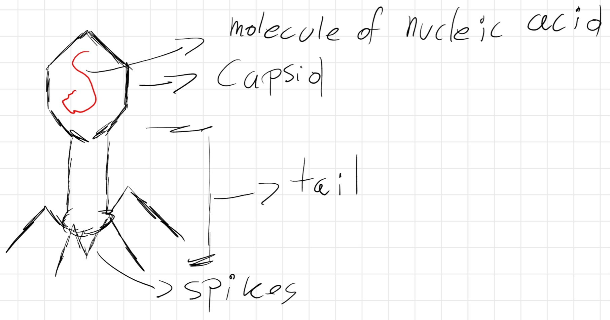

When hanged, virus injects it genetic material inside the cell, where it reproduces itself.

#### 3.3.1 Virus of eukaryote cells

- Capsid mainly icosahedral or filamentous.
- Genetic material is variable in structure:
  - single or double helix
  - linear or circular
  - segmented or complete
- Majority of plants' virus are RNA virus
- Many viruses can include their genome in the host cell $\implies$ **Cellular transformation**

**Cellular transformation:** phenomena coming from integration of virus in host cell's DNA.

#### 3.3.2 Retrovirus

**Retrovirus:** e.g Human Immunodeficiency Virus (HIV).

- $1$ or 2 molecules of RNA.
- Enzyme reverse transcriptase;

$$
\begin{align*}
  \text{Viral RNA} \xrightarrow{\text{reverse transcriptase}} \text{Viral DNA}
\end{align*}
$$

Then transformed in double helix by another enzyme active in cell nucleus, **DNA polymerase**.

$\implies$ genome virus can integrate in the host cell's genome and reproduce itself.

### 3.4 Bacterial genome

**Bacterial cells**: (prokaryotes) don't have a defined nucleus, but a compact structure (nucleoid):

- $1$ molecule of DNA
- usually circular
- $1mm \to$ bacterial cells in $1 \mu m$
- super-coiling
- $2k-2.5k$ genes in continuous sequence.

In many bacteria, there are also small circular molecules of DNA $\to$ **plasmid**

- advantageous characteristics;
- can integrate in cellular genome and detach themselves bringing a variable genetic mix with mix.

Exist variant plasmid:

- **R plasmid** (Resistance plasmid): determines cell's resistance to cations of heavy metals or antibiotics.
- **Degradation plasmid**: Allow the bacterium to metabolize stable chemical compounds $\to$ pollutes areas' recovery.
- **Fertility factor:** cells containing it are called male ($F^+$), others female ($F^-$):
  - sex pilus $F^+$ cells can transfer to $F^-$ a copy of $F$ plasmid -> conjugation $F^- \to F^+$.
  - Conjugation allows "horizontal transfer" of genetic material.

### 3.5 Genome of Eukaryote

- More complexity
- Contains different linear molecules of DNA -> each contained in a chromosome .
- $\#$ chromosomes is **NOT** proportional to dimension of genome.

Chromosomes $\xrightarrow{constituted}$ chromatin $\implies$ 

- $50\%$ DNA.
- $50\%$ protein and RNA.

If a protein is strictly linked to DNA is called **histones**

Chromatin has structured like a necklace:

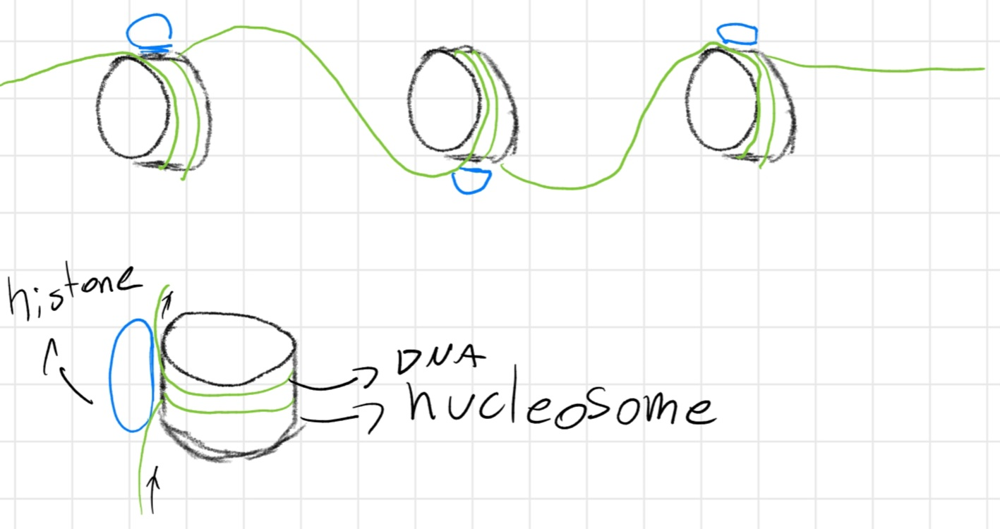

**Context: cellular division**

**Metaphase:** Chromosomes assume the X shape:

- 2 linear elements $\to$ **chromatids**
- the center is called **centromere**

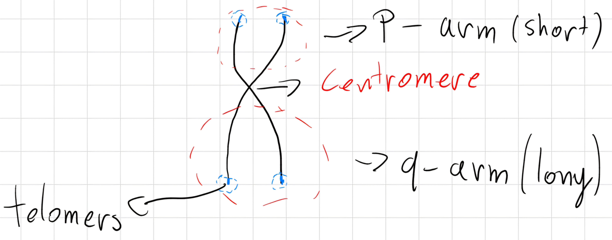

The position of centromere, length of chromatids and dimension of chromosomes identify different chromosomes -> **karyotype** of the organism.

I can highlight areas with rich in $A$ and $T$ bases

the areas with rich in $C$ and $G$ remains pale.

I generated a striped arrangement -> **bands**

**Nomenclature:** Each band has a specific nomenclature (e.g. $6p21.3$)

- $\#$ chromosome (6);
- arm (p -> short one);
- region (2 group of bands visible in the arm starting from centromere);
- band (1 -> counting from centromere to telomere);
- sub-band (3 -> counted from centromere).

Not all genetic material of eurokaryotes is in the nucleus.

Small fraction of circular DNA is in cellular organelles:

- Only in vegetal cells -> **chloroplasts**
- **mitochondria**

Extra-nuclear genes in **cytoplasm** are transmitted to the off spring just by the ovum -> **maternal inheritance**

To guarantee the transmission, the DNA is copied -> **duplication**

Same process in eukaryotes and prokaryotes, semi-conservative -> each daughter has $1$ strand of DNA  of the mother and $1$ of new synthesis.

**Semi-conservative duplication:**

- Zip opening of the double helix
- Exposition of single bases -> act as mold.
- Pairing of bases between free nucleotides in the cell and the complementary ones in the mold ($H-$ bond)
- Nucleotides of paired bases bond to create new strand.

The $2$ double helixes consisting in:

- $1$ parental helix
- $1$ new synthesized helix

**Replication fork:** Area where double helix opens and synthesis starts.

The duplication happens in specific position at a time (not concurrent):

1. Use a specific enzyme for opening localization.
2. Copying pairing of bases and polymerization of nucleotides.
   
   $\xrightarrow[\text{enzymes}]{}$ **DNA polymerase $Ⅲ$ and $Ⅰ \implies$ both direction 

   On $5'$ to $3'$ copying.

   On $3'$ to $5'$ copying but we have **okasaki fragments**, segment of DNA that are synthesized and linked on DNA discontinuously by **DNA ligase** enzyme.

3. Re- closing of double helix by specific enzymes.

### 3.6 Gene structure

**Codon:** triplet of bases.

But how the gene is structured ?

- **Prokaryotes**

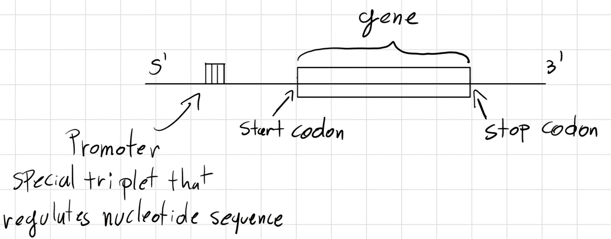

- **Eukaryotes**

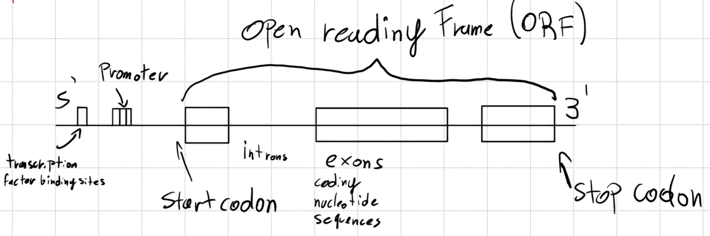

**start codon**: unique triplet which declares the beginning of the gene.

**stop codon:** unique triplet which declares the end of the gene.

**Human genome** -> $3000 Mb$ (Mega bases) $\implies 22k - 25k$ genes.

- Coding area $90 Mb$ ($3\%$ of genome).
- $> 50\%$ of genome -> repeated sequences:
  - Tandem repeats ($10\% - 15\%$ DNA) repetitions adjacent $ATTCG\bold{ATTCG}$
  - Interspersed repeats ($35 - 40\%$ DNA) repetitions are scattered along DNA.

**Central Dogma of Molecular Biology** (Crick 1958)

Transcription DNA to RNA from $5'$ to $3' \implies$ only one helix of DNA is used -> **mold helix**

Synthesis is catalyzed by enzyme **RNA polymerase** -> different in prokaryotes and eukaryotes.

- In prokaryotes:
  - $5$ subunit ($2 \alpha = \alpha_2, 1 \beta, 1 \beta'$ and $1 \sigma$)
  - Transcribes all types of RNA

3 phases:

1. Starting transcription
   
   - RNA polymerase bonds (with its $\sigma$) with gene's promoter.
   - $\sigma$ detaches and transcription starts
2. POlymerization of polynucleotide RNA -> **elongation**
3. Detaching of synthesized RNA  and end of transcription.

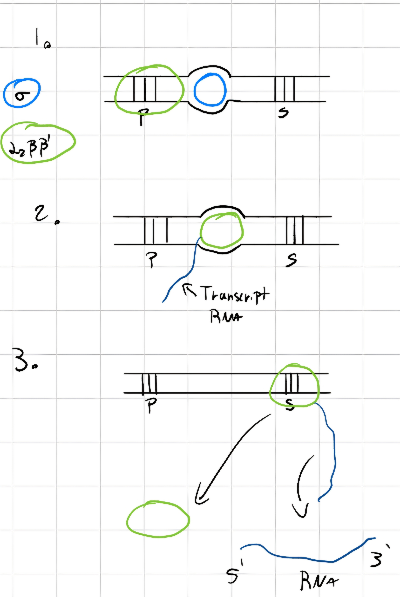

**Transcription factors**: proteins;

The transcription factors  necessary for each polymerase.

RNA polymerase synthesizes RNA in continuous way.

- Eukaryotes, genes are fully transcribed -> **pre-RNA**

**splicing:** In eukaryotes, remove intron from pre-RNA -> **mature RNA**

There are different types of splicing:

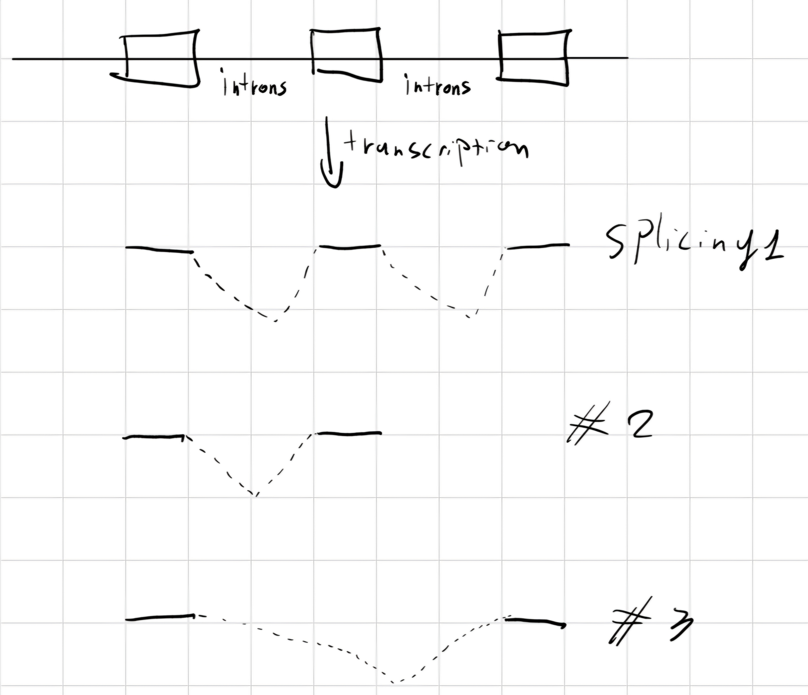

In a gene with alternative splicing, the majority of exons is always included in final mRNA.

Exist 4 types:

- **cassette exons:** full exons transcribed only in some cases.
- **Isoforms of introns/exons:** boundaries of introns and/or exons can be different, with clipping/extension.
- **Introns retention:** Introns can be contained in final transcript.
- **Mutually exclusive exons:** different exons can be included in different final transcripts.

Splicing is not well-know process.

In some cases, small Nuclear RiboNucleoProtein (SNRNP) cut:

1. $5'$ end of intron by dinucleotide $GU$
2. In $3'$ end by dinucleotide $AG$
3. exons link together.

Exist some intron that follow $GU-AG$ rules without SNRNP -> **auto-splicing** -> these RNA are called **ribozyme**

After splicing -> **stabilizing mRNA** by adding:

- At initial extremity $7-$MethylGuanine
- At final extremity Adenines.

### 3.7 Different types of RNA 

- **Ribosomal RNA (rRNA)**

Structural and functional components of ribosomes, where the synthesis of proteins occurs.

- **Transfer RNA* (tRNA)**

- Small molecules ($75 - 95$ nucleotides)
- Function: transport of aminoacids to RNA bonded to ribosomes.
- tRNA -> cloverleaf structure -> NO bases' pairing (loops)
  - Acceptor stem (extremity $3'$) -> a particular aminoacid can link;
  - Anticodon area, 3 bases complementary to codon of mRNA to translate.

- **Messenger RNA (mRNA)**

- mRNA decides aminoacids sequences of codified protein;
- Intermediate between genes and protein;
- In prokaryotes, mRNA are translated after transcription.
- In eukaryotes, numerous modification, among which splicing before translation.

rRNA, tRNA and mRNA participate in translation.

### 3.8 Genetic Code

**Genetic code:** group of rules defining how the information of nucleotides' sequence in mRNA ($4$ bases $A,G,C,U$) is translated in aminoacids' sequence of the codified protein ($20$ aminoacids).

- Valid for almost all cells -> exception for mitochondrial genes of some organisms;
- $4^3 = 64$ possible triplets (codons)

Each codon:

- Insertion of specific aminoacids
- "Start" or "End"

#### Feature of genetic code

- Each aminoacid is codified by triplet of bases.
- Triplets are "read", Open Reading Frame, OFR one after the other, without interruption.
- Each triplet can codify only one of $20$ aminoacids.
- $AUG \to \text{Met} \to$ START
- $UAA, UAG, UGA \to$ STOP -> NO aminoacids

This characteristic about triplets may occur concurrent encoding cause by splicing and mostly alternative splicing.

Some alternative transcripts are tissue-specific $\implies$ expressed only in one specific type of cell.

Mechanisms of genetic code and alternative splicing allow encoding and production of many proteins with different functions from the same DNA.

### 3.9 Translation

**Translation:** complex process involving many cellular components: rRNA, mRNA and tRNA.

tRNAs are junctions between nucleotides of mRNA and aminoacids of protein:

- Anticodon area bonds to codon on mRNA that codifies a specific aminoacid (Phe);
- In extremity $3'$ of tRNA only the aminoacid "Phe" bonds specifically and with  covalent bond.

The translation is same for prokaryotes and eukaryotes, has 3 phases:

1. Start
   - Ribosome bonds to mRNA by starting triplet (AUG);
   - Identification of mRNA's AUG triplet by complementary specific tRNA triplet (anticodon)
   - Bond of tRNA that brings aminoacid corresponding to AUG triplet (Met)
2. Synthesis:
   - Process goes on;
   - Ribosome moves along mRNA;
   - Only 1 triplet available at a time for bonding to specific tRNA;
   - Aminoacids brought by tRNA are near;
   - When ribosome moves, a peptide bond is created between last aminoacid transported and the previously one.
   - Protein chain extends due to ribosome moving.
3. End:
   - When ribosome reaches a stop triplet (UAA, UAG, UGA)
     - Detaches from mRNA.
     - Sets protein chain free.

Each ribosome builds only 1 protein at a time.

In bacteria (prokaryotes), requiring synthesis of many copies of the same protein in short time (minutes):

- More than one ribosome translated concurrently the same mRNA.
- Ribosomes can start translation of mRNA before its synthesis is completed.

In bacteria transcription and translation are paired.

**Central Dogma**

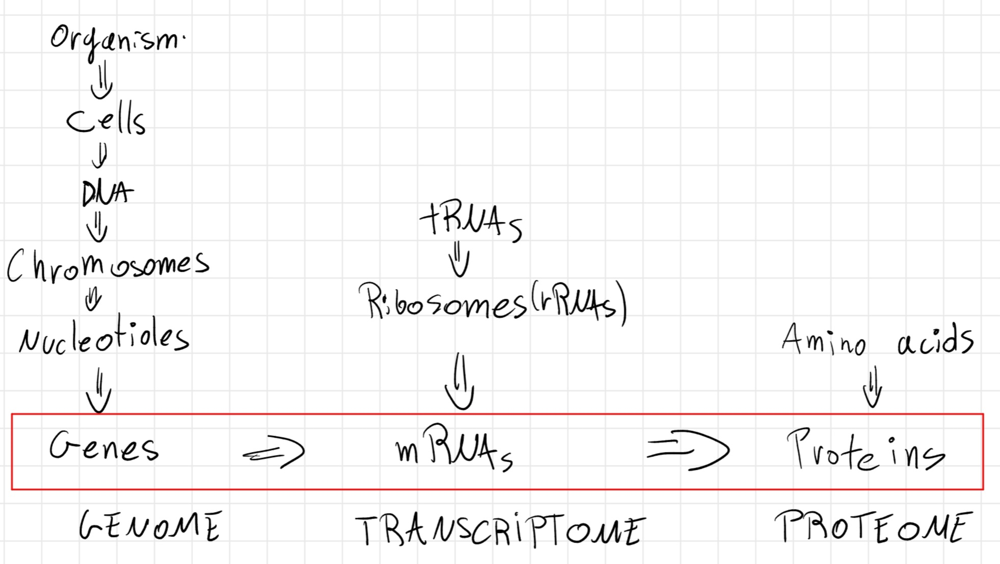

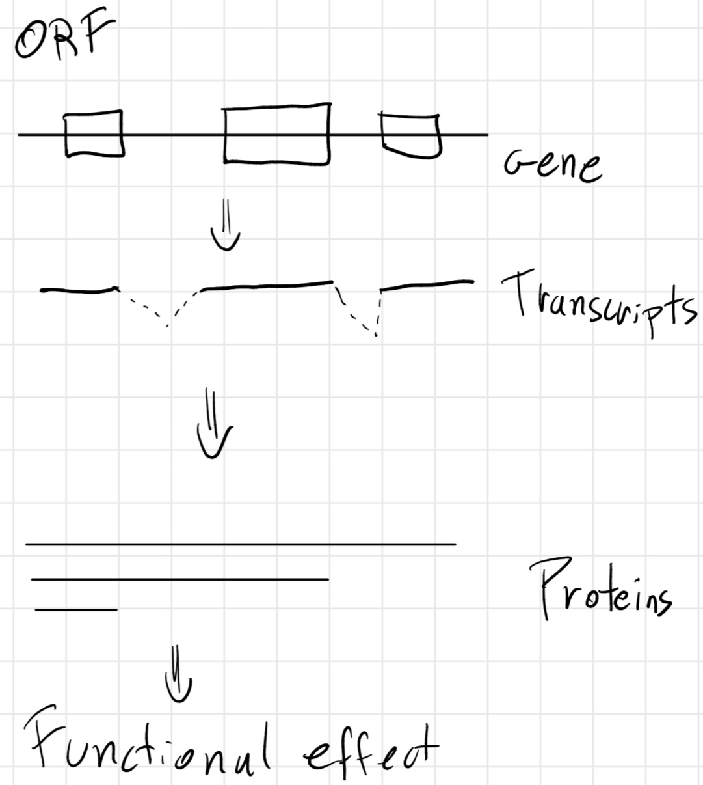

Not all genes are always necessary for the life of a cell -> only constituent one (necessary for the life of the cell) are always expressed, other expressed when necessary.

### 3.10 Genetic Expression

Expression of genes is controlled by cellular needs: environment conditions and functions to execute.

- Bacterium Escherichia coli (E. coli) living in human intestine and "eat" sugar. It can switch on and off the genes that produce enzymes for all types of sugar, is only one type is present it putting out the genes that codify enzymes for other types of sugars.
- In plant cells, genes of photosynthesis activated by sun light.

**Multi-cellular organisms**:

- Environment of a cell is the organism itself: single cells answer to stimuli produced by other cells of the organism.
- In addition, a mechanism called **differential regulation** -> one cell is divided in many specialized cells.
- Humans, $\cong 250$ types of cells
- Variety genetically established very early during growth of zygote. Only **stem cells** can differentiate in specialized cells.

**Bacteria**

Francois Jacob and Jaques Monod (1960 - 64) use lactose in E.coli.

Lactose is a disaccharide (sugar of 2 monomers, glucose and galactose) that can be utilized when divided into the 2 components inside the cell.

Splitting of lactose is realized by enzymes codified by 3 genes:

- IacZ -> $\beta -$galactosidase
- IacY -> lactose-permease
- IacA -> lactose-transacetylase

In default of lactose, in the cell $\cong 5$ molecules of each enzyme.

As for the sugar, if lactose is the only source of energy, synthesis of enzymes is rapidly stimulated $\implies$ **inducible enzymes**

Genes IacZ, IacY and IacA -> **structural genes**, are consecutive on bacterial chromosomes and transcribed in the same mRNA.

Before the big three, there is IacI that regulates them ; its elimination brings continuous synthesis of $3$ the enzymes.

- IacI codifies protein (repressor), bonds to and area on chromosome called operator (o), between promoter (p) and first of them (IacZ)

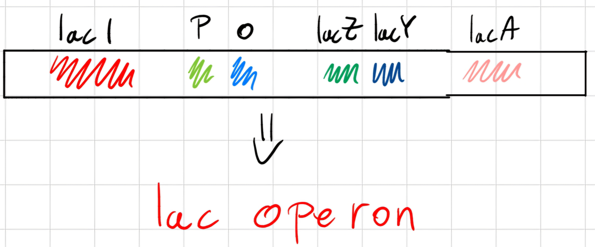

**Mechanism of regulation**

Repressor bonded to operator prevents RNA polymerase transcription of $3$ structural genes.

If lactose is present, it bonds to repressor, changes its 3D conformation preventing its bond to operator.

- Repressor detaches from DNA allowing transcription of operon genes.

When lactose is totally consumed, repressor bonds again to operator and synthesis stops.

**Superior Organisms**

Main mechanisms are similar but regulation is more complex.

Genetic expression regulated by proteins, **transcription factors**, bond DNA sites before gene, **Transcription Factor Binding Sites**, and can allow or stop bond of RNA polymerase to promoter of gene.

Example

Protein metallothionein that protects cells from toxic effect of metals free in the environment:

- Small quantities of metallothionein are always present in the cell.

Gene of metallothionein is transcribed by RNA polymerase $II$

Many traits of DNA before gene are involved in its expression:

- Binding site of polymerase;
- Sequences (enchanters), probably control tissue-specific expression of gene.

Such zones, elements of response to metals, modulate transcription based on metals' concentration.

Transcription factors have leading role in regulation:

- They have structure that let them enter in DNA grooves and interact with nucleotide bases -> **DNA binding proteins**

More common structure $\implies$ **helix-turn-helix** and **zinc-finger**

### 3.11 Proteins

**Proteins:** Macro-polymers constituted by linking of aminoacids (minimum 3); there are 20 aminoacids:

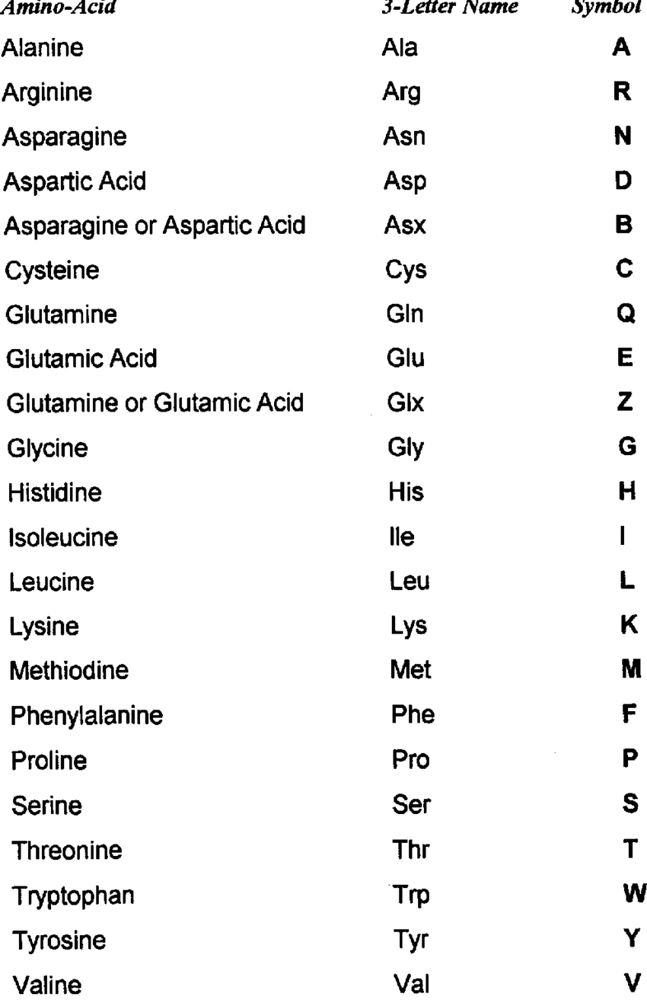

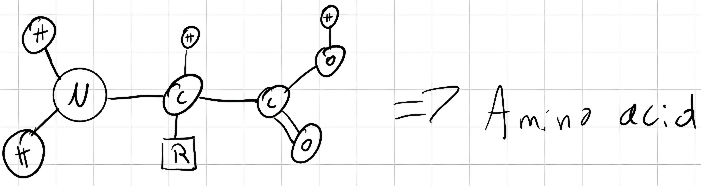

- 1 central atom of carbon
- 1 atom of hydrogen
- 1 amine group ($-NH_2$)
- 1 carboxylic acid group ($-COOH$)
- 1 side chain (R), it depends on the aminoacid. -> determines chemical properties

**Peptide:** short polymer constituted by the linkage of aminoacids bonded with **peptide bonds.**

**Peptide bond:** bond between $N-$terminus of an aminoacid and $C-$terminus of another one -> planar and rigid $\implies$ NO rotable-bond

**Polypeptides:** have $1$ free $N-$terminus (beginning) and $1$ free $C-$terminus (end) -> contains from 3 to various hundreds of aminoacids.

- 3D conformation of polypeptide is determined by torsion angles around $C \alpha - N (\phi)$ and $C \alpha - C (\psi)$ bonds of each aminoacid.
- The possible values of $\phi$ and $\psi$ depend on side chain of aminoacid.

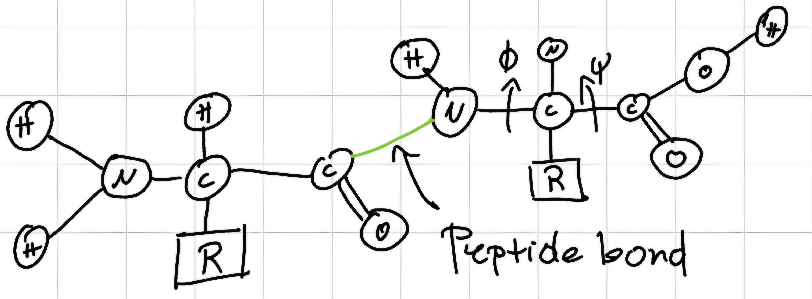

Proteins have different functions, ultimate for all organisms:

- Energetic
- Immune
- Structural of support (constitute backbone of cell)
- of transport (oxygen, lipid, metals)
- of identification of genetic identity
- Enzymatic (catalyze)
- Hormonal (lead regulative functions and transmit signals within the organism)
- Contractile

Function executed by protein depends on properties of protein, determined by:

- Aminoacidic sequence it is composed of
- Mainly of 3D structure adopted by the protein.

### 3.12 Proteins' structure

It's structured in 4 related levels:

- Primary structure: sequence of amino acids.
- Secondary structure: local 3D conformation with regular and repetitive bonding of polypeptide chain in substructure with well-defined and fixed geometric structures:
  - Spiral $(\alpha -\text{helix})$: pitch $0.54 nm, 3.6$ residual per turn; hydrogen bonds inside polypeptide chain.
  - Plane $(\beta - \text{strand}, \text{or} \beta - \text{sheet})$: in parallel or anti-parallel shape depending on direction of polypeptide chain, stabilized by hydrogen bonds between adjoining part of the chain.
  - Loops: linkages between $\alpha -$helix and $\beta -$strand (often they change their direction) averagely in protein $40 \%$ loops and $60 \% \ \alpha-$helix and $\beta -$strand.

- Tertiary structure: 3D arrangement of secondary structure elements in the environment.
  - Stabilized by hydrogen bonds, disulfide bonds, Van der Waals forces and hydrophobic interactions.
  - Assumed shape is the one with lower free energy.
  - Mainly globular or fibrous.
  - Defines properties and function of protein.
- Protein domain: part of the sequence and protein structure that can exist, work and evolve independently of the remainder of protein chain.
- Each domain has stable 3D structure and folds always in the same way, independently of the environment.
- Length: $25$ to $500$ amino acids -> shortest one is the zinc finger.
- It can be present in proteins evolutionary-related.
- Often corresponds to a functional unit.
- Quaternary structure: spatial organization of multi-subunit complexes (two or more polypeptides with defined tertiary structure, linked in specific way):
  - phosphorylase ($4$ sub-unit);
  - hemoglobin ($2$ sub-unit)

- Primary structure highly determines tertiary one.
- 3D conformation is vital for biological activity of protein
  - Denatured protein doesn't execute its function, until tertiary structure's restoration.

**Isoform:** two protein which are different for little details, due to alternative splicing or to polymorphisms.

### 3.13 Genetic mutations

During duplication of DNA it is possible to have variation in the sequence of nucleotide bases (**mutations**) that are transmitted to offspring (**mutants**):

- Rare ($1:10k - 1M$ individuals);
- Mainly spontaneous and accidental;
- Can generate individuals with new characteristics.

- Vital for evolution.
- Can be pathogenic:
  - Direct cause of abnormal phenotype.
  - Increased susceptibility to a pathology -> more likely to contract the pathology
- Mutations can be lethal for single individual:
  - All organisms have various cellular mechanisms to fix possible damages to DNA
  - Low $\%$ of codifying DNA on total DNA decreases probability of mutation in codifying areas
- Non-lethal mutations are transmitted to offspring (prole), introducing between individuals of a species.
  - **Polymorphisms:** Frequency in population $> 0.01 \%$
- In an individual, the majority of mutations is inherited.
- Genome is unique for each individual.

**Single Nucleotide Polymorphism**, or **SNP**: is the variation of $1$ single nucleotide in an individual's DNA sequence.

- The frequency of SNPs in human DNA $> 1 \%$
- SNPs in codifying regions have more chance of altering biological functionality

$$
\begin{align*}
  CCU \to \text{Pro} \xrightarrow{SNP} CCC \to \text{Pro} \text{in this case nothing change}
  \\
  AAG \to \text{Lys} \xrightarrow{SNP} GAG \to \text{Glu} \text{in this case SNP change the protein synthesized} 
\end{align*}
$$

SNPs are likely to be good biological markers.

- **Haplotypes:** group of SNPs always present together.
- Many common human pathologies are caused by complex interactions among genes, environment and lifestyle.

### 3.14 Types of genetic mutations

3 classes of mutations:

- **Genetic:** alter gene's structure, also SNP.
- **Chromosomal:** alter chromosomal structure.
- **Genomic:** alter number of chromosomes.

#### 3.14.1 Genetic Mutations

Genetic mutations can derive from different alterations:

- **Substitutions:** of a base with another.
- **Insertion** of one base.
- **Deletion** of one base.
- **Inversion** of short nucleotide sequence, due to excision of a stretch of double helix followed by re-insertion in opposite direction.

In the substitution scenario is possible have a situation like: $A-T \xrightarrow{substitution} G-T$, in this case, $G-T$ is an unstable bond and in the next replication we can have $G-C$ or $A-T$

- Mutation can be effective or not on phenotype:
  - **neutral** (or **silent**) if it brings a new codon codifying the same amino acid
  - **missense** if it brings a new triplet codifying a different amino acid

- If the amino acid has important role, but protein not essential for life, cell survives; otherwise mutation is lethal.

#### 3.14.2 Chromosomal mutations

Chromosomal mutations: changes in chromosomal structure compared to normal karyotype

- Easily detectable with optical microscope in dividing cell.

Main types of chromosomal anomalies:

- **Deletion**
- **Duplication**
- **Inversion**
- **Translocation**

- **Deletion**: loss of a stretch of chromosome of variable length
  - Phenotypical consequences depend on genes lost
    - In homozygotes, deletions often lethal.
    - In heterozygotes, effects can be (partly) balanced by normal genes on homolog chromosome

- **Duplication:** doubling of a stretch of chromosome
  - **In tandem** when segment is repeated in the same direction
  - **Inverse** when duplication has opposite direction

Less harmful than deletion

- **Inversion:** change of order of two or more genes in a chromosome
- **Translocation:** Alteration of structure due to detachment of a stretch of a chromosome and attachment to non-homolog chromosome:
  - **Simple**
  - **Mutual** when involves $2$ chromosomes

**!!! In human, involved in tumor on set !!!**

#### 3.14.3 Genomic Mutations

Genomic mutations concern total number of chromosomes in each cell of an individual

- **Polyploidy** (or **euploidy**) if number of chromosomes is multiple of haploid arrangement ($3n, 4n, ...$)
  - In plants common
  - In animal dangerous
- **Aneuploidy** if loss or addition of 1 or few chromosomes
  - In animals strong alterations in phenotype
  - In plants common

Example:

- Turner's syndrome: due to lack of one $X$ chromosomes in female sex -> short height and sterility $1:5k$ women.
- Klinefelter's syndrome: due to one extra $X$ chromosome in $XXY$ individuals -> male aspect, small testicles, developed breast, tall height and backwardness $1:500/2k$ men

From errors in meiotic process, like failed disjunction in pair of homolog chromosomes:

- 1 gamete has pair of chromosomes -> **trisomic**
- 1 gamete without chromosomes -> **monosomic**

### 3.15 Mutagens

Frequency of mutations can increase if organism is exposed to substances and radiations (**mutagens**) that interact with DNA and can induce changes in nucleotide sequence.

- **Physical:** radiations with different wave length
  - Heat: break bond between A or G base and sugar, base lost -> **apurinic site**
  - High energy radiations (wave length $< 30 \mu m$)
    - Ionizing radiations (cosmic rays, $\gamma$ rays and $x$ rays): penetrate cellular tissues and ionize molecules -> provoke breaking of DNA, loss of bases -> used for tumoral treatment.
    - Ultraviolet radiations (wave length $\cong 26 \mu m$ absorbed by DNA bases): can provoke formation of dimers of T or C, like 

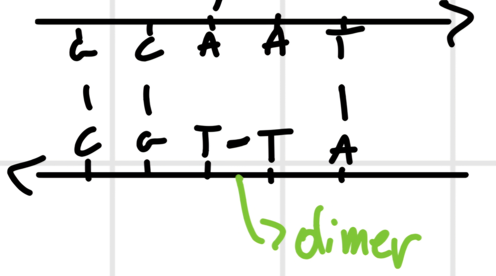

- **Chemical**
  - Analogs of nucleotide bases: can substitute normal bases during replication
  - Reactive of nucleic acids: chemically react with DNA bases altering them.
  - Intercalating agents of DNA bases: synthesized substances that inserts between bases -> brings genetic mutations of triplets reading

- **Environmental mutagenesis**: presence in the environment of many mutagenic substances capable of inducing tumors.

### 3.16 Fixing DNA and Genome

All living being have various cellular mechanisms for fixing DNA damages:

- **Photoreativation of dimers $\bold{T-T}$:** due to enzyme DNA photolyase, that cuts bond $T-T$ if activated by light.
- **Repair towards damage's excision:** complex process that requires many enzymes:
  - Detection of damage
  - Cutting of DNA the damage's area
  - Removal of damaged stretch of single helix $\implies$ excision.
  - Polymerization of missing stretch (DNA polymerase) and welding of extremities (DNA ligase).

In mankind lack or reduction of one or more involved enzymes is associated with inherited pathology that brings formation of skin tumors due to ultraviolet radiations present in solar rays.

**Genome:** Entire genetic material of an organism

- Identical in each cell of the same individual
- It's for $99\%$ the same in all individuals of the same species
- The term indicates also all products (RNAs, proteins, ...)

In bioinformatics, **genomic data/information:** whole of available data and information, related to genetic material of an organism.

**Transcriptome:** whole of all possible transcripts of an organism.

- In bioinformatics, **data/information of transcriptome:** whole of available data and information, related to all possible transcripts of an organism.

**Proteome:** whole of all possible proteins of an organism, deriving from different transcripts.

- In bioinformatics, **data/information of proteome:** whole of available data and information, related to all possible proteins of an organism.

### 3.17 Evolutionary biology 

**Evolutionary biology** is a sub-field of biology regarding the origin of species from a common ancestor, as well as their changes, multiplications and diversifications over time.

Then:

- **Homology:** similarity between characters due to descent from a common ancestor.
- **Similarity:** an observable property that comes with a significance measure.

Today:

- **Homology:** among proteins and DNA is often concluded on the basis of sequence similarity
- **Sequence similarity** may arise from different ancestors
  - Such sequences are similar, but no homologous.

Sequence regions that are homologous are also called **conserved**

Sequence homology may indicate **common function**

Homologous sequences are said orthologous if they were separated by a speciation event.

- **Orthologs**, or orthologous genes, are genes in different species that are similar to each other because the originated from a common ancestor.

Homologous sequences are said **paralogous** if they were separated by a gene duplication event.

- Paralogs typically have the same or similar function, but sometimes do not: due to lack of the original selective pressure the copy is free to mutate and acquire new functions.

So, homologous sequences can be divided into two groups:

- **Orthologs**: genes that share the same ancestral gene and perform the same biological function in different species
- **Paralogs:** genes within the same genome that share an ancestral gene and perform different biological functions.

**Phylogenesis**or phylogenetic: study of life's evolution

- Fundamental instrument that reconstructs relations of evolutionary kinship of group oof organisms in any systematic level.

**Taxonomy:** classification of organisms depending on similarities.

**Phylogenetic trees:** diagram that shows relation of common descent of taxonomic groups of organisms.

**Computational phylogenetic:** concerns the compilation of phylogenetic tree and the study of anatomic, biochemical, genetic and paleontological data used for their construction.

Phylogenetic trees are built on the base of a high number of genetic sequences.

Many techniques used to identify the best tree -> complexity NP (Nondet.Polinomial- time)

Phylogenetic trees are important but have some limits:

- Often don't represent exact evolutionary history of a gene or organism
- Are based on distributed data by different factors:
  - Genetic horizontal transfer
  - Hybridization between different species
  - Converging evolution
  - Conservation of genetic sequences

## Chapter Four: Biomolecular Sequence Analysis

Why do we do sequence comparison ?

- Measure yhe degree of similarity.
- Determine the correspondence between elements of distinct sequences.
- Observe the patterns of conservation and variability
- Deduce the evolutionary relationship
- Sequences alignment is the most important problem together with searching for a specific sequence in a database.
- It can help us to prediction of structure
- Similarity of sequence -> similarity of function
- Preserved positions may represent important function sites
- Phylogenetic analysis
- Homology, already discussed
- Similarity: Observable quantity that can be expressed as a percentage. -> degree of similarity

Two types of alignment:

- Global alignment: whole sequences
- Local alignment: defines the longest subsequence

Different technique:

- Alignment 2 sequence
  - Dot matrix
  - Pairwise Alignment
  - Needleman and Wunsch
  - Smith and Waterman Algorithm
- Multiple alignment
  - Dynamic programming
  - Heuristics
  - ClustalW

### 4.1 Alignment 2 sequences

#### 4.1.1 Dot matrix

Simplest one, we build a matrix with sequence 1 as column and sequence 2 as row and we put an "x" when we have a match.

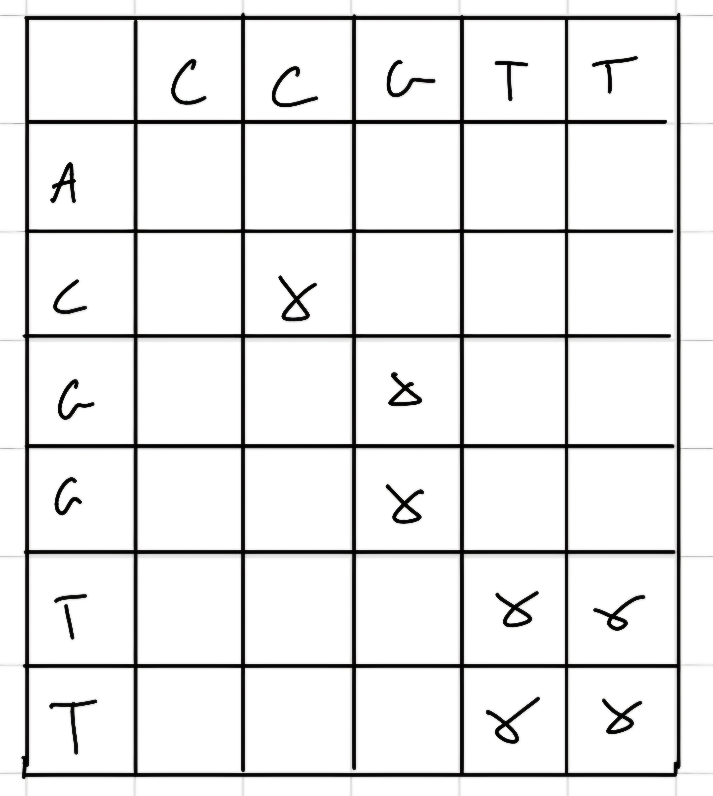

- Diagonal lines correspond to similarity regions.

**Filtering of background noise**

- Strong background noise
- Filtering can improve readability
  - We usa a stringency: minimum number of correct alignment in a window size.

Pros:

- All possible matches between two sequences are found
- You can find repeated sequences, direct and inverse
- Useful for quick visual inspection

Cons:

- Visual inspection
- Method not fully automated
- Image compression for long sequences

Practice

- To compare DNA: large windows and high stringency
- To compare protein small windows and not necessarily high stringency

#### 4.1.2 Pairwise alignment

Also simple, it's based in 3 type of action:

- Match
- Gap
- Mismatch

We write the two sequences and compare.

$-$: gap

$C \\ | \\ C$: match

$G \\ | \\ C$: mismatch

We can assign a score, use:

gap $= - 2$

mismatch $= -1$

match $= +2$

highest is the score better is the alignment.

Distance between two strings:

- **Hamming distance:** defined between two strings of equal length as the number of mismatch
- **Levenshtein distance:** minimum number of operation (insertion, deletions, substitution) to transformation a string in the other.
- **optimal alignment:** of $S$ and $T$ (seq.1 and seq.2) that maximizes the score and reduce the distance between $S$ and $T$

Now we will talk about the score assign to gap, mismatch and match. Why ?

Because biologically the substitution cannot be consider equal each other.

We have to consider:

- Chemical and physically property
- Frequencies of substitution calculated on the protein sequences known to be homologous.

#### 4.1.3 Substitution matrix

**Substitution matrix:** Assign value to each possible pair of characters

- Nucleotides: simple scoring schemes are sufficient.
- Amino acids: their chemical differences should be considered.

There are two main types of matrices:

- PAM (Percent/Point Accepted Mutations)
- BLOSUM (BLOck SUbstitution Matrices)

##### PAM

PAM matrices: developed in the late 70s looking for mutations in closely correlated superfamilies of amino acid sequences.

Accepted Mutation: accepted by evolution.

For the construction of PAM matrices homogeneous blocks of aligned sequences are considered.

To avoid the problem of multiple substitutions, very similar sequences are chosen to determine PAM matrix:

- Consider substitutions in $71$ groups of protein sequences similar to at least $85 \%$
- Counted 1572 changes, or "accepted" mutations.

For each amino acid $(j)$, count all $N_{jk}$ changes (quantity of changes) in another amino acid $(k)$

Normalize by dividing by the total number of changes $(\sum_{m} A_{jm}, 1 \leq m \leq n)$

$n =$ number of amino acids $= 20$

$A_{jk} =\frac{N_{jk}}{\sum_m A_{jm}}$

- PAM matrix (P), of transition probability of each amino acid into another amino acid, is defined as the matrix that in each step allows preservation of $99\%$ of the sequence.

  - Calculated from substitution matrix $A$ as follow
    - $P_{jk} = c * A_{jk}, k \neq j$ and $P_{jj} = 1 - \sum_k P_{jk}, 1 \leq k \leq n, k \neq j$
    - $c$ chosen in order that the portion of expected changes by the model in a step is equal to $1\%$
    - $c$ is obtained by: $\sum_k \sum_{j \neq k}P_{jk} P_j = c \sum_k \sum_{j \neq k} A_{jk} P_j = 0.01$

PAM contains the log odd probability (p) of transition of each amino acid into another amino acid

$p = log (odd(P))$

$odd(P) = \frac{P}{1-P} \implies p = log (\frac{P}{1-P})$

If $PAM_{i,j} > 0$, likely transition of $i$ in $j$

If $PAM_{i,j} = 0$, random transition of $i$ in $j$

If $PAM_{i,j} < 0$, unlikely transition of $i$ in $j$

The classical PAM expresses the probability of change in one step $\implies PAM1$

If we want in two step: $PAM1 * PAM1 \implies (PAM1)^2 \implies PAM2$

In ten: $(PAM1)^10=PAM10$

This is the percentages of change, PAM2 $\implies 2\%$

The number identify the evolutionary step, the change of an aminoacid out of $100$ ones.

The $PAM250$ is the most used, the amino acid sequences maintain at this level $20\%$ of similarity.

Example

Take the $PAM250(F \to Y): 0.15$

Divide by frequency of changes into $F(0.04) = log_{10}(\frac{0.15}{0.04}) = 0.57$

like wise for $Y \to F : log_{10} (\frac{0.2}{0.03}) = 0.83$

Calculate the score for a change $F,Y$ as $10 * \frac{(0.83 + 0.57)}{2} = 7$

We will obtain something like this:

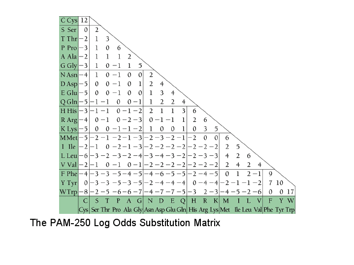

##### BLOSUM

BLOSUM of substitution of amino acids

- PAM based on global alignments between sequences
- BLOSUM based on alignments of block of segments of amino acid sequences closely related

A block is a highly conserved region without gaps

How calculate the matrix ?

For each pair of amino acids $x$ and $y$, calculate the ratio of the like hood $(e_{xy})$ that $x$ and $y$ are aligned by chance

- Calculated based on frequency of occurrences of $x$ and $y$ in the block and portion of times that $x$ and $y$ are in the same column
  - $e_{xy} = \frac{P_x * P_y}{P_{xy}}, x=y$
  - $e_{xy} = 2 * \frac{P_x * P_y}{P_{xy}}, x \neq y$
  - $p_{xy}: probability of finding $x$ and $y$ paired in the same column = $\frac{n_{xy}}{\sum n_{xy}}, x \neq y$
- Then calculate $-2log_2(e_
{xy})$ and round to the nearest integer.

Example

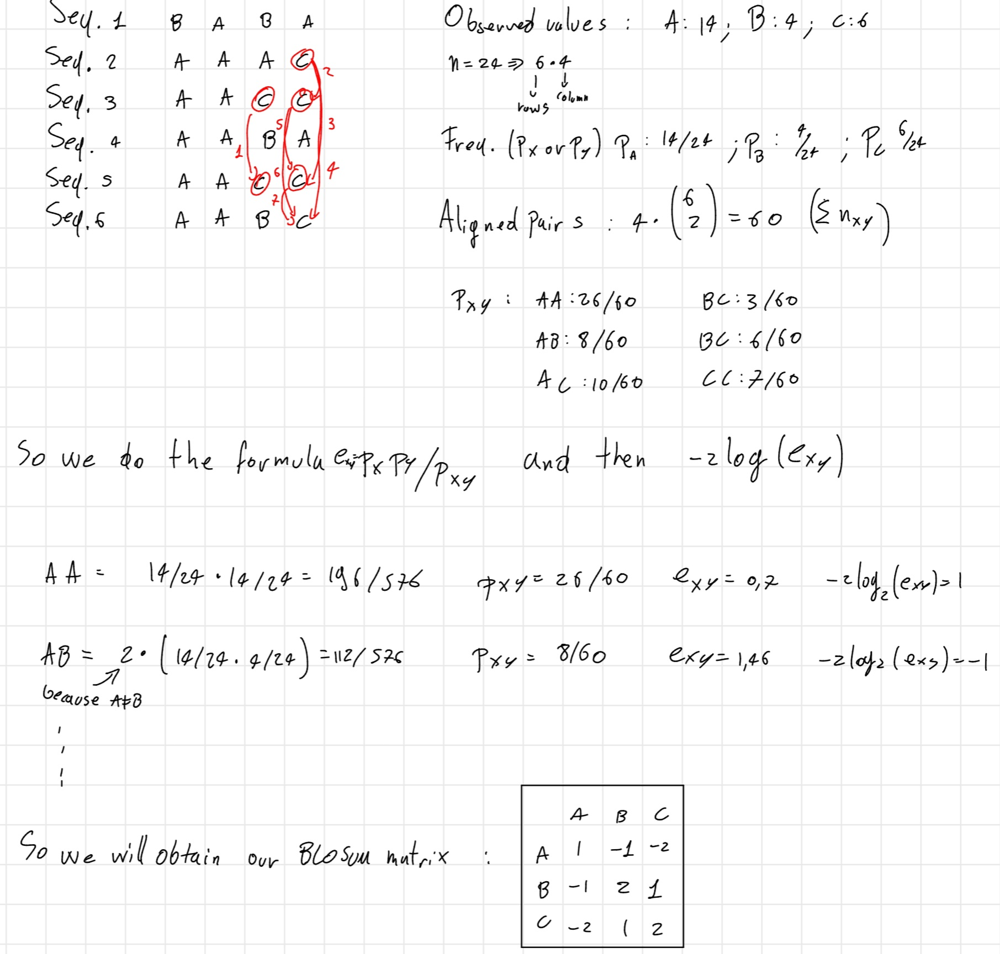

Values calculated based on the substitutions in a set of $2000$ conserved patterns

To avoid that very similar sequences in a block polarize the estimation, clusters are created in the block.

- BLOSUM-n means that the sequences used in each cluster are similar to at least $n\%$

To find relationships between sequences close in time by evolutionary point of view, a large $n$ is used.

$BLOSUM62$ is the standard.

##### BLOSUM vs PAM

- PAM based on explicit evolutionary model
- BLOSUM based on implicit evolutionary model
- PAM based on mutations observed in global alignment, which includes both highly conserved regions and highly mutated ones.
- BLOSUM based only on highly conserved regions in series of alignments without gaps
- Substitutions are counted differently: Unlike PAM matrices, BLOSUM procedure uses clusters of sequences whose mutations are counted not in the same way.
- High numbers in names of PAM matrices indicate high evolutionary distance, while high numbers un name of BLOSUM matrices show high sequence similarity.
- Gaps $"-"$ are used to align sequences with different length.
- Now in the reality we distinguish between gap opening $(g_o)$ and gap extension $(g_e)$, the gap extention is the continuous of the first gap.

So the gap penalty is $g = g_o + g_e * (l-1)$

where $g_o$ is the first gap penalty, high

$g_e$ is the gap extension, lower penalty

$l$ is the length of the gap block

In the scholar exercise we use a linear gap penalty for simplify.

But in the real software we use the real gap penalty.

This because in biology is likely that a mutation event makes a long gap than a lot of scattered gaps.

#### 4.1.4 Needleman - Wunsh

This method is an algorithm, the optimal one.

This algorithm is also complete.

**Optimal algorithm:** find the best solution, if it find one.

**Complete algorithm:** If exist, the algorithm find always a solution.

How works ?

First penalty and rewards:

- gap
- mismatch
- match

BUild the matrix like the dot matrix but an additional row and column.

Now starting the matrix with a $0$ in the $(0,0)$ cell, now we write the score, there are $3$ movement:

- horizontal: gap in the vertical sequence
- vertical: gap in the horizontal sequence
- diagonal: match/mismatch

We have to complete the matrix continue the score with the movement that maximize this one.

We start filled the row $0$ and the column $0$ with "gap movement"

After fulfill the matrix we have the best score in the last cell $(4,4)$, in this case, now we backtrack the movement and obtain the solution(s).

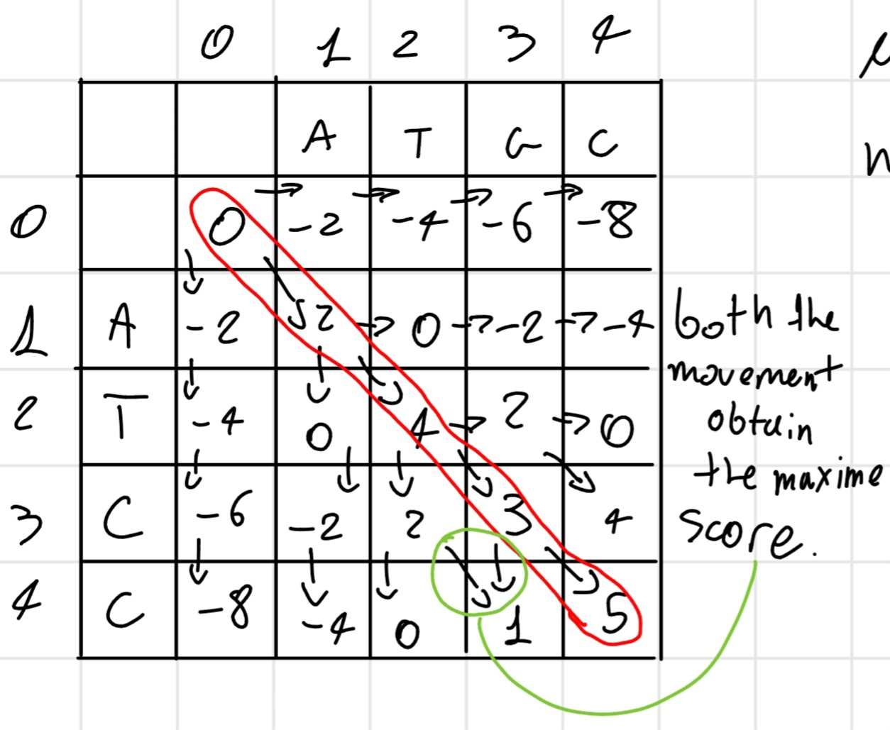

- match $+2$
- mismatch $-1$
- gap $-2$

Solution:

$ATGC \\ ATCC$

Score: $5$

In general we use PAM or BLOSUM matrix for the score.

We can obtain more of one solution, in this case we write all of them.

This algorithm is used for global alignment, so for find the best alignment in the whole sequences.

#### 4.1.5 Smith - Waterman algorithm

This algorithm is for local alignment so for find the best sub-sequences.

It's completely equal to the Needleman-Wunsh algorithm with one crucial difference there aren't negative score. So the same matrix above become:

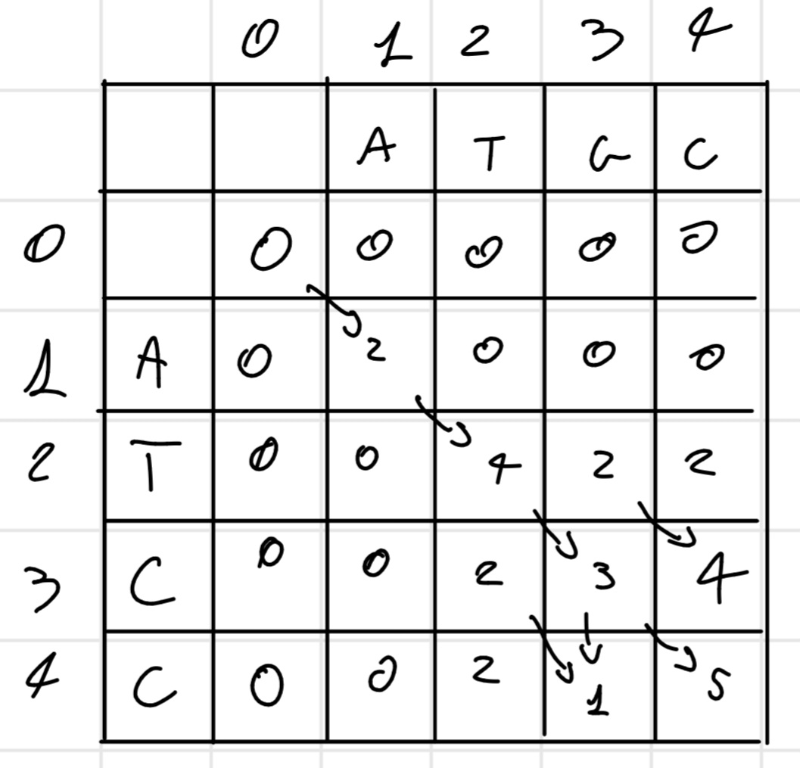

So in this case the best sub-sequence is

$ATGC \\ ATCC$

Score: $5$

It's possible there are multiple sub-sequence with the highest score, we have to write all of them, REMEMBER if a score going to zero this is a reset point, so next score is for another sub-sequence, either if a score decrease but don't go to zero is the same sub-sequence, as in the example.

For ANY pairwise alignment, the used measure are:

- $z:$ measure of how the found correspondence is different from the random one, high $z$
- $p:$ probability that the alignment found is not better that the random one, low $p$.
- $E:$ number of sequences in a database of random sequences with equal length of the query sequence that have the score of the alignment with the query sequence grater than or equal to that of the found sequence.

For the score $z$ a score $\geq 5$ suggests significance of the alignment found between the two sequences.

Probability $p$ is obtained by: $p = 1 - e^{-kmne^{-\lambda S}}$

- $m:$ length of query sequence.
- $n:$ length of sequence found in the queried database.
- $S:$ score obtained.
- $k$ and $\lambda :$ parameters dependent on the substitution matrix used and the queried database
  - $10^{-10} \leq p < 10^{-10}$ closely related, homology is certain or almost.
  - $p \geq 10^{-10}$ probability not significant correspondence

Guide for the $E$ score:

- $10^{-100} \leq E < 10^{-10}$ sequences usually homologous
- $E < 10^{-5}$ good alignment
- $1 \leq E \leq 10$ often related sequences

### 4.2 Database Research

The classic programs that search for sequences in databases are FASTA and BLAST

The heuristic principle that these programs use is the search for "words" in databases.

**word:** short series of characters in the sequences of amino acids or nucleic acids.

These words are indicated with the term $k-$tuple -> k $= n°$ of characters.

- **Sensitivity:** is the ability to identify sequences related, although evolutionary distant.
- **Specificity:** is the ability to avoid false positives.

#### 4.2.1 FASTA

FASTA (FAST - All) it's an heuristic program that can search for global homology of sequences.

Exist two variants that can search for local homology:

- LFASTA
- PLFASTA

FASTA is specific but not quite sensitive.

$4$ phases:

- Phase $1a: k-$tuple

Initially, create a positional table containing all the positions for each amino acid (or nucleotide) in the query sequence and in each sequence in the database

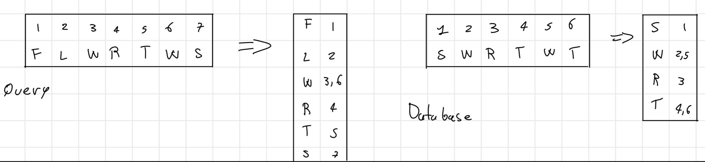

I can built considering the position individually $1-$tuple or in pair $2-$tuple. For the nucleotide $4-$tuple or  $6-$tuple.

- Phase $1b:$ offset calculation

Calculate the difference of positional values of each amino acid between the query and the database.

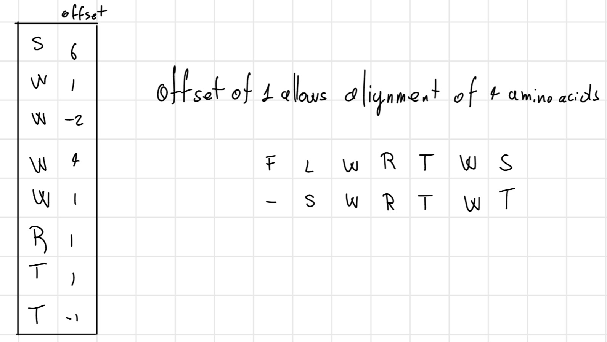

- Phase $2:$ Evaluation of substitutions between nucleotides

The best $10$ regions (best $10$ subsequence) selected are evaluated through the score matrices, the sub regions that contain the bases that maximize the regions score are identified.

The aim is finding the initial region with the best score, to be used to create a rank of the sequences in the database, in order to define which of them are the most similar to the query sequence.

- Phase $3:$ Joining of the initial regions

FASTA evaluates if it's possible to join together different regions of similarity.

Constraints to create the join:

- Excluding any areas of overlap between regions;
- Score above a threshold;
- Introduction of a scoring penalty for each gap introduced to join $2$ regions.

- Phase $4:$ optimization alignment

Sequences with higher similarity are aligned to the query sequence using the procedure based on a modified Smith-Waterman algorithm $\implies$ optimized score (OPT)

#### 4.2.2 BLAST

BLAST (Basic Local Alignment Search Tool)

It searches for best local alignment between a query sequence and the sequences in a database

- Developed and supported by NCBI (US National Center for Biotechnology Information)

Features:

- Local alignments
- Alignment with gaps
- Heuristic
- Rapid

While FASTA searches all possible words of the same length, BLAST limits the search to the most significant words using a preventive filter.

For score, in case of protein it uses BLOSUM62

BLAST fixes the length of the word to:

- $3$ for proteins
- $11$ for nucleotides

$3$ Phases:

- Phase $1:$ Generation of words

It generated a list of words of length $W$ from the query sequence.

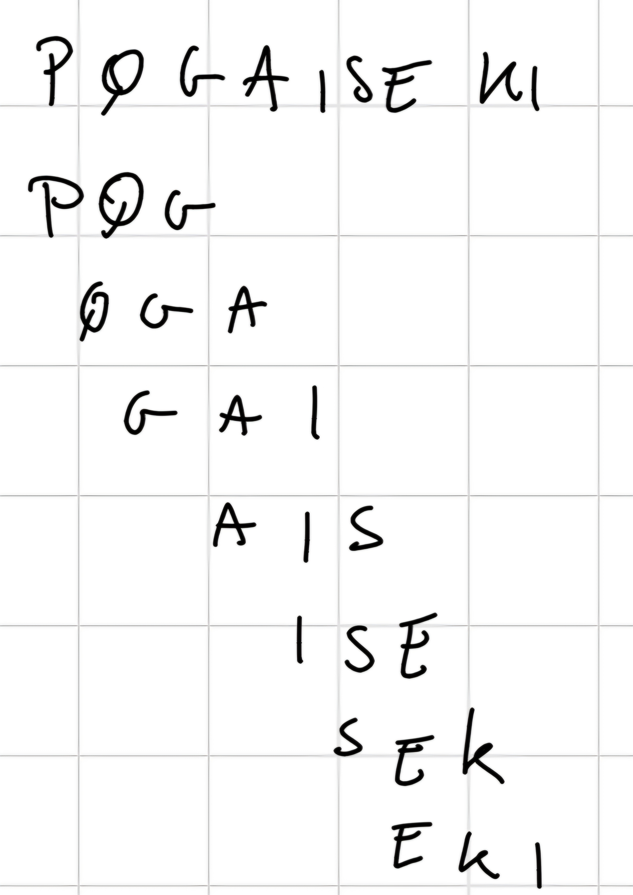

For each words, we assigned to each $20^3$ words found in the database.

Use a threshold $T$ to limit the number of analogous words.

- Phase $2:$ Find the words in the database

The search (exact) of the best analogous words in the sequences of the sequences of the database is performed.

- Phase $3:$ Hit's extension

When searched analogous words are found in database's sequences, they identify regions of possible local alignment (without gap) between the query sequence and the sequences found in the database

The algorithm tries to extend aligned regions, without allowing gaps, and until extended alignment score does not decrease $\implies$ High - Scoring Segmented Pairs (HPS)

HPS is considered relevant if exceeds a threshold value $S.$

Important: At the end, it generated the best alignment according to Smith-Waterman algorithm.

Variation of $E$ and $p$

- $E$ is equal to the number of sequences that we would expect to find if the database contained random sequences.

$p-value$

- $p = 1 - e^{-E}$

Filters

- BLAST has filters to skip regions with repetitions or low complexity
  - $SEG:$ filters low protein complexity regions
  - $DUST:$ filters low DNA complexity regions
  - $XNU:$ filters regions containing protein tandem repetitions.

##### BLAST vs FASTA

- BLAST
  - Standard tool, used in practice
  - MOre sensitive in protein research 
  - Local alignment
  - Fast 
  - First analysis
- FASTA
  - More sensitive, in particular for nucleotide sequences.
  - Global alignment
  - Slow
  - Secondary analysis

Both heuristic

They don't grant to find the best alignment

Variant of BLAST

- BLASTP: searches a protein sequence in a database of proteins.
- BLASTN:searches a nucleotide sequence in a database of nucleotide sequences
- BLASTX: searches a nucleotide sequence translated in all six possible reading frame in a database of proteins.
- TBLASTN: searches a protein sequence in a database of nucleotide sequences that are automatically translated into all six possible reading frames.
- TBLASTX: searches translations in all six possible reading frame of sequence of nucleotides in a database of nucleotide sequences dynamically translated.
- MegaBLAST: it's an optimized program to align nucleotide sequences that differ slightly and therefore the could originate from sequencing errors
- PSI-BLAST(Position Specific Iterated BLAST): designed for analysis of protein sequences, it increases the sensitivity of the algorithm using iterative procedure.
- BEAUTY (BLAST - Enhanced Alignment UTilitY): it adds information to the output of BLAST with text and graphics.

### 4.3 Information

Motifs are regular combinations of protein secondary structures associated with particular functions.

So same motif $\implies$ similar function

Search for protein motifs can identify new genes and study the diffusion of specific motifs in different genomes.

- $S.M.A.R.T. :$ Simple Modular Architecture Research Tool

Uses for search protein motifs

### 4.4 Multiple Alignment

Why ?

The alignment in pair allows:

- Searching for sequences similar to a given sequence
- Evaluating the homology of two sequences

The multiple alignment allows:

- Molecular phylogeny, through the comparison among sequences, to construct phylogenetic trees that illustrate distances and evolutionary relationships among analyzed molecules.
- The study of the evolution of genomes
- Identification of recurring motifs and functionally important sites, which help to characterize genes and proteins with unknown function.
- Characterization of sequences with unknown function, through the identification of recurrent motifs and functionally important sites.

Formal definition:

- Given an alphabet $\Sigma$ and some sequences $S_1, ..., S_k : S_i \in \Sigma  \ \text{for} \ 1 \leq i \leq k$

A multiple alignment associates with $S_1, ..., S_k$ the sequences $S_1', ..., S_k' : S_i' \in (\Sigma \cup \{-\})$ for $1 \leq i \leq k$ so that:

- $|S_1'| = |S_2'| = ... = |S_k'| = /$
- removing gaps from $S_1', ..., S_k'$ we obtain $S_1, ..., S_k$

#### Profiles

Profiles are useful structures for summarizing the common proprieties of groups of sequences and they are the basis of many methods of multiple sequence alignment 

- Given a multiple alignment of $M$ sequences of length $l:$
  - The profile of $M$ is a matrix $l \times |\Sigma \cup \{-\}|$, where $\Sigma$ is the alphabet of the sequences of $M$, whose single column:
    - Represents  a position in the alignment.
    - Contains the frequencies of tach character that appears in that position or, the weighted average of the scores derived from a score matrix
  - The profile matrix is also called matrix of weights or Position Specific Scoring Matrix (PSSM)

Example:

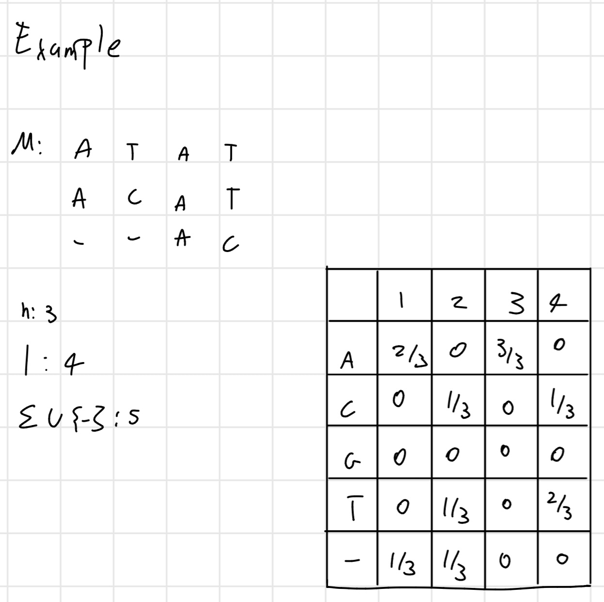

**Shannon Entropy**

GIven a probability space $(s,p)$, the entropy $H$ is a measure of dispersion of the probability function of the objects in the space $S$

- $H$ is a measure of uncertainty about the identity of the objects in a set 

$$
\begin{align*}
  H = - \sum_{i=1}^m p_i log_2 p_i
\end{align*}
$$

**Information content**

Given a matrix of weights that models sequence alignment, you can determinate the information content $I(k)$ for each alignment position $k$:

$$
\begin{align*}
  I(k) = log_2(m) - (H(k) + e(n))
\end{align*}
$$

- $m:$ number of distinct characters in the alphabet of the aligned sequences ($m=4$ in DNA/RNA, $m=20$ for amino acids)
- $e(n) =$ correction factor, it depend on the number $n$ of sequences in the alignment modeled by the weight matrix.

The alignment logo shows the information content of each position of the multiple alignment.

**Usefully of extraction profile**

- Identify new members of the profiles in databases
- Identify consensus sequences (e.g. for Transcription Factor Binding Sites)
- Define weight matrices proportional to the degree of conservation to be used in alignment.
- Profiles can be used to predict the membership of new sequences to the group of sequences with a given profile.

Databases of profiles/patters:

- PROSITE, Pfam, PRINTS, TransFac, Jaspar

To align a sequence to a profile, we use Needleman - Wunsh but with a different scoring function.

$$
\begin{align*}
  \sigma_{sp} (b,i) = \sum_{a \in \Sigma} P_{i,a} \sigma (a,b)
\end{align*}
$$

To align two profiles -> $\sigma_{pp} (i,j) = \sum_{k=1}^{|\Sigma| + 1} f(P_{i,k}', P_{j,k}'')$

- $f$ is a function that assigns a score to column pairs by taking into account the frequency of individual characters of the alphabet $\Sigma$ of the profiles.

So different multiple alignment $\implies$ we need a score standard to be able to compare them:

- Starting point: BLOSUM, PAM, etc... and gap penalty.

The most used function is the **Sum - of - Pairs** score, sum of the scores, sum of the scores of the pairwise alignments induced by the multiple alignment:

$$
\begin{align*}
  \sigma (s) = \sum_{i=1}^{i<z} \sum_{j=i+1}^z S(s_i, s_j)
\end{align*}
$$

$S(s_i,s_j)$ is the score of alignment of pairs of sequences $s_i$ and $s_j$ induced by multiple alignment $M$.

$z$ is the number of sequences in the multiple alignment.

Example

$$
S1: ACTCT
\\
S2: A-TTT
\\
S3: A-TTT
\\
\sigma(s) = S(s_1,s_2) + S(s_1,s_3) + S(s_2, s_3) = 3 + 3 + 6 = 12
$$

Other function of scoring:

- Entropy
- Circular-Sum

**Entropy**

$H(A) = \sum_{c \in A} H(c)$

$H(c) = - (\sum_{x \in \Sigma} p_x log_2 p_x)$

$c:$ column of the alignment $A$

$p_x:$ frequency of the symbol $x$ in column $c$.

Example

$$
ACT
\\
ACA
\\
A-T
\\
H(1) = - (\frac{3}{3} log_2 \frac{3}{3} + 0 + 0 + 0 + 0) = 0
\\
H(2) = - (0 + \frac{2}{3} log_2 \frac{2}{3} +0 + 0 + \frac{1}{3} log_2 \frac{1}{3}) = 0.92
\\
H(3) = - (\frac{1}{3} log_2 \frac{1}{3} + 0 + 0 + \frac{2}{3} log_2 \frac{2}{3} + 0) = 0.92
\\
H(A) = 0 + 0.92 + 0.92 = 1.84
$$

**Circular Sum**

$CS(A) = \frac{1}{2} \sum_{i=1}^z MPA(a_i, a_{i+1})$

We do the pairwise score sum immediately, so:

match: +1

mismatch/gap: -1

$$
ACA
\\
ACC
\\
AT-
\\
MPA(a_1,a_2) = 1 + 1 - 1 = 1
\\
MPA(a_2,a_3) = 1 - 1 - 1 = -1
\\
MPA(a_3,a_1) = 1 - 1 - 1 = -1
\\
CS(A) = \frac{1}{2}(1 - 1 - 1) = -1 
$$

**Sum-of-Pair** vs **Circular Sum**

Sum-of-pair is clearly  inefficient from an evolutionary point of view

#### 4.4.1 Dynamic programming

Now if we have $2$ sequences we need a $2d-$matrix, $3$ sequences $3d-$matrix, $n$ sequences $nd-$matrix. This approach is very complex, it's called NP-complete(Non Polynomial) $\implies$ very difficult and a lot of time.

Example $10$ sequences each length $= 100$ we have $100^{10} = 10^{20}$ elements $\implies 100$ mil. terabytes

Solution $\implies$ Heuristic and approximations.

Heuristic methods:

- Progressive alignment
- Center-star alignment
- Iterative alignment

#### 4.4.2 Progressive alignment

Simple and the most common

Idea: we align 2 sequence, then we align other 2 and we continue then we align the  2 aligned sequences with other 2 or with an unaligned one.

Like MERGE-SORT

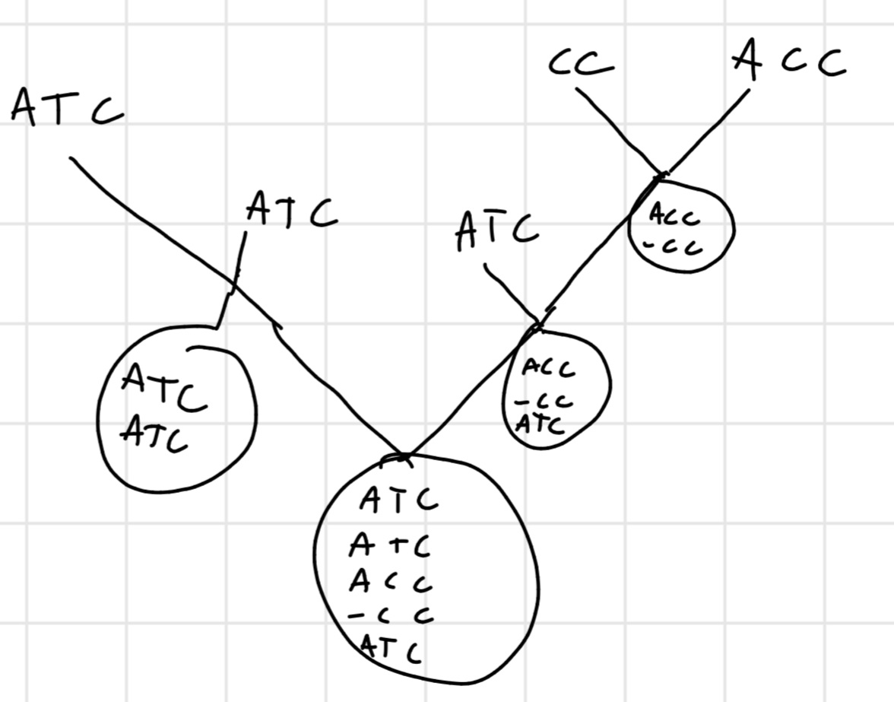

Heuristic: similarity degree

So we aligned the similar ones, until we remain without sequence unaligned.

**Feng - Doolittle**

Algorithm that implements progressive alignment heuristics:

- Calculate $\binom{n}{2}$ pairwise alignment ($n=$ number of sequences) and convert score in distance.
- Build a phylogenetic tree.
- Align in order of the tree.

#### 4.4.3 Star-Center

Given a set $S$ of $z$ sequences, we define **central sequence** $S_C \in S$ the sequence that minimizes the function:

$$
\sum_{S_j \in S} D(S_C, S_j)
$$

or, the sum of the distances of all the sequences from $S_C$ will be the minimum possible.

Then we use Sum-of-Pairs

#### 4.4.4 Iterative Alignment

It starts aligning the newest couple of sequences according to a certain definition of distance (not the same pf progressive).

Then, at each step it takes the sequence with the minimum distance from all sequences already aligned and it aligns it to the alignment profile already created.

In case, create new space $"-"$

### 4.5 Multiple alignment tool

ClustalW is the most popular tool for the multiple alignment.

- Given a set $S$ of $z$ sequences to be aligned, ClustalW aligns all the pairs of sequences of $S$ separately and builds a similarity matrix with the distances between each couple.

Then, it builds a phylogenetic tree, it consider the first couple how a singular sequence and builds another similarity matrix and go until finish the tree.

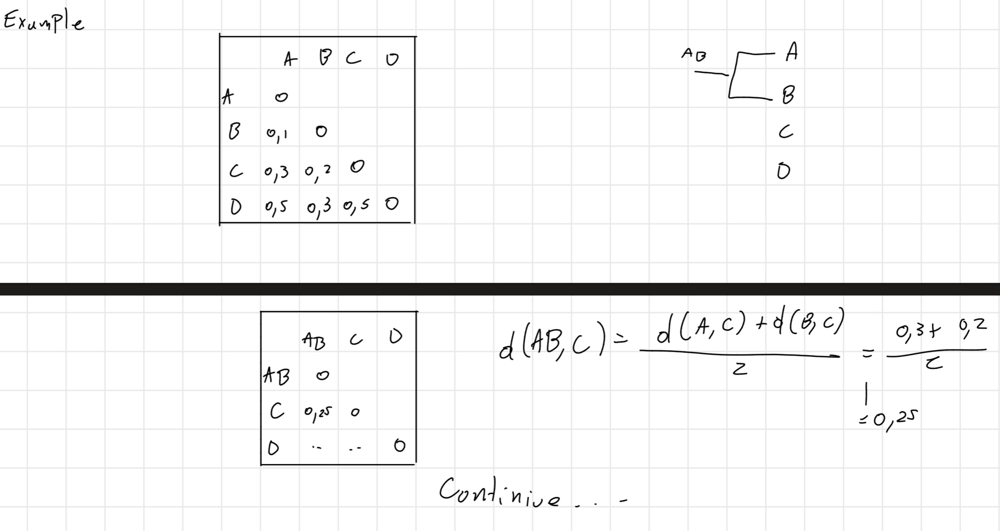

It is obtained a tree with branches of length proportional to the distance between the sequences $\implies$ **dendrogram**

##### Details of ClustalW's output

At the bottom of each column:

- symbol $"*": 100 \%$ match.
- $":" = > 75\%$ high similarity.
- $".": (50\% - 75 \%)$ average similarity
- No symbol$: < 50\%$ low similarity

## Chapter Five: Measurement of Genetic Expression

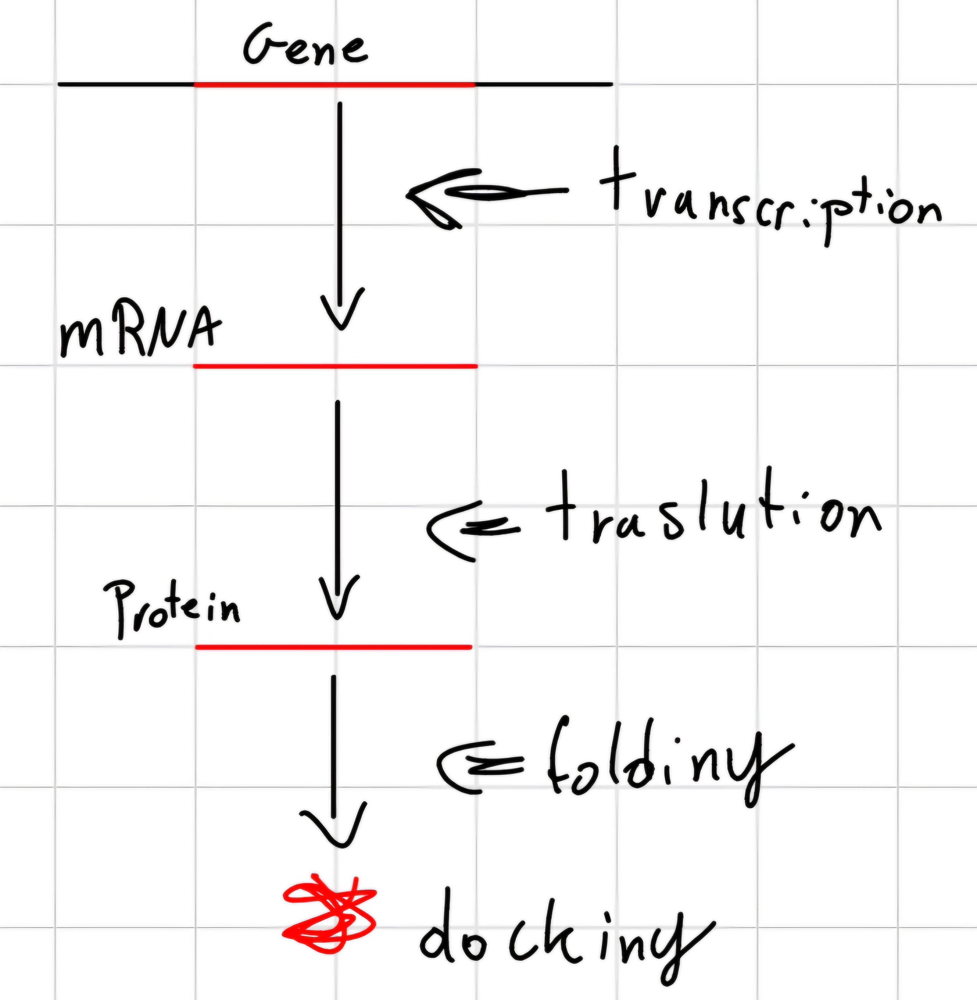

**Genetic Expression:** Conversion of coded information in a gene, for coding genes, first in messenger RNA and the in protein.

Not every gene is always necessary for the cell life

- Only constitutive genes are always expressed, other ones only when they are necessary.

Gene expression is regulated by the cell necessity: environment conditions and functions necessary to be performed.

- In multi-cellular organisms:
  - The environment of a cell is the organism itself
  - Starting from the same cell, the "differential gene regulation" mechanism causes the creation of different specialized cells.

The genetic expression, is different depending on the cell type and the answer from the environment.

The transcriptome is the complete set of gene transcripts and of their levels of expression, in a particular type of cells or tissue, in well defined conditions.

- Only $20\%$ of the transcriptome is expressed by a cell

To understand biological organisms it is necessary to study:

- gene expression and regulation;
- synthesized protein functionality;
- quantitative occurrences of metabolites;
- effects of gene defects on organism phenotype.

System biology: study of interactions between components of a biological system and how such interactions induce functions and behaviour of the system.

For functional analysis of genomes:

- Transcriptomics
- Proteomics
- Metabolomics

High - throughput procedures.

These approaches of genotyping must be correlated with phenotypic analysis of model organisms and cells in vitro.

### 5.1 Gene expression analysis techniques

How to measure the gene expression ?

Methods to measure the expression level $\frac{gene(s)}{time}:$ RT-PCR (Reverse Transcriptase Polymerase Chain Reaction)

Main analysis techniques of the whole transcriptome:

- cDNA microarray
- Oligonucleotide microarray
- SAGE (Serial Analysis of Gene Expression)

1980: RNA analysis of one or few genes at a time

- Northern blotting
- quantitative PCR

1995: RNA analysis whole genome

- Molecular biology technologies

Two main technologies of DNA microarrays:

- cDNA spotted arrays
- Oligonucleotide arrays

#### 5.1.1 Northern Blot

Laboratory technique to study genetic expression, by finding the RNA (or isolated mRNA) in a sample

- Gene expression quantifying the level of abundance of a transcript in a single sample.
- Gene regulation: behaviour of the transcript in comparison test-control.

In $4$ step:

1. RNA Extraction: we extract the RNA.
2. Preparation of the probe: fragment of the gene that we have to analyze.
3. Hybridization: We wait until the probe and the gene create a bond, if the gene is expressed.
4. The probe is a marker (radioactive or fluorescent) and its insensitive is proportional to the quantity of expressed gene.

#### 5.1.2 RT-procedure

The polymerase chain reaction (PCR) is a laboratory technique exploiting DNA replication to amplify a single or        few couple of specific sequence of DNA, up to $\cong 10kb$ long, also $40kb$.

PCR is based on thermal cycles of heating and cooling of a solution where the replication reaction of DNA occurs, we use high temperature for divide the helix of DNA, and low temperature for replication of DNA.

The reverse transcription polymerase chain reaction (RT-PCR) is a variation of the PCR, in which a RNA helix, firstly is reverse-transcribed in its complementary DNA (cDNA), by using the enzyme reverse transcriptase, and the resulting cDNA is amplified by using traditional PCR, or real-time PCR, made in a thermal cycler for automatic time and temperature control.

Another way to replicate pieces of DNA uses plasmids if bacterial as vectors to clone DNA sequences, the DNA fragment are inserted in the DNA sequence of the plasmid and the DNA ligase enzyme to bind to the plasmid DNA fragment to be cloned -> recombinant plasmid.

### 5.2 DNA microarrays

Microarrays: orderly and miniaturized arrangements of fragments of DNA with know sequences on solid support.

The microarrays is the evolution of Northern blot, microarrays can analyze the entire genome while the Northern blot only one or few genes.

Application:

- Measurement of genetic expression;
- Measurement of abundance of genetic transcript.
- Characterization of a gene sequence.
- Characterization of alteration of the number of copies of a given gene or DNA sequence.
- Characterization of DNA-proteins interactions.

Since they allow to determine the profile of expression of the expression of the cell in a given state, it's also said that microarrays allow **expression profiling**

#### 5.2.1 cDNA microarrays

$4$ steps:

1. BUilding of the cDNA microarrays: full section of ESTs (Expressed Sequence Tags, short sub-sequences of a transcribed cDNA sequence).
2. Sample preparation: two mRNA samples are prepared, retro-transcribed into cDNA and made fluorescent with different colors (Cys3, green, uses for the control; Cys5, red, uses for the test).
3. Hybridization: gene transcripts expressed in sample, prepared and marked are hybridized with their complementary sequence on the microarray
4. Measure of the gene expression: the fluorescent measure in every spot gives a measure of which genes are expressed in each of the two samples.

Images of cDNA microarray:

- Red: expressed gene in tests.
- Green: expressed gene in controls.
- Yellow:expressed gene in both samples.
- Gray: no expressed gene in any samples.

From images to data: A laser take the insensitive of each spot and transform it in a data.

Pros and Cons of "spotted" technology:

- Competitive hybridization: analysis of mRNA from cells in two conditions
  - Pro: relative measures.
  - Cons: The definition of the reference, colometric problems, possible difference in the amount of the two mRNA
- Difficult to compare results from different arrays: the intensity depends on the amount of probes deposited
- It takes a lot of mRNA to prepare the target $(50 - 200 \mu g)$

#### 5.2.2 Oligonucleotide microarrays

In place of the ESTs, there are oligonucleotides long $20-80$ bases, designed to represent ORFs.

Composition of each set of sequences of oligonucleotides:

- Perfect Match (PM): a sequence that could hybridize
- Mismatch(MM): a sequence that should not hybridize, because the central base is inverted.

Example

PM: $ATC$

MM: $AAC$

For each probe with sequence of PM there is on chip another probe with sequence of MM.

Each gene is represented as a set of $10-20$ oligonucleotides, corresponding to some positions of the represented gene, each with PM and MM.

So the probes are synthesized directly on the chip and not put mechanically as in the cDNA microarray.

Oligonucleotides are synthesized in situ on the silicon chip by lithography:

- Using a flash of light and a mask, which allows the light to hit only the required points on the surface of the chip.
- In each step, the flash of light "unprotects" the oligonucleotides in the desired point of the chip; then "protected" nucleotides of the one of four possible types are added, such that only one nucleotide is added to the desired chains.

- On a substrate of silicon, oligonucleotides are synthesized through addition cycles of a specific nucleotide in specific positions; "blocked" nucleotides are de-protected through exposition to light.
- Only nucleotides localized in correspondence of holes on the photolithography mask are accessible to adding the next one.

Advantages:

- Verified oligo-sequence;
- Predetermined oligo-length.

**How I can see the intensity's expression ?**

I deposit the target (mRNA og the cell, marked) on the chip and it will bond with the PM or MM sequence, now with a software I can track the insensitive of each bond.

Expression $= avg[I(PM) - I(MM)]$

For the score we use: $R_i \frac{[I(PM)_i - I(MM)_i]}{[I(PM)_i + I(MM)_i]}$

Detection p-value: performed hypothesis test that the score differs significantly from a close to zero threshold:

- The Wilcoxon signed ranked test is used

This type of test is used when the data doesn't follow a normal distribution we have to do a difference between $I(PM)$ and $I(MM)$ and we order it  after this we assign a rank $1$ to the first one and $2$ to the second and etc...

At the finish we will sum all the ranks with the positive score and the ranks with a negative one.

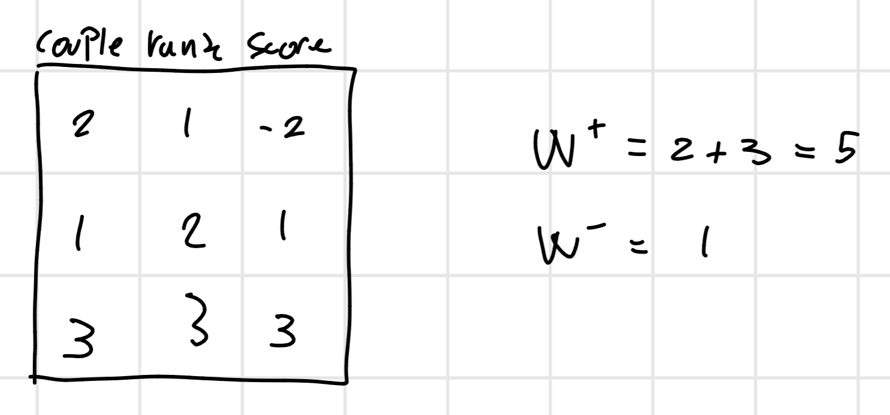

From this we find the $min(W^+, W^
-) = 1$

All possible combination: $N = 3 \implies 2^3 = 8$

So

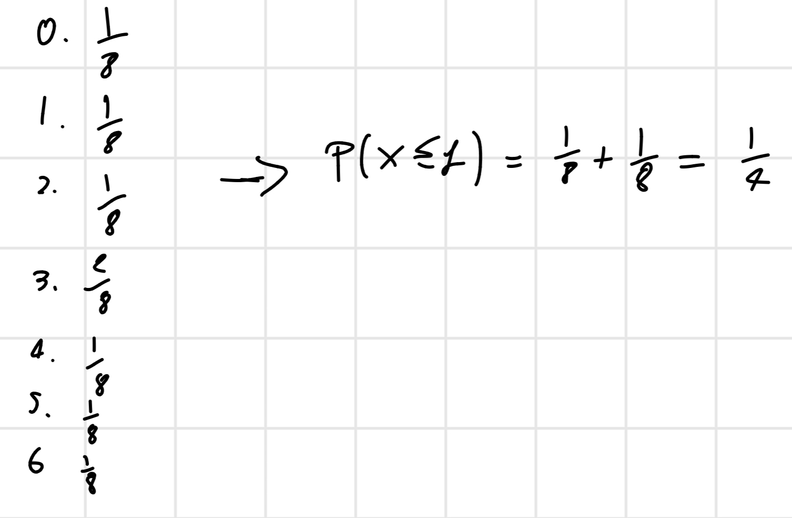

With the p-value we can estimate if the hybridization of a probe is presence $(P)$, absence $(A)$ or marginally $(M)$

- $P:$ p-value $< 0.04$
- $M: 0.04 \leq$ p-value $\leq 0.06$
- $A:$ otherwise

#### 5.2.3 cDNAs vs Oligonucleotides

- cDNA microarrays
  - They can applied to any organism without the needed to have sequences the complete genome.
  - Cheaper.
  - They are flexible and rely on hybridization between many bases and not a few.
- Chips of oligonucleotides:
  - They can contain a higher amount of genes, even predicted genes, that have not been inserted already in cDNA libraries.
  - Can be used only for sequenced organisms.
  - They can be used even by who cannot build a slide.
  - They have less variability between one chip and another.

**Search of regulated transcripts**

Comparative analysis allows to compare, for each represented transcript, the expression level of one condition to another, directly with the probe set expression level.

In this way, it is possible to identify and to qualify accurately alterations at transcriptional level between two samples.

#### 5.2.4 Microarray and Gene Expression Data (MGED)

MGED team

Team's goal is to simplify:

- Use of standard for microarray experiment annotation and data representation
- Introduction of experimental tests and data/result normalization methods.

Glossary

- MIAME(Minimum Information About Microarray Experiment): standard for experiment annotation
- MAGE-OM(MicroArray Gene Expression - Object Model): model of the data generated by microarrays
- ArrayExpress: database based on MAGE-OM
- MAGE-ML (MicroArray Gene Expression - Markup Language): markup language to shave, among databases, the experiments their data.
- Expression Profiler: tool for the analysis of microarray data that directly uses ArrayExpress.

**MIAME**

Principles:

- Information acquired should be enough to interpret the results and to replicate nd integrate experiments.
- Information structure should allow queries and automatic analysis on data.

**ArrayExpress**

- Database with microarray experimental data, where information are described in a standard way.

### 5.3 Data analysis of expression data

- Acquisition and pre-processing of the signal consist of:
  - Image analysis;
  - Image/data normalization;
  - Data transformation.
- **Image Analysis**
  - Identify probe position related to every gene;
  - Distinguish pixels related to foreground and background;
  - Intensity extraction for various intensities of the image.
- **Images/data normalization**
  - Identify and remove systematic error;
  - Normalization based on a set of genes whose expression must be invariant in different experimental conditions.
- **Data transformation**
  - Logarithmic transformation;
  - Outliers detection;
  - Missing values management.
- **Data Mining**
  - Selection of differently expressed genes;
  - Clustering, class discovery:
    - Unsupervised
  - Classification, class prediction:
    - Supervised

Issues:

- Data set dimensions;
- Different supports;
- Different technologies on different platforms;
- External database references are not stable;
- Array and sample annotations

### 5.4 DNA Microarray

Microarray: microscope slides or chips that contain ordered series of probes.

Exists a lot of type of microarray based on:

- DNA
- RNA
- Protein
- Tissue

We focus on DNA microarrays -> expression profiling.

Goal: study the effect of treatments, diseases, etc. on gene expression.

Used also to analyze gene sequence in a sample.

The cDNA microarrays is based in two channel

Hybridized with cDNA from two samples to be compared (cancer cells vs healthy cells) and laded with two different dyes:

- Each gene is represented by one partial cDNA clone.
- Dye relative intensities are used to identify up-regulated and down-regulated genes.

The oligonucleotide microarrays are based on single channel

#### 5.4.1 Normalization

**Normalization:** process of removing systematic variations that affect measured gene expression levels in microarray experiments.

- Hypotheses:
  - Measured intensities for each arrayed gene represent gene expression levels;
  - We assume that, for each biological sample we assay, we have a high-quality measurement of the intensity of hybridization;
  - We do not take into account:
    - Particular microarray platform used;
    - Type of measurement reported.
  - We suppose that the following are performed:
    - Background correction;
    - Spot-quality assessment and trimming

Sources of systematic variation:

- Dye effect: differences in dye efficiencies -> intensity varying bias;
- Scanner malfunction;
- Uneven hybridization -> spatially varying bias.

The expression ration of the i-th        gene on all arrays used is defined as:

$$
\begin{align*}
  T_i = \frac{R_i}{G_i} ,\ i = 1,...,N_{\text{genes}} 
\end{align*}
$$

- $R:$ target.
- $G:$ reference samples.

Issue with the regulation the expression ratios treat genes differently:

- Genes up-regulated by a factor of $10 \to$ expression ratio of $10$.
- Genes down-regulated by a factor of $0.1 \to$ expression ratio of $0.1$

Solution: $log_2(ratio) = log_2(T_i) = log_2 (\frac{R_i}{G_i}) \implies$ symmetric distribution

Assumptions:

- We are starting with equal total quantities of mRNA for the two samples we are going to compare.
- Given that there are millions of individual mRNA molecules in ech sample, we assume that the average mass of each molecule is approximately the same and the total number of molecules in each sample is also the same.
- The arrayed elements (probes) represent a total or random sampling of the genes in the organism (in some applications, not in this case).

**Normalization**

- Global normalization is archived by:

$$
\begin{align*}
  R_i' = R_i
  \\
  G_i' = K_{global}*G_i
  \\
  K_{global} = \frac{\sum_{i=1}^{N_{array}}R_i}{\sum_{i=1}^{N_{array}}G_i}
  \\
  log_2(T_i') = log_2(T_i) - log_2(K_{global})
\end{align*}
$$

- Several studies have indicated that the $log_2 (ratio)$ values can have a systematic dependence on intensity.
  - Such dependency can be studied in MA(Minus-Add) plot

$$
M_i = log_2(R_i) - log_2(G_i)
\\
A_i = \frac{log_2(R_i) + log_2(G_i)}{2}
$$

##### 5.4.1.1 LOWESS Normalization

**LOWESS(LOcally WEighted Scatterplot Smoothing): Locally Weighted Linear Regression**

For each $A$ value, we calculate the regression line on the basis of a subset of points $(M,A)$ around such $A$ value ($M(A)$).

LOWESS correction: $M_i' = log_2(T_i') = log_2(T_i) - M(A_i) = M_i - M(A_i)$

Can be made equivalent to a transformation on the intensities.

$$
R_i' = R_i
\\
G_i' = G_i * 2^{M(A_i)}
$$

##### 5.4.1.2 Local Normalization

Most normalization algorithms can be applied either globally or locally

For spotted arrays, local normalization is often applied to each group of array elements deposited by a single spotting pen.

Local normalization can help correcting for systematic spatial variation

Let $M_j(A)$ the LOWESS fit for the sub-array $j :$

$$
\begin{align*}
  M_i' = log_2(T_i') = log_2(T_i) - M_j(A_i) = M_i - M_j(A_i)
\end{align*}
$$

##### 5.4.1.3 Variance regulation

This normalization influence the $log_2 (ratio)$ measurements, but the variance of  the measured $log_2(ratio)$ values might differ from an array region to another.

Let $\sigma_j^2$ denote the variance of the normalized $log_2(ratio)$ values in the $j-th$ sub-array:

$$
\begin{align*}
  \sigma_j^2 = \frac{1}{N_j} \sum_{i=1}^{N_j} (M_i')^2
  \\
  M_i' = M_i - M_j(A_i)
\end{align*}
$$

The scaling factor is: $a_j = \frac{\sigma_j^2}{(\prod_{k=1}^{N_{sub-array}}\sigma_k^2)^{\frac{1}{N_{sub-array}}}}$

Then we obtain: $M_i'' = \frac{M_i'}{a_j} = \frac{log_2(T_i')}{a_j} \implies T_i' = \frac{R_i'}{G_i'} \implies M_i'' = \frac{log_2(\frac{R_i'}{G_i'})}{a_j}$

- $R_i'' = (R_i')^{\frac{1}{a_j}}$
- $G_i'' = (G_i')^{\frac{1}{a_j}}$

To measure the sub-array dispersion, it's possible with MAD(Mean Absolute Dispersion): $MAD_j = median_j(|M_i - median_j(M_i)|)$

##### 5.4.1.4 Between array normalization

- **Replication** is essential for identifying and reducing the variation in any experimental assay.
- **Technical replicates** provide information on natural and systematic variability that occurs in performing an assay.
- **Biological replicas** use mRNA obtained from distinct biological sources.

The particular approach used for between array normalization depends on the chosen experiment design.

We consider two experiment design choices:

- Dye - reversal analysis;
- Replicate averaging.

**Dye - reversal analysis**

We assume to have two samples, A and B

- Perform two hybridizations:

1. $A \to R, B \to G$
2. $A \to G, B \to R$

$T_{1,i}' = \frac{R_{1,i}'}{G_{1,i}'} = \frac{A_i}{B_i}$

$T_{2,i}' = \frac{B_i}{A_i}$

We are making comparison between identical samples

$log_2(T_{1,i}' * T_{2,i}') = log_2(\frac{A_i}{B_i} * \frac{B_i}{A_i}) = 0$

**Replicate averaging**

We assume to have more than one replicate for the same experiment:

$$
\begin{align*}
  M_{k,i}' = log_2(T_{k,i}') = log_2 (\frac{R_{k,i}'}{G_{k,i}'}), k = 1,...,N_{replicates}
  \\
  A_{k,i}' = \frac{1}{2} log_2(R_{k,i}' * G_{k,i}') 
\end{align*}
$$

The simplest strategy is to average the $M$ and $A$ values:

$$
\overline{M_i} = \frac{1}{N_{replicates}} \sum_{k=1}^{N_{replicates}}M_{k,i}'
\\
\overline{A_i} = \frac{1}{N_{replicates}} \sum_{k=1}^{N_{replicates}}A_{k,i}'
$$

This is the geometric average of the raw measurements $R$ and $G$

#### 5.4.2 Detection of differential expression

Goal: identification of genes that are significantly differentially expressed between one or more pairs of samples in the data set, after data normalization.

Strategies:

- Threshold
  - Constant threshold:
    - Compare fold-change with a constant threshold $\tau$, if $|M_i|>\tau \implies$ the i-th gene is differentially expressed.
  - Fixed threshold:
    - Compute the standard deviation $\sigma_M$ of all $M$ values, if $|M_i| > c*\sigma_M \implies$ the i-th gene is differentially expressed.
  - Adaptive threshold
    - Same of the "Fixed" one but with the local standard deviation $\sigma_M^{local} (A_i)$
- Gene - by -gene differential       expression (DE) analysis

Goals:

- Select a statistic that ranks the genes in order of evidence for differential expression;
- Choose a critical - value for the ranking statistic, above which any value is consider to be significant.

Sample mean: $\overline{M_i} = \frac{1}{N_{replicates}} \sum_{k=1}^{N_{replicates}}M_{k,i}'$

Sample standard variance: $s_i^2 = \frac{1}{N_{replicates} - 1} \sum_{k=1}^{N_{replicates}}(M_{k,i}' - \overline{M_i})^2$

- Hypothesis testing

Two hypothesis:

- Null hypothesis: the i-th gene is NOT differentially expressed.
- Alternative hypothesis: the i-th gene IS differentially expressed.

**Distribution under the null hypothesis**

We assume that the normalized $log_2(ratio)$ measurements are zero-mean Gaussian distributed with unknown variance $\sigma_i^2:$

$M_{k,i}' \in N(0,\sigma_i^2)$

t-statistic: $t_i = \frac{\overline{M_i}}{\frac{s_i}{\sqrt{N_{replicates}}}}, s_i:$ standard deviation

The t-statistic is used to compare a sample mean to a specific value $\mu_0$ (independent one-sample t-statistic)

$t = \frac{\overline{x} - \mu_0}{\frac{s}{\sqrt{N}}}, N:$ sample number

If the population is normally distributed, under the null hypothesis the t-statistic is distributed as a t-student distribution with $N-1$ degrees of freedom (dof).

If the true deviation $\sigma$ of the population was known in advance, we would have used the z-statistic:

$$
\begin{align*}
  z = \frac{\overline{x} - \mu_0}{\frac{\sigma}{\sqrt{N}}}
  \ \text{normally distributed} N(0,1) 
\end{align*}
$$

- The t-statistic converge to the z-statistic when the number of samples $N$ is large (generally is low).
- Now we can compute the p-value.

The p-value represents, the probability of observing under the null hypothesis a value less likely than that of the t-statistic.

Let $F(t) = \int_{- \infty}^t f(t)dt$ denote the cumulative density function of the probability density function under the null hypothesis the p-value of the i-th gene is given by: $p_i = 2 * (1-F(|t_i|)) \to$ this because we don't distinguish between up and down regulated.

The p-value is also defined as the significance level:

- Set a threshold $\alpha$ (often, $\alpha = 0.05$);
- If $p_i \leq \alpha,$ reject the null hypothesis
- If $p_i > \alpha,$ accept the null hypothesis.
- The threshold $\alpha$  controls the false positive rate

$\alpha$ defines the actual false positive rate only when testing the differential expression of one gene at a time. When testing multiple genes simultaneously, as it's usually the case, multiple test correction is needed.

There are a lot of methods to adjust the p-value $\implies p^{adj} -$ value, these correct the value indifferent ways:

- Bonferroni: (overly conservative: fewer FP, more FN) $= p_i^{adj} = p_i * N_{tests}$
- Bonferroni - Holm:
  - $p_i, i=1:N_{test},$ ranked p-value $(p_i<p_{i+1})$
  - $N_{test} = N_{genes}$
    - If $p_i^{adj} = p_i * (N_{tests} - i +1) \leq \alpha \implies$ null hypothesis rejected
    - Otherwise $\implies$ null hypothesis accepted
  - It controls the probability of one or more FP among all tests done (i.e. the Family Wise Error Rate, FWER)
- Westfall - Young
  - For $j=1:M$ ($M$ is an arbitrary number, if $M \geq 1000$ is better)
    - Perform random sampling of the $N_{genes}$;
    - Compute the p-value $p_i^j$ for each expression level $i$;
    - Compute the minimum p-value: $p^j = min_{i = 1:N_{genes}} p_i^j$
  - Compute $p_i^{adj} : p_i^{adj} \frac{N_{p^j<p_i}}{N_{p^j}}:$ we count the number of occurrence with $p^j<p_i$
  - Accurate, but costly
- Benjamini - Hochberg (False Discovery Rate - FDR)
  - Equal to the "Bonferroni - Holm" but the $p_i^{adj}=p_i*\frac{N_{tests}}{i} \leq \alpha \implies$ null hypothesis rejected, accepted otherwise.
  - The least conservative: more FP, fewer FN.
  - FDR controls the expected proportion of incorrectly rejected null hypothesis.

The t-statistic is not ideal because the small deviation drives the t-statistic value.

**Alternative statistics:**

- $\beta-$ statistic: is an estimate of the posterior log-odds the each gene is DE
  - $\beta-$ statistic $= log_2(\frac{P(DE|data)}{P(notDE||data)})$, $\beta-$ statistic values greater than zero correspond to a greater than $50\%$ chance that the gene is DE.
- Penalized t-statistic(equivalent to $\beta -$ statistic): $t_i^p = \frac{\overline{M_i}}{\sqrt{\frac{a + s_i^2}{N_{replicates}}}}$
  - $a:$ penalty;
  - $s_i^2:$ standard variance;
  - $\overline{M_i}:$ average sample $log(ratio).$

Experimental design of genetic expression studies:

- "Static" experiments: Two or more subject classes (different phenotypes/treatments);
- "Dynamic" experiments: same subject in different times.

### 5.5 Machine Learning

Input Data: a set of microarray experiments with many variables (genes).

For each gene, a feature vector is formed by combining its normalized expression values in the available samples.

- Rows represent the feature vector associated with a gene.
- Columns represent an experiment.

2 types of learning:

- Unsupervised learning (clustering/class discovery)
  - Feature vector unlabeled.
  - Goal: attach to each gene a cluster label by grouping together genes that exhibit similar expression behavior.
- Supervised learning (classification/class prediction)
  - Feature vectors labeled.
  - Goal: predict the label of a new unlabeled sample.

If the class variable has continue instead of discrete values we use regression analysis instead of classification.

#### 5.5.1 Definitions

- Feature: variables or attributes of the samples that are used to cluster or classify the samples.
- Distance: method used to decide whether two samples are similar or not.
- Model: how clustering or classifying:
  - K-mean
  - Support Vector Machines (SVM)

**Distances**

All machine learning (ML) approaches rely on some measure of distance between samples.

We must be aware of the distance function being used.

The choice of distance is **IMPORTANT** $\implies$ it influences the outcome.

- **Metric distances**

A distance measure $d_{ij}$ between two vectors, $i$ and $j$, must obey several rules:

- The distance must be positive and definite, $d_{ij} \geq 0$ ($d_{ii} = 0,$ because it's the distance from itself)
- The distance must  be symmetric, $d_{ij} = d_{ji}$.
- Triangle inequality: consider three objects $i,j,k$, the distance from $i$ and $k$ must be less than or equal to the sum of the distance $i,j$ and $j,k \implies d_{ik} \leq d_{ij} + d_{jk}$

- **Distance matrix**

Distances represented as matrix, where the $(i,j)$ is the distance between sample $i$ and sample $j$. (row,column)

They are symmetric.

- Euclidean distance

$d_{ij}^E = \sqrt{\sum_{k=1}^N (x_i^k - x_j^k)^2}$

- Correlation distance

$d_{ij}^c = \sum_{k=1}^N \frac{(x_i^k - \mu_i)(x_j^k - \mu_j)}{\sqrt{\sum_{k=1}^N(x_i^k - \mu_i)^2} \sqrt{\sum_{k=1}^N (x_j^k - \mu_j)^2}}$

Correlation measure linear association and is not resistant (one outlier can ruin it)

- Manhattan distance 

$d_{ij}^M = \sum_{k=1}^N |x_i^k - x_j^k|$

#### 5.5.2 Unsupervised learning (UL)

Also know as clustering or class discovery, the idea is to determine how many groups are in the data and which variables seem to define the grouping.

Clustering algorithms are methods to divide a set of $n$ observation into $g$ group so that within group similarities are larger than between group similarities.

The number of groups, $g$, is generally unknown

No training sample

Cross-validation difficult.

##### 5.5.2.1 UL Models - Hierarchial clustering

Two type:

- Agglomerative: generates a hierarchy of clustering going from $n$ clusters of $1$ element each, to $1$ cluster of $n$ elements.
- Divisive: divides the data into $g$ groups using some (re)allocation algorithm.

It must be defined:

- Distance between feature vectors.
- Distance between groups of feature vectors (clusters):
  - single linkage;
  - complete linkage;
  - average linkage.
- Single linkage: distance between two clusters is the smallest distance between an element of the first clusters and an element of the second one.
  - Chaining issue: tends to force clusters together due to single entities being close to each other regardless of the positions of other entities in each cluster. $d(r,s) = min(dist(x_{ri}, x_{sj}))$
- Complete linkage: As the "single linkage", but here is the maximum.
  - $d(r,s) = max(dist(x_{ri}, x_{sj}))$
  - Not used if we expect a lot of noise.
  - Also here compact cluster.
- Average linkage: distance between the two clusters is the average of all pairwise distances
  - $d(r,s) = \frac{1}{n_r*n_s}* \sum_{i=1}^{n_r} \sum_{j=1}^{n_s} dist(x_{ri}, x_{sj})$
  - No chaining issue
  - Computationally expensive.
  - It's also referred to as UPGMA (Unweighted Pair-Group Method using Arithmetic averages)

**Agglomerative hierarchical clustering**

Input: one feature vector for each gene

1. Initialization: each cluster consists of a gene.
2. Compute the distance between each pair of clusters.
3. Merge the two clusters with the smallest inter-cluster distance.
4. Go to step 2, until all genes are contained within one big cluster.

Output: dendrogram

##### 5.5.2.2 UL - Partitioning  methods

Agglomerative cluster partitioning methods:

- K-mean
- PAM (Partitioning Around Medoids)
- SOM (Self - Organizing Maps)

**K-mean**

1. Initialization:

   - Define the number of clusters $k$
   - Designate a cluster centre for each cluster

2. Assign each data point to the closest cluster centre -> datapoint is now a member of the cluster.
3. Calculate the new cluster centre (geometric average of each member of the cluster)
4. Calculate the sum of within-cluster sum-of-squares of distances of cluster elements from cluster centroid.

A common problem: if the initial partitions are not chosen carefully enough the computation has the chance of converting to a local minimum, rather that to the global minimum solution.

A solution is the funny logic.

Fuzzy logic allows algorithm to accept the possibility that a single data point can belong to more than one cluster.

- Singular Value Decomposition (SVD)

The SVD, sometimes called Principal Component Analysis (PCA), can be used to:

- Reduce the dimensionality of the data to summarize the most important components whilst simultaneously filtering out noise.
- Perform clustering directly.

How works ?

Consider the matrix $A \in \R^{m \times n}$ where:

- $m$ is the number of genes
- $n$ is the number of experiments (samples)
- $A_{ij}$ is the expression level of the i-th gene in the j-th sample.

The SVD of $A$ is defined as $A = U \Sigma V^T$ where:

- $U$ is a $m \times r$ orthogonal matrix.
- $V$ is a $n \times r$ orthogonal matrix.
- $\Sigma$ is a $r \times r$ diagonal matrix.
- $r$ is the rank of $A$

Linear algebra point of view:

- The SVD of $A$ is related to the eigenvalue/eigenvector decomposition:
  - $U$ is a set of eigenvectors of the matrix $AA^T$
  - $V$ is a set of eigenvectors of the matrix $A^TA$
  - The diagonal elements of $\Sigma$ are the square roots of the eigenvalues of $AA^T$ or $A^TA$
- Let $V_k$ denote the sub-matrix obtained with the first $k<r$ columns of $V \to$ the new $k-dimensional$ features are obtained by:
  - $A_k = AV_kV_k^T$ or $A_k = U_k \Sigma_k V_k^T, A_k\in \R^{m \times n}$

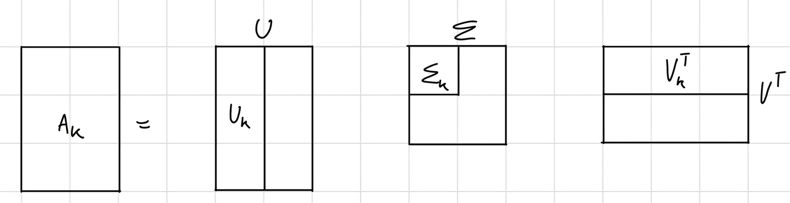

Clustering two options:

- Use $A_k$ as input for clustering.
- Decide the $k$ clusters and extract the first $k$ columns of the matrix $U$.
  - Each column of $U$ is a cluster
  - Each entry $i$ of column $j$ of $U$ represents the membership of gene $i$ to cluster $j$.
  - Genes are associated with multiple clusters.

#### 5.5.3 Supervised Learning

- SL is also known as classification or class prediction.
- The basic idea is to be able to predict the class of an input sample (TEST SAMPLE) given the prior knowledge of a set of labeled samples (TRAINING SAMPLES)

There are several techniques:

- Linear classifiers;
- K-NN(k- Nearest Neighbors);
- SVM (Support Vector Machines)
- ANN (Artificial Neural Networks)

The dimensionality is often huge, but small sample size.

##### 5.5.3.1 SL-Techniques

- K - Nearest Neighbors

Classification technique:

1. Initialization

- Define $k$
- Define a distance metric
- Consider a set of labeled training samples

2. Given a test sample:

   - Compute the distance between the test sample and all training samples
   - Retain the top $k$ training samples sorted based on the distance from the test sample
   - Each neighbor votes for its label (given a tag): assign to the test sample the label that receives more  votes.
- This technique is NON-parametric and time-consuming

**Support Vector Machines**

There are two types:

- Linear SVM
  - Work for linearly separable samples
  - Receive in input the original feature vectors.
  - Find the optimal hyperplane that separates the samples of the two classes
- NON-Linear SVM
  - NON-linear mapping us applied from the original feature space to a higher dimensional target feature space.
  - Can classify non-linearly separable samples
  - Linear SVM is applied in the target feature space.

##### 5.5.3.2 Key aspects

- Overfitting vs generalization
  - The latter supervised algorithm are parametric, so they are good in training but bad in test (generalization)$\implies$ overfitting.
- Cross-Validation

  - It's used to avoid overfitting

    - Subdivision of training samples in $K$ groups (folds)
    - Iteratively consider $k-1$ folds for training and $1$ folds for evaluation of the obtained classification model.
    - Combine the $k$ evaluations to define the parameter values providing better performance overall

- Testing Data
  - We use a set of data NEVER SEE BEFORE for test the real performance.
- Data test splitting and stratification
  - The splitting of available data is useful for maximize the growth and performance
  - Dataset stratification must be based on characteristics that can influence the classification result with this we can obtain a balanced characteristics.
- Class balancing
  - In addition stratification, we can perform these techniques:
    - Under sampling the majority class samples
    - Increasing the minority class samples with data argumentation techniques
- Explainability
  - It's clear the process of model classification.
  - In the linear models we have good explainability.

## Chapter Six: Bio-terminologies and bio-ontologies

Bio-terminologies and bio-ontologies have an important role in e-science.

- Bio-terminologies

Collection of terms, precise and universally comprehensible, that univocally define and identify different concepts.

- Useful for knowledge analysis and sharing
- Controlled: defined and maintained by groups of experts
- Increasing number, coverage and use in molecular biology and biomedicine.
- Very useful to enhance gene list with biological information.

- **Bio-ontologies***

Semantic structured used to:

- Describe the knowledge of a domain in a textual and computable form;
- Standardize and provide rigorous definitions for the terminology used in the domain;
- Composed by a controller (bio-) terminology and a semantic network;
- Very useful for automatic classification and inference.
- Semantic network
  - Scheme of relationship between "argument"

Example

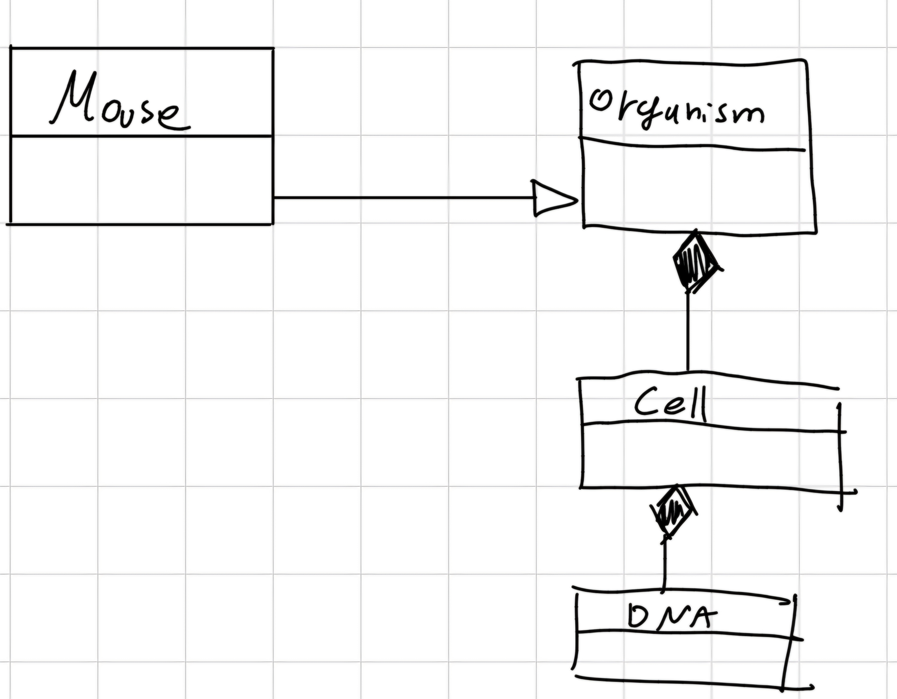

Bio-ontology issue

Ontology development is fragmented

- Separate communities of medical researches creating and maintaining ontologies;
- Different model organism databases using ontologies to annotate experimental data;
- Bioinformaticians creating algorithms for analyze these annotations;
- These activities are not unified and produce often not matching ontologies, unification could allows:
    - Integration of each other and with other data
    - Cross-species analysis

In general there are too much annotation and confusion without a real standard.

- Center of Biomedical Ontology

The US National Institute of Health (NIH) has founded the National Center of Biomedical Ontology (NCBO)

- Mission: Advance biomedicine with tools and methodologies for the structured organization of knowledge.
- Strategy: Develop, disseminate and support: OPEN DATA!!!

Resources:

- Open Biological and Biomedical Ontologies (OBO): integrated virtual library of biomedical ontologies.
- Open Biomedical Database (OBD): online repository of experimental data accessible via BioPortal
- BioPortal: A web-based portal to visualize the information about OBO and OBD

### 6.1 OBO

The OBO foundry is an open, inclusive and collaborative experiment involving developers of science-based ontologies aiming at:

- Establishing principles for ontology development;
- Supporting community members who are developing and publishing ontologies in the biomedical domain;
- Defining a set of orthogonal, fully interoperable reference ontologies in the biomedical domain by virtue of:
  - Common design philosophy and implementation.
  - Sharing of unique identifier space.
  - Inclusion if definitions.
- Enabling scientists and their instruments to communicate with minimum ambiguity.

In order ro be part of OBO, an ontology must be:

- Open source
- Expressed in a common and shared syntax
- Clearly specified and with a well defined content
- Not overlapping other OBO ontology
- Able to include textual definitions of all terms
- Well documented

There are several ontologies:

- The Gene Ontology (GO) project is the result of a collaborative effort to address the need for consist and species independent descriptions of gene and protein features in distinct biomolecular databanks include several of the major repositories for plant, animal and microbial genomes.

Structure:

- The GO is the bio-ontology most developed and used to describe gene and protein features.
- Provides $3$ controlled terminologies: 
  - Biological Processes;
  - Molecular Functions;
  - Cellular Components.
- The GO has a Directed Acyclic Graph (DAG) structure.
  - hierarchical tree (father -> son)
  - Oriented arches and without cycles.
  - Arches represent relationships between categories (as $IS-A, PART-OF$).
- Each GO concept has associated:
  - ID
  - Name
  - Definition
  - Synonyms
  - Reference databases
  - Relationships

Exist numerous different controlled vocabularies, a lot of vocabularies implies a lot of chaos so the Unified Medical Language Systems (UMLS) was created and maintained (by the US National Library of Medicine) as a support for integration of biomedical textual annotations scattered in distinct databases.

### 6.2 Enrichment Analysis

Given a list of genes found relevant in studied condition, we like to understand why such genes are relevant in that condition.

We want to:

- know which are all the known features of such a genes.
- evaluate which of such features, make a gene having them likely belonging to such group of genes.

We can:

- Retrieve all the gene known annotations.
- Consider their annotation terms and test which of them, are significantly more/less annotated to the found genes.

Goal: detect significant enrichments and/or depletions of annotation terms within a target set of genes if interest, with respect to a master set.

**Problem statement**

- Input:
  - Master set of $n_A$ genes
  - Target set of $n_B$ genes
  - Controlled vocabulary term $t_i$
  - Annotation database, where each gene is annotated to zero or more terms from the controlled vocabulary
- Output:
  - Indication of over-representation (enrichment) or under-representation (depletion) of term $t_i$ in the target set.

NO new annotation is generated with the enrichment analysis.

For each annotation term $t_i$:

- $n_T:$ number of master set genes annotated to term $t_i$
- $k:$ number of target set genes annotated to term $t_i$

Null hypothesis:

Under the null hypothesis, belonging to the target set $B$ is independent from being annotated with term $t$

The probability of observing $k$ genes in the target set annotated to the term $t$ is given by the hypergeometric distribution:

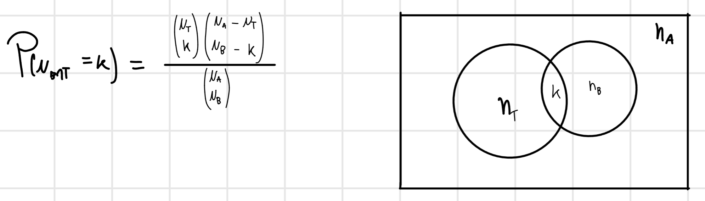

- Significance value measured on hypergeometric distribution or through the Fisher Exact test.
  - Probability of finding at least $k$ genes annotated to $t$ in the target set $B$ under the null hypothesis:
    - $p = \sum_{k \geq N_B \cap T} P(N_{B \cap T} = k)$
  - if $p>\alpha$ (often, $\alpha = 0.05$) Accept the null hypothesis

Fisher Exact test is a test of significance used in place of Chi-square test in $2x2$ tables, especially with small samples.

Given the probability $P$ of a contingency table with proportion of cases on the diagonal with most cases due chance of sampling:

$P = \frac{n_T! * (n_A - n_T)! * n_B! * (n_A - n_B)!}{k! * (n_T - k)! * (n_B - k)! * (n_A - n_B - n_T + k)! * n_A!}$

#### 6.2.1 Biological interpretation and multiple testing correction

- Biological interpretation of gene list

  - Annotations of genes to controlled vocabulary terms means that the annotated genes have the features described by controlled terms

  - Terms statistically significantly enriched in a target set of genes represent the gene features that make those genes belonging to the target set.
  - If the target set has been selected as the gens significantly differentially expressed in a given biological condition, the significantly enriched terms represent the gene features that make those genes differentially expressed in that biological condition, they represent the significant features in the given biological condition.

- Multiple testing correction (already discussed)

- Ontology-based analysis

The methods assume that the test are independent and assume right, but if ontological annotations are used parent-child dependencies between annotation terms exist.

Exist methods to exploit the ontology structure to de-correlate ontology terms:

- Alexa et al
- Grossman et al

**Alexa et al**

Analyze the ontology terms of the annotations bottom-up; two methods:

1. Elim method:
   
   - For each level of the ontological hierarchy:
     - If a term is found to be significantly enriched, remove the annotations to its ancestor terms of the genes annotated to it from the target and master set.
2. Weight method:
   -  Improve the first method, NO elimination but assign soft weight

**Grossman et al**

Goal: avoid inheritance problem -> if the father is enriched, the children tend to be also enriched

- We modified the hypergeometric distribution formula for this reason: $P(N_{B \cap T} = k | N_{B \cap p} = n_{B \cap p}) = \frac{\binom{n_T}{k}\binom{n_p - n_T}{n_{B \cap p} - k}}{\binom{n_p}{n_{B \cap p}}}$

**Limitations**

- Enrichment analysis applies on a pre-selected group of genes, regardless relevance of each gene in the group, from a background population.
- After multiple testing correction, no individual gene may meet the threshold for statistical significance.
- Alternatively, a long list of statistically significant genes may remain, without any unifying biological theme -> interpretation daunting.

### 6.3 Gene Set Enrichment Analysis (GSEA)

Computational method comparing a ranked list of gene L to gene sets/signatures defined on prior biological knowledge, to determine whether the gene set shows statistically significant, concordant differences between two biological states.

All this annotated gene sets are hosted iin the Molecular Signature Database (MSigDB)

- Setting

Genes from an expression dataset are ordered in a ranked list L.

Given an apriori defined gene set $S$, GSEA determines whether members of $S$ are randomly distributed throughout list $L$ or occur primarily toward the top or bottom.

An enrichment score indicates if the genes in set $S$ are clustered toward the beginning or end of the ranked list $L$

#### 6.3.1 How works ?

3 steps:

1. Calculation of the Enrichment Score $ES(S)$
   - $ES(S)$ reflects the degree a set $S$ is overrepresented at the extremes of the entire ranked list $L$
   - The enrichment score is the maximum deviation from zero in the random walk.
     - Rank genes in the dataset based on the correlation of their expression profiles with class $C$ as to form $L=\{g_1,...,g_N\}$ consider an independent gene set $S$ and its $N_H$ genes.
     - Evaluate the fraction of genes $g_1,..., g_N$ also in $S(hit)$ weighted by their correlation $r_j$ and the fraction of genes not in $S(misses)$ up to a given position $i$ in $L$
     - $P_{hit} (S,i) = \sum_{g_j \in S} \frac{|r_j|^P}{N_R}, N_R = \sum_{g_j \in S} |r_j|^P, j \leq i$
     - $P_{miss}(S,i) = \sum_{g_j \notin S}\frac{1}{N - N_H}, j \leq i$
   - The $ES(S)$ is the maximum deviation from zero to $P_{hit} - P_{miss}$

2. Estimation of significance level of ES
   - Statistical significance (p-value) of observed $ES$ is estimated by using a permutation test:
     - Phenotype/class label permutations: randomly assign phenotype labels to samples, reorder genes, and re-compute $ES(S)$
     - Repeat previous step to perform 1000 permutations to generate a null distribution and create a histogram of the corresponding enrichment score $ES \ NULL$
     - Estimate empirical significance of observed $ES(S)$ relative to null distribution of $ES \ NULL$ scores, using the positive or negative portion of the distribution based on sign of observed $ES(S)$

3. Adjustment for multiple hypothesis testing
   - Any significance level must be adjusted, so also the same thing:
     - For each gene set $S'$, compute $ES(S')$
     - We adjust $S'$ with permutation $\pi \to ES(S',\pi)$
     - Normalize with Normalized Enrichment Score $NES(S')$ and $NES(S',\pi)$
     - Compute the FDR of each $NES$

### 6.4 Functional similarity analysis

Computing functional similarity between genes

Goal: the title, based on annotations describing their functions

Traditional strategies are based on:

- Sequence similarity
- Analysis of correlation in gene expression

Issue: the majority of co-functioning genes:

- Neither is sequence-related;
- Nor encodes proteins in the same protein family or in the same pathway;
- Can be expressed at different time points.

Hypothesis: if two genes have similar functional annotation profiles, they should be functionally related -> Measure of functional similarity based on gene annotation profiles:

- Controlled vocabularies;
- Onotlogies.

**Functional similarity based on controlled vocabularies**

Controlled vocabulary schemas mandate the uses of predefined, authorized terms that have been preselected.

In their simplest version, there are no semantic links between the terms in the controlled vocabulary.

Annotation of genes:

- Each gene can be annotated to zero or more terms from a controlled vocabulary

Example tool: DAVID (the Database for Annotation, Visualization and Integrated Discovery)

Use Kappa $(k)$ statistical index.

**Computing similarity based on annotation profile**

Typically, with ontological annotations, it is a two step procedure:

1. Compute ontological term-to-term similarity.
2. Compute gene-to-gene similarity based on annotation profile

Optional step:

- Compute gene similarity based on multiple ontologies
- Compute gene clustering based on functional similarity

**Step 1: term-to-term similarity method**

- Ontology topology based methods:
  - Compute the distance between two ontological terms by counting the number of arches between them within the ontology.
  - Shortest or average distance is used for multiple paths.
  - Issue: assume that nodes and arches are uniformly distributed in an ontology (usually false)
- Information theoretic methods (e.g SVD)
  - Less sensitive to arch density variability

#### 6.4.1 Term-to-term similarity

5 steps:

1. Compute the frequency (probability) of occurrence of a term in a corpus
   - $Freq(c) = \sum \{occur(c_i) | c \in Ancestors(c_i)\}$
   - $Prob(c) = \frac{Freq(c)}{max(Freq)}$

2. Compute the information content $Ic(c)$ of a term:
   - $Ic(c) = - log(Prob(c))$
   - More rare is the term: $\downarrow p(c)$ and $\uparrow Ic(c)$
   - More common is the term: $\uparrow p(c)$ and $\downarrow Ic(c)$

3. Find common ancestors of two terms
   - $CommonAnc(c_1,c_2) = Ancestors(c_1) \cap Ancestors(c_2)$

4. Compute shared information between two terms:
   - $Share(c_1,c_2) = max\{Ic(a) | a \in CommonAnc(c_1, c_2)\}$

i.e. the $IC$ of the Lowest Common Ancestor (LCA)

- LCA
  - Common ancestors of nodes (terms) $k$ and $n$ are nodes $a$ and $i$
  - The LCA of node $k$ and $n$ is $i$ the most distant between $a$ and $i$ from the ontology root

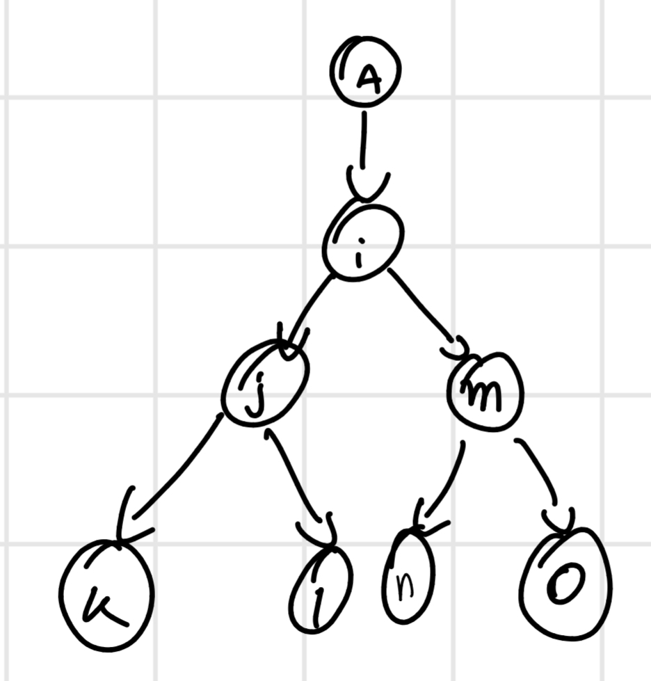

5. Compute similarity metrics between two terms:
   - Resnik
     - $Sim_{Resnik}(c_1,c_2) = Share (c_1, c_2)$
   - Jiang
     - $dist_{JC}(c_1,c_2) = Ic(c_1) + Ic(c_2) - 2*Share(c_1,c_2)$
   - Lin
     - $Sim_{Lin}(c_1,c_2) = \frac{2*Share(c_1,c_2)}{Ic(c_1) + Ic(c_2)}$

#### 6.4.2 gene-to-gene similarity

Step 2: gene-to-gene similarity:

- Consider two genes, $p$ and $q$ annotated to $N$ and $M$ terms
  - $GO^p = \{GO_1^p, ..., GO_N^p\}$
  - $GO^q = \{GO_1^q, ..., GO_N^q\}$
- Define the term-to-term similarity metrics:
  - $S_{ij} = sim(GO_i^p,GO_j^q), \forall i \in \{1,...,N\}, \forall j \in \{1,...,M\}$
- Compute similarity metrics between two genes:
  - Lord (max of annotated term similarity scores):
    -  $GO_{score\ max}(p,q) = max(s_{ij})$
 -  Speer (average of annotated term similarity scores):
    -  $GO_{score \ Avg}(p,q) = \frac{1}{N*M} \sum s_{ij}$
 - Schlinker (max of averages of max of term similarity scores):
   - $GO_{score \ BM}(p,q) = max \{rowScore(p,q), columnScore(p,q)\}$
     - $rowScore:$ average of the row maxima.
     - $columnScore:$ average og the column maxima.

How validate ? 

- Structural information (sequence similarity)
- Gene expression data (microarray experiments)
- Assessing the functional consistency of clustering 
  - Multi Dimensional Scaling (MDS)
  - Hierarchical clustering
  - Fuzzy clustering

Optional step

- Gene similarity based on multiple ontologies
  - GO Biological Process (BP) and GO Molecular Function
    - $funSim(p,q) = \frac{1}{2} * [(\frac{BPScore(p,q)}{max(BPscore)})^2 + (\frac{MFScore(p,q)}{max(MFscore)})^2]$
    - $rfunSim(p,q) = \sqrt{funSim(p,q)}$
- Gene clustering based on functional similarity
  - Goal: functional clustering
    - Functional annotation based clustering
    - Co-Clustering: functional annotation microarray expression data

## Chapter Seven: Biomolecular Databank

There are a lot of biomolecular data:

- Microarray data
- FASTA (is also a file format for DNA/RNA/Protein sequence)
- Other

So $\underline{\text{DataBank}}$

2 types:

- Primary databank (DNA/RNA/Proteins,...) $\to$ contain only generic information
- Specialized databank (EST, STS, SNP, RNA, genomes, microarray data,...)

Example of primary databank

- DNA
  - EMBL at EBI (European Molecular Biology Laboratory)
  - GenBank at NCBI
  - DDBJ
- Protein
  - UniProt (Universal Protein Resource)
  - Swiss-Prot / TrEMBL
  - PIR (Protein Information Resource)

There three majority databanks joined the International Nucleotide Sequence Database Collaboration and promotes these projects:

- The Taxonomy project, one of its main goals is using a unified taxonomy in all three databanks
- The Feature Table, identifying a set of information to associate to each sequence and the mechanism of data exchange

Specialized databanks collect sets of homogeneous data from the taxonomic and/or functional point of view data with annotation and additional values information.

Example:

- Human curated (Swiss-Prot,...)
- Computationally derived (UniGene,...)
- Combination of both (NCBI GenomeAssembly)

Can be classified as:

- Simple subset of primary databank data but with annotation and specific biological information.
- A set of homologous sequences multi-aligned
- A set of specific information.
- Genomic databanks, whole set of information derived from mapping and sequencing projects of Human Genome or other.
- Integrative Databanks, created to collect information dispersedly stored in other specialized databanks

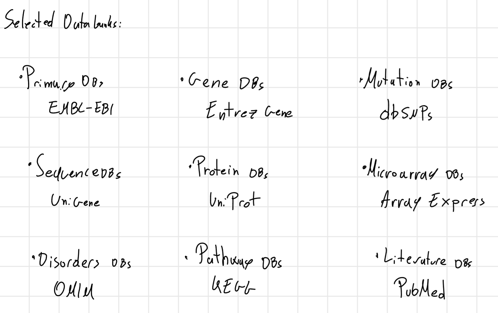

Databank access types:

- Access through Web interface (HTML)
- Access through Web Service
- Access through FTP server
- Direct access
- Direct HTTP linking

Tools for use gene and protein annotations:

- MyWEST: My Web Extraction Software Tool, automatic extraction for multiple HTML pages.
- GFINDer: Genome Function INtegrated Discovers for the statistical function analysis.
- GPDW: Genomic and Proteomic Data Warehouse, automatic procedures for creation and updating of all integrated data warehouse of many genomic and proteomic annotation.
- Bio-SeCo: Biomedical Search Computing, Search computing project.

## Chapter Eight: Biological Networks

Why ?

1. Model complex interactions among distinct entities
2. Integrate and visualize distinct data and information
3. Investigate properties to better understand the underlying system.

Types of biological networks:

- Protein-protein interaction networks;
- Gene regulatory networks
- Gene co-expression networks 
- Metabolic networks
- Signaling networks
- Neuronal networks

For build a gene co-expressed networks we start from the gene expression data by similarity measure.

Similarity metrics:

- Pearson's correlation: measures the correspondence of two gene expression vectors.
- Spearman's rank correlation: Pearson's correlation for the ranks of gene expression values in two gene expression vectors.
- Cosine similarity: cosine of the angle between the two gene expression vectors.
- Euclidean distance: measures the geometric distance between two gene expression.
- Mutual Information: measures how much the information of gene reduces the uncertainty about the expression levels of another.

A network is a structures formed by $N$ nodes and $E$ edges

Can be:

- Directed
- Undirected
- Weighted
- Unweighted

Topological measures of networks:

- Average distance -> distance
- Diameter -> maximum length
- Clustering coefficient
- Centrality measures: degree, closeness, betweenness and eigenvector
- Degree distribution
- Clustering distance -> local link density

$\frac{\text{\# triangle of node}\  i}{\text{\# connection of}\ i * \frac{\text{\# connection of }i - 1}{2}}$

Example

$C_a = \frac{3}{5 * \frac{5-1}{2}} = \frac{3}{10}$

Degree centrality -> $n°$ of link $\implies$ hubs are the most central nodes

Closeness centrality

Average distance from the node $i$ to all the other $n-1$ network nodes

$l_i = \frac{1}{n-1}\sum_j d_{ij}$

closeness centrality: $c_i = \frac{1}{l_i} = \frac{n-1}{\sum_j d_{ij}}$

betweenness centrality $b_i = \sum \frac{\text{\# of shortest paths connecting}\ i,j\text{via}\ i }{\text{\# of shortest paths connecting}\ i,j} = \sum_{j,k} \frac{n_{j,k}(i)}{n_{j,k}}$

**Weighted Gene Co-expression Network Analysis (WGCNA)**

The WGCNA is popular systems biology strategy to explore yhe system-level functionality of a transcriptome:

- constructing gene co-expression networks;
- detecting gene modules and identifying hub genes within modules;
- associating modules to clinical/biological traits.

1. Construct a gene co-expression networks represented mathematically by matrix, the element of which indicates co-expression similarity between a pair of genes.
2. Identify modules using hierarchial clustering: WGCNA uses a topological overlap matrix and dissimilarity measure to obtain modules, that can be biologically meaningful in real data analysis.
3. Relate modules to phenotypic and/or clinically relevant traits:
   - One can test the module-trait association between the module eigengene and the trait.
   - One can also use the module significance $(MS)$, which is defined as the average gene significance $(GS)$ to a trait of all genes in the module. The GS of a node is the correlation between the node and the trait.
   - Lastly, the module membership of a gene $i (MM(i) = cor(x_i, ME))$ measures the importance of the gene within the module.

4. Study inter-module relationships and module preservation.
5. Find jey drivers in interesting modules.