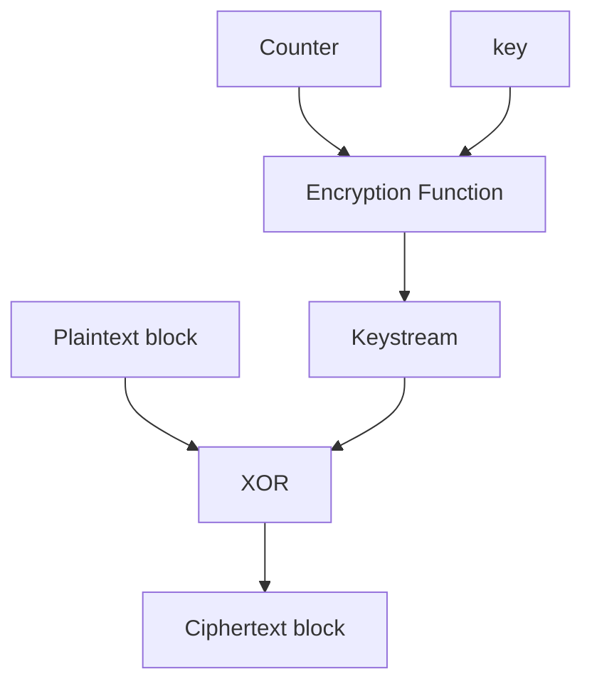
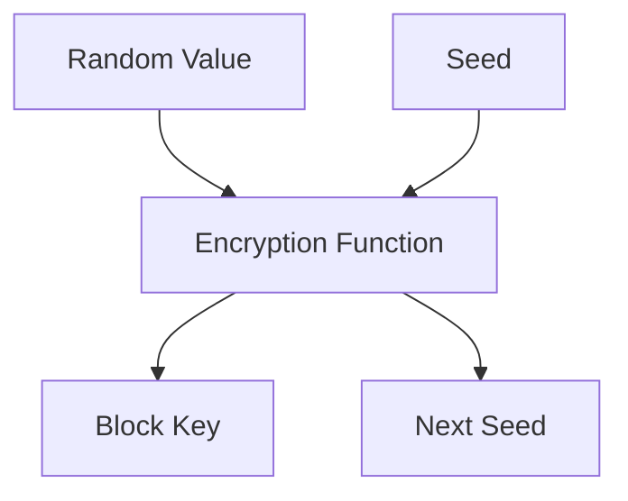

## Introduction

A **secure system** defends against external threats, while a **safe system** does not cause harm.

### CIA Paradigm

A secure system must satisfy the **CIA paradigm**:

- **Confidentiality**: Only authorized entities can access information
- **Integrity**: Information can be modified only by authorized entities that are entitled to do so
- **Availability**: Information must be accessible to authorized entities with proper access rights

> Confidentiality and Integrity are in conflict with Availability. Security requires finding appropriate tradeoffs between these pillars.

### Risk Assessment Components

To assess risk, it's important to understand the following components:

- **Vulnerability**: A weakness that allows violation of at least one CIA constraint
- **Exploit**: A specific technique that uses one or more vulnerabilities to accomplish an objective that violates CIA constraints

> An exploit implies a vulnerability exists, but a vulnerability can exist without an available exploit.

- **Assets**: Resources valuable to the organization (hardware, software, data, reputation)
- **Threat**: Any potential violation of CIA constraints (different from an exploit, which is a specific technique to accomplish a violation)
- **Attack**: Intentional use of an exploit to deliberately violate CIA constraints
- **Threat Agent**: Any entity that could potentially become an attacker
- **Attacker**: An entity that performs an attack
  - *Black hats*: Malicious attackers
  - *White hats*: Ethical security professionals

### Security Levels

- **Security Level**: The degree of security appropriate to the threats facing the system
- **Protection Level**: The degree of security actually implemented through countermeasures

### Risk

Risk is a statistical and economic evaluation of exposure to damage due to the presence of vulnerabilities and threats:

$$\text{Risk} = \underbrace{\text{Asset} \times \text{Vulnerability}}_{\text{controllable factors}} \times \underbrace{\text{Threats}}_{\text{independent factors}}$$

Key observations:

- Threats cannot be controlled as they are external; they must be evaluated and monitored
- Asset value cannot be reduced without losing organizational value
- Only vulnerabilities are directly controllable

### Security Strategy

Security focuses on reducing vulnerabilities and containing damage at acceptable costs (involving tradeoffs between security and usability/performance).

- **Direct costs**: Management, operations, equipment (relatively easy to estimate)
- **Indirect costs**: Reduced usability, performance, privacy, or productivity impacts

## Cryptography

Cryptography comprises techniques to enable secure communication and storage in the presence of attackers.

### Objectives

A cryptographic system must provide:

- **Confidentiality**: Only authorized entities can access information
- **Integrity**: Detect and prevent unauthorized modification of information
- **Authentication**: Verify the identity of entities
- **Non-repudiation**: Prevent entities from denying their actions
- **Proof of Knowledge**: Allow one entity to prove to another that it knows a secret without revealing it
- **Proof of Computation**: Allow one entity to prove to another that it performed a computation without revealing details

### Cipher Fundamentals

Encryption transforms plaintext into ciphertext using an algorithm (public) and a key (secret). Decryption is the process that reverses this transformation.

#### Mathematical Definition

- **Plaintext space** $P$: set of all possible messages of length $n$
- **Ciphertext space** $C$: set of all possible encrypted messages of length $m$ (where $m \geq n$)
- **Key space** $K$: set of all possible keys of length $\lambda$
- **Encryption function** $\mathbb{E}: P \times K \rightarrow C$ produces ciphertext from plaintext and key
- **Decryption function** $\mathbb{D}: C \times K \rightarrow P$ recovers plaintext from ciphertext and key

**Correctness property**: $\mathbb{D}(\mathbb{E}(p, k_e), k_d) = p$ for all $p \in P$, $k_e \in K$, $k_d \in K$ (decryption key may differ from encryption key)

#### Properties of Good Ciphers

From both usability and security perspectives, a cipher should:

- Be practically impossible to break (if not mathematically)
- Remain secure even if the algorithm is public
- Use keys that are easily communicable and changeable without written records
- Be applicable to communication scenarios
- Be portable and operable by individuals
- Be easy to use and understand without excessive mental effort

Randomness is critical for secure encryption:

- Should be inherent in the key generation process
- Must produce uniform distribution of outputs
- Essential for preventing patterns in ciphertexts

#### Attack Models

To provide confidentiality, systems must resist various threat levels:

- **Ciphertext-only attack**: Attacker has access only to ciphertexts and attempts to deduce plaintext or key
- **Known-plaintext attack**: Attacker knows some plaintext-ciphertext pairs but cannot choose them
- **Chosen-plaintext attack**: Attacker can select arbitrary plaintexts and obtain corresponding ciphertexts, attempting to deduce the key
- **Active attacks**: Attacker can modify ciphertexts or inject new ones

#### Perfect Ciphers

A cipher is **perfect** if ciphertext provides no information about plaintext:

$$P(p|c) = P(p)$$

**Shannon's Theorem**: A cipher is perfect if and only if:

- Key space is at least as large as plaintext space
- Keys are used uniformly at random
- Each key is used only once (never reused)

This would requires managing truly random keys as long as messages, used only once—infeasible at scale.

> **Example**: One-Time Pad, performing a XOR operation between plaintext and a random key of equal length, is a perfect cipher.

#### Computational Security

In practice, perfect ciphers are replaced by **computationally secure ciphers**, which:

- Are designed to resist all known attacks
- Are easy to decrypt with the correct key
- Brute-force is the best known attack, and it is computationally infeasible to break the cipher within a reasonable time frame

**Nash's Theorem**: A cipher is secure if the cost of breaking it exceeds the value of the protected information.

Computationally secure ciphers rely on the hardness of certain mathematical problems, that are easy to compute in one direction but hard to reverse without specific information:

- **Factoring Large Integers**: Computing $n = p \times q$ is easy; reversing (finding $p$ and $q$ given $n$) is computationally hard
- **Discrete Logarithm Problem**: Computing $g^x = y$ is easy; reversing (finding $x$ given $g$ and $y$) is computationally hard

Security is proven by showing that breaking the cipher would solve a known hard problem, believed infeasible with current technology.

### Symmetric Encryption

In symmetric encryption, the same key is used for both encryption and decryption. Both parties must have access to this secret key, creating challenges for key distribution:

- **Distribution requirement**: Key must be shared through a trusted channel—secure not against all attackers, but specifically against the threat agents present.
- **Scalability limitation**: For $n$ users, the number of required keys grows quadratically: $\frac{n(n-1)}{2}$ keys total.

Some examples of symmetric ciphers include:

- **Substitution ciphers**: Replace each plaintext element with another (e.g., Caesar cipher)
- **Transposition ciphers**: Rearrange plaintext elements (e.g., rail fence cipher)

**AES (Advanced Encryption Standard)** is the current standard, using 128-bit blocks with key sizes of 128, 192, or 256 bits. Needs $2^{128}$ operations to brute-force a 128-bit key.

#### Pseudorandom Number Generators (CSPRNGs)

A **Cryptographically Secure Pseudorandom Number Generator** is a deterministic function $G: \{0,1\}^\lambda \rightarrow \{0,1\}^{\lambda + l}$ whose output is indistinguishable from random by any efficient (polynomial-time) algorithm.

##### Stream Ciphers

**Stream ciphers** generate a pseudorandom keystream that is XORed with the plaintext to produce ciphertext.

They are efficient for encrypting data of arbitrary length but require careful management of keys and initialization vectors (IVs) to prevent vulnerabilities.

##### Block Ciphers

**Pseudo-Random Permutations (PRP)** are a type of function that is bijective, meaning each input maps to a unique output and vice versa. The function is identified by a key, and for each key, it behaves like a random permutation over the input space.

The simplest block cipher is **Electronic Codebook (ECB)**, which encrypts each block of plaintext independently. However, it is insecure because identical plaintext blocks produce identical ciphertext blocks, revealing patterns in the data.
A better approach is to use **Counter (CTR) Mode**, which generates a keystream of the length of the plaintext by encrypting a counter for each block and XORing it with the plaintext. The problem with CTR mode is that the counter is predictable.

To prevent attacks when reusing keys:

- **Nonce (Number Used Once)**: Use a random value unique for each encryption, based on the ciphertext, making the starting point of the counter unpredictable. Allows the same key for multiple encryptions without producing identical ciphertexts for identical plaintexts.
- **Rekeying**: Generate a new key for each block by encrypting a random value with the original key. Uses symmetric ratcheting: split the key into two parts—one encrypts the block, the other generates the next key.

### Integrity and Authenticity

A cipher is **malleable** if an attacker can modify the ciphertext to produce predictable changes in the decrypted plaintext without knowing the key. This enables:

- Data manipulation attacks
- Homomorphic encryption (computation on encrypted data with results matching operations on plaintext)

#### Message Authentication Codes (MAC)

The **Message Authentication Code (MAC)** is a short tag generated from a message and a secret key, that is attached to the message. It allows the receiver to verify both the integrity and authenticity of the message.

- `compute_tag(message, key)`: Produces a tag for integrity verification
- `verify_tag(message, tag, key)`: Returns true if the tag is valid for the message and key

As both sender and receiver share the same key, MACs do not provide non-repudiation (both parties can generate valid tags).

It is implemented using **CBC-MAC** (Cipher Block Chaining Message Authentication Code) that encrypt a block with the key, XOR the output with the next block, and use the final output as the tag.

#### Hash Functions

Hash functions map messages to fixed-size digests unique to the input. They are faster than MAC and provide integrity checks.

A secure hash function must resist:

- **Preimage attack**: Given hash value $h$, it should be infeasible to find input $m$ where $\text{hash}(m) = h$
- **Second preimage attack**: Given input $m$ and its hash, it should be infeasible to find different $m'$ where $\text{hash}(m') = \text{hash}(m)$
- **Collision attack**: It should be infeasible to find any two different inputs $m_1 \neq m_2$ where $\text{hash}(m_1) = \text{hash}(m_2)$

**Brute-force resistance**: Secure functions should not be breakable faster than brute-force ($2^{n-1}$ for preimage, $2^{n/2}$ for collisions).

**SHA-2 and SHA-3** are the current standards, producing hash values of 256, 384, or 512 bits.

#### HMAC (Keyed Hash)

Combines hash functions with a secret key by including the key as part of the hash input.

This provides integrity and authenticity, but not non-repudiation as the parties with the key can generate valid HMACs.

### Asymmetric Encryption

Symmetric encryption alone cannot provide:

- Authentication (sender cannot be verified)
- Key agreement over public channels
- Confidential communication without pre-shared secrets

This is done through **asymmetric encryption**, which uses a pair of keys: a public key (freely distributable) and a private key (kept secret).

The key generation uses one-way functions with trapdoors, where the public key can be easily derived from the private key, but the private key cannot be feasibly derived from the public key without specific information (the trapdoor).

The double keys allow for two main use cases:

- **Public-key encryption**: Sender encrypts with recipient's public key; only recipient (with private key) can decrypt. Provides confidentiality.
- **Digital signatures**: Sender signs with private key; recipient verifies with sender's public key. Provides authentication and non-repudiation.

The most common algorithm is **RSA**, based on the difficulty of factoring large integers. Another common algorithm is **Elgamal**, based on the discrete logarithm problem.

The problem with asymmetric encryption is that it is computationally expensive and requires larger key sizes for equivalent security compared to symmetric encryption (2048-bit RSA ≈ 256-bit AES). Therefore, it is often used in combination with symmetric encryption in a **hybrid approach**.

#### Hybrid Approach

Hybrid approach uses asymmetric encryption for secure key exchange and symmetric encryption for the actual message:

1. Generate a symmetric key for the actual message
2. Encrypt the message with symmetric key
3. Encrypt the symmetric key with recipient's public key
4. Send both encrypted message and encrypted key

##### Diffie-Hellman Key Exchange

Allows two parties to establish a shared secret over an insecure channel without pre-shared private keys.

1. Define a finite cyclic group $(G, \cdot)$, generator $g$, and numbers $a, b$ (where $\lambda = \text{len}(a) \sim \log_2(|G|)$)
2. Alice computes $A = g^a$ and sends to Bob
3. Bob computes $B = g^b$ and sends to Alice
4. Alice computes shared secret: $s = B^a = g^{ab}$
5. Bob computes shared secret: $s = A^b = g^{ab}$

This is resistant to passive eavesdropping (attacker would need to solve the discrete logarithm problem).

#### Digital Signatures

To provide both authentication and integrity:

1. Hash the message
2. Encrypt the hash with the sender's private key
3. Recipient decrypts with sender's public key and compares to hash of received message

#### Public Key Infrastructure (PKI)

To authenticate public keys, PKI uses a hierarchical trust model where trusted **Certificate Authorities** (CAs) issue digital certificates that bind public keys to identities.

The CA signs a certificate containing the sender's public key and identity information with its private key. Recipients can verify the certificate's authenticity using the CA's public key, which must be trusted.

Certificate revocation can be managed through:

- **Certificate Revocation List (CRL)**: Published list of revoked certificates; recipients check against when verifying
- **Online Certificate Status Protocol (OCSP)**: Real-time protocol to query CA for certificate status—more up-to-date than CRL

### Information Theory and Entropy

Acquiring information reduces uncertainty about a message. A message source can be modeled as a random variable. Greater variance means higher uncertainty and more information gain.

#### Shannon Entropy

The **entropy** measures the uncertainty or randomness of a random variable.

Defined as:

$$H(X) = -\sum_{x \in X} P(x) \log_2 P(x)$$

where $P(x)$ is the probability of random variable $X$ taking value $x$.

**Properties**:

- Measured in bits
- Higher entropy = more unpredictable (more information)
- Lower entropy = more predictable (less information)
- Example: Constant message has $H(X) = 0$; completely random message has high $H(X)$

A message's outcome can be encoded using approximately $H(X)$ bits, the minimum bits needed to represent information without loss.

#### Min-Entropy

The **Min-Entropy** Represents the difficulty of guessing the most likely outcome of a random variable. It is defined as:

$$H_{\infty}(X) = -\log_2 \max_{x \in X} P(x)$$

## Authentication

**Authentication** is the process of verifying a user's claimed identity, while **identification** is simply claiming an identity. Authentication should be mutual—both parties verify each other's identity. It can occur between humans, machines, or both.

Authentication mechanisms rely on factors that can be categorized by type:

### Knowledge Factor: Something You Know

Passwords and secrets are authentication methods based on information that users know.

**Advantages**: Low cost, easy to integrate

**Disadvantages**:

- Authenticates the secret itself, not the entity (if shared, anyone can authenticate as that entity)
- Difficult for humans to remember
- Vulnerable to theft, guessing, or cracking

**Vulnerability Sources:**

Secrets can be compromised through:

- Theft (phishing, social engineering)
- Guessing (weak or predictable secrets)
- Cracking (brute-force or dictionary attacks)

**Mitigation Strategies:**

- **Complexity**: Enforce password strength through meters (gamification helps adoption). Higher entropy secrets (bits of randomness) are harder to crack. Long passphrases can provide high entropy while being more memorable than complex passwords. Reduce cracking.
- **Change policy**: Frequent password changes reduce exposure window but harm user experience. Best practices focus on changing passwords after suspected compromise. Reduce snooping.
- **Non-correlation**: Avoid passwords related to user identity (names, dates, publicly known information). Reduce guessing.

#### Secure Exchange

To avoid sending passwords over insecure channels, it is possble to use **challenge-response protocols**:

1. **Verifier** sends a random challenge (nonce) to avoid replay attacks
2. **Prover** computes a cryptographic response by hashing the secret with the nonce `hash(password + nonce)`
3. **Verifier** performs the same computation locally and compares results
4. For mutual authentication: Prover sends their own challenge for Verifier to respond

Another approach is **Zero-Knowledge Proofs**, where the Prover can demonstrate knowledge of a secret without revealing it. The Prover responds to random challenges in a way that convinces the Verifier they know the secret, without ever transmitting the secret itself.

#### Secure Storage

Passwords should **never** be stored in plaintext and no one should have access to them.

- **Hashing + Salting**: Hash passwords with unique salts (per user). Salts prevent dictionary attacks and can be stored alongside hashes (they're not secret).
- **Access control**: Restrict access to password storage with strict policies
- **Caching**: Minimize password caching in intermediate storage (e.g., browser memory, temporary files)

#### Secure Password Recovery

A secure password recovery mechanism should include a second authentication factor to verify the user's identity and should send to the user:

- **Temporal credential**: Generate a cryptographically random temporary password (prevents guessing)
- **Recovery links**: Time-limited links that allow users to reset their password

### Possession Factor: Something You Have

Authentication based on physical objects ensures verification of possession, not necessarily identity (a stolen object can be used).

**Advantages**: Low cost

**Disadvantages**:

- Difficult to deploy (requires physical distribution)
- Objects must be physically created
- Exchange should occur in-person with identity verification

The object should be tamper-proof (Any attempt to extract the secret destroys it) or tamper-evident (Breaking the device is visually evident) to prevent unauthorized access to secrets stored within.

Some examples of possession-based authentication include:

- **Smart cards**: Contain cryptographic keys and perform computations; require PIN for two-factor protection and is tamper-resistant
- **One-Time Passwords (OTP)**: Time-based or static lists;

### Biometric Factor: Something You Are

Authentication based on unique biological or behavioral characteristics. This method verifies identity of the user, not something the user knows or possesses.

This usually involves scanning a biological feature (fingerprint, face geometry, retina, iris, voice, DNA) or behavioral patterns (typing dynamics, gait).

**Advantages**: High security, nothing to remember or carry

**Disadvantages**:

- Complex deployment (new hardware, in-person enrollment, secure storage)
- Probabilistic matching (threshold-based): Two readings are never identical; systems require tolerance
- May be invasive (DNA) or privacy-sensitive
- Can be cloned or mimicked (fingerprints visible in photos, spoofed with synthetic materials)
- Bio-characteristics change over time; periodic re-enrollment needed
- The enroll should be kept secure and should be tamper-proof to prevent extraction of biometric data
- Can be captured without consent

The enrollment process typically involves:

1. Scan biological features multiple times
2. Extract and record a numerical feature vector
3. Store vector securely on device (never transmit)
4. During authentication, compare new scan against stored vector using threshold matching

### Alternative Authentication Methods

#### Single Sign-On (SSO)

Instead of reusing the same password across multiple services, a single trusted identity provider authenticates the user once. Subsequent services rely on the provider's authentication.

The identity provider becomes a single point of failure. If compromised, all connected services are compromised.

#### Password Managers

Password managers manage passwords through a single master credential.

This allow users to have unique, complex passwords for each service without needing to remember them all.

Losing the master password can lock users out of all accounts, and if the password manager is compromised, all stored passwords are at risk.

#### Passwordless Authentication (Passkeys)

**Passkeys** are a modern approach to authentication that eliminates the need for passwords by leveraging asymmetric cryptography and device-based authentication.

## Authorization

Authorization is the process of enforcing access control policies that determine which entities can perform specific operations on resources.

Authorization rules must be converted into policies and enforced by a trusted **reference monitor** that is:

- Non-bypassable (all access must go through it)
- Tamper-proof (cannot be modified without detection)

Access control can be divided into:

### Discretionary Access Control (DAC)

In **Discretionary Access Control**, the owner of a resource decides who can access it. This is the standard model used in most operating systems.

This is based on a triad of concepts:

- **Subjects**: Active entities (users, groups, processes)
- **Objects**: Passive resources (files, directories, data)
- **Actions**: Operations allowed (typically read, write, execute)

#### Access Matrix Representation

The **Access Matrix Model (HRU)** represents permissions as a matrix:

- Rows = subjects, Columns = objects
- Cells = allowed actions for that subject-object pair

Since the matrix is sparse, efficient storage uses:

- **Authorization Table**: Store only non-empty entries (subject, object, permission triples)
- **Access Control Lists (ACL)**: For each object, list subjects and their permissions
- **Capability Lists**: For each subject, list objects and their permissions

Choice depends on subject-to-object cardinality (1:N vs N:1 dominance).

#### Unix File Permissions

Unix implements DAC with a three-part triad for each file:

- **Owner permissions** (user): Read (r), write (w), execute (x)
- **Group permissions** (group members): Read, write, execute
- **Other permissions** (everyone else): Read, write, execute

Example: `rwxr-xr--` = owner full access, group read/execute, others read only

### Mandatory Access Control (MAC)

In **Mandatory Access Control**, the system administrators define a classification for the subjects (**Clarence**) and objects (**Sensitivity**), and the system enforces access based on these classifications.

The classification is based on:

- **Secrecy levels**: Hierarchical ordering of classifications (e.g., unclassified < confidential < secret < top-secret)
- **Labels**: Tags that indicate the compartments (e.g., "Nuclear", "Crypto")

#### Lattice-Based Access Control

The union of secrecy levels and compartments forms a **lattice** (LBAC) structure that define a partial order (dominance relation) on security levels:

$$\{C_1, L_1\} \geq \{C_2, L_2\}$$

This indicates when one clearance can access data at another classification level.

#### Bell-LaPadula Model (Secrecy-Focused)

Designed to prevent unauthorized information disclosure. Core rules:

- **No Read Up**: A subject with clearance level cannot read objects at higher classification (prevents access to secrets)
- **No Write Down**: A subject with clearance level cannot write to objects at lower classification (prevents information leakage)

Data can only flow upward in the hierarchy, preventing lower-classification users from accessing secrets.

#### Biba Model (Integrity-Focused)

Dual of Bell-LaPadula, focused on preventing unauthorized modification:

- **No Write Up**: A subject cannot write to objects at higher integrity levels (prevents low-integrity sources from corrupting high-integrity data)
- **No Read Down**: A subject cannot read objects at lower integrity levels (prevents low-integrity data from affecting high-integrity operations)

## Software Security

Software must meet functional and non-functional requirements: usability, safety, and security.

Developers typically focus more on functional requirements (easier to validate and test) than security. A **missing functional requirement** is a bug, while a **missing security specification** is a vulnerability.

### Vulnerability Lifecycle

Vulnerabilities follow a lifecycle from discovery to patch deployment:

1. **Vendor unaware**: Vulnerability exists in released software; attackers may discover it
2. **Zero-day window**: Exploit is discovered but vendor is unaware (attackers have advantage)
3. **Disclosure**: Vulnerability is reported to vendor
4. **Patch release**: Vendor develops and releases security patch
5. **User patching**: End-users deploy the patch; window of exposure closes

Most vendors now and may offer compensation through bug bounty programs for security researchers who report vulnerabilities privately, allowing to fix it before being publicly disclosed.

### Vulnerability Classification Framework

Vulnerabilities are standardized using:

- **CVE (Common Vulnerabilities and Exposures)**: Unique identifier for each publicly disclosed vulnerability
- **CWE (Common Weakness Enumeration)**: Classification of vulnerability types (e.g., buffer overflow, SQL injection)
- **CVSS (Common Vulnerability Scoring System)**: Numerical severity score (0-10) based on exploitability and impact
- **CAPEC (Common Attack Pattern Enumeration and Classification)**: Documents attack patterns and techniques
