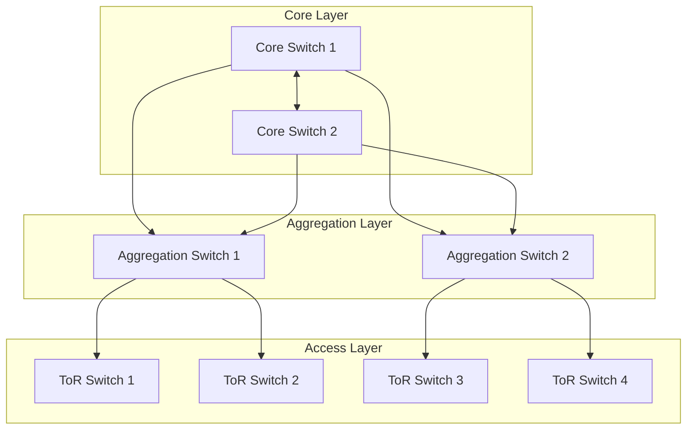
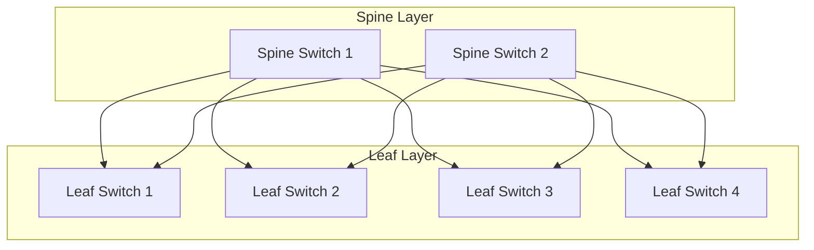
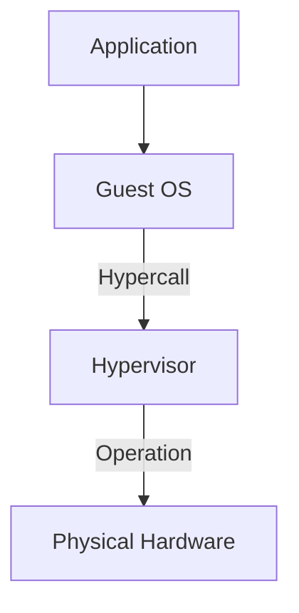
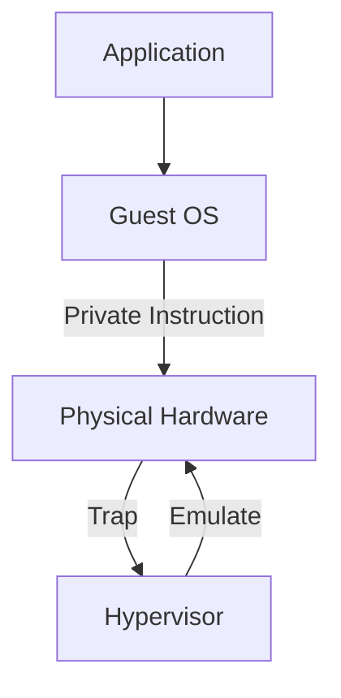
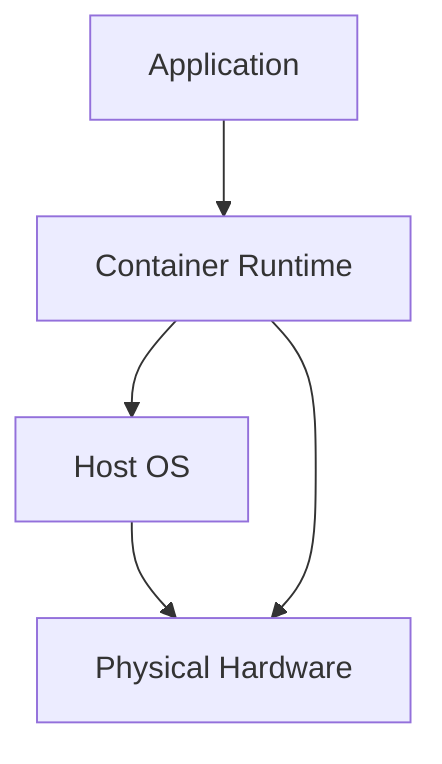

## Data Centers

As internet adoption grew, computing shifted from local machines to centralized data centers, large facilities housing thousands of servers and providing computational power and storage for various applications.

Data centers are geographically distributed in areas with favorable cooling and power conditions, reducing user latency and improving fault tolerance.

### Benefits of Centralized Computing

**User Benefits:**

- Ease of management: The user doesn't need to worry about hardware maintenance, backups, software updates, or security patches.
- Ubiquity: Users can access their applications and data from any device with an internet connection, enabling remote work and global collaboration.
- Compute power: Some applications require more computational resources than a typical personal computer can provide. Cloud computing allows users to access powerful servers that can handle intensive workloads, such as data analysis, machine learning, and video rendering.

**Vendor Benefits:**

- Homogeneity: The vendor can optimize their code for a specific hardware configuration, instead of caring about the wide variety of user hardware.
- Change management: The vendor can update the code and deploy it to all users at once, without relying on users to update their local software.

**Infrastructure Benefits:**

- Scalability: Servers can be added or removed based on demand, enabling efficient resource allocation.
- Cost-effectiveness: Providers achieve economies of scale, reducing per-user costs.
- Multi-tenancy: Multiple customers share the same data center, maximizing server utilization instead of remaining idle.

### Warehouse-Scale Computing

**Warehouse-scale computing** (WSC) is a type of data center architecture that treats thousands of interconnected servers as a single unified system.

This enables running large-scale applications (search engines, social media platforms, online gaming services) that require significant computational resources to be efficiently managed and scaled.

Many such providers also offer cloud services, virtualizing their infrastructure for external customers, allowing a traditional data center to be built on top of a warehouse-scale computing infrastructure.

### Geographic Distribution

Global cloud infrastructure is hierarchically organized for redundancy and low latency:

- **Geographical Area (GA)**: Determines data residence requirements.
- **Computing Regions**: At least two per GA, separated by ≥100 miles to avoid common failures (earthquakes, natural disasters). Allows disaster recovery but too distant for synchronous replication.
- **Availability Zones**: Multiple zones (min. 3) within a region, isolated yet close enough for synchronous replication. Provides a finer-grained redundancy level for critical applications enabling faster recovery from failures.
- **Edge Locations**: Smaller data centers closer to users. Used for CDNs and caching to reduce latency and improve content delivery speed.
- **Local Zones**: Metropolitan-area data centers providing ultra-low latency for location-specific applications.

### Physical Architecture

Data center architecture is similar to that of personal computers but at a massive scale.

**Computing Components:**

- **Servers**: Standardized physical machines providing computational power and storage. Functionally equivalent to regular computers.
- **Networking equipment**: Switches, routers, and firewalls connecting servers and providing internet access.
- **Storage systems**: Additional storage capacity for applications and data.

**Support Infrastructure:**

- **Power supply**: Continuous, reliable power delivery. Redundancy includes backup generators and uninterruptible power supplies (UPS) to handle outages.
- **Cooling systems**: Manage server heat through air conditioning, liquid cooling, or hybrid approaches to maintain optimal operating temperatures.
- **Failure recovery**: Ensures system availability via batteries, diesel generators, and other redundancy mechanisms.

#### Server

Servers are fundamental computing units in data centers, designed for performance, reliability, and scalability.

##### Form Factors

Servers are made in different standard form factors such us:

- **Rack-mounted** (most common): Standardized units (1U = 44.45 mm height) fitting into vertical racks. Racks integrate power distribution, cooling, networking, and cable management, enabling high density and efficient operations. Excellent space efficiency but complex cable management at scale.
- **Blade servers**: Vertically oriented, ultra-compact form factor. Highest component density per unit of space but requires specialized cooling due to high power density. These are more expensive than rack-mounted.
- **Tower servers**: Standalone units resembling desktop computers. Low density with simple cooling/maintenance, and lower cost. Rarely used in modern data centers due to poor scalability and space inefficiency.

##### Components

- **Motherboard**: Central circuit board interconnecting all components.
- **CPUs**: 1 to 8 processors per server.
- **RAM**: 2 to 192 DIMM slots for main memory.
- **Storage**: Multiple hard drives or SSDs for persistent data.
- **Specialized Hardware** (optional):
  - **GPUs**: Accelerate parallel compute tasks (machine learning, scientific computing). Communicate via NVLink (high-speed interconnect) to minimize latency bottlenecks.
  - **TPUs**: Tensor Processing Units specialized for neural network training/inference thanks to optimized matrix operations.
  - **FPGAs**: Field-Programmable Gate Arrays. Customizable hardware programmed for specific low-latency, application-specific acceleration (real-time processing, network processing).

All components are standardized for quick replacement and maintenance, with hot-swappable parts to minimize downtime.

#### Storage

WIth time the data have been moved from local towards cloud providers. This is due:

- Ease of management, with automatic backups and data recovery;
- Low price;
- Ease of access everywhere there is an internet connection.

##### File System Abstractions

OS manages data through hierarchical abstractions:

- **Data Blocks**: Smallest units of storage, addressable with **logical block addresses** (LBA).
- **Clusters**: Groups of contiguous blocks, used to reduce overhead compared to block-level management, reducing the number of read/write operations. Inside each cluster there are the actual data and the **Metadata** that consist in the file attributes (name, size, permissions, timestamps) enabling organization and access control.

During data deletion, the cluster is only flagged as deleted, allowing it to be overwritten.

##### Space Allocation

The storage unit is represented as a multiple of the cluster size:

$$\text{Disk Size} = \lceil \frac{\text{File Size}}{\text{Cluster Size}} \rceil \times \text{Cluster Size}$$

when a file is smaller than the cluster size, sime of its space is wasted leading to **internal fragmentation**:

$$\text{Wasted Space} = \text{Disk Size} - \text{File Size}$$
When a file's clusters are non-contiguous (fragmented), read/write operations require multiple seeks, degrading performance. In these cases it's useful to perform **defragmentation** to rearrange sectors into sequential blocks.

##### Hard Disk Drives

**Physical Structure:**

HDDs contain rotating magnetic _platters_ coated with ferromagnetic material. Data is stored as magnetic patterns organized into:

- **Tracks**: Concentric circles on each platter.
- **Sectors**: Divisions of tracks, the smallest atomic read/write unit.

The platters are mounted on a spindle and spin at high speeds (RPM). An actuator arm with a **read/write head** moves across the platters to access data.

The entire assembly is enclosed in a sealed case to protect against dust, scratches, and environmental contaminants, while also providing shock resistance.

###### Access Time Components

During the read/write process, several time components contribute to the total access time:

- **Seek Time**: Time for actuator arm to position head over target track. Heuristic: $T_\text{Seek} \approx \frac{T_\text{max}}{3}$
- **Rotation Delay**: Average time for target sector to rotate under head: $T_\text{Rotation} = \frac{1}{2} \times \frac{60}{\text{RPM}}$
- **Transfer Time**: Duration to read/write data at disk transfer rate, based on the amount of data and the disk's throughput.
- **Controller Overhead**: Command processing and disk preparation time.

The total access time is the sum of these components:
$$T_\text{Access} = T_\text{Seek} + T_\text{Rotation} + T_\text{Transfer} + T_\text{Controller}$$

The **Data locality**, the tendency for related data to be stored close together, can significantly reduce access time by minimizing seek and rotation delays. The locality factor is represented by $\alpha$. The adjusted access time considering locality is:

$$T_\text{Access} = (1-\alpha)(T_\text{Seek} + T_\text{Rotation}) + T_\text{Transfer} + T_\text{Controller}$$

To reduce access time the HDDs include buffer memory that exploits spatial locality by storing neighboring sectors.

Writes target cache first, then flush to platters. This reduces repeated disk access for frequently accessed data.

###### Scheduling

When multiple I/O requests are fired, the disk scheduler determines the order of processing. The goal is to minimize total access time and maximize throughput. This introduces a **Scheduling Delay** as the disk may need to wait for the current request to finish before processing the next one. Common scheduling algorithms include:

- **FCFS (First-Come, First-Served)**: Requests are processed in the order they arrive.
- **SSTF (Shortest Seek Time First)**: The request with the shortest seek time is processed next, might lead to starvation.
- **SCAN**: The read/write head moves in one direction, processing requests as it goes, and then reverses direction.
- **C-SCAN**: The read/write head moves in one direction, processing requests as it goes, and then jumps back to the beginning without reversing direction.
- **C-LOOK**: Similar to C-SCAN, but reverse at the last I/O request in one direction instead of reaching the extreme end of the disk.

##### Solid State Drives

SSDs use flash memory (no mechanical parts), managed by a silicon controller and uses the same form factors as HDDs.

At the beginning of its life, an SSD is faster than an HDD because it has no seek time or rotation delay. However, as the SSD fills up and undergoes more write cycles, its performance can degrade, mainly for writes.

Data is organized into:

- **Cell**: Floating gate transistor storing charge (presence/absence = bit). Oxide layer insulates gate, retaining charge without power.
  - **Cell Density**: SLC (1 bit), MLC (2 bits), TLC (3 bits).
- **Page**: Smallest readable/writable unit.
- **Block**: Smallest erasable unit (contains multiple pages).

Each cell has a limited number of write cycles, leading to wear-out as the oxide layer degrades.

Each page can be in one of three states:

- **Valid**: Contains readable data.
- **Dirty**: Contains obsolete data, eligible for erasure.
- **Empty**: Block erased, ready for writing.

Writes always target empty pages; updates write to new pages and mark old pages dirty. Blocks containing only dirty pages can be erased. This prevents repeated wear on single cells but introduces challenges:

- **Write Amplification**: When a page update it requires copying valid data to a new block and erasing the old block, leading to more writes than the original update, which can degrade performance and reduce SSD lifespan.
- **Garbage Collection**: Identifies dirty-heavy blocks, copies valid data to new blocks, erases old blocks, and marks them empty.

To mitigate wear-out, SSDs implement a technique called **Wear Leveling** that distributes write/erase cycles evenly across cells. Periodically relocates data to ensure $\text{max cycles} - \text{min cycles} < e$ (small threshold).

SSDs uses **Flash Translation Layer (FTL)**, a firmware component that manages the mapping between logical block addresses (LBAs) used by the operating system and the physical addresses of the flash memory. Mapping strategies include:

- **Page-level**: Fine-grained but expensive.
- **Block-level**: Coarser, faster.
- **Hybrid**: Balances cost and performance.

###### Reliability

Unrecoverable Bit Error Ratio (UBER) differs from HDDs: HDD UBER increases linearly with age while SSD UBER change over time, starting low, increasing as the drive wears out, and then rising sharply near the end of its lifespan.

##### Storage Architectures

###### Direct Attached Storage (DAS)

**Direct Attached Storage** is physically connected to a single server (internal or external via SATA, USB).

- **Pros**: High performance, no network latency.
- **Cons**: Limited scalability, no sharing, complex backup/recovery.

###### Network Attached Storage (NAS)

**Network Attached Storage** is storage that is connected to a network and has its own IP address, appearing as a file server. It provides file-level access to data over the network, allowing multiple clients to access and share files simultaneously.

- **Pros**: Easy to scale, centralized backup.
- **Cons**: Network bandwidth bottleneck, higher latency than DAS.

###### Storage Area Network (SAN)

**Storage Area Network** is a network that provides block-level access to data, allowing servers to access storage as if it were directly attached.

#### Networking

The internal network connecting servers and storage within a data center is called **Interconnect**, or data center network (DCN). When scaling a data center the network might become the bottleneck of the system as all the servers need to communicate with each other.

The bandwidth capacity between the two halves of the network is indicated by the **bisection bandwidth**, which is the minimum bandwidth that must be available between two halves of the network to support full communication between them:

$$l \times L \geq C \times \frac{S}{2}$$

where:

- $l$: number of links between the two network halves
- $L$: bandwidth capacity of each link
- $C$: bandwidth required per server
- $S$: total number of servers

The factor $S/2$ represents traffic flowing between halves. Traffic distribution must be balanced across links to prevent congestion.

The traffic within a DCN can be categorized into two types:

- **East-West (EW) traffic**: Data flowing between servers within the data center. Typically dominates; sources include VM migrations, backups, replication, and distributed computation (e.g., MapReduce, ML training).
- **North-South (NS) traffic**: Data flowing between data center servers and external networks. Typically lighter than east-west.

The network topology can be divided into three categories:

##### Switch-centric

**Switch-centric** architecture relies on switches to handle routing and forwarding. Switches manage the majority of the traffic, while servers focus on computation.

###### Three-Tier Architecture

The traditional approach uses a hierarchical topology with three layers:

- **Core layer** (top): High-speed switches providing backbone connectivity between aggregation layers.
- **Aggregation layer** (middle): Switches aggregating traffic from multiple racks, typically serving one row of racks (End-of-Row - EOR).
- **Access layer** (bottom): Top-of-Rack (ToR) switches directly connecting servers within a rack.



To ensure high availability and fault tolerance, all the layers should have redundant connections, between upper layers and between the same layer.

Based on the bandwidth ratios between layers, the network can be classified as:

- **Oversubscribed**: Bandwidth (core-to-aggregation) $<$ bandwidth (aggregation-to-access). Cheaper but can cause congestion.
- **Non-oversubscribed**: Bandwidth (core-to-aggregation) $\geq$ bandwidth (aggregation-to-access). Prevents congestion but requires higher-capacity core switches.

###### Leaf-Spine Architecture

A modern flat, two-layer topology:

- **Leaf layer** (bottom): Switches directly connecting servers and storage.
- **Spine layer** (top): High-speed backbone switches providing leaf-to-leaf connectivity.



If each leaf switch connects to every spine switch, the topology is called **Clos Topology** (Multi-stage Clos). This fully-interconnected leaf-spine variant enables any server to reach any other via a single hop. With $k$ spine switches and $n$ leaf switches:

- $k \gte n$: Traffic can be rearranged to guarantee a non-blocking path between any two leaves, providing non-blocking bisection bandwidth.
- $k \gte 2n - 1$: there is always a non-blocking path between any two leaves, regardless of traffic patterns.

This architecture uses homogeneous switches that are cheaper and easier to manage than hierarchical tiers. It also allows for scalability by adding leaf switches without architectural changes.

In the Clos topology, the connection is uni-directional, in case of a bi-directional connection is called  **Folded Clos**.

It is possible to extend this architecture by grouping spine-leaf switches into pods and add a higher-level spine layer to connect the pods together, creating a **Fat Tree** topology.

##### Server-centric

A **Server-centric** architecture is a network design where servers themselves perform routing using their network interfaces (NICs) for switching operations. Servers handle both computation and networking tasks.

This increases the amount of hops between servers but allows more flexible and scalable network design, since servers can be added or removed without affecting overall network topology.

##### Hybrid

A **Hybrid** architecture combines elements of both switch-centric and server-centric designs. Some routing is performed by dedicated switches (especially for core/aggregation layers), while servers perform low-level routing. This approach enables trade-offs between network simplicity and flexibility.

##### Scale-Up Network (HPC Networks)

Designed for high-performance computing (HPC) workloads such as large-scale ML training. Resources are organized into **Pods** (groups of GPUs/accelerators) and the two type of communication is performed:

- **Scale-Up network** (intra-pod): Ultra-low-latency, high-bandwidth interconnect linking accelerators within a pod (e.g., NVLink, InfiniBand). Critical for collective operations.
- **Scale-Out network** (inter-pod): Connects pods together; higher latency than scale-up. Used for cross-pod data transfers.

### Building

Data centers allocate approximately 40% of space to IT equipment, the remainder supports cooling, power distribution, and failure recovery.

#### Cooling Systems

IT equipment generates significant heat, which must be dissipated to maintain optimal operating temperatures and prevent hardware damage. There are two main cooling approaches:

- **Open-Loop**: Use passive cooling with ambient air; requires filtering for dust and humidity. Low operational cost but geography-dependent.
- **Closed-Loop**: Use active cooling systems. Higher operational cost but consistent performance regardless of location.

Data centers uses **cold aisle/warm aisle** configuration to maximize the air cooling efficiency:

- **Cold aisle**: Center floor supplies cold air; flows through server intake ports.
- **Warm aisle**: Rear of servers; hot exhaust air expelled upward.
- **Containment**: Roof caps on racks prevent cold air bypass, forcing air through servers and maximizing cooling efficiency.

The closed-loop approach includes:

- **In-Rack Coolers**: Mounted directly in racks to cool high-density server zones.
- **In-Row Coolers**: Positioned between racks, extracting hot air from warm aisles and returning cooled air to cold aisles.

Cooler system can include **liquid cooling** for high-power devices (GPUs, TPUs), offering superior thermal efficiency.

#### Power Usage

Data centers consume massive amounts of electricity, and only ~45% powers IT equipment. The remainder supports cooling, power conversion, and distribution overhead.

**Power Usage Effectiveness (PUE):** Metric measuring overall facility efficiency, lower is better:
$$\text{PUE} = \frac{\text{Total Facility Power}}{\text{IT Equipment Power}} \geq 1$$

**Data Center Infrastructure Efficiency (DCIE):** The inverse metric:
$$\text{DCIE} = \frac{\text{IT Equipment Power}}{\text{Total Facility Power}} \leq 1$$

In case of power failure, data centers must ensure continuous operation and graceful shutdown to prevent data loss and hardware damage. This is achieved through:

- **Uninterruptible Power Supplies (UPS)**: Battery systems providing short-term energy during power loss.
- **Diesel Generators**: Automatically start when utility power fails. Typical startup delay (~1 minute) requires batteries to bridge the gap until generators are online.
- **Voltage Regulation**: Stabilizes voltage and filters transient spikes to protect sensitive equipment.

#### Data Center Availability

The availability of a data center is divided into four tiers:

- **Tier 1**: Single non-redundant distribution path serving IT equipment. No redundant components. Expected availability: 99.671% (28.8 hours of downtime per year).
- **Tier 2**: Redundant distribution paths serving IT equipment. Expected availability: 99.741% (22 hours of downtime per year).
- **Tier 3**: Multiple independent distribution paths serving IT equipment, components must be dual powered. Expected availability: 99.982% (1.6 hours of downtime per year).
- **Tier 4**: All cooling components are dual powered. Expected availability: 99.995% (26.3 minutes of downtime per year).

## RAID

RAID (Redundant Array of Independent Disks) is a data storage technology that combines multiple physical disk drives into a single logical unit to improve performance, increase storage capacity, and enhance reliability through redundancy.

This is done in a transparent way to the user, who sees a single logical disk, while the data is distributed across multiple physical disks.

This is done by **striping** data across multiple disks. As there are multiple disks, the read/write operations can be performed in parallel, improving performance.

Striping is performed by dividing data into strip units (dimension of the block) that are written into the stripe width (number of disks) in a round-robin fashion.

Bigger chunks reduces the seek time, but smaller chunks allows for more parallelism.

Increasing the number of disks increases the probability of failure, needs to use redundancy to ensure data integrity and availability.

It is possible to perform data reconstruction using the redundant information, but this process is time-consuming. Thanks to the parity information, it is possible to reconstruct the data of a failed disk by using the data from the remaining disks and the parity information.

RAID usually include a hot spare disk, which is a standby disk that can automatically replace a failed disk without manual intervention. When a disk fails, the RAID controller detects the failure and initiates the reconstruction process using the hot spare, minimizing downtime and ensuring data availability.

There are multiple RAID levels, each with different trade-offs between performance, redundancy, and storage efficiency:

### RAID 0

In RAID 0, data is striped across multiple disks without any redundancy. This provides improved performance and capacity but no fault tolerance. If any disk fails, all data in the array is lost.

| Disk 0  | Disk 1  | Disk 2   | Disk 3   |
| ------- | ------- | -------- | -------- |
| Block 0 | Block 1 | Block 2  | Block 3  |
| Block 4 | Block 5 | Block 6  | Block 7  |
| Block 8 | Block 9 | Block 10 | Block 11 |

- **Capacity**: $n$ times the capacity of a single disk.
- **Reliability**: $\text{MTTF}_T = \frac{\text{MTTF}}{n}$ (decreases with more disks).

### RAID 1

RAID 1 uses mirroring, where data is duplicated across two or more disks. This provides high reliability, as the system can continue to operate even if one disk fails. However, it has a storage efficiency of at most 50% since each piece of data is stored on multiple disks.

The read performance can be improved as the system can read from multiple disks in parallel.

No error correction is computed, so the write performance is similar to a single disk.

| Disk 0  | Disk 1  |
| ------- | ------- |
| Block 0 | Block 0 |
| Block 1 | Block 1 |
| Block 2 | Block 2 |

- **Capacity**: $1$ times the capacity of a single disk (since data is mirrored).
- **Reliability**: $\text{MTTF}_T = \frac{\text{MTTF}^n * \prod_{i=1}^{n-2} 2^{i}}{n! \text{MTTR}^{n-1}}$

### RAID 01

In RAID 0+1, data is first mirrored across multiple disks (RAID 1) and then stripped (RAID 0).

| Disk 0  | Disk 1  | Disk 2  | Disk 3  |
| ------- | ------- | ------- | ------- |
| Block 0 | Block 1 | Block 0 | Block 1 |
| Block 2 | Block 3 | Block 2 | Block 3 |
| Block 4 | Block 5 | Block 4 | Block 5 |

- **Capacity**: $\frac{n}{2}$.
- **Reliability**: $\text{MTTF}_T = \frac{\text{MTTF}^2}{n * \text{MTTR} * G}$, where $G$ is the number of disks in the mirrored pair ($G = n/2$).

### RAID 10

In RAID 1+0, data is first stripped (RAID 0) and then mirrored (RAID 0).

| Disk 0  | Disk 1  | Disk 2  | Disk 3  |
| ------- | ------- | ------- | ------- |
| Block 0 | Block 0 | Block 1 | Block 1 |
| Block 2 | Block 2 | Block 3 | Block 3 |
| Block 4 | Block 4 | Block 5 | Block 5 |

- **Capacity**: $\frac{n}{2}$.
- **Reliability**: $\text{MTTF}_T = \frac{\text{MTTF}^2}{n * \text{MTTR}}$.

RAID 1+0 can tolerate multiple disk failures as long as they are not in the same mirrored pair, as losing a disk in RAID 0+1 would result in the loss of the entire array.

### RAID 4

RAID 4 uses a dedicated parity disk to store parity information for error correction. Data is striped across multiple disks, and in the parity disk is stored the parity information computed as the XOR of the data blocks. This allows for data recovery in case of a single disk failure, but the dedicated parity disk can become a bottleneck for write operations.

Each update requires updating the parity information, which can lead to performance degradation, especially for write-intensive workloads.

| Disk 0  | Disk 1  | Disk 2  | Parity Disk       |
| ------- | ------- | ------- | ----------------- |
| Block 0 | Block 1 | Block 2 | P0 = B0 ⊕ B1 ⊕ B2 |
| Block 3 | Block 4 | Block 5 | P1 = B3 ⊕ B4 ⊕ B5 |
| Block 6 | Block 7 | Block 8 | P2 = B6 ⊕ B7 ⊕ B8 |

The update can be performed in two ways:

- Additive: compute the new parity by XORing all the data blocks, including the new data block.
- Subtractive: compute the new parity by XORing the old data block, the new data block, and the old parity block.

- **Capacity**: $n-1$.
- **Reliability**: $\text{MTTF}_T = \frac{\text{MTTF}^2}{n * (n-1) * \text{MTTR}}$.

### RAID 5

RAID 5 is similar to RAID 4 but distributes the parity information across all disks instead of using a dedicated parity disk. This improves write performance by eliminating the bottleneck of a single parity disk, while still providing fault tolerance for a single disk failure.

| Disk 0              | Disk 1            | Disk 2            | Disk 3            |
| ------------------- | ----------------- | ----------------- | ----------------- |
| Block 0             | Block 1           | Block 2           | P0 = B0 ⊕ B1 ⊕ B2 |
| Block 3             | Block 4           | P1 = B3 ⊕ B4 ⊕ B5 | Block 5           |
| Block 6             | P2 = B6 ⊕ B7 ⊕ B8 | Block 8           | Block 9           |
| P3 = B9 ⊕ B10 ⊕ B11 | Block 10          | Block 11          | Block 12          |

- **Capacity**: $n-1$.
- **Reliability**: $\text{MTTF}_T = \frac{\text{MTTF}^2}{n * (n-1) * \text{MTTR}}$.

### RAID 6

RAID 6 extends RAID 5 by adding an additional parity block, allowing for fault tolerance against two simultaneous disk failures. This is achieved by using two different parity calculations, such as XOR and Reed-Solomon codes, to provide redundancy.

This increases the storage overhead and can further degrade write performance due to the additional parity calculations.

| Disk 0              | Disk 1                | Disk 2              | Disk 3              | Disk 4              |
| ------------------- | --------------------- | ------------------- | ------------------- | ------------------- |
| Block 0             | Block 1               | Block 2             | P0 = B0 ⊕ B1 ⊕ B2   | Q0 = RS(B0, B1, B2) |
| Block 3             | Block 4               | P1 = B3 ⊕ B4 ⊕ B5   | Q1 = RS(B3, B4, B5) | Block 5             |
| Block 6             | P2 = B6 ⊕ B7 ⊕ B8     | Q2 = RS(B6, B7, B8) | Block 8             | Block 9             |
| P3 = B9 ⊕ B10 ⊕ B11 | Q3 = RS(B9, B10, B11) | Block 11            | Block 12            | Block 13            |

- **Capacity**: $n-2$.
- **Reliability**: $\text{MTTF}_T = \frac{2 * \text{MTTF}^3}{n * (n-1) * {n-2} * \text{MTTR}^2}$.

## Virtualization

In virtualization, the physical resources of a computer are abstracted and shared among multiple virtual machines (VMs) that run on top of a hypervisor or virtual machine monitor (VMM). Each VM operates as if it has its own dedicated virtual hardware, allowing for isolation and flexibility in resource allocation,  providing the following characteristics:

- **Identical Behavior**: Appears identical to the physical machine for application execution.
- **Different Resources**: Can expose virtual resource quantities different from the physical machine (e.g., fewer CPU cores, different memory size).
- **Different Performance**: May exhibit different performance characteristics than the physical machine due to virtualization overhead.

> A program works thanks to different levels of abstraction, each providing a different view of the underlying hardware.
>
> - **Problem-oriented language level**: High-level programming languages.
> - **Assembly language level**: Low-level symbolic instruction representation.
> - **Operating system level**: ABI (Application Binary Interface) defines the interface between applications and the OS, including system calls, libraries, and services.
>   - **User instructions**: Executed directly by the application.
>   - **Privileged instructions**: Executed by the OS kernel only.
> - **Instruction Set Architecture (ISA) level**: The machine instruction set visible to software.
> - **Microarchitecture level**: Internal CPU design (caches, pipelines, functional units).
> - **Digital logic level**: Hardware gates and circuits.

Virtualization can be implemented at various levels of the software stack:

- **System Virtual Machine**: Virtualizes the entire physical machine from the ISA level down to the digital logic level. Runs independently of the host OS, sitting between hardware and guest OS/applications.

  ```mermaid
  graph TD
      App[Application] --> GuestOS[Guest OS]
      GuestOS --> Virtual[Virtualization Software]
      App --> Virtual
      Virtual --> Hardware[Physical Hardware]
  ```

- **Process Virtual Machine**: Virtualizes the execution environment for a single process, providing an abstraction of both the OS and hardware. Allows processes to run on any platform without modification (e.g., JVM, .NET Runtime).

  ```mermaid
  graph TD
      App[Application] --> Virtual[Virtualization Software]
      Virtual --> HostOS[Host OS]
      HostOS --> Hardware[Physical Hardware]
      Virtual --> Hardware
  ```

When the virtual machine's ABI/ISA differs from the physical machine's ISA, **emulation** is necessary to translate instructions from one architecture to another. This translation introduces performance overhead but enables running software compiled for different architectures.

The benefits of virtualization include:

- **Partitioning**: Multiple operating systems can run simultaneously on the same physical machine; hardware resources are divided and allocated independently.
- **Isolation**: Faults or failures in one VM are confined to that VM, preventing cascading failures. Security is enhanced since VMs are isolated from each other and the host. Resource usage is controlled per VM.
- **Encapsulation**: VMs can be saved as files, copied, moved between servers, or restored from backup without modifying the application.
- **Hardware Independence**: Applications run in VMs can be migrated across different physical hardware without modification, enabling flexible resource management and high availability.

### Virtual Machine Managers

**Hypervisor** (or **Virtual Machine Monitor** - VMM) is the software layer that enables virtualization, handling tasks such as resource allocation, scheduling, hibernation, creation, and lifecycle management. It provides an abstraction layer between the physical hardware and the virtual machines. It can be classified into two types:

- **Type 1 (Bare-Metal Hypervisor)**: Runs directly on hardware without a host OS. The hypervisor acts as an optimized OS for virtualization, managing hardware resources and VMs directly. IO services and drivers can be handled via:
  - **Monolithic approach** (obsolete): Drivers embedded directly in the hypervisor.
  - **Microkernel approach**: Decouple hardware interaction to a privileged service VM, allowing drivers to be easily updated or swapped.

- **Type 2 (Hosted Hypervisor)**: Built on top of a host OS, relying on host OS services (networking, storage, scheduling). The hypervisor is smaller since the OS handles many operations.

### Virtualization Techniques

#### Paravirtualization

**Paravirtualization** reduces guest OS overhead by avoiding direct hardware interaction. Instead, the guest OS calls hypervisor functionalities via **hypercalls**. This approach requires modifying the guest OS to be _aware_ of virtualization, but it improves performance by reducing the number of VM traps and hypervisor interventions compared to full virtualization.



#### Full Virtualization

Full virtualization allows unmodified guest operating systems to run on the hypervisor. The hypervisor uses a **trapping mechanism**:

1. Guest OS executes an instruction intended for hardware.
2. Hardware detects the instruction requires virtualization and traps to the hypervisor.
3. Hypervisor intercepts the trap and emulates the instruction's effect.
4. Control returns to the guest OS.

This approach is transparent to the guest OS but introduces more hypervisor overhead than paravirtualization due to frequent trapping and emulation.



### Containers

**Containers** are a lightweight form of virtualization that provides a pre-configured environment for applications, including code, dependencies, libraries, and configurations. Containers share the host OS kernel but run in isolated user spaces, allowing for efficient resource utilization and fast startup times.

The main advantages of containers include:

- **Scalability**: Easy to scale horizontally by launching multiple container instances. Simple to stack multiple containers and deploy in orchestrated clusters.
- **Portability**: Containers run identically across different hardware platforms and cloud environments.



## Dependability

Systems fail due to: defects, degradation, radiation, design errors, bugs, attacks, and human errors. This leads to economic losses, information loss, physical harm, and reputation damage.

Dependability is a measure of trust toward a system. It comprises five key attributes:

- **Reliability**: Ability of a system to perform its intended functions under specified conditions for a defined period of time.
- **Availability**: The degree to which a system is operational and accessible when required for use. Formula: $A = \frac{\text{Uptime}}{\text{Uptime} + \text{Downtime}}$
- **Maintainability**: The ease with which a system can be repaired, modified, and restored to working condition.
- **Safety**: Absence of catastrophic consequences to users or the environment.
- **Security**: Protection of a system from unauthorized access and interference, maintaining confidentiality, integrity, non-repudiation, and survivability.

### Fault-Error-Failure Chain

A **fault** is a defect or anomaly in a system.

When a fault is activated, it becomes an **error**, a deviation from correct operation.

If an error is not detected and corrected, it propagates and ultimately causes a **failure**, meaning that the system ceases to perform its intended function.

### Dependability Approaches

Two primary techniques address dependability:

- **Fault Avoidance**: Preventing faults from occurring through rigorous testing, validation, formal verification, and use of fault-tolerant components.
- **Fault Tolerance**: Building systems that continue operating correctly despite faults through error detection, monitoring, self-recovery mechanisms, redundancy, and graceful degradation.

This is a tradeoff between cost (hardware, performance, and development), performance, and dependability. Design decisions depend on: technologies, requirements, context, and environment.

### Reliability Metrics

Reliability follows an exponential failure model:
$$R(t) = e^{-\lambda t}$$

where:

- $t$ is the time period of interest
- $\lambda$ (lambda) is the constant failure rate (failures per unit time)
- $R(t)$ is the probability that the system operates without failure during time $t$

**Mean Time To Failure** (MTTF): expected time until first failure:
$$\text{MTTF} = \int_0^\infty R(t) \, dt = \frac{1}{\lambda}$$

**Mean Time To Repair** (MTTR): expected time to detect, repair, and recover:
$$\text{MTTR} = t_{\text{detect}} + t_{\text{repair}} + t_{\text{recover}}$$

**Mean Time Between Failures** (MTBF): expected time between consecutive failures in repairable systems:
$$\text{MTBF} = \text{MTTF} + \text{MTTR}$$

**Availability** formula:
$$A = \frac{\text{MTTF}}{\text{MTTF} + \text{MTTR}} = \frac{\text{uptime}}{\text{uptime} + \text{downtime}}$$

**Failures In Time** (FIT): number of failures per billion device-hours:
$$\text{FIT} = \frac{10^9}{\text{MTBF}}$$

### Component Lifecycle

A component experiences three phases during its operational lifetime:

- **Infant Mortality**: Early phase with high failure rates; failures occur due to manufacturing defects and design issues.
- **Useful Life**: This is the primary operating window where the failure rate is relatively low and stable.
- **Worn-out**: Late phase with increasing failure rate where the component deteriorates due to age and use. Maintenance and eventual replacement become necessary.

System updates and new deployments risk introducing failures into production. Some common strategies mitigate this risk:

- **Staged Rollout**: Deploy changes gradually to an increasing fraction of users or systems detecting issues early before full deployment.
- **Canary Deployment**: Deploy to a small, representative subset (canaries) to validate behavior in production before rolling out to all systems.
- **Automatic Rollback**: Monitor deployed changes and automatically revert to a previous stable version if failures or anomalies are detected.

### Reliability Block Diagram

The system structure is represented as a block diagram where each component is a block and links show dependencies.

A system functions if there exists at least one operational path from start to end.

Connections represent two reliability configurations:

- **Series Configuration** (both components required): The system fails if any single component fails. Overall reliability decreases with each additional series component.
  $$R_s(t) = \prod_{i=1}^{n} R_i(t) = e^{-t\sum_{i=1}^{n}\lambda_i}$$

- **Parallel Configuration** (at least one component required): The system continues if any single component survives. Overall reliability increases with redundancy.
  $$R_p(t) = 1 - \prod_{i=1}^{n}(1 - R_i(t))$$

**Standby Redundancy**: A redundant component remains idle until the primary component fails, then automatically activates. This approach approximately doubles the MTTF compared to a single component.

#### r-out-of-n Redundancy

A system that requires $r$ out of $n$ components to function correctly for the system to operate.

The system reliability for r-out-of-n redundancy (assuming identical components, each with reliability $R$):

$$R_{\text{voting}} = \sum_{i=r}^{n} \binom{n}{i} R^i(1-R)^{n-i}$$

This formula sums the probability that at least $r$ components are operational.

When the majority of components must be operational, the reliability of a single component could be higher than the reliability of the entire system, especially when the failure rate $\lambda$ is high.
