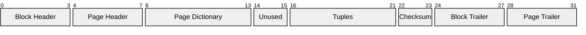
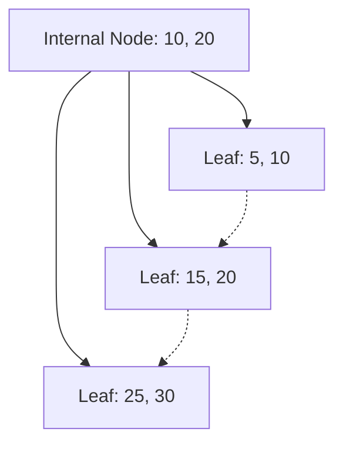

## Transaction

A transaction is an atomic unit of work made by an application.

A transaction starts with a `begin-transaction` and ends with an _end-transaction_ statement like:

- `commit-work`: commit the changes made into the bd, making them permanent;
- `rollback-work`: abort all the changes made by the transaction, discarding them.

### ACID

Transactions supports these properties:

- **Atomicity** (all-or-nothing): a transaction is treated like a _single indivisible operation_. If there is a rollback or a fail all the changes are discarded;
- **Consistency**: A transaction ensures that the database moves from one valid state to another. It maintains the database's integrity by following all defined constraints and rules;
- **Isolation**: concurrent transaction should not interfere with each other;
- **Durability**: once a transaction is committed its changes are permanent and survive any system failure.

## Concurrency

While executing transactions **serially** (one after the other) guarantees correctness, it severely impacts performance and system efficiency. To maximize resource utilization, a DBMS uses **concurrency control** to allow the operations of multiple transactions to be **interleaved** (run in parallel).

An interleaved execution sequence is called a **schedule**.

### Concurrency Issues

If operations are interleaved poorly, it can lead to anomalies (or consistency violations). The primary anomalies are:

#### Lost Update

This anomaly occurs when two transactions read the same value, and a transaction's update is overwritten by another concurrent transaction, effectively losing the first update.

> 1. $r_1(x)$: $T_1$ reads x
> 2. $r_2(x)$: $T_2$ reads x
> 3. $w_1(x)$: $T_1$ writes x += 10
> 4. $w_2(x)$: $T_2$ writes x += 5

#### Dirty Read

This anomaly occurs when a transaction $T_2$ reads a value updated by another transaction $T_1$ that has not yet been committed. If $T_1$ later aborts, $T_2$ will have read a value that was never actually committed to the database.

> 1. $w_1(x)$: $T_1$ writes x (uncommitted)
> 2. $r_2(x)$: $T_2$ reads the uncommitted x
> 3. $\text{abort}_1$: $T_1$ aborts
> 4. $w_2(x)$: $T_2$ writes x (based on dirty read)

#### Non Repeatable Read

This anomaly occurs when a transaction $T_1$ reads the same value multiple times and get a different result because another transaction $T_2$ has modified and committed the value between the reads.

> 1. $r_1(x)$: $T_1$ reads x
> 2. $w_2(x)$: $T_2$ update x and commits
> 3. $r_1(x)$: $T_1$ reads x again and gets a different value

#### Phantom Update

This anomaly occurs when a transaction $T_1$ reads a set of records that satisfy a certain constraint, then another transaction $T_2$ modifies the database in such a way that still satisfies the constraint. If $T_1$ reads the records again, it will violate the constraint.

> Constraint: x + y = 10
>
> 1. $r_1(x)$: $T_1$ reads x
> 2. $w_2(y+5)$ & $w_2(x-5)$: $T_2$ updates the x and y values without violating the constraint
> 3. $r_1(y)$: $T_1$ reads y again and the constraint is violated (the x value is before the update)

#### Phantom Insert

This anomaly occurs when a transaction $T_1$ reads a set of records that satisfy a certain condition, then another transaction $T_2$ inserts new records that satisfy the condition. If $T_1$ reads the records again, it will get a different result.

> 1. $r_1(\sigma_{x>5}(R))$: $T_1$ reads the set of records where x > 5
> 2. $w_2(\text{insert }(x=6))$: $T_2$ inserts a new record with x = 6
> 3. $r_1(\sigma_{x>5}(R))$: $T_1$ reads the set of records again and gets a different result

### Scheduling

The DBMS should be able to to **schedule** the operations of the transactions in a way that preserves the order of operations inside each transaction.

The operations performed by a transaction $T_n$ on a data item $x$ are:

- Read: $r_n(x)$
- Write: $w_n(x)$

The transactions can be scheduled in three ways:

- **Serial**: all the operations of a transaction are executed before the operations of another transaction begin. It guarantees correctness but is inefficient as it doesn't exploit parallelism.
- **Interleaved**: the operations of multiple transactions are mixed together, but the order of operations within each transaction is preserved. This can lead to anomalies if not managed properly.

Assuming we have n transactions $T_1, T_2, \ldots, T_n$ where each transaction $T_i$ has $k_i$ operations, the number of distinct schedules (that respect the sequence of the operations) is:

$$N_D = \dfrac{(\sum_{i=1}^n{k_i})!}{\prod_{i=1}^n{k_i!}}$$

Within this only a fraction is serial:

$$N_S = n!$$

#### Serializable Schedule

From all the possible schedule there are schedules that might encounter an issue due to the concurrency.

We need to identify the **serializable schedules** that are the one that leave the database in the same state as _some_ serial schedule transaction.

> Some assumptions are:
>
> - the transaction doesn't abort.
> - the observation is a-posteriori

#### View-Serializable Schedules (VSR)

Two transactions are **view-equivalents** if they have the same:

1. operations:
2. reads operations (read the same data);
3. final writes operations from the same transactions and the same data.

A schedule is **view-serializable** if it's view-equivalents to a serial schedule and by being equivalent to a serial schedule there are no concurrency issue (within the assumptions).

One way to find a serial schedule would be to enumerate all the possible serial schedule (factorial), making it computational intensive and not functional.

To find a solution in a polynomial time we need to add some restriction to find a computable solution.

#### Conflict Serializable Schedules (CSR)

A conflict occurs if two different transactions perform operations on the same data and at least one of the operations is a write.

- Read-Write conflict (R-W, W-R): This leads to _dirty read_ and _non-repeatable read_ anomalies.
- Write-Write conflict (W-W): This leads to _lost update_ anomalies.

Two schedules are **conflict-equivalent** (CSR) if all the conflicting pairs occurs in the same order. A schedule is **conflict-serializable** if it is conflict-equivalent to a serial schedule.

CSR is a subset of VSR ($CSR \subseteq VSR$).

Testing if a schedule is conflict-serializable is done by checking if a _conflict-graph_ is acyclic.

1. Given a schedule group the operation by the resource used.
2. Than create an arch between the transactions if there is a conflict

Topologically sorting the graph allows to find the equivalent serial schedule of the graph.

> Tips:
>
> - Only the last consecutive writing operations is mandatory. The others could be swapped.
> - The graph could be simplified with the _trasitive_ property. (if op1 must be before op2, and op2 must be before op3, op1 is implicitly before op3)

$$\text{Serial} \subseteq \text{CSR} \subseteq \text{VSR} \subseteq \text{All}$$

### Concurrency Control

Since transactions arrive in real-time, the scheduler must dynamically decide the **execution order**, which might not match the **arrival order**.

Concurrency control can be implemented with two techniques:

- Pessimistic: assume conflicts will occur and use locks to prevent access to resources.
- Optimistic: assume conflicts will not occur and use timestamps to decide the order of execution.

#### Pessimistic concurrency control

Pessimistic concurrency control assumes that conflicts will occur and takes steps to prevent them. This is done by using locks to control access to resources.

There are two types of locks:

- Read (Shared - S): Reading is not a real problem so more processes can read at the same time without problems. This uses a counter (semaphore). This will block writing operations.
- Write (Exclusive - X): This blocks read and write as the transaction might abort.

The lock system is implemented with a **Lock Table**, an hash table, where each resource (table, index, row, or column) has a queue of transactions that are holding or waiting for the lock.

##### Two-phase Locking (2PL)

This is not enough to avoid anomalies as after releasing a lock another transaction might access the resource, creating anomalies.

Need to implement the **Two-phase Locking** (2PL) that separate the locking strategy into three phases.

1. _Growing phase_: the transaction acquires locks without releasing any.
2. _Plateau_: the transaction has obtained all the locks it needs and is neither acquiring nor releasing any locks.
3. _Shrinking phase_: the transaction releases locks without obtaining any new ones.

After the last phase the transaction must end with a commit or an abort.

This scheduling strategy generate a new serializable class called **2PL** that is a subset of CSR.

This class avoid anomalies related to synchronization, removing the _a-posteriori_ hypothesis.

$$\text{Serial} \subseteq \text{2PL} \subseteq \text{CSR} \subseteq \text{VSR} \subseteq \text{All}$$

##### Strict Two-phase Locking (Strict 2PL)

To avoid anomalies related to abort (dirty reads) we need to implement the **Strict 2PL** that release the locks only after a end-transaction statement.

This introduce _long duration lock_ that will decrease performance, but remove the _commit-only_ hypothesis.

$$\text{Serial} \subseteq \text{Strict 2PL} \subseteq \text{2PL} \subseteq \text{CSR} \subseteq \text{VSR} \subseteq \text{All}$$

##### Predicate Locking

To avoid _phantom anomalies_, where a range query returns different results when re-executed, the locking must be extended to future data.

This is done by introducing a **predicate lock** that lock an _access path_ defined by the WHERE clause, preventing other transactions from inserting, modifying or deleting data that would satisfy the predicate.

##### SQL

SQL introduce some isolation level for _read_ operations:

- **Read Uncommitted**: doesn't use read lock and ignore locks from other transactions;
- **Read Committed** (default): release read lock after reading, but read other transaction locks;
- **Repeatable Lock**: use long duration lock;
- **Serializable**: use predicate locks.

A greater isolation level reduce the amount of anomalies, but introduce delays and deadlocks/starvation.

To avoid waiting problems you could some kill mechanism:

- Timeout
- Deadlock prevention: heuristics
- Deadlock detection: inspect the wait-for graph

##### Deadlock Detection

To detect deacklock in a single machine you can look at the wait-graph, where each transaction is a node and there is an arch from $T_i$ to $T_j$ if $T_i$ is waiting for a resource held by $T_j$.

In a distributed system you need to use a distributed deadlock detection algorithm like the **Obermarck Algorithm**. This algorithm is based on the idea of communicating dependencies between nodes. After some iteration a node can spot a cycle in the dependencies graph, indicating a deadlock.

A dependency is communicated if:

- The transaction wait for an external node;
- The information is transmitted to the successive (or previous) node iff the transaction has an index grater (or smaller, based on convention) of the waiting one (avoiding redundancy between the two);

> Node A: $N_B \rightarrow T_2 \rightarrow T_3 \rightarrow T_1 \rightarrow N_B$
>
> Node B: $N_A \rightarrow T_1 \rightarrow T_4 \rightarrow T_2 \rightarrow N_A$
>
> Node A send to Node B: $T_2 \rightarrow T_1$ (sends only distributed dependencies)
>
> Node B now can reconstruct the cycle $T_1 \rightarrow T_2 \rightarrow T_1$

The amount of conflict is $O(\frac{1}{n})$ and the probability of a deadlock is $O(\frac{1}{n^2})$, where n is the amount of records in a file. Longer transaction have am higher probability of conflict.

To avoid deadlock:

- **Update Lock**: Instead of requesting a read lock and than a read lock, you directly request an _update lock_, avoiding access in case of double update lock. This method is related to time related;
- **Hierarchical Locking**: This method is related to the locking granularity(schema, table, fragment, page, tuple, field)
  - _ISL_: lock a subelement in shared mode;
  - _IXL_: lock a subelement in exclusive mode;
  - _SIXL_: lock the element in shared mode with the intention to lock subelements in exclusive mode;

| Request | Free | ISL | IXL | SL | SIXL | XL |
| ------- | ---- | --- | --- | -- | ---- | -- |
| **ISL** | Y | Y | Y | Y | Y | N |
| **IXL** | Y | Y | Y | N | N | N |
| **SL** | Y | Y | N | Y | N | N |
| **SIXL** | Y | Y | N | N | N | N |
| **XL** | Y | N | N | N | N | N |

### Optimistic concurrency control

Another way to manage concurrency is to use an **optimistic** approach that assumes that conflicts are rare and allows transactions to execute without acquiring locks. This is done by assigning timestamps to transactions and using these timestamps to determine the order of execution.

In a distributed system there is no global time, so each transaction is assigned a timestamp (TS) when it starts, formed from the id of the event and the id of the machine (_event-id.machine-id_).

The decisions are made based on the age of a transaction.

The system track the  Read Timestamp (RTM) and the Write Timestamp (WTM) for each piece of data.

- A read operation can happen only if the WTM of the data is older than the TS of the transaction ($TS \ge WTM$), otherwise the transaction is killed;
- A write operation can happen only if both the WTM and RTM are older than the TS of the transaction ($TS \ge WTM$ and $TS \ge RTM$), otherwise the transaction is killed.

After get killed the transaction restart.

TS class is a subset of CSR, but it will discard serializable transactions.

The basic TS consider only committed transactions. To fix this the transaction should wait for the commit of the transaction that wrote the data.

$$(\text{Serial} \subseteq \text{Strict 2PL}) \nsubseteq \text{TS}_\text{mono} \subseteq \text{CSR} \subseteq \text{VSR} \subseteq \text{All}$$

#### Thomas Write Rule

To reduce the amount of kills it's possible to use the _Thomas Write Rule_ that:

- If $TS < RTM$: kill the transaction;
- If $TS < WTM$: skip the write operation;
- Else: perform the write operation.

With this rule the TS class is no more a subset of CSR nor VSR (as $w_2(x), w_1(x)$ has different final writes, as $w_1(x)$ is skipped).

$$\text{TS}_\text{mono} \subseteq \text{TS}_\text{Thomas} \nsubseteq \text{VSR}$$

#### Multiversion Concurrency Control (MVCC)

MVCC allows multiple versions of a data item to exist, enabling readers to access the last committed version without being blocked by writers. Each transaction sees a consistent snapshot of the database at a specific point in time.

In MVCC, when a transaction wants to update a data item, it creates a new version rather than overwriting the existing one. This way, readers can continue to access the old version while the writer works on the new one.

In a theoretical approach, a write operation is killed if $TS < RTM$, and if $TS < WTM$, the branches are shifted to write old data. This allows unordered writes.

In a practical approach, the write operation are killed if $TS < WTM$, to avoid a shift operation.

$$\text{TS}_\text{mono} \subseteq \text{TS}_\text{multi} \nsubseteq \text{VSR}$$

#### Snapshot Isolation

**Snapshot Isolation** is another isolation level of the DBMS.

This level only use the write timestamp and every transaction read a version consistent with its timestamp.

## Triggers

Triggers uses the _Event-Condition-Action_ (ECA), an action A is fired if a condition C is true of an event E:

- Event: fired on upon a change in the db (insert, delete, update)
- Condition: a predicate that identify when an operation should be triggered
- Action: notification or perform db change

A **rule engine** is responsible to monitor the events and execute the action when the condition is true.

```SQL
CREATE TRIGGER trigger_name
{BEFORE | AFTER} 
{INSERT | UPDATE [of column_name] | DELETE} on table_name
[REFERENCING {OLD | NEW} [TABLE] [AS] reference_name]
[FOR EACH | FOR EACH {ROW | STATEMENT}]
[WHEN (condition)]
BEGIN
    SQL_statements;
END;
```

### Trigger Execution Mode

Triggers can execute either **before** or **after** the triggering event:

- **Before**: Executed prior to the event, often used for validation, data modification, or preventing invalid operations.
- **After**: Executed following the event, typically for maintaining integrity constraints, logging, or cascading updates.

### Trigger Granularity

Triggers can be defined at different levels of granularity:

- **Row-Level**: Fires once for each affected row in a bulk operation (e.g., INSERT, UPDATE, or DELETE on multiple rows).
- **Statement-Level**: Fires only once per triggering statement, regardless of the number of affected rows.

### Trigger Transition Variables

Triggers provide access to **transition variables** that represent the state of data before and after the event:

- **OLD**: Contains the values before the change (available for UPDATE and DELETE).
- **NEW**: Contains the values after the change (available for UPDATE and INSERT).

For row-level triggers, these variables refer to the specific row being processed. For statement-level triggers, they represent the entire set of affected rows as tables.

### Trigger Lifecycle

Triggers follow a specific execution order to ensure proper sequencing:

1. BEFORE statement trigger
2. BEFORE row trigger
3. Execute the original event and apply constraints.
4. AFTER row trigger
5. AFTER statement trigger

Note: Actions within triggers may trigger additional events, potentially causing cascading effects. Some DBMS restrict modifications to the same table being monitored to prevent infinite loops or inconsistencies.

### Conditional Evaluation

A trigger can include a **WHEN** clause to specify a condition that must be met for the trigger to execute. This allows for more granular control over when the trigger's action is performed.

## Physical Database

Each query goes through multiple components before accessing memory:

- **Query Manager**: Responsible for parsing and optimizing the query.
- **Access Method Manager**: Transforms the query into read/write requests for the physical data structures.
- **Buffer Manager**: Intermediary between main memory and the DBMS; it manages access to data pages.
- **Secondary Store Manager**: Responsible for interacting with the actual secondary memory (disk).

A query can often be executed using multiple methods (execution plans). The DBMS must enumerate them, estimate their costs, and choose the most efficient one.

> Tables are stored in files. Each file is divided into **blocks** in secondary memory, but the DBMS interacts with **pages** in main memory. The page size is defined by the OS. For simplification, we assume the block size is equal to the page size.

Operations involve moving blocks between secondary memory and main memory. Since disk I/O is the system bottleneck, optimization focuses on minimizing the time spent reading/writing to secondary memory.

The **cost** of a query is measured by the number of block transfers (I/O operations) required.

The DBMS manages file organization directly, often bypassing OS primitives to remove overhead.

### Data Structures

The DBMS provides **access methods** to manipulate physical data structures.

A table consists of multiple **tuples** (rows). Each tuple contains multiple **fields** and may be of variable size.
Tuples are stored in files organized into **blocks**.

A typical block structure:



Where:

- **Block Header/Trailer**: Control information used by the file system.
- **Page Header/Trailer**: Control information used by the DBMS.
- **Page Dictionary**: Contains the offset of each tuple inside the block.
- **Tuples**: The actual data stored in the block.
- **Checksum**: Used to verify block integrity.

A block can contain $B$ tuples. This is the **blocking factor**, calculated as:
$$B = \lfloor SB / SR \rfloor$$

- $SB$: Size of the block.
- $SR$: Average size of a tuple.

Blocks can be organized in memory using different data structures.

#### Sequential Data Structures

The simplest structure is **Sequential**, where blocks are stored one after another.

There are two types:

- **Entry-Sequenced (Heap)**: Data is added to the end (or start) without sorting. It uses all available space (no fragmentation).
  - _Pros_: Fast for sequential reading and finding all records (`SELECT *`).
  - _Cons_: Updates that increase tuple size may require deletion and re-insertion.
- **Attribute-Sequenced (Ordered)**: Tuples are sorted based on a field value.
  - _Pros_: Accelerates range queries and specific lookups.
  - _Cons_: Insertion and updates are expensive as they require maintaining order.

For ordered files, if a block is full during insertion, a shift is required. If no space exists, **overflow blocks** (temporal storage) are used until reorganization is performed.
Interval lookups on heaps require a full scan. On ordered files, the scan can stop once the sort condition is no longer met.

### Hashing-Based Access Structures

Hashing uses a function to map a **key** to a **bucket** where the data is stored.
The hash store has $N_b$ buckets, each the size of a block.
The hash function maps a key to a value in $[0, N_b - 1]$, which is the bucket index.

- _Pros_: Excellent for **point queries** (exact match) if buckets are well-balanced.
- _Cons_: Inefficient for **range queries** (data is not sorted) and dynamic content (rehashing is costly).

When a bucket reaches max capacity (collision):

- **Closed Hashing**: Store the result in an adjacent bucket.
- **Open Hashing**: Allocate a new bucket linked to the original one (overflow chain).

The average length of the overflow chain is $\alpha = \frac{T}{B \times N_b}$, where:

- $T$: Number of tuples.
- $B$: Blocking factor.
- $N_b$: Number of buckets.

### Tree-Based Structures

Tree structures (usually balanced) restrict the maximum depth of any path.
The most common implementation is **B+ Trees**:

- **Leaves**: Store all keys and pointers to data (or the data itself). Leaves are linked, facilitating range scans.
- **Internal Nodes**: Store $n-1$ keys $K$ and $n$ pointers $P$. Pointer $P_i$ points to a subtree with values in the range $[K_{i-1}, K_i]$.



- **Lookups**: $O(\log n)$
- **Range Operations**: $O(\log n + k)$ (where $k$ is the number of results).

### Indexes

Indexes are auxiliary data structures that speed up search based on specific fields.
They usually store just the field value and a pointer to the actual tuple.

**Classification by Density:**

- **Dense Index**: Contains an entry for every search key value. Faster to verify existence, but larger in size.
- **Sparse Index**: Contains entries for only some search key values (e.g., one per block). Requires scanning the block to find the exact record.

**Classification by Key Type:**

- **Primary Index**: Built on the **primary key** (unique). Usually determines the physical order of the file.
- **Clustering Index**: Built on a **non-unique** key, but the file is **sorted** on this key. Tuples with the same key are grouped (clustered) together physically.
- **Secondary Index**: Built on a non-unique key where the file is **not sorted** on that key. Tuples with the same key are scattered, so the index points to each individual tuple.

## Query Optimization

When a DBMS receives a query, it transforms a declarative statement (SQL) into the most efficient sequence of physical operations. The process follows these stages:

1. **Analysis**: Lexical, syntactic, and semantic validation (e.g., checking if tables exist).
2. **Translation**: SQL is converted into an internal **Relational Algebra Tree**.
3. **Algebraic (Logical) Optimization**: Applies heuristic rules to restructure the tree.
4. **Cost-Based (Physical) Optimization**: Uses statistics to choose specific algorithms and join orders.
5. **Code Generation**: Produces the executable plan for the storage engine.

### Algebraic Optimization (Heuristics)

This phase uses heuristics to rewrite the query tree without calculating specific costs.

- **Push down selections ($\sigma$)**: Apply `WHERE` filters as early as possible. This reduces the number of tuples passed up the tree, saving memory and CPU.
- **Push down projections ($\pi$)**: Discard unused columns immediately. This reduces the size of each tuple (shorter rows), allowing more records to fit in the buffer pages.
- **Combine Selections**: Merge multiple filters into a single operation to avoid scanning the data twice.

### Cost-Based Optimization

The optimizer evaluates different "Physical Plans" and assigns a cost to each based on **Disk I/O**.

#### Statistics

To estimate costs, the DBMS maintains metadata about tables:

- $N_R$: Cardinality (total number of rows in table R).
- $V(R,A)$: Number of distinct values for attribute A in table R.
- $B_R$: Number of physical blocks/pages occupied by table R.
- **Histograms**: Data distribution (to identify if data is uniform).

#### Selectivity & Result Estimation

Selectivity is the probability that a row satisfies a condition.

- **Conjunction (AND)**: . The optimizer evaluates the most selective predicate first.
- **Disjunction (OR)**: . This is often more expensive as it may require multiple index scans or a full table scan.

#### Sorting

Sorting is required for `ORDER BY` or `DISTINCT`. If the data doesn't fit in RAM, the DBMS uses **External Merge Sort**.

- **Cost Approximation**: $2 * N * (1 + \log_{B-1}{\lceil N / B \rceil})$
  - $N$: Number of blocks to sort.
  - $B$: Number of available buffer pages.
- One "pass" involves reading all blocks and writing them back to disk.

#### Join Strategies

Joins are the most resource-intensive operations. The optimizer chooses based on data size and index availability:

- **Nested Loop Join**: For each row in the outer table, scan the inner table. Simple but inefficient for large tables ($O(T_1 \times T_2)$).
- **Cached Nested Loop Join**: If the outer table fits in memory, load it once and scan the inner table for each row ($O(T_1 + T_2)$).
- **Filtered Nested Loop Join**: Filter the outer table first to reduce the number of rows before joining ($O(T_1 + F * T_2)$, where F are the filtered rows).
- **Scan and Lookup Join**: For each row in the outer table, use an index on the inner table to find matching rows ($O(T_1 + F * \alpha)$).
- **Merge-Scan Join**: If both tables are sorted on the join key, merge them in a single pass by reading a block from each table at the same time ($O(T_1 + T_2)$).
- **Hash Join**: If both the table are hash tables hashed on the same function, join can be performed in linear time ($O(T_1 + T_2)$).

## Ranking

Queries are used for exact results, where all retrieved results are considered equal.

However, some results need to be **ranked** (distinct from mere sorting) based on some measure of quality or preferability.

Quality can be expressed on a spectrum of objectivity:

- **Totally Objective**: Based on an objective and deterministic function applied to the values (e.g., numerical scores or metrics).
- **Totally Subjective**: The best results are determined by the preferences of a group of people with similar interests (e.g., user votes or ratings).

Ranking introduces a multi-objective optimization problem, where there are $N$ objects described by $M$ parameters, and the goal is to find the best $k$ results.

Ranking can be performed using three main techniques:

### Rank Aggregation

Rank aggregation is used to combine multiple ranked lists into a single consensus ranking. This is particularly useful when different voters or sources provide their own rankings of the same set of elements.

The main approaches are:

#### Borda Voting

**Borda Voting** assigns a score to each position in a ranked list. For example, in a list of n items, the top item receives n points, the second item receives n-1 points, and so on, down to the last item which receives 1 point.

The scores from all lists are summed for each item, and the final ranking is determined by sorting the items based on their total scores.

#### Condorcet Voting

**Condorcet Voting** compares each pair of items across all ranked lists. For each pair, the item that is ranked higher in more lists is considered the winner of that pairwise comparison.

The item that wins the most pairwise comparisons is declared the overall winner. If there is no clear winner (i.e., a cycle exists), additional methods may be needed to resolve the ranking.

#### Metric-Based Approaches

These approaches aim to find a ranking that minimizes the distance to all input rankings based on a specific metric.

The most common metrics are:

- **Kendall Tau Distance**: Measures the number of pairwise disagreements between two rankings. It counts how many pairs of items are in a different order in the two lists.
- **Spearman's Footrule Distance**: Measures the sum of the absolute differences in positions of items between two rankings.

#### MedRank

**MedRank** is a rank aggregation method that constructs a consensus ranking by iteratively selecting the best choices from multiple ranked lists.

The process continues until k elements are selected that appear in at least half of the lists (median of the lists).

This algorith is **instance-optimal**, meaning it performs as well as any other algorithm for the specific instance of the problem.

### Ranking (top-k)

The goal of **top-k ranking** is to identify the best $k$ elements from a set of $N$ candidates, based on a scoring function $S$ that aggregates $M$ different attributes or parameters.

A naive approach involves calculating the score for every single tuple, which is prohibitively expensive for large datasets.

#### Geometrical Interpretation

Top-k problems can be visualized geometrically by representing each element as a point in an $M$-dimensional space. The "best" elements are those that minimize the distance to an ideal point (e.g., the origin or a maximum value) or maximize a utility function.

This can be implemented using **k-nearest neighbors**. Common distance metrics include:

- **Minkowski Distance**: $d_r(p,q) = \left( \sum_{i=1}^M |p_i - q_i|^r \right)^{\frac{1}{r}}$
- **Euclidean Distance** ($r=2$): $d_2(p,q) = \sqrt{ \sum_{i=1}^M (p_i - q_i)^2 }$
- **Manhattan Distance** ($r=1$): $d_1(p,q) = \sum_{i=1}^M |p_i - q_i|$
- **Chebyshev Distance** ($r=\infty$): $d_\infty(p,q) = \max_{i} |p_i - q_i|$

It's possible to add a weight to each parameter to reflect its importance in the scoring function.

#### Data Access Types

When fetching data from multiple sources (e.g., different indexes or microservices), the DBMS typically uses two types of access:

- **Sorted Access (SA)**: The source returns items one by one in descending order of their score for a specific attribute.
- **Random Access (RA)**: Given an object ID, the system retrieves the specific attribute value for that object immediately.

#### Scoring Functions

Scoring functions usually rely on the property of **Monotonicity**: if an attribute value increases, the total score must not decrease. Common functions include:

- **SUM**: $\sum_{i=1}^M x_i$
- **WSUM (Weighted Sum)**: $\sum_{i=1}^M w_i \cdot x_i$
- **MAX**: $\max(x_1, \ldots, x_M)$
- **MIN**: $\min(x_1, \ldots, x_M)$

#### B0 Algorithm

The B0 algorithm is a threshold-based approach specifically for the **MAX** (or **MIN**) scoring function.

1. Perform $k$ sorted accesses on each of the $M$ lists.
2. Collect all seen elements and calculate their total scores, even if partial.
3. Sort the collected elements and return the top $k$.

#### Fagin's Algorithm (FA)

Fagin's algorithm works for any **monotonic** scoring function.

1. **Sorted Access Phase**: Retrieve elements via sorted access from all $M$ lists until at least $k$ objects have been seen in **every** list.
2. **Random Access Phase**: For every object seen during the first phase, perform random access to retrieve its missing attribute values.
3. **Calculation**: Compute the final scores and return the top $k$.

#### Threshold Algorithm (TA)

TA is often more efficient than FA because it can stop much earlier.

1. Perform sorted access on the $M$ lists in parallel.
2. For every new object seen, immediately use **random access** to fetch all its missing attributes and calculate its total score.
3. Maintain a "Top-k" buffer of the best $k$ objects found so far.
4. Define a **Threshold ($\tau$)**: $\tau = S(\text{last\_seen}_1, \dots, \text{last\_seen}_M)$. This represents the maximum possible score any unseen object could achieve.
5. **Stopping Condition**: Stop when the score of the $k$-th element in the buffer is better than $\tau$.

#### NRA Algorithm (No Random Access)

Used when random access is impossible or too expensive. It calculates bounds for each object:

- **Lower Bound ($LB$)**: Score calculated using seen values and assuming all unseen values are the worst possible (e.g., $0$).
- **Upper Bound ($UB$)**: Score calculated using seen values and assuming all unseen values are equal to the `last_seen` value from each respective list.

1. Perform sorted access on all lists.
2. Update $LB$, $UB$, and $\tau$.
3. Maintain a Top-k buffer based on $LB$.
4. **Stopping Condition**: Stop when the $k$-th element in the buffer has a lower bound greater greater than the threshold or all the upper bound of the elements outside of the top-k $LB[k] \ge \max{ \max{UB[i], i > k}, \tau}$.

### Skyline

The **Skyline** operator identifies "Pareto-optimal" objects. An object belongs to the Skyline if it is not **dominated** by any other object.

- **Domination**: Object $A$ dominates $B$ ($A \succ B$) if:
    1. $A$ is at least as good as $B$ in all dimensions ($A_i \ge B_i$ for all $i$).
    2. $A$ is strictly better than $B$ in at least one dimension ($A_j > B_j$ for some $j$).

The Skyline is useful when a single scoring function cannot be defined, as it provides all potentially "best" candidates regardless of attribute weights.

#### Block-Nested Loop Skyline (BNL)

This approach uses a temporal buffer to store candidate Skyline objects.

1. Initialize an empty **Skyline Buffer** in memory.
2. For each object in the dataset:
    - Compare it with all objects in the Skyline Buffer.
    - If it is dominated by any object in the buffer, discard it.
    - If it dominates any objects in the buffer, remove those objects from the buffer.
    - If it is neither dominated nor dominates any object in the buffer, add it to the buffer.

#### Sort-Filter Skyline (SFS)

SFS improves upon BNL by sorting the dataset before processing. With this approach, objects that are in the skyline buffer will never be dominated by later objects.

1. Sort all objects based on a monotonic function (e.g., one of the attributes).
2. Initialize an empty Skyline Buffer.
3. For each object in the sorted dataset:
    - Compare it with all objects in the Skyline Buffer.
    - If it is dominated by any object in the buffer, discard it.
    - If it is not dominated by any one, add it to the buffer.
