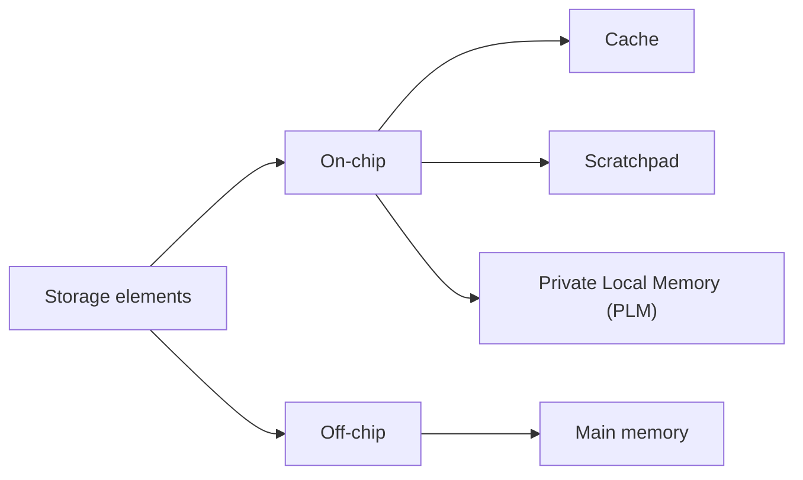
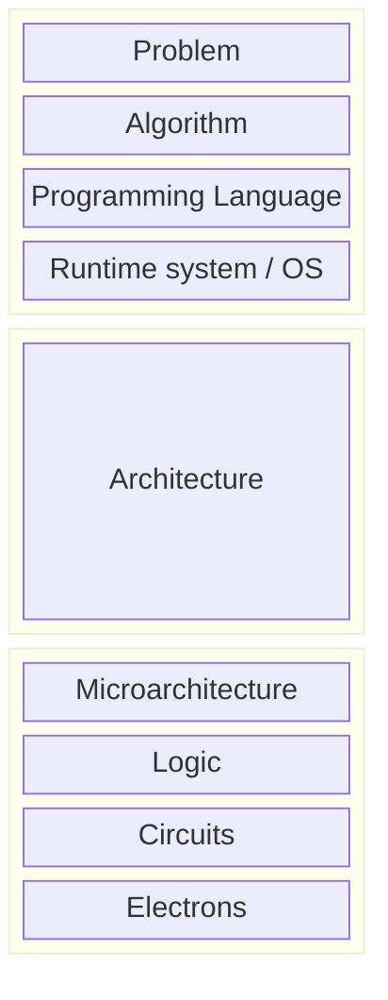

# Introduction

A **Hardware Accelerator** (HA) is a functionality useful for some application that is implemented in software instead of being implemented through multiple instructions in hardware. Usage of HAs let us speedup applications (like cryptography, packet processing et similia) while also saving on power. In this document we will give an overview of everyhting about HAs with the various tradeoffs to consider while dealing with them.

A general rule of thumb we may experience while working with HAs (and chips in general) is that the more the chip is general purpose, the less efficient it is. This is the reason why we usually do not find HAs in datacenters (where we need high raw processing power) but we find them in mobile phones (where battery life is a really important constraint).

Hardware accelerators, usually do not live on their own: they need some sort of master that activates them. In this case we talk about **Heterogeneous systems**, i.e. a processing system where there are multiple kinds of processors (the main general puprose one and one or more more specialized ones).

## Scaling laws

Previously, three people stated three laws that, according to them, would describe the evolution of silicon devices, namely:

- **Moore's law**: _The number of transistors on an affordable CPU will double every two years_
- **Dennard scaling**: _If the transistor density doubles, the circuit becomes 40% faster while total power consumption stays the same_
- **Koomey's law**: _At a fixed computing load, the amount of battery needed will decrease by a factor of two every year and a half_

::: {.callout .callout-note title="Note"}
Please note that "At a fixed computing load" is the key part of the third law. This is something that is currently not at all true.
:::

The problem of these three laws is that they do not take into consideration the fact that, as we shrink transistors, they will leak more and more current, wasting a lot of power. Also, with an higher switching transistor density, the power dissipated is also very high: this means that, for some chips, it is impossible to be 100% working at the same time, otherwise the power draw and the temperatures would be extreme.

# Systems on Chip (SoCs)

SoCs is an architecture where all the components are connected at the same physical level. The connection is usually implemented using either a bus or a Network on Chip (NoC) system.

SoCs are usually comprised of **processing elements**, **storage elements** and the **communication infrastructure**.

Processing elements may be **general purpose** (GP) or specific accelerators. Usually, the former is used to run the OS and to manage resources and IO while the latter are used to perform common operations more efficiently (that does not necessarily means "faster").

::: {.callout .callout-definition title="Processor terminology"}

:::

Usually, nobody wants to reinvent the wheel for each new chip they design: **Intellectual Properties** (IPs) are bought and reused many times (so that the component is already tested working). Common IP blocks are PCIe, ethernet, HDMI, cryptography algorithms and so on.

Storage elements can be cathegorized into multiple cathegories, as described by the following diagram.

As usual, ~~terms & conditions~~ tradeoffs apply here. On-chip memories are faster but are less dense and more expensive (and, usually, less power efficient) than off-chip ones.

A **cache** is a kind of memory placed between the main memory and the component and it is used to store frequently accessed data and instructions in order to reduce access times.

**Scratchpad** is a like a cache but the burden of managing it is assigned to the programmer.

**Private Local Memory** (PLM) refers to memory placed inside a component that is not visible from the processor and it is fully dedicated to the component.

The communication infrastructure is composed by **buses** and **NoC** systems. While the former resemble simple crossbars that manages the communication between master and slaves, the latter use packets of information that gets routed between the components.

A common pattern observable in nowdays chips is that PLMs usually occupies the majority of the silicon area and that the majority of energy dissipation is spent on data transfers between component. Data management is very critical.

## Processors

Here we give a brief general overview of processors and the terms used to desctibe them.

One can refer to a general purpose processor as a **stored program computer** because, in contrast to specific hardware, a processor needs to read what to do (the _instructions_) from somewhere and those instructions may be arbitrarily modified to implement all kinds of algorithms.

There are nine steps from having a problem to solve to routing the electrons through the mosfets that constitute a chip:

The **problem** is translated into an **algorithm**, written in some **programming language**, that runs on a host **operating system** that has been written and compiled for a specific **architecture** that has been implemented on the **microarchitecture** of the chip hosting the OS using **logic** gates that are constituted by **circuits** of transistors in which **electrons** flow.

The difference between the _architecture_ and the _microarchitecture_ is that the first is "the language" of the processor (i.e. the supported opcodes, their shape and whatnot (ISA)) while the other is how it is implemented in hardware (pipeline or not, branch predictor or not, cache sizes and positions, etc.).

Processors can be classified as **Complex Instruction Set Computer** (CISC) or **Reduced Instruction Set Computer** (RISC). The former's ISA provides thousands of instructions with variable lenghts and all sorts of addressing modes and features and has tons of registers. The latter's ISA, instead is really small and simpler: all instructions are the same lenght, there are really few addressing modes and everythink is keps timple in general.

RISC architectures exists because the large majority of the average computer program ususally uses less than 20% of the available instructions.

Assuming we have all permissions and documentation, it is possible to extend the ISA of an architecture following three steps: creation of the accelerator on the silicon, adition of the required instructions and registers to use the accelerator to the isa and modification of the compiler to make use of the new instructions.

## Memory hierarchy

We already discussed how different kind of memories are more or less dense/fast/expensive/etc. In order to let processors access big memories without having to wait for long periods of time doing nothing, memory hierarchies are used.

Closest to the processors are the smallest and faster memories while far from it there are the slowest and chonkier ones.

Since we have multiple memories, we do not have a single source of truth, therefore coherency between all those memories must be guaranteed.

When an hardware accelerator is used, the data must be transferred to it. This introduces some overhead. We can either pray that the accelerator is fast enough to at least mask the overhead (**offloading**) or use more accelerators in parallel (**parallel execution**), paying attention to coherence.

