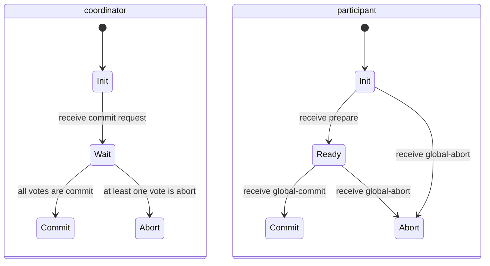
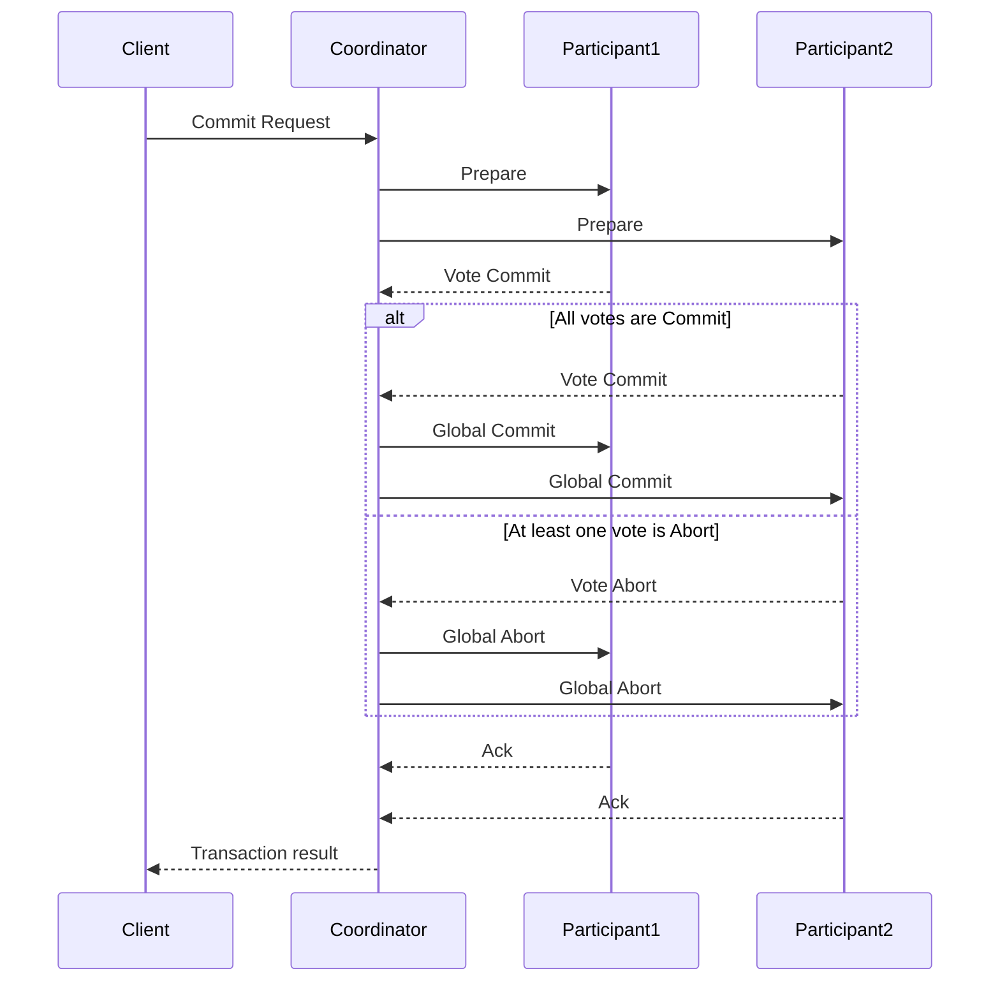
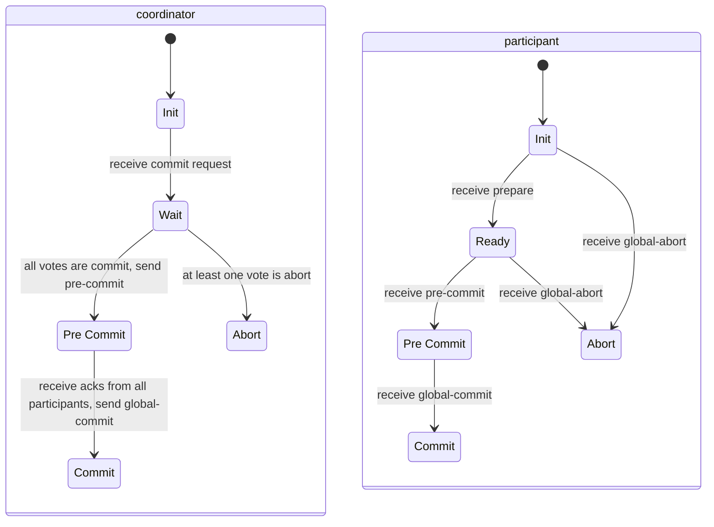

## Introduction

A distributed system is a collection of independent computer that appears to the users as a single computer.

Some key aspects of distributed systems are:

- **Heterogeneity**: Different hardware, operating systems, programming languages, and network technologies can be integrated into a single distributed system.
- **Openness**: The system should be designed to allow easy integration of new components, technologies, and standards.
- **Security**: each information should be: confidential (only authorized users can access it), integrity (data cannot be altered without detection), and available (data is accessible when needed).
- **Scalability**: The system should be able to handle increasing workloads and accommodate growth in the number of users and resources without significant performance degradation.
- **Failure Handling**: A failure in a distributed system should cause only a partial failure of the system, not a total one. The system should be able to detect, recover from, and tolerate failures.
- **Concurrency**: A distributed system is inherently concurrent, with multiple processes running simultaneously on different machines. Proper synchronization and coordination mechanisms are essential to ensure consistency and correctness, as there isn't a single clock.
- **Transparency**: The complexity of the distributed system should be hidden from users and applications. This includes:
  - Access Transparency: Users should not need to know how resources are accessed.
  - Location Transparency: Users should not need to know the physical location of resources.
  - Migration Transparency: Resources can move without affecting users.
  - Replication Transparency: Users should not know if a resource is shared between other users.
  - Failure Transparency: The system should continue to operate despite failures.

## Distributed System Architecture

### High-Level Architecture

A distributed system is composed of multiple machines connected through a network. Those machines can be:

- **Network-OS based**: Communication and resource location are explicitly managed by the application programmer, resulting in low transparency. Access is typically via standard network APIs (e.g., sockets, file sharing protocols).
- **Middleware-based**: A software layer sits between the application and the OS/network, providing an high-level API (e.g., RPC, RMI). It offers high transparency by hiding heterogeneity and distribution.

### Runtime Architecture

A distributed system can be classified based on the components, the connections, the data exchange, and the interaction between them.

#### Client-Server

This is the most common architecture.

It is based on two component:

- **Server**: A passive entity that is responsible to provide a services through some defined API;
- **Client**: An active component that request the services to the server.

In distributed system one server can use a service from other servers creating a **multi-tier** (N-tier) infrastructure.

The services that can be distributed are:

- User interface;
- Application logic;
- Data.

This architecture is easy to manage and scale, but the server is a single point of failure and a bottleneck for the system.

#### Service Oriented

The service oriented architecture is based on three components:

- **Service Provider**: is a component that publish a service that he provide;
- **Service Broker**: holds a description to all the service available;
- **Service Consumer**: search for a service in the broker and then interacts _directly_ with the provider.

The interface is described with a standard language (e.g. WSDL).

The communication is done through a standard protocol (e.g. SOAP).

#### REST

REpresentional State Transfer (REST) is an architectural style that define how web standards should be used.

The interaction happen between a client and a server. The interaction is stateless, meaning that each request from the client to the server must contain all the information needed to understand and process the request.

The response must be explicitly labeled as cacheable or non-cacheable.

The server interface must satisfy four constraints:

1. **Identification of resources**: Each resource is identified by a unique URI;
2. **Manipulation of resources through representations**: The communication is done through representations of the resource (e.g. JSON, XML, HTML), selected dynamically based on the client needs;
3. **Self-descriptive messages**: Each message contains metadata about how to process it (e.g. HTTP headers);
4. **Hypermedia as the engine of application state**: The server provides links to other resources dynamically, allowing clients to navigate the application state.

#### Peer-to-Peer

All the components in a peer-to-peer architecture are equal and can act as both client and server.

A server, in a client-server architecture, represents a single point of failure and a bottleneck for the system. In a peer-to-peer architecture, the failure of a single node does not affect the overall system, as other nodes can take over its responsibilities.

#### Object-Oriented

An object-oriented architecture is based on the concept of objects that encapsulate data and behavior. The objects provide an interface to interact with them.

#### Data-Centred

A data-centered architecture is based on a shared data space (**Repository** - tuple space or shared global state) that is accessible by all the components in the system.

Data can be added or read from the repository.

When performing a read operation, the component can either take from the repository (destructive read) or read the data without removing it (non-destructive read).

The components provide a _pattern_ (or **template**) to access the data. If there is no match the component will wait until there is one.

#### Event-Based

An event-based architecture is based on the concept of events that are generated by components in the system.

Other components can subscribe to events and be notified when an event occurs.

#### Mobile Code

The Mobile Code architectural style allows for the dynamic movement of code or an entire running process across the network at runtime. This capability enhances a system's flexibility, enabling it to receive new functionality without being halted or manually updated.

This style is often implemented in languages that run on a virtual machine (VM), such as Java or JavaScript, because the VM provides a crucial layer of abstraction and control over the executing environment.

The ability to receive and execute code from an external source is a major security risk.

##### Code on Demand

The client retrieves the executable code (or script) from a server and executes it locally.

Only the code itself moves (_Weak Mobility_).

> An example is a web browser that downloads and executes JavaScript code from a web server.

##### Remote Evaluation

The client sends a request that is executed as code on the server.

The server performs the computation and returns only the result to the client (_Weak Mobility_).

> An example is an SQL query that is sent to a database server for execution, and the results are returned to the client, or a cloud notebook like Google Colab where the code is executed on a remote server.

##### Mobile Agent

A process, including both its code and its complete execution state (data, program counter, stack), is suspended, migrated to a new machine, and then resumed (_Strong Mobility_).

### Interactions

The behavior of distributed system is determined by a **distributed algorithm**: an algorithm executed collaboratively across multiple, independent machines. Due to the distribution, the algorithm must handle _communication_, _synchronization_, and _fault tolerance_.

A critical component of the performance and behavior of a distributed algorithm is the **time**: speed of the processes, the performance of the communication channel, and the _clock drift_ (the time difference between the different machines) rates between machines.

There are two types of distributed systems based on time:

- **Asynchronous**: there are _no bounds_ for the time components. This is the most realistic model, but it's hard to design algorithms for it.
- **Synchronous**: each component has a _known bound_ for the time. This is an idealized model that is easier to design algorithms for.

> **Pepperland Example**
>
> There are two generals on top of two hills. They need to sync who will lead an assault and when to start it. They can communicate on a reliable channel.
>
> To choose the leader they could both choose a random number, the bigger on win.
>
> In a async system is impossible to choose a time to charge as there is no bound on the time. One general could send a message to the other, but there is no guarantee that the message will arrive in a specific time. The other general could wait for the message, but there is no guarantee that it will arrive. The only solution is to charge immediately, but this could lead to a failure if the other general doesn't charge at the same time.

## Communication

Communication protocols define how processes in a distributed system exchange information.

These protocols are primarily classified along two dimensions:

- Time dependency: The client and server must be active at the same time (_Transient_) or not (_Persistent_);
- Synchronization: The sender waits for the message to be sent, received, or processed (_Synchronous_) or not (_Asynchronous_).

### Remote Procedure Call (RPC)

**Remote Procedure Call** (RPC) is a communication abstraction that allows a program to execute a procedure or function in a different machine as if it were a local call (_Location Transparency_).

The RPC is build upon a middleware layer that hides the network communication.

This is done using a proxy called **Stub** that is responsible to:

- Serialize structured data into a stream of bytes;
- Marshall the data into a specific representation for the network;
- Deserialize and unmarshall the data on the other side.

The stubs are defined with an **Interface Definition Language** (IDL) that is language independent, allowing to have different languages between the caller and the callee.

#### RPC Communication

The communication is done by passing parameters to the remote procedure.

The standard method is to pass parameters by value, as there is no shared memory between the two machines.

If there is a need to pass parameters by reference, it's possible to simulate it using the _copy/restore_ method: the value is passed by value, but when the function ends, the return value of the parameters is cloned in the caller.

The RPC communication is typically _synchronous_ (blocking), to mimic the local procedure call behavior, but it can be also:

- _Asynchronous_: for void procedures, where the client doesn't wait for the server to process the request;
- _Deferred_: the client receive a **Future** object and than continue execution and only wait for the result when it's needed.

The communication can be optimize with two strategies:

- **Batching**: wait for multiple requests to create a single package to improve bandwidth;
- **Queuing**: store requests by the middleware and wait to send them if the destination is unreachable, improving resilience and persistency.

#### RPC Middleware

The client needs to locate the server that provide the requested service.

This is done through two logics:

- **PortMap**: in system like _Sun RPC_, each server register the services it provide with a portmap daemon that store the mapping between the service UUID and the host/port;
- **Directory Service**: in system like _DCE RPC_, there is a directory service that store the mapping between the service name and the host/port.

To conserve resources the server can be **Dynamically Activated** the server once a request arrive.

#### Inter-Process communication (IPC)

When two distinct process are on the same machine, it would be possible to use RPC to communicate, but it would be inefficient.

Using a Lightweight RPC that use a shared memory accessible from the middleware.

### Remote Method Invocation (RMI)

**Remote Method Invocation** (RMI) is the object-oriented counterpart to RPC. It allows a process to invoke a method on a remote object residing in another process.

The communication is done through method calls on remote objects (**Stub**) that acts as if they were local. This is done because it's not possible to pass objects by value between two different machines that might use different programming languages.

In java RMI, as both the client and the server use the same language, it's possible to pass objects, but the code must be available or downloaded dynamically.

### Message Oriented Communication (MOC)

**Message Oriented Communication** is a foundational style in distributed systems, where interaction is based on the asynchronous exchange of discrete, self-contained messages. It is generally a one-way interaction, often based on events.

#### Basic Message Passing

The most fundamental form of MOC uses low-level **socket programming**, relying on the _Operating System_ primitives for communication.

- **Transmission Control Protocol** (TCP) Sockets: Provide a connection-oriented, reliable communication channel between two processes (point-to-point).
- **User Datagram Protocol** (UDP) Sockets: Provide a connectionless, unreliable connection. A single socket can receive messages from multiple clients. They support broadcast and multicast addressing.

#### Message Passing Interface (MPI)

**Message Passing Interface** (MPI) is a library that provides a rich set of primitives to manage communication in parallel and distributed systems.

It allows to control the _synchronization level_ of the communication and avoids explicit serialization of data.

Messages can be sent in broadcast or scattered between multiple processes to perform parallel computation.

#### Message Queueing

**Message Queueing** is a system that introduces a persistent storage between the client and the server (queue) to store messages.

This allows to **decouple** the client and the server in _time_ and _space_.

The client _push_ messages in the queue and the server _pop_ messages from the queue asynchronously and they act as peers.

Inside the system there could be multiple queues identified by a name that can be statically or dynamically created.

This decoupling allows to scale the system easily by adding more servers to process the incoming messages.

In the system there could be managers that act as relay between multiple queues to create complex topologies, increasing the fault tolerance.

#### Publish-Subscribe

The **publish-subscribe** model is an event-driven architecture where _publishers_ generate events/messages without knowing who the receivers are, and _subscribers_ express interest in events without knowing who published them.

This allows to decouple the event with the space but the communication is _transient_ as only online subscribers will receive the messages.

A component can subscribe based on:

- **subject-based** (topic-based): Subscribers express interest in a predefined category or topic (e.g., subscribing to the "Stock Market/Technology" topic). This is efficient for the dispatcher to process but less expressive.
- **content-based**: Subscribers provide a predicate (a condition) over the content of the message (e.g., subscribing to "Stock Market/Technology where Price $> 100$ AND Volume $> 1M$"). This is more expressive but significantly more expensive for the dispatcher to process.

The core component of this architecture is the **Event Dispatcher** (broker) that manage the subscriptions and the notifications.

A **Complex Event Processing** system is often layered on top of the dispatcher. It analyzes streams of incoming simple events to detect patterns, correlations, or anomalies, and then generates a single, higher-level complex event (e.g., detecting "Fire" from simple events like "Smoke detected" and "High Temperature reading").

#### Distributed Publish-Subscribe

To overcome the Event Dispatcher bottleneck, a distributed architecture is organized into a _network_ of message brokers and the message is forwarded across the network using different strategies.

For **acyclic** graphs:

- **Message Forwarding**: Each broker only knows its local subscribers. When an event arrives, the broker forwards it to all neighboring brokers and all local subscribers. With this strategy the subscription is cheap as the subscription is stored locally, but the message need to be flood.
- **Subscription Forwarding**: Subscriptions are forwarded up the network hierarchy or to neighbors. Each broker maintains a routing table showing which neighbors have expressed interest in a given subscription. In this way the message is sent only to the interested brokers, reducing the amount of message, but increasing the subscription cost.
- **Hierarchical Forwarding**: Brokers are organized into a hierarchy with a single Root Broker. Subscriptions flow up to the root. Messages flow up to the point where a common interested path is found, then travel down to the subscribers. Good locality and efficient event forwarding, but high load and centralization risk on the root broker.

Paths can be optimized if some are a subset of others.

**Cyclic** topologies are more _fault-tolerant_ but introduce the problem of _message loops_ (flooding) and uncertainty about delivery paths.

- **Distributed Hash Table** (DHT): Each broker is assigned an ID. Events are hashed to find the successor node (node with an ID greater or equal). The message is routed towards this successor, and routing information is collected along the way to guide the message to actual subscribers.
- **Content-Based Routing**: each broker store a routing table to forward the message based on the content of the message, creating a spanning tree.
  - **Per-Source Routing** (PSR): each broker store a routing table with $<source, \text{next hop}, \text{event type}>$.
  - **Improved Per-Source Forwarding** (iPSF): an optimized version of PSR that aggregate indistinguishable sources.
  - **Per-Receiver Forwarding** (PRF): each broker store all the events that a specific broker is interested in and in another table the next hop to reach that broker.

### Stream Oriented communication

**Stream-Oriented Communication** involves transmitting a continuous, _ordered_ sequence of data from a source to a sink. This model is essential for multimedia and real-time applications where the timing of the data arrival is often as critical as its content.

#### Timing Constraints

In streaming, the correctness of the communication is heavily impacted by time, leading to three classifications based on timing guarantees:

- **Asynchronous**: Data are transmitted without any timing constraint;
- **Synchronous**: there is a max delay between the sending and receiving of data;
- **Isochronous**: there is a min and a max time constraint between the sending and receiving of data, limiting the delay variation (_jitter_).

#### Quality of Service (QoS)

The network doesn't guarantee the _Quality of the service_. Some metrics that need management:

- Bit Rate: The guaranteed data rate.
- Latency/Delay: Time to set up the connection and receive data.
- Jitter: The variance in delay ($\Delta D$) between consecutive data units.

Streaming is implemented using UDP instead of TCP. This is because, for real-time data, a retransmitted packet is useless, as it arrives too late for playback. UDP's speed and lack of automatic retransmission make it suitable.

The QoS are managed client and server side using different techniques:

- **Buffering**: the client stores incoming data in a buffer and the playback starts only after is filled after a threshold, dynamically adjusted based on network conditions. This is done to smooth out jitter;
- **Forward Error Connection**: if the application enters in an invalid state, it will go to the next valid state, instead of asking back the missing one. Missing data are concealed using interpolation or extrapolation techniques;
- **Interleaving data**: data are not sent sequentially. A single network packet contains non-consecutive fragments of multiple frames. If the packet is lost, only some non-consecutive frames are lost, which can be concealed more easily;

#### Multiple Streams Synchronization

Is possible that multiple streams need to be synchronized (e.g., audio and video). This can be done:

- **Client-side**: The client uses timestamps to synchronize streams during playback. Each stream includes timing information, allowing the client to align data from different streams.
- **Server-side**: The server merges streams before transmission.

## Naming

In a distributed system, **naming** is the mechanism used to reference and locate system entities, which can range from physical hosts, files, and services to users and abstract processes.

Names can be _human-friendly_ (e.g., "www.example.com") or _machine-friendly_ (e.g., IP addresses).

A name can also be _global_ (unique across the entire system) or _local_ (unique within a specific context or domain).

The **address** is the actual location of the entity in the network (e.g., an IP address) and it can be mutable and change over time.

An entity must be identified by an immutable _Identifier_ and a using a **name resolution** to convert that name to an address.

Name resolution can be performed in different ways:

### Flat Naming

A name is **flat** if it is a simple sequence of characters that contains no structural or topological information about the entity's location.

#### Simple Solution

This method is suitable only for small-scale, local area environments where network traffic is manageable.

To locate an entity with a specific name, a request is broadcasted to all hosts on the local network segment. The host that recognizes the name responds with its address.

An example is ARP, that broadcasts a request to find the MAC address associated with an IP address.

#### Home Based

This strategy handles **mobility** by having a fixed home address for each entity.

When an entity moves to a new location, it registers its new address with its home server.

When another entity wants to communicate with it, it first contacts the home server that returns a **Forwarding Pointer** (the current address) allowing direct communication.

This adds an extra step (the trip to the Home Host) to every connection setup, increasing latency.

#### Distributed Hash Table

**DHTs** create a scalable, decentralized system for mapping flat names (keys) to addresses (values) across thousands of nodes.

Each node in the DHT is assigned a unique identifier (ID) from the same address space as the keys. Than the key space is partitioned among the nodes based on the hash of the key (the first node with the id greater than the key is responsible for that key).

The nodes form an _overlay network_, organized as a logical ring.

Finding the node responsible for a key can be done with different strategies:

- **Chord**: each node knows only its successor and predecessor. To find a key the request is forwarded to the successor until the node is found. This is inefficient as it requires $O(N)$ hops in the worst case.
- **Chord finger table**: each node maintains a finger table with $O(log N)$ entries, each pointing to a node at a distance of $2^i$ from itself. This allows to find the key in $O(log N)$ hops.

#### Hierarchical

Hierarchical distribution organizes names into a tree-like structure, where each subtree represents a directory and entities (such as files or services) are leaves.

In this model, each directory node maintains information about its children and parent. When resolving a name, the process follows these steps:

- If a node knows of a child that knows the address of the requested entity, it forwards the request directly to that child.
- If not, it forwards the request to its parent node, which repeats the process until the root or a node with the information is reached.

Once resolved, the address is returned along the path, and intermediate nodes can cache the result for future queries to improve performance.

This approach excels in local domains, where queries are confined to nearby branches, reducing global network traffic. However, it can suffer from bottlenecks at higher-level nodes if not balanced properly.

### Structured Naming

**Structured Naming** organizes system entities into a **Name Space**, a logical structure. Unlike flat naming, the name itself carries information about the entity's position within the structure.

A name space is a labeled, graph composed of:

- **Leaf Nodes**: Represent the actual named entities (hosts, files, services).
- **Directory Nodes**: Nodes that contain references (links) to other nodes (both leaf and directory) within the name space.

An entity is uniquely identified by a **Path Name**, a sequence of directory node labels that traces a route from the root to the leaf node.

Inside the name space, there can be:

- **Hard Links**: Leaf nodes can be reached by multiple paths, making the name space a general graph.
- **Symbolic Links**: A special type of leaf that store the path to another node.

An example of structured name is the filesystem.

#### Partitioning

Thanks to the structured nature of the name space, it's possible to partition the name space into layers. Each host can know only part of the names.

- _Global Level_: Manages the root of the name space and points to a few highly stable, high-level directory nodes (e.g., top-level domains like `.com`, `.org`). Resolution is worldwide;
- _Administrational Level_: Managed by large organizations (e.g., network service providers or universities). It manages many regional or organization-specific nodes;
- _Managerial Level_: low level directory within a single administration. It manages the majority of department nodes.

#### Resolution

The resolution can happen with two methods:

- **Iterative**: The client queries the root, which replies with the address of the next server (a referral). The client then contacts that next server, repeating until the leaf is reached. This method increases the number of messages for the client but reduces the load on the name server.

- **Recursive**: The client contacts the root node that will contact the next node on behalf of the client. This continues until the leaf is reached. This method reduces the number of messages and allow caching but increases the load on the name server.

Higher-level directory nodes change infrequently, so their resolution results can be cached for long durations (high TTL). Lower-level nodes must update immediately for system changes, requiring short TTLs.

Root servers are heavily mirrored worldwide and often share the same IP address. **IP Anycast** routes a request to the nearest operational server, distributing the load and improving global response time.

#### Structured vs flat name

- Structured name are easier to manage and scale as the name space can be partitioned among multiple nodes. Each node is responsible for a small part of the name space, reducing the load on each node. Caching works well due to locality and stability.
- Flat name are good for small system as in a worldwide system the amount of names is huge and each node should store all the names.

#### DNS

An example of distributed name system is the **DNS**.

The DNS nodes could be of different types:

- **A** (Address record): Maps a domain name (host name) to an IPv4 address.
- **AAAA** (Address record): Maps a domain name to an IPv6 address.
- **NS** (Name Server record): Specifies the authoritative name server for a given domain/zone. Used in recursive resolution.
- **MX** (Mail Exchange record): Specifies the mail server responsible for accepting email messages for the domain.
- **CNAME** (Canonical Name record): Creates an alias from one domain name to another (the canonical name).
- **TXT** (Text record): Holds arbitrary, human-readable text information. Often used for verification and security records (e.g., SPF, DKIM).

The DNS doesn't work well with mobility.

### Attribute Based Naming

**Attribute-Based Naming** allows entities to be located using a set of descriptive attributes (properties) instead of, or in addition to, their fixed names.

This approach is essential for large, complex systems where users often search for entities based on their characteristics. These systems are commonly referred to as **Directory Services** and are implemented using DBMS technologies.

The entire collection of entities and attributes is called the **Directory Information Base** (DIB).

The entities are organized in a hierarchical structure known as the **Directory Information Tree** (DIT), similar to structured naming.

It's possible to perform two operations:

- _Lookups_: finds a single record when the full, unique set of attributes is provided.
- _Search_: finds all records that match a given set of attribute predicates.

#### LDAP

An example of attribute based naming system is **LDAP** (Lightweight Directory Access Protocol) where each entity is identified by a _Distinguished Name_ (DN).

An example is: `cn=John Smith,ou=Engineering,o=ExampleCorp,c=US`

Where:

- `cn` (Common Name): The name of the individual (e.g., John Smith).
- `ou` (Organizational Unit): The department or unit within the organization (e.g., Engineering).
- `o` (Organization): The name of the organization (e.g., ExampleCorp).
- `c` (Country): The country code (e.g., US for the United States).

### Remove Unreferenced Entities

**Distributed Garbage Collection** is the process of automatically identifying and reclaiming memory or resources occupied by remote objects (skeletons) that are no longer referenced by any active proxy in the distributed system.

#### Reference count

Each remote object's skeleton maintains a counter representing the total number of active proxies (clients) that hold a reference to it. When the count reaches zero, the object is eligible for collection.

Some problems are:

- _Cyclic Unreachable Garbage_: If two remote objects reference each other but are unreachable from any root variable, their counters will never reach zero;
- _Race Conditions_: If a proxy sends a reference to another proxy and then disconnects before the second proxy creates the link, the reference count may reach zero prematurely.

To fix the _race condition_ the proxy $A$ should send a message to the skeleton $O$ to notify the transfer of the reference to proxy $B$. Than $O$ should send an ack to $B$ to confirm the transfer.

#### Weighted Reference Counting

To reduce the number of messages needed to manage the reference count, a weighted reference counting scheme can be used.

Each skeleton starts with a total weight (e.g., 256). When a proxy connects to the skeleton, it receives half of the current weight.

When a proxy disconnects, it returns its weight back to the skeleton.

When a proxy sends a reference to another proxy, it sends half of its current weight along with the reference.

This remove the problem of increasing the amount of messages, but limit the maximum amount of proxies that can link to a skeleton.

#### Reference Listing

The skeleton maintains a complete list of all proxies that currently hold a reference.

When a proxy disconnects, it sends a message to the skeleton to remove itself from the list.

The skeleton can periodically check the liveness of each proxy in the list (e.g., sending heartbeat messages). If a proxy is found to be unresponsive, it is removed from the list.

When the list becomes empty, the skeleton can be safely collected.

This approach is robust against non-reliable channels, but the still is the problem of race conditions when transferring references.

#### distribute mark-and-sweep

To detect disconnected entities from the root, a mark-and-sweep algorithm can be used.

in a centralized system, the garbage collector starts from the root and marks all reachable objects. Then it sweeps through all objects and deletes those that are unmarked.

In a distributed system, each node performs the mark-and-sweep algorithm locally. The process involves:

- At the start, each node is marked as _white_ (unvisited).
- An object, and all the proxies, in a node are marked as _grey_ if it is reachable from the root.
- When a proxy is marked grey, it sends a message to the node where the actual object resides to mark it grey.
- Once the proxy receives the ack, it marks itself as _black_ (visited).
- After the marking phase, each node sweeps through its objects and deletes those that are still white (unreachable).

## Synchronization

**Synchronization** is essential for ordering events and coordinating actions across multiple nodes. Each node relies on an imperfect _local physical clock_ (a quartz crystal oscillator) which inevitably suffers from **clock drift** (a deviation from the true time, about 1 second every 11.6 days).

To manage this, clocks must be periodically synchronized to ensure consistency across the distributed system, by:

- Sync against a single clock with an accurate time
- Sync among themselves.

When a clock correction is needed, simply jumping the time backward can cause major issues. To avoid this it should maintain **monotonicity** by slowing down or speeding up the clock until it reaches the correct time.

### Physical Clock

Physical clocks provide a way to measure real-world time, but due to clock drift, they need to be synchronized periodically.

#### Global Positioning System (GPS)

GPS provides an accurate way to synchronize clocks across the globe.

Each GPS satellite uses atomic clock to count time and they are sync with each other. They periodically broadcast their current timestamp.

A receiver on the ground should receive the timestamp from at least 4 satellites to calculate its position and the current time.

Since the signal travel at the speed of light, the receiver can calculate the time it took for the signal to arrive and adjust its clock accordingly with a precision of a few nanoseconds, even with a position error of 10 meters.

#### Cristian's Algorithm

In a network there is a time server that provide the right time and clients can request it periodically.

The client send a request at time $T_0$ and receive the response at time $T_1$ with the server time $T_s$ inside.

Then the client set its clock to $T_s + \frac{(T_1 - T_0)}{2}$, this is done to adjust the time considering the transmission delay.

This approach assumes that the network delay is symmetric and the processing time on the server is negligible or known.

#### Berkeley's Algorithm

This algorithm is used when there is no accurate time server and all the machines need to sync among themselves (_agreement_).

A master node periodically polls all the other nodes for their current time and calculates the average time.

With this average time, the master node calculates the offset for each node (including itself) and sends the offset to each node. Each node adjusts its clock by the received offset.

#### Network Time Protocol (NTP)

NTP is the internet standard for clock synchronization.

It uses a hierarchical system of time sources, with _stratum 0_ being high-precision timekeeping devices (like atomic clocks), _stratum 1_ being directly connected to stratum 0 devices, and so on.

Each stratum synchronizes with the stratum above it, reducing the precision as the stratum increases.

The synchronization can be done in broadcast, with procedure-call or symmetric mode.

NTP uses four timestamps collected over two pairs of messages to accurately calculate the _offset_ (the difference between clocks) and the _delay_ (round-trip time), minimizing the impact of asymmetric latency:

- Client records send time ($T_1$).
- Server records receive time ($T_2$).
- Server records reply send time ($T_3$).
- Client records reply receive time ($T_4$).

The offset ($\theta$) and delay ($\delta$) are calculated as:

$$\theta = \frac{(T_2 - T_1) + (T_3 - T_4)}{2}$$

$$\delta = (T_4 - T_1) - (T_3 - T_2)$$

### Logical Clock

In a distributed system, there is no global clock to order events and physical clocks are unreliable. To solve this problem, logical clocks are used to provide a partial ordering of events based on their causality.

They rely on the **happened-before** relation ($\rightarrow$):

- If two events occur in the same process, the one that happens first happened before the other (e.g., $e \rightarrow e'$ if $e$ occurs before $e'$ in the same process);
- If an event $e$ is the sending of a message by one process and $e'$ is the event of receiving that message by another process, then $e \rightarrow e'$;
- The relation is **transitive**: if $e \rightarrow e'$ and $e' \rightarrow e''$, then $e \rightarrow e''$.
- If neither $e \rightarrow e'$ nor $e' \rightarrow e$, then the events are **concurrent** ($e || e'$).

This relation creates a partial ordering of events in the distributed system. Partial ordering means that not all events can be compared; some events may be concurrent and have no defined order.

#### Scalar Clock

**Scalar Clocks** (or Lamport Timestamps) are the simplest logical clocks.

Each process maintains a local scalar clock $L_i$ that starts at 0.

When an event $e$ occurs, it is assigned a timestamp $L(e)$ based on the local clock and the clock is increased.

When a process receives an event from another process, it sets its own clock to: $max(current, received) + 1$.

To have a global clock, need to add the id of the process to the clock (clock.id).

To force an order between multiple processes (in a reliable FIFO channel) is possible to:

- Send a message in broadcast with the timestamp;
- Once the message is received, send an ack to all the processes and store the message in a queue ordered by the timestamp;
- A message is processed only when all the acks are received.

#### Vector Clock

**Vector Clocks** solve the limitation of scalar clocks by using a vector of integers to capture the full causality history. This allows them to correctly capture both causality and concurrency.

Each process $P_i$ maintains a vector $V_i$ of size $N$ (the total number of processes) where:

- $V_i[i]$: is the number of events that have occurred at $P_i$;
- $V_i[j]$: is the amount of events that the process $P_i$ knows about $P_j$.

This create an ordering:

- $V = V'$: all the values are the same
- $V \leq V'$: all the V value are less than V'
- $V||V'$: neither $V \leq V'$ nor $V' \leq V$

This guarantees that $e→e' \Leftrightarrow V(e)→V(e')$

Messages are sent with the vector clock. When receiving a message, if $\forall j: V_m[j] > V_k[j] + 1$ there are missing messages. For this property it's possible to work with unreliable or non-FIFO channels.

### Mutual Exclusion

**Mutual Exclusion** is a concurrency control mechanism that ensures that in a distributed system, a shared resource is accessed by at most one process at any given time, preventing interference and maintaining system consistency.

There are three properties that must be guaranteed:

- **Safety property**: At most one process is accessing the resource at any moment.
- **Liveness Property**: Every request to enter the critical section will eventually succeed (no deadlocks or starvation).
- **Order** (optional): The entry to the critical section is granted in the order the requests were made.

#### Mutual Exclusion with Centralized server

Having a central server that handle the resource help coordination is the simplest approach.

Each process that wants to access the resource send a request to the server. The server maintain a queue of requests and grant access to one process at a time.

This is a simple approach but the server is a single point of failure and a bottleneck.

#### Mutual Exclusion with Token ring

Processes are organized into a logical ring topology, where each process $P_i$ knows its successor $P_{i+1}$.

A single token circulates continuously around the ring. When a process wants to enter the critical section, it waits for the token to arrive. Once it receives the token, it enters the critical section, performs its operations, and then passes the token to its successor in the ring.

This approach can be inefficient as the token must circulate even when no process needs access, leading to unnecessary delays. If the token is lost, a recovery mechanism is needed to regenerate it to avoid deadlocks.

#### Mutual Exclusion with Scalar Clock

When a process wants to access the resource it sends a request message to all the other processes with its current scalar clock.

Once a process $P_j$ receives the request of $P_i$ it will act as follows:

- Not interested: if $P_j$ doesn't need the resource, it sends an ack;
- Holding the resource: if $P_j$ holds the resource, it will wait until it finishes and sends an ack;
- Wanting the resource: if $P_j$ also wants the resource, it compares the timestamps:
  - If $L_i < L_j$ (the request of $P_i$ happened before $P_j$), it sends an ack;
  - If $L_i > L_j$, it will wait until it finishes and sends an ack.

A process can enter the critical section only after receiving an ack from all the other processes.

This approach needs $2(N-1)$ messages per critical section entry making it inefficient for large systems.

### Leader election

Many distributed algorithm need a coordinator node to manage the execution. The coordinator is called **leader** and should be acknowledged by all the processes.

Typically all the nodes are distinguished by a unique id known by all the nodes.

When a node detect the crash of the leader it should start a leader election algorithm to choose a new leader, that should be the node with the greater id.

To do so the link must be reliable and should be possible to detect crashes (must introduce a bound on transmission time (problems: clock drift, transmission time, etc)).

#### Bully Election

When a node $P$ detect the crash of the leader it sends an _election message_ to all the nodes with a greater ID, starting its election.

If a node $P'$ receive the election message and its id is greater than $P$ it will reply to $P$ with a message to stop $P$ election and start its own election.

If the node $P$ doesn't receive any reply it means that it's the node with the greater id and it will send a _coordinator message_ to all the nodes to inform them that it's the new leader.

When a node come back online it will start an election to check if it's the node with the greater id.

#### Ring Based Election

Nodes are organized in a logical ring topology.

When a node detect the crash of the leader it will send an _election message_ to it's successor.

When a node receive the election message it will check the id inside:

- If its ID is not present it will add its own id and forward the message to its successor;
- If its ID is present it means that the message completed the ring, so it will change the message to a _coordinator message_ and forward it to its successor.

When a node receive the coordinator message it will update the leader id with the one with the greater id in the message.

### Collecting Global State

It's important to collect the global state of a distributed system to perform tasks like checkpointing, debugging, and detecting deadlocks. Since there is no global clock, it's impossible to take a snapshot of all the processes at the same time.

A **Distributed snapshot** represent the state of all the processes and communication channels at a specific point in time.

The snapshot must be **consistent**, meaning that it accurately reflects the state of the system without contradictions (e.g. $P1$ saves its state than sends a message to $P2$, and $P2$ receives the message before saving its own state).

The conceptual tool representing the global state is the **cut**. The cut is a line that intersect all the processes at a specific point in time.

A cut is consistent if for any event $e$ that is included in the cut, all events that happened before $e$ are also included in the cut.

#### Distributed Snapshot

The **Chandy-Lamport Distributed Snapshot Algorithm** is the standard, method for recording a globally consistent state, assuming communication links are FIFO and reliable.

The algorithm uses a special marker message to indicate the start of the snapshot process.

Any process $P_i$ can initiate the snapshot by atomically executing the following steps:

- Records its internal state;
- For every one of its outgoing channels , $P_i$ sends a Marker;
- Starts recording the state of every incoming channel to $P_i$.

Once a process $P_j$ receives a Marker on an incoming channel, it will:

- If it's the first Marker received, it records its internal state, sends a Marker on all its outgoing channels, and starts recording the state of all its incoming channels (except the one on which the Marker was received);
- If it's not the first Marker received, it stops recording the state of the incoming channel on which the Marker was received. The recorded state of that channel is the sequence of messages received on that channel before the Marker.

Once a process has received a Marker on all its incoming channels, it completes its part of the snapshot that could be sent to a collector.

It's possible to start multiple snapshot by distinguishing the snapshot with an id.

#### Termination detection

The **Dijkstra-Scholten algorithm** is used to detect the termination of a diffusing computation, a computation where all activity starts from a single initiator and spreads by message passing.

The algorithm organizes processes into a tree structure rooted at the initiator.

When a process $P_i$ sends a message to initialize the processing to another process $P_j$, if $P_j$ is not already part of the tree, it sets $P_i$ as its parent.

Once a child terminates and there are no children left, it informs the parent to remove it from the children list.

When the root process has no children and is passive, it declares the computation terminated.

### Distributed Transaction

A **Transaction** is a sequence of operations (read and write) that transforms resources from one consistent state to another. In a distributed system, a Distributed Transaction is a single logical transaction whose operations are executed across multiple, independent nodes.

Look at [Database 2](../Database%202/index.md#transaction) for more information about transactions in a single node.

There are three types of transactions:

- _flat_: The standard transaction that once committed cannot be undone;
- _nested_: Structured as a tree of sub-transactions that can be committed or aborted (even after committing) independently from the parent transaction;
- _distributed_: There is a single transaction that distributes operations across multiple nodes.

To achieve atomicity:

- **Private Workspace**: Changes are made in a private, temporary copy of the data. On commit, the pointers to the old data pages are atomically redirected to the new pages. On abort, the private copy is simply discarded.
- **Write-ahead Log**: Changes are written directly to the database, but a record of the change is stored in a sequential log before the disk write occurs. On abort, the log is read backward, and the changes are reverted.

Concurrency is managed by components across the distributed nodes:

- **Transaction Manager** (TM): Acts as the coordinator for a single transaction across all nodes.
- **Scheduler** (Concurrency Control Manager): Present at each node, it determines the order in which local operations are executed, ensuring serializability (the final outcome is equivalent to some serial execution - [Database 2](../Database%202/index.md#scheduling)).
- **Data Manager** (DM): Present at each node, it manages the physical data and performs the actual read/write operations.

#### Two-Phase Locking (2PL)

This algorithm guarantees serializability by requiring transactions to acquire locks on data items before access.

The transaction has two phases:

- _Growing phase_: The transaction can only acquire locks; it cannot release any;
- _Shrinking phase_: The transaction can only release locks; it cannot acquire any new ones.
  - _Strict 2PL_: Locks are held until the transaction commits or aborts.

For more information about 2PL look at [Database 2](../Database%202/index.md#two-phase-locking-2pl).

This can be implemented with:

- **Centralized 2PL**: A single lock manager controls all locks across all nodes.
- **Primary**: Each physical data item has a designated _master scheduler_ responsible for its locks, located on the same node.
- **Distributed**: Data can be replicated across multiple nodes, and each node manages locks for its local copies.

#### Timestamp

This algorithm avoids deadlocks by giving each transaction $T$ a unique timestamp ($ts(T)$ - scalar clock) at its start.

Each record has a timestamp of the latest transaction that performed a read $\text{ts}_\text{read}$ and a write $\text{ts}_\text{write}$ on that record.

- A read operation is performed if: $\text{ts} > \text{ts}_\text{write}(x)$.
- A write operation is performed if: $\text{ts} > \text {ts}_\text{read}(x)$ and $\text{ts} > \text{ts}_\text{write}(x)$.

otherwise the operation, and transaction, is aborted.

For more information about timestamp look at [Database 2](../Database%202/index.md#optimistic-concurrency-control).

### Deadlock

Deadlocks occur when a set of transactions is cyclically waiting for resources held by others.

Deadlock can be handled in different ways:

- Ignore the problem
- Detection and recovery
- Prevent: the system is build in a way that it's impossible to have a deadlock

#### Detection

Each machine maintain a local _wait-for graph_ (WFG) representing the dependencies between the local transactions.

##### Centralized Detection

The simplest way is to have a centralized node that collect the global WFG and check for cycles periodically.

Collection can be done in different ways:

- When a transaction is created or updated, the local WFG is sent to the coordinator.
- Periodically the nodes sends a diff to the coordinator.
- The coordinator requests for the updated WFG.

##### Distributed Detection

In case of distributed system without a coordinator it use the **Chandy-Misra-Hass**.

When a transaction $T_i$ gets blocked waiting for a resource held by $T_j$, $T_i$ initiates detection by sending a Probe Message to $T_j$.

$T_j$ forwards the message to the transaction holding the resource it needs, and so on.

Once the message is received by the initiator, it's possible to detect a loop and resolve it by:

- Kill itself;
- Kill the process with the higher id.

#### Prevention

Prevention ensures that the WFG can never contain a cycle. This is often done using transaction timestamps to define a priority among transactions.

There are two main methods:

##### Wait-Die

If an older transaction $T_i$ requests a resource held by a younger transaction $T_j$, $T_i$ waits for $T_j$ to release the resource.

If a younger transaction $T_i$ requests a resource held by an older transaction $T_j$, $T_i$ is aborted (dies) and restarted with the same timestamp.

##### Wound-Wait

If an older transaction $T_i$ requests a resource held by a younger transaction $T_j$, $T_j$ is aborted (wounded) and $T_i$ acquires the resource.

If a younger transaction $T_i$ requests a resource held by an older transaction $T_j$, $T_i$ waits for $T_j$ to release the resource.

## Fault Tolerance

Fault Tolerance is the ability of a system to continue operating without interruption despite the failure of one or more of its components (a partial failure). The goal is to mask these failures from the client, ensuring the system remains dependable:

- Available: The probability that the system is ready for use when needed;
- Reliable: The ability of the system to run continuously without failures over a given period;
- Safe: The property that the system will not cause anything bad to happen;
- Maintainable: The ease and speed with which a failed system can be fixed.

### Failure Classification

There are different types of failures:

- **Omission Failure**: A component simply fails to perform an action it was supposed to:
  - _Process_: A process crash or halt and doesn't execute any operation and become _silent_;
  - _channel_: A message is lost and never received (or never sent).
- **Byzantine Failures** (Arbitrary failure): These are hard to detect, if there is an error it might be detected with an omission
  - _Process_: The process executes an incorrect or unintended program. (e.g. memory failure that change the stack pointer, or compromised by a virus).
  - _channel_: Messages are corrupted, duplicated, fabricated.
- **Timing Failure**: Are only relevant in synchronous systems and happens when the time bound are violated.

### Failure Detection

In a synchronous system, it's possible to detect a failure by setting a time bound on message delivery and process execution. In asynchronous system, it's impossible distinguish between a slow process/channel, a failed process, and unreliable communication.

To mitigate false positive, and confirm failures, it's possible to use _heartbeats messages_ that are sent after a certain inactivity period and the ack indicate that the process is alive.

**Fault tolerance** is fundamentally achieved through redundancy:

- **Information Redundancy**: Adding extra bits to data to allow for error detection and correction (e.g., Hamming Codes, parity bits).
- **Time Redundancy**: Repeating an action if it fails or if the result is suspected to be incorrect (e.g., resend of a lost message after not receiving an acknowledgment).
- **Physical Redundancy**: Using multiple hardware or software components to perform the same task (e.g., replicating data, running operations multiple times).

#### Client Failure

When a client process (which initiated a remote computation) crashes, the server process performing the work is left without a node for the result. This process is called an **Orphan** Computation.

- **Extermination**: The client sends an explicit kill message to the server upon recovery, naming the specific process to terminate.
- **Reincarnation**: When the client reboots, it broadcasts an epoch number (a unique ID for its current session) to all servers. Any server running a computation associated with an older, lower epoch number is instructed to immediately kill that process.
- **Gentle Reincarnation**: Similar to reincarnation, but the server only kills old computations if the client that owns them cannot be located or authenticated.
- **Expiration**: The client is granted a fixed time for the remote computation. The client must renew this lease periodically. If the client crashes it waits for the time to expire, and the server can then safely terminate the orphaned computation.

### Protection against failure

#### Process Resilience

**Process Resilience** is achieved through **redundancy**, ensuring that the failure of a single process does not halt the computation. This involves executing the computation across multiple processes so that a backup can take over upon failure.

This can be done with two methods:

- **Flat Group**: All processes are peers and the client contacts one of them, and the state is shared and synchronized among all members.
- **Hierarchical Group**: A single _Coordinator_ interacts with the client and synchronizes several _Workers_.

To guarantee that a system can tolerate up to $k$ process failures ($k$-resilience), a minimum number of replicas is required, depending on the failure type:

- Omission failure: $k + 1$ processes, as at least one process must be up;
- Byzantine failure: $2k + 1$ processes, as the majority must agree on the same value (consensus problem).

The **consensus problem** requires that all non-faulty processes to agree on a single data value proposed by one or more processes.

The solution must satisfy three properties:

- _Agreement_: All non-faulty processes must agree on the same final value.
- _Validity_: If all non-faulty processes start with the same initial value, that must be the decided value.
- _Termination_: All non-faulty processes must eventually reach a decision.

##### FloodSet Algorithm

The **FloodSet Algorithm** is a method to achieve consensus in a synchronous distributed system with omission failures.

1. Each process has a set of proposed values. In each round, every process sends its current set of values to all other processes.
2. Upon receiving sets from other processes, each process updates its own set by taking the union of all received sets.

To guarantee a $k$-resilience, these processes are repeated for $k + 1$ rounds to guarantee that every non-faulty process receives every value.

To solve consensus with $k$ Byzantine failures, the number of processes must be at least $N = 3k + 1$.

With asynchronous systems it's impossible to reach an agreement with even one failure.

### Reliable Group Communication

A multicast communication is _reliable_ if:

- The group should have a fixed size (members are known);
- If a message is sent to the group, all the members should receive it;

Since network channels can lose or duplicate messages, reliability is enforced using acknowledgement strategies:

- **Positive Acknowledgement** (ACK): when receiving a packet, it send an ack, but it create a lot of traffic (ack implosion);
- **Negative Acknowledgement** (NACK): The receiver sends an ACK only if a message is missed (e.g., detecting a jump in sequence numbers), but require the sender to keep track of all sent messages.

To scale and reduce the amount of NACK, it's possible to use:

- Timeouts: when a jump is detected, a random timeout is started;
- Suppression: the first process that expire the timeout sends the NACK in broadcast, the others cancel their timeout.
- Hierarchical NACK: for very large groups, processes can be divided into a tree-like hierarchy. Local coordinators handle NACK and retransmission requests within their subgroup.

#### Virtual Synchrony

The ideal behavior is to have a **close Synchrony** an instantaneous and reliable communication, such that:

- Any message should be received in the same order by all the processes;
- A message should be sent to all or none nodes.

This is physically impossible if there are process failures. Need to simulate with **Virtual synchrony**.

Virtual synchrony ensures that all non-faulty processes in a group see the same sequence of events (messages and membership changes) in the same order.

The system operates in sequential views, where a view is the current set of active, correct members. Virtual Synchrony ensures that messages sent within one view are only delivered to members of that view.

This could be implemented by:

- **Failure Detection**: A process detects a change in membership (e.g., another process fails or joins) and multicasts a view change message.
- **Flush Phase**: All processes stop originating new messages. They multicast all their unstable messages (messages not yet acknowledged by all current members) and send a _flush_ message.
- **Unstable Message Transfer**: All unstable messages are reliably delivered to all surviving members of the old view.
- **View Update**: Once all flush messages are received and unstable messages are delivered, all processes atomically switch to the new view (the new set of active members) and resume normal communication.

### Message Ordering

Messages can be received in three ways:

- Unordered: No guarantees about the order of message delivery.
- FIFO: Messages sent by the same sender are received in the order they were sent. Messages from different senders are unordered.
- Casually-ordered: The messages have a causality relationship and are received in order.
- Totally-ordered: All the messages are received in the same order by all the nodes.

All the types can be implemented with a total order and are called **Atomic**.

### Recover Technique

After a failure a process need to be taken back to a correct state:

- **Backward Recovery**: Restoring the system to a previous correct state saved before the failure occurred.
- **Forward Recovery**: Transitioning the system to a new correct state using specialized error-correction code.

Backward recovery is done with two techniques: _Checkpointing_ and _Logging_.

#### Checkpointing

Checkpointing is the act of periodically saving the internal state of a process to stable storage. The primary challenge is ensuring that the collection of local checkpoints and messages in transit forms a Consistent Global State (a consistent cut).

##### Uncoordinated Checkpoints

In this approach, processes take checkpoints independently, making the protocol simple during normal execution but complex during recovery.

Since checkpoints are independent, the system must track causal dependencies introduced by message exchange (A message $m$ sent after Checkpoint $C_i$ by $P_{\text{sender}}$ and received before Checkpoint $C_j$ by $P_{\text{receiver}}$ means $C_j$ depends on $C_i$).

A single process failure and rollback can force other processes to roll back to earlier checkpoints to maintain consistency,

The recovery can happen with two algorithms:

- **Rollback-Dependency Graph**: Dependency between messages are transformed between relationship to the next checkpoint of the receiver and the sender, the failure of a process is propagated following the relationships, those are marked as failed and discarded, the current state (in memory) counts like a state;
- **Checkpoint-Dependency Graph**: Dependencies between messages are transformed into relationship between the next checkpoint of the receiver and the before of the sender, all the checkpoints of the _recovery line_ should not be able to directly reach each other.

##### Coordinated Checkpoint

This method introduce synchronization between the processes to take a global consistent checkpoint.

- The coordinator process send a **CHKP-REQ** message to all the processes;
- Each process, upon receiving the request, takes a local checkpoint and sends an ack to the coordinator;
- Once the coordinator receives all the acks, it sends a **CHKP-DONE** message to all the processes to resume normal computation.

#### Logging

This is possible only when the system is _piecewise deterministic_ (the execution can be reproduced).

All events are recorded to a stable log. After a crash, a process rolls back to a checkpoint and replays the log, ensuring the execution follows the same path up to the crash point.

A message is unstable if it is recorded only in volatile memory and could be lost in a crash. A message is stable if it has been written to persistent storage.

Foreach usable message there two types of relationship:

- $P_{DEP}$: A process whose state depends on an unstable message;
- $P_{COPY}$: A process (often the sender) that holds a log of the unstable message.

A process $P_{\text{DEP}}$ becomes an _orphan_ if all processes that hold a COPY of the unstable message crash. When this happens, $P_{\text{DEP}}$ must be rolled back to a state before the dependency was created.

Logging protocols are classified based on how they handle the logging of messages:

- **Pessimistic Logging**: Ensures that no orphan processes are created by making sure that messages cannot be sent if there are unstable messages in the system (The process is a $P_{COPY}$). This often involves synchronous logging, which can introduce performance overhead.
- **Optimistic Logging**: Messages are sent before they are logged to stable storage. This can improve performance but may lead to the creation of orphan processes, which must be handled during recovery.

## Distributed Agreement

### Commits

**Atomic Commit** ensure that a distributed transaction is either fully committed or fully aborted across all participating nodes, maintaining the atomicity property of transactions.

In consensus, nodes must agree on a single value, while in atomic commit, all nodes must vote to commit, otherwise the transaction is aborted.

#### Two Phase Commit (2PC)

The **Two Phase Commit** protocol is based on the election of a coordinator (that can be or not a participant of the transaction).

The client, during the transaction, communicate with all the participant nodes, once the transaction is over, the client sends a commit message to the coordinator that starts the 2PC:

1. The coordinator sends a `prepare` message to all the participants;
2. Each participant votes to `commit` or `abort` and sends the vote to the coordinator;
3. The coordinator collects all the votes and decides to `global-commit` if all the votes are `commit`, otherwise it decides to `global-abort`;
4. The coordinator sends the global decision to all the participants;
5. Each participant performs the action and sends an ack to the coordinator;

To detect failure, and make the system synchronous, a timeout is introduced.

After the coordinator send the `prepare` message, it starts a timeout waiting for all the votes. If of at least one participant fails to respond, the coordinator will abort the transaction.

If the coordinator fails the participant can choose:

- If the participant is in the `init` state, it will _abort_;
- If the participant is in the `ready` state, it can:
  - wait for the coordinator to recover and send the global decision;
  - if a timeout expire, ask other participants for their state:
    - If at least one is in the `init` state, the coordinator didn't complete the prepare phase, so it will _abort_;
    - If at least one has received the `global-action` before the coordinator failed, it will commit or abort based on that;
    - If all the others are in the `ready`, it cannot decide and need to wait;

This protocol is **Safe** as it doesn't leads to an incorrect state, but it doesn't preserve **liveness** as the failure of the coordinator can block the participants indefinitely.

#### Three Phase Commit (3PC)

**3PC** improves the 2PC protocol by separating the commit into two phases `pre-commit` and `commit` to avoid blocking in case of coordinator failure.

If a participant fails during the `init` or `wait` state, the transaction is aborted as the coordinator cannot reach a decision.

If a participant fails during the `pre-commit` state, the coordinator already knows that all the participants voted to commit, so it can send the `global-commit` message and wait for it to recover.

If the coordinator fails, the participant can choose:

- If in the `init` state, it will _abort_;
- If in the `ready` state, it contact other participants:
  - If at least one is in the `init` state, it will _abort_;
  - If at least one is in the `commit` or `pre-commit` state, it will _commit_;
  - If at least one is in the `abort` state, it will _abort_;
  - If all the others are in the `ready` state, it will _abort_;

This protocol preserve liveness and safety, but it increase the time needed and expensive.

#### CAP Theorem

A distributed system where these is replication of data, can have only two of these properties:

- Consistency (C): all replicas see the same data at the same time;
- Availability (A): every request receives a response, without guarantee that it contains the most recent write;
- Partition Tolerance (P): The system continues to operate despite network partitions that split the system into isolated groups.

If there is a partition (P) the system cannot have perfect C and A.

### Replicated State Machines

The **Replicated State Machine** approach is a primary method for achieving _fault tolerance_ in distributed systems. It structures the system as a collection of identical, deterministic servers (nodes) that maintain the same internal state.

The key idea is that if all nodes start in the same initial state and execute the exact **same sequence** of operations in the exact **same order**, they will end up in the exact same final state. This makes the entire collection of nodes appear to the client as a single, highly available machine.

The nodes can change the state machine iff all the replication agree on the state.

Under the assumption of crash failures (no Byzantine behavior) and deterministic processes,it guarantee:

- Safety (Consistency): All non-faulty nodes execute the same sequence of operations, guaranteeing linearizability (the outcome is equivalent to a serial execution on a single machine).
- Liveness (Availability): The system remains operational as long as a majority of nodes are non-faulty and communicating.

#### Raft

**Raft** is a consensus algorithm designed to be easier to understand and implement than its predecessor, _Paxos_.

Raft uses a **leader** that is responsible for:

- Receives commands from the client;
- Store the commands on its log, assigning an unique index;
- Propagate _Append Entries_ ($<index, term>$) messages to all the followers to replicate the log;
- Once the majority of followers acknowledge to have a consistent log, it commits the command and respond to the client;
- Notify the followers of the commit.

The leader periodically sends to all the nodes, requests from the client or keep alive messages.

When a client send a command to a follower, it redirect the client to the leader.

##### Leader Election

Raft defines three states for a node: **Follower**, **Candidate**, and **Leader**.

Raft divides time into numbered, sequential **Terms**. Each Term begins with an election, and if successful, one Leader serves for the rest of that Term.

All the nodes start as **followers**. If a follower doesn't receive any message from the leader within a timeout, it becomes a **candidate**, increasing the **term** and starting an election.

The candidate will send a message to all the nodes requesting votes.

A node will vote for the first candidate, with an up-to-date log, that request the vote in a term, and it will reset its timeout.

If a candidate receives votes from the majority of the nodes, it becomes the **leader** for that term.

##### Consistency Check

When the leader sends _Append Entries_ messages it includes the entry that precede the new one. The nodes must agree with the append entry, otherwise it rejects the request and the leader resend with the previous log, until a consistency is found than it will update its log.

##### Raft Architecture

The structure is typically to have the majority nearby to decrease the delay for the round trip time. There should be other nodes for disaster recovery but that are not necessary for the computation.

To have a k-fault tolerant system, there should be at least $2k + 1$ nodes, while for byzantine failure there should be at least $3k + 1$ nodes.

### Blockchain

A **Blockchain** is a distributed, decentralized, and immutable ledger (log) that utilizes cryptographic primitives and a consensus mechanism (like Proof-of-Work) to achieve Byzantine Fault Tolerance (BFT) without knowing the number of nodes or trusting any single entity.

To add a new block (commit a set of transactions), nodes (miners) must compete to solve a difficult, cryptographic puzzle (mining).

The problem requires significant computational force to find a solution. The difficulty automatically adjusts to maintain a target commit frequency which is kept low to increase security.

Once a solution is found, the miner broadcasts the new block to the network. Other nodes verify the block's validity (simple process) and add it to their local copy of the blockchain.

The puzzle links the current transaction data with the cryptographic hash of the previous block, making the chain immutable and securing the history of the ledger.

The longest valid chain is considered the authoritative version of the blockchain, ensuring consistency across the distributed network.
