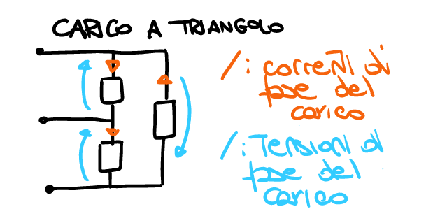

# Teoria

## Analisi nodale

L'analisi nodale è un metodo sistematico per risolvere circuiti (almeno quelli fatti fino alla quinta esercitazione)

### Fasi

0.  Scelgo un nodo di riferimento per il potenziale zero e lo indico
1.  Scrivo tutte le $v$ in funzione delle $u$
2.  Scrivo tutte le $i$ in funzione di $v$
3.  Scrivo le KCL per tutti i nodi (tranne quello di riferimento)

In caso non sia possibile ricavare la corrente di un ramo (si ha un bad-branch), al punto 2. indico la sua corrente come se fosse incognita e il punto 3. diventa come segue:

3.  Scrivo le KCL per tutti i nodi (tranne quello di riferimento) e le equazioni di tutti i componenti sui bad-branch

### Esempio

![][analisi_nodale]

Disegno il circuito segnando tutte le correnti, tensioni e potenziali di nodo.

![][analisi_nodale_1]

Il nodo scelto come potenziale di riferimento è $u_0$.

Eseguo i passaggi 1, 2 e 3.

![][analisi_nodale_2]

Sostituendo nelle equazioni del punto 3. ottengo tutte le relazioni tra i vari potenziali di nodo.

![][analisi_nodale_3]

Siccome $V_x = u_3$ allora devo trovare $u_3$ in funzione di tutto il resto.

![][analisi_nodale_4]

## Ricavare parametri della reppresentazione in (ad esempio) corrente per un doppio bipolo

Ricavare la rappresentazione in corrente di un doppio bipolo proprio significa ricavare i parametri necessari per completare la sua equazione descrittiva

$$
\begin{bmatrix}
  v_1 \\ v_2
\end{bmatrix} = \begin{bmatrix}
  r_{11} & r_{12} \\
  r_{21} & r_{22}
\end{bmatrix} \cdot \begin{bmatrix}
  i_1 \\ i_2
\end{bmatrix} + \begin{bmatrix}
  e_1 \\ e_2
\end{bmatrix} \implies \begin{cases}
  v_1 = r_{11} i_1 + r_{12} i_2 + e_1 \\
  v_2 = r_{21} i_1 + r_{22} i_2 + e_2
\end{cases}
$$

Ci sono due modi per arrivare alla conclusione: il primo è trovare $v_1$ e $v_2$ direttamente nella forma della loro equazione, il secondo è con le prove semplici.

Di seguito le formule per le prove semplici (sono tutte ricavabili dall'equazione descrittiva).

$$
e_1 = \left. v_1 \right|_{i_1 = 0, \,  i_2 = 0} \qquad e_1 = \left. v_2 \right|_{i_1 = 0, \, i_2 = 0} \\
r_{11} = \left. \frac{v_1}{i_1} \right|_{i_2 = 0, \, \text{gen. ind. off}} \qquad r_{12} = \left. \frac{v_1}{i_2} \right|_{i_1 = 0, \, \text{ged. ind. off}} \\
r_{21} = \left. \frac{v_2}{i_1} \right|_{i_2 = 0, \, \text{gen. ind. off}} \qquad r_{22} = \left. \frac{v_2}{i_2} \right|_{i_1 = 0, \, \text{gen. ind. off}}
$$

Per doppi bipoli propri controlati in "non corrente" basta sostituire le $i$ con le $v$ e viceversa. Il resto del procedimento è analogo.

## Risoluzione di equazioni differenziali

All'inizio sappiamo che 

$$
\begin{cases}
  \frac{dx}{dt} = \lambda x(t) + u(t) & \qquad \text{Equazione di stato} \\
  x(t_0) = x_0 & \qquad \text{Condizione iniziale}
\end{cases}
$$

Per iniziare, si risolve l'equazione omogenea associata

$$
\frac{dx}{dt} = \lambda x(t) \implies x(t) = ke^{\lambda(t - t_0)}
$$

Poi si trova l'integrale particolare

$$
\frac{dx_{ip}}{dt} = \lambda x_{ip}(t) + u(t)
$$

| $u(t)$      | $x_{ip}(t)$                                                      |
| ----------- | ---------------------------------------------------------------- |
| Costante    | Costante                                                         |
| Polinomio   | Polinomio dello stesso grado                                     |
| Sinusoidale | Combinazione lineare di $\sin$ e $\cos$ con la stessa pulsazione |

L'integrale particolare può essere non univoco: ne va bene uno qualsiasi.

Si procede scrivendo la soluzione nella forma

$$
x(t) = ke^{\lambda(t - t_0)} + x_{ip}(t)
$$

Per trovare $k$ si mette a sistema la soluzione con la condizione iniziale

$$
\begin{cases}
  x(t) = ke^{\lambda(t - t_0)} + x_{ip}(t) \\
  x(t_0) = x_0
\end{cases} \implies k = x_0 - x_{ip}(t_0)
$$

La soluzione completa è quindi scrivibile come

$$
x(t) = \underbrace{(x_0 - x_{ip}(t_0))e^{\lambda(t - t_0)}}_{\text{transitorio}} + \underbrace{x_{ip}(t)}_{\text{regime}} = \underbrace{x_0e^{\lambda(t - t_0)}}_{\text{frequenza libera}} + \underbrace{x_{ip}(t) - x_{ip}(t_0)e^{\lambda(t - t_0)}}_{\text{risposta forzata}}
$$

E' importante notare che

- il transitorio, all'infinito (solitamente $\Delta t > 5 \tau$), sparisce se $\lambda < 0$
- il regime si può calcolare coi fasori
- la frequenza libera non dipende dagli ingressi

Ci sono dei modi alternativi per trovare $\lambda$ e $u(t)$ in un circuito con 1 condensatore e ingressi costanti:

$\lambda = -\frac{1}{R_{eq}C}$ ove $R_{eq}$ è la resistenza equivalente vista dai morsetti ai capi del condensatore;
$u = -\frac{A_{eq}}{C}$ ove $A_{eq}$ è la corrente che passerebbe in un cortocircuito messo al posto del condensatore.

Per un induttore, il procedimento è analogo:

$\lambda = -\frac{-R_{eq}}{L}$ ove $R_{eq}$ è la resistenza vista dai morsetti ai capi dell'induttore
$u = \frac{E_{eq}}{L}$ ove $E_{eq}$ è la tensione che si misurerebbe su un cirtuito aperto messo al posto dell'induttore.

## Funzione di rete (anche nota come Funzione di trasferimento)

Una funzione di rete è un rapporto tra un'uscita ed un ingresso: se ci sono più ingressi se ne considera uno solo.

## Rifasamento

> Il fattore di potenza non è un contadino della Basilicata.
> \- _F. Bizzarri_, 2023

Per comprendere il rifasamento è necessario comprendere prima alcuni concetti.

$$
\hat A = P + jQ \implies \begin{cases}
  P = A \cos \varphi = \frac 12 |\overline v| |\overline i| \cos \varphi \\
  Q = A \sin \varphi = \frac 12 |\overline v| |\overline i| \sin \varphi
\end{cases}
$$

$\cos \varphi$ viene anche chiamato _fattore di potenza_.

![][triangolo_potenze]

Se $Q \gt 0$ allora si dice che $\cos \varphi$ è in ritardo (proprio perchè, girando in senso antiorario, $\hat A$ è più avanti di $P = A \cos \varphi$) e che il carico è resistivo.induttivo; al contrario, se $Q \lt 0$ si dice che $\cos \varphi$ è in anticipo e il carico è resistivo-capacitivo.

Il rifasamento consiste nell'installazione di un condensatore, solitamente in parallelo ad un carico resistivo-capacitivo in modo da portare il fattore di potenza più vicino ad 1 (con conseguente risparmio sulla voce "spese di trasporto" in bolletta e tensione più stabile).

### Esempio

![][triangolo_potenze_esempio]

Prima del rifasamento si ha che:

![][triangolo_pre_rifasamento]

$$
\hat A_1 = \hat A_2 \qquad P_1 = P_2 \qquad Q_1 = Q_2 \\
\varphi_1 = \arctg \left( \frac{Q_2}{P_2} \right) \simeq 1.05 \, rad \\
\cos \varphi_1 \simeq 0.50
$$

Dopo aver aggiunto il condensatore di rifasamento di ha che:

![][triangolo_post_rifasamento]

$$
\hat A_1 = \hat A_2 + Q_c \qquad P_1 = P_2 \qquad Q_1 = Q_2 + Q_c \\
Q_c \lt 0 \qquad \text{è capacitivo} \\
\varphi_2 = \arctan \left( \frac{Q_2}{P_2} \right) \simeq 0.64 \, rad \qquad \cos \varphi_2 \simeq 0.8
$$

Per trovare la capacità del condensatore di rifasamento si procede come segue (inclusa anche dimostrazione):

$$
Q_c = Q_2 - Q_1 = P_1(\tan \varphi_2 - \varphi_1) \simeq -4 \, kVAr
$$

Sappiamo che 

$$
\hat A = \frac{1}{2} \overline V (\overline i)^* = \frac{1}{2} Z |\overline i|^2 = \frac{1}{2} \frac{|\overline V^2|}{Z^*}
$$

e, siccome parliamo di un condensatore, allora

$$
\hat A = \frac{1}{2} \frac{|\overline V|^2}{\left( \frac{1}{j \omega C} \right)^*} = - \frac{1}{2} j \omega C |\overline V|^2 \implies Q_c = \Im{\hat A} = -\frac{1}{2} \omega C |\overline V|^2 \implies C = \frac{-2Q_c}{\omega |\overline V|^2} \simeq 250 \, \mu F
$$

## Elettromagnetismo

Tutti gli esercizi sui campi magnetici e l'elettromagnetismo si basano sulla legge di Faraday-Henry:

$$
- \oint_\gamma \vec E \cdot d \vec l = \frac{d}{dt} \int_S \vec B \cdot \hat n \cdot dS
$$

A sinistra dell'uguale si ha la circuitazione del campo  elettrico $\vec E$ in un percorso $\gamma$. Il verso di percorrenza di questo percorso influenza la direzione del versore normale $\hat n$ (sostanzialmente è la somma delle tensioni prese per il verso di percorrenza scelto).

A destra dell'uguale si ha la derivata del flusso magnetico (che si misura in Weber: $1 \, W_b = 1 \, Tm^2$).

Il flusso magnetico è l'integrale di superficie del campo magnetico $\vec B$, moltiplicato per il versore normale $\hat n$.

$\vec B$ si misura in Tesla: $T$

La superficie $S$ è quella racchiusa dal percorso $\gamma$.

Per rendere i conti più semplici, $\vec B$ si può portare fuori dall'integrale se non dipende dalla superficie.

In generale la legge di cui sopra, descrive il fatto che ogni volta che si ha variazione del flusso magnetico, si viene a creare una forza elettromotrice che si oppone alle variazioni che l'hanno creata.

3 sono i casi che portano alla creazione di forza elettromotrice:

1.  $\vec B$ varia nel tempo
2.  $S$ varia nel tempo
3.  Il prodotto scalare (quindi, ad esempio, l'orientazione della superficie rispetto al campo) varia nel tempo.

Il campo magnetico generato da un filo è radiale e varia a seconda della distanza dal filo a cui lo si misura:

$$
B = \frac{\mu i}{2 \pi r}
$$

ove $i$ è la corrente che passa nel filo e $r$  la distanza dal filo a cui si vuole calcolare il $B$.

Nel vuoto $\mu_0 = 4 \cdot 10^{-7} \, H/m$

## Reti trifase

Tutte le reti trifase considerate saranno _simmetriche ed equilibrate_ mentre tutti i fasori considerati sono riferiti al loro valore efficace (non come quelli considerati altrove che si riferiscono al valore massimo).

Per una grandezza sinusoidale $x(t) = X_m \cos(\omega t + \varphi)$, il valore efficace si calcola come $X_{eff} = X_m / \sqrt{2}$

Anche la rappresentazione fasoriale viene modificata:

$$
x(t) = X_m \cos(\omega t + \varphi) \implies \overline x = X_{eff} e^{j \varphi} = \frac{X_m}{\sqrt 2} e^{j \varphi} \quad x(t) = \Re \{ \sqrt 2 \overline x e^{j \omega t} \}
$$

Cambia anche il modo di calcolare la potenza assorbita:

$$
\hat A = P + jQ = \begin{cases}
  \frac 12 \overline v (\overline i)^* & \qquad \text{Fasori riferiti al valore massimo} \\
  \overline v (\overline i)^* & \qquad \text{Fasori riferiti al valore efficace}
\end{cases}
$$

### Tensioni trifase

In un sistema trifase, ci sono 3 tensioni sinusoidali sfasate di 120 ciascuna.

Ci sono 2 tipologie di sequenze: positiva (abc) e negativa (acb).

Le tensioni in sequenza positiva (abc) sono descritte come segue

$$
\begin{align*}
  V_a(t) &= V_0 \cos \left( \omega t + \varphi_0 \right) \\
  V_b(t) &= V_0 \cos \left( \omega t + \varphi_0 - \frac 23 \pi \right) \\
  V_c(t) &= V_0 \cos \left( \omega t + \varphi_0 - \frac 43 \pi \right) = V_0 \cos \left( \omega t + \varphi_0 + \frac 23 \pi \right)
\end{align*}
$$

mentre le tensioni in sequenza negativa (acb) sono descritte come segue

$$
\begin{align*}
  V_a(t) &= V_0 \cos \left( \omega t + \varphi_0 \right) \\
  V_c(t) &= V_0 \cos \left( \omega t + \varphi_0 - \frac 23 \pi \right) \\
  V_b(t) &= V_0 \cos \left( \omega t + \varphi_0 - \frac 43 \pi \right) = V_0 \cos \left( \omega t + \varphi_0 + \frac 23 \pi \right) \\
\end{align*}
$$

Per entrambe vale la proprietà (molto importante) che $V_a(t) + V_b(t) + V_c(t) = 0$, quindi non serve il filo di terra!

I generatori di tensione possono essere configurati a stella o a triangolo:

![Configurazione a stella: è evidenziato il cosiddetto \"Centro stella\"][tensioni_stella]

![Configurazione a triangolo][tensioni_triangolo]

Si può passare da uno all'altro ricordandosi questo disegno:

<!--  -->

![][conversione_stella_triangolo]

Ad esempio, $V_{ca} = V_{cn} - V_{an}$

Nel caso di sequenza positiva, le tensioni di linea (ab, bc, ca) sono scalate di un fattore $\sqrt 3$ rispetto alle corrispondenti tensioni di fase (an, bn, cn) e sono in anticipo di $\pi / 6$.

Anche nel caso di sequenza negativa, le tensioni di linea sono scalate di un fattore $\sqrt 3$ rispetto alle corrispondenti tensioni di fase ma al posto che essere in anticipo, sono in ritardo di $\pi / 6$.

### Carichi trifase

Anche i carichi (solitamente resistenze, capicità e induttanze) possono essere in configurazione a stella e a triangolo.

![Un carico a stella][carico_stella]

![Un carico a triangolo][carico_triangolo]

Tra due carichi, uno a stella e uno a triangolo, equivalenti, vale la seguente relazione:

$$
Z_\Delta = 3Z_Y
$$

Si dice che il carico è bilanciato quanto tutte e tre le parti che lo compongono sono di ugual valore.

### Connessioni tra elementi trifase

Abbiamo già introdotto le tensioni di linea e le tensioni di fase parlando di generatori trivase, ora segue una definizione più rigorosa.

Tensione di linea
: Le tensioni tra i conduttori della linea ($V_{ab}$, $V_{bc}$, $V_{ca}$).

Corrente di linea
: Le correnti che scorrono nei tre conduttori ($i_a$, $i_b$, $i_c$).

Tensione e corrente di fase
: La tensione ai capi di un singolo bipolo (sia esso un generatore od un carico) e la corrente che lo attraversa.

Di seguito alcuni esempi:

### Studio di un circuito trifase

Per poter studiare e semplificare un circuito trifase sono necessari due passaggi preventivi.

Prima di tutto tutti i componenti in configurazione a triangolo devono essere trasformati in configurazione a stella secondo le formule esposte sopra, dopodiché, si sceglie una fase e tutti i componenti e le connessioni appartenenti a quella fase vengono riportati in un nuovo circuito e tutti i centri-stella devono essere collegati da un corto circuito.

Il circuito appena ottenuto può essere studiato in maniera semplice e tutti i risultati vengono poi, con gli adeguati sfasamenti, applicati al circuito trifase originario.

Se nella procedura si perdono alcune informazioni, le si può tranquillamente recuperare procedendo a ritroso.

Unica eccezione a questa regola sono i circuiti completamente composti da collegamenti a triangolo.

![In circuiti del genere, bipoli corrispondenti hanno le stesse tensioni.][delta-delta]

Segue esempio.

### Esempio di studio di circuito trifase

Il circuito iniziale è molto semplice

Si procede a trasformare tutti i collegamenti a triangolo in collegamenti a stella.

Si collegano con un corto tutti i centri-stella.

Infine, si procede a scegliere una fase e a riportarla da sola.

### Potenza trifase

Siano $\theta = \theta_V - \theta_I$ lo sfasamento tra tensione e corrente, $V_p$ la tensione di fase e $I_p$ la corrente di fase.

Per una singola fase vale che

$$
\hat A_p = P_p + jQ_p = V_p I_p \cos \theta + j V_p I_p \sin \theta
$$

Conseguentemente, per un componente trifase

$$
\hat A_{3p} = P_{3p} + j Q_{3p} = 3P_p + j 3Q_p = 3 \hat A_p
$$

## Circuiti magnetici

In un circuito magnetico, al posto del flusso elettrico, si studia il flusso magnetico, studando il flusso elettrico di un circuito elettrico equivalente a cui si arriva con adeguate trasformazioni.

In un induttore generico in convenzione degli utilizzatori vale che

$$
V = L \frac{di}{dt}
$$

ora, invece, vengono introdotte alcune nuove quantità:

- $N$: numero di avvolgimenti
- $\psi \, [W_b]$: flusso
- $\phi = L i = N \psi \, [W_b]$: flusso concatenato, l'equlvalente della corrente elettrica

Un pezzetto di materiale conduttore di flusso magnetico può essere assimilato ad una resistenza:

$S$ è la sezione del materiale, $l$ è la lunghezza, $\mu$ è la sua permeabilità magnetica.
$\mathscr R$ è la riluttanza del pezzo mi materiale scelto ed è assimilabile alla resistenza. Si misura un $H^{-1}$

$$
\mathscr R = \frac{l}{\mu S}
$$

Se il materiale è a forma di torio, la riluttanza si calcola come

$$
\mathscr R =  \frac{2 \pi R}{\mu_0 \mu_r \pi r^2}
$$

ove $R$ è il raggio del toro e $r$ il raggio della sua sezione

La permeabilità magnetica di un materiale si ottiene moltiplicando la sua permeabilità relativa con quella del vuoto:

$$
\mu = \mu_R \mu_0 \qquad \mu_0 = 4 \pi \cdot 10^{-7} \frac H m
$$

Allo scopo di controllare più precisamente la riluttanza si un matteriale, si può utilizzare un _traferro_: un taglio nel materiale nel quale c'è solo aria.

Siccome $\mu_0 << \mu$ allora se, in serie alla riluttanza dovuta al traferro, compaiono altre riluttanze non dovute a traferri, queste ultime possono essere trascurate.

Allo stesso modo, un pezzetto di conduttore con avvolto attorno un avvolgimento in cui passa corrente è assimilabile ad un generatore indipendente di tensione in serie ad una resistenza.

Tralasciando tutti i ragionamenti sul verso della tensione e delle forze elettro-motrici e magneto-motrici, che risulterebbero in una serie di meno che si annullerebbero a vicenda, la direzione della tensione del generatore indipendente assimilabile segue la regola della mano destra e la sua intensità è pari a $v = N i$

Anche nei circuiti magnetici convertiti ad elettrici valgono KVL, KCL e una specie di legge di Ohm: $v = \mathscr R \cdot \psi$

### Doppio bipolo induttivo

E' possibile trovarsi di fronte ad un doppio bipolo composto da due induttori accoppiato avvolti attorno allo stesso circuito magentico: in questo caso, è possibile trasformarlo in due induttori mutualmente accoppiati sapendo che

$$
\begin{bmatrix}
 \varphi_1 \\
 \varphi_2
\end{bmatrix} = \begin{bmatrix}
  L_1 & M \\
  M & L_2
\end{bmatrix} \cdot \begin{bmatrix}
  i_1 \\
  i_2
\end{bmatrix} \longrightarrow \begin{bmatrix}
  v_1 \\
  v_2
\end{bmatrix} = \begin{bmatrix}
  L_1 & M \\
  M & L_2
\end{bmatrix} \cdot \begin{bmatrix}
  \frac{di_1}{dt} \\
  \frac{di_2}{dt}
\end{bmatrix}
$$

Il segno delle varie $M$ si può calcolare a priori, mantenendo attivo un solo induttore per volta e vedendo il segno con cui il flusso magnetico passa nei punti dove ci sarebbero gli altri induttori.

Se accendendo gli altri induttori si otterrebbe interferenza costruttiva allora $M \gt 0$ altrimenti $M \lt 0$

# Formule comode

## Potenza assorbita di un doppio bipolo proprio

$$
P_a^{DBP} = v_1 i_1 + v_2   i_2
$$

## Massima potenza assorbita da un resistore

Il resistore $R_2$ assorbe la massima potenza quando il suo valore è pari a quello di $R_1$.

![][max_potenza]

La potenza assorrbita da $R_1$ (che è uguale a quella assorbita da $R_2$) si calcola come segue

$$
P = \frac{E^2}{4R_1}
$$

### Massima potenza assorbita da un'impedenza

Si consideri, nell'immagine precedente, di avere le impedenze $Z_1$ e $Z_2$ al posto delle resistenze $R_1$ e $R_2$.

L'impedenza $Z_2$ assorbe la massima potenza se $Z_2 = (Z_1)^*$.

La potenza assorbita da ciascuno delle due impedenze si calcola come segue.

$$
\hat A = \frac 12 \frac{|E_{th}^2|} {4 \Re\{Z_{th}\}}
$$

## Potenza immagazzinata da condensatori e induttori

$$
W_c(t) = \frac 12 C V_c^2(t) \qquad W_l(t) = \frac 12 L i_l^2(t)
$$

## pulsazione di risonanza

La frequenza di risonanza si calcola come

$$
\omega_r = \frac{1}{\sqrt{LC}}
$$

per impedenze in serie e parallelo.

Se le impedenze non sono ne in serie ne in parallelo allora la pulsazione di risonanza si calcola imponendo che la parte immaginaria dell'impedenza equivalente sia uguale a zero.

Sia $\omega$ la pulsazione fornita, allora

$$
\begin{align*}
  \omega \lt \omega_r & \iff \Im \{ Z_{eq} \} \lt 0 & \implies \text{Impedenza ohmico-capacitiva} \\
  \omega = \omega_r & \iff \Im \{ Z_{eq} \} = 0 & \implies \text{Impedenza puramente ohmica} \\
  \omega \gt \omega_r & \iff \Im \{ Z_{eq} \} > 0 & \implies \text{Impedenza ohmico-induttiva} \\
\end{align*}
$$

## Trasformazione dal dominio delle frequenze al dominio dei fasori e viceversa e derivata di un fasore

Sia $v(t) = V \cos(\omega t + \phi)$ allora $\overline{v} = V e^{j \phi}$.

Se non si ha un coseno ma un seno, si possono seguire due strade:

- si converte il seno in coseno sapendo che $\sin (x + \frac{\pi}{2}) = \cos x$
- si converte in fasore come se fosse coseno e poi lo si ruota di $\frac{\pi}{2}$ in senso orario moltiplicandolo per $-j$

Per ritornare nel dominio delle frequenze

$$
\overline v \rightarrow v(t) = \Re \{ \overline v e^{j \omega t} \}
$$

Per derivare un fasore, lo si moltiplica per $j \omega$.

$$
\overline v \rightarrow \overline v' = j \omega \overline v
$$

## Teorema di Tellegen

$$
\sum P^a_i = 0
$$

## Teorema di Bucherot

$$
\sum \hat A_i = 0 \implies \begin{cases}
  \sum P_i = 0 \\
  \sum Q_i = 0
\end{cases}
$$

## Potenza complessa

$$
\hat A = \frac 12 \overline v (\overline i) ^ *
$$

## Costante di tempo tau

$$
\tau = \frac{1}{|\lambda|}
$$

# Componenti ed equazioni caratteristiche

## Trasferitore ideale di potenza

![][trasferitore_idelae_potenza]

$$
\begin{cases}
  v_1 \colon v_2 = n \colon k \\
  v_1 i_1 + v_2 i_2 = 0
\end{cases} \implies \begin{cases}
  v_1 = \frac{n}{k} v_2 \\
  i_1 = - \frac{k}{n} i_2
\end{cases}
$$

Il trasferitore ideale di potenza è controllabile con basi miste, non con base corrente o base tensione.

## Amplificatore operazionale

![][opamp]

$$
i_1 = i_2 = 0 \qquad
v_{+-} = 0
$$

## Mutui induttori

$$
\begin{bmatrix}
  v_1 \\
  v_2
\end{bmatrix} = \begin{bmatrix}
  L_1 & M \\
  M & L_2
\end{bmatrix} \frac{d}{dt} \begin{bmatrix}
  i_1 \\
  i_2
\end{bmatrix} \rightarrow \begin{bmatrix}
  \overline v_1 \\
  \overline v_2
\end{bmatrix} = \begin{bmatrix}
  L_1 & M \\
  M & L_2
\end{bmatrix} \frac{d}{dt} \begin{bmatrix}
  \overline i_1 \\
  \overline i_2
\end{bmatrix} = \begin{bmatrix}
  j \omega L_1 & j \omega L \\
  j \omega M & j \omega L_2
\end{bmatrix} \cdot \begin{bmatrix}
  \overline i_1 \\
  \overline i_2
\end{bmatrix}
$$

Se non è fornita $M$, è fornito il coefficiente $k$:

$$
M = k \sqrt{l_1 L_2}
$$

I mutui induttori possono essere disposti in 4 modi diversi:

E' possibile ricavare l'indutanza equivalente di ciascuna disposizione imponendo la corrente e trovando la tensione.

Segue esempio per la serie equiversa.

So che $\overline i_1 = \overline i_2 = \overline i$.

Dall'equazione costitutiva dei mutui induttori ricavo che

$$
\begin{cases}
  \overline v_1 = j \omega (L_1 + M) \overline i \\
  \overline v_2 = j \omega (M + L_2) \overline i
\end{cases}
$$

Dalla maglia ottengo che $\overline v = \overline v_1 + \overline v_2$, di conseguenza

$$
\overline v = \overline v_1 + \overline v_2 = j \omega (L_1 + M + L_2 + M) \overline i = j \omega (L_1 + L_2 + 2M) \overline i \\
Z_{eq} = \frac {\overline v} {\overline i} = j \omega \underbrace{(L_1 + L_2 + 2M)}_{=L_{eq}}
$$

Il procedimento è analogo per ogni altra configurazione.

[analisi_nodale]: assets/analisi_nodale/0.png
[analisi_nodale_1]: assets/analisi_nodale/1.png
[analisi_nodale_2]: assets/analisi_nodale/2.png
[analisi_nodale_3]: assets/analisi_nodale/3.png
[analisi_nodale_4]: assets/analisi_nodale/4.png
[triangolo_potenze]: assets/triangolo_potenze/triangolo_potenze.png
[triangolo_potenze_esempio]: assets/triangolo_potenze/esempip.png
[triangolo_pre_rifasamento]: assets/triangolo_potenze/pre_rifasamento.png
[triangolo_post_rifasamento]: assets/triangolo_potenze/post_rifasamento.png
[tensioni_stella]: assets/trifase/tensioni_stella.png
[tensioni_triangolo]: assets/trifase/tensioni_triangolo.png
[conversione_stella_triangolo]: assets/trifase/conversione.png
[carico_stella]: assets/trifase/carico_stella.png
[carico_triangolo]: assets/trifase/carico_triangolo.png
[max_potenza]: assets/max_potenza/max_potenza.png
[trasferitore_idelae_potenza]: assets/componenti/trasferitore_ideale_di_potenza.png
[opamp]: assets/componenti/opamp.png
[delta-delta]: assets/trifase/delta-delta.png