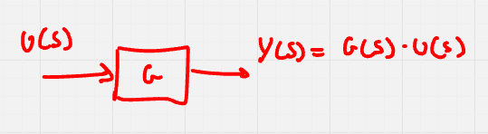

# Classificazione di sistemi

Un sistema è una rappresentazione di un oggetto fisico che interagisce col mondo esterno attraverso un vettore di input ($u(t)$) e un vettore di output ($y(t)$). Lo stato del sistema è memorizzato dentro il vettore di stato ($x(t)$)

Un sistema è detto a **tempo continuo** se è della forma

$$
\frac{dx(t)}{dt} = f(x(t), u(t), t) \quad y(t) = g(x(t), u(t), t) \qquad t \in \mathbb{R}
$$

mentre è detto a **tempo discreto** se è della forma

$$
x(k + 1) = f(x(k), u(k), k) \quad y(k) = g(x(k), u(k), k) \qquad k \in \mathbb{N} 
$$

_D'ora in poi, si considereranno equivalenti le notazioni $\frac{dx(t)}{dt}$ e $\dot x(t)$_

Se l'uscita di un sistema dipende in ogni istante dal solo ingresso allora viene detto **statico**, altrimenti è **dinamico** (nel primo caso, il sistema non è dotato di stato).

Se un sistema ha esattamente un solo input ed un solo output, allora è detto **SISO**, altrimenti è **MIMO**.

Se l'uscita di un sistema dipende sia dallo stato che dall'ingresso, allora tale sistema è detto **proprio**, altrimenti, se l'uscita dipende solamente dallo stato, è detto **strettamente proprio**.

Se le funzioni $f$ e $g$ non dipendono strettamente dal parametro $t$ o $k$, allora il sistema viene detto **tempo-invariante** o **stazionario** , altrimenti è **tempo-variante** o **dinamico**.

Se il sistema è dinamico, è possibile studiarne gli equilibri: un equilibrio è una coppia $(\overline x(t), \overline u(t))$ tale che

$$
\frac{d \overline x(t)}{dt} = 0 \quad f(\overline x(t), \overline u(x)) = 0 \qquad \forall t
$$

La stabilità di un equilibrio determina la risposta del sistema in equilibrio ad una perturbazione.

Ci sono tre tipologie di equilibrio:

- equilibrio **stabile**: in risposta alla perturbazione, lo stato non si allontana più di una zona predefinita
- equilibrio **instabile**: in risposta alla perturbazione, lo stato si allontana sempre di più
- equilibrio **asintoticamente stabile**: dopo una perturbazione, all'infinito, lo stato tende a ritornare nella posizione in cui si trovava prima della perturbazione

Se le funzioni $f$ e $g$ sono funzioni lineari su $x(t)$ e $u(t)$ (vale anche per il tempo discreto), allora il sistema viene detto **lineare** e può essere scritto nella forma

$$
f(x(t), u(t)) = A \cdot x(t) + B \cdot u(t) \\
g(x(t), u(t)) = C \cdot x(t) + D \cdot u(t)
$$

con $A \in \mathcal{M}_\mathbb{R}(n)$, $B \in \mathcal{M}_\mathbb{R}(n, m)$, $C \in \mathcal{M}_\mathbb{R}(p, n)$ e $D \in \mathcal{M}_\mathbb{R}(p, m)$.

# Analisi di sistemi a tempo continuo

## Sistemi LTI

Un sistema **LTI** (Lineare, Tempo-Invariante) è un sistema della forma

$$
\frac{dx(t)}{dt} = Ax(t) + Bu(t) \quad y(t) = Cx(t) + Du(t)
$$

Dato uno stato iniziale $x(t_0) = x_0$, i movimenti dello stato e dell'uscita si calcolano come segue (**formula di Lagrange**):

$$
x(t) = e^{A(t - t_0)} x(t_0) + \underbrace{\int_{t_0}^{t} e^{A(t - \tau)}B u(\tau) \, d\tau}_{\text{Convoluzione}} \qquad t \ge t_0 \\
y(t) = Ce^{A(t - t_0)} x(t_0) + C \int_{t_0}^t e^{A(t - \tau)}Bu(\tau) \, d\tau + Du(t) \qquad t \ge t_0
$$

Come si può notare, per lo studio dei sistemi LTI possono risultare comode le proprietà della matrice esponenziale: vedere [Analisi II](https://appunti.titilda.org/Analisi%202/index.html#esponenziale-di-una-matrice) oppure l'[appendice in fondo](#proprietà-matrice-esponenziale).

Di un sistema, è possibile studiare separatamente il **movimento libero** (spegnendo gli ingressi) e il **movimento forzato** (imponendo stato iniziale nullo).

I due movimenti costituiscono i due addendi nella formula di Lagrange.

### Meta variabili

Per sfruttare appieno le potenzialità delle matrici esponenziali, è necessario che la matrice $A$ sia diagonale dunque si trasforma il sistema dato in uno equivalente che opera su meta-variabili non fisiche con matrici $A', B', C', D'$ di cui $A'$ è diagonale.

Sia $T$ una matrice non singolare e sia $z(t) = Tx(t)$ lo stato del sistema equivalente, allora

$$
x(t) = T^{-1}z(t) \\
\dot z(t) = T \dot x(t) = T(Ax(t) + Bx(t)) = TAT^{-1}z(t) + TBu(t) = A'z(t) + B'u(t) \\
y(t) = Cx(t) + Du(t) = CT^{-1}z(t) + Du(t)
$$

da cui segue che 

$$
\begin{cases}
    A' = TAT^{-1} \\
    B' = TB \\
    C' = CT^{-1} \\
    D' = D
\end{cases}
$$

Ottenere la matrice $T$ è un semplice esercizio di algebra lineare: se $A$ è diagonalizzabile, $A'$ è la matrice diagonale con composta dagli autovalori di $A$ e $T^{-1}$ è la matrice diagonalizzante ottenuta affiancando gli autovettori di $A$.

### Risoluzione di casi particolari

#### Sistemi con matrice $A$ diagonale
Se si vuole studiare il movimento libero di un sistema con $A$ diagonale, è sufficiente calcolare $x(t) = e^{At}x_0$ con $t_0 = 0$.

#### Sistemi con matrice $A$ triangolare

Se si vuole studiare il movimento libero di un sistema con matrice $A$ triangolare superiore (analogo per matrici triangolari inferiori), serve utilizzare più volte volte la formula di Lagrange; segue algoritmo:

1. Siano
   $$
    x(t) = \begin{bmatrix}
        x_1(t) \\ x_2(t) \\ \vdots \\ x_n(t)
    \end{bmatrix} \quad \dot x(t) = \begin{bmatrix}
        \dot x_1(t) \\ \dot x_2(t) \\ \vdots \\ \dot x_n(t)
    \end{bmatrix}
   $$
   il vettore di stato e la sua derivata e $A = [a_{ij}]$ la matrice $A$.
2. Si calcoli $x_n(t) = e^{a_{nn}t}x_n(0)$
3. $\dot x_{n-1}$ dipende da $x_{n-1}$ e da $x_n$ dunque si tratta $x_n$ come ingresso virtuale e si calcola $x_{n-1}$ con la formula di Lagrange.
4. In generale, si procede a ritroso, calcolando una variabile per volta con la formula di Lagrange e considerando tutte le altre variabili di stato da cui dipende come ingresso virtuale. 

#### sistemi con matrice $A$ diagonalizzabile

Se si vuole studiare il movimento libero di un sistema con matrice $A$ diagonalizzabile, si sfrutta la tecnica delle meta variabili descritto appena sopra ottenendo che

$$
T^{-1} = \left[ v_1 \middle| v_2 \middle| \dots \middle| v_n \right] \\
\dot z = TAT^{-1}z = \text{diag}(\lambda_1, \lambda_2, \dots, \lambda_n) z
$$

da cui

$$
z(t) = \begin{bmatrix}
    e^{\lambda_1 t} z_1(0) \\ e^{\lambda_2 t} z_2(0) \\ \vdots \\ e^{\lambda_n t} z_n(0)
\end{bmatrix} = e^{\text{diag}(\lambda_1, \lambda_2, \dots, \lambda_n)}z(0)
$$

Successivamente si torna allo stato in $x$:

$$
x(t) = T^{-1}z(t) = \underbrace{T^{-1}e^{\text{diag}(\lambda_1, \lambda_2, \dots, \lambda_n)}T}_{e^{At}}x(0)
$$

da cui segue che il movimento libero per un sistema LTI con matrice $A$ diagonalizzabile è 

$$
x(t) = T^{-1} \text{diag}(e^{\lambda_1 t}, e^{\lambda_2 t}, \dots, e^{\lambda_n t}) x_0
$$

I termini che compaiono nella matrice al centro sono detti **modi**.

Se lo stato iniziale è un autovettore, il movimento libero è della forma $x(t) = v e^{\lambda t}$ dove $v$ è l'autovettore e $\lambda$ è l'autovalore corrispondente.

#### Sistemi con matrice $A$ non diagonalizzabile

Nel caso in cui la matrice $A$ non sia diagonalizzabile, $\exists T_J \in \mathcal{M}_\mathbb{R}(n) : A_J = T_JAT_J^{-1}$ tale che $A_J$ sia una matrice di blocchi di Jordan con gli autovalori di $A$ sulla diagonale (non ci interessa conoscere $T_J$, ci basta sapere che esiste):

$$
A_J = \underbrace{\left[ \begin{array}{c|c}
    \begin{matrix}
        \lambda_1 & 1 & 0 \\ 0 & \lambda_1 & 1 \\ 0 & 0 & \lambda_1
    \end{matrix} & 0 \\
    \hline
    0 & \begin{array}{c|c}
        \lambda_2 & 0 \\
        \hline
        0 & \begin{array}{cc}
            \lambda_3 & 1 \\
            0 & \lambda_3
        \end{array}
    \end{array}
\end{array} \right]}_{\text{Matrice esemplare di blocchi di Jordan}} \implies e^{A_Jt} = \begin{bmatrix}
    e^{\lambda t} & t e^{\lambda t} & \frac{t^2}{2!} e^{\lambda t} \\
    0 & e^{\lambda t} & t e^{\lambda t} \\
    0 & 0 & e^{\lambda t}
\end{bmatrix}
$$

### Studio degli equilibri

Una volta trovati i modi del sistema sotto esame, è possibile studiarne gli equilibri.

I punti di equilibrio sono le soluzioni dell'equazione

$$
A \overline x + B \overline u = 0
$$

Se $A$ non è invertibile, tale equazione può avere infinite soluzioni (se $-Bu \in \text{Cols}(A)$) oppure nessuna.

Se $A$ è invertibile, la soluzione esiste sempre ed è della forma

$$
\overline x = -A^{-1}B \overline u
$$

Nel caso di sistemi con più punti di equilibrio, un equilibrio $(\overline x, \overline u)$ è **stabile** se e solo se tutti gli equilibri $(x_i, u_i)$ sono stabili quindi se $\Re(\lambda_i) \le 0 \ \forall i$ e $\Re(\lambda_i) = 0 \implies \lambda_i$ è regolare.

Un sistema LTI è **asintoticamente stabile** se $\Re(\lambda_i) \lt 0 \ \forall i$.

Un sistema LTI è **instabile** se $\exists \lambda_i : Re(\lambda_i) \gt 0 \lor \Re(\lambda_i) = 0 \land \lambda_i$ non è regolare.

Sia
$$
\varphi(\lambda) = \varphi_0 \lambda^n + \varphi_1 \lambda^{n-1} + \dots + \varphi_{n-1} \lambda + \varphi_n = \varphi_0 \prod_{i=1}^n (\lambda - \lambda_i)
$$

il polinomio caratteristico di $A$.

Se $\varphi_0 \gt 0$ allora $\Re(\lambda_i) \lt 0 \ \forall i \implies \forall i \ \varphi_i \gt 0$

Una condizione necessaria per avere stabilità asintotica è che tutti i coefficienti $\varphi_i$ abbiano tutti lo stesso segno.

Per sistemi di alto ordine, è possibile applicare un procedimento meccanico che consente, con un numero limitato di passaggi, di distinguere tra sistemi asintoticamente stabili ed instabili: il criterio do Routh.

Dato un polinomio caratteristico per un sistema di ordine $n$, si inizia mettendo, in una tabella, sulla prima riga tutti i coefficienti di indice pari e sulla seconda tutti i coefficienti di ordine dispari. Entrambe le righe sono seguite da infiniti zeri. Successivamente si prenda la matrice ottenuta affiancando la prima e la seconda colonna, se ne calcoli il determinante e lo si divida per il numero in basso a sinistra della matrice appena ottenuta. Si faccia lo stesso con la prima e la terza riga, poi con la prima e la quarta e cos' via fino ad arrivare agli infiniti zeri. Con i numeri ottenuti, si componga una riga poi aggiunta alla tabella. Si ignori la prima riga e si ripeta il procedimento fino ad ottenere un solo numero seguito da infiniti zeri.

Si dis-ignorino tutte le righe ignorate:

- se tutti gli elementi della prima colonna hanno lo stesso segno allora il sistema è asintoticamente stabile
- se, percorrendo la prima colonna dall'alto verso il basso, si incontrano dei cambiamenti di segno, il sistema è instabile e il numero di cambiamenti di segno corrisponde al numero di autovalori con parte reale positiva
- se c'è uno zero nella prima colonna, vuol dire che ci sono autovalori puramente immaginari e non è possibile distinguere se il sistema in questione sia semplicemente stabile o instabile con blocchi di Jordan
  
## Sistemi nonlineari, tempo-invarianti

Si vuole studiare il movimento dello stato di un sistema nonlineare vicino ai punti di equilibrio:

$$
u(t) = \overline u + \delta u(t) \quad x(t) = \overline x + \delta x(t) \quad y(t) = \overline y + \delta y(t)
$$

Per fare ciò si deve linearizzare il sistema nell'intorno di ciascun punto di equilibrio:

$$
\dot{\delta x}(t) = \underbrace{\left. \frac{\partial f}{\partial x} \right|_{\overline x, \overline u}}_{A} \delta x(t) + \underbrace{\left. \frac{\partial f}{\partial u} \right|_{\overline x, \overline u}}_{B} \delta u(t) \\
\delta y(t) = \underbrace{\left. \frac{\partial g}{\partial x} \right|_{\overline x, \overline u}}_{C} \delta x(t) + \underbrace{\left. \frac{\partial g}{\partial u} \right|_{\overline x, \overline u}}_{D} \delta u(t)
$$

Una volta fatto ciò, si vanno ad analizzare gli autovalori della matrice $A$:

- se tutti gli autovalori hanno parte reale negativa, vi è stabilità asintotica
- se esiste un autovalore a parte reale positiva, vi è instabilità
- se vi sono autovalori puramente immaginari, non si può dire nulla

Per un sistema di ordine 1, un po' come nella [linea delle fasi](https://appunti.titilda.org/Analisi%202/index.html#studio-qualitativo-di-edo-del-primo-ordine), se $\frac{\partial f}{\partial x} \gt 0$ allora si tende ad andare a destra mentre se $\frac{\partial f}{\partial x} \lt 0$ allora si tende ad andare a sinistra. I punti in cui $\frac{\partial f}{\partial x} = 0$ sono i punti di equilibrio e sono stabili o meno a seconda della direzione in cui tendono ad andare le derivate come visto prima (il tutto è valido per un $\overline u$ fissato).

# Analisi di sistemi a tempo discreto

Mentre i modelli a tempo continuo utilizzano la variazione dello stato, i modelli a tempo discreto ne analizzano direttamente l'evoluzione. Continuano a valere le stesse categorizzazioni che valevano per i sistemi a tempo continuo.

La condizione di equilibrio è la seguente:

$$
\overline x = f(\overline x, \overline u) \quad \overline y = g(\overline x, \overline u)
$$

Noti lo stato al tempo $k = 0$ ($x(0) = x_0$) e $u(k)$ allora 

$$
x(k) = A^k x(0) + \sum_{i=0}^{k-1} A^{k-i-1}Bu(i) \\
y(k) = CA^kx(0) + C \sum_{i=0}^{k-1}A^{k-i-1}Bu(i) + Du(k)
$$

Come per i sistemi a tempo continuo, è possibile ottenere un sistema equivalente applicando un cambio di variabili:

$$
z(k) = Tx(k) \iff x(k) = T^{-1}z(k) \\
\begin{cases}
    z(k+1) = \underbrace{TAT^{-1}}_{A'} z(k) + \underbrace{TB}_{B'} u(k) \\
    y(k) = \underbrace{CT^{-1}}_{C'} z(k) + \underbrace{D}_{D'} u(k)
\end{cases}
$$

Logicamente, si deve scegliere la matrice $T$ per fare in modo di arrivare ad una matrice $A'$ diagonale.

Per stabilire la stabilità di ciascun modo, mentre pe ri sistemi a tempo continuo si andava ad analizzare la parte reale degli autovalori, per i sistemi a tempo discreto si va ad analizzarne il modulo.

Per un sistema con $A$ diagonalizzabile

- se tutti gli atuovalori hanno norma inferiore ad 1 oppure pari ad uno ma senza blocchi di Jordan annessi, vi è stabilità asintotica
- se esiste almeno un autovalore con norma maggiore di uno oppure con norma pari ad uno che genera un blocco di Jordan, vi è instabilità

Per un sistema con $A$ non diagonalizzabile, i modi sono della forma $\frac{k^i}{i!}\lambda_i^k$ ed in tal caso

- se tutti gli autovalori hanno norma inferiore ad 1, vi è stabilità asintotica
- se esiste un autovalore con norma maggiore di 1, vi è instabilità
- nulla si può dire in presenza di autovalori con norma esattamente pari ad 1

Nel caso di sistemi nonlineari, si linearizza in maniera identica ai sistemi lineari:

$$
\delta x(k + 1) = \underbrace{\left. \frac{\partial f}{\partial x} \right|_{\overline x, \overline u}}_{A} \delta x(k) + \underbrace{\left. \frac{\partial f}{\partial u} \right|_{\overline x, \overline u}}_{B} \delta u(k) \\
\delta y(k) = \underbrace{\left. \frac{\partial g}{\partial x} \right|_{\overline x, \overline u}}_{C} \delta x(k) + \underbrace{\left. \frac{\partial g}{\partial u} \right|_{\overline x, \overline u}}_{D} \delta u(k)
$$

E' possibile andare a lavorare sul polinomio caratteristico solo dopo aver applicato la trasformazione bilineare che manda $\varphi(z)$ in $\varphi(s)$: se $\varphi(z)$ è il polinomio caratteristico originale, il polinomio con la trasformazione applicata è $\varphi(\frac{1+s}{1-s})$.

Se tutte le radici di $\varphi(z)$ hanno modulo inferiore ad 1 allora tutte le radici di $\varphi(s)$ hanno parte reale minore di zero.

Su $\varphi(s)$ è possibile applicare il criterio di Routh.

# Sistemi a tempo campionato

A seconda della continuità di ampiezza e tempo, ci sono 4 tipi diversi di segnali:

1. **analogico** (tempo discreto, ampiezza continua)
2. **quantizzato** (tempo discreto, ampiezza discreta)
3. **campionato** (tempo continuo, ampiezza continua)
4. **digitale** (tempo continuo, ampiezza discreta)

La conversione tra segnali a tempo continuo e discreto avviene tramite DAC e ADC.

La rappresentazione matematica di un ADC è il campionatore:

$$
\delta(t) = \begin{cases}
    0 & t \ne 0 \\
    \int_{-\infty}^{+\infty} \delta(t) \, dt = 1
\end{cases} \\
r^*(t) = \sum_{k = -\infty}^{+\infty} r(kT) \delta(t - kT)
$$

La rappresentazione matematica di un DAC è il mantienitore:

$$
u(t) = u(kT) \quad kT \le t \lt (k + 1)T
$$

Può essere necessario convertire sistemi a tempo continuo in sistemi a tempo discreto e viceversa.

Dato un sistema a tempo continuo, è possibile costruire le matrici che descrivono il sistema equivalente a tempo discreto: sia $T_S$ il sampling time, allora

$$
A_D = e^{AT_S} \qquad B_D = \int_{0}^{T_S} e^{A\tau} \, d\tau \qquad C_D = D \qquad D_D = D
$$

Dato che $A_D = e^{AT_S}$ allora gli autovalori sono $\lambda_D = e^{\lambda T_S}$.

$$
\begin{cases}
    \frac{dx}{dt}(t) = Ax(t) + Bu(t) \\
    y(t) = Cx(t) + Du(t)
\end{cases} \iff \begin{cases}
    x(k+1) = A_D x(k) + B_D u(k) \\
    y(k) = C_D x(k) + D_D u(k)
\end{cases}
$$

# Trasformata di Laplace

Dato un qualsiasi sistema LTI a tempo continuo

$$
\begin{cases}
    \dot x(t) = Ax(t) + Bu(t) \\
    y(t) = Cx(t) + Du(t)
\end{cases}
$$

i movimenti dello stato e dell'uscita si calcolano come

$$
x(t) = e^{A(t - t_0)}x(t_0) + \int_{t_0}^t e^{A(t - \tau)}Bu(\tau) \, d\tau \qquad t \ge 0 \\
y(t) = Ce^{A(t - t_0)}x(t_0) + C \int_{t_0}^t e^{A(t - \tau)} Bu(\tau) \, d\tau + Du(t) \qquad t \ge t_0
$$

Per semplificare i conti si introducono la trasformata di Laplace e alcune funzioni ausiliarie:

| Funzione     | Definizione                                                                                                 |
| ------------ | ----------------------------------------------------------------------------------------------------------- |
| Impulso      | $\text{Imp}(t) = \begin{cases} 0 & t \ne 0 \\ \int_{-\infty}^{+\infty} \text{Imp}(t) \, dt = 1 \end{cases}$ |
| Scalino      | $\text{Sca}(t) = \begin{cases} 0 & t \lt 0 \\ 1 & t \ge 0 \end{cases}$                                      |
| Rampa        | $\text{Ram}(t) = \begin{cases} 0 & t \lt 0 \\ t & t \ge 0 \end{cases}$                                      |
| Parabola     | $\text{Par}(t) = \begin{cases} 0 & t \lt 0 \\ \frac{t^2}{2} & t \ge 0 \end{cases}$                          |
| Esponenziale | $e^{\alpha t} \text{Sca}(t)$                                                                                |
| Sinusoide    | $\sin(\omega t) \text{Sca}(t) \\ \cos(\omega t) \text{Sca}(t)$                                              |

La **trasformata di Laplace** permette di trasformare un'equazione differenziale in una algebrica:

$$
f(t) \overset{\mathcal L}{\to} F(s) = \mathcal{L} \{f(t)\} = \int_0^{+\infty} f(t) e^{-st} \, dt
$$

La trasformata esiste se esiste un valore di $s$ tale per cui l'integrale converge.

Una trasformata è detta **razionale** se può essere scritta nella forma

$$
F(s) = \frac{N(s)}{D(s)} = \frac{b_0s^m + b_1s^{m-1} + \dots + b_{m-1}s + b_m}{a_0s^n + a_1s^{n-1} + \dots + a_{n-1}s + a_n}
$$

con $N(s)$ e $D(s)$ primi tra loro. Le radici di $D$ vengono dette **poli** mentre le radici di $N$ vengono dette **zeri**. Il **grado relativo** è dato da $n - m$.

La trasformata di Laplace è lineare:

$$
\mathcal{L}\{\alpha x(t) + \beta y(t)\} = \alpha \mathcal{L}\{x(t)\} + \beta \mathcal{L}\{y(t)\} = \alpha X(s) + \beta Y(s)
$$

Dato che la $\mathcal{L}$ passa dal dominio del tempo a quello della frequenza, è possibile applicare delle translazioni sia in tempo che in frequenza:

$$
\mathcal{L}\{f(t - t_0)\} = F(s) e^{-st_0} \qquad \mathcal{L}\{e^{at} f(t)\} = F(s - a)
$$

Si può derivare nel tempo...

$$
\mathcal{L} \left\{ \frac{df(t)}{dt} \right\} = sF(s) - f(0) \qquad \mathcal{L}\left\{ \frac{d^nf(t)}{dt^n} \right\} = s^nF(s) - \left. \sum_{i=1}^n s^{n-i} \frac{d^{i-1}f(t)}{dt^{i-1}}\right|_{t=0} \\
\mathcal{L}\left\{ -tf(t) \right\} = \frac{dF(s)}{ds} \qquad \mathcal{L}\left   \{ t^nf(t) \right\} = (-1)^n \frac{d^nF(s)}{ds^n}
$$

... e anche integrare e convolvere

$$
\mathcal{L} \left\{ \int_0^t f(\tau) \, d\tau \right\} = \frac{1}{s}F(s) \\
f(t) \ast f(t) = \int_0^t f(t - \tau)g(\tau) \, d\tau \implies \mathcal{L}\left\{ f(t) \ast g(t) \right\} = F(s) \cdot G(s)
$$

Per una tabella con una buona dose di trasformate, vedere l'[appendice](#tabella-trasformate-di-laplace).

Vale il **teorema del valore iniziale**: se $g \ge 1$ allora 

$$
\lim_{t \to 0} = \lim_{s \to +\infty} sF(s)
$$

da cui deriva, per la priprietà di derivazione, il **teorema della pendenza iniziale**:

$$
\lim_{t \to 0} \frac{df(t)}{dt} = \lim_{s \to +\infty} s(sF(s) - f(0))
$$

Vale il **teorema del valore finale**:

$$
\lim_{t \to +\infty} f(t) = \lim_{s \to 0} sF(s) \qquad \text{(Se esiste)}
$$

A scopo informativo, viene riportata la formula dell'**antitrasformata di Laplace**, che però è molto scomoda e si preferisce utilizzare la tabella sopracitata al contrario:

$$
f(t) = \mathcal{L}^{-1} \{F(s)\} = \frac{1}{2 \pi j} \int_{\sigma - j \infty}^{\sigma + j \infty} F(s) e^{st} \, ds \qquad \sigma \in \text{Regione di convergenza}
$$

Per utilizzare la tabella al contrario, si deve scomporre la $F(s)$ in una somma di frazioni.

Se $F(s)$ è razionale, se il grado relativo è maggiore di 1, allora

$$
F(s) = \sum_{i=1}^n \frac{r_i}{s - p_i}
$$

se invece il grado relativo è zero

$$
F(s) = k + \frac{N'(s)}{D(s)} \qquad N' = N \% D
$$

Successivamente, per ogni addendo, si va a vedere l'antitrasformata corrispondente sulla tabella.

Applicando la trasformata di Lablace alla formula che descrive l'uscita di un sistema, si ottiene la **rappresentazione esterna**:

$$
Y(s) = \underbrace{(S \mathcal{L}\{e^{At}\}B + D)}_{G(s)} \cdot U(s) \\
G(s) = C(s \mathbb{I} - A)^{-1}B + D
$$

Si può esprimere $G$ come $G = [g_{ij}]$; in tal caso, $g_{ij}(s)$ è la funzione di trasferimento tra $U_j(s)$ e $Y_i(s)$.

## Risposta all'impulso

Si vuole analizzare la risposta all'impulso di un sistema LTI:

Se $U(s) = \mathcal{L}\{\text{Imp}(t)\}$ allora $Y(s) = G(s) \cdot U(s) = G(s) \cdot 1 = G(s)$: un impulso non va a modificare in alcun modo l'uscita

## Caratterizzazione della funzione di trasferimento

La funzione di trasferimento può essere scritta in **forma poli-zeri** 

$$
G(s) = \frac{\rho \prod_i(s - z_i)\prod_i(s^2 + 2 \zeta \alpha_{ni} s + \alpha_{ni}^2)}{s^g \prod_i(s - p_i) \prod_i(s^2 + 2 \xi \omega_{ni}s+\omega_{ni}^2)}
$$

o in forma **costanti di tempo**

$$
G(s) = \frac{\mu \prod_i(1 + T_i s) \prod_i \left(1 + 2\frac{\zeta_i s}{\alpha_{ni}} + \frac{s^2}{\alpha_{ni}^2}\right)}{s^g \prod_i (1 + \tau_i s) \prod_i\left(1 + 2 \frac{\xi_i s}{\omega_{ni}} + \frac{s^2}{\omega_{ni}^2}\right)}
$$

dove

| Parametro                 | Spiegazione                                                                                                             |
| ------------------------- | ----------------------------------------------------------------------------------------------------------------------- |
| $\rho$                    | Costante di trasferimento                                                                                               |
| $g$                       | Per la forma poli-zeri è il numero di poli (o zeri) nell'origine; per la forma costanti di tempo, è il tipo del sistema |
| $p_i$                     | Numero di poli reali                                                                                                    |
| $z_i$                     | Numero di zeri reali                                                                                                    |
| $\zeta_i, \xi_i$          | Costanti di smorzamento                                                                                                 |
| $\alpha_i, \omega_i$      | Pulsazioni/frequenze naturali                                                                                           |
| $\mu$                     | Guadagno statico                                                                                                        |
| $T_i = -\frac{1}{z_i}$    | Costanti di tempo degli zeri                                                                                            |
| $\tau_i = -\frac{1}{p_i}$ | Costanti di tempo dei poli                                                                                              |

Se $g = 0$ allora si può calcolare il guadagno del sistema come segue

$$
\mu = \lim_{s \to 0} G(s)
$$

invece, se $g \gt 0$, si usa calcolare il **guadagno generalizzato**, cioè il guadagno ma ignorando tutti gli integratori:

$$
\mu_g = \lim_{s \to 0} s^g G(s)
$$

Uno zero nell'origine è detto **derivatore**, un polo nell'origine è detto **integratore**.

Un sistema del primo ordine è tale se può essere scritto come

$$
G(s) = \frac{\rho}{s - p} = \frac{\mu}{ts + 1}
$$

quindi ha un guadagno $\mu$, un polo in $p$ è una costante di tempo $-\frac{1}{p}$.

## Risposta allo scalino

In caso di $u(t) = \text{Sca}(t)$, quindi $U(s) = \frac{1}{s}$, si ha che

$$
Y(s) = \frac{G(s)}{s}
$$

E' possibile calcolare valore iniziale, valore finale e derivata iniziale tramite i corrispondenti teoremi visti [precedentemente](#teoremi):

$$
y_\infty = \mu = \lim_{s \to 0} s Y(s) = \lim_{s \to 0} G(s)
$$

$$
y_0 = lim_{t \to 0} y(t) = \lim_{s \to \infty} s \cdot Y(s) = \lim_{s \to \infty} G(s)
$$

Se $G(s)$ è razionale e $m = n$ allora $y(0) = b_0$ e $y(t)$ è discontinua in $t = 0$, altrimenti, se $m \lt n$ allora $y_0 = 0$.

$$
y'(0) = \lim_{s \to \infty} s \cdot (s \cdot Y(s) - y_0) = \lim_{s \to \infty} s \cdot G(s) - s\cdot y_0
$$

Se $m \lt n - 1$ allora $y'(0) = 0$, se invece $m = n - 1$ allora $y'(0) = b_0$.

### Risposta allo scalino per un sistema del primo ordine

Per un generico sistema del primo ordine, la risposta allo scalino è della forma

$$
y(t) = \mathcal{L}^{-1} \left\{ \frac{\mu}{(\tau s + 1)s} \right\} = \mathcal{L}^{-1} \left\{ \frac{-\mu}{s + p} + \frac{\mu}{s} \right\} = \mu(1 - e^{-\frac{t}{\tau}}) \text{Sca}(t)
$$

I parametri della riposta sono i seguenti:

| Parametro  | Valore                   | Significato                                         |
| ---------- | ------------------------ | --------------------------------------------------- |
| $y_\infty$ | $\mu$                    | Valore finale                                       |
| $T_S$      | $2.2 \tau$               | Tempo di salita: dal $10\%$ al $90\%$ di $y_\infty$ |
| $T_r$      | $0.7 \tau$               | Tempo di risposta: da $0$ al $50\%$   di $y_\infty$ |
| $T_{5\%}$  | $3 \tau$                 | Tempo di assestamento al $5\%$                      |
| $T_{1\%}$  | $4.6 \tau \simeq 5 \tau$ | Tempo di assestamento all'$1\%$                     |

### Risposta allo scalino per un sistema del secondo ordine senza zeri

Un generico sistema del secondo ordine senza zeri è della forma

$$
G(s) = \frac{\rho}{s^2 + \alpha_1 s + \alpha_0}
$$

Un sistema del secondo ordine può avere due poli reali oppure due poli complessi coniugati. A seconda del caso in cui ci si trova, cambia l'analisi.

#### Sistemi con due poli reali

Un sistema del secondo ordine con due poli reali è della forma

$$
G(s) = \frac{\mu}{(\tau_1 s + 1)(\tau_2 s + 1)}
$$

L'antitrasformata di un sistema di tale tipo è

$$
y(t) = \mathcal{L}^{-1} \left\{ \frac{r_1}{s - p_1} + \frac{r_2}{s - p_2} + \frac{r_3}{s} \right\} \qquad \begin{cases}
    r_1 = -\frac{\tau_1}{\tau_1 - \tau_2} \\
    r_2 = \frac{\tau_2}{\tau_1 - \tau_2} \\
    r_3 = \mu
\end{cases}
$$

Per due poli distinti, non esistono formule chiuse per calcolare tutti i parametri necessari, però si sa che i due cambi di segno della derivata seconda avvengono in $T = 5 \tau_1$ e in $5 \tau_2$ e che $T_A \gt \max\{5 \tau_1, 5 \tau_2\}$.

Se i poli sono coincidenti allora la forma del sistema è

$$
G(s) = \frac{\mu}{(\tau s + 1)^2}
$$

e la matrice $A$ del sistema in forma di stato ha un blocco di Jordan

$$
A = \begin{bmatrix}
    -\frac{1}{\tau} & 1 \\
    0 & -\frac{1}{\tau}
\end{bmatrix}
$$

e vale che

| Parametro  | Valore      | Significato                                         |
| ---------- | ----------- | --------------------------------------------------- |
| $y_\infty$ | $\mu$       | Valore finale                                       |
| $T_S$      | $3.36 \tau$ | Tempo di salita: dal $10\%$ al $90\%$ di $y_\infty$ |
| $T_r$      | $1.68 \tau$ | Tempo di risposta: da $0$ al $50\%$   di $y_\infty$ |
| $T_{5\%}$  | $4.74 \tau$ | Tempo di assestamento al $5\%$                      |
| $T_{1\%}$  | $6.64 \tau$ | Tempo di assestamento all'$1\%$                     |

In questo caso, l'antitrasformata è pari a 

$$
y(t) = \mathcal{L}^{-1} \left\{ \frac{r_1}{s} + \frac{r_2}{s - p} + \frac{r_3}{(s - p)^2} \right\} = \text{Sca}(t) + e^{-\frac{t}{\tau}} + te^{-\frac{t}{\tau}}
$$

#### sistema con due poli complessi coniugati

Un sistema del secondo ordine con due poli complessi coniugati è della forma

$$
G(s) = \frac{\mu \omega_n^2}{s^2 + e \xi \omega_n s + \omega_n^2} \qquad 0 \lt \xi \lt 1
$$

con i poli posizionati in 

$$
p_{1,2} = - \xi \omega_n \pm j \omega_n \sqrt{1 - \xi^2} = -\sigma \pm j \omega_d
$$

In questo caso

$$
y(t) = \mathcal{L}^{-1} \left\{ \frac{r_1 s + r_2}{s^2 + 2 \xi \omega_n s + \omega_n^2} + \frac{r_3}{s} \right\} = \mu \left( e^{-\xi \omega_n t} \sin(\omega_d t + \theta) + 1 \right) \text{Sca}(t) \qquad \theta = \arccos(\xi)
$$

La solita tabella dei vari parametri è la seguente:

| Parametro          | Valore                                         | significato                                             |
| ------------------ | ---------------------------------------------- | ------------------------------------------------------- |
| $y_\infty$         | $\mu$                                          | Valore finale                                           |
| $S_\%$             | $100 e^{\frac{-\xi \pi}{\sqrt{1 - \xi^2}}}$    | Sovraelongazione percentuale                            |
| $y_{max}$          | $(1 + \frac{S_{\%}}{100})y_{\infty}$           | Valore massimo                                          |
| $T_M$              | $\frac{\pi}{\omega_d}$                         | Istante nel quale raggiunge la massima sovraelongazione |
| $T_P$              | $\frac{2\pi}{\omega_d}$                        | Periodo dell'oscillazione                               |
| $T_{a\varepsilon}$ | $-\frac{1}{\xi \omega_n}\ln(0.01 \varepsilon)$ | Tempo di assestamento all'$\varepsilon\%$               |

Vi è correlazione inversa tra $\xi$ e la sovraelongazione.

### Risposta allo scalino per un sistema di ordine superiore al secondo

In caso di sistemi di ordine superiore al secondo, è possibile effettuare un'**approssimazione a poli dominanti**: in caso di poli reali, il rapporto tra parte reale dei poli dominanti deve essere più piccola di un quinto degli altri poli mentre nel caso di poli complessi coniugati, il rapporto si riduce ad un decimo.

### Effetti degli zeri per un sistema del primo ordine con uno zero

Un sistema del primo ordine con uno zero è della forma

$$
G(s) = \mu \frac{Ts + 1}{\tau s + 1}
$$

e gli effetti dello zero si vedono dal fatto che

$$
Y(s) = \frac{\mu(Ts + 1)}{(\tau s + 1) s} \\
y(t) = \mathcal{L}^{-1} \left\{ \frac{\mu}{(\tau s + 1)s} + \frac{\mu T}{\tau s + 1} \right\}
$$

Dalla prima delle due formule si deduce che calbia il valore di $y(0)$ che ora è pari a

$$
y(0) = \frac{\mu T}{\tau}
$$

Da questo fatto si deduce che:

- Se lo zero è negativo ($T \gt 0$) allora $y(0)$ si sposta in alto:
  - Se $-\frac{1}{T} \lt -\frac{1}{\tau}$ allora $y(0) = \mu \frac{T}{\tau}$ si troverà tra l'origine e $\mu = y_\infty$;
  - Se $-\frac{1}{T} \gt -\frac{1}{\tau}$ allora $y(0) = \mu \frac{T}{\tau}$ si troverà sopra $\mu = y_\infty$.
- Se lo zero è positivo ($T \lt 0$) allora $y(0)$ si sposta sotto l'origine.

### Effetti degli zeri per un sistema del secondo ordine con uno zero

Un sistema del secondo ordine con uno zero è della forma

$$
G(s) = \frac{\mu \omega_n^2(Ts + 1)}{s^2 + 2 \xi \omega_n s + \omega_n^2}
$$

da cui 

$$
y(t) = \mathcal{L}^{-1} \left\{ \frac{\mu \omega_n^2}{s^2 + 2 \xi \omega_n s + \omega_n^2} \cdot \frac{1}{s} + \frac{\mu \omega_n^2 T}{s^2 + 2 \xi \omega_n s + \omega_n^2} \right\}
$$

Se lo zero è reale negativo ($T \gt 0$), la risposta allo scalino è velocizzata: il tempo di salita è minore e la sovraelongazione è maggiore.

Se lo zero è positivo, la derivata iniziale è negativa: per un periodo, la risposta è inversa (**sottoelongazione**), inoltre il tempo di salita è maggiore e la sovraelongazione diminuisce.

# Schemi a blocchi

Con gli **schemi a blocchi** si possono rappresentare sistemi LTI complessi composti da molteplici sistemi più semplici collegati tra loro. Per fare ciò è necessario ipotizzare che il modo in cui i collegamenti sono effettuati non vada ad influenzare le dinamiche.

Questo genere di rappresenta zione è molto seplice ed intuitivo: le frecce rappresentano i segnali mentre i blocchi rappresentano i sistemi.

Più segnali possono essere sommati (o sottratti) tra di loro tramite il **nodo somma**:

Se uno stesso segnale deve essere dato in pasto a più sistemi diversi, si usano le **diramazioni**:

Vari sistemi possono essere collegati in **serie**, in **parallelo** o in antiparallelo.

Quando due blocchi sono collegati in serie, il blocco equivalente è $G_E(s) = G_A(s) \cdot G_B(s)$.

In caso di collegamento in serie, gli zeri del sistema equivalente sono l'unione degli zeri dei due sistemi, idem per i poli.

Per far si che il sistema equivalente sia stabile, tutti i sistemi che lo compongono devono essere stabili, se anche uno solo è instabile, allora lo sarà anche il sistema equivalente.

Quando due blocchi sono collegati in parallelo, il blocco equivalente è $G_E(s) = \pm G_A(s) \pm G_B(s)$, coi segni che variano in base ai segni sul nodo somma.

In caso di collegamento in parallelo, i poli del sistema sono ancora una volta l'unioe dei poli dei due sistemi.

Siano $G_A(s) = \frac{N_A(s)}{D_A(s)}$ e $G_B(s) = \frac{N_B(s)}{D_B(s)}$, allora $G_E(s) = \frac{\pm N_A(s) \cdot D_B(s) \pm N_B(s) \cdot D_A(s)}{D_A(s) \cdot D_B(s)}$; ne segue che gli zeri sono le radici di $\pm N_A(s) \cdot D_B(s) \pm N_B(s) \cdot D_A(s) = 0$.

Per far si che il sistema equivalente sia stabile, tutti i sistemi che lo compongono devono essere stabili, se anche uno solo è instabile, allora lo sarà anche il sistema equivalente.

Sistemi collegati in antiparallelo sono anche detti **retroazionati** e costituiscono un blocco fondamentale della teoria del controllo in quanto costituiscono un modo di rendere stabili anche sistemi instabili.

E' importante notare che il segno del nodo somma e il segno nel denominatore sono opposti: se ne può facilmente verificare la correttezza partendo dall'equazione $Y(s) = L(s) \cdot (G(s) \cdot Y(s) + U(s))$.

Siano $L(s) = \frac{N_L(s)}{D_L(s)}$ e $G(s) = \frac{N_G(s)}{D_G(s)}$, allora

$$
Y(s) = \frac{\frac{N_L(s)}{D_L(s)}}{1 \mp \frac{N_L(s)}{D_L(s)} \cdot \frac{N_G(s)}{D_G(s)}} = \frac{N_L(s) \cdot D_G(s)}{D_L(s) \cdot D_G(s) \mp N_L(s) \cdot N_G(s)}
$$

da cui segue che gli zeri del sistema equivalente sono l'unione degli zeri di $L(s)$ coi poli di $G(s)$ mentre i poli sono le radici di $D_L(s) \cdot D_G(s) \mp N_L(s) \cdot N_G(s)$.

Nei casi di sistemi in serie, parallelo o antiparallelo, è possibile che alcuni poli si semplifichino con alcuni zeri; in tal caso è importante fare attenzione: se si semplificano solo poli stabili non v'è alcun problema, se invece i poli candidati ad essere semplificati sono instabili, non si possono semplificare.

## Funzione di trasferimento

Una **funzione di trasferimento** è una funzione che lega un'uscita ad un ingresso.

Si immagini di voler calcolare la funzione di trasferimento $H(s)$ tra l'uscita $Y(s)$ è l'ingresso $U(s)$: come prima cosa si pongono a zero tutti gli ingressi diversi da $U(s)$, poi si calcola $H(s) = \frac{Y(s)}{U(s)}$.

Vale la sovrapposizione degli effetti: siano $H_1(s)$ la funzione di trasferimento tra $Y(s)$ e $U_1(s)$ e $H_2(s)$ la funzione di trasferimento tra $Y(s)$ e $U_2(s)$. Se il sistema non ha altri ingressi allora $Y(s) = H_1(s) \cdot U_1(s) + H_2(s) \cdot U_2(s)$. questo ragionamento vale con un numero arbitrario di ingressi.

## Risposta alla sinusoide

Un ingresso sinusoidale è della forma $U(s) = \frac{A \omega}{s^2 + \omega^2}$, dunque

$$
Y(s) = \frac{N(s)}{D(s)} \frac{A \omega}{s^2 \omega^2} = \sum_{i=1}^{n} \frac{r_i}{s - p_i} + \frac{Q}{s - j \omega} - \frac{\overline Q}{s + j \omega}
$$

L'uscita prende la forma di

$$
y(t) = \underbrace{y_1(t)}_{\text{transitorio}} + A|G(j \omega)|\sin(\omega t + \varphi) \text{Sca}(t)
$$

In caso di ingresso sinusoidale, si definisce **risposta in frequenza** la funzione $G(j \omega)$ definita $\forall \omega \ge 0$.

In caso di sistemi asintoticamente stabili, per $t \to \infty$ il transitorio si annulla, altrimenti no e $G(j \omega)$ è ben definita $\forall \omega \ge 0$ se il sistema non ha poli in $s = \pm j \omega$.

### Risposta alla sinusoide per un sistema ritardo puro

Dato che la funzione di trasferimento di un sistema ritardo puro è $G(s) = e^{-\tau s}$ quindi $|G(j \omega)| = 1$ e $\phase{G(j \omega)} = -j\omega$.

### Diagrammi di Bode

Per rappresentare la risposta in frequenza, si usano i **diagrammi di Bode** (uno per la fase ed uno per il modulo).

Un diagramma di Bode si traccia su carta semilogaritmica.

Per il diagramma di Bode del modulo, si procede nel seguente modo:

- Si porta la funzione di trasferimento nella forma a costanti di tempo;
- Si calcola la pendenza iniziale:
  - Per ogni integratore (polo nell'origine), la pendenza iniziale cala di $20 dB/decade$;
  - Per ogni derivatore (zero nell'origine), la pendenza iniziale aumenta di $20 dB/decade$;
  - In pratica, la pendenza iniziale è pari a $-g \cdot 20dB/decade$.
- Si risolvono per $s$ (e ingorando il segno) tutti i poli e gli zeri della funzione di trasferimento ottenendo le corrispondenti pulsazioni: in corrispondenza di tali valori, avverrà un cambio di pendenza;
- Si calcola il guadagno iniziale come $\mu_{db} = 20 \log_{10} |\mu|$ e lo si segna in corrispondenza di $\omega = 1$;
- Procedendo da sinistra (prima della pulsazione del primo polo/zero) a destra (dopo la pulsazione dell'ultimo polo/zero) ci si segna la pendenza della retta da disegnare nelle varie "sezioni" del grafico (una sezione è confinata una coppia di pulsazioni tra quelle calcolate sopra; la sezione deve essere tale per cui, datine gli estremi, non vi è alcuna pulsazione calcolata precedentemente che vi cade in mezzo);
  - Un polo diminuisce la pendenza di $20 dB/decade$;
  - Uno zero aumenta la pendenza di $20 dB/decade$;
  - In caso di molteplici poli/zeri sovrapposti, il loro effetto si somma;
  - In caso di poli/zeri complessi coniugati della forma $s^2 + 2 \xi \omega s + \omega_s^2$, si utilizza la $\omega$ presente nella formula; dato che sono _una coppia_ di poli/zeri, si conta il loro contributo singolarmente.
- Si può finalmente procedere a tracciare il modulo della risposta in frequenza tenendo conto delle pendenze nelle varie sezione e sapendo che la linea deve passare per il guadagno iniziale in $\omega = 1$.

Dopo aver tracciato il grafico approssimativo seguendo le istruzioni sopra, è necessario arrotondare un po' la curva, in modo da rendere il frafico più realistico.

In caso di poli/zeri complessi coniugati, per $0 \le \xi \le 0.7$ vi è un picco di risonanza/antirisonanza.

Per il diagramma di Bode della fase il procedimento è simile ma con meno complicazioni.

- La fase iniziale è pari a $\pm 180\degree$ se $\mu \lt 0$, $0\degree$ altrimenti, al quale viene sommato $-g \cdot 90\degree$;
- Dopo diviso in sezioni come per il diagramma di Bode del modulo, in corrispondenza di ogni polo/zero, cambia la fase:
  - In caso di poli nel semipiano destro o zeri nel semipiano sinistro, la fase aumenta di $90\degree$;
  - In caso di poli nel semipiano sinistro o zeri nel semipiano destro, la fase diminuisce di $90\degree$;
  - Per poli/zeri complessi coniugati, si va a guardare la parte reale e, in quanto _coppia_, il loro contributo va contato singolarmente.

Anche qui, per tenere rendere il grafico più realistico, si deve tenere conto dello smorzamento $\xi$: più si avvicina a $0$ più il cambiamento è squadrato.

Il diagramma della fase di un sistema ritardo puro è 

### diagrammi a fase minima

Se si considera solamente l'insieme delle funzioni di trasferimento di sistemi asintoticamente stabili, con guadagno positivo, senza zeri nel semipiano destro e senza ritardi puri, allora è possibile associare biunivocamente a ciascun grafico della fase, un grafico del modulo e viceversa.

Questi sistemi sono detti **a fase minima** e sono quei sistemi in cui la fase ha valore massimo possibile per ogni pulsazione.

Fase e modulo sono legati dal fatto che la pendenza del secondo è data dal prodotto della prima per $\frac{20dB}{90\degree decade}$.

### Diagrammi polari

I diagrammi polari servono per rappresentare modulo e fase di una funzione di trasferimento in un unico grafico: il risultato è una curva sul piano complesso del modulo (rappresentato dalla distanza dall'origine) e della fase (rappresentato dall'angolo).

# Sistemi LTI come filtri

Dato che ogni segnale può essere scomposto in infinite sinusoidi di frequenze diverse (trasformata di Fourier) e che ciascuna di queste sinusoidi subisce un guadagno diverso se passata dentro un sistema, è possibile utilizzare i sistemi LTI per filtrare segnali e far passare solamente le frequenze desiderate.

# Sensitività

La sensitività di $\delta$ rispetto a $G$ indica, sostanzialmente, quanto il variare di $G$ influisce su $\delta$:

$$
\left. S_\delta^G\right|_{G = G_0, \delta = \delta_0} = \frac{\Delta G / G_0}{\Delta \delta / \delta_0} = \frac{\delta_0}{G_0} \cdot \frac{\Delta G}{\Delta \delta} \underset{\Delta \delta \to 0}{\to} \left. \frac{\delta_0}{G_0} \cdot \frac{\partial G}{\partial \delta} \right|_{\delta = \delta_0, G = G_0}
$$

$G$ e $\delta$ possono essere, come si vedrà applicato nei paragrafi successivi, un sistema eqivalente e una componente di tale sistema: in tal caso il calcolo della sensibilità serve per vedere come una variazione della singola componente può influire sul funzionamento complessivo del sistema.

In generale, è desiderabile un sistema che è molto sensibile all'input e poco sensibile a disturbi o variazioni dei parametri del sistema.

## Sensitività di controllori in serie

Un rudimentale sistema di controllo può essere costruito nel seguente modo:

Si immagini di voler studiare come una modifica nel processo possa influenzare il sistema nella sua interezza ($G_E(s) = C(s)\cdot G(s)$):

$$
S_G^{G_E} = \frac{G}{G_E} \cdot \frac{\delta G_E}{\delta G} = \frac{G}{C \cdot G} \cdot C = 1
$$

Questo risultato dice che, in un sistema composto da una serie di un controllore ed un attuatore, tutte le variazioni dell'attuatore si sentiranno al $100\%$ sull'uscita.

## Sensitività di controllori in retroazione

Un sistema di controllo meno rudimentale del precedente (ma che rimane comunque rudimentale) può essere costruito nel seguente modo:

Si immagini di voler studiare come una modifica nel processo o un guasto al sensore possano influenzare il sistema nella sua interezza.

Sappiamo che il sistema equivalente è

$$
G_E(s) = \frac{C(s) \cdot G(s)}{1 + C(s)G(s)H(s)}
$$

dunque

$$
S_G^{G_E} = \frac{G}{G_E} \cdot \frac{\partial G_E}{\partial G} = \frac{G}{\frac{CG}{1 + CGH}} \cdot \frac{C(1 + CGH) - CG(CH)}{(1 + CGH)^2} = \frac{1}{1 + CGH}
$$

$$
S_H^{G_E} = \frac{H}{G_E} \cdot \frac{\partial G_E}{\partial H} = \frac{H}{\frac{CG}{1 + CGH}} \cdot \left( -\frac{CG(CG)}{(1 + CGH)^2} \right) = -\frac{CGH}{1 + CGH}
$$

Da ciò segue che, se $|GHC| \gg 1$ allora il sistema è poco sensibile ai cambiamenti di processo ma molto ai guasti del sensore.

# Elementi di un sistema di controllo

Un sistema di controllo _completo_ può essere rappresentato come segue

| Nome       | Descrizione                              |
| ---------- | ---------------------------------------- |
| $w$        | Segnale di riferimento                   |
| $c\degree$ | Segnale di riferimento filtrato          |
| $\eta$     | Errore misurato                          |
| $\mu$      | Variabile di controllo                   |
| $m$        | Variabile manipolata                     |
| $y$        | Variabile controllata                    |
| $c$        | Segnale di feedback                      |
| $d_A$      | Disturbo di attuazione                   |
| $d_P$      | Disturbo di processo                     |
| $d_T$      | Disturbo di trasduzione/errore di misura |
| $T\degree$ | Prefiltro                                |
| $\tilde R$ | Controllore/regolatore                   |
| $A$        | Attuatore                                |
| $H_A$      | Filtro del disturbo di attuazione        |
| $\tilde G$ | Processo                                 |
| $H_P$      | Filtro del disturbo di processo          |
| $T$        | Trasduttore                              |
| $H_T$      | Filtro del disturbo di trasduzione       |

In realtà, è possibile studiare i sistemi di controllo utilizzando una rappresenta zione semplificata.

In questo schema, tutti i disturbi sono stati accorpati e considerati già filtrati, l'input è considerato già filtrato e l'attuatore è diventato parte del processo.

Nella tabella seguente, sono espresse le funzioni di trasferimento tra i vari ingressi e i vari segnali presenti all'interno del sistema:

Per un sistema di controllo ben progettato, bisogna definire le seguenti caratteristiche:

- Stabilità nominale (asintotica stabilità)
- Stabilità in condizioni perturbate (stabilità robusta)
- Prestazioni statiche
- Prestazioni dinamiche
- Prestazioni robuste (come le p. statiche/dinamiche ma di fronte a variazioni del modello, non trattate in questo documento)

## Stabilità nominale

Si prenda il sistema semplificato e lo si semplifichi ancora di più rimuovendo i disturbi e accorpando $L(s) = R(s) \cdot G(s)$ ($L$ è detta **funzione di anello aperto**):

Per avere stabilità nominale, tale sistema deve essere asintoticamente stabile.

Per quanto visto nella sezione degli [schemi a blocchi](#schemi-a-blocchi), per avere asintoticà stabilità, i poli del sistema retroazionato (ovvero le radici di $1 + L = 0$) devono essere tutti a parte reale negativa, inoltre nell'effettuare il calcolo di $L = RG$ non devono essere effettuate cancellazioni di poli instabili.

E' anche possibile applicare il **criterio di Routh** (che, pur avendo ricevuto il nome della stessa persona del criterio sopra, è un altro criterio): se $L$ ha un polo e nessuno zero, allora

$$
1 + L(s) = 1 + \frac{k}{\tau s + 1} = 0
$$

ed è garantito che il sistema è asintoticamente stabile se $k \gt -1$.

Il **criterio di Nyquist** permette di determinare la stabilità del sistema retroazionato analizzando solamente la risposta in frequenza della funzione in anello aperto.

Per il criterio, un sistema negativamente retroazionato è asintoticamente stabile se e solo se il numero di giri del diagramma di Nyquist attorno a $-1$  è uguale al numero di poli instabili di $L$ (poli con parte reale positiva).

Per tracciare il diagramma di Nyquist, come prima cosa si traccia su un piano complesso il **percorso di Nyquist**. Tale percorso comincia dall'origine, procede verso l'alto sull'asse immaginario fino a $j \infty$, compie un semicerchio di raggio infinito sul primo e quarto quadrante, fino ad arrivare a $-j \infty$ e poi procede di nuovo verso l'alto fino ad arrivare di nuovo all'origine.

Il diagramma di Nyquist è composto da tutti i punti del piano complesso che si ottengono valutando $L(s)$ (la funzione di anello aperto, non il sistema retroazionato) su tutti i punti del percorso omonimo (il criterio è applicabile solo se il numero di giri attorno $-1$ è ben definino; il numero di giri attorno a $-1$ è ben definito se e solo se il diagramma di Nyquist non passa in $-1$).

In generale, è possibile considerare $-\frac{1}{k}$ al posto di $-1$: per ogni $k$, se il numero di giri attorno a $-\frac{1}{k}$ è ben definito e uguale al numero di poli instabili di $L(s)$ allora il sistema $kL(s)$ è asintoticamente stabile. Per effettuare questo calcolo, è utile conoscere il valore di $|L(j \omega_pi)|$ dove $\omega_pi$ è tale per cui $\phase{L(j \omega_pi)} = -180 \degree$.

Il criterio di Nyquist è valido anche per sistemi con ritardo di tempo (ma il percorso viene modificato aggirando lo zero con un semicerchio di raggio infinitesimo sul primo e quarto quadrante).

Vale il **criterio del piccolo guadagno**: se $L(s)$ è asintoticamente stabile, una condizione sufficiente per ottenere il sistema retroazionato asintoticamente stabile è $|L(j\omega)| \lt 1 \forall \omega \in [0, +\infty)$.

Sul diagramma di Bode, si nota se la condizione è verificata se $|L(j\omega)|_{dB} \lt 0 \forall \omega$.

Vale il **criterio della piccola fase**: se $L(s)$ è asintoticamente stabile, una condizione sufficiente per ottenere il sistema retroazionato asintoticamente stabile è $|\phase{L(j\omega)}| \lt 180 \degree \forall \omega$.

Sul diagramma di Bode, si nota se la condizione è verificata se la fase non esce dall'intervallo $(-180\degree, +180\degree)$.

## Stabilità robusta

Un sistema è stabile in condizioni perturbate se rimane asintoticamente stabile anche a fronte di variazioni limitate dei modellidi $R$ e $G$. Concretamente, ciò significa che anche aggiungendo un altro sistema $\Delta$ (che rappresenta la variazione) tra $G$ ed il nodo somma, il sistema equivalente rimane comunque stabile.

## Prestazioni statiche

Le prestazioni statiche consistono nella risposta ad ingressi costanti o periodici. Per segnali di tipo rampa o scalino, l'errore a regime è dato dalla differenza tra il segnale di riferimento $w(t)$ e l'uscita $y(t)$ mentre per segnali di tipo sonusoidale, l'errore è dato dalla differenza tra l'altezza dei picchi di $w(t)$ e l'alteza dei picchi di $y(t)$.

E' desiderabile che l'errore a regime $e_\infty$ tenda a zero e che lo sforzo $u_\infty$ non vada oltre il suo limite fisico (se questo limite fosse superato, $y(t)$ non potrebbe raggiungere il segnale di riferimento).

## Prestazioni dinamiche

Le prestazioni dinamiche consistono nell'andamento nel transitorio delle tre uscite del sistema ($y$, $e$, $u$).

# Appendice

## Proprietà matrice esponenziale

$$
e^a = \sum_{i=0}^{+ \infty} \frac{a^i}{i!} \implies e^{At} = \sum_{i=0}^{+ \infty} \frac{A^it^i}{i!} = \mathbb{I} + at + \frac{A^2t^2}{2} + \dots \\
\frac{de^{At}}{dt} = Ae^{At} \quad e^{A0} = \mathbb{I} \quad e^{A(t_1 + t_2)} = e^{At_1} \cdot e^{At_2} \quad e^{-At} = \left( e^{At} \right)^{-1}
$$

## Tabella trasformate di Laplace

| $f(t)$                                     | $F(s)$                                                  |
| ------------------------------------------ | ------------------------------------------------------- |
| $\text{Imp}(t)$                            | $1$                                                     |
| $\text{Sca}(t)$                            | $\frac{1}{s}$                                           |
| $\text{Ram}(t)$                            | $\frac{1}{s^2}$                                         |
| $\text{Par}(t)$                            | $\frac{1}{s^3}$                                         |
| $e^{\alpha t}\text{Sca}(t)$                | $\frac{1}{s-\alpha}$                                    |
| $te^{\alpha t}\text{Sca}(t)$               | $\frac{1}{(s-\alpha)^2}$                                |
| $\sin(\omega t)\text{Sca}(t)$              | $\frac{\omega}{s^2+\omega^2}$                           |
| $\cos(\omega t)\text{Sca}(t)$              | $\frac{s}{s^2+\omega^2}$                                |
| $t\sin(\omega t)\text{Sca}(t)$             | $\frac{2\omega s}{(s^2+\omega^2)^2}$                    |
| $t\cos(\omega t)\text{Sca}(t)$             | $\frac{s^2+\omega^2}{(s^2+\omega^2)^2}$                 |
| $e^{\alpha t}\sin(\omega t)\text{Sca}(t)$  | $\frac{\omega}{(s-\alpha)^2+\omega^2}$                  |
| $e^{\alpha t}\cos(\omega t)\text{Sca}(t)$  | $\frac{s-\alpha}{(s-\alpha)^2+\omega^2}$                |
| $te^{\alpha t}\sin(\omega t)\text{Sca}(t)$ | $\frac{2\omega(s-\alpha)}{((s-\alpha^2)+\omega^2)^2}$   |
| $te^{\alpha t}\cos(\omega t)\text{Sca}(t)$ | $\frac{(s-\alpha)^2-\omega^2}{((s-\alpha)^2+\omega^2)}$ |

<!-- TODO: mettere le immagini dei vari grafici e dei vari collegamenti -->
