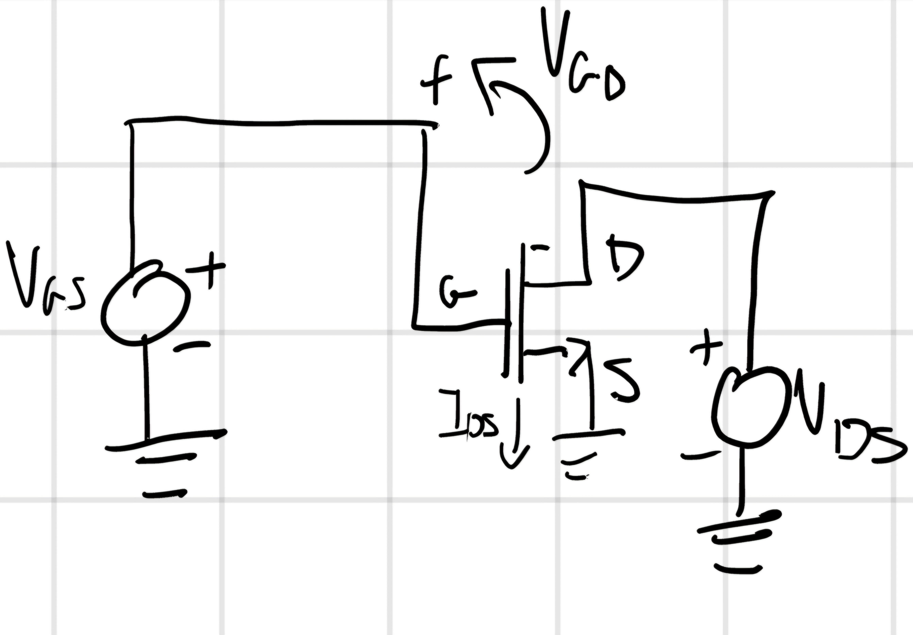
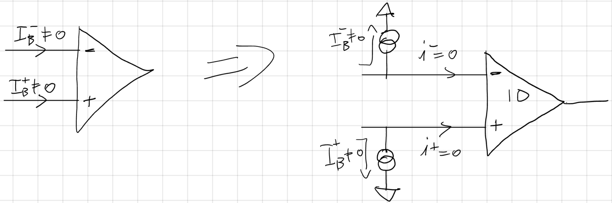

# Introduzione

Salve lettori, questa pagina è stata creata per riassumere o ampliare gli appunti che prendiamo a lezione, questi appunti possono servire per capire meglio l'argomento e non possono essere capiti completamente se non si seguono le lezioni. Se trovate errori o parti poco chiare vi prego di segnalarlo così provederemo a corregere. Buona lettura -NP

# Capitolo Uno: Il Diodo

Il diodo non è altro che un componente NON-lineare che fa passare la corrente in un verso e ne impedisce il movimento nel verso opposto.

Ha un comportamento NON-lineare, per essere precisi di tipo semi-esponenziale, avendo polirizzazione diretta, inversa e avendo un possibile evento di Breackdown.

## 1.1 Comportamento fisico-chimico

Per capire ciò bisogna fare un leggero passo indietro, dobbiamo partire dall'atomo di Silicio, ora tanti atomi di silicio vicini a temperature superiori allo $0K$ fanno ciò che gli atomi fanno, dunque rottura dei legami e successiva riformazione di questi legami con altri atomi con posti liberi. Ora se levassi un atomo di silicio con uno di boro (1 elettrone in meno) faccio una procedura di **DROGAGGIO** di tipo **ACCETTORE** visto che il boro ha uno spazio libero tende a chiedere un elettrone per andare in stabilità, se lo sostituissi con un atomo di fosforo (un elettrone in più) il drogaggio è di tipo **DONORE**, avendo un elettrone in più cede per andare in stabilità, quindi qui si spostano più elettroni.

Detto questo cosa succede ? Dobbiamo immaginarci il diodo come un rettagolo pieno di atomi di silicio, dentro questo rettangolo ci solo cariche positive e cariche negative, ora queste cariche si bilanciano in due zone: catodo $(-)$ e anodo $(+)$.

Le cariche positive nello spostarsi dal catodo all'anodo si perdono qualche carica positiva, idem gli elettroni, creando una zona non bilanciata, che crea un campo elettrico che impedisce ulteriori diffusioni.

## 1.2 Polarizzazione Inversa e Diretta

Detto ciò, in **polarizzazione inversa** questa zona aumenta e ciò impedisce alla corrente di passare. In **polarizzazione diretta** la zona si restringe e la corrente aumenta, la tensione rimane costante a 0,7 V.

## 1.3 Evento di Breakdown

In polarizzazione inversa può avvenire il Breakdown, sostanzialmente la tensione diventa costante a un valore $V_{BD}$ e la corrente aumenta (diodo bruciato).

## 1.4 Formule

La corrente del diodo $I_D$ è legata esponenzialmente alla tensione del diodo $V_D$.

$I_D=I_{SO}(e^\frac{V_D}{V_{TH}}-1)$

$I_{SO}=qA^2n_i(\frac{D_p}{N_DL_P}+\frac{D_n}{N_AL_n})$

Parametri:

$(n_i,D_P,D_n)$ fisici.

$(A)$ geometrici.

$(N_A,N_D)$ drogaggio di giunzioni.

$(L_P,L_n)$ profili.

A P.I. la corrente vale $-I_{SO}$.

## 1.5 Tipi di diodo

- Diodo Zener $V_{PD}=5V$, $v_{PI}=-20V$. Particolarità: non si può bruciare. 
- Diodo Schottky $V_{PD}=0.2V$, $V_{BD}<50V$. 
- Diodo LED Emettono luce in P.D. $V_{VD}$ varia a seconda del colore. 
- Fotodiodo riceve luce e lo trasforma in segnale elettrico. 
- Diodo Varicap possiede una capacità di giunzione $C_j$. 

## 1.6 Potenza Dissipata

Vista la caratteristica dei diodi di avere 3 tipi di funzinamento diversi, calcolare la potenza dissipata dal diodo non è passeggiata.

In teoria la potenza dissipata in questi 3 periodi $(T)$ è:

$P_D=\frac{E_D}{T}=\frac{1}{T}*\int_{0}^{T} V_D(t)i_D(t)dt$

Per facilitare tale impresa la dividiamo secondo i 3 periodi e poi facciamo la somma (un pò come nella sovrapposizione degli effetti).

- In diretta, abbiamo $V$ costante:

$E_{D,F} = V_F \int_{t \in T_F} i_D(t) dt$

- In inversa, $i_D(t)=I_S$ (costante), lo si approssima a $0$:

$E_{D,R}=I_S \int_{t \in T_R} v_d(t)dt \to 0$

- In Breakdown (se non mi polverizza il diodo) ha $V_{BD}$ costante:

$E_{D,BD}= V_{BD} \int_{t \in T_{BD}} i_D(t) dt$

F=forward, R=reverse.

Quindi $P_D= \frac{1}{T}(V_F \int_{t \in T_F} i_D(t)dt + I_S \int_{t \in T_R} v_D(t) dt + V_{BD} \int_{t \in T_{BD}} i_D(t)dt)$

Con $I_S \to 0$

$P_D=V_F(\frac{1}{T} \int_{t \in T_F} i_D(t)dt) + V_{BD}(\frac{1}{T} \int_{t \in T_{BD}} i_D(t)dt)$

# Capitolo Due: Circuiti con diodo

Allora cerchiamo di capire perchè il modello linerare è comodo per "cookare" (prof la amo) i circuiti con i diodi.

## 2.1 Metodo analitico

$KCL, KVL 
\begin{cases}
    I_R=I_D\\
    V_G=V_R+V_D
\end{cases}$

Legge di Ohm 
$\begin{cases}
    V_R=RI_R\\
    I_D=I_S(e^{\frac{V_D}{V_{TH}}}-1)
\end{cases}$

Semplificando 
$\begin{cases}
    V_D=V_G-RI_D\\
    I_D=I_S(e^{\frac{V_G-RI_D}{V_{TH}}}-1)
\end{cases}$

Conti brutti da gestire.

## 2.2 Metodo Grafico

Molto bello ma molto poco pratico (guarda quanti bei colori (3)).

## 2.3 Modello Lineare (questo "cooka" bene)

Se $I_D > 0\\
V_D=0,7 V\\
I_D= \frac{V_G-0,7V}{R}\\ 
\iff V_G>0,7V$

Se $V_D<0,7V\\
I_D=0A\\
V_D=V_G-0V \iff V_G=V_D$

## 2.4 Work in progress

# Capitolo Tre: MOSFET

## 3.1 Struttura

Dopo i diodi introduciamo un nuovo componente elettronico **FONDAMENTALE**, il **MOSFET** (che qualuno non riesce a pronunciare, ciao Andre ti voglio bene $:)$ ).

Allora cerchiamo di capire cos'è e come funziona.

Allora questo è un MOSFET (bello vero?), partiamo dalla composizione: è un panino di metallo (parte superiore) metallo-ossido (parte inferiore) e silicio. L'ossido è il mio dielettrico $(SiO_2)$.

È un condensatore-semiconduttore, il suo scopo è quello di creare carica libera.

È formato da tre terminali $\textcolor{red}{source}$, $\textcolor{pink}{drain}$, $\textcolor{green}{gate}$, e la corrente che scorre tra drain e gate dipende dalla tensione che viene applicata tra source e gate.

MOSFET sta per:

M.O.S. $\to$ Metal Oxide Semiconductor, per la struttura.

F.E.T. $\to$ Field Effect Transistor, per il funzionamento.

Ma come funziona ?

## 3.2 Funzionamento

Il funzionamento è quello di applicare una tensione agli elettrodi e induco una carica $Q=CV_1$, ora applico una tensione $V_2$ al semiconduttore.

$>$ carica indotta, $>$ è la corrente.

A seconda della carica indotta ho 2 tipi di MOS:

- NMOS (elettroni)
- PMOS (lacune)

Per i ragazzi che come me si trovano disorientati quando vi è un cambio di rappresentazione ecco una breve spiegazione sul NMOS (idem al PMOS).

Dunque sul gate troviamo il metallo, poi ossido (spessore $t_{ox}=1-10 nm$) e il semiconduttore che nel PMOS è N come di vede che ha il compito di modulare la carica nel canale (sopra semiconduttore e sotto ossido).

Se si è capito il funzionamento del diodo, adorerai MOSFET Live, ehm... dicevo, se si è capito il diodo capire il FET sarà più semplice. Se applichiamo una tensione positiva creiamo cariche negative libere che diventano fisse (quindi NO corrente) il MOS è in **interdizione**, se aumento la tensione creo **elettroni di conduzione**, la tensione che crea elettroni di conduzione è settata ed è detta **di soglia** (threshold voltage, $V_T$) e questa condizione viene chiamata **inversione del canale** ($V_T=0,5V - 2V$).

In parole povere più tensione applico più induco corrente (nella realtà prima o poi qualcosa fa "boom").

Introduciamo ora le due regioni nel quale si può trovare un MOSFET: **Ohmica** e **di Saturazione**.

## 3.3 Regione Ohmica

Ci troviamo in questa regione quando la tensione applicata è molto piccola quindi abbiamo degli elettroni fissi ma non liberi ($V_{DS} \to 0V$).

La carica libera presente (poca) nel canale dipende dalla tensione che sfora la $V_T$ duqnue $(V_{GS}-V_T)$ e dalla capacità dell'ossido $C_{ox}(= \frac{\varepsilon_{ox}}{t_{ox}}WL)$ con $W=$ larghezza e $L=$ lunghezza:

$Q_{CH}=C_{ox}(V_{GS}-V_T)$

la velocità con il quale gli elettroni da source a drain dipende dal campo elettrico $\implies V_{GS}$:

$v=\mu_n E=\mu_n \frac{V_{DS}}{L}$ con $\mu_n =$ conduttività materiale.

La corrente è la carica spostata lungo $L$ in un tempo secondo $v:$

$I_{DS}=\frac{Q_{CH}}{\varDelta t}=\frac{Q_{CH}}{L/v}=\frac{C_{ox}(V_{GS}-V_T)}{\frac{L}{\mu_n \frac{V_{DS}}{L}}}=\frac{C_{ox}(V_{GS}-V_T)\mu_n V_{DS}}{L^2}$

Per $V_{DS}$ piccole il transistore (MOSFET) si comporta come una resistenza:

$R_{CH}=\frac{V_{DS}}{I_{DS}}=\frac{L^2}{\mu_n C_{ox} (V_{GS} - V_T)}$

Termini tecnici noiosi:

$V_{GS}-V_T=$ Tensione di overdrive $(V_{ov})$.

$\frac{W}{L}=$ fattore di forma.

Calcoli più precisi:

La densità superficiale di carica dipende non solo dalla tensione di Overdrive ma anche dalla tensione nel punto $x$ del canale.

$($se $V_{DS} > 0$$)$ $\implies Q'_{CH}=\frac{\varepsilon_{ox}}{t_{ox}}(V_{GS}-V_T-V(x))$

La corrente $(I_{DS})$ è la carica superficiale $(Q'_{CH})$ integrata in $W$ e $x$ spostata in $\varDelta t$ lungo $L$ a $v$.

$Q_{CH}=\int_{y=0}^{W} \int_{x=0}^{L} Q'_{CH}dxdy = \frac{WL}{V_{DS}}\int_{V(0)=0}^{V(L)=V_{DS}}Q'_{CH}dV(x) = \frac{WL}{V_{DS}} \frac{\varepsilon_{ox}}{t_{ox}}[(V_{GS}-V_T)V_{DS}-\frac{V_{DS}^2}{2}]$

$I_{DS} = \frac{Q_{CH}}{\varDelta t} = \mu_n \frac{\varepsilon_{ox}}{t_{ox}} \frac{W}{L} (V_{GS}- V_T-\frac{V_{DS}}{2})V_{DS} = \mu_n C_{ox} (V_{GS}-V_T-\frac{V_{DS}}{2})V_{DS}$

$R_{CH}(V_{DS}) = \frac{\partial V_{DS}}{\partial I_{DS}} = \frac{L^2}{\mu_n C_{ox}(V_{GS}-V_T-V_{DS})}$

## 3.4 Regione di Staurazione

Quando $V_{DS}$ raggiunge la tensione Overdrive l'aumento di tensione non apporta alcuna modifica questo stato si chiama **Regione di Saturazione**, il MOS si comporta come un generatore di corrente.

$I_{DS}^{SAT}=I_{DS}V_{DS} \implies I_{DS}^{SAT}= \frac{1}{2} \mu_n C_{ox} (V_{GS}-V_T)^2$

Nella realtà l'aumento di tensione aumenta la corrente di un fattore $\lambda$, non più generatore ideale:

$I_{DS}^{SAT}= \frac{1}{2} \mu_n C_{ox} (V_{GS}-V_T)^2 (1+ \lambda V_{DS})$

## 3.5 Formule

- NMOS

  -   SATURAZIONE

        $V_{GS}>V_T>0$
        
        $V_{DS}>V_{ov}$

        $I_{DS}^{SAT}= \frac{1}{2} \mu_n C_{ox} (V_{GS}-V_T)^2>0$
  
  -   OHMICA
        
        $V_{GS} > V_T$

        $V_{DS} < V_{ov}$

        $I_{DS} = \mu_n C_{ox} (V_{GS} - V_T - \frac{V_{DS}}{2}) V_{DS} > 0$
  
  -    INTERDIZIONE

        $V_{GS} < V_T$

        $I_{DS} = 0$

- PMOS

  - SATURAZIONE

    $V_{GS} < V_T < 0$

    $V_{DS} < V_{ov}$

    $I_{DS}^{SAT}= - \frac{1}{2} \mu_p C_{ox} (V_{GS} - V_T)^2 < 0$

  - OHMICA 

    $V_{GS}<V_T$

    $V_{DS} > V_{ov}$

    $I_{DS} = - \mu_p C_{ox} (V_{GS} - V_T - \frac{V_{DS}}{2}) V_{DS} < 0$

  - INTERDIZIONE

    $V_{GS} < V_T$

    $I_{DS} = 0$

## 3.6 Curiosità finali

I MOS sono ottimi interrutori visto che si comportano da circuiti aperti quando $V_{GS} < V_T$ $( V_{GS} < |V_T|$ per PMOS $)$ e da resistenza quando $V_{GS} > V_T ( V_{GS} > |V_T|$ per PMOS $)$.

Se ho MOS in serie la $K_{eq} = \frac{1}{K_{eq}}= \Sigma_1^n \frac{1}{K_i}$, in parallelo $K_{eq}= \Sigma_1^n K_i$.

# Capitolo Quattro: Analisi Circuitale pt.2

## 4.1 Caratteristiche circuitali logiche

D'ora in avanti ci troveremo davanti svariate parole che indicano determinate caratteristiche dei circuiti logici, qui potevo decidere di spiegarli la prima volta che si usavano ma ho deciso che è meglio avere un elenco dove ci sono tutte, ecco cosa vogliono dire;

- **Caratteristica (statica) Ingresso/Uscita:** Uscita in funzione degli ingressi.
- **Soglia logica:** Tensione che divide $0$ e $1$ logico.
- **Livelli logici:** Livelli di tensione che determinano $0$ e $1$ logico.
- **Noise Margin:** Massima fluttuazione tollerabile sul livello logico.
- **Tempo di propagazione:** Tempo che ci mettono i segnali ad arrivare nelle varie parti del circuito.
- **Potenza dissipata:**

  - **Statica:** Devo davvero spiegarlo ?
  - **Dinamica:** Idem con patate.

- **Area:** Spazio occupato.
- **Fan-Out:** Numero massimo di device pilotabili senza perdita di informazioni.

## 4.2 Work in progress

# Capitolo Cinque: Logica CMOS

Come abbiamo detto nel capitolo tre i MOS sono ottimi interruttori che hanno due funzioniamenti distinti: pull-up (PU) e pull-down (PD) con PD forziamo un livello "low" (L) in uscita mentre con PU un livello "high" (H) in uscita.

I PMOS sono ottimi interruttori con PU mentre gli NMOS sono ottimi interruttori con PD.

## 5.1 PDN e PUN

Cambio formule:

Per $K_n$ si intende $K_n = \frac{1}{2} \mu_n C_{ox}$ mentre con $K_p = \frac{1}{2} \mu_p C_{ox}$

Per i PMOS in Ohmica si usa anche  $I_{SD} = 2 K_p (V_{SG} - |V_T| - \frac{V_{SD}}{2})V_{SD}$ e la satuta $I_{SD}^{SAT} = K_p (V_{SG} - |V_T|)^2$.

Cambio rappresentazione:

- NMOS PDN

  - Portano corrente tra $D$ ed $S$

Per digitalizzarlo bisogna pilotare l'NMOS:

- $G$ dell'NMOS a $V_{DD}$.
- Tengo i $S$ più vicini a $GROUND$.

Una rete di NMOS con PD si chiama PDN (Pull-down Network).

- PMOS PUN

  - Spingono una corrente da $S$ a $D$

Per digitalizzarlo bisogna pilotare il PMOS:

- $G$ a $0$.
- $S$ vicino a $V_{DD}$

Una rete di PMOS con PU si parla di PUN (Pull-up Network).

## 5.2 F-CMOS

La logica fully complementary MOS (F-CMOS) serve per realizzare parte con PUN e PDN che lavorano in mutua esclusione.

Proprietà:

- Potenza statica nulla.
- $V_{OH} = V_{DD}$ e $V_{OL} = GND$
- Fronte di salita $(t_R)$ e discesa $(t_F)$ dei segnali d'ingresso, creando cross-conduzione $(P_{CROSS} \propto t_{R/F})$.

## 5.3 Porte logiche

In questo paragrafo parleremo di due porte logiche $NAND-2$ e $NOR-2$ analizzandone in/out e caratteristiche elettroniche.

### NAND-2

$Y=\neg(AB)$

|$A$|$B$|$Y$|
|---|---|---|
|0|0|1|
|0|1|1|
|1|0|1|
|1|1|0|

Abbiamo 3 effetti IN/OUT dipende da come commutano $A$ e $B$, con 3 inverter si ha:

- $AB(00) \to AB(11)$
- $AB(10) \to AB(11)$
- $AB(01) \to AB(11)$

Ogni "caratteristica" avrà punti caratteristici diversi, ma sempre $V_{OH} = V_{DD}$ e $V_{OL} = GND$.

In tutti i casi useremo il seguente circuito:

- $AB(00) \to AB(11)$

$AB(00): \\M_3$ ed $M_4$ ON.

$M_1, M_2$ OFF.

$AB(11) : \\ M_3, M_4$ OFF.

$M_1, M_2$ ON.

$K_{M_p} = K_3 + K_4$

$K_{M_n} = \frac{K_1 K_2}{K_1 + K_2}$

Tempi di propagazione:

$t_{p,LH}^{11,00} = C \frac{V_M - V_{OL}}{K_{M_n}(V_{DD} - V_T)^2} = C \frac{V_M}{(K_3 + K_4)(V_{DD} - V_T)^2}$

$t_{p,HL}^{00,11} = C \frac{V_{OH} - V_M}{ K_{M_p}(V_{DD} - V_T)^2} = C \frac{V_{DD} - V_M}{\frac{K_1 K_2}{K_1+ K_2} (V_{DD} - V_T)^2}$

- $AB(01) \to AB(11)$

$AB(01): \\M_3$ ON ed $M_4$ OFF.

$M_1$ OFF $M_2$ ON.

$AB(11) : \\ M_3, M_4$ OFF.

$M_1, M_2$ ON.

$K_{M_p} = K_3$

$K_{M_n} = \frac{K_1 K_2}{K_1 + K_2}$

Tempi di propagazione:

$t_{p,LH}^{11,01} = C \frac{V_M - V_{OL}}{K_{M_n}(V_{DD} - V_T)^2} = C \frac{V_M}{K_3(V_{DD} - V_T)^2}$

$t_{p,HL}^{01,11} = C \frac{V_{OH} - V_M}{ K_{M_p}(V_{DD} - V_T)^2} = C \frac{V_{DD} - V_M}{\frac{K_1 K_2}{K_1+ K_2} (V_{DD} - V_T)^2}$

- $AB(10) \to AB(11)$

$AB(10): \\M_3$ OFF ed $M_4$ ON.

$M_1$ ON $M_2$ OFF.

$AB(11) : \\ M_3, M_4$ OFF.

$M_1, M_2$ ON.

$K_{M_p} = K_4$

$K_{M_n} = \frac{K_1 K_2}{K_1 + K_2}$

Tempi di propagazione:

$t_{p,LH}^{11,10} = C \frac{V_M}{K_4(V_{DD} - V_T)^2}$

$t_{p,HL}^{10,11} = C \frac{V_{DD} - V_M}{\frac{K_1 K_2}{K_1+ K_2} (V_{DD} - V_T)^2}$

### NOR-2

$Y = \neg (A+B)$

|$A$|$B$|$Y$|
|---|---|---|
|0|0|1|
|0|1|0|
|1|0|0|
|1|1|0|

3 Caratteristiche IN/OUT:

- $AB(00) \to AB(11)$
- $AB(00) \to AB(01)$
- $AB(00) \to AB(10)$

con sempre $V_{OH} = V_{DD}$ e $V_{OL} = GND$.

Useremo come prima il seguente circuito:

- $AB(00) \to AB(11)$

$AB(00): \\M_3$ ed $M_4$ ON.

$M_1$ ed $M_2$ OFF.

$AB(11) : \\ M_3, M_4$ OFF.

$M_1, M_2$ ON.

$K_{M_p} = \frac{K_3 K_4}{K_3 + K_4}$

$K_{M_n} = K_1 + K_2$

Tempi di propagazione:

$t_{p,LH}^{11,00} = C \frac{V_M}{\frac{K_3 K_4}{K_3 + K_4}(V_{DD} - V_T)^2}$

$t_{p,HL}^{00,11} = C \frac{V_{DD} - V_M}{(K_1 + K_2)(V_{DD} - V_T)^2}$

- $AB(00) \to AB(01)$

$AB(00): \\M_3$ ed $M_4$ ON.

$M_1$ ed $M_2$ OFF.

$AB(01) : \\ M_3$ ON M_4$ OFF.

$M_1$ OFF M_2$ ON.

$K_{M_p} = \frac{K_3 K_4}{K_3 + K_4}$

$K_{M_n} = K_2$

Tempi di propagazione:

$t_{p,LH}^{01,00} = C \frac{V_M}{\frac{K_3 K_4}{K_3 + K_4}(V_{DD} - V_T)^2}$

$t_{p,HL}^{00,01} = C \frac{V_{DD} - V_M}{K_2(V_{DD} - V_T)^2}$

- $AB(00) \to AB(10)$

$AB(00): \\M_3$ ed $M_4$ ON.

$M_1$ ed $M_2$ OFF.

$AB(10) : \\ M_3$ OFF M_4$ ON.

$M_1$ ON M_2$ OFF.

$K_{M_p} = \frac{K_3 K_4}{K_3 + K_4}$

$K_{M_n} = K_1$

Tempi di propagazione:

$t_{p,LH}^{00,10} = C \frac{V_M}{\frac{K_3 K_4}{K_3 + K_4}(V_{DD} - V_T)^2}$

$t_{p,HL}^{10,00} = C \frac{V_{DD} - V_M}{K_1(V_{DD} - V_T)^2}$

Caratteristiche Elettroniche sinstesi (Reti logiche ma a FdE, anche loro presenti su appunti).

CMOS offre:

Il resto sono tecniche di espansione delle formule logiche, consigliamo la visione di "Reti Logiche" presente su appunti.

## 5.4 Porte NMOS e PMOS

Problematiche CMOS:

- Perdita di capacità di corrente dovuta ai MOS in serie.
- Aumento Area per bilanciare questo.
- Aumento di MOS = aumento capacità di carica $C_{ox}' (= \frac{\varepsilon_{ox}}{t_{ox}})$ ed area totale della porta.
- Un grande $C_L$ = aumento potenza dinamica.
- Grandi capacità parassite riducono frontesalita e discesa aumento di cross-conduzione.

### Porte NMOS

Sostituisco (con dei costi che vedremo) le PUN con resistori o PMOS accesi.

Costi:

- Potenza dissipata statica non nulla.
- $V_{OH} = V_{DD}$ ma $V_{OL} > GND$
- $t_{p, HL}^{INs}$ dipende dal $K$ dell'NMOS eq., se trascuriamo $R$ e PMOS.
- $t_{p,LH}^{INs}$ dipende solo dal $K$ del PMOS o dal $RC$.

### Porte PMOS

Costi:

- Potenza dissipata non nulla.
- $V_{OL} = GND$ ma $V_{OH} < V_{DD}$.
- $t_{p,HL}^{INs}$ dipendono solo da $K$ del NMOS o $RC$.
- $t_{p,LH}^{INs}$ dipendono da $K_{eq}$ PUN, se trascuriamo $R$ e NMOS.

## 5.5 Porte (C)MOSTri-State

In questo tipo di porte oltre a $1$ e $0$ abbiamo l'alta impedenza (HZ), in questo stato i dispositivi incaricati del PU e PD vengono spenti (o sconnessi) lasciando l'uscita flottante.

L'ingresso se acceso fa tutto normalmente altrimenti lascia l'output a HZ.

Svantaggi:

- Aumento Area.
- Poichè bisogna raddoppiare la dimensione dei MOS per stesso $t_p$.
- MOS $E_n$ grossi almeno quanto $K_{eq}$ PUN e PDN.
- $\neg E_n$ si genera con $NOT$ su $E_n$.
- Più parassiti = meno $t_p$ e più potenza dinamica.
- Viene usata solo raramente.

# Capitolo Sei: Logiche PT e TG

**Lookup Table (LUT)**, tipo di memoria ROM, banale MUX.

### LUT n-to-m

Come costruiamo un MUX ?

- Porte CMOS (poco efficiente).
- Logica Pass Transistor (PT) o Transfer Gate (TG), questo metodo è più efficiente.

## 6.1 Pass Transistor Logic (PTL)

La PTL usa i MOS come interrutori sul percorso digitale per realizzare dei MUX.

N.B. Nei PTL si utilizza un solo tipo di MOS ed è preferibile che sia un NMOS.

### MUX 2-to-1

Per un generico $2^n$ MUX:

- $Y = X(n)$.
- Si compone come un albero di MUX 2-to-1.
- Per ogni $S_i$ bisogna avere un inverter $\neg S_i$.

## 6.2 Porte logiche e parassitismi

### AND-2

#### Riduzione

Ci rediamo conto che quando $A=0 \to Y=0$ mentre $A=1 \to Y=B$.

Quindi:

### OR-2

#### Riduzione

Notiamo che se $A=1 \to Y=1$ se $A=0 \to Y=B$ quindi:

### Parassitismo

A causa del condensatore MOS, possono nascere anche nei PTL capacità parassite.

N.B. Noi **NON** siamo in grado di calcolare le capacità parassite da solo $\implies$ sono date dal testo.

## 6.3 Cariche e Scariche MOS

### NMOS

#### Scarica $H \to L$

Fino a $Y=V_{ov}$ scarica in saturazione, dopo in ohmica fino a $GND$.

$I_{ds}(t) = -i_c (t)
\\
I_{DS} (t) = -\frac{dY(t)}{dt}
\\
t_{p,HL} = t_{p,HL}^{SAT} + t_{p,HL}^{OHM}
\\
t_{p,HL} \cong \frac{C \varDelta Y}{K_n V_{ov}^2}
$

#### Carica $L \to H$

Source e Drain si comportano come vogliono, a seconda di come scorre la corrente cambiano posizione.

$V_{GS} = V_{DD} - Y(t)$ si riduce fino a $V_{GS} = V_{Th}$, NMOS si spegne e smette di caricarsi, sempre satura la carica.

$i_c(t) = I_{DS}^{SAT} (t)
\\
C \frac{dY(t)}{dt} = K_n (V_{GS} (t) - V_{Tn})^2
\\
C \frac{dY(t)}{dt} = K_n (V_{DD} - Y(t) - V_{Tn})^2
\\
\frac{K_n}{C}dt = \frac {d Y(t)}{(V_{DD} - Y(t) - V_{Tn})^2}
\\
\int_{0}^{t_{p,LH}}dt = \frac{C}{K_n} \int_{Y_L}^{Y_H} \frac{dY}{(V_{DD} - V_{Tn} - Y)^2} = \frac{C}{K_n}[\frac{1}{V_{DD} - V_{Tn} - Y}]_{Y_L}^{Y_H}
$

Con tecnologia F-CMOS

$Y_H - Y_L = \frac{V_{DD}}{2} - 0
\\
t_{p,LH} = \frac{C}{K_n}(\frac{1}{\frac{V_{DD}}{2} - V_T} - \frac{1}{V_{DD} - V_{Tn}}) = \frac{C}{K_n} \frac{\frac{V_{DD}}{2}}{K_n(\frac{V_{DD}}{2} - V_{Tn})(V_{DD} - V_{Tn})} > \frac{C}{K_n} \frac{\frac{V_{DD}}{2}}{(V_{DD} - V{Tn})^2}
$

### PMOS

#### Carica $L \to H$

Fino a $T = V_{DD} - |V_{ov}|$ siamo in satura, sa lì fino a $V_{DD}$ in Ohmica, che noi trascuriamo.

$I_{SD} (t) = -i_c(t)
\\
I_{SD}(t) = -\frac{dY(t)}{dt}
\\
t_{p,LH} = t_{p,LH}^{SAT} + t_{p,LH}^{OHM}
\\
t_{p,LH} \cong \frac{C \varDelta Y}{K_p(V_{DD} - |V_{Tp}|)^2}
$

#### Scarica $H \to L$

$V_{SG} = Y(t) - 0$ si riduce fino a $V_{SG} = |V_{Tp}|$, PMOS si spegne non si scarica più $\implies$ PMOS sempre saturo.

$I_{SD}^{SAT} (t) = - i_c (t)
\\
K_p(V_{SG}(t) - |V_{Tp}|)^2 = - C \frac{dY(t)}{dt}
\\
K_p(Y(t) - |V_{Tp}|)^2 = - C \frac{dY(t)}{dt}
\\
-\frac{K_p}{C}dt = \frac{dY(t)}{(Y(t) - |V_{Tp}|)^2}
\\
\int_{0}^{t_{p,HL}}dt = - \frac{C}{K_p} \int_{Y_H}^{Y_L} \frac{dY}{(Y(t) - |V_{Tp}|)^2}
\\
t_{p,HL} = \frac{C}{K_p}[\frac{1}{Y(t) - |V_{Tp}|}]_{Y_H}^{Y_L}
$

Da F-CMOS

$Y_H - Y_L = V_{DD} - \frac{V_{DD}}{2}
\\
= \frac{C}{K_p}\frac{\frac{V_{DD}}{2}}{(\frac{V_{DD}}{2} - V_{Tp})(V_{DD} - V_{Tp})} > \frac{C}{K_p}\frac{\frac{V_{DD}}{2}}{(V_{DD} - V_{Tp})^2}
$

## 6.4 Transmission Gate Logic (TGL)

Mettiamo in parallelo NMOS e PMOS $\implies$ aumento capacità corrente:

- Più area usata.
- Per pilotarlo abbiamo bisogno del segnale negato.

- Può essere un interrutore analogico.

### Complementary PTL

Lo colleghiamo a un F-CMOS così che F-CMOS si occupi:

- Rigenerare i livelli se necessario (PTL).
- Definire una soglia.
- Fa da driver do corrente, prende corrente dall'alimentatore.

# Capitolo Sette: Circuiti sequenziali e memorie

Un circuito con memoria è un circuito che ha **MEMORIA** dello stato logico precedente, questi circuiti sono chiamati "bistabili".

Esistono 2 tipi di bistabili:

- **LATCH**
- **FLIP-FLOP**

## 7.1 Bistabile

Il bistabile si può avere retroazionando i circuiti logici

Se ora provassimo a disegnare su un grafico le caratteristiche della $\color{orange}{NOT1}$ e $\color{purple}{NOT2}$ notiamo che si hanno 3 punti di equilibrio, consideriamo inoltre la $NOT2$ come "curva di carico" della $NOT1$.

- $A,1$ logico, punto di equilibrio stabile, zona rigenerativa.
- $B, 0$ logico, punto di equilibrio stabile, zona rigenerativa.
- $C,$ punto di equilibrio instabile, in zona lineare.

Ma come forziamo lo stato ?

Un esempio è trasformare le $NOT$ in $NOR$ con la $GRN (R e S)$

Se pilotiamo le $GND$ possiamo forzare $IN$ e $OUT$ a $0/1$

- $S=1 \to Q=1, \neg Q=0$
- $R=0 \to Q=0, \neg Q=1$

Questi bistabili vengono chiamati "bistebile, SR" (Set Reset).

Mi rifiuto categoricamente di fare la tabella di verità della $NOR$ perchè si conosce. Vediamo però quella del bistabile.

|$SR$|$Q_n$|$\neg Q_n$|
|----|-----|----------|
|$00$|$Q_{n-1}$|$\neg Q_{n-1}$|
| $01$ | $0$ | $1$ |
| $10$ | $1$ | $0$ |
| $11$ | $0$ | $0$ |

N.B. lo stato "$11$" non viene usato.

Vediamo ora un "bistabile, $\neg (SR)$" con $NAND$ al posto di $NOR$.

|$\neg(SR)$|$Q_n$|$\neg Q_n$|
|----------|-----|----------|
| $00$ | $1$ | $1$ |
| $01$ | $1$ | $0$ |
| $10$ | $0$ | $1$ |
| $11$ | $Q_{n-1}$ | $\neg Q_{n-1}$ |

Ora vediamo un "Latch, SR" che è un bistabile con **Enable**.

Si può sviluppare un bistabile che usa solo le configurazioni sensate.

## 7.2 Flip-Flop

È semplicemente un bistabile con $CLK$ (clock).

Vediamo il grrafico di cambio di livello logico di questo circuito.

Qui torniamo ad AXO, anche questo presente su appunti ;), con il "Master-Slave".

### Edge Triggering

Possiamo essere sensibili in tanti modi:

- Campionare ingressi e scriverli sul medesimo fronte.

    - Fronte di salita (rising edge).
    - Fronte di discesa (falling edge).

- Campionare gli ingressi su un fronte (master) e scriverli sull'altro.

    - Master Slave rise/fall.
    - Master Slave fall/rise.

Insomma ci sono tanti richiami ad AXO, quindi andiamo a qualcosa di nuovo.

Vediamo una CMOS bistabile a $NOT$.

### Timing

I tempi di carica/scarica dei MOS sulle capacità parassita creano vincoli di timing su latch e flip-flop.

- Tempo di Set-Up, tempo con cui un segnale d'ingresso deve rimanere stabile prima di passare in fase **MEMO**.
- Tempo di Hold, tempo per cui un segnale deve rimanere stabile anche dopo essere passati nella fase **MEMO**.
- Tempo di propagazione, **MI RIFIUTO DI SPIEGARLO**.
- Questi vincoli determinano la frequenza massima di funzionamento di un sistema digitale!

## 7.3 Pipeline

Le tecniche di pipeline servono per disaccopiare la relazione tra "Throughput" $(T)$ e "Rate" $(R)$.

Se consideriamo una logica combinatoria, il massimo rate è dato dall'inverso del massimo tempo di propagazione $(D)$.

$R= \frac{1}{D}$

Se vogliamo memorizzare a ogni $R$ lavoreremo a un $T_{MAX}=R$.

Se spezzassimo la logica in $N$ blocchi con ritardo di propagazione massimo $= d_i$, possiamo registrare ogni uscita con un flip-flop.

Ogni blocco se considerato indipendente può sopportare un rate $r$.

$r_i = \frac{1}{d_i}$

Per evitare accavallamenti e trascurando i timing di flip-flop, clockiamo il sistema e:

Otteniamo quindi:

- $R = f_{CLK} = min\{\frac{1}{d_i}\}$.
- $T = \frac{1}{D}$.
- Deduciamo che abbiamo vantaggi se bilancimo $d_i$, il best sarebbe $\frac{D}{N} \to R = \frac{N}{D}$.

## 7.4 Memorie

Ad oggi le memorie sono matrici 2D, possono essere:

- Volatili (RAM), se tolgo corrente perdo tutto.

    - SRAM
    - DRAM

- Non volatili, se tolgo corrente non perdo nulla.

    - ROM
    - FLASH

### SRAM

RAM Statica

- Ogni cella ha un bistabile (4 MOS) più 2 MOS di selettori.
- Cella più veloce e facile.
- Dobbiamo dimensionare i MOS per leggere e scrivere.
- I tempi di propagazione determinano i tempi di accesso.

### DRAM

- Ogni cella è composta da un condensatore (MOS parassita) e 1 MOS di selezione.
- Gestione complicata.
- La capacità si scarica in un lasso di tempo di qualche ms.
- I $t_p$ determinano i tempi di accesso.
- In media più lenta di una SRAM.

### Scrittura DRAM

Uguale al PTL.

Scrivi **ZERO** $(0V)$

$t_p=C \frac{\varDelta V}{I_{DS}^{SAT}}$

Scrivi **UNO** $(V_{DD} - V_T)$

$t_{p,LH} = C \frac{\frac{V_{DD}}{2}}{K_n(\frac{V_{DD}}{2} - V_T)(V_{DD} - V_T)}$

### Lettura DRAM

In lettura consideriamo che la $BL$ abbia una $C_{BL}$ **NON** trascurabile.

In questi casi possiamo avere il "charge sharing" tra le capacità che cambiano i livelli di tensione.

**Esempio**

Se eguagliamo le cariche $Q_{TOT}^1 = Q_{TOT}^0$ otteniamo:

$V_R = \frac{C V_{MEM}^0 + C_{BL}V_{BL}^0}{(C+C_{BL})}$

- $V_{BL}^0 =$ Tensione residua prima di effettuare la lettura, di solito la BL viene pre-caricata ad un $V$ costante.
- $V_{MEM}^0 =$ Tensione presente nella memoria a un valore compreso tra $0V$ e $V_{DD}-V_T$.
- $V_R =$ Valore letto.

Dunque dobbiamo ripristinare i valori con un "buffer" che presenti una soglia adeguata ai livelli $V_R$.

Questo tipo di circuito si chiama "Sense Amplifier".

### ROM

Le ROM vengono realizzate connettendo Hard le celle a $0$ o $V_{DD}$.

Esistono ROM programmabili (PROM) o One-Time-Programmable (OTP) dove la connesione a $1$ o $0$ viene effettuata rompendo dei fusibili.

### FLASH

Le FLASH hanno una organizzazione simile alle DRAM.

- Il MOS parassita viene sostituito da un MOS floating-gate.
- Il MOS floating-gate, in funzione della differenza di potenziale tra WL e BL acquista una carica $Q_F$ sul gate flottante.
- Si ha una $V_T$ differente della solita.

$V_T = V_{T0} - \frac{Q_F}{C_{ox}}$

Inoltre le FLASH sono 100-1000 volte più lente delle DRAM, questo perchè il floating-gate ha $t_p$ molto grandi.

### Memorie 3D

Si sta puntando a sviluppare memorie 3D.

## 7.5 Formule

### Pipeline

Rate $= R$

$t_p^{MAX} = D$

$R = \frac{1}{D}$

### Memorie

Capacità parassita MOS $= C = C_{ox}WL$

Scrittura DRAM $(0) = t_{p,HL} = C \frac{\varDelta V}{I_{DS}^{SAT}}$

Scrittura DRAM $(1) = t_{p,LH} = C \frac{\frac{V_{DD}}{2}}{K_n(\frac{V_{DD}}{2}- V_T)(V_{DD}-V_T)}$

Lettura DRAM $= V_R = \frac{C V_{MEM}^0 + C_{BL}V_{BL}^0}{(C+C_{BL})}$

### FLASH

Nuova Soglia $= V_T = V_{T0}- \frac{Q_F}{C_{ox}}$

# Capitolo Otto: Amplificatore Operazionale

Prima di iniziare un piccolo ricordo di cosa sono gli Amplificatori operazionali (o OpAmp).

Un amplificatori operazionale è un componente elettronico così ideato:

Quindi ingressi a corrente nulla e guadagno infinito questi amplificatori vengono definiti "ideali".

## 8.1 Amplificatore operazionale Reale (l'inizio della fine)

Esistono 3 tipi di OpAmp reali o "Non Ideali":

- Valutati in DC o polarizzazione.
- Valutati in AC o su segnale variabile.
- Valutati sia in AC che in DC.

N.B. Un generico segnale $x(t)$, può essere visto come una costante $x_{DC}(t)$ ed una variabile $x_{AC}(t)$:

$x(t) = x_{DC}(t) + x_{AC}(t)$

Grazie ad F.D.A. lo studio di questo segnale ci tornerà più semplice.

## 8.2 Non idealità DC

### Tensione di Offset

L'OpAmp a riposo mostra un uscita **NON** nulla.

$V_{out} = V_{in} + V_{OS}, if V_{in} = 0\implies V_{out} = V_{OS}$

Ovvero anche se spenta $V_{in}$, l'OpAmp presenta una tensione $V_{OS}$, questo nel caso ideale **NON** accade, infatti nell'idealità $V_{out} = V_{in}$.

Si può usare il seguente modello ideale:

### Corrente di Bias

Nel caso ideale la corrente entrante nell'OpAmp è zero, nel caso reale invece una corrente entrante è presente e viene chiamata "**corrente di bias**".

Per usare il modello ideale quindi:

## 8.3 Non Idealità AC

### Resistenza d'Ingresso

I fenomeni che generano la corrente di bias, si vedono come una resistenza all'ingresso:

Quindi usando il modello ideale:

### Resistenza d'Uscita

L'OpAmp presenta una resistenza all'uscita per cui invece che registrare $V_{in} = V_{out}$ registra $|V_{out}| < |V_{in}|$.

Per usare il modello ideale quindi:

### Slew Rate

Questo effetto è maggiormente visibile in via grafica, si ha la pendenza massima all'uscita.

Esiste anche un quarto effetto che si chiama "Banda Limitata" che centra con le funzioni di trasferimento, quindi la guardiamo alla fine.

## 8.4 Non Idealità DC + AC

### Massima tensione d'uscita

La tensione massima viene limitata a un $V_{out}^{MAX}$, anche se idealmente ci aspettiamo $V_{out} = V_{in}$.

Di solito $V_{out}^{MAX} \le V_{DD}$, se uguale si chiama "op-amp rail-to-rail".

### Massima corrente d'uscita

Stessa cosa ma con la corrente.

Solitamente $I_f<<I_L$, quindi $I_{out} \cong I_L \implies V_{out} = I_{out}^{MAX} R_L$.

### Guadagno differenziale (open loop) finito

N.B. Se ripetessimo i calcoli con resistenza d'ingresso e d'uscita, notiamo un contributo non nullo a causa di $v_\varepsilon \not ={0}$

### Guadagno di modo comune (open loop) non nullo

Idealmente se abbiamo $v_\varepsilon = 0$ con $v^+ = v^- \not ={0}$ ovvero $v_{CM} \not ={0}$ e $V_{out} = 0$, in realtà abbiamo $V_{out} \not ={0}$.

$CMRR_{OL} = \frac{A_{d,OL}}{A_{CM,OL}}
\\
CMRR_{OL}^{dB} = 10 log_{10} \frac{A^2_{d,OL}}{A^2_{CM,OL}}
\\
= 20 log_{10}CMRR_{OL}
$

N.B. OP= Open-Loop, solitamente viene omesso dal circuito.

### Power Supply Rejection Ratio (PSRR)

Idealmente se si ha $\varDelta V_{supply} (t) \not ={0}$ ci aspettiamo $V_{out} = 0$ se ingresso nullo, in realtà $V_{out} \not ={0}$ e cresce con $\varDelta V_{supply}$.

Per usare il modello ideale quindi:

N.B. Ognuno definisce il guadagno differenziale tirando un d20 e/o pescando a caso, quindi chiedere il manuale per scoprire la definizione del giorno.

Od ora parliamo di "Banda Limitata".

### Banda Limitata (AC)

Tutti i guadagni differenziali di modo comune e parassiti sono funzioni di $s$ (FdA).

Quindi ogni frequenza risponde in modo diverso.

Ma nel 90% dei casi:

### Guida di sopravvivenza per il guadagno differenziale:

- Trascuriamo i contributi di modo comune.
- Le altre NON idealità si valutano sugli OpAmp ideali.
- Il guadagno differenziale finito e la relativa banda si tratta con la teoria della retroazione.

# Capitolo Nove: Reatroazione (FdA is back)

Ricordo rapido rapido di FdA (guardate su appunti per approfondire).

Se unidirezionali:

$Y(s) = \varepsilon (s) A(s)$

$\varepsilon (s) = X(s) - Y(s)B(s)$

$\frac{Y(s)}{X(s)} = \frac{A(s)}{1 + A(s)B(s)}$

$\frac{\varepsilon (s)}{X(s)} = \frac{1}{1+ A(s)B(s)}$

Funzione d'anello: $L(s) = A(s)B(s)$

Così da avere una funzione di trasferimento (FdT) indipendente da A ma dipendente da B.

$\frac{Y(s)}{X(s)} = \frac{A(s)}{1+A(s)B(s)} \xrightarrow{A \to +\infty} \frac{1}{B(s)}
\\
\frac{\partial (\frac{Y(s)}{X(s)})}{\partial A(s)} = \frac{\partial (\frac{A}{1+AB})}{\partial A} = \frac{1(1+AB) - A(B)}{(1+AB)^2} = \frac {1}{(1+AB)^2} \xrightarrow{A \to + \infty} 0
\\
\frac{\partial (\frac{Y(s)}{X(s)})}{\partial B(s)} = \frac{\partial (\frac{A}{1+AB})}{\partial B} = \frac{0(1+AB) - A(A)}{(1+AB)^2} = \frac{A^2}{(1+AB)^2} \xrightarrow{A \to + \infty} 1$

Si richia di creare poli instabili.

## 9.1 Le retroazioni ed Elettronica (una storia d'amore)

Cosa è semplice fare in elettronica ? 

- Fare amplificatori a grande guadagno $\to A$.
- Fare reti passive stabili $\to B$.

### Blocco A

Nel blocco $A$ usiamo un OpAmp comune, il generatore di tensione è dipendente.

L'OpAmp notiamo che ha caratteristiche simili all'inverter.

### Blocco B

È una qualsiasi rete passiva $(R/L/C)$, che garantisce l'annullamento di $v_\varepsilon$.

2 tipi:

**Annullamento di tensione (non invertente)**

**Annullamento in corrente (INVERTENTE)**

## 9.2 Il $G_{Loop}$

In elettronica risulta più pratico valutare il "guadagno d'Anello" $(G_{Loop})$:

$G_{Loop} (s) = -A(s)B(s) = -L(s)$

N.B. Essendo la rete B passiva, non è unidirezionale.

### Esempio

$v_\varepsilon = V_{in} - V_{out}\frac{R_1}{R_1 + R_2}
\\
V_{out} = v_\varepsilon A_{d,OL}
\\
\frac{V_{out}}{A_{d,OL}} = V_{in} - V_{out}\frac{R_1}{R_1+R_2}
\\
V_{out}(\frac{1}{A_{d,OL}}+\frac{R_1}{R_1+R_2}) = V_{in}
\\
\frac{V_{out}}{V_{in}} = \frac{1}{(\frac{R_1 + R_2 + R_1 A_{d,OL}}{A_{d,OL}(R_1+R_2)})} = G_{REAL}
\\
G_{REAL} = \frac{(R_1 + R_2)A_{d,OL}}{R_1 + R_2 + R_1A_{d,OL}}
\\
G_{ID} = 1 + \frac{R_2}{R_1}
\\
G_{REAL} = \frac{R_1 + R_2}{R_1} \frac{A_{d,OL}}{\frac{R_1 + R_2}{R_1} + A_{d,OL}}
\\
G_{REAL} = G_{ID} \frac{1}{\frac{R_1 + R_2}{R_1}\frac{1}{A_{d,OL}} + 1} = G_{ID} \frac {1}{1 + \frac{1}{\frac{R_1}{R_1 + R_2}A_{d,OL}}}
\\
G_{LOOP} = - \frac{R_1}{R_1 + R_2}A_{d,OL}$

Valutiamo il $G_{LOOP}$:

- Spegnamo gli ingressi, tranne il gen. dipendente.
- Tagliamo l'anello in un punto a caso, ricostruendo l'impedenza equivalente.

$V_{out}^{(T)} = v_\varepsilon^{(T)}A_{d,OL}
\\
V_{in}^{(T)} = 0 - v_\varepsilon^{(T)}
\\
V_{out}^{(T)} = \frac{R_1}{R_1 + R_2}V_{out}^{(T)}
\\
G_{Loop} = \frac{V_{out}^{(T)}}{V_{in}^{(T)}} = - \frac{R_1}{R_1 + R_2}A_{d,OL}
\\
G_{REAL} = \frac{G_{ID}}{1+\frac{1}{-G_{Loop}}}
\\
G_{REAL} = \frac{-G_{Loop}G_{ID}}{1-G_{Loop}}
\\
G_A = -G_{Loop}G_{ID}$

Dunque:

- $G_{ID} = 1 + \frac{R_2}{R_1}$
- $G_{LOOP} = -L(s) = - \frac{R_1}{R_1 + R_2}A_{d,OL}$

$G_{REAL} = \frac{G_{ID}}{1 + \frac{1}{-G_{LOOP}}} = \frac{-G_{LOOP}G_{ID}}{1 - G_{LOOP}}$:

- se $|G_{LOOP}| >>1  G_{REAL} \cong G_{ID}.$
- se $|G_{LOOP}| < 1 G_{REAL} \cong -G_{ID}G_{LOOP} = G_A.$

### Stabilità

Stesse cose di FdA solo che $G_{LOOP} = -L(s)$ quindi:

- $G_{LOOP}$ deve essere $<0$.
- Nel margine di fase usiamo $-180°$ come riferimento non $0°$.

## 9.3 Ricostruzione dell'Impedenza

Tagliamo un ramo da cui non scorre corrente.

Tagliamo un ramo con corrente.

- Dobbiamo ricostruire l'impedenza dove si taglia guadagno nel verso della retroazione.
- Se nel ramo tagliato **NON** scorre corrente l'impedenza da ricostruire sarà infinita.
- Se tagliamo su un generatore di tensione, l'impedenza ricostruita verrà mascherata dal generatore stesso.

3 Casi:

- Impedenza d'ingresso

- Impedenza d'uscita

- Impedenza d'uscita ed ingresso

Il $G_{LOOP}$ cambia anche le resistenze:

