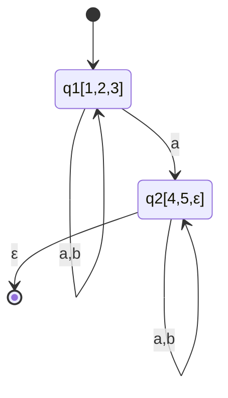
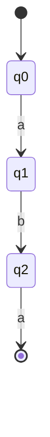
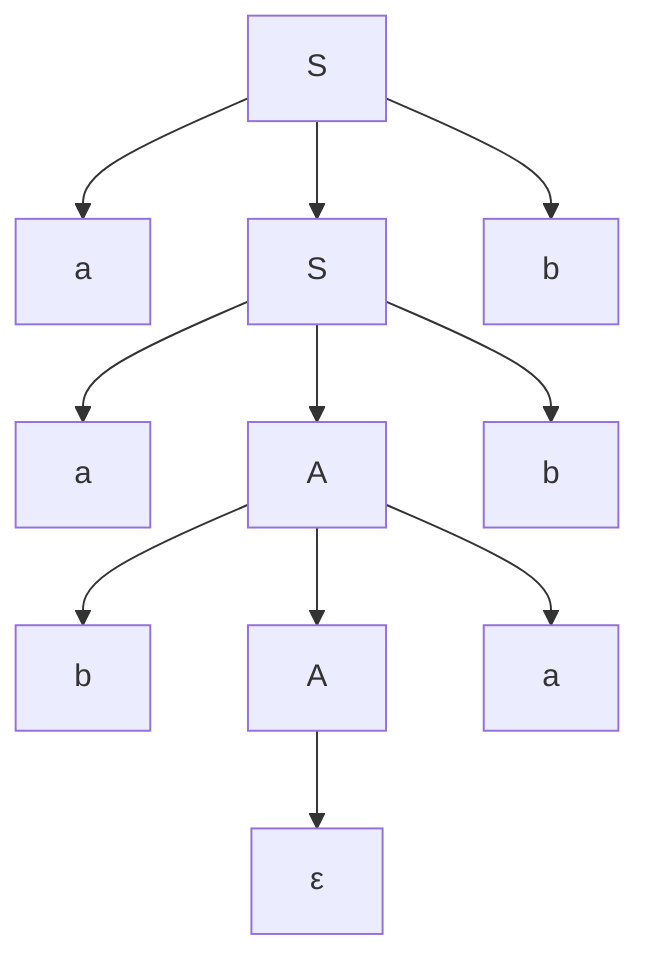

## Language

A language is a set of strings over a given alphabet ($\Sigma$). An alphabet is a finite set of symbols. For example, the binary alphabet is {0, 1}, and a language over this alphabet could be the set of all strings that contain an even number of 0s.

Languages can be classified based on their complexity and the type of rules used to generate them. The Chomsky hierarchy classifies languages into five types:

1. **Type 0 (Recursively Enumerable Languages)**: These are the most general languages and can be recognized by a Turing machine. They have no restrictions on their production rules.
2. **Type 1 (Context-Sensitive Languages)**: These languages can be recognized by a linear-bounded automaton. Their production rules are context-sensitive, meaning that the rules can depend on the surrounding symbols.
3. **Type 2 (Context-Free Languages)**: These languages can be recognized by a pushdown automaton. Their production rules are context-free, meaning that the left-hand side of each production rule consists of a single non-terminal symbol.
4. **Type 3 (Regular Languages)**: These languages are the simplest one and can be recognized by a finite automaton. Their production rules are regular, meaning that they can be expressed using regular expressions.
5. **Type 4 (Finite Languages)**: These are languages that contain a finite number of strings.

$$ \text{finite} \subset \text{regular} \subset \text{context-free} \subset \text{context-sensitive} \subset \text{recursively enumerable} $$

### Regular Expressions (RegEx)

Regular expressions are a formal way to describe regular languages. They use a combination of symbols and operators to define patterns in strings. Some common operators include:

- **Concatenation**: If `A` and `B` are regular expressions, then `AB` is a regular expression that matches any string formed by concatenating a string from `A` with a string from `B`.
- **Union**: If `A` and `B` are regular expressions, then `A|B` is a regular expression that matches any string that matches either `A` or `B`.
- **Kleene Star**: If `A` is a regular expression, then `A*` is a regular expression that matches any string formed by concatenating zero or more strings from `A`.
- **Plus**: If `A` is a regular expression, then `A+` is a regular expression that matches any string formed by concatenating one or more strings from `A`.
- **Optional**: If `A` is a regular expression, then `A?` is a regular expression that matches either the empty string or any string from `A`.
- **Character Classes**: Square brackets `[]` are used to define a set of characters. For example, `[abc]` matches any single character that is either `a`, `b`, or `c`.
- **Repetition**: Curly braces `{}` are used to specify the exact number of repetitions. For example, `a{3}` matches exactly three consecutive `a` characters.
- **Ordered Intervals**: Are used to define a range of characters. For example, `[a-z]` matches any lowercase letter from `a` to `z`.

#### Derivation

Starting from the regular expression, we can derive strings by applying the rules defined by the operators. For example, given the regular expression `a(b|c)*`, we can derive strings like `a`, `ab`, `ac`, `abb`, `abc`, `acb`, `acc`, and so on.

The same regular expression can derive the same string in multiple ways. In this case the RE is **ambiguous**.

To prove ambiguity all the characters are enumerated and by performing the derivation is possible to find the same string in different ways.

$$ (a|b)^*a(a|b)^* \to (a_1|b_2)^*a_3(a_4|b_5)^* $$
$$ (a_1|b_2)^*a_3(a_4|b_5)^* \to (a_1|b_2)^1a_3(a_4|b_5)^0 \to (a_1|b_2)a_3 \to a_1a_3 $$
$$ (a_1|b_2)^*a_3(a_4|b_5)^* \to (a_1|b_2)^0a_3(a_4|b_5)^1 \to a_3(a_4|b_5) \to a_3a_4 $$

### Finite State Automata

Finite State Automata (FSA) are abstract machines used to recognize regular languages. They consist of:

- $Q$: A finite set of states
- $\Sigma$: A finite set of input symbols (the alphabet)
- $\delta$: A transition function $\delta: Q \times \Sigma \to Q$
- $q_0$: A start state ($q_0 \in Q$)
- $F$: A set of accept states ($F \subseteq Q$)

An automata is **clean** if it has no unreachable states (states that cannot be reached from the start state) and no dead states (states from which no accept state can be reached).

A FA can be either **deterministic** (DFA) or **non-deterministic** (NFA). In a DFA, for each state and input symbol, there is exactly one transition to another state. In an NFA, there can be multiple transitions for the same state and input symbol, including transitions to multiple states or none at all.

#### Minimal Automata

A minimal automaton is the smallest possible DFA that recognizes a given regular language.

There shouldn't be _indistinguishable states_, state that can be merged without changing the language recognized by the automaton.

- If one state is accepting and the other is not, they are distinguishable.
- If two states transition to distinguishable states for some input symbol, they are distinguishable.

To minimize a DFA, we can use the **McCluskey Algorithm**, which involves the following steps:

1. Create a table to mark pairs of states that are distinguishable (i.e., one is an accept state and the other is not).
2. Iteratively mark pairs of states that can be distinguished based on their transitions to other states.
3. Group the unmarked pairs of states into equivalence classes.
4. Construct a new DFA using the equivalence classes as states.

### RegEx - Finite Automata conversions

#### Berry-Sethi Construction

The Berry-Sethi construction is a method to convert a regular expression into a non-deterministic finite automaton (NFA). The process involves the following steps:

1. Enumerate the positions of the symbols in the regular expression $(a|b)^*a(a|b)^* \to (a_1|b_2)^*a_3(a_4|b_5)^*$.
2. Determine the set of positions that can appear at the beginning (initials) and end (final) of strings generated by the regular expression.
3. Starting from the initial char, iteratively find all the possible following chars until all positions have been processed.
4. Construct the NFA using the positions as states and the transitions based on the following positions.

$$ \text{initials} = \{1, 2, 3\} $$
$$ \text{finals} = \{3, 4, 5\} $$
$$ \text{follow}(1) = \{1, 2, 3\} $$
$$ \text{follow}(2) = \{1, 2, 3\} $$
$$ \text{follow}(3) = \{4, 5, \epsilon\} $$
$$ \text{follow}(4) = \{4, 5, \epsilon\} $$
$$ \text{follow}(5) = \{4, 5, \epsilon\} $$

#### Brozozowski & McCluskey Algorithm

The Brozozowski & McCluskey algorithm to convert a finite automaton (FA) into a regular expression (RegEx) involves the following steps:

1. **State Elimination**: Systematically eliminate states from the FA. This is done until only the start and accept states remain.
2. **Transition Update**: When a state is eliminated, update the transitions between the remaining states to include the paths that went through the eliminated state. This may involve creating new regular expressions for the transitions.
3. **Final Expression**: Once all intermediate states have been eliminated, the transitions between the start and accept states will form the final regular expression that represents the language recognized by the FA.

Consider the following FA:

To convert this FA into a RegEx using the Brozozowski & McCluskey algorithm, we would:

1. Eliminate state `q1`: Update the transition from `q0` to `q2` to include the path through `q1`: `a b`.
2. Eliminate state `q2`: Update the transition from `q0` to the accept state to include the path through `q2`: `a b a`.

The final regular expression representing the language recognized by the FA is `a b a`.

### Grammars

A grammar is a set of production rules that define how strings in a language can be generated. A grammar consists of:

- A set of non-terminal symbols (N)
- A set of terminal symbols (Σ)
- A set of production rules (P)
- A start symbol (S)

Grammars can be classified based on the type of production rules they use, following the Chomsky hierarchy.

$$ S \to aSb \ | \ aAb $$
$$ A \to bAa \ | \ \epsilon $$

Derivations can be represented using parse trees, where the root represents the start symbol, and the leaves represent the terminal symbols of the derived string.

Grammars can also be ambiguous, meaning that there are multiple parse trees for the same string. To prove ambiguity, one can enumerate all possible derivations for a given string and show that there are multiple distinct parse trees.
