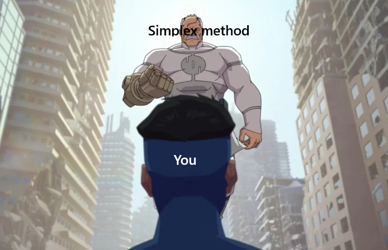
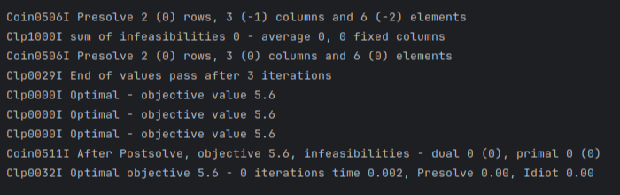
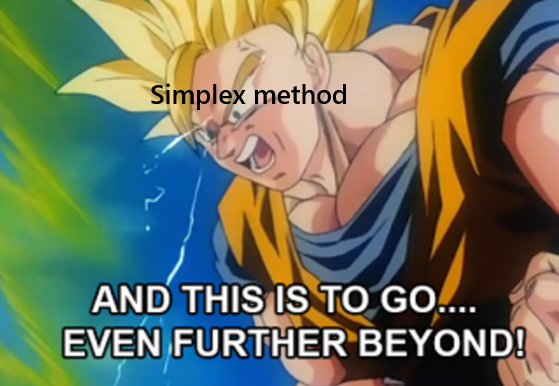
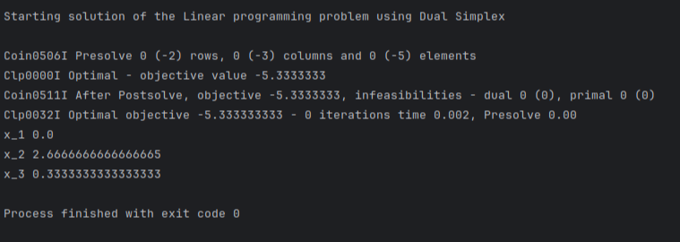

## Linear Programming 
A linear programming problem is an optimization problem where:

- **The objective function** $F : X \to R$  is linear , where X is the feasible region.
- **The feasible region**  has linear constraints.

:::{.callout .callout-definition title="Optimal solution"}
A solution $\underline{x}^* \in R^n$ is said to be **optimal** if  $f(\underline{x}^*)$ beats $f(\underline{x}), \forall \underline{x} \in X$.
:::
### Traditional representations:

<div style="display:flex; justify-content:space-between; width:100%;">

<div style="flex:1; padding-right:10px;">
<h4>General form</h4>

$$ 
    \begin{align*}
     min \quad &z = c_1 x_1 + \dots + c_nx_n \\
    & a_{11} + \dots + a_{1n}x_n (\geq,=,\leq) b_1\\
    &\vdots\\
    & a_{m1}x_1+\dots + a_{mn}x_n (\geq,=,\leq) b_m\\
    &x_1,\dots,x_n \geq 0
    \end{align*}
$$

</div>

<div style="flex:1; padding-left:10px;">
<h4>Matrix form </h4>
<div style="text-align: center;">

$min \quad z = [c_1 \dots c_n] 
\begin{bmatrix}
x_1 \\
\vdots\\
x_n
\end{bmatrix}$

</div>

<div style="display:flex; justify-content:space-between; width:100%;">

<div style="flex:1; padding-right:10px;">

$$
\begin{align*}
min \quad &z = \underline{c}^T \underline{x} \\
s.t.\quad  & A\underline{x} \geq \underline{b} \\
&\underline{x} \geq 0
\end{align*}
$$

</div>

<div style="flex:1; padding-left:10px;">
<div style="text-align: center;">


</div>

$$
s.t. \quad 
\begin{bmatrix}
a_{11} &  \dots & a_{1n} \\
\vdots & & \vdots\\
a_{m1} & \dots & a_{mn}
\end{bmatrix}
\begin{bmatrix}
x_1  \\
\vdots \\
x_n
\end{bmatrix}
\geq
\begin{bmatrix}
b_1  \\
\vdots \\
b_m
\end{bmatrix}
$$

</div>
</div>

$$
\begin{bmatrix}
x_1  \\
\vdots \\
x_n
\end{bmatrix}
\geq \underline{0}
$$
</div>
</div>

### General Assumptions
:::{.callout .callout-property title="Assumptions"}
1. Consequences of the linearity: 

   -  **Proportionality**: Contribution of each variable $=$ constant $\times$ variable , we often refer to these constants as parameters.
   -  **Additivity**: Contribution of all variable $=$ sum of single contributions : $f(x + y + z) = f(x) + f(y) + f(z)$


2. In these types of problems variables can take any rational values.


3. Parameters are constants.
:::
#### Example:
 Suppose that we want to maximize how much we gain from the selling of 5 products ( suppose that we sell and produce the products in grams) , the price/g of each one of them are respectively: 2, 3, 4, 5, 6; the cost of production of each one of them is: 3, 6, 7, 9, 10; no more than 400g must be produced and the total production cost must be lower than 3000.
We shall model this problem like this:

<div style="display:flex; justify-content:space-between; width:100%;">

<div style="flex:1; padding-right:10px;">
<h4>Traditional modelling</h4>

$$  
 \begin{align*}
        max  \quad & 2\mathscr{x}_1 + 3\mathscr{x}_2 + 4\mathscr{x}_3 + 5\mathscr{x}_4 + 6\mathscr{x}_5 \\
        s.t. \quad & 3\mathscr{x}_1 + 6\mathscr{x}_2 + 7\mathscr{x}_3 + 9\mathscr{x}_4 + 10\mathscr{x}_5 \leq 3000 \quad (1)\\
        & \mathscr{x}_1 + \mathscr{x}_2 + \mathscr{x}_3 + \mathscr{x}_4 + \mathscr{x}_5 \leq 400\quad(2)\\
        & \mathscr{x}_i \geq 0, \forall i \in {1,2,3,4,5}
\end{align*}
$$
1. Maximum production cost
2. Maximum quantity produced
</div>

<div style="flex:1; padding-left:10px;">
<h4>Using python's MIP library:</h4>

```python 
import mip
from mip import CONTINUOUS

# these are our parameters
I = [0, 1, 2, 3, 4] # Products
P = [2, 3, 4, 5, 6] # Prices
C = [3, 6, 7, 9, 10] # Costs
Cmax = 3000 # Max total cost
Qmax = 400 # Max total amount of product


model=mip.Model()
x = [model.add_var(name=f"x_{i+1}", lb=0 ,var_type=CONTINUOUS) for i in I]

# Objective function
model.objective = mip.maximize(mip.xsum(P[i] * x[i] for i in I))

# Constraints

# Maximum production cost
model.add_constr(mip.xsum(x[i]*C[i] for i in I) <= 3000)

# Maximum quantity produced
model.add_constr(mip.xsum(x[i] for i in I)<= 400)

model.optimize()
for i in model.vars:
    print(i.name,i.x)
```
</div>
</div>


## Geometry of linear Programming
### A couple of definitions:
- A **hyperplane** defined as H = {$\,\underline{x} \in R^n : \underline{a}^T \underline{x} = b\,$} is a flat surface that generalize a two-dimensional plane (in our case where b $\ne$ 0 is said to be an **affine** hyperplane).
- An **affine half-space** defined as $H^-$ = {$\,\underline{x} \in R^n:\underline{a}^T \underline{x} \leq b \,$} is the region that lies "below" or "above" an **affine hyperplane**.
 
> Each inequality constraint defines an affine half-space in the variable space.

> The feasible region of a linear programming problem is the intersection of a finite number of half-spaces (constraints).
> Said feasible region is a **polyhedron**.

<div style="display:flex; justify-content:space-between; width:100%;">

<div style="flex:1; padding-right:10px;">
<h4>Hyperplane (affine) </h4>


</div>

<div style="flex:1; padding-left:10px;">
<h4>Affine half-space</h4>


</div>
<div style="flex:1; padding-left:10px;">
<h4>Polyhedron</h4>


</div>
</div>

### Convex subsets
:::{.callout .callout-definition title="Convex subsets" }
A subset $S \subseteq R^n$ is convex if for each pair of points $\underline{x}_1,\underline{x}_2 \in S$ the segment defined by them is the defined by all the **convex combinations** of the two points:
$$
 [\underline{x}_1,\underline{x}_2] = {\:\underline{p} \in R^n : \underline{x} = \alpha\underline{x}_1 + (1 - \alpha)\underline{x}_2 \, \land \alpha \in [0,1]\:}
$$
:::

Meaning that the subset contains the whole segment connecting the two points.


[Convex set interactive graph](https://www.desmos.com/calculator/y3ays9vrh3?lang=it)

> A *polyhedron* is a convex set of $R^n$ $\implies$ The feasible region of a LP is a convex set of $R^n$

### Vertices

>A vertex of a polyhedron P is a point which cannot be expressed as a convex combination of two other **dinstinct** points of P.

Given a point $\underline{x}$ and a pair of points $(\underline{y}_1,\underline{y}_2)$ </br>

$\underline{x}$ is a vertex $\iff \:\underline{x} = \alpha\underline{y}_1 + (1 - \alpha)\underline{y}_2 \, \land \alpha \in [0,1]\: \land (\underline{x}= \underline{y}_1 \lor \underline{x}= \underline{y}_2)$ 

### Unbounded feasible direction of polyhedron
:::{.callout .callout-definition title="Unbounded feasible direction"}
An unbounded feasible direction d of a polyhedron P is a nonzero vector such that ,from a point $\underline{x} \in P$, all points of the form $\underline{x} + \lambda d \:$ with $\lambda > 0$ also belongs to P. The set of such points is often called the **ray** of d through $\underline{x}$.
:::


### Polytopes
:::{.callout .callout-definition title="Polytope"}
A polytope is a **bounded polyhedron** , hence the only unbounded feasible direction is d = 0 (so in a sense it does not have any)
:::


### Representation of polyhedra - Weyl-Minkowsky Theorem
::: {.callout .callout-theorem title="Weyl-Minkowsky Theorem"}
Every point $\underline{x}$ of a polyhedron P can be expressed as a **convex combination** of its vertices $\underline{x}^1, \dots, \underline{x}^k$ plus (if needed) an **unbounded feasible direction** \underline{d} of P:
$$
 \underline{x} = \alpha_1\underline{x}_1 + \dots + \alpha_k \underline{x}_k + \underline{d}
$$
 where $\quad\sum_{i=1}^{k} \alpha_i = 1 ,\:\alpha_i \geq 0 , \forall i \in { 1 \dots k}$ <br>
 "The multipliers are positive and theirs sum must be equal to 1"
:::
## Standard form of LPs

### Transformations rules

- $max \quad \underline{c}^T \underline{x} \implies -min \:(-\underline{c}^T \underline{x})$
 

- $\underline{a}^T \underline{x} \leq b \implies \begin{cases} \underline{a}^T\underline{x} + s = b \\
  s \geq 0
  \end{cases}\quad$ where s is a **slack** variable.
  

- $\underline{a}^T \underline{x} \geq b \implies \begin{cases} \underline{a}^T\underline{x} - s = b \\
  s \geq 0
  \end{cases}\quad$ where s is a **surplus** variable.


- $x_j$ unrestricted sign \implies $\begin{cases} x_j = {x_j}^+\,-\,{x_j}^- \\
  {x_j}^+\, , \, x_j^- \geq 0
  \end{cases}\quad$ <br><br>
After substituting $x_j$ with ${x_j}^+\,-\,{x_j}^-$ , we delete $x_j$ from the problem.

### Standard form 
::: {.callout .callout-definition title="LP standard form"}
An LP is said to be in standard form if this is its appearance:
$$
\begin{align*}
min \quad & z=\underline{c}^T\underline{x} \\
s.t. \quad & A\underline{x} = \underline{b} \\
& \underline{x} \geq \underline{0}
\end{align*}
$$
:::

#### Example:
Let's put the following LP in standard form:

$$  
\begin{align*}
max  \quad & 2\mathscr{x}_1 + 3\mathscr{x}_2 + 4\mathscr{x}_3 + 5\mathscr{x}_4 + 6\mathscr{x}_5 \\
s.t. \quad & 3\mathscr{x}_1 + 6\mathscr{x}_2 + 7\mathscr{x}_3 + 9\mathscr{x}_4 + 10\mathscr{x}_5 \leq 3000 \quad \\
& \mathscr{x}_1 + \mathscr{x}_2 + \mathscr{x}_3 + \mathscr{x}_4 + \mathscr{x}_5 \leq 400\quad\\
& \mathscr{x}_i \geq 0, \forall i \in {1,2,3,4} \: , \mathscr{x}_5 \in R
\end{align*}
$$
  
1. From maximization to minimization
   $$  
   \begin{align*}
   min  \quad & -2\mathscr{x}_1 - 3\mathscr{x}_2 - 4\mathscr{x}_3 - 5\mathscr{x}_4 - 6\mathscr{x}_5 \\
   s.t. \quad & 3\mathscr{x}_1 + 6\mathscr{x}_2 + 7\mathscr{x}_3 + 9\mathscr{x}_4 + 10\mathscr{x}_5 \leq 3000 \quad \\
   & \mathscr{x}_1 + \mathscr{x}_2 + \mathscr{x}_3 + \mathscr{x}_4 + \mathscr{x}_5 \leq 400\quad\\
   & \mathscr{x}_i \geq 0, \forall i \in {1,2,3,4} \: , \mathscr{x}_5 \in R
   \end{align*}
   $$
2. From inequality to equalities by adding slack variables
   $$  
   \begin{align*}
   min  \quad & -2\mathscr{x}_1 - 3\mathscr{x}_2 - 4\mathscr{x}_3 - 5\mathscr{x}_4 - 6\mathscr{x}_5 \\
   s.t. \quad & 3\mathscr{x}_1 + 6\mathscr{x}_2 + 7\mathscr{x}_3 + 9\mathscr{x}_4 + 10\mathscr{x}_5 + S_1 = 3000 \quad \\
   & \mathscr{x}_1 + \mathscr{x}_2 + \mathscr{x}_3 + \mathscr{x}_4 + \mathscr{x}_5 + S_2 = 400\quad\\
   & \mathscr{x}_i \geq 0, \forall i \in {1,2,3,4} \: , \mathscr{x}_5 \in R \\
   & S_1, S_2 \geq 0
   \end{align*}
   $$
3. Substituting unrestricted sign variables
   $$  
   \begin{align*}
   min  \quad & -2\mathscr{x}_1 - 3\mathscr{x}_2 - 4\mathscr{x}_3 - 5\mathscr{x}_4 - 6\mathscr{x}_5 \\
   s.t. \quad & 3\mathscr{x}_1 + 6\mathscr{x}_2 + 7\mathscr{x}_3 + 9\mathscr{x}_4 + 10\mathscr{x}_5 + S_1 = 3000 \quad \\
   & \mathscr{x}_1 + \mathscr{x}_2 + \mathscr{x}_3 + \mathscr{x}_4 + \mathscr{x}_5^+ - \mathscr{x}_5^- + S_2 = 400\quad\\
   & \mathscr{x}_i \geq 0, \forall i \in {1,2,3,4} \:  \\
   & \mathscr{x}_5^+ , \mathscr{x}_5^- \geq 0 \\
   & S_1, S_2 \geq 0
   \end{align*}
   $$
    The problem is now in standard form.
4. 
## Fundamental Theorem of Linear Programming

:::{.callout .callout-theorem title="Fundamental Theorem of Linear Programming"}
Consider a minimization problem in standard form where the constraints define a non-empty feasible area (polyhedron) P.
Then either:

1. The value of **the objective function** is **unbounded below** on P.

2. Exists at least one **optimal** vertex.
:::

 
#### Proof
##### Case 1:
P has an unbounded feasible direction $\underline{d}$ such that $\underline{c}^T\underline{d}<0$ ,this means that proceeding in that direction will make the value smaller and smaller and the objective value tends to -$\infty$.

##### Case 2:
P has no unbounded feasible direction such that along that path the value keeps getting smaller.
As we saw any point of the feasible region can be expressed as a convex combination of its vertices plus the unbounded direction, so for any $\underline{x} \in P$ we have $\underline{d}$ or $\underline{c}^T \underline{d} \geq 0$ (either the value along that direction gets bigger or that direction is $\underline{0}$) so:

$$
    \underline{c}^T\underline{x} = \underline{c}^T ( \sum_{i=1}^{k}{\alpha_i\underline{x}^i + \underline{d}}) =\sum_{i=1}^{k}{\alpha_i\underline{c}^T\underline{x}^i +\underline{c}^T\underline{d}} \geq min_{i=1.\dots,k}{(\underline{c}^T\underline{x}^i)}
$$

Put in words this tells us that the objective value of any point inside the feasible region ($\underline{c}^T (\sum_{i=1}^{k}{\alpha_i\underline{x}^i + \underline{d}})$) will be bigger the minimum value that the objective function has in one of its vertices (the optimal vertex) : $min_{i=1.\dots,k}{(\underline{c}^T\underline{x}^i)}$.

>This also foreshadow that the solution of any minimization problem lies in one of its vertices ( if the solution is unique)

This would likely become more clear when we see how to solve LP problems graphically.

### Types of LPs
1. Unique optimal solution.
2. Multiple(infinite) optimal solutions.
3. Unbounded LP: Unbounded polyhedron and unlimited objective function value.
4. Empty polyhedron: no feasible solutions.

### Solving LPs Graphically

We would like to solve this problem:

$$
\begin{align*}
max &\quad x_1+3x_2 \\
    &\quad -x_1+x_2 \geq-2\\
    &\quad 2x_1+x_2 \leq 10 \\
    &\quad -x_1+3x_2 \leq 9 \\
    &\quad x_1,x_2 \geq 0
\end{align*}
$$

This is our feasible region (x = $x_1$ ; y  = $x_2$):


Lets analyze the objective function:
$$
 z=x_1+3x_2
$$
Lets compute its gradient:
$$
\nabla z= [ 1 \quad 3]^T
$$

This tells us where to go if we want our value to increase, since we are solving an LP this direction will always be the same.

Let's take a level curve from our objective function by assigning z to some constant c:
$$
c = x_1+3x_2
$$
Starting from 0 we see that by increasing the value of c the level curve follows the direction of the gradient:


If we follow that direction we would see that it leads us to the vertex $[3 \:,\: 4]^T$ since it the last meeting point it will give us the maximum value of the objective function:

$$
 z = 1 \times 3 + 3 \times 4 = 15
$$

This graphical method is pretty easy to use , but it is feasible only for problems with less than 2 variables.
To solve bigger problems we must find a better method.

#### MIP implementation:
```python
import mip
from mip import CONTINUOUS

model = mip.Model()
# variable definition
x = [model.add_var(name = f"x_{1}", lb =0 ,var_type=CONTINUOUS), model.add_var(name = f"x_{2}", lb =0 ,var_type=CONTINUOUS)]
# objective function
model.objective = mip.maximize(x[0]+3*x[1])
# constraints
model.add_constr(-x[0]+x[1] >= -2)
model.add_constr(2*x[0]+x[1] <= 10)
model.add_constr(-x[0]+3*x[1] <= 9)

model.optimize()
for i in model.vars:
    print(i.name,i.x)
```


## Basic feasible solutions and vertices of polyhedra
The geometrical definition of vertex cannot be exploited algorithmically because even though LPs can be viewed as combinatorial problems, and you can theoretically examine only the vertices and keep the best, the number of vertices is often exponential, so this route is not feasible.

**We need algebraic characterization**

Consider a polyhedron (feasible region) P = {$\underline{x} \in R^n : A \underline{x} = \underline{b} , \underline{x} \geq$}

**Assumption**: $A \in R^{m\times n}$ (n variables and m constraints) is such that $m\leq n$ of rank m (There are no redundant constraints)

- If m=n , there is a unique solution for $A\underline{x} = \underline{b}$
- If m<n , there are $\infty$ solutions for $A\underline{x} = \underline{b}$ . The system has n-m degrees of freedom( the number of variables that can freely change while still satisfying the constraints), n-m variables can be fixed arbitrarily and by fixing them to 0 we get a vertex.

:::{.callout .callout-definition title="Basis"}
A basis of a matrix "A" is a subset of its columns "m" that are linearly independent and form an m$\times$m non-singular(invertible) matrix B.
We can separate A like this:

$$
A=[\overbrace{B}^{m} \: |\overbrace{N}^{n-m}]
$$
:::

Similarly to "A" we can also separate the variables in **basic** ("inside" of B) and **non-basic** ("inside" of N) , like so:
$$
\underline{x}=[\:\underline{x}_B^T\quad|\quad\underline{x}_N^T\:]\quad (1)
$$

By substituting (1) into our system: $A\underline{x} = \underline{b}$; we can rewrite it as:
$$
B\underline{x}_B+N\underline{x}_n = \underline{b}
$$

Thanks to the non-singularity of B we can describe the set of basic variables using the non-basic ones:
$$
\underline{x}_B=B^{-1}b-B^{-1}N\underline{x}_N
$$

So lets put things together:

- A basic solution is a solution obtained by setting $\underline{x}_N = \underline{0}$ (it's basic because there are no non-basic variables **DUH**), with this our definition of basic variables becomes:
  $\underline{x}_B = B^{-1}b$
- A basic solution with $\underline{x}_B \geq 0$ is a basic **feasible solution** (the problem is in standard form, the variables are positive).

Wait , we said that by fixing n-m variables to 0 we get a vertex , but later we saw that a basic solution is obtained by setting to 0 all the non-basic variables which are also n-m, wonder what that could mean...

Not surprsingly:

:::{.callout .callout-definition title="Radagon is Marika"}
$$
vertex\quad \iff \quad basic\:feasible\:solution
$$
:::

>Number of basic feasible solutions: At least $\binom{n}{m}$ (from the fundamental theorem looking at LPs as combinatorial problems)

## Simplex method



We discussed the need for a method that would work even for bigger problems, this method is the way to go, but before talking about it, we need to discuss a few things.

### Active constraints
Let's take a feasible region:


defined by these constraints:
$$
\begin{align*}
&\quad x_1-x_2 \leq 2\\
&\quad 2x_1+x_2 \leq 10 \\
&\quad -x_1+3x_2 \leq 9 \\
&\quad x_1,x_2 \geq 0
\end{align*}
$$

Let's put them in standard form by adding slack variables $S_1, S_2, S_3$:

$$
\begin{align*}
&\quad x_1-x_2 + S_1 = 2\\
&\quad 2x_1+x_2+ S_2 = 10 \\
&\quad -x_1+3x_2 + S_3 = 9 \\
&\quad x_1,x_2,S_1,S_2,S_3 \geq 0
\end{align*}
$$

If we decide to assign 0 to one of the slack variables,the original constraint becomes an equality, meaning that the variables will "be moving" on the "side" that the constraint describe.

By doing so we say that we **activate** the constraint.

In other words:

:::{.callout .callout-definition title="Active constraint"}
If an assignment of the variables results in a point that lies on one of the borders of the feasible region , the constraint that is responsible for that border is labelled as active.
:::

### Moving from a vertex to another

When we talked about the **LP Fundamental theorem** we saw how enumerating all the vertices and keeping only the best, is not a good strategy.
So instead of trying to find all of them, we'll work on how to find one by "moving" from a neighboring vertex that we already know.

Let's take a feasible region:


Defined by these constraints:
$$
\begin{align*}
&\quad x_1+x_2 \leq 7\\
&\quad -x_1+x_2 \leq 3 \\
&\quad x_1-2x_2  \leq 1 \\
&\quad x_1,x_2 \geq 0
\end{align*}
$$

Put in standard form:

$$
\begin{align*}
&\quad x_1+x_2+S_1 = 7 \quad (1)\\  
&\quad -x_1+x_2+S_2 = 3 \quad (2)\\
&\quad x_1-2x_2+S_3  = 1 \quad (3)\\
&\quad x_1,x_2,S_1,S_2,S_3 \geq 0
\end{align*}
$$

Our matrix A is :
$$
A= \begin{bmatrix}
 1 & 1 & 1 & 0 & 0  \\
 -1 & 1 & 0 & 1 &0  \\
1 & -2 & 0 & 0 & 1
\end{bmatrix}
$$

we have m = 3 and n = 5 so we have 2 degrees of freedom.

Let's pick a starting point, we choose the vertex "A" since we just need to take out the first two columns of the matrix to find it
(remember that since we are talking about vertexes the variable that are non-basic are set to 0 , and since all of Ss variables are basic none of them 0 meaning no constraints is active).

Our matrix is partitioned this way:

$$
B= \begin{bmatrix}
 1 & 0 & 0  \\
 0 & 1 &0  \\
 0 & 0 & 1
\end{bmatrix}\quad
N=\begin{bmatrix}
1 & 1   \\
-1 & 1   \\
1 & -2
\end{bmatrix}
$$

Now lets say that we want to move from vertex A to vertex B :


How should we change our basis to achieve the goal?

We must activate the constraints whose interception defines the wanted vertex, in our case the constraint (3), so we activate it by dropping the column $[0,\:0,\:1]^T$ from B and adding $[1,\:-1,\:1]^T$ (we need $x_2$ also to be 0 so we keep it non-basic by not choosing the other column).

Our partition is now:

$$
B= \begin{bmatrix}
1 &1 & 0   \\
-1& 0 & 1  \\
1 &0 & 0 
\end{bmatrix}\quad
N=\begin{bmatrix}
 1  & 0 \\
 1  & 0 \\
 -2 & 1
\end{bmatrix}
$$

And we moved to vertex B.

What if we wanted to move from B to C?


We need to activate constraint (1) since C is the meeting point of (1) and (3) so we kick $S_1$ out :

$$
B= \begin{bmatrix}
1 &1 & 0   \\
-1& 1 & 1  \\
1 &-2 & 0
\end{bmatrix}\quad
N=\begin{bmatrix}
1  & 0 \\
0  & 0 \\
0& 1
\end{bmatrix}
$$

We are now in vertex C.

Now that we saw how to move to neighboring vertex , we need to find a good way to determine which vertex it would be better to move to.

### Reduced costs
We have an LP in standard form:
$$
\begin{align*}
min\quad & z=\underline{c}^T\underline{x}\\
& A\underline{x} = \underline{b}
\end{align*}
$$
Let's now expand the objective function by making explicit the basic and non-basic parts:
$$
z = [\:\underline{c}_B^T \quad \underline{c}_N^T\:] \begin{bmatrix}
\underline{x}_B \\
\underline{x}_N
\end{bmatrix} \quad(1)
$$

We previously saw how to express basic variables in terms of non-basic ones , like so (with B and N being partitions of A):
$$
\underline{x}_B=B^{-1}b-B^{-1}N\underline{x}_N \quad(2)
$$

So we can rewrite (1) using (2) as:

$$
z=[\:\underline{c}_B^T \quad \underline{c}_N^T\:] \begin{bmatrix}
B^{-1}b-B^{-1}N\underline{x}_N \\
\underline{x}_N
\end{bmatrix} \quad
$$

That translates into:
$$
z = \underline{c}_B^T B^{-1} b-c_B^TB^{-1} N \underline{x}_N+c_N^T\underline{x}_N
$$

Let's group by $\underline{x}_N$:
$$
z = \underbrace{\underline{c}_B^T B^{-1} b}_{V}+\underline{x}_N(\underbrace{c_N^T-c_B^TB^{-1}N}_R)
$$

The first part of the formula (V) is the value of the objective function when we are in a basic feasible solution (vertex) since $\underline{x}_N$ is $\underline{0}$.

The second part of the formula (R) are the reduced costs(of then non-basic variables), but before giving you the definition let's try to understand what are the reduced cost.

### Definition walkthrough

Let's start from our formula:

$$
\underline{\overline{c}}_N^T = c_N^T-c_B^TB^{-1}N
$$

The $c_N^T$ part doesn't tell us much ,it just is the contribution of the non-basic variables in the objective function.
The $c_B^TB^{-1}N$ part on the other hand is where the things start to get interesting.

What is $B^{-1}N$?

Let's suppose that we have the following constraint:
$$
x_1 +4 x_2 + 2 x_3 + x_4 = 24
$$

And we have these assignments: 
$$
\underline{x}^T = [\:1\quad 2\quad 6 \quad3\:]
$$

>If we decided to change the value of one of the variables, how the others should adjust themselves in order to still satisfy the constraint?

This is exactly what $B^{-1}N$ tells us.

Let's crunch some numbers:

We have this LP:

$$
\begin{align*}
min\quad &x_1+2 x_2+3x_3+x_4\\
&x_1+2x_2+x_3 = 5\\
&x_2+x_3+x_4 = 3\\
\end{align*}
$$
We decide to start from a vertex by choosing $x_1$ and $x_4$ as basic variables, so we partition the matrix this way:
$$
B= \begin{bmatrix}
1 & 0   \\
0&  1  
\end{bmatrix}\quad
N=\begin{bmatrix}
2  & 1 \\
1  & 1 
\end{bmatrix}
$$

Our current assignment is:
$$
\underline{x}^T=[\:5\quad0\quad 0 \quad3\:]
$$
or

$$
\underline{x}_B^T=[\:5\quad3\:]\quad \quad \underline{x}_N^T=[\: 0 \quad 0 \:]
$$

The objective value is:
$$
5 + 0 + 0 + 3 = 8
$$
What if we increased $x_2$ by 1?

Let's compute $B^{-1}N$:
$$
B^{-1}N=\begin{bmatrix}
2  & 1 \\
1  & 1
\end{bmatrix}
$$
This tells us that by increasing $x_2$ by 1 the value of $x_1$ must change by a factor of 2 and $x_4$ by a factor of 1 (the first column), lets see it algebraically:

We know that:

$$
\underline{x}_B=B^{-1}b-B^{-1}N\underline{x}_N
$$

>Which holds regardless whether we are in a vertex or not, we are just expressing two variables in function of the other two.

So let's compute the new values of $x_1$ and $x_4$:

$$
\underline{x}_B=\begin{bmatrix} 5\\ 3\end{bmatrix}-\begin{bmatrix}
2  & 1 \\
1  & 1
\end{bmatrix}\begin{bmatrix} 1\\ 0\end{bmatrix} = \begin{bmatrix} 3\\ 2\end{bmatrix}
$$
Where $[1\quad 0]^T$ is the new assignment of $x_2$.

The constraints hold:

$$
\begin{align*}
& 3 +2\times 1+0 = 5\\
&1+0+2 = 3\\
\end{align*}
$$

The new value of the objective is:

$$
3+2\times1+0+2 = 7
$$

Let's use the formula given by our previous definition:

$$
\underline{\overline{c}}_N^T = c_N^T-c_B^TB^{-1}N
$$

Substituting:
$$
\begin{align*}
\underline{\overline{c}}_N^T &= [\:2\quad3\:] - [\:1\quad1\:]\begin{bmatrix}
2  & 1 \\
1  & 1
\end{bmatrix} \\
& =[\:2\quad3\:] - [\:3\quad2\:] \\
&\\
& =[\:-1\quad1\:]
\end{align*}\\
$$
This tells us that value of the objective changes by -1 which is exactly what we got from our calculations (the other value is the change that we would get by increasing $x_3$ by one)

So let's now give the definition of reduced costs:

:::{.callout .callout-definition title="Reduced costs"}
The reduced costs (of non-basic variables) represents the change in the objective function value if non-basic $x_j$ would be increased from 0 to 1 while keeping all other non-basic variables to 0.
(we specified the variables as non-basic because we express the basis one in function of the non-basic one, but this potentially hold for any partitioning)

The solution value changes by $\Delta z= \overline{c}_j \Delta x_j$ ( in our previous example $\Delta x_j$ was 1)
:::

> we say that the reduced cost of basic variables is 0.
 
### Optimality of a solution
We said that in a standard form LP (minimization problem) the optimal solution $\underline{x}^*$ is such that:
$$
\underline{c}^T \underline{x}^* \leq \underline{c}^T \underline{x}, \forall \underline{x} \in R^n
$$
So by moving to any other point our solution must have an increase in its value, meaning that the reduced cost must be $\geq 0$.

Paraphrasing:

:::{.callout .callout-definition title="Optimal solution"}
If $\underline{\overline{c}}_n \geq 0$ then the basic feasible solution $(\underline{x}_B^T,\underline{x}_N^T)$ of cost (value) $\:\underline{c}_B^TB^{-1}\underline{b}$ is a global optimum (technically a local optimum, but since we are in a linear context the definitions are equivalent).
:::

### Tightest upper bound
In order to keep all the values of the variables positive , we need a measure to determine how much we can increase the value of a non-basic before violating this constraint.

Let's start from our definition of basic variables:
$$
\underline{x}_B=B^{-1}b-B^{-1}N\underline{x}_N
$$

We must guarantee that
$$
B^{-1}b-B^{-1}N\underline{x}_N \geq 0
$$
Let's redefine our members like this:
$$
\overline{\underline{b}} = B^{-1}b =\begin{bmatrix}\:\overline{b}_1 \\ \vdots \\ \:\overline{b}_i  \end{bmatrix} \quad \quad \quad \overline{N}=B^{-1}N=\begin{bmatrix} \overline{a}_{11} & \dots & \overline{a}_{1s} \\
\vdots & & \vdots \\
\overline{a}_{i1} & \dots & \overline{a}_{is}
\end{bmatrix}
$$
Remember that we are in a vertex (so all non-basic to 0), and we want to se how much we can increase a non-basic before violating the positivity constraint.

So if we wish to increase the $x_s$ variable(from 0), this must hold:

$$
\overline{b}_i - \overline{a}_{is} x_s \geq 0 \implies x_s \leq \overline{b}_i / \overline{a}_{is} , \quad for \quad \overline{a}_{is} \geq 0
$$

:::{.callout .callout-definition title="Tightest upperbound"}
$$
\Theta^* = \min_{j=1,\dots,i}{\leq \overline{b}_i / \overline{a}_{is} , \quad for \quad \overline{a}_{is} \geq 0}
$$
:::

>Why must $\overline{a}_{is}$ by greater or equal than 0?

Because if it's negative that means that for what concerns the variable at row "i" the non-basic can increase as much as we want, since that variable also increase with it!

Meaning that if $\overline{a}_{is}$ \leq 0 $\forall i$ , there is no limit to the increase of $x_s$.

### Tableau representation
Tableau representation is a useful way to represent an LPs ,and it is a key part of the simplex method.

Let's start from an LP in standard form:
$$
\begin{align*}
min\quad & x_1+x_2+3x_3\\
s.t.\quad & x_1-2x_2+3x_3+S_1=10 \\
& -x_1-x_2-x_3+S_2 = -8 \\
&x_1,x_2,x_3,S_1,S_2 \geq 0
\end{align*}
$$

we choose a starting point by partitioning A , we always start by putting B as a subset of columns that form an Identity, since we want an easy starting BSF (vertex/basic feasible solution), in our case we choose a basis of $S_1$ and $S_2$:
$$
B= \begin{bmatrix}
1 & 0   \\
0&  1  
\end{bmatrix}\quad
N=\begin{bmatrix}
1  & -2 & 3 \\
-1  & -1 & -1
\end{bmatrix}
$$


Then we organize the data in table-like structure:

|       |                                     | $x_1$              | $x_2$ | $x_3$ | $S_1$ | $S_2$ |
|-------|-------------------------------------|--------------------|-------|-------|-------|-------|
| $-z$  | current value of the objective * -1 | objective function |
| $S_1$ | value of the variable               | constraint 1       |       |       |       |       |
| $S_2$ | value of the variable               | constraint 2       |       |       |       |       |

(I apologize for the abhorrent creation that I just made, but when Mr. Dantiz  designed this horrendous representation had only evil thoughts in his mind)

Substituting with our values:

|       |    | $x_1$ | $x_2$ | $x_3$ | $S_1$ | $S_2$ |
|-------|----|-------|-------|-------|-------|-------|
| $-z$  | 0  | 1     | 1     | 3     | 0     | 0     |
| $S_1$ | 10 | 1     | -2    | 3     | 1     | 0     |
| $S_2$ | -8 | -1    | -1    | -1    | 0     | 1     |

(we will discuss the reason behind -z shortly)

This is the first step of the simplex method, and we can now start to discuss its logic.

### Moving through vertex using tableau representation
Let's take this LP in standard form:
$$
\begin{align*}
min  &\quad x_1-3x_2 \\
s.t. &\quad x_1-x_2 + S_1 = 2 \\
&\quad 2x_1+x_2+ S_2 = 10 \\
&\quad -x_1+3x_2 + S_3 = 9 \\
&\quad x_1,x_2,S_1,S_2,S_3 \geq 0
\end{align*}
$$

and its tableau representation starting from the vertex in the origin (so the base is formed by $S_1$, $S_2$ and $S_3$)

|       |    | $x_1$ | $x_2$ | $S_1$ | $S_2$ | $S_3$ |
|-------|----|-------|-------|-------|-------|-------|
| $-z$  | 0  | 1     | -3    | 0     | 0     | 0     |
| $S_1$ | 2  | 1     | -1    | 1     | 0     | 0     |
| $S_2$ | 10 | 2     | 1     | 0     | 1     | 0     |
| $S_3$ | 9  | -1    | 3     | 0     | 0     | 1     |

What needs to be done to move from (0,0) to (0,3)?


As we saw , we need to make $x_2$ enter and $S_3$ exits (since the first is the one responsible for that border) , let's see how this translates in the tableau representation:

We have this set of equations:

$$
\begin{align*}
&z = x_1-3x_2 \\
&x_1-x_2 + S_1 = 2 \quad(1)\\
&2x_1+x_2+ S_2 = 10 \quad(2)\\
&-x_1+3x_2 + S_3 = 9 \quad(3)\\
\end{align*}
$$

Since we want to enter $x_2$ making it a basic variable, we need to express it in function of non-basic variables, we will use (3) since it is the only basic variable in that constraint.

So we pivot that equation to explicit the $x_2$ term (meaning we want him with a coefficient of 1) :

$$
-\frac{1}{3} x_1+x_2+\frac{1}{3} S_3 = 3 \quad (4)
$$

>Since $x_2$ is the only basic variable here we can say that its value is 3.

Now we'll use (4) to "correct" the other equations:

$$
\begin{align*}
&z = x_1-3*(3 +\frac{1}{3} x_1-\frac{1}{3} S_3) \\
&x_1-(3 +\frac{1}{3} x_1-\frac{1}{3} S_3) + S_1 = 2 \quad(1)\\
&2x_1 +(3 +\frac{1}{3} x_1-\frac{1}{3} S_3)+ S_2 = 10 \quad(2)\\
&x_2 = 3 +\frac{1}{3} x_1-\frac{1}{3} S_3\quad (4*)\\
\end{align*}
$$

That gives us:

$$
\begin{align*}
&z = S_3-9\\
&\frac{4}{3}x_1+S_1+S_3 = 5 \quad(1)\\
&\frac{7}{3}x_1 + S_2 -\frac{1}{3}S_3 = 7 \quad(2)\\
&-\frac{1}{3} x_1+x_2+\frac{1}{3} S_3 = 3 \quad (4)\\
\end{align*}
$$

We rewrite the objective function as:
$$
 z+9 = S_3
$$
Since $S_3$ is a non-basic variable (so its value is 0) we can say that: $-z=9$

This is how our system after the change of basis looks like:

$$
\begin{align*}
&z+9 = S_3\\
&\frac{4}{3}x_1+S_1+S_3 = 5 \quad(1)\\
&\frac{7}{3}x_1 + S_2 -\frac{1}{3}S_3 = 7 \quad(2)\\
&-\frac{1}{3} x_1+x_2+\frac{1}{3} S_3 = 3 \quad (4)\\
\end{align*}
$$

>This is precisely how moving from a vertex to another works in tableau representation.

We start from:

|       |    | $x_1$ | $x_2$ | $S_1$ | $S_2$ | $S_3$ |
|-------|----|-------|-------|-------|-------|-------|
| $-z$  | 0  | 1     | -3    | 0     | 0     | 0     |
| $S_1$ | 2  | 1     | -1    | 1     | 0     | 0     |
| $S_2$ | 10 | 2     | 1     | 0     | 1     | 0     |
| $S_3$ | 9  | -1    | 3     | 0     | 0     | 1     |

We enter $x_1$ by dropping $S_3$ so we pivot on $x_1$ (by dividing for -1) and we get:

|       |    | $x_1$          | $x_2$ | $S_1$ | $S_2$ | $S_3$         |
|-------|----|----------------|-------|-------|-------|---------------|
| $-z$  | 0  | 1              | -3    | 0     | 0     | 0             |
| $S_1$ | 2  | 1              | -1    | 1     | 0     | 0             |
| $S_2$ | 10 | 2              | 1     | 0     | 1     | 0             |
| $x_2$ | 3  | $-\frac{1}{3}$ | 1     | 0     | 0     | $\frac{1}{3}$ |

Then we correct the other lines by doing so:

- Update $S_1$:
$$
\begin{align*}
S_1&= [\:2 \quad 1 \quad -1 \quad 1 \quad 0 \quad 0\:] - (-1) *[\:3 \quad -\frac{1}{3} \quad 1 \quad 0 \quad 0 \quad \frac{1}{3}\:] \\
&=[\:5 \quad \frac{4}{3} \quad 0 \quad 1 \quad 0 \quad 1\:]
\end{align*}
$$

|       |    | $x_1$          | $x_2$ | $S_1$ | $S_2$ | $S_3$         |
|-------|----|----------------|-------|-------|-------|---------------|
| $-z$  | 0  | 1              | -3    | 0     | 0     | 0             |
| $S_1$ | 5  | $\frac{4}{3}$  | 0     | 1     | 0     | 1             |
| $S_2$ | 10 | 2              | 1     | 0     | 1     | 0             |
| $x_2$ | 3  | $-\frac{1}{3}$ | 1     | 0     | 0     | $\frac{1}{3}$ |

- Update $S_2$:
$$
\begin{align*}
S_2&= [\:10 \quad 2 \quad 1 \quad 0 \quad 1 \quad 0\:] - (1) *[\:3 \quad -\frac{1}{3} \quad 1 \quad 0 \quad 0 \quad \frac{1}{3}\:] \\
&=[\:7 \quad \frac{7}{3} \quad 0 \quad 0 \quad 1 \quad -\frac{1}{3}\:]
\end{align*}
$$

|       |    | $x_1$          | $x_2$ | $S_1$ | $S_2$ | $S_3$          |
|-------|----|----------------|-------|-------|-------|----------------|
| $-z$  | 0  | 1              | -3    | 0     | 0     | 0              |
| $S_1$ | 5  | $\frac{4}{3}$  | 0     | 1     | 0     | 1             |
| $S_2$ | 7  | $\frac{7}{3}$  | 0     | 0     | 1     | -$\frac{1}{3}$ |
| $x_2$ | 3  | $-\frac{1}{3}$ | 1     | 0     | 0     | $\frac{1}{3}$  |

- Update $-z$:
  $$
  \begin{align*}
  -z&= [\:0 \quad 1 \quad -3 \quad 0 \quad 0 \quad 0\:] - (-3) *[\:3 \quad -\frac{1}{3} \quad 1 \quad 0 \quad 0 \quad \frac{1}{3}\:] \\
  &=[\:9 \quad 0 \quad 0 \quad 0 \quad 0 \quad 1\:]
  \end{align*}
  $$

|       |   | $x_1$          | $x_2$ | $S_1$ | $S_2$ | $S_3$          |
|-------|---|----------------|-------|-------|-------|----------------|
| $-z$  | 9 | 0              | 0     | 0     | 0     | 1              |
| $S_1$ | 5 | $\frac{4}{3}$  | 0     | 1     | 0     | 1              |
| $S_2$ | 7 | $\frac{7}{3}$  | 0     | 0     | 1     | -$\frac{1}{3}$ |
| $x_2$ | 3 | $-\frac{1}{3}$ | 1     | 0     | 0     | $\frac{1}{3}$  |


This is how we perform a change of basis using tableau representation,now in order to complete our journey in the whimsical world of the simplex method we need one last thing:

**A way to determine which variable exits and which enters in order to chase after the optimal solution.**

### Chasing the optimal

>How we know in an LP (in standard form , so minimization problem) when we are in an optimal solution?
>$\implies$ we look at the reduced costs, if they are all positive we are optimal.

Let's remember the formula for the objective value:

$$
z = \underline{c}_B^T B^{-1} b+\underline{x}_N(\underbrace{c_N^T-c_B^TB^{-1}N}_{Reduced \: costs})
$$

In the tableau representation the first line is composed like this:

$$
z-z_0 = \underline{x}_N * (coefficients)
$$

>Not surprisingly those coefficients are the reduced costs (after pivoting operations) of the non-basic variables

So in order to improve the objective value we will include into the basis only variables that have a negative reduced cost (which will result in a smaller objective value).

> And when all reduced costs are positive we'll have reached our solution.


**Blands rule** : In order to avoid being stuck in loops , the variables with smaller indexes enter first (from left to right).

What about the variables that we drop?

We need to remember that each time we enter a variable into the basis (changing is value from 0 to another value), we also need to drop another variable (by literally bringing its value down to 0), this operation not only affects the two variables that we chose but also all the other basic variables that needs to be recalibrated in order to not break the constraints ,and they have to be positive.

So how can we determine which is the best variable to drop?

>We drop the first variable that goes to zero.

Why?

>Because since its value "drops faster" we are sure that the others will still retain positive values.

What shall we use to determine which variable "drops" faster?

>We choose the variable with the tightest upperbound

Having a tableau like this:

|       |                   | $x_1$                | $x_2$                | $x_3$ | $x_4$ | $x_5$ |
|-------|-------------------|----------------------|----------------------|-------|-------|-------|
| $-z$  | $-z_0$            | $\overline{c}_{N_1}$ | $\overline{c}_{N_2}$ | 0     | 0     | 0     |
| $x_3$ | $\underline{b}_1$ | $\underline{a}_{11}$ | $\underline{a}_{12}$ | 1     | 0     | 0     |
| $x_4$ | $\underline{b}_2$ | $\underline{a}_{21}$ | $\underline{a}_{22}$ | 0     | 1     | 0     |
| $x_5$ | $\underline{b}_3$ | $\underline{a}_{31}$ | $\underline{a}_{32}$ | 0     | 0     | 1     |

If we wished to enter $x_2$ , we compute for all rows $\underline{b}_i$/$\underline{a}_{i2}$ (for $\underline{a}_{i2}$ **positive** ) and we drop the one with the minimum.


### Example

<div style="display:flex; justify-content:space-between; width:100%;">

<div style="flex:1; padding-right:10px;">
<h4>By hand</h4>

$$  
\begin{align*}
max  \quad & 2\mathscr{x}_1 + 3\mathscr{x}_2 + 5\mathscr{x}_3 + 2\mathscr{x}_4  \\
s.t. \quad & \mathscr{x}_1 + 2\mathscr{x}_2 + 3\mathscr{x}_3 + \mathscr{x}_4  \leq 3 \quad\\
& 2\mathscr{x}_1 + \mathscr{x}_2 + \mathscr{x}_3 + 2\mathscr{x}_4  \leq 4\quad\\
& \mathscr{x}_i \geq 0, \forall i \in {1,2,3,4}
\end{align*}
$$

Standard form:

$$  
\begin{align*}
min  \quad & -2\mathscr{x}_1 - 3\mathscr{x}_2 - 5\mathscr{x}_3 - 2\mathscr{x}_4  \\
s.t. \quad & \mathscr{x}_1 + 2\mathscr{x}_2 + 3\mathscr{x}_3 + \mathscr{x}_4 +\mathscr{x}_5 = 3 \quad \\
& 2\mathscr{x}_1 + \mathscr{x}_2 + \mathscr{x}_3 + 2\mathscr{x}_4 + \mathscr{x}_6 \leq 4\quad\\
& \mathscr{x}_i \geq 0, \forall i \in {1,2,3,4,5,6}
\end{align*}
$$

Tableau representation:

|       |   | $x_1$ | $x_2$ | $x_3$ | $x_4$ | $x_5$ | $x_6$ |
|-------|---|-------|-------|-------|-------|-------|-------|
| $-z$  | 0 | -1    | -3    | -5    | -2    | 0     | 0     |
| $x_5$ | 3 | 1     | 2     | 3     | 1     | 1     | 0     |
| $x_6$ | 4 | 2     | 1     | 1     | 2     | 0     | 1     |

Blands rule tells us that $x_1$ is the first to enter, min ratio test (tightest upper bound) tells us that $x_6$ is the one we kick out, after pivoting the updated table is:

|       |   | $x_1$ | $x_2$          | $x_3$          | $x_4$ | $x_5$ | $x_6$          |
|-------|---|-------|----------------|----------------|-------|-------|----------------|
| $-z$  | 2 | 0     | $-\frac{5}{2}$ | $-\frac{9}{2}$ | -1    | 0     | $\frac{1}{2}$  |
| $x_5$ | 1 | 0     | $\frac{3}{2}$  | $\frac{5}{2}$  | 0     | 1     | $-\frac{1}{2}$ |
| $x_1$ | 2 | 1     | $\frac{1}{2}$  | $\frac{1}{2}$  | 1     | 0     | $\frac{1}{2}$  |

Solution $\underline{x}^T=[\: 2 \quad 0 \quad 0 \quad 0 \quad 1 \quad 0 \: ]$ with value z = -2 , reduced costs tell us there is still room for improvement.

Blands rule tells us that $x_2$ enters, min ratio test tells us that $x_5$ is the one we kick out, after pivoting the updated table is:

|       |                | $x_1$ | $x_2$ | $x_3$          | $x_4$ | $x_5$          | $x_6$          |
|-------|----------------|-------|-------|----------------|-------|----------------|----------------|
| $-z$  | $\frac{11}{3}$ | 0     | 0     | $-\frac{1}{3}$ | -1    | $\frac{5}{3}$  | $-\frac{1}{3}$ |
| $x_2$ | $\frac{2}{3}$  | 0     | 1     | $\frac{5}{3}$  | 0     | $\frac{2}{3}$  | $-\frac{1}{3}$ |
| $x_1$ | $\frac{5}{3}$  | 1     | 0     | $-\frac{1}{3}$ | 1     | $-\frac{1}{3}$ | $\frac{2}{3}$  |

Solution $\underline{x}^T=[\: \frac{5}{3} \quad \frac{2}{3}  \quad 0 \quad 0 \quad 0 \quad 0 \: ]$ with value z =$-\frac{11}{3}$  , reduced costs tell us there is still room for improvement.

Blands rule tells us that $x_3$ enters, min ratio test tells us that $x_2$ is the one we kick out, after pivoting the updated table is:

|       |                | $x_1$ | $x_2$         | $x_3$ | $x_4$ | $x_5$          | $x_6$          |
|-------|----------------|-------|---------------|-------|-------|----------------|----------------|
| $-z$  | $\frac{19}{3}$ | 0     | $\frac{1}{5}$ | 0     | -1    | $\frac{9}{5}$  | $-\frac{2}{5}$ |
| $x_3$ | $\frac{2}{5}$  | 0     | $\frac{3}{5}$ | 1     | 0     | $\frac{2}{5}$  | $-\frac{1}{5}$ |
| $x_1$ | $\frac{9}{5}$  | 1     | $\frac{1}{5}$ | 0     | 1     | $-\frac{1}{5}$ | $\frac{3}{5}$  |

Solution $\underline{x}^T=[\: \frac{9}{5} \quad 0  \quad \frac{2}{5} \quad 0 \quad 0 \quad 0 \: ]$ with value z =$\frac{19}{5}$  , reduced costs tell us there is still room for improvement.

Blands rule tells us that $x_4$ enters, min ratio test tells us that $x_1$ is the one we kick out, after pivoting the updated table is:

|       |                | $x_1$ | $x_2$         | $x_3$ | $x_4$ | $x_5$          | $x_6$          |
|-------|----------------|-------|---------------|-------|-------|----------------|----------------|
| $-z$  | $\frac{28}{5}$ | 1     | $\frac{2}{5}$ | 0     | 0     | $\frac{8}{5}$  | $\frac{1}{5}$  |
| $x_3$ | $\frac{2}{5}$  | 0     | $\frac{2}{5}$ | 1     | 0     | $\frac{2}{5}$  | $-\frac{1}{5}$ |
| $x_4$ | $\frac{9}{5}$  | 1     | $\frac{1}{5}$ | 0     | 1     | $-\frac{1}{5}$ | $\frac{3}{5}$  |

Solution $\underline{x}^T=[\: 0 \quad 0  \quad \frac{2}{5} \quad \frac{9}{5} \quad 0 \quad 0 \: ]$ with value z =$\frac{28}{5}$  , reduced costs are all positive , this is the optimal solution.

</div>

<div style="flex:1; padding-left:10px;">
<h4>By python's mip:</h4>

```python 
import mip
from mip import CONTINUOUS

I = [0, 1, 2, 3]
C = [2, 3, 5, 2]
A = [[1, 2, 3, 1],[2, 1, 1, 2]]
b = [3, 4]
model = mip.Model()
# variable definition
x = [model.add_var(name = f"x_{i+1}", lb =0 ,var_type=CONTINUOUS) for i in I]

# objective function
model.objective = mip.maximize(mip.xsum(C[i]*x[i] for i in I))

# constraints
for j in range(0,2):
    model.add_constr(mip.xsum(A[j][i]*x[i] for i in I)<= b[j])

model.optimize()
```

</div>
</div>

>The simplex algorithm with Bland's rule terminates after $\leq \binom{n}{m}$

### Degenerate basic feasible solutions
:::{.callout .callout-definition title="Degenerate basic feasible solutions"}
A basic feasible solution $\underline{x}$ is **degenerate** if it contains at least one basic variable that it is equal to 0.
A solution with more than $n-m$ zeroes corresponds to several distinct bases.
:::

In the presence of degenerate basic feasible solutions, **a basis change may not decrease the objective function value**, without an anticycling rule one can cycle through a sequence of "degenerate" bases associated to the same vertex.

>That's why we use Blands rule to determine which values enters first.

### Starting from an Identity

>Why when applying the simplex method we always start from an Identity?

Two main reasons:

1. It's easy to find and it's trivially invertible.
2. Leads to an easy feasible solution, this way we know whether the problem is feasible or not.

What happens when we don't manage to find an Identity, is the problem unfeasible?




## Two-phase simplex method


As we said before we need a way tackle problems where an identity partition is not well-defined.

## Auxiliary problems

Starting from an LP in standard form:

$$
\begin{align*}
min \quad & z = \underline{c}^T \underline{x} \\
s.t. \quad & A \underline{x} = \underline{b} \\
\quad & \underline{x} \geq \underline{0}
\end{align*}
$$

We build an Auxiliary problem:

$$
\begin{align*}
min \quad & v = \sum_{i=1}^{m}{y_i} \\
s.t. \quad & A \underline{x} + I \underline{y} = \underline{b} \\
\quad & \underline{x} , \underline{y} \geq \underline{0}
\end{align*}
$$

Why we do this?

By adding these two variables we hope to "stimulate" the variables of the problem by trying to minimize the sum of the auxiliary variables.

Why we must minimize?

We need to remember the original problem, in fact by minimize the sum of the auxiliaries we try to "flat" their values to 0 (that is in fact the minimum value that they can reach),if at the end of this "Phase I" we didn't manage to make the objective 0 this means that at leat one of the variables is $\neq 0$, meaning that one of more constraints of the original problem are violated.

So:

1. if $v^* > 0$ , the problem is infeasible.
2. if $v^* =0$, that means $\underline{y}^* = 0$ and $\underline{x}^*$ is feasible.<br>
Two situations can occur:
    - If $y_i$ is non-basic $\forall i$ just delete the columns and obtain a "normal" tableau, the "-z" row is obtained by putting the objective function in terms of non-basic variables(by substitution).
    - If $_i$ is basis , perform a change of basis dropping $y_i$ with any non-basic in its row with a coefficient $\neq0$.

### Example

<div style="display:flex; justify-content:space-between; width:100%;">

<div style="flex:1; padding-right:10px;">
<h4>By hand</h4>
From this:

$$  
\begin{align*}
min  \quad & \mathscr{x}_1 - 2\mathscr{x}_2  \\
s.t. \quad & 2\mathscr{x}_1 + 3\mathscr{x}_3 = 1 \quad\\
& 3\mathscr{x}_1 + 2\mathscr{x}_2 - \mathscr{x}_3 = 5\quad\\
& \mathscr{x}_i \geq 0, \forall i \in {1,2,3}
\end{align*}
$$

No identity partition available $\implies$ we construct an auxiliary problem:

$$  
\begin{align*}
min  \quad & \mathscr{y}_1 + \mathscr{y}_2  \\
s.t. \quad & 2\mathscr{x}_1 + 3\mathscr{x}_3 + \mathscr{y}_1 = 1 \quad(1)\\
& 3\mathscr{x}_1 + 2\mathscr{x}_2 - \mathscr{x}_3 +\mathscr{y}_2= 5\quad(2)\\
& \mathscr{x}_i \geq 0, \forall i \in {1,2,3} \\
& \mathscr{y}_1, \mathscr{y}_2 \geq 0
\end{align*}
$$

We start from the basis made of $\underline{y}_1$ and $\underline{y}_2$

And we express the objective in function of non-basic variables (nothing new).

So from this:

$$
 v = \mathscr{y}_1 + \mathscr{y}_2
$$

Making explicit (1) and (2):
$$  
\begin{align*}
 & \mathscr{y}_1 = 1-2\mathscr{x}_1 - 3\mathscr{x}_3 \quad(1)\\
& \mathscr{y}_2= 5 -3\mathscr{x}_1 - 2\mathscr{x}_2 + \mathscr{x}_3 \quad(2)\\
\end{align*}
$$

Our objective becomes:

$$
v - 6 = -5x_1-2x_2-2x_3
$$

Now we can start.

Tableau representation:

|       |    | $x_1$ | $x_2$ | $x_3$ | $y_1$ | $y_2$ |
|-------|----|-------|-------|-------|-------|-------|
| $-v$  | -6 | -5    | -2    | -2    | 0     | 0     | 
| $y_1$ | 1  | 2     | 0     | 3     | 1     | 0     | 
| $y_2$ | 5  | 3     | 2     | -1    | 0     | 1     | 

Blands rule tells us that $x_1$ is the first to enter, min ratio test tells us that $y_1$ is the one we kick out, after pivoting the updated table is:

|       |                | $x_1$ | $x_2$ | $x_3$           | $y_1$          | $y_2$ |
|-------|----------------|-------|-------|-----------------|----------------|-------|
| $-v$  | $-\frac{7}{2}$ | 0     | -2    | $\frac{11}{2}$  | $\frac{5}{2}$  | 0     | 
| $x_1$ | $\frac{1}{2}$  | 1     | 0     | $\frac{3}{2}$   | $\frac{1}{2}$  | 0     | 
| $y_2$ | $\frac{7}{2}$  | 0     | 2     | $-\frac{11}{2}$ | $-\frac{3}{2}$ | 1     | 

Solution $\underline{x}^T=[\: \frac{1}{32} \quad 0 \quad 0 \quad 0 \quad 0 \quad \frac{7}{2} \: ]$ with value v = $\frac{7}{2}$ , reduced costs tell us there is still room for improvement.

Blands rule tells us that $x_2$ enters, min ratio test tells us that $y_2$ is the one we kick out, after pivoting the updated table is:

|       |               | $x_1$ | $x_2$ | $x_3$           | $y_1$          | $y_2$         |
|-------|---------------|-------|-------|-----------------|----------------|---------------|
| $-v$  | 0             | 0     | 0     | 0               | 1              | 1             | 
| $x_1$ | $\frac{1}{2}$ | 1     | 0     | $\frac{3}{2}$   | $\frac{1}{2}$  | 0             | 
| $x_2$ | $\frac{7}{4}$ | 0     | 1     | $-\frac{11}{4}$ | $-\frac{3}{4}$ | $\frac{1}{2}$ | 

Solution $\underline{x}^T=[\: \frac{1}{2} \quad \frac{7}{4}  \quad 0 \quad 0 \quad 0 \quad 0 \: ]$ with value v = 0  , as the reduced costs tell us we reached the optimal solution.

Since $v=0$ the problem is feasible and since no auxiliary variable is basic we can cut out the auxiliary columns.

We also need to adjust the original objective function so that is expressed in terms of the remaining non-basic variables($x_3$):

So we take the rows of the tableau and we explicit the basic terms:
$$
\begin{align*}
&x_1 = \frac{1}{2} - \frac{3}{2} x_3 \\ \quad (3)
&x_2 = \frac{7}{4} + \frac{11}{4} x_3 \quad {4}
\end{align*}
$$

We substitute (3) and (4) in the original objective function:
$$
\begin{align*}
z&=(\frac{1}{2} - \frac{3}{2} x_3)-2*(\frac{7}{4} + \frac{11}{4} x_3) \\
&=-3-7 x_3 \\
z+3 & = -7x_3
\end{align*}
$$

We can now proceed to Phase II :

|       |               | $x_1$ | $x_2$ | $x_3$           |
|-------|---------------|-------|-------|-----------------|
| $-z$  | 3             | 0     | 0     | -7              | 
| $x_1$ | $\frac{1}{2}$ | 1     | 0     | $\frac{3}{2}$   | 
| $x_2$ | $\frac{7}{4}$ | 0     | 1     | $-\frac{11}{4}$ | 

Blands rule tells us that $x_3$ enters, min ratio test tells us that $x_1$ is the one we kick out, after pivoting the updated table is:

|       |                | $x_1$          | $x_2$ | $x_3$ |
|-------|----------------|----------------|-------|-------|
| $-z$  | $\frac{16}{3}$ | $\frac{14}{3}$ | 0     | 0     | 
| $x_3$ | $\frac{1}{3}$  | $\frac{2}{3}$  | 0     | 1     | 
| $x_2$ | $\frac{8}{3}$  | 0              | 1     | 0     | 

Solution $\underline{x}^T=[\: 0 \quad \frac{8}{3}  \quad \frac{1}{3} \quad 0 \quad 0 \quad 0 \: ]$ with value z = $-\frac{16}{3}$  , as the reduced costs tell us we reached the optimal solution.

</div>

<div style="flex:1; padding-left:10px;">
<h4>By python's mip:</h4>

```python 
import mip
from mip import CONTINUOUS

model = mip.Model()
# variable definition
x = [model.add_var(name = f"x_{1}", lb =0 ,var_type=CONTINUOUS),
     model.add_var(name = f"x_{2}", lb =0 ,var_type=CONTINUOUS),
     model.add_var(name = f"x_{3}", lb =0 ,var_type=CONTINUOUS)]
# objective function
model.objective = mip.minimize(x[0]-2*x[1])
# constraints
model.add_constr(2*x[0]+3*x[2] == 1)
model.add_constr(3*x[0]+2*x[1]-x[2] == 5)
model.optimize()
for i in model.vars:
    print(i.name,i.x)
```

</div>
</div>


