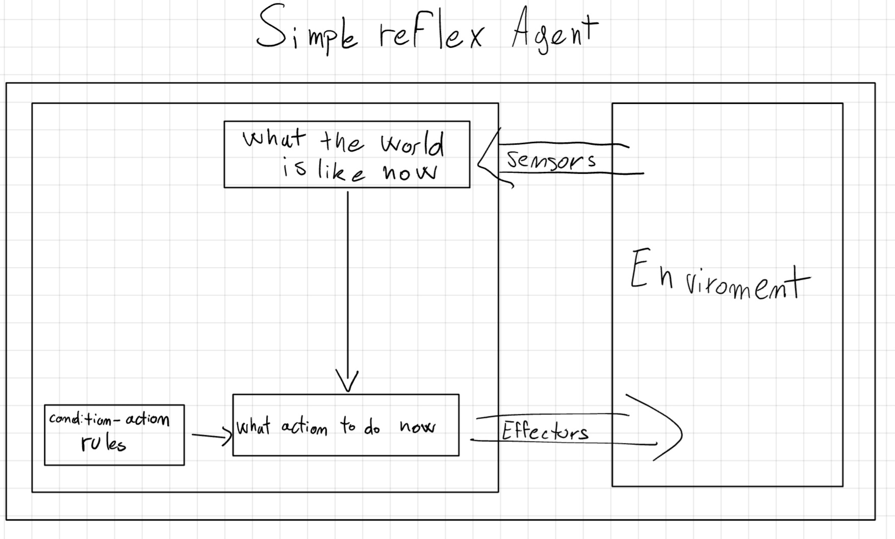
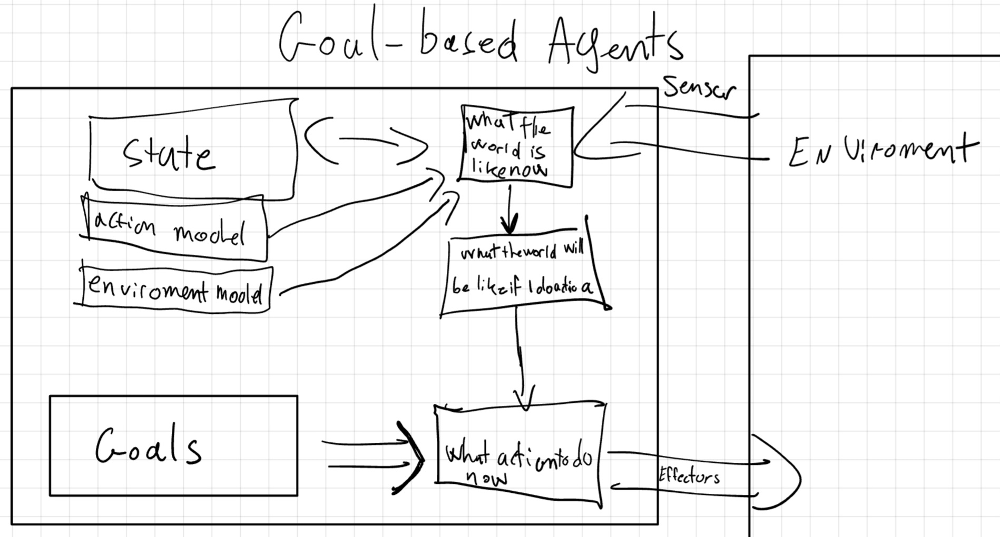
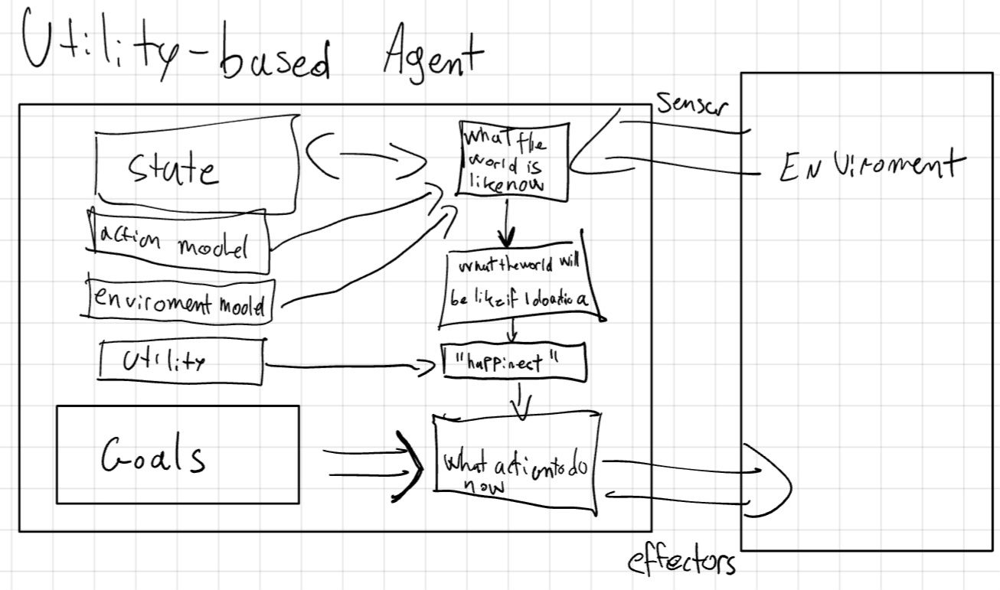
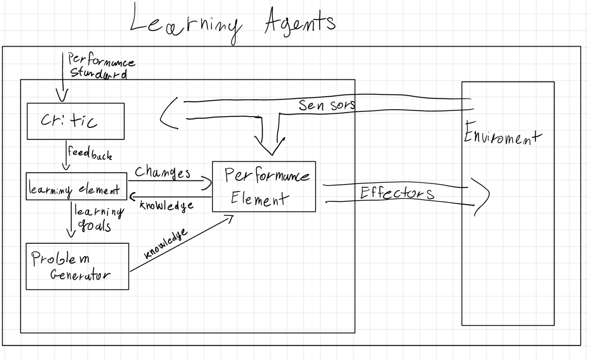

## Introduction

Hello reader this is a short summary of our notes about the course "FAI". If you find an error or you think that one point isn't clear please tell me and I fix it (sorry for my bad english). -NP

## First Chapter: Types of AI and Turing Test

When we talk about intelligence we can define it based on two factors:

- **Performance**: The measure of how well an AI system functions
  - **Human Performance**: Measured by how closely the AI's behavior resemble those of humans
  - **Rational Performance**: Measured by how effectively the AI achieves its goals
- **Approach**: The method employed by the AI to achieve its performance goals
  - **Think**: Focuses on internal cognitive processes, aiming to replicate or simulate human or logical thought.
  - **Act**: Focuses on observable behavior, regardless of the underlying thought process.

Based on those factors, we can define four categories of AI, displayed as a 2x2 matrix:

| Approach \ Performance | Human            | Rational            |
|------------------------|------------------|---------------------|
| Think                  | Thinking Humanly | Thinking Rationally |
| Act                    | Acting Humanly   | Acting Rationally   |

### Thinking Humanly

This approach aims to create AI that thinks like a human. This is the goal of the **Cognitive Modeling** approach, which involves creating a computer model of human cognitive processes.

To achieve this, we need to understand how humans think, which can be done through **Cognitive Science**. This field combines insights from psychology, neuroscience, and linguistics, philosophy to understand how humans think.

### Thinking Rationally

This approach aims to create AI that thinks logically. This is the goal of the **Laws of Thought** approach, which involves creating AI that can reason logically.

To achieve this, we need to understand how to reason logically, which can be done through **Logic** and *formal notation*.

### Acting Humanly

This approach aims to create AI that acts like a human, ignoring the process behind it.

To test this, we can use the **Turing Test**, which involves a human interacting with a computer and another human, without knowing which is which. If the human can't tell the difference, the AI passes the test.

This test give us 6 skill about the intelligence tested:

- **Natural Language Processing**: The ability to communicate in natural language.
- **Knowledge Representation**: The ability to store and retrieve information.
- **Automated Reasoning**: The ability to solve problems.
- **Machine Learning**: The ability to learn from experience.
- **Computer Vision**: The ability to perceive objects.
- **Robotics**: The ability to act on the environment.

### Acting Rationally

This approach aims to create a **Rational Agent**, which is an AI that acts to achieve the best outcome based on its goals.

### Types of AI

We can classify AI based on their capabilities:

- **Weak AI**: AI that perform as well as humans.
- **Strong AI**: AI that replicate exactly how humans think.
- **General AI**: Ai that can solve a variety of tasks.

## Chapter Two: Agent

An **agent** is a system that perceives its environment and acts upon it. It can be a human, a robot, or a software program.

- The **Perception** is the process of obtaining information from the environment. This can be done through *sensors* (Human: eyes, hear, etc; Robot: camera, etc; Software: file, network, etc).
- The **Action** is the process of affecting the environment. This can be done through *actuators* (Human: hands, mouth, etc; Robot: motors, etc; Software: file, UI, etc).


An agent is defined by its **Agent Function**, which maps the *Built-in Knowledge* and a sequence of percepts (*Percept Sequence*) to an *action*. The implementation of the agent function is called the **Agent Program**.

The agent's behavior is evaluated based on a **Performance Measure**, which is a criterion for success.

The goal of an **rational agent** is to maximize the expected value of its performance measure. We do that by evaluating the sequence of state the environment go through.

The nature of the **environment** can be classified based on different factors:

- **Observable**: Whether the agent can observe the environment.
  - **Fully Observable**: The agent can observe the entire state of the environment.
  - **Partially Observable**: The agent can't observe the entire state of the environment. Need to remember the past state.
- **Amount of Agent**: How many agents interact with the environment.
  - **Single Agent**: Only one agent in the environment.
  - **Multi-Agent**: Multiple agents in the environment.
    - **Competitive**: Agents have conflicting goals, need to maximize mine and minimize others.
    - **Cooperative**: Agents have the same goal, need to maximize the group's performance.
- **Deterministic**: Whether the environment is deterministic.
  - **Deterministic**: The next state is completely determined by the current state and the action.
  - **Stochastic**: The next state is not completely determined by the current state and the action.
- **History**: Whether the current state depends on the entire history of the environment.
  - **Episodic**: The current state depends only on the current state and the action.
  - **Sequential**: The current state depends on the entire history of the environment.
- **Dynamic**: Whether the environment changes while the agent is deciding on an action.
  - **Static**: The environment doesn't change while the agent is deciding on an action.
  - **Dynamic**: The environment changes while the agent is deciding on an action.
- **Discrete/Continuous**: Whether the environment is discrete or continuous.
  - **Discrete**: The environment is discrete.
  - **Continuous**: The environment is continuous.
- **Known/Unknown**: Whether the agent knows the environment and its rules.
  - **Known**: The agent knows the environment.
  - **Unknown**: The agent doesn't know the environment.

### Agent Architecture

The **Agent Architecture** is the design of the agent, which includes the agent's components and how they interact.

There are different types of agents based on their architecture:

#### 2.1 Simple Reflex Agent



This is the simplest type of agent, which acts based on the current percept. It doesn't have memory.

The action is determined by the **Condition-Action Rule**, which maps the current percept to an action.

```plaintext
if condition then action
```

This agent is useful when the environment is **fully observable** and **deterministic**.
In partially observable environments, the agent might result in a **loop**. To avoid that we could randomize the action, but this could lead to *inefficiency*.

```plaintext
function SIMPLE-REFLEX-AGENT(percept) returns an action
    persistent: rules // a set of condition–action rules
    
    state = INTERPRET-INPUT(percept)
    rule = RULE-MATCH(state,rules)
    action = rule.ACTION

    return action
```

#### 2.2 Model-Based Reflex Agent


To deal with partially observable environments, we can add a **State** to the agent, which stores information about the environment.

```plaintext
 function MODEL-BASED-REFLEX-AGENT(percept) returns an action
    persistent: state // the agent’s current conception of the world state
        transition_model // a description of how the next state depends on the current state and action
        sensor_model // a description of how the current world state is reflected in the agent’s percepts
        rules // a set of condition–action rules
        action // the most recent action, initially none
    
    state = UPDATE-STATE(state, action, percept, transition_model, sensor_model)
    rule = RULE-MATCH(state, rules)
    action = rule.ACTION
    
    return action
```

#### 2.3 Goal-Based Agent



This agent has a **Goal** that describe the desired state of the environment. The agent uses a **Problem-Solving Algorithm** to find a sequence of actions that lead to the goal (search and planning).

#### 2.4 Utility-Based Agent



The *goal* is a binary value (achieved or not), but the *utility* is a real number that describe how desirable a state is. The agent uses a **Utility Function** to evaluate the desirability of a state.

#### 2.5 Learning Agent



This type of agent learns from experience and it can be applied to any of the previous architectures.

With learning, the agent can improve its performance over time and operate in unknown environments.

A learning agent has four main components:

- **Performance Element**: The part of the agent that selects actions.
- **Critic**: The part of the agent that evaluates the agent's actions.
- **Learning Element**: The part of the agent that learns from the critic and improve the performance element.
- **Problem Generator**: The part of the agent that suggests actions to explore new possibilities.

## Chapter Three: Problem Solving by Search

When an agent plans ahead to find a sequence of action that lead to a goal, it is called **Search**.

There are four main phases of a search problem:

- **Goal Formulation**: The agent decides what it wants to achieve. This help organize behaviors, limiting objectives, and actions to consider.
- **Problem Formulation**: The agent needs a description of the rules of the environment.
- **Search**: The agent looks for a sequence of actions that lead to the goal.
- **Execution**: The agent executes the plan.

When the environment is *fully-observable*, *deterministic*, and *known*, the solution is fixed and we can ignore the *perception*. This is called **Open-Loop**.
Otherwise, we need to consider the *perception* during the *execution* of the plan. This is called **Closed-Loop**.

A **Problem** is defined by:

- **Initial State**: The state, or configuration, where the agent starts.
- **Goal(s) state**: The state, or configuration, where the agent wants to go. Can be a set of states or a function.
- **Actions**: A function that given a state, return a set of actions that the agent can perform.
- **Transition Model**: A function that given a state and an action, return the next state.
- **Action Cost**: A function that given a state and an action, return the cost of that action.

A sequence of action is called a **Path**. If a path starts from the initial state and ends in a goal state, it is called a **Solution**.
If that solution has the lowest cost among all the possible solutions, it is called an **Optimal Solution**.

We can represent the problem as a **State Space Graph**, where the nodes are the states and the edges are the actions.

We want to find a solution without building the entire graph, because it could be too large. We want to *partially build* the graph while searching for the solution.
To do that we use a **Search Algorithm**.

### 3.1 Search Algorithm

A search algorithm is based on a **Search Tree** to represent the search space. The root of the tree is the initial state, each node is a state and the branches are the actions.

The difference between a search-tree and the graph-space is that: the graph describes all the possible states and actions, while the tree describes the states and actions that the agent has already explored, creating paths from the initial state to each explored node.

The search algorithm has two main components:

- **Frontier**: The set of nodes that the agent has to explore.
- **Explored Set**: The set of nodes that the agent has already explored.

When we *explore* a node, we add it to the explored set and remove it from the frontier. Then we *expand* the node, generating the children nodes, and add them to the frontier.

#### 3.1.1 Best-First Search

This type of algorithms each node is evaluated based on a **Evaluation Function** ($f(n)$).

On each iteration we choose a node with the minimum $f(n)$ cost from the frontier and, if it isn't the goal, we expand it.

If a repeated state is reached, its expansion would generate an infinite cycle. To avoid this we can:

- Store all previously visited states, avoiding redundant paths.
- Check the current path to avoid cycles. This approach doesn't avoid redundant paths.
- If it's impossible to reach the same state, we can ignore the repeated state.

When we search for redundant paths, the algorithm is called **Graph Search**.

#### 3.1.2 Data Structure

Each node is made by four main components:

- **State**: The state of the node.
- **Parent**: The node that generated this node. Following the parent we can reconstruct the path.
- **Action**: The action that generated this node.
- **Path Cost**: The cost of the path from the initial state to this node.

The way that the frontier is implemented change the behavior of the algorithm.

- **Priority Queue**: The frontier is ordered based on the evaluation function and the node with the lowest cost is expanded first.
- **Queue** (FIFO): The frontier is a queue and the node that is added first is expanded first.
- **Stack** (LIFO): The frontier is a stack and the node that is added last is expanded first.

#### 3.1.3 Algorithm Evaluation

The performance of a search algorithm can be evaluated based on:

- **Completeness**: The algorithm finds a solution if one exists.
- **Optimality**: The algorithm finds the optimal solution.
- **Time Complexity**: The number of nodes generated by the algorithm.
- **Space Complexity**: The maximum number of nodes stored in memory.

The complexity is measured in terms of:

- **Depth** ($d$): The depth of the shallowest solution.
- **Branching Factor** ($b$): The number of children of each node.
- **Maximum Depth** ($m$): The maximum depth of the search tree.
- **Optimal Solution** ($C^*$): The cost of the optimal solution.
- **Smaller cost-action** ($\epsilon$): The cost of the action.
