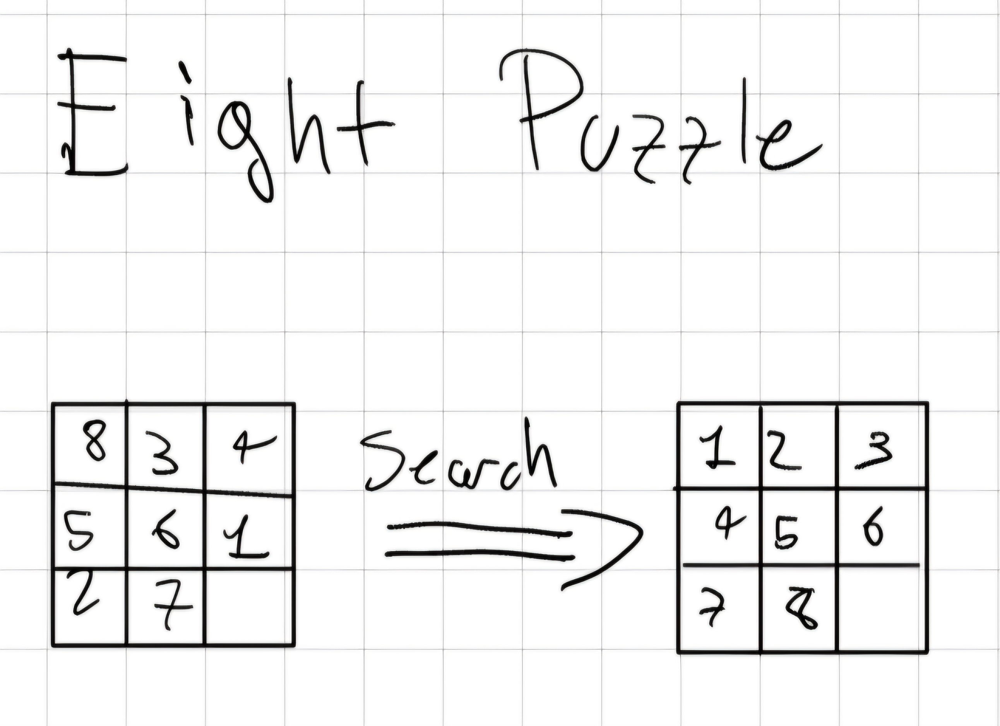
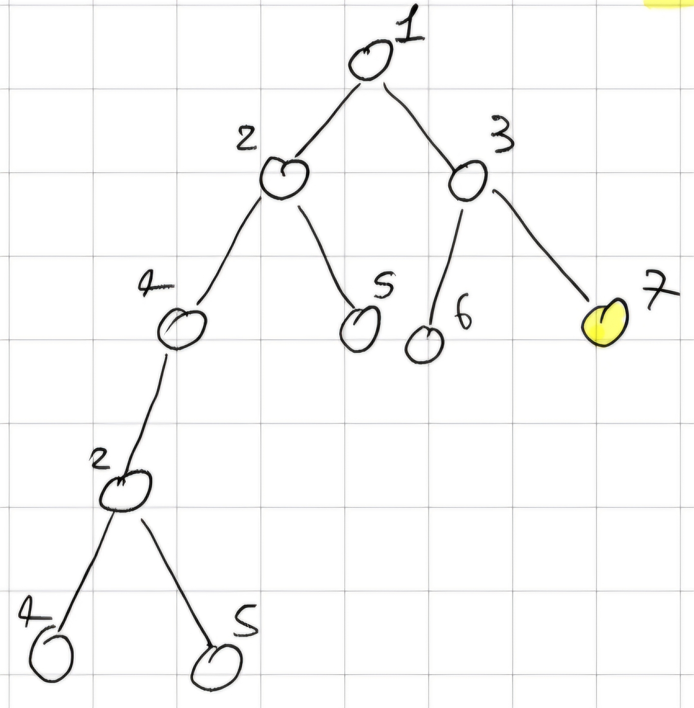

## Introduction

Hello reader this is a short summary of our notes about the course "FAI". If you find an error or you think that one point isn't clear please tell me and I fix it (sorry for my bad english). -NP

## First Charpter: Type of AI and Turing Test

We can established four categories that definy different type of  AI:

- Thinking Humanly
- Thinking Rationally
- Acting Humanly
- Acting Rationally

**The Turing Test**: This test provide us a satisfactory operetional definition of Intelligence. A person interrogate a computer and if to the end the person cannot understand if he wrote with a computer or another person the AI complete the test with a success.

This test give us 6 skill about the intelligence tested:

- **Natural language processing**: correct comunication in English.
- **Knoledge rappresentation**: store what it know or hear.
- **Aumated reasoring**: can use the stored info to arrive at new conclusion.
- **Machine learning**: can adapth to a new circumstance.
- **Computer vision**: perceive object.
- **Robotics**: move object or manipulate them.

## Chapter Two: Agent

**Agent**: Anything can be viewed as perceiving enviroment and acting upon that environment.

**Rational Agent**: This type of agent chooses the actions that maximizes the expected value of his **performance measure**.

**Performance measure**: It is the criterion for evalueting the success of our agent (for example in "il gioco dell'oca" more our agent is near to the arrive more us take point on its expected value).

Agent Architecture:

- Simple Reflex Agents.
- Reflex Agents with state.
- Goal-based Agents.
- Utility-based Agents.

More we go down with the architecture more is the complexity and the power. (Utility is more power than Goal that is more power than Reflex etc.)

## Chapter Three: Agent Architecture

All 4 types of agents are rational but with difference Performance Measure.

This is the simplest type of agent, our objective is be able to create this by the end of the course.

An example of this agent is the first prototype of Rumba the automatic vacuum.

An example of possible agent is an agent build for play tic-tac-toe (tris). A pseudo-code of this agent is:

    if canwin(player)
        win(player);
    if canwin(opponent)
        block(opponent);
    if free(center);
        take(center);
    if free(corner)
        take(corner);
    if free(side)
        take(side);

For example the system of Auto-drive sets up on modern car is a utility-based agent. This bacause he must be control a lot sensors and variable (speed, navigator, tire's pressure, etc.).

Can a Goal-based agent work like an Utility-based agent ? The answer is no, but an Utility-based can work like a Goal-based it's enough just maximaze the "happinest".

A newest type of Agent is the **Learning Agents**.

An example of learnig agent is the system used to build the flocking model (based on bird flocks).

The flocking model consist in three basic behaviors:

- Separation: steer to avoid crowing local flockmates.
- Alignemt: steer toward the avenge heading of local flockmates.
- Coohesion: steer to move toward the avenge position of local flockmates.

In this course we learn to build a weak AI.

**Weak AI**: AI that perform as well as humans.

**Strong AI**: AI that replicate exactly how humans think.

**General AI**: AI that can solve wide variety of task.

(**Funfacts** Open-AI Five build an AI that can compatitive internationaly on "Dota 2".)

## Chapter Four: Problem Solving by Search

Problem Solving by Search $\implies$ we can find the solution in many way.

### Eight Puzzle

This is a puzzle game where I have matrix 3x3 complose by 8 numbers and I have to put in order from 1 to 8.

I can rapresent the 8-puzzle in an array:

state = $[[0,8,2],[3,4,7],[5,1,6]]$

action = $(x,y)$

    struct{
            int from;
            int to;
        }action;

### Search Problems

- A set of states $S$ and an initial state $s_0$.
- The function $actions(s)$ that given a state $s$, return the set of feable actions.
- The function $result(s,a)$, $s$ is the state and $a$ the action, return the state reached.
- A goal test that given a state $s$ return true if the state is the goal state.
- A step cost $c(s,a,s')$ of an action $a$ from $s$ to $s'$.

### State Space

- The state space is a directed graph with nodes rappresenting state, arcs rappresenting actions.
- The solution to a search problem is a path in the state space from the initial state to the goal state.

**Optimal Solution**: solution with the lowest cost.

There are problem without solution.

If I wanted to crate a state space for the 8-puzzle, How many states would I have?

8-puzzle: $9!(362880)$ states.

If I generate 100 millions states per second, I would requite 0.036 second to generate the graph. But the 24-puzzle has $25!(10^{25})$ states so I would requite more than 109 years $\implies$ I have to use a better method.

### Eight-Queens Puzzle

In this game I have to put 8 queens in a chess camp without any queens stay on the territory of the other.

### Path planning

I have multiple path.

I have to reach the black point on the left from the red at the right.

So for find a solution I don't create a graph but a tree.

Tree is made of node.

State space is made of states and connections.

The idea is take a state and from it draw the tree with every way the state can take, until I arrive to the final state.

So I build from zero everytime? Yes, I do.

Dear reader, before continuing, try to answer this question, why i prefer build a tree?

For some problem I have an infinite tree (for loop or none solution) so I must find I new method.

The best algoritm for the tree search is the **Best-First Search**.

## Chapter Five: Uninformed Search Startegies

**Uninformed Search Startegies**: They use only the information conteined in the problem formulation.

**The Five Elements of U.S.S.**

- The set of states (and initial state).
- Function actions().
- Function result().
- Goal test.
- Step cost.

Evaluation of Search Strategies

- Completeness: Is the S.S. guarateed to find a solution when exist ?
- Optimality: Does the S.S. optimal ?
- Complexity: How much time require ?
- Parameters

    - $b$,  the branching factor of search tree.
    - $d$, the depth of shallowest goal node.

Bigger is the $b$ factor, harder is the problem.

Bigger is the $d$ factor, more exploretion require the closest solution.

### Breadth-First Search

The Algorithm is the same we do in "API" but here we generate a tree step by step, so we don't color the node and the loop don't rappresent a problem for us.

we start with the first node: $1$ and expand the branch so $[2, 3]$ we expand the first node we see: $2 \implies [3, 4, 5]$, 