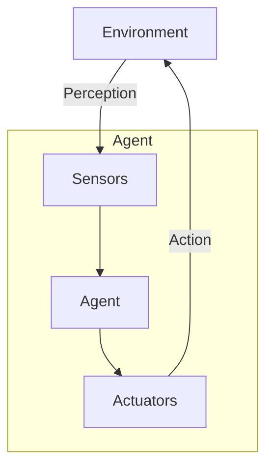
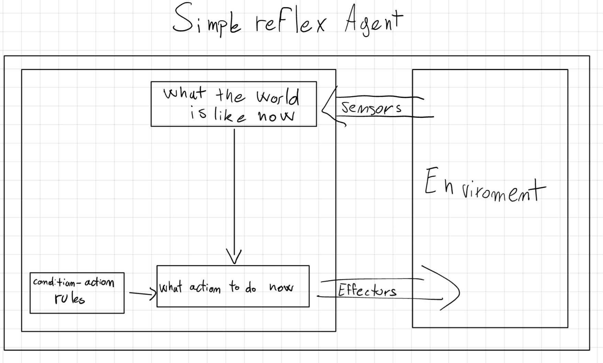
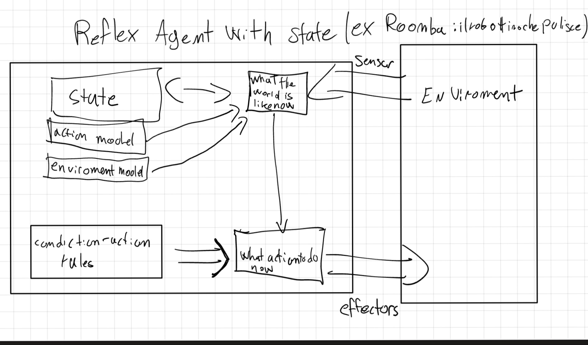
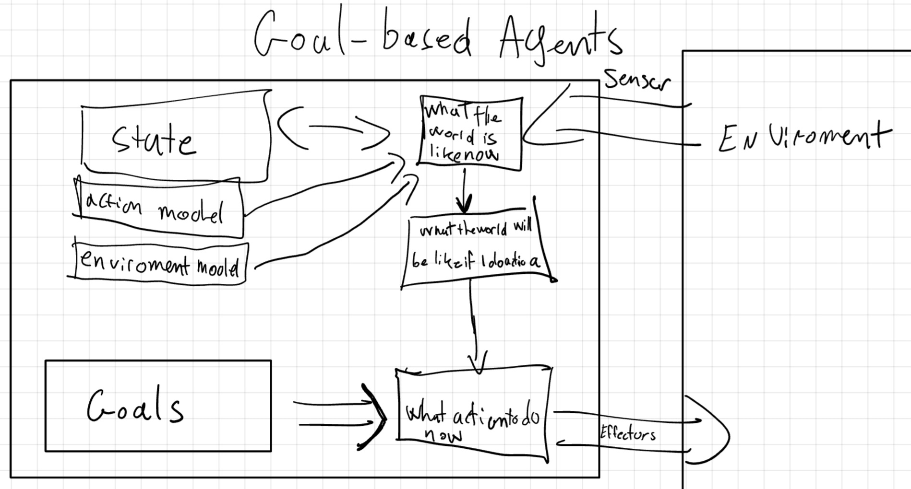
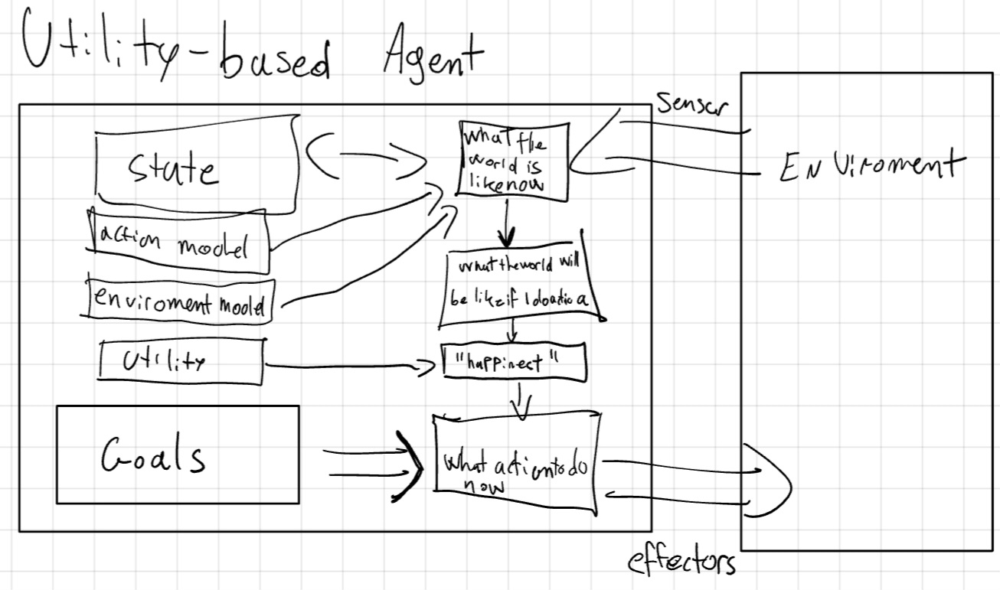
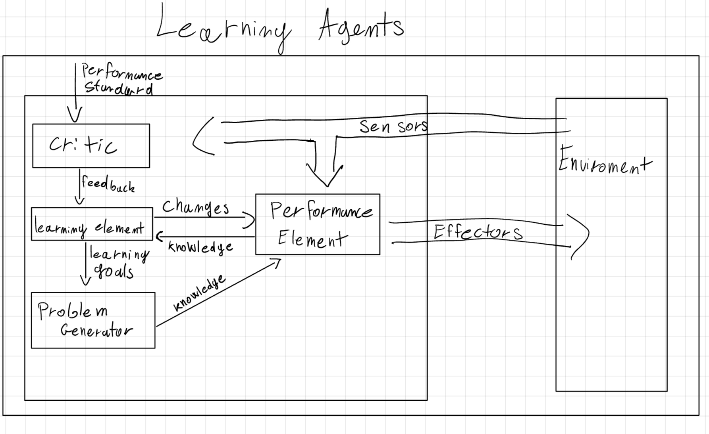
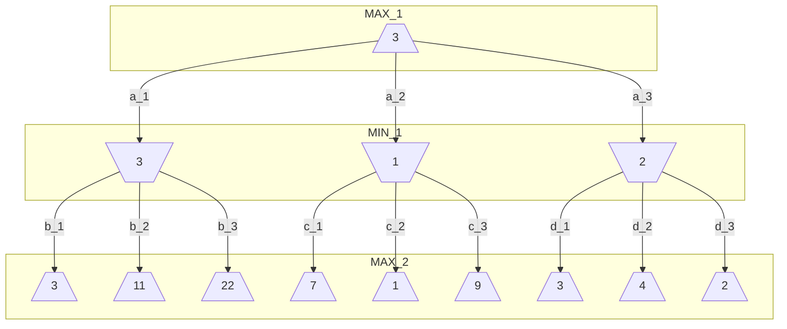
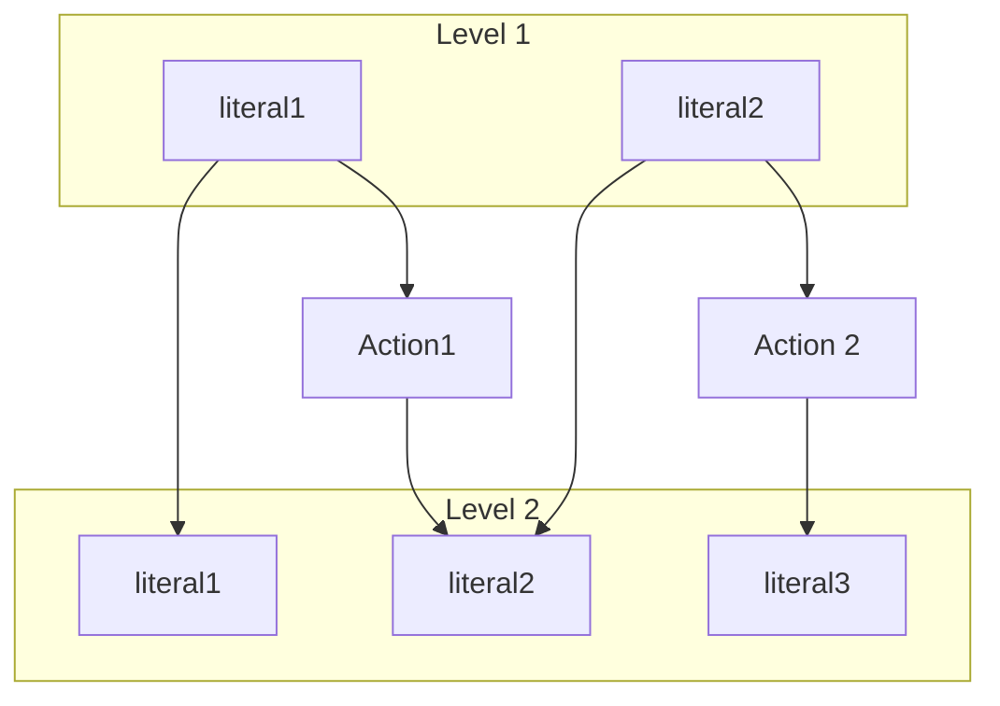
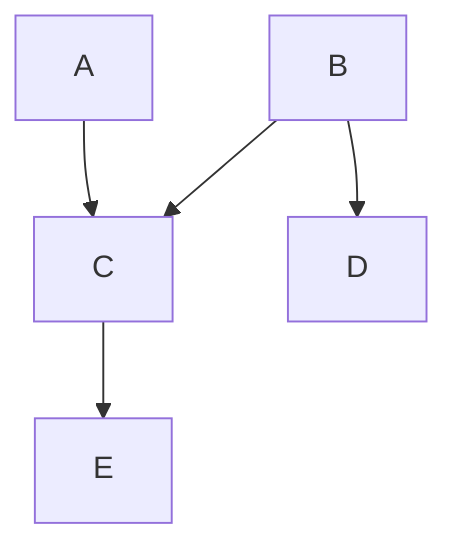

## Introduction

Hello reader this is a short summary of our notes about the course "FAI". If you find an error or you think that one point isn't clear please tell me and I fix it (sorry for my bad english). -NP

## First Chapter: Types of AI and Turing Test

When we talk about intelligence we can define it based on two factors:

- **Performance**: The measure of how well an AI system functions
  - **Human Performance**: Measured by how closely the AI's behavior resemble those of humans
  - **Rational Performance**: Measured by how effectively the AI achieves its goals
- **Approach**: The method employed by the AI to achieve its performance goals
  - **Think**: Focuses on internal cognitive processes, aiming to replicate or simulate human or logical thought.
  - **Act**: Focuses on observable behavior, regardless of the underlying thought process.

Based on those factors, we can define four categories of AI, displayed as a 2x2 matrix:

| Approach \ Performance | Human            | Rational            |
| ---------------------- | ---------------- | ------------------- |
| Think                  | Thinking Humanly | Thinking Rationally |
| Act                    | Acting Humanly   | Acting Rationally   |

### Thinking Humanly

This approach aims to create AI that thinks like a human. This is the goal of the **Cognitive Modeling** approach, which involves creating a computer model of human cognitive processes.

To achieve this, we need to understand how humans think, which can be done through **Cognitive Science**. This field combines insights from psychology, neuroscience, and linguistics, philosophy to understand how humans think.

### Thinking Rationally

This approach aims to create AI that thinks logically. This is the goal of the **Laws of Thought** approach, which involves creating AI that can reason logically.

To achieve this, we need to understand how to reason logically, which can be done through **Logic** and _formal notation_.

### Acting Humanly

This approach aims to create AI that acts like a human, ignoring the process behind it.

To test this, we can use the **Turing Test**, which involves a human interacting with a computer and another human, without knowing which is which. If the human can't tell the difference, the AI passes the test.

This test give us 6 skill about the intelligence tested:

- **Natural Language Processing**: The ability to communicate in natural language.
- **Knowledge Representation**: The ability to store and retrieve information.
- **Automated Reasoning**: The ability to solve problems.
- **Machine Learning**: The ability to learn from experience.
- **Computer Vision**: The ability to perceive objects.
- **Robotics**: The ability to act on the environment.

### Acting Rationally

This approach aims to create a **Rational Agent**, which is an AI that acts to achieve the best outcome based on its goals.

### Types of AI

We can classify AI based on their capabilities:

- **Weak AI**: AI that perform as well as humans.
- **Strong AI**: AI that replicate exactly how humans think.
- **General AI**: Ai that can solve a variety of tasks.

## Chapter Two: Agent

An **agent** is a system that perceives its environment and acts upon it. It can be a human, a robot, or a software program.

- The **Perception** is the process of obtaining information from the environment. This can be done through _sensors_ (Human: eyes, hear, etc; Robot: camera, etc; Software: file, network, etc).
- The **Action** is the process of affecting the environment. This can be done through _actuators_ (Human: hands, mouth, etc; Robot: motors, etc; Software: file, UI, etc).



An agent is defined by its **Agent Function**, which maps the _Built-in Knowledge_ and a sequence of percepts (_Percept Sequence_) to an _action_. The implementation of the agent function is called the **Agent Program**.

The agent's behavior is evaluated based on a **Performance Measure**, which is a criterion for success.

The goal of an **rational agent** is to maximize the expected value of its performance measure. We do that by evaluating the sequence of state the environment go through.

The nature of the **environment** can be classified based on different factors:

- **Observable**: Whether the agent can observe the environment.
  - **Fully Observable**: The agent can observe the entire state of the environment.
  - **Partially Observable**: The agent can't observe the entire state of the environment. Need to remember the past state.
- **Amount of Agent**: How many agents interact with the environment.
  - **Single Agent**: Only one agent in the environment.
  - **Multi-Agent**: Multiple agents in the environment.
    - **Competitive**: Agents have conflicting goals, need to maximize mine and minimize others.
    - **Cooperative**: Agents have the same goal, need to maximize the group's performance.
- **Deterministic**: Whether the environment is deterministic.
  - **Deterministic**: The next state is completely determined by the current state and the action.
  - **Stochastic**: The next state is not completely determined by the current state and the action.
- **History**: Whether the current state depends on the entire history of the environment.
  - **Episodic**: The current state depends only on the current state and the action.
  - **Sequential**: The current state depends on the entire history of the environment.
- **Dynamic**: Whether the environment changes while the agent is deciding on an action.
  - **Static**: The environment doesn't change while the agent is deciding on an action.
  - **Dynamic**: The environment changes while the agent is deciding on an action.
- **Discrete/Continuous**: Whether the environment is discrete or continuous.
  - **Discrete**: The environment is discrete.
  - **Continuous**: The environment is continuous.
- **Known/Unknown**: Whether the agent knows the environment and its rules.
  - **Known**: The agent knows the environment.
  - **Unknown**: The agent doesn't know the environment.

### Agent Architecture

The **Agent Architecture** is the design of the agent, which includes the agent's components and how they interact.

There are different types of agents based on their architecture:

#### 2.1 Simple Reflex Agent



This is the simplest type of agent, which acts based on the current percept. It doesn't have memory.

The action is determined by the **Condition-Action Rule**, which maps the current percept to an action.

```plaintext
if condition then action
```

This agent is useful when the environment is **fully observable** and **deterministic**.
In partially observable environments, the agent might result in a **loop**. To avoid that we could randomize the action, but this could lead to _inefficiency_.

```plaintext
function SIMPLE-REFLEX-AGENT(percept) returns an action
    persistent: rules // a set of condition–action rules

    state = INTERPRET-INPUT(percept)
    rule = RULE-MATCH(state,rules)
    action = rule.ACTION

    return action
```

#### 2.2 Model-Based Reflex Agent



To deal with partially observable environments, we can add a **State** to the agent, which stores information about the environment.

```plaintext
 function MODEL-BASED-REFLEX-AGENT(percept) returns an action
    persistent: state // the agent’s current conception of the world state
        transition_model // a description of how the next state depends on the current state and action
        sensor_model // a description of how the current world state is reflected in the agent’s percepts
        rules // a set of condition–action rules
        action // the most recent action, initially none

    state = UPDATE-STATE(state, action, percept, transition_model, sensor_model)
    rule = RULE-MATCH(state, rules)
    action = rule.ACTION

    return action
```

#### 2.3 Goal-Based Agent



This agent has a **Goal** that describe the desired state of the environment. The agent uses a **Problem-Solving Algorithm** to find a sequence of actions that lead to the goal (search and planning).

#### 2.4 Utility-Based Agent



The _goal_ is a binary value (achieved or not), but the _utility_ is a real number that describe how desirable a state is. The agent uses a **Utility Function** to evaluate the desirability of a state.

#### 2.5 Learning Agent



This type of agent learns from experience and it can be applied to any of the previous architectures.

With learning, the agent can improve its performance over time and operate in unknown environments.

A learning agent has four main components:

- **Performance Element**: The part of the agent that selects actions.
- **Critic**: The part of the agent that evaluates the agent's actions.
- **Learning Element**: The part of the agent that learns from the critic and improve the performance element.
- **Problem Generator**: The part of the agent that suggests actions to explore new possibilities.

## Chapter Three: Problem Solving by Search

When an agent plans ahead to find a sequence of action that lead to a goal, it is called **Search**.

There are four main phases of a search problem:

- **Goal Formulation**: The agent decides what it wants to achieve. This help organize behaviors, limiting objectives, and actions to consider.
- **Problem Formulation**: The agent needs a description of the rules of the environment.
- **Search**: The agent looks for a sequence of actions that lead to the goal.
- **Execution**: The agent executes the plan.

When the environment is _fully-observable_, _deterministic_, and _known_, the solution is fixed and we can ignore the _perception_. This is called **Open-Loop**.
Otherwise, we need to consider the _perception_ during the _execution_ of the plan. This is called **Closed-Loop**.

A **Problem** is defined by:

- **Initial State**: The state, or configuration, where the agent starts.
- **Goal(s) state**: The state, or configuration, where the agent wants to go. Can be a set of states or a function.
- **Actions**: A function that given a state, return a set of actions that the agent can perform.
- **Transition Model**: A function that given a state and an action, return the next state.
- **Action Cost**: A function that given a state and an action, return the cost of that action.

A sequence of action is called a **Path**. If a path starts from the initial state and ends in a goal state, it is called a **Solution**.
If that solution has the lowest cost among all the possible solutions, it is called an **Optimal Solution**.

We can represent the problem as a **State Space Graph**, where the nodes are the states and the edges are the actions.

We want to find a solution without building the entire graph, because it could be too large. We want to _partially build_ the graph while searching for the solution.
To do that we use a **Search Algorithm**.

### 3.1 Search Algorithm

A search algorithm is based on a **Search Tree** to represent the search space. The root of the tree is the initial state, each node is a state and the branches are the actions.

The difference between a search-tree and the graph-space is that: the graph describes all the possible states and actions, while the tree describes the states and actions that the agent has already explored, creating paths from the initial state to each explored node.

The search algorithm has two main components:

- **Frontier**: The set of nodes that the agent has to explore.
- **Explored Set**: The set of nodes that the agent has already explored.

When we _explore_ a node, we add it to the explored set and remove it from the frontier. Then we _expand_ the node, generating the children nodes, and add them to the frontier.

#### 3.1.1 Best-First Search

This type of algorithms each node is evaluated based on a **Evaluation Function** ($f(n)$).

On each iteration we choose a node with the minimum $f(n)$ cost from the frontier and, if it isn't the goal, we expand it.

If a repeated state is reached, its expansion would generate an infinite cycle. To avoid this we can:

- Store all previously visited states, avoiding redundant paths.
- Check the current path to avoid cycles. This approach doesn't avoid redundant paths.
- If it's impossible to reach the same state, we can ignore the repeated state.

When we search for redundant paths, the algorithm is called **Graph Search**.

#### 3.1.2 Data Structure

Each node is made by four main components:

- **State**: The state of the node.
- **Parent**: The node that generated this node. Following the parent we can reconstruct the path.
- **Action**: The action that generated this node.
- **Path Cost**: The cost of the path from the initial state to this node.

The way that the frontier is implemented change the behavior of the algorithm.

- **Priority Queue**: The frontier is ordered based on the evaluation function and the node with the lowest cost is expanded first.
- **Queue** (FIFO): The frontier is a queue and the node that is added first is expanded first.
- **Stack** (LIFO): The frontier is a stack and the node that is added last is expanded first.

#### 3.1.3 Algorithm Evaluation

The performance of a search algorithm can be evaluated based on:

- **Completeness**: The algorithm finds a solution if one exists.
- **Optimality**: The algorithm finds the optimal solution.
- **Time Complexity**: The number of nodes generated by the algorithm.
- **Space Complexity**: The maximum number of nodes stored in memory.

The complexity is measured in terms of:

- **Depth** ($d$): The depth of the shallowest solution.
- **Branching Factor** ($b$): The number of children of each node.
- **Maximum Depth** ($m$): The maximum depth of the search tree.
- **Optimal Solution** ($C^*$): The cost of the optimal solution.
- **Smaller cost-action** ($\epsilon$): The cost of the action.

### 3.2 Uninformed Search

An **Uninformed Search** is a category of search algorithms that has no information about how close a state is to the goal.

#### 3.2.1 Breadth-First Search

This algorithm expands the shallowest node first and it's good when all actions have the same cost.

We can implement this using:

- **Evaluation Function**: $f(n) = \text{depth}(n)$
- **Frontier**: Queue, because the shallowest node is the one that has been added first.

This algorithm allows to find the solution with the minimum amount of actions for each node. This allows to perform an _Early Goal Test_, which is a test that checks if a generated node is a goal before expanding it.
A _Late Goal Test_ is a test that checks if a popped node is a goal before expanding it.

##### Breadth-First Performance

On each level of the tree, the algorithm generates $b^n$ nodes, where $b$ is the branching factor and $n$ is the depth of the tree.

- **Completeness**: The algorithm is complete if the branching factor is finite.
- **Optimality**: The algorithm is optimal if the cost of the actions is the same.
- **Time Complexity**: $O(b^d)$
- **Space Complexity**: $O(b^d)$

#### 3.2.2 Uniform-Cost Search

This algorithm expands the node with the lowest path cost. This is also called **Dijkstra's Algorithm**.

We can implement this using:

- **Evaluation Function**: $f(n) = \text{path-cost}(n)$
- **Frontier**: Priority Queue

##### Uniform-Cost Performance

The complexity is based on the cost of the optimal solution and the cost of the actions.
The algorithm might explore trees with a low cost before exploring trees with a high cost, but more useful.

- **Completeness**: The algorithm is complete if the cost of the actions is finite.
- **Optimality**: The algorithm is optimal.
- **Time Complexity**: $O(b^{1+\lfloor C^*/\epsilon \rfloor})$
- **Space Complexity**: $O(b^{1+\lfloor C^*/\epsilon \rfloor})$

#### 3.2.3 Depth-First Search

This algorithm expands the deepest node first and it's good when the solution is far from the initial state.

This can be implemented using:

- **Evaluation Function**: $f(n) = -\text{depth}(n)$
- **Frontier**: Stack, because the deepest node is the one that has been added last.

This algorithm is usually implemented as a tree-search instead of a graph-search.

##### Depth-First Performance

The advantage of this algorithm is that it doesn't need much memory. There is no need to store a reached table, and the frontier is small.

- **Completeness**: The algorithm is not complete if the tree is infinite.
- **Optimality**: The algorithm is not optimal because it return the first solution found.
- **Time Complexity**: $O(b^m)$
- **Space Complexity**: $O(bm)$

#### 3.2.4 Backtracking Search

This is a variant of the depth-first search that doesn't generate all the successors of a node. Instead, it generates a successor and, if it doesn't lead to a solution, it generates the next one.

This algorithm can reduce the memory requirements to just a single state and a list of actions. This allow to modify the current state instead of creating a new one.

It's necessary to undo the changes made to the state when backtracking.

##### Backtracking Performance

- **Completeness**: The algorithm is complete if the tree is finite.
- **Optimality**: The algorithm is not optimal.
- **Time Complexity**: $O(b^m)$
- **Space Complexity**: $O(m)$

#### 3.2.5 Depth-Limited Search

This is a variant of the depth-first search that limits the search to a specific depth ($l$) of the tree. This is useful when the tree is infinite.

If the depth limit is less than the depth of the solution, the algorithm'll never find the solution.
This is not a problem if we know the maximum depth that the tree can reach or the _Diameter_ (the minimum amount of actions to reach each state).

##### Depth-Limited Performance

- **Completeness**: The algorithm is not complete if the depth limit is less than the depth of the solution.
- **Optimality**: The algorithm is not optimal.
- **Time Complexity**: $O(b^l)$
- **Space Complexity**: $O(bl)$

#### 3.2.6 Iterative Deepening Search

This is a variant of the depth-limited search that iteratively increases the depth limit until a solution is found.

##### Iterative Deepening Performance

This algorithm might seem inefficient because it explores the same nodes multiple times, but most of the nodes are at the bottom of the tree, so it's complexity is asymptotical to the breadth-first search.

- **Completeness**: The algorithm is complete.
- **Optimality**: The algorithm is optimal if the cost of the actions is the same.
- **Time Complexity**: $O(b^d)$ if there is a solution, $O(b^m)$ if there isn't.
- **Space Complexity**: $O(bd)$

#### 3.2.7 Bidirectional Search

This algorithm starts from the initial state and the goal state and expands both until they meet in the middle.

This algorithm needs to store two frontiers and two explored state table.

This algorithm can be implemented using any search algorithm, but it's usually implemented using the breadth-first search.

##### Bidirectional Performance

- **Completeness**: The algorithm is complete if the branching factor is finite.
- **Optimality**: The algorithm is optimal if the cost of the actions is the same.
- **Time Complexity**: $O(b^{d/2})$
- **Space Complexity**: $O(b^{d/2})$

#### 3.2.8 Comparison

| Algorithm                  | Completeness | Optimality | Time Complexity                         | Space Complexity                        |
| -------------------------- | ------------ | ---------- | --------------------------------------- | --------------------------------------- |
| Breadth-First Search       | Yes          | Yes        | $O(b^d)$                                | $O(b^d)$                                |
| Uniform-Cost Search        | Yes          | Yes        | $O(b^{1+\lfloor C^*/\epsilon \rfloor})$ | $O(b^{1+\lfloor C^*/\epsilon \rfloor})$ |
| Depth-First Search         | No           | No         | $O(b^m)$                                | $O(bm)$                                 |
| Backtracking Search        | Yes          | No         | $O(b^m)$                                | $O(m)$                                  |
| Depth-Limited Search       | No           | No         | $O(b^l)$                                | $O(bl)$                                 |
| Iterative Deepening Search | Yes          | Yes        | $O(b^d)$                                | $O(bd)$                                 |
| Bidirectional Search       | Yes          | Yes        | $O(b^{d/2})$                            | $O(b^{d/2})$                            |

### 3.3 Informed Search

Informed search strategies use domain specific information about the problem to guide the search toward the goal.
To achieve this, we use a **Heuristic Function** ($h(n)$), which estimates the cost of the cheapest path from the state at node $n$ to a goal state.

#### 3.3.1 Heuristic Function

An heuristic function can be implemented in different ways.

To measure the quality of an heuristic function we can use the **Effective Branching Factor** ($b^*$), which is the average number of nodes generated by the algorithm.

$$N+1 = \sum_{i=0}^d (b^*)^1$$

Where $N$ is the number of nodes generated by the algorithm.

More accurate heuristic functions have a lower effective branching factor.

#### 3.3.2 Greedy Best-First Search

This algorithm expands the node that is closest to the goal, based on the heuristic function.

We can implement this using:

- **Evaluation Function**: $f(n) = h(n)$
- **Frontier**: Priority Queue

This algorithm is not optimal because it doesn't consider the cost of the path and only try to reach the goal as fast as possible.

##### Greedy Best-First Performance

- **Completeness**: The algorithm is not complete.
- **Optimality**: The algorithm is not optimal.
- **Time Complexity**: $O(b^m)$
- **Space Complexity**: $O(b^m)$

#### 3.3.3 A\* Search

This algorithm expands the node with the lowest $f(n)$ cost, where $f(n) = g(n) + h(n)$, $g(n)$ is the cost of the path from the initial state to node $n$ and $h(n)$ is the heuristic function.

We can implement this using:

- **Evaluation Function**: $f(n) = g(n) + h(n)$
- **Frontier**: Priority Queue

The heuristic function must be **admissible**, which means that it never overestimates the cost of reaching the goal.
Or it should be **consistent**, which means that the cost of reaching the goal from node $n$ is less than or equal to the cost of reaching the goal from node $n$ plus the cost of reaching the next node.

$$h(n) \leq h(n') + c(n, a, n')$$

A\* only expands nodes that have a lower cost than the cost of the optimal solution. This allow to **prune** the search tree, reducing the number of nodes generated.

##### A\* Performance

- **Completeness**: The algorithm is complete.
- **Optimality**: The algorithm is optimal if the heuristic function is admissible.
- **Time Complexity**: $O(b^d)$
- **Space Complexity**: $O(b^d)$

#### 3.3.4 Weighted A\* Search

A\* has the problem that the heuristic function can be too optimistic, leading to a large number of nodes generated.

One way to solve this is to use a **Weighted A\***, which multiplies the heuristic function by a weight $w$ ($w > 1$).

$$f(n) = g(n) + w \cdot h(n)$$

This introduce an inadmissible heuristic function, but it can be useful to reduce the number of nodes generated.

Based on the weight we can have different algorithms:

| Weight           | Evaluation function          | Algorithm                |
| ---------------- | ---------------------------- | ------------------------ |
| $w = 0$          | $f(n) = g(n)$                | Uniform-cost search      |
| $w = 1$          | $f(n) = g(n) + h(n)$         | A\* search               |
| $1 < w < \infin$ | $f(n) = g(n) + w \cdot h(n)$ | Weighted A\* search      |
| $w = \infin$     | $f(n) = h(n)$                | Greedy best-first search |

##### Weighted A\* Performance

- **Completeness**: The algorithm is complete.
- **Optimality**: The algorithm is suboptimal.
- **Time Complexity**: $O(b^d)$
- **Space Complexity**: $O(b^d)$

#### 3.3.5 Iterative Deepening A\* Search

This algorithm is a variant of the A*search that introduces a*cutoff\* value. This value is the maximum cost of the path that the algorithm can explore.

If the algorithm reaches the cutoff value, it restarts and increases the cutoff value to the smallest evaluation of non-expanded nodes.

##### Iterative Deepening A\* Performance

This algorithm is efficient memory-wise, but it can be slow because it explores the same nodes multiple times.

- **Completeness**: The algorithm is complete.
- **Optimality**: The algorithm is optimal if the heuristic function is admissible.
- **Time Complexity**: $O(b^d)$
- **Space Complexity**: $O(b^d)$

#### 3.3.6 Bidirectional heuristic search

This algorithm is a variant of the bidirectional search that uses the heuristic function to guide the search.

With this configuration there are two heuristic functions, one for the starting from initial state (forward) and one for the one starting from goal state (backward).

- **Forward**: $f_f(n) = g_f(n) + h_f(n)$
- **Backward**: $f_b(n) = g_b(n) + h_b(n)$

One problem with this algorithm is that we don't know which is the best node to expand between the two frontiers.

##### Bidirectional heuristic search Performance

- **Completeness**: The algorithm is complete.
- **Optimality**: The algorithm is optimal if the heuristic function is admissible.
- **Time Complexity**: $O(b^{d/2})$
- **Space Complexity**: $O(b^{d/2})$

#### 3.3.7 Comparison

| Algorithm                      | Completeness | Optimality | Time Complexity | Space Complexity |
| ------------------------------ | ------------ | ---------- | --------------- | ---------------- |
| Greedy Best-First Search       | No           | No         | $O(b^m)$        | $O(b^m)$         |
| A\* Search                     | Yes          | Yes        | $O(b^d)$        | $O(b^d)$         |
| Weighted A\* Search            | Yes          | No         | $O(b^d)$        | $O(b^d)$         |
| Bidirectional heuristic search | Yes          | Yes        | $O(b^{d/2})$    | $O(b^{d/2})$     |

## Chapter Four: Constraint Satisfaction Problems

A **Constraint Satisfaction Problem** (CSP) is a problem where the goal is to find a solution that satisfies a set of constraints.

CSP use general heuristics to solve problems that allows to prune a large portion of the search space that violates the constraints.

Each state is represented by a set of variables, each with a domain of possible values, and a set of constraints that limit the possible values of the variables.

- **Variable** ($X$), {$X_1$, ..., $X_n$}: A symbol that represents a value.
- **Domain** ($D$), {$D_1$, ..., $D_n$}: The set of possible values {$v_1$, ..., $v_k$} that a variable can take.
- **Constraint** ($C$), {$C_1$, ..., $C_n$}: A restriction on the possible values of the variables. Each constraint is a pair {_scope_, _rel_}, where _scope_ is a set of variables that are involved in the constraint and _rel_ is a relation that defines the values that the variable can take. There are four types of constraints:
  - **Unary Constraint**: A constraint that involves a single variable.
  - **Binary Constraint**: A constraint that involves two variables.
  - **Higher-Order Constraint**: A constraint that involves more than two variables. This can be represented as a set of binary constraints.
  - **Global Constraint**: A constraint that involves an arbitrary number of variables.

CSP assigns a value to each variable in a way that satisfies all the constraints.
An assignment that satisfies all the constraints is called a **Consistent** assignment.
An assignment that assigns a value to each variable is called a **Complete** assignment.
A **Solution** is a complete and consistent assignment.
It is possible to have a **Partial Assignment**, which assigns a value to some variables but not all of them, and a **Partial Solution**, which is a partial assignment that is consistent.

CSP can be represented as a **Constraint Graph**, where the nodes are the variables and the edges are the constraints.

Some problems can include **Preference Constraints**, which are constraints that define the preference of a solution. These constraints are not necessary to find a solution, but they can help to find a better solution.
This type of problem are called **constraint optimization problems**.

### 4.1 Constraint Propagation

**Constraint Propagation** is a technique that allows to reduce the domain of the variables based on the constraints, ensuring _local consistency_.

There are different types of consistency:

#### 4.1.1 Node Consistency

A variable is **node consistent** if it satisfies all the unary constraints that involve it.

#### 4.1.2 Arc Consistency

A variable is **arc consistent** if it satisfies all the binary constraints that involve it.

If every variable is arc consistent, the graph is **arc consistent**.

The most popular algorithm to enforce arc consistency is the **AC-3** algorithm.

It uses a queue to store the arcs that need to be checked. On each iteration, it removes an arc from the queue and checks if the domain of the variables involved in the arc has changed. If it has, it adds the arcs that involve the variable to the queue.
If the domain of a variable is reduced to zero, the algorithm stops and returns _false_ because there is an inconsistency.

```python
def AC_3(csp)
"""
    return false if an inconsistency is found and true otherwise
"""
    queue = {(X_i, X_j) for each constraint C(X_i, X_j)}

    while queue is not empty
        (X_i, X_j) = queue.pop()

        if REVISE(csp, X_i, X_j)
            if X_i.domain is empty
                return False
            for each X_k in NEIGHBORS(X_i) - {X_j}
                queue.add((X_k, X_i))
    return True

def REVISE(csp, X_i, X_j)
"""
    return true if we revise the domain of X_i
"""
    revised = False

    for each x in X_i.domain
        if not exists y in X_j.domain such that (x, y) satisfies the constraint
            delete x from X_i.domain
            revised = True

    return revised

```

The complexity of the REVISE is $O(d^2), so the complexity of the AC-3 algorithm is $O(ed^3)$, where $e$ is the number of edges and $d$ is the maximum domain size.

#### 4.1.3 Path Consistency

**Path consistency** is a stronger form of consistency that ensures that for every assignment between two variables, these is a consistent assignment for the rest of the variables.

Given a set of two variables $X_i$ and $X_j$, is path consistent with respect to a third variable $X_k$ if for every assignment of $X_i$ and $X_j$ there is a consistent assignment for $X_k$.

#### 4.1.4 k-Consistency

A CSP is **k-consistent** if for any set of $k-1$ variables, there is a consistent assignment for the $k$-th variable.

### 4.2 Backtracking Search

If after the constraint propagation the CSP is not solved, we can use a **Backtracking Search** to find a solution.

The algorithm works by assigning a value to a variable and then propagating the constraints. If the assignment is consistent, the algorithm continues with the next variable. If the assignment is not consistent, the algorithm backtracks and tries a different value.

The algorithm can be implemented using a recursive function.

```python
def BACKTRACKING-SEARCH(csp)
"""
    return a solution or failure
"""
    return RECURSIVE-BACKTRACKING({}, csp)

def RECURSIVE-BACKTRACKING(assignment, csp)
"""
    return a solution or failure
"""
    if assignment is complete
        return assignment

    var = SELECT-UNASSIGNED-VARIABLE(assignment, csp)
    for each value in ORDER-DOMAIN-VALUES(var, assignment, csp)
        if value is consistent with assignment
            assignment[var] = value
            inferences = INFERENCE(csp, var, value)
            if inferences is not failure
                assignment.update(inferences)
                result = RECURSIVE-BACKTRACKING(assignment, csp)
                if result is not failure
                    return result
            assignment.remove(var)
            assignment.remove(inferences)
    return failure
```

This algorithm is called **Chronological Backtracking**.

#### 4.2.1 Variable and Value Selection

To select the variable to assign, we can use a _fail-first_ strategy. This is useful to prune a branch tree because it reduces the number of possible values to try before an inconsistency is found.

Some strategies to select the variable are:

- **Minimum Remaining Values** (MRV): Select the variable with the fewest remaining values in its domain.
- **Degree Heuristic**: Select the variable that is involved in the largest number of constraints.

Once a variable is selected, we need to select a value to assign. This is done with a _fail-last_ strategy, which selects the value that is most likely to lead to a solution.

To select the value we can use:

- **Least Constraining Value**: Select the value that is less involved in constraints with other variables.

#### 4.2.2 Inference

**Inference** is a technique that allows to reduce the domain of the variables based on the assignment of a variable.

One type of inference is **Forward Checking** that after assigning a value to a variable, removes the values that are inconsistent with the assignment from the domain of the neighbors.

This algorithm only checks the neighbors of the variable that has been assigned a value.

To solve this, we can use the **Maintain Arc Consistency** algorithm that calls the AC-3 algorithm, but instead of checking all the arcs, it only checks the arcs that involve the variable that has just been assigned a value. If the domain of a variable is reduced its neighbors are added to the queue, propagating the constraints.

#### 4.2.3 Backjumping

When a failure is found, the chronological backtracking algorithm backtracks to the most recent variable that has been assigned a value and tries a different value.

A different approach is **Backjumping**, which backtracks to a variable that might fix the problem.
To do so we keep track of the variables that are involved in the failure (_conflict set_) and when backtracking we jump to the most recent variable that is involved in the failure.

A backtracking algorithm that uses backjumping is called **Conflict-Directed Backjumping**.

#### 4.2.4 Constraint Learning

**Constraint Learning** is a technique that allows to learn from the failures and avoid them in the future.

When a failure is found, the algorithm can learn from the failure and add a new constraint that avoids the failure.

### 4.3 Local Search

**Local Search** is a technique that doesn't explore the entire search space, but instead, it starts from an initial configuration and tries to improve it by moving to a neighboring configuration.

The algorithm selects a conflicted variable and assigns a value that reduces the number of conflicts (**min-conflict** heuristic). This is done iteratively until a solution is found.

Some techniques to improve the search are:

- **Tabu Search**: Avoids moving to a configuration that has been visited recently by keeping a list of visited configurations.
- **Constraint Weighting**: Assigns a weight to the constraints and focus the search on the most important constraints. After each iteration, the weights are updated based on the number of conflicts.

## Chapter Five: Adversarial Search

**Adversarial Search** is a type of search is used in _competitive environments_ where two or more agents have conflicting goals. In this type of search, the agent tries to maximize its performance while minimizing the performance of the opponent.

There are three main ways to represent a multi-agent environment:

- When there is a large number of agents, we can model them as an economy, allowing to predict the behavior of the whole system, instead of each agent.
- We can model the agent as part of the environment, making it nondeterministic. With this approach we miss the idea that the agent is actively trying to achieve a goal.
- We can explicitly model the agent as an opponent, allowing to predict the behavior of the agent.

### 5.1 Zero-Sum Games

A **Zero Sum Game** is a type of game where the sum of the rewards of the agents is zero. This means that the gain of one agent is the loss of the other agent.

This type of game is deterministic, fully observable, and has two players.

To model a zero-sum we need two players (MAX and MIN) and some elements:

- **Initial State** ($S_0$): The state of the game at the beginning.
- **Player** ($PLAYER(s)$): The player that has the turn in state $s$.
- **Actions** ($ACTIONS(s)$): The set of actions that the player can perform in state $s$.
- **Transition model** ($RESULT(s, a)$): The state that results from performing action $a$ in state $s$.
- **Terminal Test** ($IS-TERMINAL(s)$): A function that checks if the state $s$ is a terminal state.
- **Utility Function** ($UTILITY(s, p)$): A function that returns the result of the game for player $p$ in the terminal state $s$.

The initial state, the actions, and the transition model define the _state space graph_ of the game. The **Game Tree** is the search tree that follows every sequence of moves to a terminal state.

### 5.2 Minimax Algorithm

In a turn game the agents alternate their turns:

- During the turn of MAX, the agent tries to maximize the utility of MAX.
- During the turn of MIN, the agent tries to minimize the utility of MAX.

For each state of the game we can calculate the **Minimax Value** ($MINIMAX(s)$), which is the utility of MAX of being in that state assuming that both players play optimally.



The Minimax algorithm is a recursive algorithm that calculates the Minimax Value of each state of the game. It goes down to the leaves of the game tree and then goes back up to the root, performing a complete depth-first search.

```python
def MINIMAX(s)
"""
    return the minimax value of state s
"""
    if IS_TERMINAL(s)
        return UTILITY(s, MAX)

    if TO_MOVE(s) == MAX
        return argmax(ACTIONS(s), lambda a: MINIMAX(RESULT(s, a)))
    else
        return argmin(ACTIONS(s), lambda a: MINIMAX(RESULT(s, a)))
```

The time complexity of the Minimax algorithm is $O(b^m)$, where $b$ is the branching factor and $m$ is the maximum depth of the game tree.

The space complexity is $O(bm)$ if it generates alla actions at once, but it can be reduced to $O(m)$ if it generates the actions one at a time.

#### 5.2.1 Multiplayer games

In a multiplayer game, there are more than two players. The utility function returns a vector that contains the utility of each player.

During the turn of a player, the agent tries to maximize the utility of that player.

### 5.3 Alpha-Beta Pruning

The Minimax algorithm can be improved by using **Alpha-Beta Pruning**, which allows to prune the search tree by removing the branches that don't affect the result and can reduce the number of nodes generated by half.

The algorithm uses two values, $\alpha$ and $\beta$, that represent the best value that MAX can achieve and the best value that MIN can achieve. Those values are updated during the search.

The algorithm starts with $\alpha = -\infin$ and $\beta = \infin$.

When the algorithm finds a value that is greater than $\beta$ (for MAX) or less than $\alpha$ (for MIN), it can prune the branch.

```python
def ALPHA_BETA_SEARCH(s)
"""
    return the minimax value of state s
"""
    return MAX-VALUE(s, -inf, inf)

def ALPHA_BETA(s, alpha, beta)
"""
    return the minimax value of state s
"""
    if IS_TERMINAL(s)
        return UTILITY(s, MAX)

    if TO_MOVE(s) == MAX
        v = -inf
        for a in ACTIONS(s)
            v = max(v, ALPHA_BETA(RESULT(s, a), alpha, beta))
            alpha = max(alpha, v)
            if beta <= alpha
                break
        return v
    else
        v = inf
        for a in ACTIONS(s)
            v = min(v, ALPHA_BETA(RESULT(s, a), alpha, beta))
            beta = min(beta, v)
            if beta <= alpha
                break
        return v
```

The time complexity of the Alpha-Beta Pruning algorithm is $O(b^{m/2})$ in the best case, $O(b^m)$ in the worst case, and $O(b^{3m/4})$ in the average case.

The efficiency of the algorithm depends on the order of the actions. If the best action is the first one, the algorithm can prune the entire tree. To achieve the best performance, the actions should be ordered based on the expected utility. The best moves are called **Killer Moves**.

During the search we can reach the same state multiple times using different paths. To avoid this we can use a **Transposition Table** that stores the values of the states that have already been visited.

The alpha-beta pruning algorithm is based on a **Depth-First Search** so, until the search reaches the leaves of the tree, it doesn't know which is the best move. This can be a problem if the search tree is too deep. To solve this we can use an **Iterative Deepening Alpha-Beta Pruning** that performs a depth-first search with a limited depth and then increases the depth until a solution is found.

### 5.4 Heuristic Alpha-Beta Pruning Search

Due to the high computational time we can try to limit the search to a specific depth and use a heuristic function to estimate the utility of the states that are not terminal. In this way we explore a _shallow but wide_ tree.

We replace the utility function with an **Evaluation Function** ($EVAL(s)$) that estimates the utility of the state $s$. If the state is terminal, the evaluation function returns the utility of the state and for non-terminal states, it returns the estimated utility between a win and a loss.

We also replace the terminal test with a **Cutoff Test** ($IS_CUTOFF(s, d)$) that checks if the state $s$ is terminal or if the depth $d$ is greater than a specific value or the state has a particolar property.

```python
def H_MINIMAX(s, d):
"""
    return the minimax value of state s
"""
    if IS_CUTOFF(s, d)
        return EVAL(s, MAX)

    if TO_MOVE(s) == MAX
        return argmax(ACTIONS(s), lambda a: H_MINIMAX(RESULT(s, a), d+1))
    else
        return argmin(ACTIONS(s), lambda a: H_MINIMAX(RESULT(s, a), d+1))
```

#### 5.4.1 Evaluation Function

A good evaluation function should be _fast to compute_ and should be correlated with the chance of winning.

Most evaluation functions are based on calculating **Features** of the state and then combining them to estimate the utility. The features can have a weight based on their importance. The weight should be between 0 (loss) and 1 (win).

The evaluation function can be implemented using a **Linear Combination** of the features.

$$EVAL(s) = \sum_{i=1}^n w_i \cdot f_i(s)$$

#### 5.4.2 Cutoff Test

Instead of having a fixed depth, we can use the _Iterative Deepening Alpha-Beta Pruning_ algorithm until a time limit is reached.

The evaluation function should be used only on states that are **quiescent**, which means that the state is stable and doesn't have any pending actions that would change the utility significantly.
The cutoff test should perform a _quiescent search_ and avoid terminating on a state that is not quiescent.

Another problem is the **Horizon Effect**, which is the problem that the search algorithm can't see the consequences of a move that is beyond the search horizon. The algorithm will make moves that are good on the short term but bad on the long term.

One way to deal with this is to use **Singular Extensions**, which allows to extend the search when a move is considered good.

#### 5.4.3 Forward Pruning

One way to optimize the search is with **Forward Pruning** that is a to prune the branches that have a low probability of being the best move. This strategy saves computational time at the risk of making errors. In this way we explore a _deep but narrow_ tree.

There are different approaches to forward pruning:

- **Beam Search**: The algorithm keeps track of the best $k$ moves and only explores those moves.
- **ProbCut**: The algorithm prunes the branches that have a low probability of being the best move. The probability is based on statistics gained from previous experiences.
- **Late Move Reduction**: The algorithm reduces the depth of the search for the moves that are considered bad. If the reduced space has a value above the current $\alpha$ value, the algorithm explores the branch.

#### 5.4.4 Search vs Lookup

Another way to optimize the search is to use a **Lookup Table** that stores the values of the most common states. This allows to avoid to compute the search for the states that are already in the table.

When the search reaches a state that is not in the table, the algorithm will perform the search.

> For a chess game, it's better to have a lookup table to store the common openings and a search algorithm to explore the rest of the game.

### 5.5 Monte Carlo Tree Search

In games with a high branching factor, a high depth, and a complex evaluation function, the search algorithms can be slow and inefficient.

**Monte Carlo Tree Search** (MCTS) is a search algorithm that uses random _simulations_ to explore the search space. This algorithm doesn't use an evaluation function, but it uses the results of the simulations to estimate the utility of the states.

A simulation (or playout) is a sequence of random moves that starts from a state and ends in a terminal state.

Each node of the tree has a winning chance (utility) based on the amount of wins and the amount of simulations ($\text{utility} = \frac{\text{wins}}{\text{simulations}}$).

Instead of performing random simulations, the algorithm uses a **Playout Policy** tha biases the random moves towards the most promising moves.

We also have to introduce a **Selection Policy** that balances two factors

- **Exploitation**: The algorithm selects the moves that have the highest utility to get more accurate results. This is good for short-term decisions.
- **Exploration**: The algorithm selects the moves that have been explored less to get more information to reduce uncertainty. This is good for long-term decisions.

An effective policy is the **Upper Confidence bound applied to Trees** (UCT) that balances the exploitation and the exploration.

$$\text{UCT1}(n) = \frac{U(n)}{N(n)} + c \cdot \sqrt{\frac{\ln(N(\text{Parent}(n)))}{N(n)}}$$

Where $U(n)$ is the utility of the node $n$, $N(n)$ is the number of simulations of the node $n$, $\text{Parent}(n)$ is the parent of the node $n$.
$c$ is a constant that balances the exploitation and the exploration. If $c$ is high, the algorithm will explore more, if $c$ is low, the algorithm will exploit more.

$\frac{U(n)}{N(n)}$ is the exploitation term and $\sqrt{\frac{\ln(N(\text{Parent}(n)))}{N(n)}}$ is the exploration term.

The algorithm is divided into four steps:

1. **Selection**: The algorithm selects the most promising node of the tree based on the selection policy.
2. **Expansion**: The algorithm expands the selected node by adding a new node to the tree.
3. **Simulation**: The algorithm performs a playout based on the playout policy. These moves are not stored in the tree.
4. **Back-propagation**: once the simulation is finished, the algorithm updates the utility of the nodes that have been visited during the simulation based on the result of the simulation.

We repeat these steps until a time limit is reached and then we select the best move based on the number of playouts.

### 5.6 Stochastic Games

In a **Stochastic Game**, the environment is stochastic.

To create the game tree we must add a **Chance Node** that represents the stochastic nature of the environment. The chance node has a branch for each possible outcome of the stochastic event and each branch has the probability of that outcome.
Instead of having a defined minimax value, the chance node has an expected value (**Expectiminimax value**) that is the average of the values of the branches weighted by the probability of the branch.

```python
def EXPECTIMINIMAX(s)
"""
    return the expectiminimax value of state s
"""
    if IS_TERMINAL(s)
        return UTILITY(s, MAX)

    if TO_MOVE(s) == MAX
        return max(ACTIONS(s), lambda a: EXPECTIMINIMAX(RESULT(s, a)))
    elif TO_MOVE(s) == MIN
        return min(ACTIONS(s), lambda a: EXPECTIMINIMAX(RESULT(s, a)))
    else
        return sum(P(a) * EXPECTIMINIMAX(RESULT(s, a)) for a in ACTIONS(s))
```

The evaluation function should be a positive linear transformation of the probability of winning.

Considering the chance node, the time complexity of the expectiminimax algorithm is $O(b^m \dot n^m)$, where $b$ is the branching factor, $m$ is the maximum depth of the tree, and $n$ is the number of possible outcomes of the chance node.

## Chapter Six: Logical Agents

The central component of a logical agent is the **Knowledge Base** (KB) that contains the knowledge of the agent as a set of sentences in a formal language called _knowledge representation language_.

The agent can perform two types of operations:

- **Tell**: Add a sentence to the KB.
- **Ask**: Query the KB to check if a sentence is true.

At the beginning the kb has a set of **axioms** that are the initial knowledge of the agent.

During the _ask_ operation, the agent can perform **Inference** to derive new sentences from the KB based on what has been _tell(ed)_.

The agent is based on three steps:

1. _Tell_ the kb what it perceives.
2. _Ask_ the kb what to do. During this phase extensive reasoning can be performed.
3. _Tell_ the kb what action was chosen.

```python
# counter that indicates time
t = 0

def KB_AGENT(percept)
"""
    return an action
"""
    KB.tell(MAKE_PERCEPT_SENTENCE(percept, t))
    action = KB.ask(MAKE_ACTION_QUERY(t))
    KB.tell(MAKE_ACTION_SENTENCE(action, t))

    t += 1

    return action
```

### 6.1 Logic

The sentences are expressed according to the **Syntax** of the language, which is the set of rules that define the structure of the sentences.

The **Semantics** of the language is the meaning of the sentences. The semantics is defined by the **Model** of the language, which is a set of mathematical abstractions that has fixed values for every relevant sentence.

If a sentence ($\alpha$) is true in a model ($m$), we say that $m$ **satisfies\* $\alpha$, or $m$**is a model of\*\* $\alpha$. We write $M(\alpha)$ to indicate all the models that satisfy $\alpha$.

If a sentence is true in all the models, we say that the sentence is **valid** or **tautology**.

A sentence is **satisfiable** if there is at least one model that satisfies the sentence.

A sentence is **unsatisfiable** if there is no model that satisfies the sentence.

Given two sentences $\alpha$ and $\beta$, if every model of $\alpha$ is also a model of $\beta$, we say that $\beta$ **follows logically** $\alpha$, or $\alpha$ **entails** $\beta$.

$$\alpha \models \beta \iff M(\alpha) \subseteq M(\beta)$$

If $\alpha \models \beta$ and $\beta \models \alpha$, we say that $\alpha$ and $\beta$ are **logically equivalent** and we write $\alpha \equiv \beta$.

$$\alpha \equiv \beta \iff \alpha \models \beta \land \beta \models \alpha$$

Using entails we can carry out **Logical Inference**, which is the process of deriving new sentences from the KB. This process is done by an inference algorithm ($i$). If an inference algorithm can derive a sentence $\beta$ from a KB, we write $KB \vdash_i \beta$ ($\alpha$ is derived by $KB$ by $i$).

An inference algorithm can be:

- **Soundness**: An inference algorithm is sound if it only derives sentences that are logically entailed by the KB. In simpler terms, a sound algorithm does not produce any "false positives" or incorrect inferences based on the provided information.
  $$KB \vdash_i \beta \implies KB \models \beta$$
- **Complete**: An inference algorithm is complete if it can derive all the sentences that are logically entailed by the KB. In other words, a complete algorithm does not miss any "true positives" or valid inferences that can be made from the available information.
  $$KB \models \beta \implies KB \vdash_i \beta$$

### 6.2 Propositional Logic

**Propositional Logic** is a type of logic that deals with propositions, which are statements that can be true or false.

#### 6.2.1 Syntax

The syntax of propositional logic is defined by the following elements:

- **Propositional Symbols**: $P, Q, R, ...$
- **Connectives**: $\neg$ (negation), $\land$ (conjunction), $\lor$ (disjunction), $\implies$ (implication), $\iff$ (biconditional).

A sentence is based on:

- **Atomic Sentence**: A sentence that contains only a propositional symbol.
- **Complex Sentence**: A sentence that contains a connective and one or more sentences.

The **Well-Formed Formula** (WFF) is a sentence that is correctly formed according to the syntax of the language.

#### 6.2.2 Semantics

The semantics of propositional logic is defined by the **Truth Table** that defines the truth value of a complex sentence based on the truth values of the atomic sentences.

#### 6.2.3 Inference

One way to perform inference is with **Model-Checking** that enumerates all the models and checks if the $\alpha$ is true in all the models where the KB is true.

A general algorithm is the **Truth Table Enumeration** that generates all the models and checks if the KB entails $\alpha$.

```python
def TT_ENTAILS(KB, alpha)
"""
    return true if KB entails alpha
"""
    symbols = SYMBOLS(KB, alpha)
    return TT_CHECK_ALL(KB, alpha, symbols, {})

def TT_CHECK_ALL(KB, alpha, symbols, model)
"""
    return true if KB entails alpha
"""
    if not symbols
        # check if a sentence is true in a model
        if PL_TRUE(KB, model)
            return PL_TRUE(alpha, model)
        else
            # when KB is false, alpha is true
            return True
    else
        P = symbols.pop()
        return (TT_CHECK_ALL(KB, alpha, symbols, extend(model, P, True)) and
                TT_CHECK_ALL(KB, alpha, symbols, extend(model, P, False)))
```

This algorithm is sound an complete, but it is not efficient because it has an exponential time complexity.

### 6.3 Propositional Theorem Proving

**Propositional Theorem Proving** is the process of deriving new sentences from the KB using inference rules. This is done without consulting models.

One way to perform theorem proving is with a technique called _reductio ad absurdum_, or proof by **refutation**. This technique is based on the fact that $\alpha \models \beta$ if and only if $\alpha \land \neg \beta$ is unsatisfiable.

$$\alpha \models \beta \iff \alpha \land \neg \beta \text{ is unsatisfiable}$$

#### 6.3.1 Inference Rules

There are different inference rules that can be used to derive new sentences from the KB:

- **Modus Ponens**: If $\alpha$ and $\alpha \implies \beta$ are true, then $\beta$ is true.
  $$\frac{\alpha, \alpha \implies \beta}{\beta}$$
- **And-Elimination**: If $\alpha \land \beta$ is true, then $\alpha$ and $\beta$ are true.
  $$\frac{\alpha \land \beta}{\alpha} \quad \frac{\alpha \land \beta}{\beta}$$

Those inference rules are sound.

#### 6.3.2 Resolution

**Resolution** is a sound and complete inference rule that can be used to derive new sentences from the KB.

The KB should be in **Conjunctive Normal Form** (CNF), which is a conjunction of disjunctions of literals, or a conjunction of **clauses** (disjunction of literals).

The _resolution_ takes two clauses with a **complementary literal** ($\not \alpha$ and $\alpha$) and produce a new clause called **resolvent**. If one of the clauses is only one literal it's called _unit resolution_.

$$C = (C_1 - \{l\}) \cup (C_2 - \{\neg l\})$$

$$\frac{P \lor Q, \neg P}{Q} \quad \frac{P \lor Q, \neg P \lor R}{Q \lor R}$$

To show that a sentence $\alpha$ is entailed by the KB, we use the principle of proof by contradiction and we show that $KB \land \neg \alpha$ is unsatisfiable.

The resolution algorithm is based on the resolution rule and it works by generating new clauses from the KB and the negation of the sentence. The algorithm ends if:

- The empty clause is generated, which means that the sentence is entailed by the KB ($KB \models \alpha$).
- No new clauses can be generated, which means that the sentence is not entailed by the KB ($KB \not\models \alpha$).

```python
def PL_RESOLUTION(KB, alpha)
"""
    return true if KB entails alpha
"""
    clauses = CONVERT_TO_CNF(KB) + CONVERT_TO_CNF(~alpha)
    new = set()

    while True
        for c_i in clauses
            for c_j in clauses
                resolvents = PL_RESOLVE(c_i, c_j)

                if resolvents is empty
                    return True

                new = new.union(resolvents)

        if new.issubset(clauses)
            return False

        clauses = clauses.union(new)
```

An **Horn Clause** is a clause that has at most one positive literal. A special type of Horn Clause is the **Definite Clause**, which has exactly one positive literal. Definite clauses can be written as implications.

#### 6.3.3 Forward and Backward Chaining

**Forward Chaining** is a theorem proving algorithm that starts from a KB of definite clauses and tries to derive new sentences until the query is found.

Forward chaining is **Data-Driven** because it starts from the data and tries to derive new sentences.

The algorithm works by maintaining a list of the sentences that are true and a list of the sentences that are false. The algorithm iterates over the sentences that are true and tries to derive new sentences until the query is found.

```python
def PL_FC_ENTAILS(KB, q)
"""
    return true if KB entails q
"""
    count = {c: len(c) for c in KB} # how many implications are left to be true
    inferred = {c: False for c in KB}   # if the symbols has been inferred
    queue = [c for c in KB]    # list of the symbols that are true but not yet processed

    while queue
        p = queue.pop()
        if p == q
            return True

        if not inferred[p]
            inferred[p] = True

            for c in KB
                if p in c
                    count[c] -= 1
                    if count[c] == 0
                        queue.append(c)

    return False
```

This algorithm is sound and complete and it's linear in the size of the KB, but can do works irrelevant to the goal.

The **Backward Chaining** is a theorem proving algorithm that starts from the query and tries to derive the KB.
This algorithm is **Goal-Driven** because it starts from the goal and tries to derive the KB.

### 6.4 Propositional Model Checking

#### 6.4.1 DPLL Algorithm

The **Davis-Putnam-Logemann-Loveland** (DPLL) algorithm is similar to TT_ENTAILS but it is more efficient because it uses a **Backtracking Search**. There are three advantages of DPLL over TT_ENTAILS:

- _Early Termination_: The algorithm can decide if a sentences is satisfiable or unsatisfiable with a partial model. $(A \lor B) \land (\neg C \lor A)$ is satisfiable with {$A = True$} and is unsatisfiable with {$A = False$, }.
- _Pure Symbol Heuristic_: The algorithm can select the symbols that are always true or always false in all clauses. This allows to reduce the search space because the algorithm can assign a value to the symbol without exploring the other branches.
- _Unit Clause Heuristic_: The algorithm can assign a value to a symbol if the symbol appears only once in a clause. $(A \lor B) \land (\neg C)$ in this case $C$ is false.

The algorithm works by assigning a value to a symbol and then propagating the constraints. If the assignment is consistent, the algorithm continues with the next symbol. If the assignment is not consistent, the algorithm backtracks and tries a different value.

```python
def DPLL_SATISFIABLE(s)
"""
    return true if the sentence is satisfiable
"""
    clauses = CONVERT_TO_CNF(s)
    symbols = SYMBOLS(s)

    return DPLL(clauses, symbols, {})

def DPLL(clauses, symbols, model)
"""
    return true if the sentence is satisfiable
"""
    # check if all the clauses are true with the current model
    if clauses.every(lambda c: IS_TRUE(c, model))
        return True

    # check if there is a clause that is false with the current model
    if clauses.some(lambda c: IS_FALSE(c, model))
        return False

    P, value = FIND_PURE_SYMBOL(symbols, clauses, model)
    if P is not None
        return DPLL(clauses, symbols - P, extend(model, P, value)) # repeat assigning the value to the pure symbol

    P, value = FIND_UNIT_CLAUSE(clauses, model)
    if P is not None
        return DPLL(clauses, symbols - P, extend(model, P, value)) # repeat assigning the value to the unit clause

    P = symbols.pop()

    # try assigning true and false to the symbol
    return DPLL(clauses, symbols, extend(model, P, True)) or DPLL(clauses, symbols, extend(model, P, False))
```

Some enhancements to the DPLL algorithm are:

- **Component Analysis**: The algorithm can divide the clauses into disjoint subsets called **components** and solve them separately.
- **Variable and Value Ordering**: The algorithm can use a heuristic to select the variable to assign and the value to assign. An example is the _degree heuristic_ that selects the variable that appears in the most clauses.
- **Intelligent Backtracking**: The algorithm stores the conflicts and avoid to repeat them.
- **Clever Indexing**: speed up the search by indexing the clauses based on the things like clauses where a variable appears as positive or negative.

### 6.5 First-Order Logic

**First-Order Logic** is a type of logic that extends propositional logic, focussing on the relationships between objects.

#### 6.5.1 Syntax

The syntax of first-order logic is defined by the following elements:

- **Constants**: $A, B, C, ...$
- **Variables**: $x, y, z, ...$
- **Functions**: $F, G, H, ...$. Each function has an _arity_ that is the number of arguments.

A **Term** is a logical expression that refers to an object. A term can be a constant, a variable, or a function applied to a list of terms.

A sentence is based on:

- **Atomic Sentence**: A sentence that contains a predicate and a list of terms.
- **Complex Sentence**: A sentence that contains a connective and one or more sentences.

Instead of enumerate the objects by name we can use **Quantifiers** to express properties of an entire collection of objects.

- **Universal Quantifier** ($\forall$): The sentence is true for all the objects.
- **Existential Quantifier** ($\exists$): The sentence is true for at least one object.

Those quantifiers are equivalent and can be expressed in terms of the other.

$$\forall x \alpha \equiv \neg \exists x \neg \alpha$$
$$\exists x \alpha \equiv \neg \forall x \neg \alpha$$

We can also use **Equality** to express that two terms are equal.

#### 6.6 Knowledge Engineering Process

The process of creating a knowledge base is called **Knowledge Engineering**. This process is based on the following steps:

1. **Identify the questions**: Determine the range of questions the knowledge base should answer and the type of information available for each problem.
2. **Assemble the relevant knowledge**: Gather all necessary information about the domain, potentially working with experts.
3. **Decide on a vocabulary**: Translate domain concepts into logical predicates, functions, and constants, creating the domain's ontology (a theory of existence).
4. **Encode general knowledge**: Write axioms that define the meaning of the vocabulary terms.
5. **Encode the problem instance**: Describe the specific problem using atomic sentences based on the established ontology.
6. **Pose queries and get answers**: Use an inference procedure to derive answers from the axioms and problem-specific facts.
7. **Debug and evaluate**: Correct errors in the knowledge base by identifying missing or incorrect axioms. Missing axioms lead to incomplete reasoning, while incorrect axioms are false statements about the world. This debugging process differs from traditional program debugging as errors are often logical inconsistencies rather than simple code errors.

## Chapter Seven: Planning

The **Classical Planning** is the task of finding a sequence of actions to accomplish a goal in a discrete, deterministic, static, and fully observable environment.

To achieve this we use a family language called **Planning Domain Definition Language** (PDDL) that is based on the following elements:

- **Objects** (or constants): The objects in the domain.
- **Predicates**: The predicates that define the state of the world, used to represent properties of objects and relationships between them.

The **State** is represented as a conjunction of ground atomic fluents. It means that:

- There are no variables in the state (ground).
- Each fluent is made by a single predicate. (atomic)

The planning problem is defined by:

- **Initial State**: The state of the world at the beginning.
- **Goal State**: A conjunction of literals (or sub-goals) that the state must satisfy.

Some assumptions of the are:

- **Unique Name Assumption** (UNA): Different constants denote different objects.
- **Domain Closuse Assumption** (DCA): The environment includes only the objects that are denoted by a constant
- **Closed World Assumption** (CWA): All the fluents that are not explicitly mentioned are false.

To reach the goal we need to perform an **Action** that is defined by:

- **Parameters**: The objects that are involved in the action.
- **Preconditions**: The conditions that must be true to perform the action.
- **Effects**: The effects of the action. The effects can be positive (add a predicate (_add list_)) or negative (remove a predicate (_delete list_)).

```plaintext
Action( Name(parameters),
    Precondition: [list of Preconditions]
    Effect: [list of Effects]
)
```

### 7.1 Algorithms for Planning

#### 7.1.1 Forward State Space Search

The **Forward State Space Search** is a search algorithm that starts from the initial state and tries to reach the goal state by applying the _applicable_ actions available in the current state (preconditions are satisfied).

We can apply any search algorithm to perform the search.

The main problems are that for each state there might be a large number of actions and usually only a few actions are relevant to the goal. This increase the branching factor of the search tree, making the search inefficient.

#### 7.1.2 Backward State Space Search

The **Backward State Space Search** (or regression search) is a search algorithm that starts from the goal state and tries to reach the initial state.

Instead of considering all applicable actions, only the _relevant_ and _consistent_ actions are considered. An action is relevant if it has an effect that is present in the goal or the current state. An action is consistent if it doesn't have effects that contradict the goal or the current state.

The **regression** from the the state $s$ over an action $a$ gives a new state $s'$ that satisfy the preconditions of the action $a$ and the application of the action $a$ to the state $s'$ gives a state that satisfy $s$.

$$s' = \text{regress}(s, a) = (s - \text{add}(a)) \land \text{pre}(a)$$

The backward search has a lower branching factor than the forward search, but it's harder to come up with a good heuristic due to the use of variables.

#### 7.1.3 SAT Planning

The **SAT Planning** is a planning algorithm that uses a SAT solver to find a plan.

The PDDL representation need to be converted to propositional logic by encoding the initial state, the actions, and the goal $\gamma$ as a set of propositional sentences.

The KB is the conjunction of the initial state, the actions. If something is false in the initial state it must be state explicitly.

The solution is based on an iterative process that tries to find a model that satisfies the KB and the goal with a plan of length $l$ using DPLL. The algorithm starts with $l = 0$ and increases the length until a solution is found. A solution is found if a model of $\text{KB} \land \gamma^l$ is found.

All the symbols will have an index to indicate the time step.

$\text{Open}(Box) \to \text{OpenBox}^l$ : The box is open at time $l$.
$\text{open}(Box) \to \text{openBox}^l$ : The box will be open at time $l$ (with effects at time $l+1$).

To convert an action to a sentence we need to set the preconditions as a necessary condition as a implication of the action (**Precondition Axiom**).

$$\text{openBox}^l \implies \neg \text{OpenBox}^t$$
$$\neg \text{openBox}^l \lor \neg \text{OpenBox}^t$$

The effects of an action are dealt using **Fluent Axioms** that need to hold a fluent at time $t+1$.

$$P^{t+1} \iff \text{actionCausingP}^t \lor (P^t \land \neg \text{actionCausingNotP}^t)$$

We also have to impose that there are no two actions that are applicable at the same time (**Exclusion Axiom**).

$$\neg (\text{action}_i^t \land \text{action}_j^t)$$

Those three axioms need to be added to the KB for each step.

#### 7.1.4 Graph Plan

The **Graph Plan** is a planning algorithm that uses a graph to represent the planning problem.

The graph has multiple layer (level) and each layer has all the literals that could be tre true in the state.

Between a level and the other we have to repeat the previous literals and apply all the available actions that can be applied to the level. The available action are those that are not been applied yet and have all the preconditions satisfied.



If all the literals of the goal are in the last level, the lower bound of the length of the plan is the number of levels.

#### 7.1.5 Hierarchical Planning

The **Hierarchical Planning** is a planning algorithm that uses a hierarchy of sub-goals to reach the goal. Each sub-goal can be decomposed into smaller sub-goals until the sub-goals are primitive actions that the agent can perform.

### 7.2 Planning and Acting in complex worlds

The classical planning is based on the assumption that the environment is deterministic (each action has a single outcome), fully observable (everything stated in the state is sure), and static (the world doesn't change while the agent is planning).

There are some extensions to the classical planning to deal with more complex environments.

#### 7.2.1 Sensorless Planning

Sensorless planning is used in environment with no observation. The initial state is not known but all the action are deterministic.

The agent has to plan a sequence of actions that will achieve the goal in any possible state of the world.

#### 7.2.2 Contingent Planning

Contingent planning is used in environment where the action can have multiple outcomes.

The agent can perform some action to percept the environment and reduce uncertainty.

The planning include sequences and branches of actions that can be performed based on the outcome of the previous actions.

#### 7.2.3 Replannign

Replanning is used in environment where the world can change while the agent is planning.

The agent keep monitoring the environment and replan if the world changes in a way that makes the current plan invalid.

To monitor the environment the agent can use three different strategies:

- **Action Monitoring**: Before executing an action, the agent checks if the preconditions are still satisfied.
- **Plan Monitoring**: The agent checks if the current plan is still valid.
- **Goal Monitoring**: The agent checks if there is a better goal to achieve.

There are some replanning strategies:

- New plan to reach the goal from the current state.
- New plan _repair_ to plan to reach the last state of the previous plan.
- New plan to reach the most convenient state of the previous plan (**serendipity**).

#### 7.2.4 Continuous Planning

Continuous planning is used in dynamic environment where the agent has to plan and act at the same time.

The idea is to build a plan of length $m$ and than execute the first $n$ actions ($n < m$). After executing the first $n$ actions, the agent replans to reach the goal from the current state.

## Chapter Eight: Uncertainty

An agent, when has to deal with uncertainty, can't know for sure the state of the world or where it will end after a sequence of actions.

To handle uncertainty the agents use **Belief State** that is a representation of the set of _all_ possible states that the world can be in.

To handle uncertainty the agent should have a contingency plan that handle every possible state of the world.

In this cases is almost impossible to have a clear vision of the world, at most we can have some _degree of belief_ that a state is true. To handle this we use **Probability theory**.

The agent should also have some _preferences_ between different outcomes. To handle this we use **Utility theory** to express the _degree of usefulness_ associated to a state.

Probability theory and Utility theory are the basis of the **Decision Theory**. The idea is that an agent is rational iff it chooses the action with the highest expected utility, averaged over all the possible outcome of the action (**Maximum Expected Utility** - MEU).

```python
def DT_AGENT(percept):
"""
    return an action
"""
    belief = UPDATE_BELIEF(belief, percept)
    
    # select the action with the highest expected utility based on probability of outcomes
    return argmax(ACTIONS, lambda a: EU(a, belief))
```

### 8.1 Bayesian Networks

**Bayesian Networks** are an acyclic graphical representation of the probability distribution and dependencies of a set of random variables.

- **Nodes**: The random variables.
- **Edges**: The dependencies between the random variables.
- **Conditional Probability Table** (CPT): The probability of the node given the parents $P(X_i | \text{Parents}(X_i))$.

With a Bayesian Network we can compute the probability of a specific state of the world given the values of the variables.

To calculate it we use the **Chain Rule**:

$$P(X_1 = x_1 \land X_2 = x_2 \land ... \land X_n = x_n) = P(x_1, x_2, ..., x_n) = \prod_{i=1}^n P(X_i | \text{Parents}(X_i))$$

The **Inference** in Bayesian Networks is the process of computing the probability of a specific state of the world given some evidences E and some hidden variable Y ($P(X_i | e_1, e_2, ..., e_n)$).

To calculate it we use **marginalization**:

$$P(X = x_i \land E = e) = \sum_{y} P(X = x_i \land E = e \land Y = y_j)$$

#### 8.1.1 Inference

With chain rule and marginalization we can compute some reasoning:

- **Casual Reasoning**: How parents ($Y$) influence children ($X$). $P(X | Y)$
- **Evidential Reasoning**: How children ($X$) influence parents($Y$). $P(Y | X)$
- **Intercausal Reasoning**: How parents influence each other. $P(X | Y \land Z)$



|           | X influence Y?         | Example   |
|-----------|------------------------|-----------|
| X → Y     | Yes (casual)           | A → C     |
| X ← Y     | Yes (evidential)       | A ← C     |
| X → Z → Y | Yes (casual chain)     | A → C → B |
| X ← Z ← Y | Yes (evidential chain) | A ← C ← B |
| X ← Z → Y | Yes                    | C ← B → D |
| X → Z ← Y | No                     | A → C ← B |

What would change if we have a new evidence $E$?

|           | X influence Y? | X influence Y? | Example   |
|-----------|----------------|----------------|-----------|
|           | $Z \notin E$   | $Z \in E$      |           |
| X → Z → Y | Yes            | No             | A → C → B |
| X ← Z ← Y | Yes            | No             | A ← C ← B |
| X ← Z → Y | Yes            | No             | C ← B → D |
| X → Z ← Y | No/Yes (child) | Yes            | A → C ← B |

We say that a trail is **Active** if there are no v-structures in the trail that block the influence to flow.

#### 8.1.2 Approximate inference

The exact inference in Bayesian Networks is computationally expensive because it requires to compute the probability of all the possible states of the world.

To make the inference more efficient way called **Sampling** can be used. The idea is to generate multiple samples of the possible states of the world and compute the probability based on the sample.

## Chapter Nine: Learning

The improvements and techniques used to make the agent learn depends on:

- Which component to improve
- What prior knowledge is available
- What data and feedback is available

As said in [Chapter Two](#chapter-two-agent), the agent has different components and all of them can be learned. The agent components are:

- A map from condition to actions
- A way to retrieve properties from the percept sequence
- Information about the way the world evolves and the result of the Actions
- A utility function to indicate the desirability of the states
- Action-Value information to indicate the desirability of an action
- Goal to describe the most desirable state
- A problem generator, critic, and learning component

### 9.1 Type of Learning

Based on the type of the type of feedback that the agent receive with the data, we can have different types of learning:

#### 9.1.1 Supervised Learning

In **Supervised Learning** the agent receives a set of examples of the input and the output (**Labels**) and the agent has to learn the function that maps the input to the output.

#### 9.1.2 Unsupervised Learning

In **Unsupervised Learning** the agent receives a set of input and the agent has to learn the structure and patterns of the data.

One common task is the **Clustering** that is the task of grouping the data based on the similarity.

#### 9.1.3 Reinforcement Learning

In **Reinforcement Learning** the agent receives a _feedback_ based on the actions that the agent performs.

The goal is to maximize the long-term reward.

Some things to take into are:

- The optimal action is context-dependent.
- Actions might have long-term consequences.
- Short-term consequences of optimal action might be negative.

The environment must be **Markov Decision Process** (MDP) so the next state and the reward must be dependent only on the current state and the action ($P(s_{t+1}, r_{t+1} | s_t, a_t)$).

##### Value Function

The agent need to compute a _action-value_ function that map state-action to the expected payoff.

$$Q(s_t, a_t) = E[r_t | s_t, a_t]$$

or with _state-value_ function that map state to the expected payoff.

$$V(s_t) = E[r_t | s_t]$$

The reward can be **discounted** by a factor $\gamma$ to give more importance to the immediate reward.

$$E[R_t] = \sum_{k=0}^{\infty} \gamma^k r_{t+k+1} \leq r_{max} \frac{1}{1 - \gamma}$$

We can decompose the state-value function into immediate reward plus the discounted value of the next state (**Bellman Equation**).:

$$V(s) = E[r_{t+1} + \gamma V(s_{t+1}) | s_t = s]$$

And the action-value function can be similarly decomposed:

$$Q(s, a) = E[r_{t+1} + \gamma V(s_{t+1}) | s_t = s, a_t = a]$$

##### Policy

To select the action to take. This is done by the _policy_ $\pi(s_t)$.

The policy can be:

- **Deterministic**: The policy will select the action with the highest expected payoff.($\pi: S \to A$)
- **Stochastic**: The policy will map each action to a probability of being selected. ($\pi: S \times A \to [0, 1]$)

The agent need to find a trade-off between _exploration_ and _exploitation_ (exploration-exploitation dilemma).

- **Exploration**: The agent need to explore the environment to find the best action.
- **Exploitation**: The agent need to exploit the knowledge that has already.

The agent can use the **$\epsilon$-greedy** policy that select the best action with probability $1 - \epsilon$ and a random action with probability $\epsilon$.

##### Q-Learning

The **Q-Learning** is a reinforcement learning algorithm that learns the action-value function.

The function is represented by a table that at the beginning is initialized with random values.

The value of the table is updated based on the reward and the value of the next state.

$$Q(s_t, a_t) = Q(s_t, a_t) + \beta [r_{t+1} + \gamma \max_{a \in A} Q(s_{t+1}, a) - Q(s_t, a_t)]$$

Where $\beta$ is the learning rate and $\gamma$ is the discount factor.

In the real world it's impossible to have a table with all the possible states and actions. To solve this problem we can use a **Function Approximation** to approximate the action-value function.

## Summary: Problem Modeling

The state can be differentiated based on the the degree of the structure:

- **Atomic**: The state is denoted by an id and can be equal or different to other states.
- **Factored**: The state is denoted by a set of variables and the state is a combination of the values of the variables.
- **Structured**: The state is denoted by a set of objects and the state is a combination of the properties and relationship of the objects.

The best approach to solve a problem is based on the solution:

- If the solution require a sequence of actions, the best approach is to use a **Planning** or **Classical Search** algorithm.
- If the solution require finding a final state, but the final state can have different cost we should use **Optimization** (local search) algorithm.
- If the solution require finding a final state but all the state are equally good we should use a **Constrain Satisfaction** algorithm.
