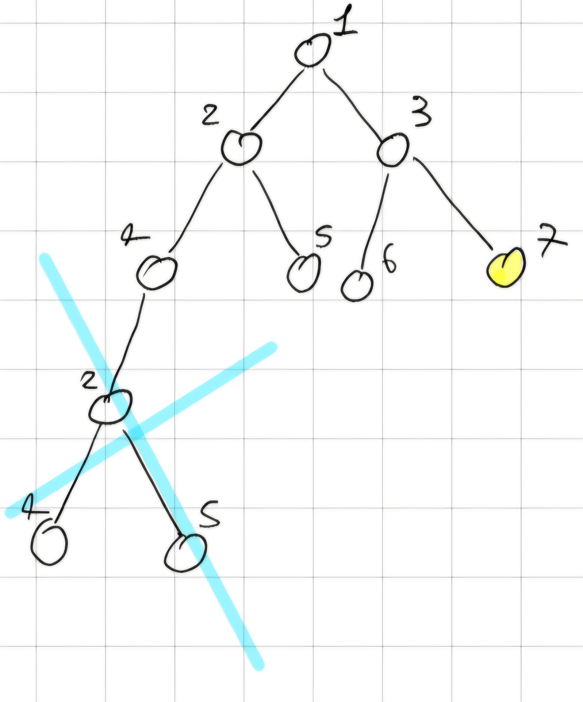

## Introduction

Hello reader this is a short summary of our notes about the course "FAI". If you find an error or you think that one point isn't clear please tell me and I fix it (sorry for my bad english). -NP

## First Chapter: Types of AI and Turing Test

When we talk about intelligence we can define it based on two factors:

- **Performance**: The measure of how well an AI system functions
  - **Human Performance**: Measured by how closely the AI's behavior resemble those of humans
  - **Rational Performance**: Measured by how effectively the AI achieves its goals
- **Approach**: The method employed by the AI to achieve its performance goals
  - **Think**: Focuses on internal cognitive processes, aiming to replicate or simulate human or logical thought.
  - **Act**: Focuses on observable behavior, regardless of the underlying thought process.

Based on those factors, we can define four categories of AI, displayed as a 2x2 matrix:

| Approach \ Performance | Human            | Rational            |
|------------------------|------------------|---------------------|
| Think                  | Thinking Humanly | Thinking Rationally |
| Act                    | Acting Humanly   | Acting Rationally   |

### Thinking Humanly

This approach aims to create AI that thinks like a human. This is the goal of the **Cognitive Modeling** approach, which involves creating a computer model of human cognitive processes.

To achieve this, we need to understand how humans think, which can be done through **Cognitive Science**. This field combines insights from psychology, neuroscience, and linguistics, philosophy to understand how humans think.

### Thinking Rationally

This approach aims to create AI that thinks logically. This is the goal of the **Laws of Thought** approach, which involves creating AI that can reason logically.

To achieve this, we need to understand how to reason logically, which can be done through **Logic** and *formal notation*.

### Acting Humanly

This approach aims to create AI that acts like a human, ignoring the process behind it.

To test this, we can use the **Turing Test**, which involves a human interacting with a computer and another human, without knowing which is which. If the human can't tell the difference, the AI passes the test.

This test give us 6 skill about the intelligence tested:

- **Natural Language Processing**: The ability to communicate in natural language.
- **Knowledge Representation**: The ability to store and retrieve information.
- **Automated Reasoning**: The ability to solve problems.
- **Machine Learning**: The ability to learn from experience.
- **Computer Vision**: The ability to perceive objects.
- **Robotics**: The ability to act on the environment.

### Acting Rationally

This approach aims to create a **Rational Agent**, which is an AI that acts to achieve the best outcome based on its goals.

## Chapter Two: Agent

**Agent**: Anything that can perceive an enviroment and act upon it.

**Rational Agent**: This type of agent chooses the actions that maximizes the expected value of his **performance measure**.

**Performance measure**: It is the criterion for evalueting the success of our agent (for example in "il gioco dell'oca" more our agent is near to the arrive more us take point on its expected value).

Agent Architecture:

- Simple Reflex Agents.
- Reflex Agents with state.
- Goal-based Agents.
- Utility-based Agents.

More we go down with the architecture more is the complexity and the power. (Utility is more power than Goal that is more power than Reflex etc.)

## Chapter Three: Agent Architecture

All 4 types of agents are rational but with difference Performance Measure.

This is the simplest type of agent, our objective is be able to create this by the end of the course.

An example of this agent is the first prototype of Rumba the automatic vacuum.

An example of possible agent is an agent build for play tic-tac-toe (tris). A pseudo-code of this agent is:

    if canwin(player)
        win(player);
    if canwin(opponent)
        block(opponent);
    if free(center);
        take(center);
    if free(corner)
        take(corner);
    if free(side)
        take(side);

For example the system of Auto-drive sets up on modern car is a utility-based agent. This bacause he must be control a lot sensors and variable (speed, navigator, tire's pressure, etc.).

Can a Goal-based agent work like an Utility-based agent ? The answer is no, but an Utility-based can work like a Goal-based it's enough just maximaze the "happinest".

A newest type of Agent is the **Learning Agents**.

An example of learnig agent is the system used to build the flocking model (based on bird flocks).

The flocking model consist in three basic behaviors:

- Separation: steer to avoid crowing local flockmates.
- Alignemt: steer toward the avenge heading of local flockmates.
- Coohesion: steer to move toward the avenge position of local flockmates.

In this course we learn to build a weak AI.

**Weak AI**: AI that perform as well as humans.

**Strong AI**: AI that replicate exactly how humans think.

**General AI**: AI that can solve wide variety of task.

(**Funfacts** Open-AI Five build an AI that can compatitive internationaly on "Dota 2".)

## Chapter Four: Problem Solving by Search

Problem Solving by Search $\implies$ we can find the solution in many way.

### Eight Puzzle

This is a puzzle game where I have matrix 3x3 complose by 8 numbers and I have to put in order from 1 to 8.

I can rapresent the 8-puzzle in an array:

state = $[[0,8,2],[3,4,7],[5,1,6]]$

action = $(x,y)$

    struct{
            int from;
            int to;
        }action;

### Search Problems

- A set of states $S$ and an initial state $s_0$.
- The function $actions(s)$ that given a state $s$, return the set of feable actions.
- The function $result(s,a)$, $s$ is the state and $a$ the action, return the state reached.
- A goal test that given a state $s$ return true if the state is the goal state.
- A step cost $c(s,a,s')$ of an action $a$ from $s$ to $s'$.

### State Space

- The state space is a directed graph with nodes rappresenting state, arcs rappresenting actions.
- The solution to a search problem is a path in the state space from the initial state to the goal state.

**Optimal Solution**: solution with the lowest cost.

There are problem without solution.

If I wanted to crate a state space for the 8-puzzle, How many states would I have?

8-puzzle: $9!(362880)$ states.

If I generate 100 millions states per second, I would requite 0.036 second to generate the graph. But the 24-puzzle has $25!(10^{25})$ states so I would requite more than 109 years $\implies$ I have to use a better method.

### Eight-Queens Puzzle

In this game I have to put 8 queens in a chess camp without any queens stay on the territory of the other.

### Path planning

I have multiple path.

I have to reach the black point on the left from the red at the right.

So for find a solution I don't create a graph but a tree.

Tree is made of node.

State space is made of states and connections.

The idea is take a state and from it draw the tree with every way the state can take, until I arrive to the final state.

So I build from zero everytime? Yes, I do.

Dear reader, before continuing, try to answer this question, why i prefer build a tree?

For some problem I have an infinite tree (for loop or none solution) so I must find I new method.

The best algorithm for the tree search is the **Best-First Search**.

## Chapter Five: Uninformed Search Startegies

**Uninformed Search Startegies**: They use only the information conteined in the problem formulation.

**The Five Elements of U.S.S.**

- The set of states (and initial state).
- Function actions().
- Function result().
- Goal test.
- Step cost.

Evaluation of Search Strategies

- Completeness: Is the S.S. guarateed to find a solution when exist ?
- Optimality: Does the S.S. optimal ?
- Complexity: How much time require ?
- Parameters

  - $b$,  the branching factor of search tree.
  - $d$, the depth of shallowest goal node.

Bigger is the $b$ factor, harder is the problem.

Bigger is the $d$ factor, more exploretion require the closest solution.

### Breadth-First Search

The Algorithm is the same we do in "API" but here we generate a tree step by step, so we don't color the node and the loop don't rappresent a problem for us.

we start with the first node: $1$ and expand the branch so $[2, 3]$ we expand the first node we see: $2 \implies [3, 4, 5]$, we continue with thise idea $[4, 5, 6, 7] \to [5, 6, 7, 2] \to [6, 7, 2] \to [7, 2]$ now we have first 7 that is the goal state and interrupt the search, so we don't see the loop.

**Complexity**: temporal and spatial (worse-case) $\Omicron(b^{d+1})$

### Deapth-First Search

The same we saw in "API" but we generate a tree step by step and here we can have a loop.

$[1] \to [2, 3] \to [4, 5, 3] \to [2, 5, 3] \to [4, 5, 5, 3]$ so in this case we have a loop, now we delete it.

$[1] \to [2, 3] \to [4, 5 , 3] \to [5, 3] \to [3] \to [6, 7] \to [7] \ 7$ is the goal state.

**Complexity**: Given the maximum depth of the search tree $m$:

- The spatial (worse-case) $\Omicron (bm)$.
- Temporal $\Omicron(b^m), \ m$ could be infinite.

It is cleae that the DFS Algorithm isn't a good Tree Search Algorithm.

### Uniform-Cost Search (UCS)

It is an BFS modify, we choose the path with the smallest cost, in a situation of equal cost we choose with other condition (ex. alphabetic order).

UCS is **complete** and **optimal**.

**Complexity:**

- worst-case temporal and spatial $\Omicron (b^{(1 + [\frac{c^*}{\varepsilon}])})$.
- $b =$ step cost larger than $\varepsilon$.
- $\varepsilon =$ smallest cost.
- $c^* =$ cost of the optimal solution.

## Chapter Six: Informed Search Strategies

In this type of search there are two important things:

- The Algorithm use knowledge that is not contained in problem formulation.
- The most important object in this search is the "evaluation function" $(f(n))$, this function tell us "how much" a node is "promising". Smaller is the value of $f(n)$ better is. We can calculate $f(n)$ in two ways:

  - Greedy Best-first Search (GBS).
  - $A^*$ Search.

### Greedy Best-first Search (GBS)

- Uses an $f(n)$ that is equal to heuristic function $(h(n))$.
- The $h(n)$ evaluates the estimated cost of the shortest path from a node $n$ to a goal node.
- If we want to apply GBS, the $h(n)$ must be known.

**IMPORTANT:** $h(n)$ is an **estimate**, not the actual cost.

**Example**

- Now two examples of heuristics for the 8-puzzle:

  - $h_1(n) : \#$ of misplaced tiles.
  - $h_2(n) :$ sum of Manhattan distances of each tile to its final position.

    - Sum of Manhattan distances of two points $(x_1; y_1), (x_2; y_2)$ is $|x_1 - x_2| + |y_1 - y_2|$

- $h_1 (n) = 6$
- $h_2 (n) = 2 (\text{for}\ 5) + 3(\text{for}\ 8) + 0(\text{for}\ 4) + 1(\text{for}\ 2) + 3(\text{for}\ 1) + 0(\text{for}\ 7) + 3(\text{for}\ 3) + 1(\text{for}\ 6) = 13$

**$H(n)$ Accuracy**

- Given two heuristic functions $h_1$ and $h_2$ and $h_1 (n) \leq h_2 (n)$ for any $n$.
- $h_2$ dominates $h_1 \implies h_2$ is more accurate of more informed than $h_1$.

**Graphical examples of 8-puzzle:**

**Evaluation**

- GBS is not complete and he can get stuck in a loop $\implies$ not optimal.
- Temporal and spatial complexity of $\Omicron (b^m)$ nodes (worst-case), $m:$ maximum depth of the search tree.

### $A^*$

The evaluation funcion "$f(n)$" of a node $n$ is computed as the sum of two componets:

- $A\ h(n)$.
- The cost to reach $n$ from the root $g(n)$.

$f(n) = g(n) + h(n)$

- $f(n) :$ estimates the cost of a solution that passes though node $n$.
- $g(n) :$ we already said.
- $h(n) :$ estimates the cost of the shortest path from $n$ to a goal node.

**IMPORTANT :** We **must** know $h(n)$ to apply $A^*$ search.

**Example**

**Evaluation**

- $A^*$ search is complete and optimal for tree-search.

  - When $h(n)$ is admissible.

- $A^*$ search is complete and optimal for graph-search.

  - When $h(n)$ is consistent.

**Complexity**

It has a temporal and spatial complexity that is exponential in the lenght of the solution.

**Wait, WHAT?! $h(n)$ admissible ?!**

$h(n)$ is admissible when for each $n :$

- $0 \leq h(n) \leq h^*(n)$

$h^*(n) :$ actual cost from $n$ to the solution.

### First Optimality Theorem for $A^*$ Search

$A^*$ with tree-search is complete and optimal when $h(n)$ is admissible.

**Completeness**

If a solution exists, $A^*$ search terminates with the solution.

**Optimality**

- Call $C^*$ the cost of the optimal solution, consider a sub-optimal goal $G' : f(G') = g(G') + h(G').$
- $G'$ is suboptimal $: g(G') > C^*.$
- A node $n$ in the frontier, which is on the path of the optimal solution $: f(n) = g(n) + h(n) \leq C^*.$
- So $f(n) \leq C^* f(G')$.
- Thus, when $A^*$ search selects a node from the frontier, the path to the corresponding state is optimal.

**Wait, WHAT?! (pt.2) $h(n)$ consistent ?!**

A $h(n)$ is consistent when, for each node $n$ and each one of its successors $n' :$

- $h(n) \leq c(n,a,n') + h(n')$

A consistent $h(n)$ is also admissible, viceversa is not true.

If $n$ is a goal node, then $h(n) = 0.$

For Example the 8-puzzle solution, with $h_1(n)$ and $h_2(n)$ already saw, $h_1$ and $h_2$ are consistent.

### Second Optimality Theorem for $A^*$ Search

$A^*$ search with graph-search is complete and optimal when $h(n)$ is consistent.

**Completeness**

It can be proved that in the same way we did for tree search with an admissible $h(n).$

**Optimality**

- Given $n'$ successor of $n$, $f(n') = g(n') + h(n') = g(n) + c(n,a,n') + h(n') \geq g(n) + h(n) = f(n).$
- Thus, $A^*$ chooses nodes in non-decreasing order of $f(n)$.
- Thus, when $A^*$ selects the first goal node from the frontier, this is optimal solution.

**Consistency is a stronger property than admissibility.**

Other properties of $A^*$ Search:

- $A^*$ expands all nodes with $f(n) < C^*.$
- $A^*$ expands some nodes with $f(n) = C^*.$
- $A^*$ expands no nodes with $f(n) > C^*.$
- $A^*$ is optimally efficient.

### Weighted $A^*$ Search

It introduces a weight factor $w (1 \leq w < \infty)$ over the heuristics so that, $f(n) = g(n) + wh(n) \implies$ can be more efficient.

### Iterative Deepening $A^* (IDA^*)$ Search

$IDA^*$ reduces memory requirement of $A^*$ search by applying a limit to the values of $f(n).$

It assumes to have a consistent $h(n).$

**Evaluation of $IDA^*$ Search**

**Completeness**

$IDA^*$ Search is complete when $h(n)$ is admissible.

**Optimality**

$IDA^*$ Search is optimal when $h(n)$ is admissible.

**Complexity**

- $IDA^*$ requires less memory than $A^*$ and avoids to sort the frontier.
- HOwever, $IDA^*$ cannot avoid to revisit states not on the current path, because it uses too little memory.
- Thus, it is very efficient memory-wise but time-wise since it revisits states.

$S(n) = \Omicron(bd)
\\
T(n) = \Omicron(b^d)$

## Chapter Seven: Constraint Satisfaction Problems
