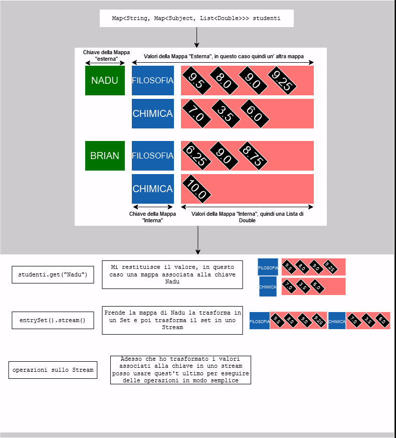

<link rel="preconnect" href="https://fonts.googleapis.com">
<link rel="preconnect" href="https://fonts.gstatic.com" crossorigin>
<link href="https://fonts.googleapis.com/css2?family=Merriweather:ital,wght@0,300;0,400;0,700;0,900;1,300;1,400;1,700;1,900&display=swap" rel="stylesheet">

<style>
    body
    {
        font-family: "Merriweather", serif;
        font-style: normal; 
    }

    table {
        color: black; 
        font-family: arial, sans-serif;
        text-align: center; 
        border-collapse: collapse;
        width: 100%;
    }

    th 
    {
        max-width: 1vw; 
        border: 1px solid #dddddd;
        text-align: center;
        padding: 8px;
    }

    th:nth-child(4)
    {
        font-weight: 800; 
    }

    tr:nth-child(even) {
        background-color: #dddddd;
    }
    tr:nth-child(odd) {
        background-color: #aaaaaa;
    }
</style>

# Ingegneria del software

## Functional Programming


<table>
    <tr> 
        <th>Metodo</th>
        <th>Descrizione</th>
        <th>Ritorna</th>
        <th>Note/Esempio</th>
    </tr>
    <tr> 
        <th>allMatch(Predicate&lt? super T&gt predicate)</th>
        <th>Controlla se tutti gli elementi dello stream corrispondano all'predicato fornito</th>
        <th>Ritorna un booleano</th>
        <th>allMatch(n -> n%3==0)</th>
    </tr>
    <tr> 
        <th>anyMatch(Predicate&lt? super T&gt predicate)</th>
        <th>Controlla se almeno un elemento dello stream corrisponde all'predicato fornito</th>
        <th>Ritorna un booleano</th>
        <th>anyMatch(n->(n*(n+1))/4 == 5)</th>
    </tr>
    <tr> 
        <th>collect(Collector&lt? super T,A,R&gt collector)</th>
        <th>Ritorna una collezione &ltR, A&gt R dopo aver eseguito un'operazione di riduzione mutabile sugli elementi dello stream usando un collector</th>
        <th>Ritorna un booleano</th>
        <th>collect(Collectors.toList())</th>
    </tr>
    <tr> 
        <th>concat(Stream&lt? extends T&gt a, Stream&lt? extends T&gt b)</th>
        <th>Concatena lo Stream b allo Stream a</th>
        <th>Ritorna uno Stream&ltT&gt</th>
        <th>concat(stream1, stream2)</th>
    </tr>
    <tr> 
        <th>count()</th>
        <th>Conta il numero di elementi presenti nello Stream</th>
        <th>Ritorna un long</th>
        <th>stream().count()</th>
    </tr>
    <tr> 
        <th>distinct()</th>
        <th>Tiene solo gli elementi diversi tra di loro</th>
        <th>Ritorna uno Stream&ltT&gt</th>
        <th>stream().distinct()</th>
    </tr>
    <tr> 
        <th>empty()</th>
        <th>Crea uno stream sequenziale vuoto</th>
        <th>Ritorna uno Stream&ltT&gt</th>
        <th>stream = Stream.empty()</th>
    </tr>
    <tr> 
        <th>filter(Predicate&lt? super T&gt predicate)</th>
        <th>Prende solo gli elementi dello stream che rispettano il predicato</th>
        <th>Ritorna uno Stream&ltT&gt</th>
        <th>filter(n -&gt n&gt=18)</th>
    </tr>
    <tr> 
        <th>findAny()</th>
        <th>Descrive un elemento qualsiasi dello stream</th>
        <th>Ritorna un Optional&ltT&gt</th>
        <th>stream().findAny()<br><i>ritorna un opzionale vuoto se lo stream è vuoto</i></th>
    </tr>
    <tr> 
        <th>findFirst()</th>
        <th>Descrive il primo elemento dello stream</th>
        <th>Ritorna un Optional&ltT&gt</th>
        <th>stream().findFirst()<br><i>ritorna un opzionale vuoto se lo stream è vuoto</i></th>
    </tr>
    <tr> 
        <th>flatMap(Function&lt? superT, ? extends Stream&lt? extends R&gt&gt mapper)</th>
        <th>Mette tutti i "subelementi" di ogni elemento nello stream originale uno dopo l'altro</th>
        <th>Ritorna uno Stream&ltT&gt</th>
        <th>flatMap(g -&gt g.getName().stream())</th>
    </tr>
    <tr> 
        <th>forEach(Consumer&lt? super T&gt action)</th>
        <th>Compie un azione su ogni elemento dello stream</th>
        <th>Ritorna void</th>
        <th>forEach(System.out::println)</th>
    </tr>
    <tr> 
        <th>limit(long maxSize)</th>
        <th>Tronca lo stream originale alla lunghezza maxSize fornita</th>
        <th>Ritorna uno Stream&ltT&gt</th>
        <th>limit(3)<br><br>limit(range)</th>
    </tr>
    <tr> 
        <th>max(Comparator&lt? super T&gt comparator)</th>
        <th>Ritorna l'elemento massimo dello stream che rispetta il comparatore fornito</th>
        <th>Ritorna un Optional&ltT&gt</th>
        <th>max(Integer::compareTo)<br><i>Questo ritorna in base all'ordine naturale degli interi</i></th>
    </tr>
    <tr> 
        <th>min(Comparator&lt? super T&gt comparator)</th>
        <th>Ritorna l'elemento minimo dello stream che rispetta il comparatore fornito</th>
        <th>Ritorna un Optional&ltT&gt</th>
        <th>min(Comparator.reverseOrder())<br><i>Questo ritorna in base all'inverso dell'ordine naturale degli interi (quindi ritorna il massimo)</i></th>
    </tr>
    <tr> 
        <th>noneMatch(Predicate&lt? super T&gt predicate)</th>
        <th>Dice se nessuno elemento dello stream corrisponde al predicato fornito</th>
        <th>Ritorna un booleano</th>
        <th>noneMatch(str -&gt (str.length() == 4))</th>
    </tr>
    <tr> 
        <th>of(T... values)</th>
        <th>Crea uno stream sequenziale ordinato dove gli elementi sono i valori passati</th>
        <th>Ritorna uno Stream&ltT&gt</th>
        <th>stream = Stream.of("CSE", "C++", "Java", "DS")</th>
    </tr>
    <tr> 
        <th>reduce(BinaryOperator&ltT&gt accumulator)</th>
        <th>Esegue una riduzione sugli elementi dello stream usando una funzione di accumulazione associativa ritorna poi il risultato della riduzione se presente</th>
        <th>Ritorna un Optional&ltT&gt</th>
        <th>reduce((word1, word2) -&gt word1.length() &gt word2.length() ? word1 : word2)</th>
    </tr>
    <tr> 
        <th>skip(long n)</th>
        <th>Salta i primi n elementi dello stream originale</th>
        <th>Ritorna uno Stream&ltT&gt</th>
        <th>skip(5)<br><br>skip(jump)</th>
    </tr>
    <tr> 
        <th>sorted(Comparator&lt? super T&gt comparator)</th>
        <th>Ritorna uno stream formato dagli elementi dello stream originale ordinati in base al comparatore fornito</th>
        <th>Ritorna uno Stream&ltT&gt</th>
        <th>sorted(Comparator.reverseOrder())<br><i>Se non viene fornito alcun comparatore ordina in base all'ordine naturale</i></th>
    </tr>
    <tr> 
        <th>toArray()</th>
        <th>Ritorna un array contente tutti gli elementi dello stream</th>
        <th>Ritorna un Object[]</th>
        <th>stream().toArray()</th>
    </tr>
</table>

### Map 

Interface Map<K,V><br>
Dove K è il tipo della chiava della mappa e V è il tipo dei valori mappati<br>
<br>
<span style="font-size: 20px">Ex:</span>
```Java
//questa è una mappa che usa un Double come chiave e ogni valore è rappresentato da una stringa
Map<Double, String> utenti;

//in questo caso la mappa usa una stringa come chiave e i valori sono rappresentati da una mappa
//che usa un tipo Subject come chiave e i valori sono rappresentati da una lista di Double
Map<String, Map<Subject, List<Double>>> studenti;
```

#### Metodi di Map

> void clear(): cancella tutti i valori e le chiavi della mappa. La mappa sarà quindi vuota dopo che questo metodo ha terminato.
> <br><br>
> int size(): Ritorna il numero di associazioni chiave-valore presenti in questa mappa.
> <br><br>
> boolean containsKey(Object key): Ritorna vero se questa mappa contiene una cella per la chiave specificata. 
> <br><br>
> boolean containsValue(Object value): Ritorna vero se la mappa associa ad una o piu chiavi il valore specificato.
> <br><br>
> Set<Map.Entry<K, V>> entrySet(): Ritorna un set contenente tutte la mappature presenti nella mappa. Questo set è costruito sulla mappa, quindi cambiamenti futuri alla mappa si rifletterano sul Set e vice-versa.
> <br><br>
> V get(Object key): Ritorna il valore associato alla chiave specificata, ritorna null se non c'è alcun valore associato alla chiave. 
> <br><br>
> V put(K key, V value): Associa il valore passato alla chiave specificata. Se la mappa gia conteneva un valore associato a quella chiave, il nuovo valore sovrascriverà quello vecchio. 
> <br><br>
> V replace(K key, V oldValue, V newValue): Sostituisce il valore associato alla chiave passata con newValue solo se il valore attuale è oldValue. Se oldValue viene omesso, allora gli va bene qualsiasi valore basta che non sia null o mancante. 
> <br><br>
> boolean remove(Object key, Object value): Rimuove la cella associata alla chiave specificata solo se associata al valore passato. 
> <br><br>
> boolean isEmpty(): Ritorna vero se la mappa non contiene associazioni chiave-valore
> <br><br>
> Set<K> keySet(): Ritorna un set con tutte le chiavi contenute nella mappa. Questo Set è costruito sulla mappa, quindi futuri cambiamenti alla mappa si rifletterano sul Set e vice-versa. 
> <br><br>
> Collection<V> values(): Ritorna una collezione di tutti i valori contenuti nella mappa. La collezione è costruita sulla mappa, quindi futuri cambiamenti alla mappa si rifletterano sulla collezione e vice-versa. 


<br><br>

<span style="font-size: 20px">Ex:</span>
```Java
studenti.get("Nadu").entrySet().stream().map(
    (entry) -> {
        return new Pair<Subject, Double>(
            entry.getKey(), (
                entry.getValue().stream().reduce(0.0, (a, b) -> a+b)/entry.getValue().size()
                )
            ); 
    }
).collect(Collectors.toList()); 

//Questo restituisce la media per ogni materia dello studente
//attenzione che entry è un Pair non una mappa
//i metodi getKey() e getValue() non appartengono a map e non possono essere usati su una mappa
//Un pair non è una mappa, ma indica solo una coppia di valori che vogliamo tenere assieme
//Pair ha i seguenti metodi: 
// String toString(): questo metodo restituirà la rappresentazione String della coppia.
// K getKey(): Restituisce la chiave per la coppia.
// V getValue(): Restituisce un valore per la coppia.
// int hashCode(): genera un codice hash per la coppia.
```

## Synchronized and Multi-Threading

### Synchronized
Non è possibile che due invocazioni di due metodi sincronizzati sullo stesso oggetto si sovrappongano.<br>
Quando un Thread sta eseguendo un metodo sincronizzato su un oggetto tutti gli altri thread che invocano metodi sincronizzati 
sullo stesso oggetto vengono bloccati fino a che il primo thread non ha finito con l'oggetto.<br>
Quando esiste un metodo sincronizzato, questo stabilisce automaticamente una relazione di <i>happens-before</i> (succede-prima)
con tutte le invocazioni successive del metodo sincronizzato sullo stesso oggetto.<br>
Questo garantisce che lo stato dell'oggetto sia visibile a tutti i thread.<br>

```Java
public synchronized void increment()
{
    randomString = "TiTilda"; 
    c++; 
}
```
    Qua sincronizzo tutto il metodo, quidni fino a che il metodo non ha finito, l'oggetto è bloccato


```Java
public void increment()
{
    randomString = "TiTilda"; 

    synchronized(this)
    {
        c++; 
    }
}
```
    In questo caso randomString non è una variabile condivisa quindi non ho bisogno di modificarla in un momento sincronizzato
    Invece c è condiviso quindi la modifico sincronizzando il metodo.
    Alternativamete al posto di 'this' potevo mettere un oggetto di lock, cosi sincronizzavo sull'oggetto e non sul metodo

### sleep(long amount)

Blocca il thread per una quantità di tempo specifica, definita in milisecondi, prima di farlo ripartire

```Java
synchronized public void sing()
{
    print("She Drives Me Crazy");
    sleep(3500); 
    print("Like No One Else");
}
```

### wait()

Blocca il thread per un tempo indefinito e lo inserisce in una coda fino a quando questo non viene risvegliato

```Java
synchronized public void shoot()
{
    if(bulletsLeft == 0) wait(); 
    else bulletsLeft--; 
}
```

### notify()

Risveglia il primo thread della coda premettensogli di riprendere la sua esecuzione

```Java
synchronized public void reload()
{
    bulletsLeft = maxBullets; 
    notify();
}
```

### notifyAll()

Risveglia tutti i thread della coda permettendo a tutti di riprendere la loro esecuzione

```Java
public void run()
{
    print("Notifying All");
    synchronized(this)
    {
        notifyAll(); 
    }
    print("All Notified");
}
```

## JML

<table>
    <tr> 
        <th>Espressione</th>
        <th>Descrizione</th>
        <th>Tipo</th>
        <th>Note</th>
    </tr>
    <tr> 
        <th>\result</th>
        <th>Puo essere usato <u>solo nell'ensures</u> di un metodo non-void.<br>Ilsuo valore e tipo sono quelli ritornati dal metodo</th>
        <th>?<br>(<i>qualsiasi tipo</i>)</th>
        <th></th>
    </tr>
    <tr> 
        <th>\old(val)</th>
        <th>Indica il valore che val aveva nella precondizione</th>
        <th>?</th>
        <th></th>
    </tr>
    <tr> 
        <th>\not_assigned(val-list)</th>
        <th>Puo esseren usata <u>nell'ensures e nella signals</u>, indica che i valori val-list non sono mai stati assegnati</th>
        <th>booleano</th>
        <th>i valori di val-list sono forniti come parametri in un metodo separati dalla virgola</th>
    </tr>
    <tr> 
        <th>\not_modified(val-list)</th>
        <th>Puo essere usata <u>nell'ensures e nella signals</u>, indica che i valori non sono cambiati rispetto alla pre-condizione</th>
        <th>booleano</th>
        <th></th>
    </tr>
    <tr> 
        <th>\only_accessed(val-list)</th>
        <th>Puo essere usata <u>nell'ensures e nella signals</u>,indica che nessun valore al di fuori di quelli di val-list è stato letto dal metodo</th>
        <th>booleano</th>
        <th></th>
    </tr>
    <tr> 
        <th>\only_assigned(val-list)</th>
        <th>Puo essere usata <u>nell'ensures e nella signals</u>, indica che nessun valore al di fuori di quelli di val-list è stato assegnato dal metodo</th>
        <th>booleano</th>
        <th></th>
    </tr>
    <tr> 
        <th>\only_called(method-list)</th>
        <th>Puo essere usato <u>nell'ensures e nella signals</u>, indica che nessun metodo al di fuori di quelli di method-list è stato chiamato</th>
        <th>booleano</th>
        <th></th>
    </tr>
    <tr> 
        <th>\fresh(val-list)</th>
        <th>Puo essere utilizzato <u>nell'ensures e nella signals</u>, indica che i valori di val-list non sono stati inizializzati nella pre-condizione</th>
        <th>booleano</th>
        <th></th>
    </tr>
    <tr> 
        <th>\nonnullelements(val)</th>
        <th>controlla che tutti gli elementi dell'array o della collezione siano non nulli</th>
        <th>predicato<br>(<i>boolean like</i>)</th>
        <th>è l'equivalente di fare:<br><i>myArray != null &&
  (\forall int i; 0 <= i && i < myArray.length;
                  myArray[i] != null)</i>;</th>
    </tr>
    <tr> 
        <th>\typeof(val)</th>
        <th>Ritorna il tipo di val</th>
        <th>?</th>
        <th>Per esempio posso fare:<br><i>\typeof(num) == Integer</i><br>per controllare se num è un intero</th>
    </tr>
    <tr> 
        <th>\max(val)</th>
        <th>Ritorna il massimo <u>dell'set</u> passato</th>
        <th>?</th>
        <th>Se ho un array devo prima transformarlo in set:<br><i>\max(\set(i; 0 <= i && i < arr.length; arr[i]))</i>;</th>
    </tr>
    <tr> 
        <th>\min(val)</th>
        <th>Ritorna il minimo <u>dell'set</u> passato</th>
        <th>?</th>
        <th></th>
    </tr>
    <tr> 
        <th>\forall(var; condizione; predicato)</th>
        <th>Controlla che tutti gli elementi nell'range della condizione rispettino il predicato</th>
        <th>quantificatore<br>(<i>boolean like</i>)</th>
        <th></th>
    </tr>
    <tr> 
        <th>\exists(var; condizione; predicato)</th>
        <th>Controlla che esista almeno un valore nell'range della condizione rispetti il predicato</th>
        <th>quantificatore<br>(<i>boolean like</i>)</th>
        <th></th>
    </tr>
    <tr> 
        <th>\num_of(var; condizione)</th>
        <th>Conta i valori in var che rispettino la condizione</th>
        <th>long</th>
        <th></th>
    </tr>
    <tr> 
        <th>\sum(var; condizione; val)</th>
        <th>fa la somma di tutti i val, cui var rispetta la condizione</th>
        <th>?</th>
        <th><i>\sum(int i; 0 <= i && i < arr.length; arr[i])</i>;</th>
    </tr>
    <tr> 
        <th>\product(var; condizione; val)</th>
        <th>fa il prodotto di tutti i val, cui var rispetta la condizione</th>
        <th>?</th>
        <th><i>\product(int i; 0 <= i && i < arr.length; arr[i])</i>;</th>
    </tr>
    <tr> 
        <th>\is_initialized(class)</th>
        <th>Controlla se la classe ha finito la sua inizializzalizazione statica</th>
        <th>booleano</th>
        <th></th>
    </tr>
    <tr> 
        <th>\choose(var; condizione; predicato)</th>
        <th>Ritorna un qualsiasi valore nel range della condizione che rispetti il predicato</th>
        <th>?</th>
        <th><i>\choose(int i; 0 <= i < a.length; a[i] == 0)</i>;</th>
    </tr>
    <tr> 
        <th>==&gt<br><i>implica</i></th>
        <th>Puo essere usato <u>solo su sub-espressioni booleane</u><br>A==&gtB puo essere tradotto in <i>!A || B</i></th>
        <th>booleano</th>
        <th>Puo anche essere scritto al contrario:<br>A&lt==B, tradotto quindi in A || !B</th>
    </tr>
    <tr> 
        <th>&lt==&gt<br><i>se solo se</i></th>
        <th>Puo essere usato <u>solo su sub-espressioni booleane</u><br>A&lt==&gtB puo essere tradotto in <i>A == B</i></th>
        <th>booleano</th>
        <th></th>
    </tr>
    <tr> 
        <th>&lt=!=&gt<br><i>se solo se non</i><br>(<i>non equivale a</i>)</th>
        <th>Puo essere usato <u>solo su sub-espressioni booleane</u><br>A&lt=!=&gtB puo essere tradotto in <i>A != B</i></th>
        <th>booleano</th>
        <th></th>
    </tr>
</table>

## Liskov

Gli oggetti della sotto-classe devono rispettare il contratto della super-classe.<br>
In altre parole il comportamento della sotto-classe deve essere compatibile con il comportamento della super-classe. 
Un oggetto di un tipo deve essere in grado di usare un oggetto di un tipo derivato senza "notare" le differenza.<br>
Per vedere se il una sotto-classe rispetta Liskov si possono fare le seguenti domande:<br>
1. Cambiano i metodi della classe?
2. Si potrebbe fare la stessa cosa con i metodi già esistenti?
3. Restano invariate le proprietà?

In termini JML-ani bisogna assicurarsi che la @Requires sia uguale o piu permissiva (piu corta) e l'@Ensures sia uguale o piu stringente (piu lunga).

## Inheritance and Visibility

```Java
/*
public class Utils 
{
    public static void print(Object... mexs)
    {
        for(Object mex : mexs) System.out.println(mex);
    }
} 
*/

 import static com.mycompany.inheritancetest.Utils.*; 
 /**
  *
  * @author mosco
  */
 abstract class Z
 {
     private String name; 
     
     Z(String name)
     {
         this.name = name; 
     }
     
     public void talk()
     {
         print("Class Z - talking " + name); 
     }
     
     public void shout()
     {
         print("Class Z - " + name + " prints from abstract class");
     }; 
 }
 class A extends Z
 { 
     public String name; 
     
     A(String name)
     {
         super(name); 
         this.name = name; 
     }
     
     public void shout()
     {
         print("Class A - Print from " + name);
     }
     
     public void whisper(A obj)
     {
         print("Class A - " + name + " Shh " + obj.name + " has a secret");
     }
     
     public void shoutVisableA()
     {
         print("Class A - Print visable from " + name);
     }
     
     private void shoutHiddenA()
     {
         print("Class A - Print hidden from " + name);
     }
 }
 
 class B extends A
 {
     public String name; //questo nascode il nome di A
     
     B(String name)
     {
         super(name);  // Call the constructor of class A
         this.name = name; 
     }
     
     public void shout()
     {
         print("Class B - Print from " + name); 
     }
     
     public void whisper(A obj)
     {
         print("Class B - " + name + " Shh " + obj.name + " has a secret");
     }
     
     public void shoutVisableB()
     {
         print("Class B - Print visable from " + name);
     }
 }
 
 class C extends B
 {
     public String name;  //questo nasconde il nome di B
     
     C(String name)
     {
         super(name);  // Call the constructor of class B
         this.name = name; 
     }
     
     public void shout()
     {
         print("Class C - Print from " + name); 
     }
     
     //C NON HA WHISPER
     
     public void shoutVisableC()
     {
         print("Class C - Print visable from " + name);
     }
 }
 
 class D extends Z
 {
     private String name; 
     
     D(String name)
     {
         super(name); 
         this.name = name; 
     }
     
     //D NON HA SHOUT
     
     public void shoutVisableD()
     {
         print("Class D - Print visable from " + name);
     }
 }
 
 
 public class InheritanceTest {
 
     public static void main(String[] args) {
         //Z z1 = new Z(); /*illegal: Z is abstract cannot be instantiated*/
         Z z2 = new A("z2");
         Z z3 = new B("z3");
         Z z4 = new C("z4");
         Z z5 = new D("z5");
         
         A a1 = new A("a1");
         A a2 = new B("a2"); 
         A a3 = new C("a3"); 
         //A a4 = new D("a4"); /*illegal: D cannot be converted to A*/
         
         B b1 = new B("b1"); 
         B b2 = new C("b2"); 
         //B b3 = new A("b3"); /*illegal: A cannot be converted to B*/
         //B b4 = new D("b4"); /*illegal: D cannot be converted to B*/
         
         C c1 = new C("c1");
         //C c2 = new B("c2"); /*illegal: B cannot be converted to C*/
         //C c3 = new A("c3"); /*illegal: A cannot be converted to C*/
         //C c4 = new D("c4"); /*illegal: D cannot be converted to C*/
         
         D d1 = new D("d1"); 
         //D d2 = new A("d2"); /*illegal: A cannot be converted to D*/
         //D d3 = new B("d3"); /*illegal: B cannot be converted to D*/
         //D d4 = new C("d4"); /*illegal: C cannot be converted to D*/
         
         //---------------
         //z1.shout(); /*illegal: cannot find symbol*/
         z2.shout();
         z2.talk();
         //z2.whisper(z2); /*illegal: cannot find symbol*/
         z3.shout();
         z3.talk();
         z4.shout();
         z4.talk();
         z5.shout();
         z5.talk();
         
         print("");//---------------
         
         a1.talk();
         a1.shout();
         a1.shoutVisableA(); 
         a1.whisper(a1);
         a1.whisper(a2);
         a1.whisper(a3);
         a1.whisper(b1);
         a1.whisper(c1); 
         //a1.shoutVisiableD(); /*illegal: cannot find symbol shoutVisableD() in a1*/
         //a1.shoutHiddenA(); /*illegal: shoutHiddenA è privato quindi non puo essere chiamato*/
         
         print("");//----------------
         
         a2.talk();
         a2.shout();
         a2.shoutVisableA(); 
         a2.whisper(a1);
         a2.whisper(a2);
         //a2.whisper(d1); /*illegal: D cannot be converted to A*/
         //a2.shoutVisableB(); /*illegal: cannot find symbol shoutVisableB() in a2*/
         
         print("");//----------------
         
         a3.talk();
         a3.shout();
         a3.shoutVisableA(); 
         a3.whisper(a3);
         //a3.shoutVisableB(); /*illegal: cannot find symbol shoutVisableB() in a3*/ 
         //a3.shoutVisableC(); /*illegal: cannot find symbol shoutVisableC() in a3*/ 
         
         print("");//----------------
         
         b1.talk();
         b1.shout();
         b1.shoutVisableB(); 
         b1.shoutVisableA();
         b1.whisper(a1);
         b1.whisper(b1);
         b1.whisper(c1);
         
         print("");//----------------
         
         b2.talk();
         b2.shout(); 
         b2.shoutVisableB();
         b2.shoutVisableA();
         //b2.shoutVisableC(); /*illegal: cannot find symbol shoutVisableC() in b2*/ 
         b2.whisper(a2);
         
         print("");//----------------
         
         c1.talk();
         c1.shout();
         c1.shoutVisableC();
         c1.shoutVisableB();
         c1.shoutVisableA();
         c1.whisper(a1);
         c1.whisper(c1);
         
         print("");//----------------
         
         d1.talk();
         d1.shout();
         d1.shoutVisableD();
         //d1.whisper(a2); /*illegal: cannot find symbol whisper() in d1*/ 
         //d1.shoutVisableA(); /*illegal: cannot find symbol shoutVisableA() in d1*/ 
     }
 }
 
 
 /*
 OUTPUT::
 
 Class A - Print from z2
 Class Z - talking z2
 Class B - Print from z3
 Class Z - talking z3
 Class C - Print from z4
 Class Z - talking z4
 Class Z - z5 prints from abstract class
 Class Z - talking z5
 
 Class Z - talking a1
 Class A - Print from a1
 Class A - Print visable from a1
 Class A - a1 Shh a1 has a secret
 Class A - a1 Shh a2 has a secret
 Class A - a1 Shh a3 has a secret
 Class A - a1 Shh b1 has a secret
 Class A - a1 Shh c1 has a secret
 
 Class Z - talking a2
 Class B - Print from a2
 Class A - Print visable from a2
 Class B - a2 Shh a1 has a secret
 Class B - a2 Shh a2 has a secret
 
 Class Z - talking a3
 Class C - Print from a3
 Class A - Print visable from a3
 Class B - a3 Shh a3 has a secret
 
 Class Z - talking b1
 Class B - Print from b1
 Class B - Print visable from b1
 Class A - Print visable from b1
 Class B - b1 Shh a1 has a secret
 Class B - b1 Shh b1 has a secret
 Class B - b1 Shh c1 has a secret
 
 Class Z - talking b2
 Class C - Print from b2
 Class B - Print visable from b2
 Class A - Print visable from b2
 Class B - b2 Shh a2 has a secret
 
 Class Z - talking c1
 Class C - Print from c1
 Class C - Print visable from c1
 Class B - Print visable from c1
 Class A - Print visable from c1
 Class B - c1 Shh a1 has a secret
 Class B - c1 Shh c1 has a secret
 
 Class Z - talking d1
 Class Z - d1 prints from abstract class
 Class D - Print visable from d1
 */
```

## Testing 

### Statement Coverage

Deve entrare una volta in tutti gli if, else, while,for, ecc...

### Edge Coverage

Come lo statement covarage, ma deve entrare anche nelle istruzioni "sottointese", per esempio, in un if senza else, deve entrare anche nell'else "mancante"

### Path Coverage

Come l'edge coverage ma deve percorrere tutti i percorsi possibili, quindi tutte le combinazioni possibili di if e else, se ci sono loop sono da considerare anche il numero d'ingressi nell'loop se con valori diversi entra un numero diverso di volte è da considerare come un altro percorso. 
