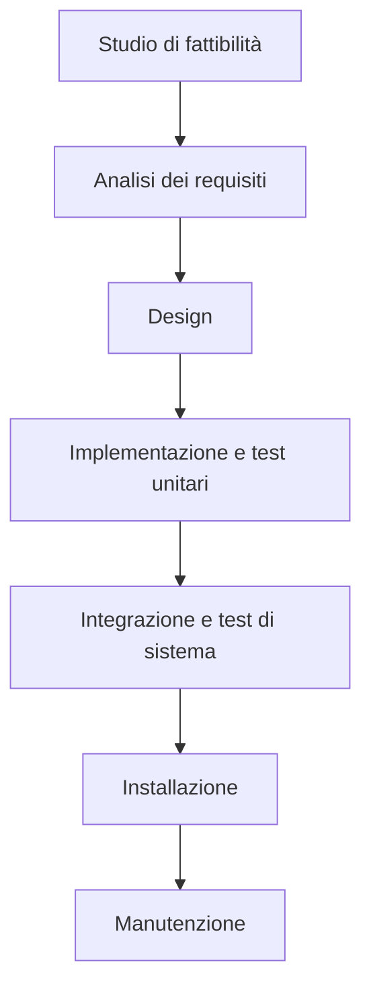
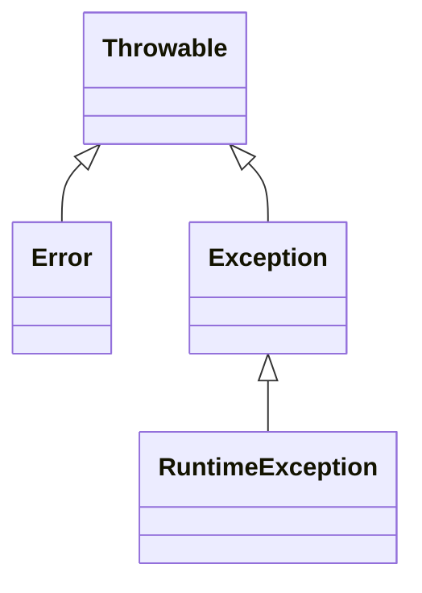

# Ciclo di vita del Software

Lo sviluppo di un software è un processo molto complesso: per semplicità lo si divide in fasi distinte; ciascuna fase prende il risultato della fase precedente, lo elabora e produce un **deliverable** che viene passato alla fase successiva.

Nello schema seguente viene mostrato il funzionamento del **modello a cascata**.



Le varie fasi sono in generale abbastanza autoesplicative, vale la pena però spendere comunque due parole per specificare alcuni dettagli.

Le prime fasi servono per comprendere bene il dominio del progetto per poi produrre il documento di **specifica dei requisiti** che verrà poi tradotto, nelle fasi successive, in moduli software che fanno quanto richiesto.

La parte di testing è particolarmente delicata in quanto deve verificare che il prodotto finito sia conforme _per filo e per segno_ a quanto richiesto dal committente. In futuro questo documento verrà aggiornato con ulteriori informazioni sulla fase di collaudo.

Negli anni si è scoperto che la principale criticità del modello a cascata è il fatto che se si rileva un **difetto** (sia esso un errore nelle specifiche o un cambiamento di piani), bisogna tornare indietro alle prime fasi, aggiustare quanto necessario per poi proseguire.

E' evidente come questo possa portare a notevoli ritardi (con conseguente dispendio di soldi ed energie).

E' per sopperire a tale criticità che si è diffusa la **metodologia Agile** (che comprende, tra le altre, le metodologie **SCRUM**, **eXtreme Programming** e **DevOps**).

Ulteriori informazioni riguardo i principi della metodologia Agile si possono trovare consultando il [manifesto della metodologia Agile](https://agilemanifesto.org/iso/it/manifesto.html).

Chi segue la metodologia SCRUM suddivide il lavoro in **sprint lunghi** e **sprint giornalieri**: all'inizio di ogni sprint vi è una riunione tra i vari partecipanti al progetto che si confrontano sui progressi e sulle criticità rilevate e decidono le attività per lo sprint successivo.

Ciascuno sprint contiene una fase di design, una fase di implementazione ed un fase di collaudo.

La filosofia dietro Agile è quella di voler anticipare il cambiamento ed i problemi, non assumendo che tutto ciò che è stato fatto sia perfetto: dato che i vari sprint sono abbastanza brevi, se risulta necessario apportare cambiamenti a quanto già prodotto, il tempo necessario è di gran lunga inferiore rispetto al modello a cascata.

E' stato dimostrato sperimentalmente che chi utilizza il modello a cascata ha una probabilità di fallire nel progetto molto più alta rispetto a chi adopera metodologie Agile.

# Java

_Nota: per procedere è fortemente consigliata almeno un'infarinatura sui concetti base di programmazione quali "funzione", "variabile" e simili._

[Java](https://www.java.com/it/) è un linguaggio di programmazione ad oggetti, onnipresente da decenni nei posti più disparati.


Nel mondo videoludico, l'esempio probabilmente più famoso di gioco scritto in Java è [Minecraft](https://www.minecraft.net/it-it) ma anche molti dei giochi per i vecchi telefoni precedenti agli smartphone (il nome [Gameloft](https://en.wikipedia.org/wiki/Gameloft) non suona familiare?) sono stati scritti in Java. La piattaforma Android, pur non utilizzando la JVM (maggiori dettagli in seguito), viene programmata utilizzando prevalentemente linguaggio Java o derivati. La stragrande maggioranza delle smart card (tra cui anche bancomat e sim) implementa Java Card e, a partire da circa il 2008, la maggioranza dei lettori Blue Ray supporta _BlueRay Disk Java_ per offrire contenuti interattivi all'utente.


Se ancora la motivazione ad imparare Java non fosse sufficiente, si prenda atto del fatto che, alla fine di questa sezione, sarà possibile comprendere quasi completamente [questo magnifico capolavoro](https://www.youtube.com/watch?v=yup8gIXxWDU).

E' stato accennato al fatto che Java è un linguaggio ad oggetti: ciò significa che la logica del programma è costruita attorno alla manipolazione dello stato degli oggetti. Gli esempi chiariranno questa definizione.

Un programma in Java non viene compilato direttamente nel linguaggio macchina nativo della macchina su cui gira il compilatore ma in java bytecode (un linguaggio intermedio indipendente dall'architettura della macchina host) che poi viene interpretato dalla JVM (Java Virtual Machine).

Questo rende possibile l'esecuzione di programmi scritti in java su qualsiasi architettura, a patto che su tale architettura sia stato eseguito il _porting_ della JVM (i più coraggiosi possono trovare ulteriori informazioni [qui](https://zserge.com/posts/jvm/) e [qui](https://docs.oracle.com/javase/specs/jvms/se8/html/)).

## Programmazione ad oggetti

La programmazione ad oggetti si basa, appunto, su oggetti. Un oggetto è descritto dal suo stato e dai suoi metodi, ciascun metodo può modificare lo stato dell'oggetto od estrarre da esso informazioni.

Un oggetto (o classe) può essere istanziato molteplici volte, ottenendo molteplici istanze dello stesso oggetto, ciascuna con il proprio stato.

Nell'esempio successivo viene mostrato come definire una classe e come crearne un'istanza.

```java
public class Program {
    public static void main(String[] args) {
        Square s = new Square(3.0);

        System.out.println(s.getSide()) // 3.0
        s.setSide(4.0);
        System.out.println(s.getArea()) // 16.0
    }
}

class Square {
    // Lo stato del quadrato è composto da una sola variabile di tipo double
    private double side;

    // Questo è il costruttore delle istanze di `Square`
    public Square(double side) {
        // `this` è una reference all'istanza sul quale è chiamato il metodo
        // Si usa il punto ('.') per accedere a variabili e metodi di un oggetto
        // In caso di omonimia tra variabili, si prende la variabile più "interna"
        this.side = side;
    }

    // Questo metodo va a modificare lo stato del quadrato
    public void setSide(double side) {
        this.side = side;
    }

    // Questo metodo è detto "observer" in quanto estrare delle informazioni dallo stato del quadrato (in questo caso, il lato) e le restituisce al chiamante
    public double getSide() {
        return this.side;
    }

    // questo è anche un observer ma non restituisce lo stato in sè per se, bensì un'informazione derivata
    public double getArea() {
        return this.side * this.side;
    }
}
```

Tranne casi speciali, in Java, il metodo `main` deve essere contenuta in una `public class` con lo stesso nome del file in cui è contenuta.
Il metodo `main` prende come parametro un array di stringhe (denotato come `String[]` e, solitamente, chiamato `args`) che contiene tutti i parametri passati da linea di comando.

Il vantaggio dell'utilizzo di una classe per memorizzare quadrati è dato dal fatto che se, per qualche motivo, fosse necessario cambiarne l'implementazione, fintanto che `getSide()` continua a restituire il lato e `getArea()` continua a restituire l'area, non è necessario andare a modificare tutte le chiamate a tali metodi.

Tutti i metodi di una classe accessibili dall'esterno sono detti **interfaccia** della classe (da non confondersi con le `interface` di Java che sono spiegate [in questo paragrafo](#interfacce)): l'interfaccia serve per astrarre l'utilizzo di un oggetto dalla sua implementazione.

Nell'implementazione della classe `Square` è presente un costruttore che inizializza l'istanza (in questo caso inizializza il valore di `side`): se non è presente un costruttore, viene aggiunto automaticamente un costruttore di default che non prende alcun parametro e che inizializza tutti i campi dello stato coi propri valori di default.

### Visibilità

Una classe può contenere al suo interno variabili, metodi e definizioni di altre classi ed enumerazioni. Ciascuna di queste può assumere quattro gradi diversi di visibilità:

| Visibilità          | Spiegazione                                                                                                                                                       |
| ------------------- | ----------------------------------------------------------------------------------------------------------------------------------------------------------------- |
| `private`           | L'attributo è accessibile solo dall'interno della classe stessa.                                                                                                  |
| `protected`         | L'attributo è accessibile solo dall'interno della classe stessa e dai suoi eredi.                                                                                 |
| `<non specificato>` | L'attributo è accessibile ovunque ma solo all'interno dello stesso package (che è un modo di organizzare varie parti del codice, si pensi ai `namespace` in c++). |
| `public`            | L'attributo è visibile ovunque.                                                                                                                                   |

Per questioni di sicurezza e ordine nel codice, è fortemente consigliato utilizzare la visibilità più ristretta possibile (_information hiding_).

`private` e `protected` si riferiscono alla classe, non alla singola istanza, ne consegue che un'istanza di un oggetto può accedere agli attributi privati e protetti delle altre istanze di quello stesso oggetto.

Se un costruttore è `private` allora l'oggetto non può essere istanziato dall'esterno con quel costruttore (si vedrà [in seguito](#overloading) che un oggetto può avere più costruttori): in questo caso altri costruttori della stessa classe, se necessario, potranno utilizzare il costruttore privato per l'inizializzazione dell'oggetto.
Se un costruttore è `protected` allora può essere chiamato solo da classi _figlie_ (si vedranno [in seguito](#ereditarietà)).

Su [StackOverflow](https://stackoverflow.com/a/2816139/9173871) è possibile trovare un'ottima spiegazione riguardo gli utilizzi dei costruttori privati.

### Variabili statiche

Una variabile è dichiarata `static` se è relativa alla classe (e quindi condivisa tra tutte le istanze) e non alla singola istanza.

```java
public class Program {
    public static void main(String[] args) {
        ContaIstanze a, b, c;

        a = new ContaIstanze();
        System.out.println(a.getNumeroIstanza()) // 0
        b = new ContaIstanze();
        System.out.println(b.getNumeroIstanza() + " " + b.getProssimoNumeroIstanza()) // 1 2
        c = new ContaIstanze();
        System.out.println(a.getNumeroIstanza() + " " + b.getNumeroIstanza() + " " + c.getNumeroIstanza()) // 0 1 2
        system.out.println(a.getProssimoNumeroIstanza() + " " + b.getProssimoNumeroIstanza() + " " + c.getProssimoNumeroIstanza()) // 3 3 3
    }
}

class ContaIstanze {
    private static int numero_seriale = 0;
    private int numero_istanza

    public ContaIstanze() {
        this.numero_istanza = numero_seriale;
        numero_seriale++;
    }

    public int getNumeroIstanza() {
        return this.numero_istanza;
    }

    public static int getProssimoNumeroIstanza() {
        return numero_seriale;
    }
}
```

Logicamente, non è possibile accedere a variabili non statiche da contesti statici.

### Aliasing

Quando si memorizza un'istanza di oggetto in Java, non si sta memorizzando l'oggetto in se per se ma un riferimento ad esso.
Da ciò segue che nel seguente codice

```java
Object o1 = new Object();
Object o2 = o1;

System.out.println(o1 == o2); // true
```

le variabili `o1` e `o2` non sono due copie dello stesso oggetto ma sono proprio lo stesso oggetto: si può scegliere di usare arbitrariamente una delle due variabili.

### Ereditarietà

Una classe `B` **eredita** da (oppure **estende**) un'altra classe `A` se viene dichiarata come

```java
class B extends A {...}
```

Questo vuol dire che qualunque istanza di `B` è anche istanza di `A` (ma non viceversa), dunque ha accesso a tutti i metodi e attributi non privati di `A`.
Di conseguenza lo stato di `B` è composto dallo stato di `A` ed, eventualmente, anche da altre variabili.

Nelle classi _figlie_ si usa `super` per riferirsi alla classe _padre_.

Una classe può essere estesa da molteplici classi.

Il seguente codice definisce le classi `Cane` e `Gatto` estendendo `AnimaleDomestico`.
Tale classe è responsabile del conteggio dei pasti delle bestiole.
Si vedrà come non è necessario scrivere due volte la logica che gestisce il conteggio dei pasti in quando sia `Cane` che `Gatto` la erediteranno da `AnimaleDomestico`.

```java
public class Program {
    public static void main(String[] args) {
        // La seguente istruzione sarebbe errata in quanto il costruttore di `AnimaleDomestico` non è accessibile da qui
        // AnimaleDomestico ad = new AnimaleDomestico("Gino");

        Gatto pino = new Gatto("Pino");

        pino.mangia();
        pino.mangia();
        System.out.println(pino.getNumeroPasti())
    }
}

class AnimaleDomestico {
    private String nome;
    private int numero_pasti;

    // Costruttore protected in modo da non poter istanziare un animale domestico generico
    protected AnimaleDomestico(String nome) {
        this.nome = nome;
        this.numero_pasti = 0;
    }

    protected void mangia() {
        this.numero_pasti++:
    }

    // Questi metidi sono dichiarati final per vietare la sovrascrittura da parte di classi figlie
    public final String getNome() {
        return nome;
    }

    public final int getNumeroPasti() {
        return this.numero_pasti;
    }
}

class Cane extends AnimaleDomestico {
    public Cane(String nome) {
        super(nome); // Inizializza il cane col costruttore di `AnimaleDomestico`
        // Dopo aver inizializzato la parte 'AnimaleDomestico' del cane, è possibile compiere altre azioni
    }

    // Sovrascriviamo il comportamento di `mangia()` per la classe `Cane`
    @Override
    public void mangia() {
        super.mangia(); // Chiama la logica di `mangia()` definita nel padre
        System.out.println("Woff Woff");
    }
}

// La classe `Gatto` si comporta esattamente come `Cane`
class Gatto extends AnimaleDomestico {
    public Gatto(String nome) {
        super(nome);
    }

    @Override
    public void mangia() {
        super.mangia();
        System.out.println("Miao Miao");
    }
}
```

Il vantaggio di poter estendere classi a piacimento è che è possibile creare uno scheletro generico che poi può essere specializzato secondo necessità.

Si supponga di aggiungere all'esempio precedente la seguente classe:

```java
class Veterinario {
    public void visita(AnimaleDomestico animale) {
        // Il seguente blocco condizionale è un anti-pattern, ovvero implementa una logica che può essere implementata in maniera più estendibile, leggibile e/o efficente in altro modo (si vedrà più avanti) ed è quindi per puro scopo dimostrativo
        if(animale instanceof Cane) {
            System.out.println("Visito il cane...");
        } else if(animale instanceof Gatto) {
            System.out.println("Visito il gatto...");
        }
    }
}
```

Dato che sia `Cane` che `Gatto` estendono `AnimaleDomestico` allora qualsiasi metodo che accetta come paramero un `AnimaleDomestico` accetterà anche una qualsiasi istanza di `Cane` o `Gatto`:

```java
Cane c = new Cane("Mino");
Gatto g = new Gatto("Rino");

Veterinario vet = new Veterinario();

vet.visita(c); // Visito il cane...
vet.visita(g); // Visito il gatto...
```

In Java, tutte le classi che non estendono nessuna classe, in realtà, estendono implicitamente una classe generica denominata `Object` che contiene tutti i metodi presenti di default all'interno di ogni classe.
Per ulteriori informazioni è possibile consultare la [documentazione](https://docs.oracle.com/javase/8/docs/api/java/lang/Object.html) di `Object`.

Ciascuna classe eredita sempre e solo da un'altra classe (eventualmente `Object`).

Se si vuole fare in modo che non sia possibile estendere ulteriormente una classe è possibile dichiararla come `final`.

### Classi astratte

Una **classe astratta** descrive una classe non istanziabile ma estendibile.

Una classe astratta può contenere **metodi astratti**, ovvero metodi senza corpo che devono essere obblicagoriamente sovrascritti da eventuali sottoclassi non astratte.

Nell'esempio seguente, viene dichiarata una classe astratta atta a descrivere una figura geometrica colorata generica. Tale classe verrà poi estesa, ottenendo una classe che descrive un rettangolo.

```java
abstract class FiguraGeometrica {
    private final Color colore;

    protected FiguraGeometrica(Color colore) {
        this.colore = colore;
    }

    public abstract double getArea();
    public abstract double getPerimetro();
}

class Rettangolo extends FiguraGeometrica {
    private double larghezza;
    private double altezza;

    public Rettangolo(Color colore, double larghezza, double altezza) {
        super(colore);
        this.larghezza = larghezza;
        this.altezza = altezza;
    }

    @Override
    public double getArea() {
        return this.larghezza * this.altezza;
    }

    @Override
    public double getPerimetro() {
        return 2 * (this.larghezza + this.altezza);
    }
}
```

### Interfacce

Le interfaccie sono molto simili alle classi astratte, tranne che contiene solo metodi senza corpo e astratti di default.

Le interfacce si dichiarano con `interface` e si utilizzano tramite `implements`. Una classe non astratta che implementa un interfaccia deve per forza implementarne tutti i metodi.

```java
class Veicolo {...}

interface Volante {
    void vola();
}

class Aereo extends Veicolo implements Volante {
    @Override
    public void vola() {...}
}

class Elicottero extends Veicolo implements Volante {
    @Override
    public void vola() {...}
}

class Animale {...}

class Anatra extends Animale implements Volante {
    @Override
    public void vola() {...}
}
```

Un qualunque metodo che richiede un qualcosa in grado di volare (che quindi `implements Volante`) potrà accettare qualsiasi istanza di `Aereo`, `Elicottero` o `Anatra`.

Interfacce che è bene conoscere presenti in Java sono [`Comparable`](#equals-e-compareto), [`Cloneable`](#clone), `Iterable` e `Runnable`.

### Overloading

In java è possibile dichiarare molteplici metodi con lo stesso nome nello stesso scopo purchè essi siano distinguibili da numero e/o tipo dei parametri.
Questo è molto utile per definire comportamenti diversi a seconda del tipo dei parametri mantenendo il codice leggibile e pulito.

```java
class Pacco {...}

class UfficioPostale {
    public invia(Pacco pacco) {...}

    public invia(Pacco[] pacchi) {
        for(Pacco p: pacchi) {
            invia(p);
        }
    }
}
```

L'`UfficioPostale` nell'esempio dispone di due metodi chiamati `invia`: il primo prende come parametro un singolo `Pacco` mentre il secondo ne prende un'array e sfrutta il primo metodo per inviare tutti i pacchi in esso contenuti.

In una classe è anche possibile avere molteplici costruttori:

```java
class InteroVersatile {
    private int valore;

    // E' possibile istanziare la classe passando direttamente un intero...
    public InteroVersatile(int valore) {
        this.valore = valore;
    }

    // ... oppure una stringa che verrà convertita ad intero
    // Il construttore è segnato come `throws NumberFormatEception` in caso si passi una stringa che non rappresenta un numero
    public InteroVersatile(String valore) throws NumberFormatException {
        super(Integer.parseInt(valore));
    }

    public int getValore() {
        return this.valore;
    }
}
```

### Enumerazioni

Un'enumerazione è equivalente ad una classe normale tranne che ha un numero finito di istanze create all'inizio dell'esecuzione.

```java
enum PuntoCardinale {
    // Le istanze esistenti sono dichiarate separate da una virgola (',')
    N, NE, E, SE, S, SO, O, NO;
}
```

Essendo le enumerazioni equivalenti a classi qualunque, esse possono disporre di costruttori e metodi:

```java
enum PuntoCardinale {
    // Nell'esempio precedente, veniva chiamato il costruttore di default
    N("Nord"),
    NE("Nord-est"),
    E("Est"),
    SE("Sud-est"),
    S("Sud"),
    SO("Sud-ovest"),
    O("Ovest"),
    NO("Nord-ovest");

    private String nome_completo;

    public PuntoCardinale(String nome_completo) {
        this.nome_completo = nome_completo;
    }

    public String getNomeCompleto() {
        return this.nome_completo;
    }
}
```

Le enumerazioni vengono utilizzate nel seguente modo:

```java
public class Program {
    public static void main(String[] args) {
        PuntoCardinale dir = PuntoCardinale.NE;

        System.out.println(dir.getNomeCompleto()) // Nord-est
        System.out.println(PuntoCardinale.S == PuntoCardinale.S) // true - da ambo i lati del `==` compare la stessa istanza di `PuntoCardinale`, vedere il paragrafo sull `equals` per ulteriori dettagli
    }
}
```

Di default, un'enumerazione eredita dalla classe `Enum` ([documentazione](https://docs.oracle.com/javase/8/docs/api/java/lang/Enum.html)) dunque dispone, tra gli altri, dei seguenti metodi che può risultare utile conoscere:

- `valueOf(String name)`: restituisce l'istanza dell'enumerazione corrispondente al parametro;
- `name()`: restituisce il nome dell'istanza sul quale il metodo è chiamato (equivalente a `toString()`);
- `values()`: restituisce un array di tutte le istanze della data enumerazione.

<!--
### Casting e binding dinamico

- instanceof
- casting
- autocasting
-->

### Generics

Si immagini di voler modellare un nuovo tipo di struttura dati non presente di default in Java. Idealmente, si vorrebbe fare in modo che tale struttura possa ospitare gati di qualunque tipo, senza doverla reimplementare ogni volta: i generics vengono incontro proprio a questo bisogno.

_Nota: i generics funzionano solo con tipi di dato complessi, pertanto bisognerà utilizzare `Integer` al posto di `int` eccetera._

Uno scheletro molto grezzo della classe che rappresenta la struttura dati di cui prima è il seguente

```java
class StrutturaDati<T> {...}
```

All'interno della definizione di `StrutturaDati` si potrà utilizzare il tipo generico `T` ovunque si debba fare riferimento alla tipologia di oggetti immagazzinati dalla struttura dati (è possibile specificare un numero arbitrario di tipi generici separandoli con delle virgole).

```java
class StrutturaDati<T> {
    private T qualcosa;
    
    public void add(T el) {
        // Codice specifico della struttura dati per aggiungere l'elemento nella struttura dati
    }

    public T getElementoPiuSimpatico() {
        // Codice specifico della struttura dati per trovare e restituire l'elemento più simpatico
    }
}
```

Si supponga che, per esigenze della struttura dati, sia necessario poter avere accesso al metodo `compareTo` (ulteriori dettagli [in seguito](#equals-e-compareto)): ciò significa che la struttura dati può ospitare solamente istanze di oggetti che sono confrontabili con loro stessi.

```java
class StrutturaDati<T extends Comparable<T>> {...}
```

In questo modo si ha obbligato la struttura dati a poter accogliere solamente oggetti che implementano `Comparable<T>` dove `T` è il tipo ospitato dalla struttura dati.

Di seguito una carrellata di definizioni che illustrano le potenzialità dei tipi generici

| Tipo Generico              | Significato                                                                                                                                                    |
| -------------------------- | -------------------------------------------------------------------------------------------------------------------------------------------------------------- |
| `<T>`                      | Qualsiasi oggetto di tipo `T` o che eredita da ``T`                                                                                                            |
| `<T extends U>`            | Qualsiasi oggetto che eredita da o estende `T`                                                                                                                 |
| `<T extends U & V>`        | Qualsiasi oggetto che eredita da o estende contemporaneamente sia `U` che `V` (se una tra `U` e `V` è una classe, allora deve comparire in prima posizione)    |
| `<T super U>`              | Qualsiasi oggetto di un tipo da cui `U` eredita                                                                                                                |
| `<?>`                      | Qualsiasi oggetto                                                                                                                                              |
| `<? extends Object>`       | Equivalente a `<?>`                                                                                                                                            |
| `<? extends U>`            | Oggetto di tipo qualsiasi, a patto che erediti da o implementi `U`                                                                                             |
| `<? super U>`              | Oggetto di tipo qualsiasi, a patto che sia di un tipo da cui `U` eredita                                                                                       |
| `<T extends I<T>>`         | Oggetto di tipo `T` che eredita da o estende `I` che prende come tipo generico `T` stesso                                                                      |
| `<T extends I<? super T>>` | Oggetto di tipo `T` che eredita da o estende `I` che prende come tipo generico un oggetto di tipo qualsiasi, a patto che sia un tipo da cui `T` stesso eredita |

Si usa `?` quando il tipo utilizzato nella definizione non ha importanza e non deve essere utilizzato nell'implementazione.

Non c'è limite al numero di tipi generici utilizzati e alla complessità delle loro definizioni: cose come `<T estends U, S super V>` sono ammesse.

Si può trovare un esempio dell'utilizzo del generico riportato nell'ultima riga della tabella precedente nella [documentazione di `List.sort`](https://docs.oracle.com/javase/8/docs/api/java/util/Collections.html#sort-java.util.List-).

Se non è necessario genericizzare l'intera classe, è possibile genericizzare qualsiasi metodo o variabile indipendentemente:

```java
class StrutturaDati<T> {
    public <R extends T, S super V> R metodo(S param) {...}
}
```

Potrebbe venir da pensare che tipi di oggetti quali `List<String>` estendano, oltre che a `Object` anche `List<Object>`: questo non è assolutemente vero.

### Eccezioni

La gestione degli errori in Java avviene attraverso le eccezioni. Un'eccezione è lanciata quando vi è un errore di qualche genere (ad esempio, quando si tenta di aprire un file che non esiste).


Si supponga di avere un metodo che potrebbe lanciare un eccezione:

```java
int intFromString(String s) {
    return Integer.parseInt(s);
}
```

Il metodo `parseInt` lancia un'eccezione di tipo `NumberFormatException` se la stringa in ingresso non rappresenta un intero valido e dunque Java obbliga lo sviluppatore a gestire tale eventualità:

```java
int intFromString(String s) {
    try {
        return Integer.parseInt(s);
    } catch(NumberFormatException e) {
        System.err.println("Errore: " + e);
        return -1;
    }
}
```

Pur avendo una soluzione che gestisce correttamente l'eccezione, il chiamante non ha modo di capire se il valore restituito è `-1` a causa di un errore oppure se è perchè ha chiamato il metodo con proprio `"-1"`.

La cosa migliore è delegare la gestione dell'errore al chiamante dichiarando il metodo come `throws NumberFormatException`:

```java
int intFromString(String s) throws NumberFormatException {
    return Integer.parseInt(s);
}
```

In questo modo il chiamante è obbligato a gestire a sua volta l'eccezione (scegliendo se utilizzare un blocco `try-catch` oppure se delegare a sua volta).

E' possibile concatenare molteplici `catch`: quando si verifica un'eccezione, il blocco più in alto che corrisponde a tale eccezione sarà quello scelto per gestirla (pertanto è consigliato gestire le eccezioni dalla più specifica alla più generica).

```java
try {...}
catch(ExceptionType1 e) {...}
catch(ExceptionType2 e) {...}
catch(ExceptionType3 e) {...}
```

Alla fine di una serie di `catch` è possibile inserire un blocco `finally` che verrà eseguito indipendentemente dal fatto che vi siano state eccezioni o meno.
Questo blocco è utile per liberare eventuali risorse aperte in blocchi `try` che sono stati interrotti da un'eccezione:

```java
Socket s;
try {
    s = new Socket("127.0.0.1", 3000);
    s.getOutputStream().write(42);
} catch(IOException e) {
    System.err.println(e);
} catch(Exception e) {
    System.err.println(e);
} finally {
    s.close();
}
```

Se ci si dimentica di chiudere la socket dopo l'errore, è possibile che rimanga allocata in memoria indefinitamente causando un memory leak di conseguenza è stato inventato il `try-with-resources`:

```java
try(Socket s = new Socket("127.0.0.1", 3000)) {
    s.getOutputStream().write(42);
} catch(IOException e) {
    System.err.println(e);
} catch(Exception e) {
    System.err.println(e);
}
```

Così facendo, se gli oggetti istanziati implementano l'interfaccia `AutoCloseable` possono essere istanziati in un `try-with-resources` e verranno automaticamente chiusi alla fine.

E' possibile concatenare molteplici istruzioni che istanziano risorse separandole con un punto e virgola (';').

Per lanciare eccezioni a mano si usa `raise new ExceptionType(...)`.

In Java, tutte le eccezioni ereditano da `Error`, `Exception` o `RuntimeException`:



_Questo è un diagramma UML e serve a schematizzare le specifiche e le interazioni tra le varie classi di un programma Java, verrà spiegato in seguito._

_Nel diagramma precedente sono state riportate le sole classi di interesse senza le proprie variabili e metodi._

Tutte le eccezioni che ereditano direttamente da `Exception` devono essere obbligatoriamente gestite o delegate mentre quelle che ereditano direttamente da `RuntimeException` no (ma è fortemente consigliato gestirle/delegarle in ogni caso per ulteriore sicurezza).

La tipologia `Error` viene utilizzata per errori quali stack overflow o memoria esaurita e deve obbligatoriamente causare la terminazione del programma. Il suo utilizzo è sconsigliato.

Qualora le eccezioni esistenti non siano adatte per essere utilizzate, è possibile creare delle eccezioni personalizzate estendendo una delle classi di cui sopra:

```java
class NuovaEccezione extends Exception {
    public NuovaEccezione() {
        super();
    }
}
```

Se viene lanciata un'eccezione vuol dire che qualcosa è andato storto e quel qualcosa deve essere in qualche modo sistemato pertanto è fortemente sconsigliato creare blocchi `try-catch` nei quali il blocco `catch` non fa nulla.

### Equals e compareTo

Per confrontare due elementi, in Java, si usa l'operatore `==` che, come in qualsiasi altro linguaggio di programmazione sensato, restituisce `true` se i due elementi sono uguali e `false` altrimenti.

Se `==` è applicato a due istanze di oggetti, dei due oggetti non vengono confrontati gli stati bensì l'indirizzo di riferimento. Ne segue che il confronto tra oggetti risulta `true` se entrambi si riferiscono alla stessa istanza di una classe e `false` altrimenti.

Per permettere il confronto tra due oggetti, è possibile sovrascrivere il metodo `equals` che ogni classe eredita da `Object`:

```java
class Libro {
    private String titolo;
    private String edizione;

    public Libro(String titolo, String edizione) {
        this.titolo = titolo;
        this.edizione = edizione;
    }

    @Override
    boolean equals(Object other) {
        // Se `other` non è un'istanza di `libro` allora è per forza diverso
        if(!(other instanceof Libro)) {
            return false;
        }

        // Indipendentemente dal tipo dell'oggetto, se i due riferimenti coincidono allora sono per forza lo stesso oggetto
        if(this == other) {
            return true;
        }

        // Una volta esclusi i due casi di cui sopra, è possibile procedere al confronto
        // Nell'esempio attuale si considerano due libri equivalenti se hanno lo stesso titolo, indipendentemente dall'edizione
        // Notare che viene utilizzato il metodo `equals` della classe `String` che ritorna `true` se le due stringhe hanno lo stesso contenuto
        return this.titolo.equals(((Libro)other).titolo);
    }
}
```

Nel caso sia necessario implementare una relazione d'ordine tra oggetti (non necessariamente due istanze della stessa classe) bisogna dichiarare tale classe come `implements Comparable<T>` (si vedrà il significato di `<T>` nel paragrafo sui generics): così facendo, si verrà obbligati ad implementare un metodo `int compareTo(T o)` che, per specifica, deve ritornare (a) un numero negativo se `this` viene prima di `o` oppure (b) il numero zero se `this` è equivalente ad `o` oppure (c) un numero positivo se `this` viene dopo di `o`.

Come sempre, un esempio pratico potrà schiarire le idee: si supponga di dover memorizzare una lista di persone e di doverla ordinare per, ad esempio, altezza decrescente.

```java
public class Program {
    public static void main(String[] args) {
        ArrayList<Persona> persone = new ArrayList<>();

        persone.add(new Persona("Gino", 1.70));
        persone.add(new Persona("Pino", 1.60));
        persone.add(new Persona("Mino", 1.80));

        // Questo si può fare perchè `persone` è una lista di oggetti che implementano `Comparable` con loro stessi
        Collections.sort(persone);

        for(Persona p: persone) {
            System.out.println(p.getNome() + ": " + p.getAltezza());    // Mino: 1.80
                                                                        // Gino: 1.70
                                                                        // Pino: 1.60
        }
    }
}

class Persona implements Comparable<Persona> {
    private String nome;
    private float altezza;

    public Persona(String nome, float altezza) {
        this.nome = nome;
        this.altezza = altezza;
    }

    public String getNome() {
        return this.nome;
    }

    public float getAltezza() {
        return this.altezza;
    }

    @Override
    public int compareTo(Persona o) {        
        if(this.altezza < o.altezza) {
            return 1;
        } else if(this.altezza == o.altezza) {
            return 0;
        } else {
            return -1;
        }
    }
}
```

Il vantaggio di avere `Comparable` genericizzato è che è possibile poter disporre di metodi separati per il confronto tra diverte tipologie di oggetti.

### String e toString()

Le stringhe in java sono immutabili.

Qualsiasi oggetto in Java può essere rappresentto in forma testuale grazie al fatto che `Object` dispone di un metodo `toString`.

Di default, la rappresentazione testuale di un oggetto è della forma `NomeClasse@HashCode`, per cambiare ciò basta sovrascrivere il metodo `toString`:

```java
public class Program {
    public static void main(String[] args) {
        Persona marco = new Persona("Marco", 26);

        // La variante di `println` che prende un `Object` come parametro stampa l'output di `toString`
        System.out.println(marco);
    }
}

class Persona {
    private String nome;
    private int eta; // Salvare l'età di una persona invece che la data di nascita dovrebbe essere inserito nella lista di crimini contro l'umanità

    public Persona(String nome, int eta) {
        this.nome = nome;
        this.eta = eta;
    }

    @Override
    public String toString() {
        return "Mi chiamo " + this.nome + " e ho " + this.eta + " anni";
    }
}
```

Le stringhe presenti al compile time in un programma Java sono tutte salvate in un area diversa da dove vengono salvate le stringhe generate a runtime. Questo porta a dei comportamenti apparentementi erronei da parte del programma:

```java
String s1 = "Pippo";                // Presente a compile time
String s2 = "Pippo";                // Per non includere due volte la stessa stringa, `s2` punterà alla stessa istanza di stringa di `s1`
String s3 = new String("Pippo");    // La `"Pippo"` è la stessa delle righe precedenti ma non viene assegnata direttamente a `s3` ma clonata a runtime, pertanto, pur essendo partiti dalla stessa istanza, `s3` sarà un'istanza separata dalle altre due

s1.equals(s2);  // true
s1.equals(s3);  // true
s1 == s2;       // true
s1 == s3;       // false
```

### Clone

Si supponga di dover gestire un sistema bibliotecario memorizzando la lista di libri disponibili. Tale lista, per l'esterno, deve essere di sola lettura:

```java
enum StatoPrestito {DISPONIBILE, PRESTATO};

class Libro {
    private String titolo;
    private StatoPrestito stato_prestito;

    public Libro(String titolo) {
        this.titolo = titolo;
        this.stato_prestito = StatoPrestito.DISPONIBILE;
    }

    public String getTitolo() {
        return this.titolo;
    }

    public StatoPrestito getStatoPrestito() {
        return this.stato_prestito;
    }

    public void setStatoPrestito(StatoPrestito nuovo_stato) {
        this.stato_prestito = nuovo_stato;
    }
}

class SistemaBibliotecario {
    private ArrayList<Libro> libri;

    public SistemaBibliotecario() {
        this.libri = new ArrayList<>();
    }

    public addLibro(Libro l) {
        this.libri.add(l);
    }

    public ArrayList<Libro> getLibri() {
        return this.libri;
    }
}
```

Questo codice presenta due criticità gravi.

In primo luogo è possibile che due istanze diverse di `SistemaBibliotecario` abbiano in memoria la stessa istanza di `Libro`, ottenendo che un libro prestato da uno dei due sistemi compaia come non diponibile anche nell'altro sistema. Questo problema è facilmente risolvibile memorizzando, invece che l'istanza originale del libro, una sua copia: il metodo `addLibro` dovrà dunque essere modificato adeguatamente.

```java
public void addLibro(Libro l) {
    this.libri.add(l.clone());
}
```

dove il metodo `clone` di `Libro` è implementato come segue

```java
public Libro clone() {
    return new Libro(this.titolo);
}
```

In questo modo, ciascun `SistemaBibliotecario` avrà la propria istanza di `Libro` che non potrà interferire con l'operato altrui.

La seconda criticità, forse ancora più grave, è che la lista di libri presente in un `SistemaBibliotecario` non è di sola lettura, pertanto non vi è nulla che impedisca di fare qualcosa come `sistema_bibliotecario.getLibri().clear()` se si vuole generare un po' di caos tra i bibliotecari.

Si potrebbe pensare di restituire allora un [clone](https://docs.oracle.com/javase/8/docs/api/java/util/ArrayList.html#clone--) della lista

```java
public ArrayList<Libro> getLibri() {
    return this.libri.clone();
}
```

Peccato che in tal modo sia ancora possibile fare qualcosa come

```java
sistema_bibliotecario.getLibri().get(42).setStatoPrestito(StatoPrestito.PRESTATO)
```

per far risultare un libro come prestato quando invece non lo è (questo è dato dal fatto che, mentre la lista viene clonata, i riferimenti alle varie istanze di `Libro` al suo interno, invece, sono sempre le stesse).

Questa seconda criticità è più subdola e può essere risolta con una deep-`clone` ovvero una clonazione ricorsiva prima della lista, poi degli oggetti contenuti nella lista, poi degli oggetti referenziati da questi ultimi e così via.

Il metodo corretto è dunque

```java
public ArrayList<Libro> getLibri() {
    ArrayList<Libro> lista = new ArrayList<>();

    for(Libro l: this.libri) {
        lista.add(l.clone());
    }

    return lista;
}
```

Nella deep-`clone`, non è più necessario proseguire con la clonazione ricorsiva quando si vuole clonare un'oggetto che contiene solamente variabili che non sono reference oppure se le reference che ci sono, sono tutte verso oggetti immutabili (come le stringhe).

Per indicare che in un oggetto è disponibile il metodo clone (e, dunque, poterlo utilizzare come parametro dentro metodi che richiedono che un oggetto sia clonabile) si marca la dichiarazione della classe di tale oggetto come `implements Cloneable`.

<!--
### Iterabilità

### Programmazione funzionales
-->

### Multithreading

Il modo più semplice per creare e lanciare thread in parallelo consiste nell'estendere la classe `Thread`:

```java
public class Program {
    public static void main(String[] args) {
        Thread t = new MyThread();

        t.start(); // Il metodo `start` crea un nuovo thread che esegue il codice contenuto nel metodo `run`
    }
}

class MyThread extends Thread {
    public MyThread() {...}

    @Override
    public void run() {
        // Codice eseguito dal thread
    }
}
```

Un metodo alternativo (utile nel caso in cui la classe che dovrebbe diventare un thread debba estendere altre classi) consiste nel sostituire l'estensione a `Thread` con l'implementazione di `Runnable`:

```java
public class Program {
    public static void main(String[] args) {
        MyRunnable r = new MyRunnable();

        Thread t = new Thread(r); // E' necessario creare il thread partendo dal runnable

        t.start();
    }
}

class MyRunnable implements Runnable {
    public MyRunnable() {...}

    @Override
    public void run() {
        // Codice eseguito dal thread
    }
}
```

Tra le altre cose, è possibile assegnare un nome a ciascun thread e cambiarne la priorità (in breve, la priorità indica quanto tempo viene dedicato a ciascun thread - più è alta la priorità e maggiore sarà la frazione del tempo totale che il thread avrà a disposizione).

Quando si lavora con molteplici thread che accedono agli stessi dati, è bene prestare attenzione a creare un meccanismo di mutua esclusione robusto, altrimenti si rischia di trovare dati sfalsati.

Si supponga di avere due thread che devono entrambi incrementare una stessa variabile: se il primo viene interrotto, dopo la lettura del valore ma prima della scrittura, dal secondo che, invece, riesce a terminare il suo incremento prima di venir interrotto a sua volta dal primo, il quale poi prosegue salvando il risultato incrementato, il lavoro del secondo thread verrebbe sovrascritto dalla scrittura tardiva da parte del primo (ottenendo così una variabile incrementata una singola volta invece delle due previste).

```java
public class Program {
    private static int x = 0;
    
	public static void main(String[] args) {
		new Thread(() -> {x++;}).start();
		new Thread(() -> {x++;}).start();

		System.out.println(x);
	}
}
```

Ci si aspetterebbe di ricevere "2" come output ma, come si potrà notare eseguendo il codice molteplici volte, alcune volte l'output sarà diverso.

Di seguito verranno illustrate le principali soluzioni che java mette a disposizione per prevenire questo titpo di problemi.

#### Synchronized

La keyword `synchronized` si usa applicata ad interi metodi o a singole porzioni di codice che devono essere eseguite in maniera atomica e in mutua esclusione tra loro.

`synchronized` funziona specificando l'oggetto sul quale si vuole sincronizzarsi (eventualmente, `this`): due thread che eseguono blocchi di codice sincronizzati su oggetti diversi non avranno problemi mentre se due thread eseguono blocchi di codice sincronizzati sullo stesso oggetto, uno solo dei due avrà il via libera e l'altro dovrà attendere che il primo abbia finito.

E' possibile sincronizzare blocchi di codice solamente su oggetti e non tipi su tipi di dati elementari.

```java
class ClasseConSincronizzazioni {
    // Le sincronizzazioni di `metodo1` e `metodo 2` sono equivalenti
    public void metodo1() {
        synchronized(this) {...}
    }

    public synchronized void metodo2() {...}

    // Se si vuole sincronizzare su una variabile semplice, si istanzia un `Object` e si usa quello
    
    private int variabile_semplice;
    private Object lock_variabile_semplice = new Object();
    public void metodo3() {
        synchronized(lock_variabile_semplice) {...}
    }
}
```

Per motivi legati alla cache coherence, anche i blocchi nella quale una variabile _condivisa_ è utilizzata in sola lettura vanno sincronizzati.

La keyword `synchronized` applicata ad un metodo non viene passata alle sottoclassi per ereditarietà pertanto si dovrà specificarla ogni volta ove necessario.

Se non si presta sufficiente attenzione, è possibile causare dei deadlock:

```java
class Deadlocked {
    private Object lock1 = new Object();
    private Object lock2 = new Object();
    
    public void metodo1() {
        synchronized(lock1) {
            synchronized(lock2) {...}
        }
    }

    public void metodo2() {
        synchronized(lock2) {
            synchronized(lock1) {...}
        }
    }
}
```

Si supponga di avere due thread che, sulla stessa istanza di `Deadlocked` chiamano uno `metodo1` e l'altro `metodo2`.
In questa situazione è probabile che si verifichi un cosiddetto **deadlock** in quanto, se entrambi i thread riscono a prendere il lock, rispettivamente, su `lock1` e `lock2`, allora nessuno dei due potrà procedere ulteriormente e rilsciare il lock finchè l'altro non termina.

#### Wait e notify

Si consideri il classico caso di produttore/consumatore dove un thread si occupa di produrre un dato mentre un'altro si occupa di utilizzarlo:

```java
class ProduttoreConsumatore<T> {
    private T dato = null;

    public synchronized void deposita(T dato) {
        while(this.dato != null) {
            wait();
        }

        this.dato = dato;

        notifyAll();
    }

    public synchronized T preleva() {
        T dato;

        while(this.dato == null) {
            wait();
        }

        dato  = this.dato;

        notifyAll();

        return dato;
    }
}
```

I metodi protagonisti di questo paragrafo sono 3:
- `wait`: rilascia eventuali lock, mette il thread in attesa di una `notify` sull'oggetto sul quale la `wait` è stata chiamata e poi prosegue; se un lock è stato rilasciato, prima di proseguire attende di poterlo riprendere;
- `notify`: risveglia un thread a caso tra quelli mandati in wait dall'oggetto sul quale il metodo è stata chiamato;
- `notifyAll`: risveglia tutti i thread mandati in wait dall'oggetto sul quale il metodo è stato chiamato.

Dato che `notify` non è deterministica (e quindi potrebbe risvegliare il thread sbagliato), si preferisce utilizzare `notifyAll` per risvegliare tutti i thread e racchiudere la `wait` dentro un `while` per fare in modo che solo il thread giusto possa andare avanti. Per ulteriori informazioni sul meccanismo `wait`/`notify`, consultare la [documentazione](https://docs.oracle.com/javase/8/docs/api/java/lang/Object.html#wait--).

<!--

### Socket (si spera)

### GUI (si spera)

## JML

## Collaudo

## Design pattern
-->
