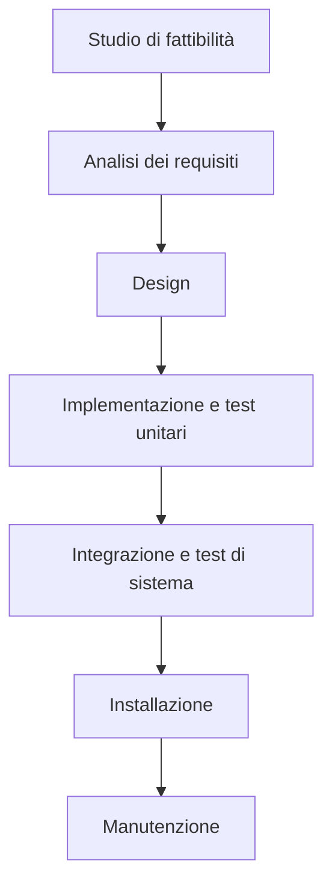
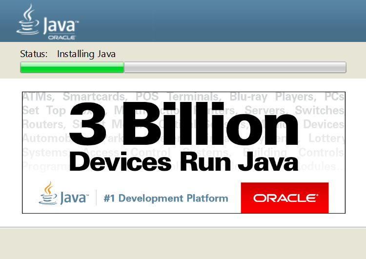
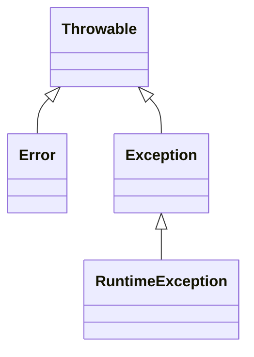
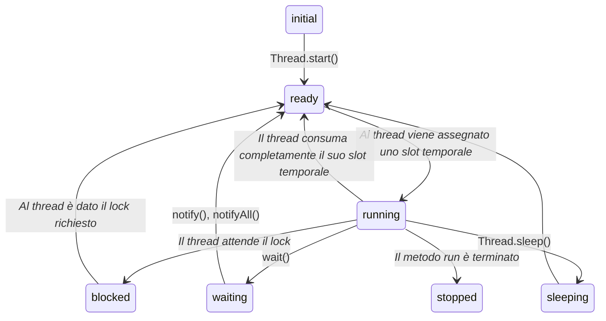
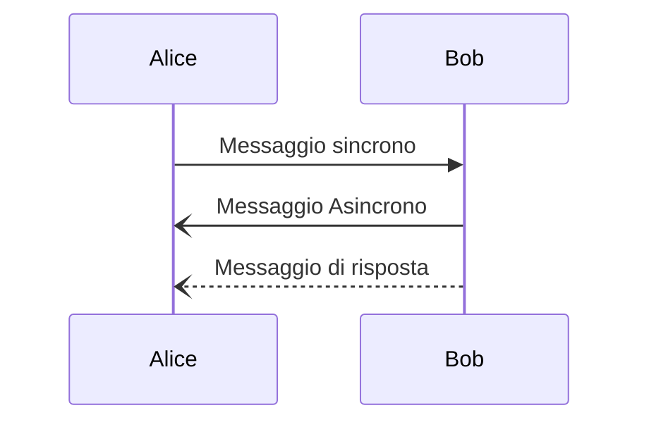
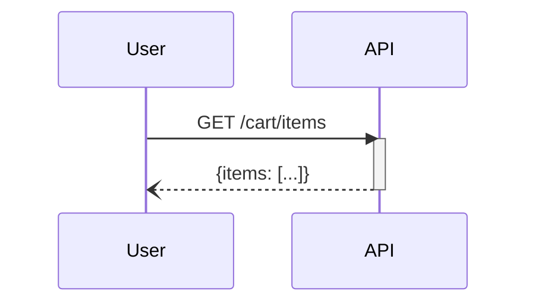
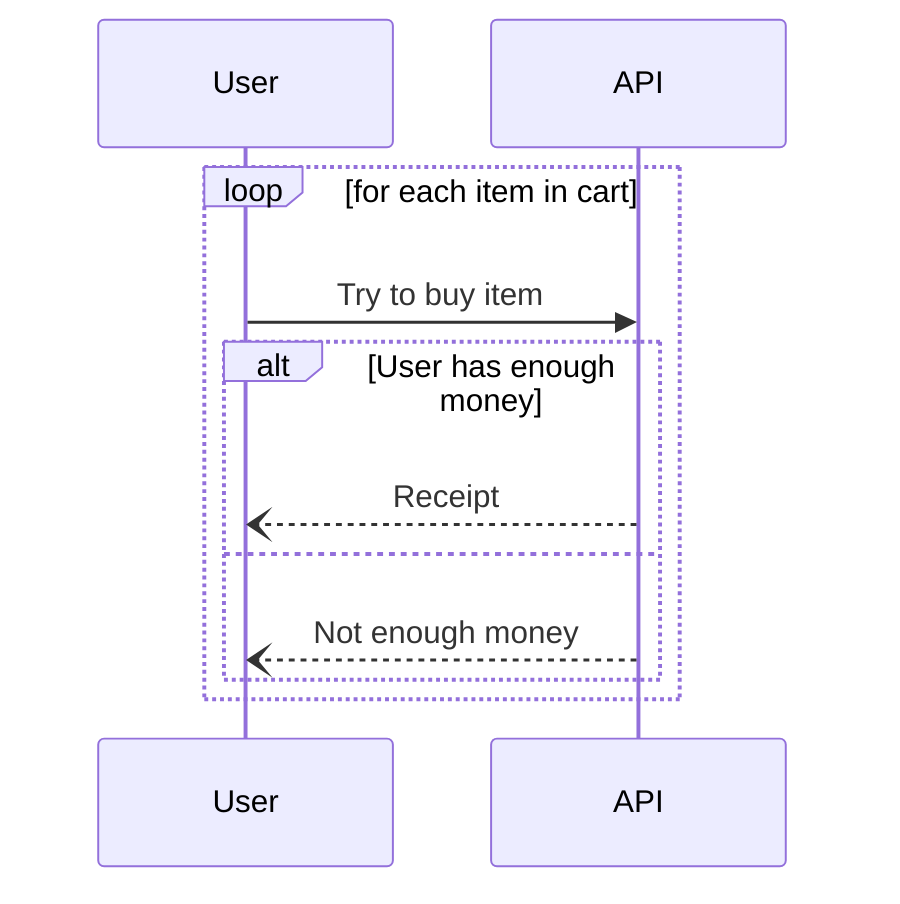
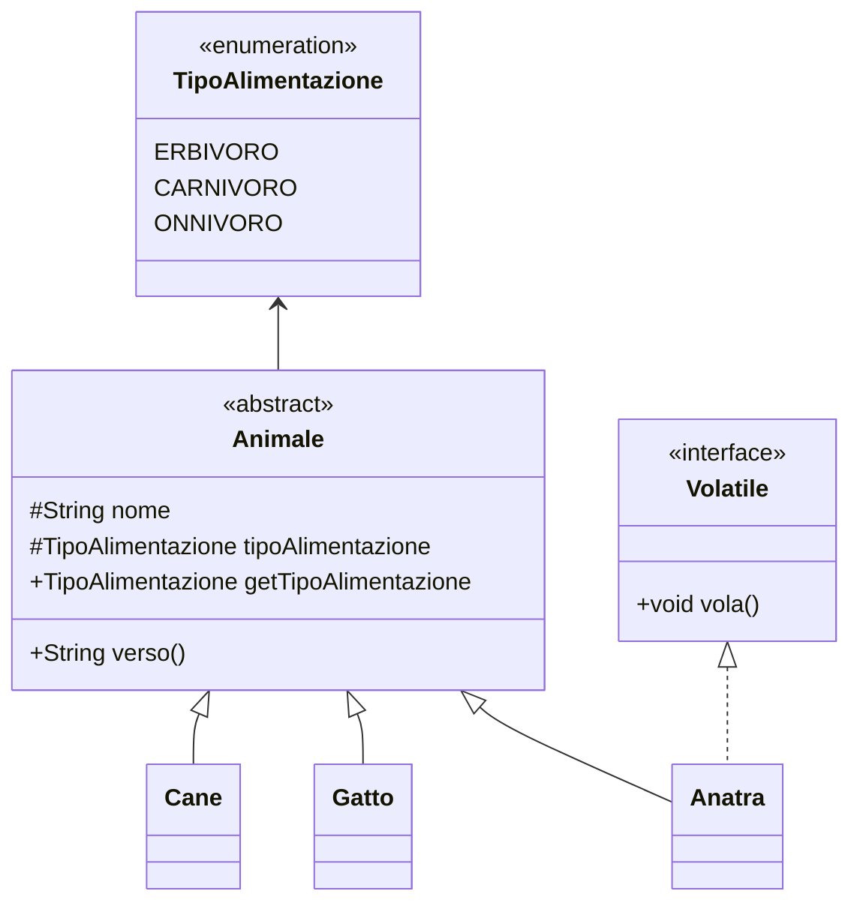
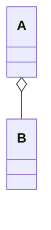
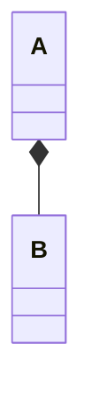

# Ciclo di vita del Software

Lo sviluppo di un software è un processo molto complesso: per semplicità lo si divide in fasi distinte; ciascuna fase prende il risultato della fase precedente, lo elabora e produce un **deliverable** che viene passato alla fase successiva.

Nello schema seguente viene mostrato il funzionamento del **modello a cascata**.



Le varie fasi sono in generale abbastanza autoesplicative, vale la pena però spendere comunque due parole per specificare alcuni dettagli.

Le prime fasi servono per comprendere bene il dominio del progetto per poi produrre il documento di **specifica dei requisiti** che verrà poi tradotto, nelle fasi successive, in moduli software che fanno quanto richiesto.

La parte di testing è particolarmente delicata in quanto deve verificare che il prodotto finito sia conforme _per filo e per segno_ a quanto richiesto dal committente. Per ulteriori dettagli, vedere il [paragrafo sul collaudo](#collaudo).

Negli anni si è scoperto che la principale criticità del modello a cascata è il fatto che se si rileva un **difetto** (sia esso un errore nelle specifiche o un cambiamento di piani), bisogna tornare indietro alle prime fasi, aggiustare quanto necessario per poi proseguire.

E' evidente come questo possa portare a notevoli ritardi (con conseguente dispendio di soldi ed energie).

E' per sopperire a tale criticità che si è diffusa la **metodologia Agile** (che comprende, tra le altre, le metodologie **SCRUM**, **eXtreme Programming** e **DevOps**).

Ulteriori informazioni riguardo i principi della metodologia Agile si possono trovare consultando il [manifesto della metodologia Agile](https://agilemanifesto.org/iso/it/manifesto.html).

Chi segue la metodologia SCRUM suddivide il lavoro in **sprint lunghi** e **sprint giornalieri**: all'inizio di ogni sprint vi è una riunione tra i vari partecipanti al progetto che si confrontano sui progressi e sulle criticità rilevate e decidono le attività per lo sprint successivo.

Ciascuno sprint contiene una fase di design, una fase di implementazione ed un fase di [collaudo](#collaudo).

La filosofia dietro Agile è quella di voler anticipare il cambiamento ed i problemi, non assumendo che tutto ciò che è stato fatto sia perfetto: dato che i vari sprint sono abbastanza brevi, se risulta necessario apportare cambiamenti a quanto già prodotto, il tempo necessario è di gran lunga inferiore rispetto al modello a cascata.

E' stato dimostrato sperimentalmente che chi utilizza il modello a cascata ha una probabilità di fallire nel progetto molto più alta rispetto a chi adopera metodologie Agile.

# Java

_Nota: per procedere è fortemente consigliata almeno un'infarinatura sui concetti base di programmazione quali "funzione", "variabile" e simili._

[Java](https://www.java.com/it/) è un linguaggio di programmazione ad oggetti, onnipresente da decenni nei posti più disparati.



Nel mondo videoludico, l'esempio probabilmente più famoso di gioco scritto in Java è [Minecraft](https://www.minecraft.net/it-it) ma anche molti dei giochi per i vecchi telefoni precedenti agli smartphone (il nome [Gameloft](https://en.wikipedia.org/wiki/Gameloft) non suona familiare?) sono stati scritti in Java. La piattaforma Android, pur non utilizzando la JVM (maggiori dettagli in seguito), viene programmata utilizzando prevalentemente linguaggio Java o derivati. La stragrande maggioranza delle smart card (tra cui anche bancomat e sim) implementa Java Card e, a partire da circa il 2008, la maggioranza dei lettori Blue Ray supporta _BlueRay Disk Java_ per offrire contenuti interattivi all'utente.


Se ancora la motivazione ad imparare Java non fosse sufficiente, si prenda atto del fatto che, alla fine di questa sezione, sarà possibile comprendere quasi completamente [questo magnifico capolavoro](https://www.youtube.com/watch?v=yup8gIXxWDU).

E' stato accennato al fatto che Java è un linguaggio ad oggetti: ciò significa che la logica del programma è costruita attorno alla manipolazione dello stato degli oggetti. Gli esempi chiariranno questa definizione.

Un programma in Java non viene compilato direttamente nel linguaggio macchina nativo della macchina su cui gira il compilatore ma in java bytecode (un linguaggio intermedio indipendente dall'architettura della macchina host) che poi viene interpretato dalla JVM (Java Virtual Machine).

Questo rende possibile l'esecuzione di programmi scritti in java su qualsiasi architettura, a patto che su tale architettura sia stato eseguito il _porting_ della JVM (i più coraggiosi possono trovare ulteriori informazioni [qui](https://zserge.com/posts/jvm/) e [qui](https://docs.oracle.com/javase/specs/jvms/se8/html/)).

## Programmazione ad oggetti

La programmazione ad oggetti si basa, appunto, su oggetti. Un oggetto è descritto dal suo stato e dai suoi metodi, ciascun metodo può modificare lo stato dell'oggetto od estrarre da esso informazioni.

Un oggetto (o classe) può essere istanziato molteplici volte, ottenendo molteplici istanze dello stesso oggetto, ciascuna con il proprio stato.

Nell'esempio successivo viene mostrato come definire una classe e come crearne un'istanza.

```java
public class Program {
    public static void main(String[] args) {
        Square s = new Square(3.0);

        System.out.println(s.getSide()) // 3.0
        s.setSide(4.0);
        System.out.println(s.getArea()) // 16.0
    }
}

class Square {
    // Lo stato del quadrato è composto da una sola variabile di tipo double
    private double side;

    // Questo è il costruttore delle istanze di `Square`
    public Square(double side) {
        // `this` è una reference all'istanza sul quale è chiamato il metodo
        // Si usa il punto ('.') per accedere a variabili e metodi di un oggetto
        // In caso di omonimia tra variabili, si prende la variabile più "interna"
        this.side = side;
    }

    // Questo metodo va a modificare lo stato del quadrato
    public void setSide(double side) {
        this.side = side;
    }

    // Questo metodo è detto "observer" in quanto estrare delle informazioni dallo stato del quadrato (in questo caso, il lato) e le restituisce al chiamante
    public double getSide() {
        return this.side;
    }

    // questo è anche un observer ma non restituisce lo stato in sè per se, bensì un'informazione derivata
    public double getArea() {
        return this.side * this.side;
    }
}
```

Tranne casi speciali, in Java, il metodo `main` deve essere contenuta in una `public class` con lo stesso nome del file in cui è contenuta.
Il metodo `main` prende come parametro un array di stringhe (denotato come `String[]` e, solitamente, chiamato `args`) che contiene tutti i parametri passati da linea di comando.

Il vantaggio dell'utilizzo di una classe per memorizzare quadrati è dato dal fatto che se, per qualche motivo, fosse necessario cambiarne l'implementazione, fintanto che `getSide()` continua a restituire il lato e `getArea()` continua a restituire l'area, non è necessario andare a modificare tutte le chiamate a tali metodi.

Tutti i metodi di una classe accessibili dall'esterno sono detti **interfaccia** della classe (da non confondersi con le `interface` di Java che sono spiegate [in questo paragrafo](#interfacce)): l'interfaccia serve per astrarre l'utilizzo di un oggetto dalla sua implementazione.

Nell'implementazione della classe `Square` è presente un costruttore che inizializza l'istanza (in questo caso inizializza il valore di `side`): se non è presente un costruttore, viene aggiunto automaticamente un costruttore di default che non prende alcun parametro e che inizializza tutti i campi dello stato coi propri valori di default.

### Visibilità

Una classe può contenere al suo interno variabili, metodi e definizioni di altre classi ed enumerazioni. Ciascuna di queste può assumere quattro gradi diversi di visibilità:

| Visibilità          | Spiegazione                                                                                                                                                       |
| ------------------- | ----------------------------------------------------------------------------------------------------------------------------------------------------------------- |
| `private`           | L'attributo è accessibile solo dall'interno della classe stessa.                                                                                                  |
| `protected`         | L'attributo è accessibile solo dall'interno della classe stessa e dai suoi eredi.                                                                                 |
| `<non specificato>` | L'attributo è accessibile ovunque ma solo all'interno dello stesso package (che è un modo di organizzare varie parti del codice, si pensi ai `namespace` in c++). |
| `public`            | L'attributo è visibile ovunque.                                                                                                                                   |

Per questioni di sicurezza e ordine nel codice, è fortemente consigliato utilizzare la visibilità più ristretta possibile (_information hiding_).

`private` e `protected` si riferiscono alla classe, non alla singola istanza, ne consegue che un'istanza di un oggetto può accedere agli attributi privati e protetti delle altre istanze di quello stesso oggetto.

Se un costruttore è `private` allora l'oggetto non può essere istanziato dall'esterno con quel costruttore (si vedrà [in seguito](#overloading) che un oggetto può avere più costruttori): in questo caso altri costruttori della stessa classe, se necessario, potranno utilizzare il costruttore privato per l'inizializzazione dell'oggetto.
Se un costruttore è `protected` allora può essere chiamato solo da classi _figlie_ (si vedranno [in seguito](#ereditarietà)).

Su [StackOverflow](https://stackoverflow.com/a/2816139/9173871) è possibile trovare un'ottima spiegazione riguardo gli utilizzi dei costruttori privati.

### Variabili statiche

Una variabile è dichiarata `static` se è relativa alla classe (e quindi condivisa tra tutte le istanze) e non alla singola istanza.

```java
public class Program {
    public static void main(String[] args) {
        ContaIstanze a, b, c;

        a = new ContaIstanze();
        System.out.println(a.getNumeroIstanza()) // 0
        b = new ContaIstanze();
        System.out.println(b.getNumeroIstanza() + " " + b.getProssimoNumeroIstanza()) // 1 2
        c = new ContaIstanze();
        System.out.println(a.getNumeroIstanza() + " " + b.getNumeroIstanza() + " " + c.getNumeroIstanza()) // 0 1 2
        system.out.println(a.getProssimoNumeroIstanza() + " " + b.getProssimoNumeroIstanza() + " " + c.getProssimoNumeroIstanza()) // 3 3 3
    }
}

class ContaIstanze {
    private static int numero_seriale = 0;
    private int numero_istanza

    public ContaIstanze() {
        this.numero_istanza = numero_seriale;
        numero_seriale++;
    }

    public int getNumeroIstanza() {
        return this.numero_istanza;
    }

    public static int getProssimoNumeroIstanza() {
        return numero_seriale;
    }
}
```

Logicamente, non è possibile accedere a variabili non statiche da contesti statici.

### Aliasing

Quando si memorizza un'istanza di oggetto in Java, non si sta memorizzando l'oggetto in se per se ma un riferimento ad esso.
Da ciò segue che nel seguente codice

```java
Object o1 = new Object();
Object o2 = o1;

System.out.println(o1 == o2); // true
```

le variabili `o1` e `o2` non sono due copie dello stesso oggetto ma sono proprio lo stesso oggetto: si può scegliere di usare arbitrariamente una delle due variabili.

### Ereditarietà

Una classe `B` **eredita** da (oppure **estende**) un'altra classe `A` se viene dichiarata come

```java
class B extends A {...}
```

Questo vuol dire che qualunque istanza di `B` è anche istanza di `A` (ma non viceversa), dunque ha accesso a tutti i metodi e attributi non privati di `A`.
Di conseguenza lo stato di `B` è composto dallo stato di `A` ed, eventualmente, anche da altre variabili.

Nelle classi _figlie_ si usa `super` per riferirsi alla classe _padre_.

Una classe può essere estesa da molteplici classi.

Il seguente codice definisce le classi `Cane` e `Gatto` estendendo `AnimaleDomestico`.
Tale classe è responsabile del conteggio dei pasti delle bestiole.
Si vedrà come non è necessario scrivere due volte la logica che gestisce il conteggio dei pasti in quando sia `Cane` che `Gatto` la erediteranno da `AnimaleDomestico`.

```java
public class Program {
    public static void main(String[] args) {
        // La seguente istruzione sarebbe errata in quanto il costruttore di `AnimaleDomestico` non è accessibile da qui
        // AnimaleDomestico ad = new AnimaleDomestico("Gino");

        Gatto pino = new Gatto("Pino");

        pino.mangia();
        pino.mangia();
        System.out.println(pino.getNumeroPasti())
    }
}

class AnimaleDomestico {
    private String nome;
    private int numero_pasti;

    // Costruttore protected in modo da non poter istanziare un animale domestico generico
    protected AnimaleDomestico(String nome) {
        this.nome = nome;
        this.numero_pasti = 0;
    }

    protected void mangia() {
        this.numero_pasti++:
    }

    // Questi metidi sono dichiarati final per vietare la sovrascrittura da parte di classi figlie
    public final String getNome() {
        return nome;
    }

    public final int getNumeroPasti() {
        return this.numero_pasti;
    }
}

class Cane extends AnimaleDomestico {
    public Cane(String nome) {
        super(nome); // Inizializza il cane col costruttore di `AnimaleDomestico`
        // Dopo aver inizializzato la parte 'AnimaleDomestico' del cane, è possibile compiere altre azioni
    }

    // Sovrascriviamo il comportamento di `mangia()` per la classe `Cane`
    @Override
    public void mangia() {
        super.mangia(); // Chiama la logica di `mangia()` definita nel padre
        System.out.println("Woff Woff");
    }
}

// La classe `Gatto` si comporta esattamente come `Cane`
class Gatto extends AnimaleDomestico {
    public Gatto(String nome) {
        super(nome);
    }

    @Override
    public void mangia() {
        super.mangia();
        System.out.println("Miao Miao");
    }
}
```

Il vantaggio di poter estendere classi a piacimento è che è possibile creare uno scheletro generico che poi può essere specializzato secondo necessità.

Si supponga di aggiungere all'esempio precedente la seguente classe:

```java
class Veterinario {
    public void visita(AnimaleDomestico animale) {
        // Il seguente blocco condizionale è un anti-pattern, ovvero implementa una logica che può essere implementata in maniera più estendibile, leggibile e/o efficente in altro modo (si vedrà più avanti) ed è quindi per puro scopo dimostrativo
        if(animale instanceof Cane) {
            System.out.println("Visito il cane...");
        } else if(animale instanceof Gatto) {
            System.out.println("Visito il gatto...");
        }
    }
}
```

Dato che sia `Cane` che `Gatto` estendono `AnimaleDomestico` allora qualsiasi metodo che accetta come paramero un `AnimaleDomestico` accetterà anche una qualsiasi istanza di `Cane` o `Gatto`:

```java
Cane c = new Cane("Mino");
Gatto g = new Gatto("Rino");

Veterinario vet = new Veterinario();

vet.visita(c); // Visito il cane...
vet.visita(g); // Visito il gatto...
```

In Java, tutte le classi che non estendono nessuna classe, in realtà, estendono implicitamente una classe generica denominata `Object` che contiene tutti i metodi presenti di default all'interno di ogni classe.
Per ulteriori informazioni è possibile consultare la [documentazione](https://docs.oracle.com/javase/8/docs/api/java/lang/Object.html) di `Object`.

Ciascuna classe eredita sempre e solo da un'altra classe (eventualmente `Object`).

Se si vuole fare in modo che non sia possibile estendere ulteriormente una classe è possibile dichiararla come `final`.

### Classi astratte

Una **classe astratta** descrive una classe non istanziabile ma estendibile.

Una classe astratta può contenere **metodi astratti**, ovvero metodi senza corpo che devono essere obblicagoriamente sovrascritti da eventuali sottoclassi non astratte.

Nell'esempio seguente, viene dichiarata una classe astratta atta a descrivere una figura geometrica colorata generica. Tale classe verrà poi estesa, ottenendo una classe che descrive un rettangolo.

```java
abstract class FiguraGeometrica {
    private final Color colore;

    protected FiguraGeometrica(Color colore) {
        this.colore = colore;
    }

    public abstract double getArea();
    public abstract double getPerimetro();
}

class Rettangolo extends FiguraGeometrica {
    private double larghezza;
    private double altezza;

    public Rettangolo(Color colore, double larghezza, double altezza) {
        super(colore);
        this.larghezza = larghezza;
        this.altezza = altezza;
    }

    @Override
    public double getArea() {
        return this.larghezza * this.altezza;
    }

    @Override
    public double getPerimetro() {
        return 2 * (this.larghezza + this.altezza);
    }
}
```

### Interfacce

Le interfaccie sono molto simili alle classi astratte, tranne che contiene solo metodi senza corpo e astratti di default.

Le interfacce si dichiarano con `interface` e si utilizzano tramite `implements`. Una classe non astratta che implementa un interfaccia deve per forza implementarne tutti i metodi.

```java
class Veicolo {...}

interface Volante {
    void vola();
}

class Aereo extends Veicolo implements Volante {
    @Override
    public void vola() {...}
}

class Elicottero extends Veicolo implements Volante {
    @Override
    public void vola() {...}
}

class Animale {...}

class Anatra extends Animale implements Volante {
    @Override
    public void vola() {...}
}
```

Un qualunque metodo che richiede un qualcosa in grado di volare (che quindi `implements Volante`) potrà accettare qualsiasi istanza di `Aereo`, `Elicottero` o `Anatra`.

Interfacce che è bene conoscere presenti in Java sono [`Comparable`](#equals-e-compareto), [`Cloneable`](#clone), `Iterable` e `Runnable`.

### Overloading

In java è possibile dichiarare molteplici metodi con lo stesso nome nello stesso scopo purchè essi siano distinguibili da numero e/o tipo dei parametri.
Questo è molto utile per definire comportamenti diversi a seconda del tipo dei parametri mantenendo il codice leggibile e pulito.

```java
class Pacco {...}

class UfficioPostale {
    public invia(Pacco pacco) {...}

    public invia(Pacco[] pacchi) {
        for(Pacco p: pacchi) {
            invia(p);
        }
    }
}
```

L'`UfficioPostale` nell'esempio dispone di due metodi chiamati `invia`: il primo prende come parametro un singolo `Pacco` mentre il secondo ne prende un'array e sfrutta il primo metodo per inviare tutti i pacchi in esso contenuti.

In una classe è anche possibile avere molteplici costruttori:

```java
class InteroVersatile {
    private int valore;

    // E' possibile istanziare la classe passando direttamente un intero...
    public InteroVersatile(int valore) {
        this.valore = valore;
    }

    // ... oppure una stringa che verrà convertita ad intero
    // Il construttore è segnato come `throws NumberFormatEception` in caso si passi una stringa che non rappresenta un numero
    public InteroVersatile(String valore) throws NumberFormatException {
        super(Integer.parseInt(valore));
    }

    public int getValore() {
        return this.valore;
    }
}
```

### Enumerazioni

Un'enumerazione è equivalente ad una classe normale tranne che ha un numero finito di istanze create all'inizio dell'esecuzione.

```java
enum PuntoCardinale {
    // Le istanze esistenti sono dichiarate separate da una virgola (',')
    N, NE, E, SE, S, SO, O, NO;
}
```

Essendo le enumerazioni equivalenti a classi qualunque, esse possono disporre di costruttori e metodi:

```java
enum PuntoCardinale {
    // Nell'esempio precedente, veniva chiamato il costruttore di default
    N("Nord"),
    NE("Nord-est"),
    E("Est"),
    SE("Sud-est"),
    S("Sud"),
    SO("Sud-ovest"),
    O("Ovest"),
    NO("Nord-ovest");

    private String nome_completo;

    public PuntoCardinale(String nome_completo) {
        this.nome_completo = nome_completo;
    }

    public String getNomeCompleto() {
        return this.nome_completo;
    }
}
```

Le enumerazioni vengono utilizzate nel seguente modo:

```java
public class Program {
    public static void main(String[] args) {
        PuntoCardinale dir = PuntoCardinale.NE;

        System.out.println(dir.getNomeCompleto()) // Nord-est
        System.out.println(PuntoCardinale.S == PuntoCardinale.S) // true - da ambo i lati del `==` compare la stessa istanza di `PuntoCardinale`, vedere il paragrafo sull `equals` per ulteriori dettagli
    }
}
```

Di default, un'enumerazione eredita dalla classe `Enum` ([documentazione](https://docs.oracle.com/javase/8/docs/api/java/lang/Enum.html)) dunque dispone, tra gli altri, dei seguenti metodi che può risultare utile conoscere:

- `valueOf(String name)`: restituisce l'istanza dell'enumerazione corrispondente al parametro;
- `name()`: restituisce il nome dell'istanza sul quale il metodo è chiamato (equivalente a `toString()`);
- `values()`: restituisce un array di tutte le istanze della data enumerazione.

<!--
### Casting e binding dinamico

- instanceof
- casting
- autocasting
-->

### Generics

Si immagini di voler modellare un nuovo tipo di struttura dati non presente di default in Java. Idealmente, si vorrebbe fare in modo che tale struttura possa ospitare gati di qualunque tipo, senza doverla reimplementare ogni volta: i generics vengono incontro proprio a questo bisogno.

_Nota: i generics funzionano solo con tipi di dato complessi, pertanto bisognerà utilizzare `Integer` al posto di `int` eccetera._

Uno scheletro molto grezzo della classe che rappresenta la struttura dati di cui prima è il seguente

```java
class StrutturaDati<T> {...}
```

All'interno della definizione di `StrutturaDati` si potrà utilizzare il tipo generico `T` ovunque si debba fare riferimento alla tipologia di oggetti immagazzinati dalla struttura dati (è possibile specificare un numero arbitrario di tipi generici separandoli con delle virgole).

```java
class StrutturaDati<T> {
    private T qualcosa;
    
    public void add(T el) {
        // Codice specifico della struttura dati per aggiungere l'elemento nella struttura dati
    }

    public T getElementoPiuSimpatico() {
        // Codice specifico della struttura dati per trovare e restituire l'elemento più simpatico
    }
}
```

Si supponga che, per esigenze della struttura dati, sia necessario poter avere accesso al metodo `compareTo` (ulteriori dettagli [in seguito](#equals-e-compareto)): ciò significa che la struttura dati può ospitare solamente istanze di oggetti che sono confrontabili con loro stessi.

```java
class StrutturaDati<T extends Comparable<T>> {...}
```

In questo modo si ha obbligato la struttura dati a poter accogliere solamente oggetti che implementano `Comparable<T>` dove `T` è il tipo ospitato dalla struttura dati.

Di seguito una carrellata di definizioni che illustrano le potenzialità dei tipi generici

| Tipo Generico              | Significato                                                                                                                                                    |
| -------------------------- | -------------------------------------------------------------------------------------------------------------------------------------------------------------- |
| `<T>`                      | Qualsiasi oggetto di tipo `T` o che eredita da ``T`                                                                                                            |
| `<T extends U>`            | Qualsiasi oggetto che eredita da o estende `T`                                                                                                                 |
| `<T extends U & V>`        | Qualsiasi oggetto che eredita da o estende contemporaneamente sia `U` che `V` (se una tra `U` e `V` è una classe, allora deve comparire in prima posizione)    |
| `<T super U>`              | Qualsiasi oggetto di un tipo da cui `U` eredita                                                                                                                |
| `<?>`                      | Qualsiasi oggetto                                                                                                                                              |
| `<? extends Object>`       | Equivalente a `<?>`                                                                                                                                            |
| `<? extends U>`            | Oggetto di tipo qualsiasi, a patto che erediti da o implementi `U`                                                                                             |
| `<? super U>`              | Oggetto di tipo qualsiasi, a patto che sia di un tipo da cui `U` eredita                                                                                       |
| `<T extends I<T>>`         | Oggetto di tipo `T` che eredita da o estende `I` che prende come tipo generico `T` stesso                                                                      |
| `<T extends I<? super T>>` | Oggetto di tipo `T` che eredita da o estende `I` che prende come tipo generico un oggetto di tipo qualsiasi, a patto che sia un tipo da cui `T` stesso eredita |

Si usa `?` quando il tipo utilizzato nella definizione non ha importanza e non deve essere utilizzato nell'implementazione.

Non c'è limite al numero di tipi generici utilizzati e alla complessità delle loro definizioni: cose come `<T estends U, S super V>` sono ammesse.

Si può trovare un esempio dell'utilizzo del generico riportato nell'ultima riga della tabella precedente nella [documentazione di `List.sort`](https://docs.oracle.com/javase/8/docs/api/java/util/Collections.html#sort-java.util.List-).

Se non è necessario genericizzare l'intera classe, è possibile genericizzare qualsiasi metodo o variabile indipendentemente:

```java
class StrutturaDati<T> {
    public <R extends T, S super V> R metodo(S param) {...}
}
```

Potrebbe venir da pensare che tipi di oggetti quali `List<String>` estendano, oltre che a `Object` anche `List<Object>`: questo non è assolutemente vero.

### Eccezioni

La gestione degli errori in Java avviene attraverso le eccezioni. Un'eccezione è lanciata quando vi è un errore di qualche genere (ad esempio, quando si tenta di aprire un file che non esiste).


Si supponga di avere un metodo che potrebbe lanciare un eccezione:

```java
int intFromString(String s) {
    return Integer.parseInt(s);
}
```

Il metodo `parseInt` lancia un'eccezione di tipo `NumberFormatException` se la stringa in ingresso non rappresenta un intero valido e dunque Java obbliga lo sviluppatore a gestire tale eventualità:

```java
int intFromString(String s) {
    try {
        return Integer.parseInt(s);
    } catch(NumberFormatException e) {
        System.err.println("Errore: " + e);
        return -1;
    }
}
```

Pur avendo una soluzione che gestisce correttamente l'eccezione, il chiamante non ha modo di capire se il valore restituito è `-1` a causa di un errore oppure se è perchè ha chiamato il metodo con proprio `"-1"`.

La cosa migliore è delegare la gestione dell'errore al chiamante dichiarando il metodo come `throws NumberFormatException`:

```java
int intFromString(String s) throws NumberFormatException {
    return Integer.parseInt(s);
}
```

In questo modo il chiamante è obbligato a gestire a sua volta l'eccezione (scegliendo se utilizzare un blocco `try-catch` oppure se delegare a sua volta).

E' possibile concatenare molteplici `catch`: quando si verifica un'eccezione, il blocco più in alto che corrisponde a tale eccezione sarà quello scelto per gestirla (pertanto è consigliato gestire le eccezioni dalla più specifica alla più generica).

```java
try {...}
catch(ExceptionType1 e) {...}
catch(ExceptionType2 e) {...}
catch(ExceptionType3 e) {...}
```

Alla fine di una serie di `catch` è possibile inserire un blocco `finally` che verrà eseguito indipendentemente dal fatto che vi siano state eccezioni o meno.
Questo blocco è utile per liberare eventuali risorse aperte in blocchi `try` che sono stati interrotti da un'eccezione:

```java
Socket s;
try {
    s = new Socket("127.0.0.1", 3000);
    s.getOutputStream().write(42);
} catch(IOException e) {
    System.err.println(e);
} catch(Exception e) {
    System.err.println(e);
} finally {
    s.close();
}
```

Se ci si dimentica di chiudere la socket dopo l'errore, è possibile che rimanga allocata in memoria indefinitamente causando un memory leak di conseguenza è stato inventato il `try-with-resources`:

```java
try(Socket s = new Socket("127.0.0.1", 3000)) {
    s.getOutputStream().write(42);
} catch(IOException e) {
    System.err.println(e);
} catch(Exception e) {
    System.err.println(e);
}
```

Così facendo, se gli oggetti istanziati implementano l'interfaccia `AutoCloseable` possono essere istanziati in un `try-with-resources` e verranno automaticamente chiusi alla fine.

E' possibile concatenare molteplici istruzioni che istanziano risorse separandole con un punto e virgola (';').

Per lanciare eccezioni a mano si usa `raise new ExceptionType(...)`.

In Java, tutte le eccezioni ereditano da `Error`, `Exception` o `RuntimeException`:



_Questo è un diagramma UML e serve a schematizzare le specifiche e le interazioni tra le varie classi di un programma Java, verrà spiegato in seguito._

_Nel diagramma precedente sono state riportate le sole classi di interesse senza le proprie variabili e metodi._

Tutte le eccezioni che ereditano direttamente da `Exception` devono essere obbligatoriamente gestite o delegate mentre quelle che ereditano direttamente da `RuntimeException` no (ma è fortemente consigliato gestirle/delegarle in ogni caso per ulteriore sicurezza).

La tipologia `Error` viene utilizzata per errori quali stack overflow o memoria esaurita e deve obbligatoriamente causare la terminazione del programma. Il suo utilizzo è sconsigliato.

Qualora le eccezioni esistenti non siano adatte per essere utilizzate, è possibile creare delle eccezioni personalizzate estendendo una delle classi di cui sopra:

```java
class NuovaEccezione extends Exception {
    public NuovaEccezione() {
        super();
    }
}
```

Se viene lanciata un'eccezione vuol dire che qualcosa è andato storto e quel qualcosa deve essere in qualche modo sistemato pertanto è fortemente sconsigliato creare blocchi `try-catch` nei quali il blocco `catch` non fa nulla.

### Equals e compareTo

Per confrontare due elementi, in Java, si usa l'operatore `==` che, come in qualsiasi altro linguaggio di programmazione sensato, restituisce `true` se i due elementi sono uguali e `false` altrimenti.

Se `==` è applicato a due istanze di oggetti, dei due oggetti non vengono confrontati gli stati bensì l'indirizzo di riferimento. Ne segue che il confronto tra oggetti risulta `true` se entrambi si riferiscono alla stessa istanza di una classe e `false` altrimenti.

Per permettere il confronto tra due oggetti, è possibile sovrascrivere il metodo `equals` che ogni classe eredita da `Object`:

```java
class Libro {
    private String titolo;
    private String edizione;

    public Libro(String titolo, String edizione) {
        this.titolo = titolo;
        this.edizione = edizione;
    }

    @Override
    boolean equals(Object other) {
        // Se `other` non è un'istanza di `libro` allora è per forza diverso
        if(!(other instanceof Libro)) {
            return false;
        }

        // Indipendentemente dal tipo dell'oggetto, se i due riferimenti coincidono allora sono per forza lo stesso oggetto
        if(this == other) {
            return true;
        }

        // Una volta esclusi i due casi di cui sopra, è possibile procedere al confronto
        // Nell'esempio attuale si considerano due libri equivalenti se hanno lo stesso titolo, indipendentemente dall'edizione
        // Notare che viene utilizzato il metodo `equals` della classe `String` che ritorna `true` se le due stringhe hanno lo stesso contenuto
        return this.titolo.equals(((Libro)other).titolo);
    }
}
```

Nel caso sia necessario implementare una relazione d'ordine tra oggetti (non necessariamente due istanze della stessa classe) bisogna dichiarare tale classe come `implements Comparable<T>` (si vedrà il significato di `<T>` nel paragrafo sui generics): così facendo, si verrà obbligati ad implementare un metodo `int compareTo(T o)` che, per specifica, deve ritornare (a) un numero negativo se `this` viene prima di `o` oppure (b) il numero zero se `this` è equivalente ad `o` oppure (c) un numero positivo se `this` viene dopo di `o`.

Come sempre, un esempio pratico potrà schiarire le idee: si supponga di dover memorizzare una lista di persone e di doverla ordinare per, ad esempio, altezza decrescente.

```java
public class Program {
    public static void main(String[] args) {
        ArrayList<Persona> persone = new ArrayList<>();

        persone.add(new Persona("Gino", 1.70));
        persone.add(new Persona("Pino", 1.60));
        persone.add(new Persona("Mino", 1.80));

        // Questo si può fare perchè `persone` è una lista di oggetti che implementano `Comparable` con loro stessi
        Collections.sort(persone);

        for(Persona p: persone) {
            System.out.println(p.getNome() + ": " + p.getAltezza());    // Mino: 1.80
                                                                        // Gino: 1.70
                                                                        // Pino: 1.60
        }
    }
}

class Persona implements Comparable<Persona> {
    private String nome;
    private float altezza;

    public Persona(String nome, float altezza) {
        this.nome = nome;
        this.altezza = altezza;
    }

    public String getNome() {
        return this.nome;
    }

    public float getAltezza() {
        return this.altezza;
    }

    @Override
    public int compareTo(Persona o) {        
        if(this.altezza < o.altezza) {
            return 1;
        } else if(this.altezza == o.altezza) {
            return 0;
        } else {
            return -1;
        }
    }
}
```

Il vantaggio di avere `Comparable` genericizzato è che è possibile poter disporre di metodi separati per il confronto tra diverte tipologie di oggetti.

### String e toString()

Le stringhe in java sono immutabili.

Qualsiasi oggetto in Java può essere rappresentto in forma testuale grazie al fatto che `Object` dispone di un metodo `toString`.

Di default, la rappresentazione testuale di un oggetto è della forma `NomeClasse@HashCode`, per cambiare ciò basta sovrascrivere il metodo `toString`:

```java
public class Program {
    public static void main(String[] args) {
        Persona marco = new Persona("Marco", 26);

        // La variante di `println` che prende un `Object` come parametro stampa l'output di `toString`
        System.out.println(marco);
    }
}

class Persona {
    private String nome;
    private int eta; // Salvare l'età di una persona invece che la data di nascita dovrebbe essere inserito nella lista di crimini contro l'umanità

    public Persona(String nome, int eta) {
        this.nome = nome;
        this.eta = eta;
    }

    @Override
    public String toString() {
        return "Mi chiamo " + this.nome + " e ho " + this.eta + " anni";
    }
}
```

Le stringhe presenti al compile time in un programma Java sono tutte salvate in un area diversa da dove vengono salvate le stringhe generate a runtime. Questo porta a dei comportamenti apparentementi erronei da parte del programma:

```java
String s1 = "Pippo";                // Presente a compile time
String s2 = "Pippo";                // Per non includere due volte la stessa stringa, `s2` punterà alla stessa istanza di stringa di `s1`
String s3 = new String("Pippo");    // La `"Pippo"` è la stessa delle righe precedenti ma non viene assegnata direttamente a `s3` ma clonata a runtime, pertanto, pur essendo partiti dalla stessa istanza, `s3` sarà un'istanza separata dalle altre due

s1.equals(s2);  // true
s1.equals(s3);  // true
s1 == s2;       // true
s1 == s3;       // false
```

### Clone

Si supponga di dover gestire un sistema bibliotecario memorizzando la lista di libri disponibili. Tale lista, per l'esterno, deve essere di sola lettura:

```java
enum StatoPrestito {DISPONIBILE, PRESTATO};

class Libro {
    private String titolo;
    private StatoPrestito stato_prestito;

    public Libro(String titolo) {
        this.titolo = titolo;
        this.stato_prestito = StatoPrestito.DISPONIBILE;
    }

    public String getTitolo() {
        return this.titolo;
    }

    public StatoPrestito getStatoPrestito() {
        return this.stato_prestito;
    }

    public void setStatoPrestito(StatoPrestito nuovo_stato) {
        this.stato_prestito = nuovo_stato;
    }
}

class SistemaBibliotecario {
    private ArrayList<Libro> libri;

    public SistemaBibliotecario() {
        this.libri = new ArrayList<>();
    }

    public addLibro(Libro l) {
        this.libri.add(l);
    }

    public ArrayList<Libro> getLibri() {
        return this.libri;
    }
}
```

Questo codice presenta due criticità gravi.

In primo luogo è possibile che due istanze diverse di `SistemaBibliotecario` abbiano in memoria la stessa istanza di `Libro`, ottenendo che un libro prestato da uno dei due sistemi compaia come non diponibile anche nell'altro sistema. Questo problema è facilmente risolvibile memorizzando, invece che l'istanza originale del libro, una sua copia: il metodo `addLibro` dovrà dunque essere modificato adeguatamente.

```java
public void addLibro(Libro l) {
    this.libri.add(l.clone());
}
```

dove il metodo `clone` di `Libro` è implementato come segue

```java
public Libro clone() {
    return new Libro(this.titolo);
}
```

In questo modo, ciascun `SistemaBibliotecario` avrà la propria istanza di `Libro` che non potrà interferire con l'operato altrui.

La seconda criticità, forse ancora più grave, è che la lista di libri presente in un `SistemaBibliotecario` non è di sola lettura, pertanto non vi è nulla che impedisca di fare qualcosa come `sistema_bibliotecario.getLibri().clear()` se si vuole generare un po' di caos tra i bibliotecari.

Si potrebbe pensare di restituire allora un [clone](https://docs.oracle.com/javase/8/docs/api/java/util/ArrayList.html#clone--) della lista

```java
public ArrayList<Libro> getLibri() {
    return this.libri.clone();
}
```

Peccato che in tal modo sia ancora possibile fare qualcosa come

```java
sistema_bibliotecario.getLibri().get(42).setStatoPrestito(StatoPrestito.PRESTATO)
```

per far risultare un libro come prestato quando invece non lo è (questo è dato dal fatto che, mentre la lista viene clonata, i riferimenti alle varie istanze di `Libro` al suo interno, invece, sono sempre le stesse).

Questa seconda criticità è più subdola e può essere risolta con una deep-`clone` ovvero una clonazione ricorsiva prima della lista, poi degli oggetti contenuti nella lista, poi degli oggetti referenziati da questi ultimi e così via.

Il metodo corretto è dunque

```java
public ArrayList<Libro> getLibri() {
    ArrayList<Libro> lista = new ArrayList<>();

    for(Libro l: this.libri) {
        lista.add(l.clone());
    }

    return lista;
}
```

Nella deep-`clone`, non è più necessario proseguire con la clonazione ricorsiva quando si vuole clonare un'oggetto che contiene solamente variabili che non sono reference oppure se le reference che ci sono, sono tutte verso oggetti immutabili (come le stringhe).

Per indicare che in un oggetto è disponibile il metodo clone (e, dunque, poterlo utilizzare come parametro dentro metodi che richiedono che un oggetto sia clonabile) si marca la dichiarazione della classe di tale oggetto come `implements Cloneable`.


### Iterabilità

Si supponga di voler iterare su tutti gli oggetti contenuti in una collezione: come già visto, è possibile utilizzare un **enhanced for loop**:

```java
HashSet<Elemento> elementi = new HashSet<>();
for(Elemento el: elementi) {
    System.out.println(el);
}
```

Sia dato il caso in cui è necessario iterare, invece che su una collezione già presente in java, su un tipo di dato qualunque da noi definito: per rendere possibile l'utilizzo dell'enhanced for loop, è necessario che la classe della quale è istanza l'oggetto su cui si vuole iterare implementi l'interfaccia `Iterable`.

Gli oggetti che implementano l'interfaccia `Iterable` dispongono di un metodo `iterator()` che restituisce un oggetto che implementa `Iterator<T>` dove `T` è il tipo di dato memorizzato nella collezione.

Un `Iterator<T>` implementa i metodi `hasNext()` e `next()`.

Nell'esempio seguente viene implementata una classe `PythonRange` sulle cui istanze è possibile iterare in un modo simile a come si fa in Python.

```java
public class Program {
    public static void main(String[] args) {
        for(Integer i: new PythonRange(10)) {
            System.out.println(i); // Tutti i numeri [0, 10)
        }

        for(Integer i: new PythonRange(7, 12)) {
            System.out.println(i); // Tutti i numeri [7, 12)
        }
    }
}

class PythonRange implements Iterable<Integer>{
    private int begin, end;

    public PythonRange(int end) {
        this(0, end);
    }

    public PythonRange(int begin, int end) {
        this.begin = begin;
        this.end = end;
    }

    // Restituisce un'istanza dell'iteratore (ogni iteratore è a se)
    @Override
    public Iterator<Integer> iterator() {
        return new Iterator<Integer>() {
            private int i = begin;

            // Restituisce `true` se è possibile procedere ulteriormente
            @Override
            public boolean hasNext() {
                return i < end;
            }

            // Ritorna l'elemento successivo (lancia un'eccezione se non è possibile farlo)
            @Override
            public Integer next() {
                if(this.hasNext())
                    return (i++);
                else
                    throw new NoSuchElementException();
            }

            // Eventualmente è possibile implementare anche il metodo `remove()` (che rimuove l'elemento dalla collezione) e `forEachRemaining(Consumer<? super E> action)` che esegue un metodo su ciascun elemento sul quale ancora non si ha iterato (vedere il paragrafo sulla programmazione funzionale per ulteriori informazioni).
        };
    }
}
```

### Programmazione funzionale

La programmazione funzionale è un paradigma di programmazione diverso da quello ad oggetti: essa promuove l'espressione della computazione come applicazione di una o più funzioni ai dati invece che una sequenza ordinata di istruzioni.

Tutta la programmazione funzionale in Java si basa sulle cosiddette **interfaccie funzionali** ovvero interfaccie che possiedono un solo metodo.

La programmazione funzionale in Java è **lazy**: questo significa che le varie funzioni applicate ad un dato non vengono applicate realmente finchè non è necessario l'utilizzo del risultato dell'operazione.

Questo tipo di funzionamento porta a due considerazioni alle quali bisogna fare molta attenzione:

- non è detto che una funzione venga applicata sempre a tutti gli elementi contenuti nella struttura dati sotto esame;
- non è garantito l'ordine di esecuzione di una funzione sugli elementi contenuti nella struttura dati sotto esame.

Da questi due punti si può anche capire perchè sia necessario applicare solamente funzioni pure (ovvero senza _side effects_) agli elementi contenuti nella struttura dati: dato che ne l'esecuzione ne l'ordine sono garantiti, diventa impossibile predire il comportamento del programma.

Nonostante ciò, il punto di forza principale di questo paradigma è proprio la mancanza di side-effect delle funzioni: l'utilizzo di funzioni pure comporta una più facile verifica della correttezza e della mancanza di bug del programma e la possibilità di una maggiore ottimizzazione dello stesso in quanto, dato che le funzioni applicate non interferiscono tra di loro, è possibile parallelizzarle senza problemi.

Le varie funzioni vengono applicate attraverso uno stream (che non centra nulla con gli stream tipo quelli di input/output) che si ottiene chiamando `stream()` sulle strutture dati supportate.

E' importante ricordare che le varie funzioni non vengono applicare sulla struttura dati che ha fornito lo stream ma su una sua copia: la struttura dati originale rimarrà intatta. Per ottenere uno stream che parallelizza le applicazioni di funzioni, si chiama `stream().parallel()` sulla struttura dati.

Metodi utili:

- `filter(Predicate<? super T> predicate)`: filtra gli elementi dello stream mantenendo solo quelli che soddisfano il predicato;
- `forEach(Consumer<? super T> action)`: chiama la funzione specificata con ogni elemento dello stream come parametro (questa è l'unica funzione che garantisce l'ordine di esecuzione)
- `map(Function<? super T, ? extends R> mapper)`: restituisce uno stream costituito dal risultato dell'applicazione della funzione ad ogni elemento dello stream originale. Il nuovo stream sarà composto da elementi di tipo `R`;
- `flatMap(Function<? super T, ? extends Stream<? extends R>> mapper)`: utilizza i principi della funzione `map` iterando sugli elementi di uno `stream` e concatenandoli in un solo livello (ad esempio, se chiamando `map` si otterrebbe uno stream di stream, chiamando `flatMap` si otterrebbe uno stream che contiene, ordinatamente, tutti gli elementi contenuti negli stream che si sarebbero ottenuti con la `map`);
- `reduce(T identity, BinaryOperator<T> accumulator)`: esegue una riduzione degli elementi dello stream, utilizzando il valore di identità fornito e una funzione associativa di accumulazione, e restituisce un singolo elemento di tipo T;
- `collect(Collector<? super T, A, R> collector)`: esegue un'operazione di riduzione mutabile sugli elementi dello stream utilizzando `Collector`;
- `distinct()`: rimuove gli elementi duplicati, ritorna uno stream contenente solo elementi distinti;
- `Optional<T> findFirst()`: ritorna il primo elemento dello stream, se esiste;
- `count()`: ritorna il numero di elementi dello stream.

Nella [relativa documentazione](https://docs.oracle.com/javase/8/docs/api/java/util/function/package-summary.html) è possibile trovare tutti i tipi di interfaccia funzionale già presenti in Java. In ogni caso è possibile dichiarare un'interfaccia funzionale personalizzata decorandola con `@FunctionalInterface`.

Esistono classi specializzate come la `IntStream` che fornisce operazioni specializzate su un tipo di dato specifico (in questo caso, `int`).

Come sempre un esempio potrà chiarire molto i concetti presentati.

```java
// Si vuole progettare un programma che calcola l'altezza media di tutte le persone nate in un giorno dispari
ArrayList<Persona> persone = new ArrayList<Persona>();

for(int i = 10; i < 21; i++) {
    persone.add(new Persona(i, 160 + i));
}

persone.stream().parallel()                             // Utilizziamo uno stream parallelo
    .filter(p -> p.getGiorno_di_nascita() % 2 == 0)     // Vengono mantenute solo le persone 
    .mapToInt(p -> p.getAltezza())                      // Di ciascuna persona si prende l'altezza e la si mette in uno stream di interi
    .average()                                          // `IntStream` fornisce, tra le altre, la funzione `average`
    .ifPresentOrElse(System.out::println, () -> {       // Il valore ritornato da `average` è un `Optional`, più dettagli in seguito
        System.out.println("Nessuno è nato in un giorno pari");
    });
```

#### Optional

Il tipo `Optional<T>` si usa per descrivere una variabile che potrebbe, o meno, contenere un dato. Nell'esempio precedente, si è visto il tipo `Optional` ritornato da `average` in quanto, non è garantito che lo stream sul quale è stata chiamata `average` contenga elementi.

L'utilizzo principale di `Optional` è quello di eliminare i problemi dovuti a `null`: applicando una funzione ad un `Optional` verrà restituito un altro `Optional` che conterrà il risultato della funzione applicata al valore del vecchio optional (se pieno), altrimenti un `Optional` vuoto.

In termini prettamente di informatic teorica, `Optional` è una monade. Si rimanda alla relativa [pagina wikipedia](https://en.wikipedia.org/wiki/Monad_(functional_programming)) per ulteriori informazioni.


Di seguito un elenco di metodi da conoscere per l'utilizzo di `Optional<T>`:

- `Optional.of(T value)`: restituisce un `Optional` che contiene `value` (se è `null` lancia una `NullPointerException`);
- `Optional.empty()`: restituisce un `Optional` vuoto;
- `Optional.ofNullable(T value)` restituisce un `Optional` eventualmente vuoto;
- `isPresent()` restituisce un booleano che indica se l'optional contiene qualcosa;
- `ifPresent(Consumer<? super T>)`: se nell'`Optional` è presente un valore allora chiama la funzione passata come parametro passando come parametro il valore contenuto;
- `flatMap(Function<? super T, ? extends Optional<? extends U>> mapper)`: ritorna un `Optional` vuoto se l'`Optional` sul quale è chiamato è vuoto, altrimenti ritorna un `Optional` che contiene il valore restituito dalla funzione passata come parametro chiamata con il valore contenuto nell'`Optional` di partenza come parametro;
- `orElse(T val)`: se l'`Optional` non è vuoto ne ritorna il contenuto, altrimenti ritorna `val`;
- `ifPresentOrElse(Consumer<? super T> action, Runnable emptyAction)`: se l'`Optional` non è vuoto allora chiama `action` passando come parametro il contenuto, altrimenti chiama `emptyAction`.

### Multithreading

Il modo più semplice per creare e lanciare thread in parallelo consiste nell'estendere la classe `Thread`:

```java
public class Program {
    public static void main(String[] args) {
        Thread t = new MyThread();

        t.start(); // Il metodo `start` crea un nuovo thread che esegue il codice contenuto nel metodo `run`
    }
}

class MyThread extends Thread {
    public MyThread() {...}

    @Override
    public void run() {
        // Codice eseguito dal thread
    }
}
```

Un metodo alternativo (utile nel caso in cui la classe che dovrebbe diventare un thread debba estendere altre classi) consiste nel sostituire l'estensione a `Thread` con l'implementazione di `Runnable`:

```java
public class Program {
    public static void main(String[] args) {
        MyRunnable r = new MyRunnable();

        Thread t = new Thread(r); // E' necessario creare il thread partendo dal runnable

        t.start();
    }
}

class MyRunnable implements Runnable {
    public MyRunnable() {...}

    @Override
    public void run() {
        // Codice eseguito dal thread
    }
}
```

Tra le altre cose, è possibile assegnare un nome a ciascun thread e cambiarne la priorità (in breve, la priorità indica quanto tempo viene dedicato a ciascun thread - più è alta la priorità e maggiore sarà la frazione del tempo totale che il thread avrà a disposizione).

Quando si lavora con molteplici thread che accedono agli stessi dati, è bene prestare attenzione a creare un meccanismo di mutua esclusione robusto, altrimenti si rischia di trovare dati sfalsati.

Si supponga di avere due thread che devono entrambi incrementare una stessa variabile: se il primo viene interrotto, dopo la lettura del valore ma prima della scrittura, dal secondo che, invece, riesce a terminare il suo incremento prima di venir interrotto a sua volta dal primo, il quale poi prosegue salvando il risultato incrementato, il lavoro del secondo thread verrebbe sovrascritto dalla scrittura tardiva da parte del primo (ottenendo così una variabile incrementata una singola volta invece delle due previste).

```java
public class Program {
    private static int x = 0;
    
	public static void main(String[] args) {
		new Thread(() -> {x++;}).start();
		new Thread(() -> {x++;}).start();

		System.out.println(x);
	}
}
```

Ci si aspetterebbe di ricevere "2" come output ma, come si potrà notare eseguendo il codice molteplici volte, alcune volte l'output sarà diverso.

Di seguito verranno illustrate le principali soluzioni che java mette a disposizione per prevenire questo titpo di problemi.

#### Synchronized

La keyword `synchronized` si usa applicata ad interi metodi o a singole porzioni di codice che devono essere eseguite in maniera atomica e in mutua esclusione tra loro.

`synchronized` funziona specificando l'oggetto sul quale si vuole sincronizzarsi (eventualmente, `this`): due thread che eseguono blocchi di codice sincronizzati su oggetti diversi non avranno problemi mentre se due thread eseguono blocchi di codice sincronizzati sullo stesso oggetto, uno solo dei due avrà il via libera e l'altro dovrà attendere che il primo abbia finito.

E' possibile sincronizzare blocchi di codice solamente su oggetti e non tipi su tipi di dati elementari.

```java
class ClasseConSincronizzazioni {
    // Le sincronizzazioni di `metodo1` e `metodo 2` sono equivalenti
    public void metodo1() {
        synchronized(this) {...}
    }

    public synchronized void metodo2() {...}

    // Se si vuole sincronizzare su una variabile semplice, si istanzia un `Object` e si usa quello
    
    private int variabile_semplice;
    private Object lock_variabile_semplice = new Object();
    public void metodo3() {
        synchronized(lock_variabile_semplice) {...}
    }
}
```

Per motivi legati alla cache coherence, anche i blocchi nella quale una variabile _condivisa_ è utilizzata in sola lettura vanno sincronizzati.

La keyword `synchronized` applicata ad un metodo non viene passata alle sottoclassi per ereditarietà pertanto si dovrà specificarla ogni volta ove necessario.

Se non si presta sufficiente attenzione, è possibile causare dei deadlock:

```java
class Deadlocked {
    private Object lock1 = new Object();
    private Object lock2 = new Object();
    
    public void metodo1() {
        synchronized(lock1) {
            synchronized(lock2) {...}
        }
    }

    public void metodo2() {
        synchronized(lock2) {
            synchronized(lock1) {...}
        }
    }
}
```

Si supponga di avere due thread che, sulla stessa istanza di `Deadlocked` chiamano uno `metodo1` e l'altro `metodo2`.
In questa situazione è probabile che si verifichi un cosiddetto **deadlock** in quanto, se entrambi i thread riscono a prendere il lock, rispettivamente, su `lock1` e `lock2`, allora nessuno dei due potrà procedere ulteriormente e rilsciare il lock finchè l'altro non termina.

#### Wait e notify

Si consideri il classico caso di produttore/consumatore dove un thread si occupa di produrre un dato mentre un'altro si occupa di utilizzarlo:

```java
class ProduttoreConsumatore<T> {
    private T dato = null;

    public synchronized void deposita(T dato) {
        while(this.dato != null) {
            wait();
        }

        this.dato = dato;

        notifyAll();
    }

    public synchronized T preleva() {
        T dato;

        while(this.dato == null) {
            wait();
        }

        dato  = this.dato;

        notifyAll();

        return dato;
    }
}
```

I metodi protagonisti di questo paragrafo sono 3:
- `wait`: rilascia eventuali lock, mette il thread in attesa di una `notify` sull'oggetto sul quale la `wait` è stata chiamata e poi prosegue; se un lock è stato rilasciato, prima di proseguire attende di poterlo riprendere;
- `notify`: risveglia un thread a caso tra quelli mandati in wait dall'oggetto sul quale il metodo è stata chiamato;
- `notifyAll`: risveglia tutti i thread mandati in wait dall'oggetto sul quale il metodo è stato chiamato.

Dato che `notify` non è deterministica (e quindi potrebbe risvegliare il thread sbagliato), si preferisce utilizzare `notifyAll` per risvegliare tutti i thread e racchiudere la `wait` dentro un `while` per fare in modo che solo il thread giusto possa andare avanti. Per ulteriori informazioni sul meccanismo `wait`/`notify`, consultare la [documentazione](https://docs.oracle.com/javase/8/docs/api/java/lang/Object.html#wait--).

Un thread dispone di uno stato che può mutare a seconda delle condizioni in cui si trova e dei metodi che in esso vengono chiamati. Lo schema seguente mostra gli stati e le transizioni.



Dato che un blocco `synchronized` non impedisce al thread di essere interrotto, è possibile che vi sia dell'inconsistenza anche quando un metodo è correttamente sincronizzato. Per risolvere tale problema si utilizzano i cosiddetti **oggetti immutabili**.
Un oggetto immutabile è un istanza di una classe che non ammette in alcun modo modifiche allo stato (nella pratica, questo si realizza non includendo metodi in grado di modificare lo stato).

### Multithreading avanzato

#### La classe `ReentrantLock`

Per evitare problemi di deadlock, è possibile utilizzare la classe `ReentrantLock`. Questa classe, permette di prendere e rilasciare lock in modo non bloccante in modo da poter controllare se il lock sia stato preso con successo.

```java
public class ClasseConLockCorretti {
    private Lock lock1, lock2;

    public ClasseConLockCorretti() {
        lock1 = new ReentrantLock();
        lock2 = new ReentrantLock();
    }

    public void metodo() {
        // Si tenta di prendere ciascun lock in maniera non bloccante e ci si segna se l'operazione ha avuto successo
        boolean gotFirstLock = lock1.tryLock();
        boolean gotSecondLock = locl2.tryLock();

        // Se entrambi i lock sono stati presi, allora si può procedere
        if(gotFirstLock && gotSecondLock) {
            try {
                // Codice che richiede entrambi i lock
            } finally {

                // E' necessario sbloccare i lock manualmente
                if(gotFirstLock)
                    lock1.unlock();
                
                if(gotSecondLock)
                    lock2.unlock();
             
                // Si usa un `finally` per garantire che, qualunque cosa succeda, i lock vengano sbloccati
            }
        }
    }
}
```

#### Esecutori

Nel caso in cui si debba gestire una grande quantità di thread, l'overghead che si paga ad ogni context switch non è più trascurabile rispeto al tempo di esecuzione effettivo.
Per risolvere questo problema, si utilizzano gli esecutori, dei quali ne esistono di svariati tipi.

La factory `Executors.newSingleThreadExecutor()` si usa per creare un esecutore che esegue un numero arbitrario di `Runnable` in modo sequenziale, tutti su un singolo thread.

```java
ExecutorService e = Executors.newSingleThreadExecutor();

// Si aggiungono i vari `Runnable`
e.execute(new Runnable() {...});
e.execute(new Runnable() {...});
e.execute(new Runnable() {...});
e.execute(new Runnable() {...});

// L'`ExecutorService` va spento manualmente quando tutti i `Runnable` hanno terminato
e.shutdown();
```

La factory `Executors.newFixedThreadPool()` si usa per crare un esecutore equivalente all'esecutore precedente ma è possibile specificare quanti thread si suddividono i `Runnable` (che comunque vengono presi dalla coda in ordine e vengono portati a termine).

```java
// Il numero di thread gestiti dall'esecutore è specificato come parametro, in questo caso `3`
ExecutorService e = Executors.newFixedThreadPool(3);
```

La factory `Executors.newVirtualThreadPerTaskExecutor()` si usa per assegnare più thread virtuali ad uno stesso thread fisico, in modo da non incappare in errori dati dalla limitatezza delle risorse della macchina su cui è in esecuzione il programma. Quando uno di questi thread virtuale viene messo in attesa da operazioni di input/output, al suo posto viene messo in esecuzione un altro thread virtuale.

```java
ExecutorService e = Executors.new VirtualThreadPerTaskExecutor();

e.submit(() -> {...});
e.submit(() -> {...});
e.submit(() -> {...});

e.shutdown();
```

#### Tipi di dato atomici

In java sono presenti dei tipi di dato sul quale è possibile eseguire operazioni atomiche senza preoccuparsi di dover sincronizzare tutto correttamente.

Esempi di tipi di dati atomici sono `AtomicInteger`, `BlockingQueue`, `ConcurrentMap`, `AtomicIntegerArray`.
Ciascuna di queste classi si comporta come la rispettiva classe non atomica.

Per ulteriori informazioni è possibile consultare la relativa documentazione.

## JML

**Java Modelling Language** (JML) è un linguaggio di specifica che permette di documentare il comportamento di un modulo software tramite delle opportune annotazioni scritte in un *linguaggio formale*. 

Utilizzare JML consente di poter descrivere in un modo formale i **contratti** dei metodi e di verificarli con un procedimento automatizzato.

Un contratto serve per descrivere le caratteristiche dei dati di input che un metodo necessita per funzionare correttamente e le caratteristiche del valore di ritorno, oltre che alle descrizioni dei cambiamenti dello stato in un oggetto, le eccezioni lanciate e molto altro.

La descrizione base di un contratto di un metodo tramite JML assume la forma seguente

```java
//@ requires (* Precondizione *)
//@ ensures (* Postcondizione normale*)
//@ signals (Exception e) (* Postcondizione eccezionale *)
public int metodo(...) {...}
```

Le varie condizioni in JML si esprimono in logica del prim'ordine: il commento (che viene valutato come sempre vero) si esprime con `(* commento *)`.

La precondizione è una condizione che deve essere rispettata per poter chimare il metodo: tale condizione può essere espressa in funzione dei parametri passati al metodo o allo stato dell'oggetto sul quale il metodo è chiamato.

La postcondizione normale è una condizione che è garantita vera al termine dell'esecuzione del metodo al quale si riferisce: tale condizione può essere espressa in funzione dei parametri passati al metodo, allo stato dell'oggetto sul quale il metodo è chiamato o al valore di ritorno del metodo.

La postcondizione eccezionale, oltra d indicare il tipo di eccezione lanciata, è una condizione che è vera quando l'eccezione specificata viene lanciata: tale condizione può essere espressa in funzione dei parametri passati al metodo, dello stato dell'oggetto sul quale il metodo è stato chiamato o dell'eccezione lanciata. E' possibile specificare molteplici `//@ signals` con eccezioni e condizioni differenti.

La filosofia dell'utilizzo dei contratti si può riassumere come "Se il chiamante garantisce che i requisiti (_requires_) sono soddisfatti allora il chiamato garantisce (_ensures_) che il risultato sia corretto".

Le condizioni in JML devono essere pure e possono fare utilizzo solamente di metodi puri.

Segue carrellata di esempi di utilizzo di JML per poterne illustrare i vari costrutti (congiunzione, disgiunzione e negazione di condizioni, così come relazioni d'ordine e di (dis)uguaglianza, operatore `[]` e chiamate a funzioni non vengono riportate in quanto si scrivono esattamente come in Java).

| Costrutto                                  | Significato                                                                                                         |
| ------------------------------------------ | ------------------------------------------------------------------------------------------------------------------- |
| `\result > 0`                              | Il valore ritornato dalla funzione                                                                                  |
| `a ==> b`, `b <== a`                       | `a` implica `b`                                                                                                     |
| `a <==> b`                                 | `a` se e solo se `b`                                                                                                |
| `a <=!=> b`                                | `a` se e solo se `!b`                                                                                               |
| `\old(a)`                                  | Il valore di `a` prima dell'invocazione del metodo                                                                  |
| `\not_modified(a, b, ...)`                 | Il valore degli oggetti passati come parametro non cambia                                                           |
| `\not_modified(a.*)`                       | Lo stato dell'oggetto `a` non è modificato                                                                          |
| `(\forall variabile, dominio, condizione)` | `true` se `condizione` è vera per tutte le `variabile` nel `dominio`                                                |
| `(\exists variabile, dominio, condizione)` | `true` se `condizione` è vera per almeno una `variabile` nel `dominio`                                              |
| `(\num_of variabile, dominio, condizione)` | Il numero di volte che la `condizione` si è verificata per ogni `variabile` nel `dominio`                           |
| `(\sum variabile, dominio, espressione)`   | La somma di `espressione` valutata per ogni `variabile` nel `dominio`. (esistono anche `\product`, `\max` e `\min`) |

Si usa `@ assignable` per identificare quali possono essere gli effetti collaterali della chiamata di un metodo sui suoi parametri:

```java
//@ assignable lista[*]
public static void metodo(int[] lista); // Tutti gli elementi contenuti in lista sono potenzialmente diversi prima e dopo la chiamata

//@ assignable \nothing
public static void metodo(int[] lista); // E' garantita l'assenza di effetti collaterali dovuti al metodo
```

Se la clausola `@ assignable` è omessa, non vi sono garanzie.

E' fortemente consigliato creare dei metodi **totali** ovvero il comportamento del metodo deve essere definito per qualunque ingresso: piuttosto si lancia un'eccezione.

### Tipi di dato astratti

Un **tipo di dato astratto** (ADT) è una struttura dati di cui sono stati specificati solo i possibili valori e le operazioni che è possibile compiere su di essi.
L'utilizzo di ADT fa in modo che il programma dipenda solo dalla specifica e non dall'implementazione del tipo di dato.

Per descrivere la specifica di un ADT si usa, ancora una volta, JML.

Di seguito verrà analizzato cosa specificare e quali sono le regole da seguire (tranne dove diversamente specificato, quando ci si riferisce ad un metodo, ci si sta riferendo ad un metodo non statico di una classe che rappresenta un ADT).

La specifica dei metodi pubblici non può usare metodi privati. Se un metodo è privato, allora non serve specificarlo (anche se non fa mai male farlo) in quanto non fa parte delle operazioni applicabili sull'ADT in questione.

I metodi utilizzati all'interno di una specifica possono chiamare solamente metodi specificati puri. Per specificare un metodo come puro, si usa

```java
public int /*@ pure @*/ metodo() {...}
```

Se un costruttore non fa altro che inizializzare gli attributo dell'istanza allora può essere dichiarato come puro.

I metodi puri sono anche detti **observer** in quanto consentono di osservare le caratteristiche dello stato di un'istanda di ADT.

E' possibile dichiarare `/*@ pure @*/` una classe: in tal caso tutti i metodi sono considerati puri e la classe viene detta **immutabile**.

Dato che non è possibile modificare una classe immutabile, per operarvici sopra si usano i codissetti **producer** ovvero operazioni che restituiscono una nuova istanza della classe immutabile il cui stato è il risultato dell'operazione applicata all'istanza sul quel il metodo è chiamato.

Oltre a producer e observer, esistono anche i metodi **creator** (sono i costruttori delle classi che non sono anche producer e, solitamente, sono puri) e **modifier** (modificano lo stato dell'oggetto sul quale vengono chiamati e non sono mai puri).

Un tipo si dice **adeguato** se è possibile lavorarci agevolmente con tutte le operazioni presenti. Anche nel caso di tipi già adeguati, è sempre buona norma controllare se è possibile migliorarne l'efficienza aggiungendo altre operazioni.

Di un tipo di dato astratto bisogna anche conoscere le caratteristiche che devono sempre essere rispettate dallo stato: per definire queste specifiche si utilizzano i `@ public invariant`.

I `@ public invariant` possono fare uso di tutti i metodi (puri) e gli attributi che hanno visibilità almeno `public`.

Per implementare un ADT, si necessita di un **rep** ovvero di un insieme di tipi di dato (nativi o meno) che vengono utilizzati dall'ADT per memorizzare e organizzare le informazioni che contiene. Solitamente i rep sono mantenuti privati (non si vuole che dall'esterno siano modificabili).

Per descrivere le specifiche di un rep, si usano i `@ private invariant` (che funzionano esattamente come i `@public invariant` ma possono fare uso anche di tutto ciò che è privato).

Si ricorda che la specifica in JML è **completamente slegata** dall'implementazione: è compito del programmatore assicurarsi che la specifica e l'implementazione corrispondano.

<!--
### Socket (si spera)

### GUI (si spera)
-->

## Metriche di qualità del software

Scrivere software di qualità non significa solo scrivere programmi _corretti_ e che rispettano la specifica richiesta, ma anche scrivere codice leggibile, di qualità e facilmente estensibile.

Qualsiasi modulo software dovrebbe essere scritto in modo che sia facilmente estensibile senza che sia necessario modificarlo: si deve seguire il principio di sostituzione di Liskov (LSP) (presentato brevemente nel paragrafo successivo e approfondito [più avanti](#principio-di-sostituzione-di-liskov)).

Tale principio afferma che i metodi delle sottoclassi devono sempre rispettare i metodi che sovrascrivono: questo significa che la precondizione dei metodi della classe figlia devono essere al più stringenti quanto quelle dei metodi sovrascritti mentre le postcondizioni devono essere al più tanto lascive.

Quando si estende una classe aggiungendo un metodo, se tale metodo può essere realizzato sfruttando i metodi già presenti, allora la classe rispetta il LSP.

E' bene non arrivare a troppi livelli di estensioni di classi: è meglio dipendere da astrazioni invece che da classi e metodi concreti.

Esistono alcuni principi da rispettare:
- _Interface Segregation Principle_: meglio spezzare le interfacce in interfacce piccole e specializzate invece che tenerne una grossa generalizzata;
- _Reuse/Release Equivalency Principle_: solo componenti rilasciati e tracciati possono essere riutilizzati nel codice;
- _Acyclic Dependencies Principle_: non ci possono essere cicli tra le dipendenze;
- _Stable Dependencies Principle_: le dipendenze devono essere almeno tanto stabili quanto il modulo che le usa;
- _Stable Abstraction Principle_: più una categoria di classi è stabile e più deve consistede di classi astratte.

Un software di qualità è poco accoppiato (ovvero la quantità di dipendenze tra moduli software è bassa) e molto coeso (tutto ciò che riguarda uno stesso argomento è nello stesso posto).

Esistono delle metriche per misurare numericamente la qualità di ciascuna classe scritta:

- _Weighted Methods per Class_: numero di metodi pesati per la loro complessità (più è alto, maggiore è la probabilità di difetti);
- _max Depth of Inheritance Tree_: il numero massimo di livelli di ereditarietà (più è alto e più alta è la coesione);
- _Number of Children_: quante volte una classe è stata estesa (più è alto e più una classe non dovrebbe essere affetta da errori);
- _Coupling Between Classes_: misura quanto una classe è accoppiata ad altre classi (più è alto e più si riduce la modularita e si aumenta la complessità);
- _Response For a Class_: il numero di metodi che possono essere chiamati da un istanza di una determinata classe (più è alto e più è difficile collausare la classe);
- _Lack of Cohesion in Methods_: il numero di coppie di metodi non coesi (due metodi sono coesi se accedono alle stesse variabili) dal quale viene sottratto il numero di coppie di metodi coesi (è preferibile mantenere questo valore basso).

Una serie di linee guida per mantenere un buon livello di qualità è la seguente:

- mantenere il livello di vilibilità più restrittivo possibile;
- mantenere il numero di parametri massimo presi da un metodo attorno a tre o quattro: se necessario, creare una classe che ingloba i parametri o spezzettare il metodo in metodi più piccoli;
- evitare le _blob class_ ovvero quelle classi enormi che contengono tantissima logica;
- evitare codice duplicato: se necessario, parametrizzarlo e metterlo dentro un metodo;
- evitare metodi lunghi: se necessario, spezzarli in metodi più piccoli;
- evitare di mischiare livelli diversi di astrazione all'interno dello stesso scopo;
- evitare metodi che fanno tutto: se necessario, spezzettarli in metodi che fanno ciascuno una cosa;
- evitare metodi che fanno uso soprattutto di dati contenuti in un altra classe: se necessario, spostare il metodo;
- evitare di usare uno switch per distinguere tra tipologie di oggetti: se necessario, usare l'ereditarietà, il pattern State o le enumerazioni;
- evitare di mantenere separate informazioni che spesso vengono utilizzate assieme: se necessario, creare una classe che le ingloba;
- evitare lunghi blocchi di commenti: se necessario, rendere il codice più autoesplicativo con nomi appropriati;

E' sempre utile utilizzare una convenzione condivisa per nominare le varie componenti del programma:

| Cosa      | Convenzione | Nomenclatura                                                                                                                                                                             |
| --------- | ----------- | ---------------------------------------------------------------------------------------------------------------------------------------------------------------------------------------- |
| Classi    | PascalCase  | Singolare                                                                                                                                                                                |
| Variabili | camelCase   | Se `boolean` allora `isQualcosa`, altrimenti un nome (eventualmente con aggettivi) che ne suggerisca il contenuto.                                                                       |
| Metodi    | camelCase   | Se `boolean` allora `isQualcosa()` oppure un predicato tipo `contains()`, se `void` allora un nome che indichi cosa fa il metodo, altrimenti un nome che suggerisce il valore ritornato. |
| Costanti  | UPPERCASE   |                                                                                                                                                                                          |

## Principio di sostituzione di Liskov

Come già visto [in precedenza](#metriche-di-qualità-del-software), quando si estendono classi, è bene che le classi figlie rispettino il principio di sostituzione di Liskov.

Per verificare che una sottoclasse rispetti il LSP, ci sono tre regole da seguire:

- _signature rule_: la sottoclasse deve avere almeno tutti i metodi con le stesse firme dell classe padre;
- _method rule_: tutti i contratti dei metodi ereditati devono rispettare i contratti dei rispettivi metodi della classe padre (in particolare, con l'estensione, la precondizione si indebolisce mentre la postcondizione di rafforza);
- _property rule_: la classe figlia deve rispettare tutti gli _invariants_ della classe padre.

In JML, per specificare l'estensione della specifica si usa `@ also`:

```java
//@ requires (* precondizione originale *)
//@ ensures (* postcondizione originale *)
//@ also
//@ requires (* estensione della precondizione *) 
//@ ensures (* estensione della postcondizione *)
```

`@ also` mette in disgiunzione le precondizione e in congiunzione le postcondizioni.

## Collaudo

Lo scopo del collaudo è accertarsi che un sistema software rispetti le specifiche (funzionali e non) richieste.

Il meccanismo è semplice: si sottopongono al software dei casi di test e si verifica che il comportamento è quello che ci si aspetta.

Prima di procedere, si tenga presente che nessun tipo di analisi è al 100% affidabile: vi saranno sepre dei falsi negativi dovuti, per esempio, al fatto che l'[halting problem non sia decidibile](https://appunti.titilda.org/Algoritmi%20e%20Principi%20dell'Informatica/index.html#il-problema-dellarresto-halting-problem).

L'**analisi statica** è quella compiuta direttamente sul codice sorgente del software e punta ad identificare errori comuni quali variabili utilizzate senza essere inizializzate, blocchi di codice irraggiungibili e simili. Vi sono due tipi di analisi statica: quella **rigirosa** (che segnala solamente gli errori certi) e quella **pessimistica** (che segnala anche gli errori possibili).

L'analisi statica non è in grado di identificare i _difetti_ del software, ovvero non è in grado di decidere se il software scritto sia conforme o meno alle specifiche: questo è il compito del _testing_.

Ci sono vari livelli di testing, a seconda dell'obiettivo e della granularità di applicazione del testing:

- _unit testing_: punta a trovare i difetti nei singoli moduli software, spesso è una fase automatizzata;
- _integration testing_: punta a trovare i difetti nelle interfacce dei vari moduli, per simulare la comunicazione tra moduli si usano (se necessario) **driver** (ovvero moduli che sollecitano l'interazione) e **stub** (ovvero moduli che vengono sollecitati), spesso è una fase automatizzata;
- _system testing_: punta a trovare difetti nell'intero sistema con tutti i moduli presenti, si divide in **verifica** (controllo del rispetto delle specifiche (**alfa test**)) e **validazione** (controllo del rispetto delle volontà del committente oppure immissione sul mercato per una ristratta cerchia di utenti (**beta test**));
- _regression testing_: dopo aver modificato una parte del software, in questa fase ci si assicura che tutto ciò che era precedentemente funzionante, lo sia ancora.

Non tutte le tipologie di difetti sono uguali: gli **Errori (error)** sono dovuti ad un inpuit errato da parte dell'utente, i **difetti (fault)** sono dovuti a bug nel software mentre i **malfunzionamenti (failure)** sono dovuti all'hardware.

Per progettare i casi di test in modo efficiente (cioè senza testare tutti i possibili input di un programma), esistono delle strategie da seguire.

Il testing **black box** consiste semplicemente nel sollecitare il programma con un insieme di input predefiniti detti **casi di test** e nel compararne l'output con i risultati attesi.

Il testing **strutturale** o **white box**, invece, è derivato dalla struttura stessa del codice. Per derivare i casi di test esistono tre strade perseguibili:

- _criterio di copertura_: si scelgono i casi di input in modo da poter eseguire una buona percentuale (idealmente 100%) delle righe di codice scritte;
- _criterio di edge coverage_: si scelgono i casi di input facendo in modo che ogni ramo delle varie condizioni e dei vari cicli venga testato almeno una volta per ciascuna sottoespressione che compare nelle condizioni, testando sia il caso vero che il caso falso,
- _path coverage_: si scelgono i casi di test per fare in modo di collaudare tutte le strade che portano dall'input all'output.

Non conviene eseguire i test d'intergazione solo dopo aver implementato tutti i moduli necessari: usare copiosamente driver e stub appena possibile aumenta le probabilità di trovare difetti (che, teoricamente, si sarebbero comunque ripresentati dopo) e ne facilità la risoluzione (in quanto il codice da analizzare per il _debugging_ è in quantità molto minore).

## Diagrammi

Come già accennato in precedenza, esistono dei diagrammi che rappresentano ed esemplificano le informazioni che servono a chi progetta il software, appunto, per progettarlo meglio e più efficacemente.

Di tipologie di diagrammi ne esistono a bizzeffe, qui ne verranno analizzate solamente alcune.

### Interaction diagram

Un interaction diagram schematizza le interazioni (rappresentate come scambio di messaggi) tra attori diversi.

Esistono tre tipi di messaggio: quello **sincrono**, quello **asincrono** e quello **di risposta**.



Nello schema precedente, si vedono due attori (Alice e Bob) che si scambiano alcuni messaggi: il tempo scorre dall'alto verso il basso; sia Alice che Bob vengono _creati_ in cima al diagramma (dove c'è il loro nome) e _muoiono_ in fondo (quando ricompare il loro nome) (nonj è necessario specificare un'altra volta il nome con il riquadro: in ogni caso si considera morta l'entità dopo l'ultimo messaggio in cui è coinvolta).

E' possibile evidenziare quando un attore è impegnato in uno scambio di messaggi sincrono come nello schema seguente.



E' possibile creare dei loop o inserire delle operaioni condizionali.


<!--
### Communication diagrams
-->

### UML diagrams

I diagrammi UML schematizzano la composizione delle classi e come sono correlate tra loro. La sintassi è abbastanza intuitiva.



Nello schema precedente, si ha una classe astratta (denotata con `<<abstract>>`) `Animale` che può accedere (freccia stilizzata con linea piena) agli attributi dell'enumerazione (denotata con `<<enumeration>>`) `TipoAlimentazione`. La classe `Animale` è anche estesa (freccia vuota con linea piena) sia da `Cane` che da `Gatto` che da `Anatra`. `Anatra` implementa (freccia vuota con linea tratteggiata) l'interfaccia (denotata con `<<interface>>`) `Volatile`.

I vari attributi e metodi sono decorati da un simbolo che ne denota la visibilità. Tale simbolo può essere uno dei seguenti: `+` (pubblico), `~` (package), `#` (protected) e `-` (private).

Se due classi possono accedere entrambe l'una agli attributi e metodi dell'altra, allora queste sono connesse tramite una freccia senza testa con la linea piena.

Se una classe `A` aggrega una o più istanze di `B` le quali possono esistere anche senza `A`, allora sono connesse in questo modo:



Se una classe `A` è composta da una o più istanze di `B` le quali _non_ possono esistere senza `A`, allora sono connesse in questo modo:



## Design pattern

I **design pattern** rappresentano la risposta a problemi ricorrenti nel campo della programmazione della forma "Come progetto [sezione di codice] in modo che sia manutenibile, riutilizzabile ed estensibile?".

Di seguito verranno esposti i principali design pattern.

### Factory

Quando una superclasse deve poter fare un'azione diversa a seconda del tipo della sottoclasse, non ha senso creare una condizione per ogni sottotipo: è molto meglio creare un metodo astratto da far reimplementare e poi chiamare quello.

Il codice diventa da così 

```java
class Animale {
    public void mangia() {
        if(this instanceof Cane) {
            // Mangia cibo per cani
        } else if(this instanceof Gatto) {
            // Mangia cibo per gatti
        } else if (this instanceof Pesce) {
            // Mangia cibo per pesci
        } else {
            // Non mangia ???
        }
    }
}
```

a così

```java
class Animale {
    public abstract void mangia();
}

class Cane {
    @Override
    public void mangia() {
        // Mangia cibo per cani
    }
}

class Gatto {
    @Override
    public void mangia() {
        // Mangia cibo per gatti
    }
}

class Pesce {
    @Override
    public void mangia() {
        // Mangia cibo per pesci
    }
}
```

In questo modo non è neanche più necessario ricordarsi di modificare il metodo `mangia()` di `Animale` quando si insseriranno altre tipologie di animali.

### Adapter

Si immagini di aver la necessità di usare una classe il cui codice non è accessibile come parametro di un metodo che però deve poter accettare come stesso parametro anche istanze di una classe che si ha esteso un centinaio di volte. Non conviene andare a modificare tutte le classi già estese per renderle compatibili con l'unica esterna, oltretutto, nel caso in cui le classi "diverse" siano più diuna, questo giochetto non è più fattibile.

La soluzione è la creazione di un **adapter**, ovvero di un oggetto che fa da proxy tra il metodo e la classe esterna.

Un esempio potra chiarire le idee: si immagini di avere le classi

```java
    abstract class ClasseFamiliare {
        abstract void qualcosa();
    }
    class A extends ClasseFamiliare {...}
    class B extends ClasseFamiliare {...}
    class C extends ClasseFamiliare {...}

    class ClasseEstranea {
        public void qualcosaltro() {...}
    }
```

ed un metodo

```java
void metodo(ClasseFamiliare cf){
    cf.qualcosa();
}
```

allora è possibile chiamare tale metodo con istanze di `A`, `B`, e `C` ma non con istanze di `ClasseEstranea`.

Per risolvere questo problema, si introduce una nuova classe adapter:

```java
class ClasseEstraneaAdapter extends ClasseFamiliare {
    private ClasseEstranea ce;

    public ClasseEstraneaAdapter(ClasseEstranea ce) {
        this.ce = ce;
    }

    @Override
    public void qualcosa() {
        this.ce.qualcosaltro();
    }
}
```

Questo rende possibile chiamate di questo genere:

```java
ClasseEstranea ce = new ClasseEstranea();
ClasseEstraneaAdapter cea = new ClasseEstraneaAdapter(ce);
metodo(cea);
```

### Decorator

Si ipotizzi di voler creare un oggetto (che magari potrebbe esere poi visualizzato concretamente a schermo) che potrebbe essere decorato da molteplici decorazioni, in una qualunque combinazione: non ha senso creare una classe per ciascuna combinazione.

Un modo efficiente per avere accesso a tutte le combinazioni senza necessità di creare un numero enorme di classi è quello di crare una classe per ciascuna decorazione che mantiene un riferimento all'oggetto da decorare (che eventualmente potrebbe essere a sua volta una decorazione).

Un esempio è d'obbligo:

```java
abstract class Decorazione {
    private Decorazione oggettoDecorato;

    protected Decorazione(Decorazione oggettoDecorato) {
        this.oggettoDecorato = oggettoDecorato;
    }

    public disegna() {
        // Prima disegna l'oggetto...
        if(oggettoDecorato != null)
            oggettoDecorato.diegna();
        // ... e poi mettici sopra le decorazioni
        disegnaDecorazione();
    }

    abstract void disegnaDecorazione();
}

class AlberoDiNatale extends Decorazione {
    public AlberoDiNatale() {
        super(null);
    }

    @Override
    private void disegnaDecorazione() {
        // Disegna un albero di natale
    }
}

class Palline extends Decorazione {
    public Palline(Decorazione oggettoDecorato) {
        super(oggettoDecorato);
    }

    @Override
    private void disegnaDecorazione() {
        // Disegna le palline
    }
}

class Lucine extends Decorazione {
    private Color colore;

    public Lucine(Decorazione oggettoDecorato, Color colore) {
        super(oggettoDecorato);
        this.colore = colore;
    }

    @Override
    private void disegnaDecorazione() {
        // Disegna le lucine
    }
}
```

In queto modo è possibile fare una cosa del genere:

```java
Decorazione d1 = new AlberoDiNatale();
Decorazione d2 = new Palline(d1);
Decorazione d3 = new Lucine(d2);
d3.disegna();
```

Ma è anche possibile mettere le lucine sotto le palline od ometterle completamente o metterne 100 strati.

E' anche possibile implementare facilmente nuove decorazioni senza andare a toccare il codice già esistente.

### Command

Si immagini di avere la necessità di dover implementare un menù i cui comandi disponibili possano cambiare dinamicamente: non è quindi possibile scrivere manualmente tutti i comandi e i vari callback. La soluzione è il pattern **command**:

```java
abstract class Command {
    private String nome;
    private String descrizione;

    protected Command(String nome, String descrizione) {
        this.nome = nome;
        this.descrizione = descrizione;
    }

    abstract boolean executeCommand(Context ctx);
}
```

Data la classe precedente, ora il menù può essere composto da più istanze di `Command` ciascuna con il propio nome e la propria descrizione. Logicamente il menù dovrà fare in modo che quando si selezione un comando, venga chiamato il metodo `executeCommand` e che gli venga passato come parametro un `Context` ovvero il contesto nel quale tale comando dovrà operare (potrebbe essere il  documento aperto in caso di software di videoscrittura o la pagina web attualmente aperta nel caso di un browser).

### Observer

Si supponga di voler implementare una pipeline di dati nella quale si forza l'aggiornamento di un dato solo quando una delle sue dipendenze varia: il modo standard per implementare tale logica consiste nell'utilizzo del pattern **observer**.

Lo schema base di un observer è il seguente:

```java
interface Subscriber {
    void onUpdate(int data);
}

class PublishSubscribe {
    ArrayList<Subscriber> subscribers;

    public SharedValue() {
        subscribers = new ArrayList<>();
    }

    public void subscribe(Subscriber subscriber) {
        subscribers.add(subscriber);
    }

    public void unsubscribe(Subscriber subscriber) {
        subscribers.remove(subscribers);
    }

    public void publish(int data) {
        for(Subscriber subscriber: subscribers) {
            subscriber.onUpdate(data);
        }
    }
}
```

E' ragionevole pensare che programmi quali Excel implementino un meccanismo simile per aggiornare le celle che contengono formule quando i valori da cui dipendono subiscono cambiamenti.

### Strategy

### State

### Model View Controller

### Model View View-Model

## Cheatsheet

E' disponibile un cheatsheet riassuntivo di alcuni degli argomenti trattati in questo documento al [seguente link](cheatsheet/ids-cheatsheet.pdf).
