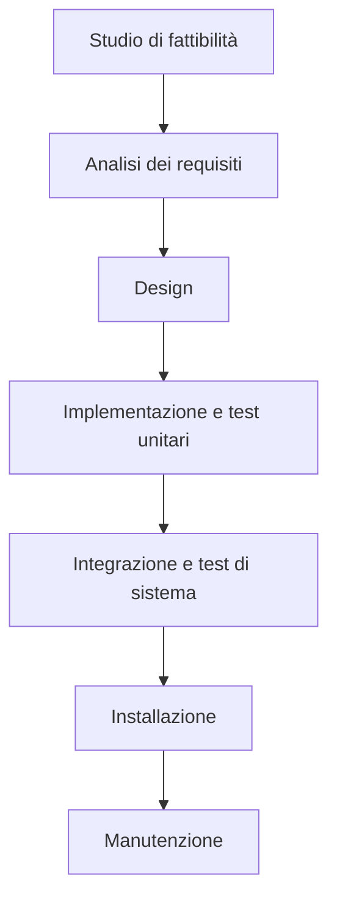

# Ciclo di vita del Software

Sviluppare un software è un processo molto complesso: per semplicità lo si divide in fasi distinte, ciascuna che prende il risultato della fase precedente, lo elabora e produce un deliverable che fiene passato alla fase successiva.

Nello schema seguente viene mostrato il funzionamento del **modello a cascata**.



Le varie fasi sono in generale abbastanza autoesplicative, vale la pena però spendere comunque due parole per specificare alcuni dettagli.

Le prime fasi servono per comprendere bene il dominio del progetto per poi produrre il documento di **specifica dei requisiti** che verrà poi tradotto, nelle fasi successive, in moduli software che fanno quanto richiesto.

La parte di testing è particolarmente delicata in quanto deve verificare che il prodotto finito sia conforme _per filo e per segno_ a quanto richiesto dal committente. In futuro questo documento verrà aggiornato con ulteriori informazioni sulla fase di collaudo.

Negli anni si è scoperto che la principale criticità del modello a cascata è il fatto che se si rileva un **difetto** (sia esso un errore nelle specifiche o un cambiamento di piani), bisogna tornare indietro alle prime fasi, aggiustare quanto necessario per poi proseguire.

E' evidente come questo possa portare a notevoli ritardi (con conseguente dispendio di soldi ed energie).

E' per sopperire a tale criticità che si è diffusa la **metodologia Agile** (che comprende, tra le altre, le metodologie **SCRUM**, **eXtreme Programming** e **DevOps**).

Ulteriori informazioni riguardo i principi della metodologia Agile si possono trovare consultando il [manifesto della metodologia Agile](https://agilemanifesto.org/iso/it/manifesto.html).

Chi segue la metodologia SCRUM suddivide il lavoro in **sprint lunghi** e **sprint giornalieri**: all'inizio di ogni sprint vi è una riunione tra i vari partecipanti al progetto che si confrontano sui progressi e sulle criticità rilevate e decidono le attività per lo sprint successivo.

Ciascuno sprint contiene una fase di design, una fase di implementazione ed un fase di collaudo.

La filosofia dietro Agile è quella di voler anticipare il cambiamento ed i problemi, non assumendo che tutto ciò che è stato fatto sia perfetto: dato che i vari sprint sono abbastanza brevi, se risulta necessario apportare cambiamenti a quanto già prodotto, il tempo necessario è di gran lunga inferiore rispetto al modello a cascata.

E' stato dimostrato sperimentalmente che chi utilizza il modello a cascata ha una probabilità di fallire nel progetto molto più alta rispetto a chi adopera metodologie Agile.

# Java

[Java](https://www.java.com/it/) è un linguaggio di programmazione ad oggetti onnipresente da decenni nei posti più disparati.


Nel mondo videoludico, l'esempio probabilmente più famoso di gioco scritto in Java è [Minecraft](https://www.minecraft.net/it-it) ma anche molti dei giochini per i vecchi telefonini sono stati scritti in Java. La piattaforma Android, pur non utilizzando la JVM (maggiori dettagli in seguito), viene programmata utilizzando prevalentemente linguaggio Java o derivati. La stragrande maggioranza delle smart card (tra cui anche bancomat e sim) implementa Java Card e, a partire da circa il 2008, la maggioranza dei lettori Blue Ray supporta _BlueRay Disk Java_ per offrire contenuti interattivi all'utente.


E' stato accennato al fatto che Java è un linguaggio ad oggetti: ciò significa che la logica del programma è costruita attorno alla manipolazione dello stato degli oggetti. Gli esempi chiariranno questa definizione.

Un programma in Java non viene compilato direttamente nel linguaggio macchina nativo della macchina su cui gira il compilatore ma in java bytecode (un linguaggio intermedio indipendente dall'architettura della macchina host) che poi viene interpretato dalla JVM (Java Virtual Machine).

Questo rende possibile l'esecuzione di programmi scritti in java su qualsiasi architettura, a patto che su tale architettura sia stato eseguito il _porting_ della JVM (i più coraggiosi possono trovare ulteriori informazioni [qui](https://zserge.com/posts/jvm/) e [qui](https://docs.oracle.com/javase/specs/jvms/se8/html/)).

## Programmazione ad oggetti

La programmazione ad oggetti si basa, appunto, su oggetti. Un oggetto è descritto dallo stato e dai suoi metodi, ciascuno stato può modificare lo stato dell'oggetto od estrarne informazioni.

Un oggetto (o classe) può essere istanziato molteplici volte, ottenendo molteplici istanze dello stesso oggetto, ciascuna con il proprio stato.

Nell'esempio successivo viene mostrato come definire una classe e come crearne un'istanza.

```java
public class Program {
    public static void main(String[] args) {
        Square s = new Square(3.0);

        System.out.println(s.getSide()) // 3.0
        s.setSide(4.0);
        System.out.println(s.getArea()) // 16.0
    }
}

class Square {
    // Lo stato del quadrato è composto da una sola variabile di tipo double
    private double side;

    // Questo è il costruttore delle istanze di Square
    public Square(double side) {
        // this è una reference all'istanza sul quale è chiamato il metodo
        // In caso di omonimia tra variabili, si prende la variabile più "interna"
        this.side = side;
    }

    // Questo metodo va a modificare lo stato del quadrato
    public void setSide(double side) {
        this.side = side;
    }

    // Questo metodo è detto "observer" in quanto estrare delle informazioni dallo stato del quadrato (in questo caso, il lato) e le restituisce al chiamante
    public double getSide() {
        return this.side;
    }

    // questo è anche un observer ma non restituisce lo stato in sè per se, bensì un'informazione derivata
    public double getArea() {
        return this.side * this.side;
    }
}
```

Tranne casi speciali, in Java, la funzione `main` deve essere contenuta in una `public class` con lo stesso nome del file in cui è contenuta.

Il vantaggio dell'utilizzo di una classe per memorizzare quadrati è dato dal fatto che se, per qualche motivo, fosse necessario cambiarne l'implementazione, fintanto che `getSide()` continua a restituire il lato e `getArea()` continua a restituire l'area, non è necessario andare a modificare tutte le chiamate a tali metodi.

Tutti i metodi di una classe accessibili dall'esterno sono detti **interfaccia** della classe (da non confondersi con le interfacce proprie di Java): l'interfaccia serve per astrarre l'utilizzo di un oggetto dalla sua implementazione.

Nell'implementazione della classe `Square` è presente un costruttore che inizializza l'istanza (in questo caso inizializza il valore di `side`): se non è presente un costruttore, viene aggiunto automaticamente un costruttore di default che non prende alcun parametro e che inizializza tutti i campi dello stato coi propri valori di default.

### Visibilità

Una classe può contenere al suo interno variabili, metodi e definizioni di altre classi ed enumerazioni. Ciascuna di queste può assumere quattro gradi diversi di visibilità:

| Visibilità          | Spiegazione                                                                                                                      |
| ------------------- | -------------------------------------------------------------------------------------------------------------------------------- |
| `private`           | L'attributo è accessibile solo dall'interno della classe stessa.                                                                  |
| `protected`         | L'attributo è accessibile solo dall'interno della classe stessa e dai suoi eredi.                                                 |
| `<non specificato>` | L'attributo è accessibile ovunque ma solo all'interno dello stesso package (che è un modo di organizzare varie parti del codice). |
| `public`            | L'attributo è visibile ovunque. |

<!-- Una volta inserita la sezione sul testing, aggiungere il link nel paragrafo introduttivo -->