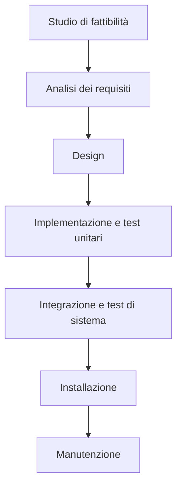

# Ciclo di vita del Software

Sviluppare un software è un processo molto complesso: per semplicità lo si divide in fasi distinte, ciascuna che prende il risultato della fase precedente, lo elabora e produce un deliverable che fiene passato alla fase successiva.

Nello schema seguente viene mostrato il funzionamento del **modello a cascata**.

Le varie fasi sono in generale abbastanza autoesplicative, vale la pena però spendere comunque due parole per specificare alcuni dettagli.

Le prime fasi servono per comprendere bene il dominio del progetto per poi produrre il documento di **specifica dei requisiti** che verrà poi tradotto, nelle fasi successive, in moduli software che fanno quanto richiesto.

La parte di testing è particolarmente delicata in quanto deve verificare che il prodotto finito sia conforme _per filo e per segno_ a quanto richiesto dal committente. In futuro questo documento verrà aggiornato con ulteriori informazioni sulla fase di collaudo.

Negli anni si è scoperto che la principale criticità del modello a cascata è il fatto che se si rileva un **difetto** (sia esso un errore nelle specifiche o un cambiamento di piani), bisogna tornare indietro alle prime fasi, aggiustare quanto necessario per poi proseguire.

E' evidente come questo possa portare a notevoli ritardi (con conseguente dispendio di soldi ed energie).

E' per sopperire a tale criticità che si è diffusa la **metodologia Agile** (che comprende, tra le altre, le metodologie **SCRUM**, **eXtreme Programming** e **DevOps**).

Ulteriori informazioni riguardo i principi della metodologia Agile si possono trovare consultando il [manifesto della metodologia Agile](https://agilemanifesto.org/iso/it/manifesto.html).

Chi segue la metodologia SCRUM suddivide il lavoro in **sprint lunghi** e **sprint giornalieri**: all'inizio di ogni sprint vi è una riunione tra i vari partecipanti al progetto che si confrontano sui progressi e sulle criticità rilevate e decidono le attività per lo sprint successivo.

Ciascuno sprint contiene una fase di design, una fase di implementazione ed un fase di collaudo.

La filosofia dietro Agile è quella di voler anticipare il cambiamento ed i problemi, non assumendo che tutto ciò che è stato fatto sia perfetto: dato che i vari sprint sono abbastanza brevi, se risulta necessario apportare cambiamenti a quanto già prodotto, il tempo necessario è di gran lunga inferiore rispetto al modello a cascata.

E' stato dimostrato sperimentalmente che chi utilizza il modello a cascata ha una probabilità di fallire nel progetto molto più alta rispetto a chi adopera metodologie Agile.

<!-- Una volta inserita la sezione sul testing, aggiungere il link nel paragrafo introduttivo -->