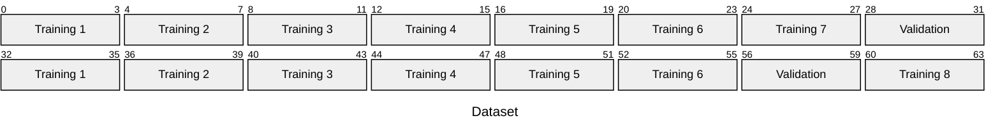
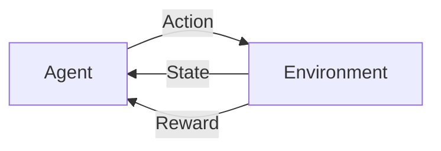

## Supervised Learning

Given training data $D = \{(x, t)\}$ with input examples $(x)$ and desired outputs $(t)$, the goal is to find an approximation of an unknown function $f$ that can generalize to new data.

Supervised learning is useful when:

- No human expert exists (e.g., DNA sequence analysis)
- The task is performable but not explicable (e.g., image recognition)
- The underlying function changes frequently (e.g., stock price prediction)
- Personalization is needed for each user (e.g., spam filters)

To define a supervised learning problem, we need:

- **Loss Function** $L(t, y(x))$: A measure of error between the true target $t$ and the model's prediction $y(x)$
- **Hypothesis Space** ($H$): the set of candidate functions we search within to find the best model
- **Optimization Algorithm**: the procedure to improve the hypothesis by minimizing the loss function

If $f$ is known, the problem is function approximation. When $f$ is unknown, we estimate it from data using a loss function that accounts for noise.

### Model Evaluation

A model is evaluated based on its **expected loss**, which is the average loss over the all the possible data:

$$\mathbb{E}[L] = \int \int L(t, y(x)) \, p(x, t) dx dt$$

where:

- $L(t, y(x))$: loss function measuring error between true target and prediction
- $p(x, t)$: true joint distribution of inputs and targets (probability of seeing a particular input-target pair)

Knowing $p(x, t)$ would be equivalent to knowing $f$ (the generating function). The joint distribution is approximated from training data.

The model $y(x)$ that minimizes the expected loss is the **conditional mean** computed as:
$$y^*(x) = \mathbb{E}[t|x] = \int t \, p(t|x) \, dt$$

#### Loss Functions

A common loss function is the **Minkowski loss**:
$$L(t, y(x)) = |t - y(x)|^q$$

where $q$ is a parameter that controls how errors are penalized.

- For $q=2$ (squared loss), large errors are penalized more heavily.
- For $q=1$ (absolute loss), the model is more robust to outliers.
- For $q=\infty$ (max loss), only the worst error matters.

### Approaches to Supervised Learning

To solve supervised learning problems, there are three main approaches:

#### Generative Approach

The **generative approach** models how the data was generated by learning the **joint distribution** $p(x, t) = p(t|x)p(x)$.

Once the model is learned, it's possible to:

- **Generate** new synthetic data
- **Infer** the conditional density $p(t|x) = \frac{p(x,t)}{p(x)}$ for predictions

This approach is powerful but often requires modeling complex distributions, which can be difficult and computationally expensive.

#### Discriminative Approach

The **discriminative approach** focuses directly on modeling the relationship between inputs and outputs by learning the **conditional distribution** $p(t|x)$, without modeling the input distribution $p(x)$.

Predictions use the conditional mean:
$$\mathbb{E}[t|x] = \int t \, p(t|x) \, dt$$

This approach is more efficient for prediction tasks, as it doesn't require modeling the full data distribution.

#### Direct Approach

The **direct approach** avoids probability modeling. Instead of learning distributions, it directly minimizes a loss function on the training data to find the best mapping from inputs to targets.

For prediction tasks, you just need the mapping $x \to t$ to be accurate.

This approach is often more straightforward and computationally efficient.

### Prediction Error

The error given by a model can be decomposed into three components:
$$\mathbb{E}[L] = \mathbb{E}[(t - y(x))^2] = \underbrace{Var[t] = \sigma^2}_{\text{Noise}} + \underbrace{\mathbb{E}[(f(x) - y(x))^2]}_{\text{Bias}^2} + \underbrace{Var[y(x)]}_{\text{Variance}}$$

The only irreducible error is the noise $\sigma^2$, which is inherent in the data generation process ($t = f(x) + \epsilon$ where $\epsilon \sim \mathcal{N}(0, \sigma^2)$). The bias and variance are controllable through model choice and training.

Bias and variance are in tension: reducing bias typically increases variance, and vice versa. The goal is to find the right balance to minimize total error.

#### Bias

The **Bias** is the error due to the model's assumptions (hypothesis space $H$) being too simple to capture the true function $f$.

It measures how far the average prediction $\mathbb{E}[y(x)]$ is from the true function $f(x)$.

$$\text{bias}^2 = \int (f(x) - \mathbb{E}[y(x)])^2 \, p(x) \, dx$$

A model with high bias is called **underfitting**, meaning that it fails to capture the underlying patterns in the data, leading to poor performance on both training and test data.

It is possible to reduce the bias by increasing model complexity (increasing the size of the hypothesis space $|H|$ by adding more features)

#### Variance

The **Variance** is the error due to the model's sensitivity to fluctuations in the training data. It measures how much the predictions $y(x)$ would change if we trained on a different dataset drawn from the same distribution.

$$\text{variance} = \int \mathbb{E}[(y(x) - \mathbb{E}[y(x)])^2] \, p(x) \, dx$$

A model with high variance is called **overfitting**, meaning that it captures noise in the training data as if it were a true pattern, leading to good performance on training data but poor generalization to new data.

The variance can be reduced by:

- Increase training samples (noise averages out)
- Decrease model complexity (fewer degrees of freedom to fit noise)

## Model Evaluation and Selection

During training, the model is optimized to minimize the **training error** $L_{\text{train}}$, which is the error on the training data. However, what we really care about is the **generalization error** $L_{\text{true}}$, which is the expected error on new, unseen data.

### Dataset Partitioning

Before training is important to split the data into three independent sets, **randomly assigned**:

- **Training set:** Optimize model parameters. Can be reused for multiple epochs.
- **Validation set:** Tune hyperparameters and avoid overfitting. Used during training to guide regularization and stopping decisions.
- **Test set:** Final performance estimate. Touched only once, after all hyperparameter choices are frozen.

More test data gives a more reliable estimate of true error, but removes training samples that could improve the model.

The training and test error can be used to detect underfitting and overfitting:

- **Underfitting:** Both training and test error are high and close to each other. Need to increase model complexity.
- **Overfitting:** Training error is low but test error is high. Need to reduce model complexity or add more data.
- **Good fit:** Both training and test error are low and close to each other. Stop here.

### Cross-Validation (CV)

**Cross-validation** is a technique to assess how well a model generalizes to unseen data. Instead of relying on a single train/test split, cross-validation uses multiple splits to provide a more robust estimate of generalization error.

After the validation error is estimated, the model with the lowest validation error is selected and retrained on the entire training set (training + validation) before evaluating on the test set.

#### K-Fold Cross-Validation

**K-Fold Cross-Validation** divides the dataset $\mathcal{D}$ into $k$ equal-sized folds $\mathcal{D}_i$. The model is trained on $k-1$ folds and validated on the remaining fold. This process is repeated $k$ times, with each fold serving as the validation set once.



The final performance estimate is the average of the validation errors across all folds:

$$L_{\text{K-Fold}} = \frac{1}{k} \sum_{i=1}^k \underbrace{\frac{k}{N} \sum_{n \in \mathcal{D}_i} (y_n - f^{(i)}(x_n))^2}_{L_{\text{test}}^{(i)}}$$

where $f^{(i)}$ is the model trained without fold $\mathcal{D}_i$.

The larger the $k$, the more reliable the estimate (bigger training set), but the more expensive it is to compute (more models to train).

This is usually pessimistically biased.

#### Leave-One-Out Cross-Validation (LOO)

**Leave-One-Out Cross-Validation (LOO)** is an extreme case of K-Fold CV where $k = N$.

This means that each fold consists of a single sample, and the model is trained on all other samples. The final performance estimate is the average error across all $N$ folds:

$$L_{\text{LOO}} = \frac{1}{N} \sum_{n=1}^N (y_n - f_{-n}(x_n))^2$$

As the training set is almost the entire dataset, the bias is very low. However, it is computationally expensive, as it requires training $N$ models.

#### Nested Cross-Validation

The **Nested Cross-Validation** is a technique used to evaluate the performance of a model while also selecting its hyperparameters. Using the same dataset for both evaluation and selection can lead to overfitting leading in an overly optimistic estimate of the model's performance.

It involves two levels of cross-validation:

1. **Outer loop (evaluation):** The dataset is split into $k$ folds. For each fold, one fold is held out as the test set, and the remaining $k-1$ folds are used as training set for the inner loop.

2. **Inner loop (selection):** The training set from the outer loop is further split into $k'$ folds. For each fold, one fold is held out as a validation set, and the remaining $k'-1$ folds are used to train models with different hyperparameter settings. The hyperparameters that yield the best average performance on the validation sets are selected.

### Adjustment Techniques

Instead of performing the validation, is possible to adjust the training error to estimate the generalization error. This is done by adding a penalty term that accounts for model complexity, which helps to prevent overfitting.

This can be done with different techniques, such as:

#### Mallows' $C_p$

$$C_p = \frac{1}{N}(L_{\text{train}} + 2D \hat{\sigma}^2)$$

where:

- $D$: number of parameters in the model
- $\hat{\sigma}^2$: estimate of the noise variance

#### Akaike Information Criterion (AIC)

$$\text{AIC} = 2D - 2 \log L_{\text{max}}$$

where:

- $L_{\text{max}}$: maximum likelihood of the estimated model

#### Bayesian Information Criterion (BIC)

$$\text{BIC} = \frac{1}{N} (L_{\text{train}} + D \log N \hat{\sigma}^2)$$

#### Adjusted $R^2$

$$R_{\text{adj}}^2 = 1 - \frac{L_{\text{train}} / (N - D - 1)}{\text{TSS} / (N - 1)}$$

where:

- $\text{TSS}$: total sum of squares

### No Free Lunch Theorem

Let $\mathcal{F}$ be the set of *all possible* functions, and $Acc_G(L)$ be the generalization accuracy of learner $L$ on unseen data.

For any learning algorithm $L$:

$$\frac{1}{|\mathcal{F}|} \sum_{f \in \mathcal{F}} Acc_G(L) = \frac{1}{2}$$

Meaning that averaged over all possible functions, every learning algorithm is no better than random guessing.

This means that there is *no universally superior learning algorithm* as each algorithm will perform well on some problems and poorly on others.

A single algorithm can only be better than random guessing on a subset of problems, where there is some structure that the algorithm can exploit.

By making assumptions about the data, we can design algorithms that perform well on real-world problems, which are not random functions but have underlying patterns (**inductive bias**).

## Linear Regression

The goal is to learn a function that maps input features $x$ to target output $t$. Linear regression models assume this relationship is linear in the parameters (though features can be nonlinearly transformed).

The solution can be found analytically.

$$y(x, w) = w_0 + \sum_{j=1}^{D-1} w_j x_j = w^T \phi(x)$$

where:

- $\phi(x) = (1, x_1, \dots, x_{D-1})$: augmented feature vector
- $w = (w_0, w_1, \dots, w_{D-1})$: weight vector
- $w_0$: bias term

Linear models are used:

- **Easy to optimize**: Convex loss function guarantees global optimum
- **Easy to interpret**: Weights directly show feature importance
- **Multiple outputs**: Can be extended to predict multiple targets simultaneously as each output is a linear combination of the same features

### Ordinary Least Squares (OLS)

The **Ordinary Least Squares (OLS)** is a direct method that finds the weights that minimize the error on the training data.

Since we cannot compute the true expected loss (the joint distribution is unknown), we approximate it with the **empirical loss** computed from the $N$ training data:

$$L(w) = \frac{1}{2} \sum_{n=1}^N (y(x_n, w) - t_n)^2$$

- The factor $\frac{1}{2}$ is a scale factor for computational convenience.

This is also called **residual sum of squares** (RSS) or **sum of squared errors** (SSE), and can also be written as:

$$RSS(w) = \|\epsilon\|_2^2 = \sum_{n=1}^N \epsilon_n^2$$

where:

- $\epsilon_n = y(x_n, w) - t_n$ is the **residual error** for the n-th training example.

> The **p-norm** of the residuals is a generalization of the loss function and assign a measure of the error from a vector.
>
> - For $p=1$, we get the **L1 norm** (sum of absolute errors), that is represented by a diamond-shaped plot.
> - For $p=2$, we get the **L2 norm** (sum of squared errors), that is represented by a circular plot.
> - For $p=\infty$, we get the **L-infinity norm** (maximum error), that is represented by a square-shaped plot.

**Matrix Formulation:**

$$L(w) = \frac{1}{2} \text{RSS}(w) = \frac{1}{2} (t - \Phi w)^T (t - \Phi w)$$

where:

- $t = [t_1, \dots, t_N]^T$: vector of target values ($N$-dimensional)
- $\Phi = [\phi(x_1), \dots, \phi(x_N)]^T$: matrix with samples as rows, features as columns ($N \times M$)
- $w$: weight/parameter vector ($M$-dimensional)

#### Solution

The solution is found by setting the gradient of the loss to zero:

$$\frac{\partial L(w)}{\partial w} = - \Phi^T (t - \Phi w) = 0$$

The Hessian (second derivative) is:
$$\frac{\partial^2 L(w)}{\partial w \partial w^T} = \Phi^T \Phi$$

This is positive definite if $\Phi$ has full column rank, ensuring a unique global minimum.

The point where the gradient is zero corresponds to the minimum of the loss function, and in that point there is no correlation between the residuals and the features. This means that the model has captured all the linear relationships in the data, and any remaining error is due to noise.

Solving the gradient for $w$:
$$\hat{w}_{OLS} = (\Phi^T \Phi)^{-1} \Phi^T t$$

This is the **Ordinary Least Squares (OLS)** solution, which gives the best linear fit to the training data in terms of minimizing the sum of squared errors.

To work properly, OLS requires:

1. **More samples than features**: $N \geq M$
2. **No redundant features**: Features must be linearly independent, otherwise the matrix is singular and cannot be inverted.
3. **Computational budget**: Inversion costs $O(M^3)$

#### Linear Model Evaluation

To evaluate the performance of a linear regression model, we use the **Root Mean Squared Error (RMSE)**, which is derived from the residual sum of squares (RSS):

$$E_{\text{RMS}} = \sqrt{\frac{2 * \text{RSS}(\hat{w})}{N}}$$

#### Variance Estimation

To estimate the variance of the noise, we can use the residuals from the fitted model:
$$\hat{\sigma}^2 = \frac{1}{N - M} \sum_{n=1}^N (t_n - \hat{w}^T \phi(x_n))^2$$

where:

- $N$: number of samples
- $M$: number of parameters (features)

Meaning that more more samples reduce the variance of the noise estimate, while more parameters increase it.

> Based on the **Gauss-Markov theorem**, the OLS estimator is the **Best Linear Unbiased Estimator**, meaning it has the lowest variance among all linear unbiased estimators.

#### Stochastic Gradient Descent (SGD)

This is an iterative optimization algorithm that updates the weights incrementally using one sample at a time, rather than computing the gradient over the entire dataset.

The loss function can be written as the sum of the loss function for each sample $L(w) = \sum_{n=1}^N L(x_n)$.

$$w^{(k+1)} = w^{(k)} - \alpha^{(k)} \nabla L(x_n)$$

For squared loss:
$$w^{(k+1)} = w^{(k)} - \alpha^{(k)} (w^{(k)T} \phi(x_n) - t_n) \phi(x_n)$$

where:

- $\alpha^{(k)}$: learning rate at iteration $k$
- $w^{(k)}$: weight vector at iteration $k$

At each iteration, the algorithm performs the following steps:

1. Compute prediction error: $(w^T \phi(x_n) - t_n)$
2. Compute error gradient: Multiply by the feature vector
3. Move weights in opposite direction with a step defined by the learning rate $\alpha^{(k)}$: $w := w - \alpha^{(k)} \times (\text{error gradient})$

This method is more efficient for large datasets, as it avoids the costly matrix inversion required by OLS and allows for online learning. However each update is influenced by the noise of a single sample.

SDG can converge to the OLS solution only when the learning rate decays over time and satisfies the Robbins-Monro conditions:

- $\sum_{k=1}^\infty \alpha^{(k)} = \infty$: ensures that the algorithm continues to make progress towards the minimum
- $\sum_{k=1}^\infty (\alpha^{(k)})^2 < \infty$: ensures that the steps become small enough to converge to the minimum without oscillating around it.

#### Geometric Interpretation

The OLS solution projects the target vector $t$ onto the feature space spanned by columns of $\Phi$:

$$\hat{t} = \Phi \hat{w}_{OLS} = \underbrace{\Phi (\Phi^T \Phi)^{-1} \Phi^T}_{\text{Projection Matrix } P} t$$

The projection $\hat{t}$ should be as close as possible to $t$.

### Maximum Likelihood Estimation (MLE)

The **Maximum Likelihood Estimation (MLE)** is a generative method that try to find the model which is most likely to have generated the observed data.

Assume targets are generated by a function summed with Gaussian noise:
$$t = f(x) + \epsilon, \quad \epsilon \sim \mathcal{N}(0, \sigma^2)$$

This approach maximizes the **likelihood**, which is the probability of observing the data given the parameters:

$$p(t|X, w, \sigma^2) = \prod_{n=1}^N \mathcal{N}(t_n | w^T \Phi(x_n), \sigma^2)$$

This optimization problem is equivalent to minimizing the sum of squared errors, as maximizing the likelihood corresponds to finding the parameters that make the observed data most probable under the assumed model.

To solve it, we take the logarithm of the likelihood (log-likelihood) to simplify the product into a sum:
$$\ln p(t|X, w, \sigma^2) = \sum_{n=1}^N \ln \mathcal{N}(t_n | w^T \Phi(x_n), \sigma^2) = - \frac{N}{2} \ln (2\pi \sigma^2) - \frac{1}{2\sigma^2} \text{RSS}(w)$$

Setting the derivative to zero:

$$\nabla l(w) = \sum_{n=1}^N t_n \Phi(x_n)^T - w^T \sum_{n=1}^N \Phi(x_n) \Phi(x_n)^T = 0$$
$$\hat{w}_{ML} = (\Phi^T \Phi)^{-1} \Phi^T t$$

### Bayesian Linear Regression

The **Bayesian Linear Regression** is a probabilistic approach to linear regression that incorporates uncertainty about the model parameters.

Before seeing data, there is an assumption about the distribution of weights, called the **prior distribution**. A common choice is a Gaussian prior:
$$p(w) = \mathcal{N}(w | w_0, S_0)$$

After observing data, *Bayes' theorem* is used to update the belief about the weights, resulting in the **posterior distribution**:
$$\overbrace{p(w|\mathcal{D})}^{\text{posterior}} = \frac{\overbrace{p(\mathcal{D}|w)}^{\text{likelihood}} \, \overbrace{p(w)}^{\text{prior}}}{p(\mathcal{D})}$$

where:

- $p(\mathcal{D}) = \int p(\mathcal{D}|w) p(w) dw$: is the **marginal likelihood**, which normalizes the posterior distribution.

After updating, the weights still maintain a Gaussian distribution (*conjugate prior*):
$$\overbrace{p(w|t, \Phi, \sigma^2)}^{\text{posterior}} \propto \overbrace{\mathcal{N}(w | w_0, S_0)}^{\text{prior}} \, \overbrace{\mathcal{N}(t | \Phi w, \sigma^2 I)}^{\text{likelihood}} = \mathcal{N}(w | w_N, S_N)$$

where:
$$w_N = S_N \left( S_0^{-1} w_0 + \frac{\Phi^T t}{\sigma^2} \right)$$
$$S_N^{-1} = S_0^{-1} + \frac{\Phi^T \Phi}{\sigma^2}$$

> With zero-mean gaussian prior ($w_0 = 0, S_0 = \tau^2 I$), the $w_N$ is the MAP estimator that is equal to the ridge regression solution with $\lambda = \frac{\sigma^2}{\tau^2}$.

#### Predictive Distribution

The Bayesian approach allows to compute the probability distribution of the target for a new input $x$, called the **predictive distribution**:
$$p(t| x, \mathcal{D}, \sigma^2) = \int \mathcal{N}(t | w^T \phi(x), \sigma^2) \mathcal{N}(w | w_N, S_N) dw = \mathcal{N}(t | w_N^T \phi(x), \sigma^2_N)$$

where:
$$\sigma^2_N = \underbrace{\sigma^2}_{\text{data noise}} + \underbrace{\phi(x)^T S_N \phi(x)}_{\text{parameters uncertainty}}$$

## Linear Classification

**Linear classification** assigns an input to one of $K$ classes $C_k$ using linear combinations of features to define decision boundaries (hyperplanes) that separate the input space.

The result of the classification can lead to two types of errors:

- **False positive**: predict positive when true class is negative
- **False negative**: predict negative when true class is positive

These have different costs in different domains. In medical diagnosis, missing a disease (false negative) is typically more costly than a false alarm (false positive), so models can be biased to minimize one error type.

The model computes a linear score for each class and applies a **nonlinear activation function** ($y(x, w) =  f(x^T w + w_0)$) to map scores ($-\infty$ to $\infty$) to probabilities ($0$ to $1$) or class labels.

The **sigmoid function** is a common choice for binary classification: $\sigma(z) = \frac{1}{1 + e^{-z}}$

For multi-class classification, each class can be modeled with a separate linear function, and the results are stored in a vector of scores. The class with the highest score is selected as the predicted class, creating single connected and convex decision regions.

> Using Linear Regression for classification is a bad idea because it can produce ambiguous regions where multiple classifiers predict positive. It could be modeled with two main approaches:
>
> - **One-vs-Rest**: Train $K-1$ binary classifiers, each distinguishing one class from the rest. This can lead to ambiguous regions where multiple classifiers predict positive.
> - **One-vs-One**: Train $\binom{K}{2}$ binary classifiers for each pair of classes. This can lead to complex decision boundaries and is computationally expensive.

### Discriminant Function Approach

The goal of the **discriminant function approach** is to learn a function that directly assigns each input to a class, without modeling probabilities.

a simple method is to learn $K$ separate linear scoring functions (one per class) and assign the class with the highest score. Then choose the class that has the highest score:
$$\hat{C} = \arg\max_k (w_k^T \phi(x) + w_{k0})$$

#### Perceptron Algorithm

The **Perceptron** is an online, discriminative learning algorithm for binary classification. The model is a linear function of the input features, and the output is a binary class label determined by the sign (+1 or -1) of it:
$$y(x) = \text{sign}(\underbrace{w^T \phi(x)}_\text{Distance from decision boundary})$$

The **Loss function** is defined as the sum of the distances of *misclassified* samples from the decision boundary:
$$L(w) = - \sum_{n \in \mathcal{M}} t_n w^T \phi(x_n)$$

where $\mathcal{M}$ is the set of misclassified samples and $t_n \in \{-1, +1\}$ is the true label.

> OLS is not suitable because it tries to minimize the squared error, which can lead to large errors for outliers and does not focus on the decision boundary. The perceptron loss focuses only on misclassified samples, which is more appropriate for classification tasks.

The **optimization** of the perceptron loss is done on the *stochastic gradient descent on misclassified samples only*:

$$w^{(k+1)} = w^{(k)} + \alpha t_n \phi(x_n)$$

where $\alpha$ is the learning rate (can be set to 1 as each update moves the decision boundary in the correct direction).

The perceptron algorithm can **converge** to a solution if the data is linearly separable, meaning there exists a hyperplane that can perfectly separate the two classes. However, if the data is not linearly separable, the algorithm will never converge and will continue to oscillate indefinitely.

### Probabilistic Discriminative Approach

The **Probabilistic Discriminative Approach** models the posterior class probability $p(C_k|x)$ directly using the observed features, without modeling the input distribution $p(x)$.

**Binary Classification:**

Model the posterior probability of the positive class using the **logistic sigmoid**:
$$p(C_1|x) = \sigma(w^T \phi(x)) = \frac{1}{1 + e^{-w^T \phi(x)}}$$

The likelihood of the observed data is:
$$p(t|X, w) = \prod_{n=1}^N y_n^{t_n} (1 - y_n)^{1 - t_n}$$

The negative log of the likelihood is the **cross-entropy loss**:
$$L(w) = - \sum_{n=1}^N \left[ t_n \ln y_n + (1 - t_n) \ln (1 - y_n) \right]$$

Maximizing the likelihood is equivalent to minimizing the cross-entropy loss. The gradient of the loss with respect to the weights is:
$$\nabla L(w) = \sum_{n=1}^N \frac{\partial L(w)_n}{\partial w} = \sum_{n=1}^N (y_n - t_n) \phi(x_n)$$

This has the same form as linear regression, but the meaning is different: $y_n$ is now a predicted probability, and $(y_n - t_n)$ measures the deviation from true labels (0 or 1).

**Multi-Class Classification:**

For $K$ classes, use the **softmax function** to model posterior probabilities:
$$p(C_k|x) = \frac{e^{w_k^T \phi(x)}}{\sum_{j=1}^K e^{w_j^T \phi(x)}}$$

The cross-entropy loss for multi-class classification is:
$$L(w_1, \dots, w_K) = - \sum_{n=1}^N \sum_{k=1}^K t_{nk} \ln y_{nk}$$

The gradient with respect to the weights for class $k$ is:
$$\nabla L_{w_k} = \sum_{n=1}^N (y_{nk} - t_{nk}) \phi(x_n)$$

### Probabilistic Generative Approach

The **Probabilistic Generative Approach** models the joint distribution of inputs and outputs $p(x, C_k)$ by learning the class-conditional distributions $p(x|C_k)$ and the class priors $p(C_k)$, understanding how the data is generated. Those are used to infer the posterior class probabilities using Bayes' theorem:

$$p(C_k|x) = \frac{p(x|C_k) p(C_k)}{p(x)}$$

where $p(x) = \sum_{j=1}^K p(x|C_j) p(C_j)$ (marginal likelihood).

This approach allows to generate new data samples from each class. However, it typically requires more parameters and samples.

## Model Selection

Adding features without adding data leads to overfitting. More parameters require more samples to estimate them reliably. When features exceed samples ($M > N$), the hypothesis space becomes too large, and variance explodes.

Model selection is the process of finding the right trade-off.

### Feature Selection

**Feature selection** is the process of selecting a subset of relevant features for use in model construction, reducing its complexity and improving generalization.

This is a combinatorial problem, there are $2^M$ possible feature subsets for $M$ features. Searching through all subsets is computationally infeasible for large $M$, so we use meta-heuristics to find good subsets.

#### Filter Methods

**Filter methods** evaluate the relevance of features by their correlation with the target variable. They rank features based on a statistical measure and select the top $k$ features.

This method is fast and independent of the model, but it ignores feature interactions and only captures linear relationships. For example, two features may have low individual correlation with the target but together they could be highly predictive.

The **Pearson correlation coefficient** is a common measure of linear correlation (range $[-1, 1]$) between two variables $x_j$ and $y$:

$$\hat{\rho}(x_j, y) = \frac{\sum_{n=1}^N (x_{j,n} - \bar{x}_j)(y_n - \bar{y})}{\sqrt{\sum_{n=1}^N (x_{j,n} - \bar{x}_j)^2} \sqrt{\sum_{n=1}^N (y_n - \bar{y})^2}}$$

From these correlation coefficients, we can select the top $k$ features with the highest absolute correlation with the target variable.

#### Wrapper Methods

The **wrapper methods** evaluate feature subsets by training a model on them and measuring its performance. This approach accounts for feature interactions and finds subsets optimized for the specific model being used.

There are several strategies for searching through the feature subsets:

##### Brute Force

Try all $\binom{M}{k}$ subsets of size $k$ and evaluate each.

This guarantees finding the optimal subset, but is computationally infeasible for large $M$.

##### Forward Feature Selection

Forward feature selection is a greedy algorithm that starts with an empty feature set and iteratively adds features that improve model performance the most. This process continues until adding more features does not improve performance or a desired number of features is reached.

The **cost** of this method is $O(M^2)$ model evaluations, as each iteration requires evaluating all remaining features.

##### Backward Feature Elimination

Backward feature elimination is the opposite of forward selection. It starts with all features and iteratively removes the one that degrades performance the least. This continues until no further improvement can be made or a desired number of features is reached.

These methods are not guaranteed to find the optimal subset, as they are greedy heuristics. They may miss feature combinations that only work together.

### Regularization

**Regularization** is a technique to prevent overfitting by adding a penalty term to the loss function that discourages complex models (too many parameters or weights too big).

Modified loss function:
$$L(w) = \underbrace{L_D(w)}_{\text{error on data}} + \lambda \underbrace{L_w(w)}_{\text{model complexity}}$$
$$L(w) = \underbrace{\frac{1}{2} \sum_{n=1}^N (t_n - w^T \Phi(x_n))^2}_{\text{RSS}} + \lambda L_w(w)$$

The **regularization parameter** $\lambda$ controls the tradeoff:

- $\lambda = 0$: Only fit data (standard OLS)
- $\lambda \to \infty$: Weights forced to zero

The value of $\lambda$ is choosen usign cross validation, once the value is found it is possible to train the final model.

#### Ridge Regression (L2 Regularization)

Penalize the **L2 norm** (sum of squares) of weights:
$$L_w(w) = \frac{1}{2}\|w\|_2^2 = \frac{1}{2} \sum_{j=1}^M w_j^2$$

This encourages smaller weights, but does not set them to zero.

Full loss function:
$$L(w) = \frac{1}{2} \sum_{n=1}^N (t_n - w^T \Phi(x_n))^2 + \frac{\lambda}{2} \|w\|_2^2$$

The solution is:
$$\hat{w}_{\text{ridge}} = (\Phi^T \Phi + \lambda I)^{-1} \Phi^T t$$

#### Lasso Regression (L1 Regularization)

Penalize the **L1 norm** (sum of absolute values):
$$L_w(w) = \|w\|_1 = \sum_{j=1}^M |w_j|$$

This generates *sparse solutions*, where some weights are exactly zero, effectively performing feature selection, removing irrelevant features from the model.

Full loss function:
$$L(w) = \frac{1}{2} \sum_{n=1}^N (t_n - w^T \Phi(x_n))^2 + \lambda \|w\|_1$$

#### Elastic Net

The **Elastic Net** is a regularization technique that combines both L1 and L2 penalties to leverage the benefits of both methods.

$$L(w) = \alpha \rho \|w\|_1 + \frac{\alpha (1 - \rho)}{2} \|w\|_2^2$$

where:

- $\alpha$: overall regularization strength
- $\rho$: balance between L1 and L2 (0 ≤ ρ ≤ 1)

### Dimension Reduction

**Dimension reduction** is the process of reducing the number of features in a dataset while preserving as much information as possible.

#### Principal Component Analysis (PCA)

**Principal Component Analysis (PCA)** is a linear technique that finds new orthogonal axes (principal components) that capture the maximum variance in the data. By using those axis we can remove the correlation between the features.

The principal components are ordered by the amount of variance they capture. Having more variance means that the component captures more information about the data (Shannon entropy).

To reduce the amount of features, we can project the data onto the first $K$ principal components, which capture the most variance in the data.

The process involves the following steps:

1. **Normalize:** Subtract mean from each feature so data is centered at origin ($\hat{X} = X - \bar{X}$).
2. **Compute covariance matrix:** $S = \frac{1}{N} \hat{X}^T \hat{X}$
3. **Find eigenvectors and eigenvalues** of $S$. Eigenvectors ($v_j$) are the principal component directions, while eigenvalues ($\lambda_j$) are the variance along each direction.
4. **Project data** onto the top $K$ eigenvectors ($X_{\text{proj}} = \hat{X} \underbrace{V_K}_{(v_1| \ldots | v_K)}$).

The **cumulative variance** explained by the top $K$ selected components should contain the majority of the variance in the data (e.g., 90%) to ensure that we are retaining most of the information while reducing dimensionality:
$$\text{Cumulative Variance}(K) = \frac{\sum_{j=1}^K \lambda_j}{\sum_{j=1}^M \lambda_j}$$

## Model Ensemble

**Model ensemble** is a technique that combines multiple models to improve predictive performance. The idea is that while individual models may have high variance or bias, combining them can lead to better generalization.

### Bagging

**Bagging** is an ensemble method that reduces variance without increasing bias by training $B$ multiple models on different subsets of the independent training data and averaging their predictions.

$$\text{Var}(\hat{y}) = \frac{\text{Var}(y)}{B}$$

1. Generate $B$ bootstrap samples by randomly sampling $N$ observations from the original dataset **with replacement** (reduce the independence but each dataset is still random). Each bootstrap sample has the same size as the original.

2. Train a separate model on each bootstrap sample.

3. **Aggregate predictions:**
   - Regression: Average predictions across all $B$ models.
   - Classification: Majority voting (or soft voting if probabilities available).

All the models can be trained in parallel, but works better for complex models (high variance). Simple models have high bias and bagging does not help.

### Boosting

**Boosting** is an ensemble method that reduces bias without increasing variance by sequentially training models, where each new model focuses on the samples that the previous models misclassified.

1. Uniformly initialize sample weights.
2. Train a weak learner on the weighted data.
3. Increase weights of misclassified samples.
4. Repeat.
5. Combine all learners with weighted voting.

This methods requires a weak learner with high bias and low variance that performs better than random guessing (error < 0.5) to ensure improve performance and not noisy data.

This time the models are trained sequentially, and each model is influenced by the previous ones, so it cannot be parallelized.

## Sample Complexity

When training a model, the amount of samples available is crucial for its performance. With too few samples, the model may not capture the underlying patterns in the data and will perform poorly on unseen data (overfitting). With too many samples, the model may be unnecessarily complex and computationally expensive.

It's important to understand how many samples are needed to ensure that the model generalizes well to new data.

### PAC-Learning

**Probably Approximately Correct (PAC) learning** provides guarantees on the performance of learning algorithms on finite hypothesis spaces based on the number of training samples.

A concept class (set of concept functions $c$ that can be the target function) $\mathcal{C}$ is **PAC-learnable** if there exists an algorithm $L$ such that:

- for any concept $c \in \mathcal{C}$
- any distribution over the input space
- any error threshold better that random guessing ($0 \leq \epsilon \ge 0.5$)
- with probability at least $1 - \delta$ (confidence, $0 \leq \delta < 0.5$)

The algorithm can learn a hypothesis $h$ such that the true error $L_{\text{true}}(h)$ is at most $\epsilon$, using a number of training samples $N$ that is polynomial in $\frac{1}{\epsilon}$ and $\frac{1}{\delta}$.

An algorithm is **efficiently PAC-learnable** if the runtime is polynomial in $\frac{1}{\epsilon}$, $\frac{1}{\delta}$, and the size of the concept.

#### The Version Space

Inside the hypothesis space $\mathcal{H}$, there is a subset of hypotheses that is consistent with the training data $\mathcal{D}$ (No misclassified examples). This subset is called the **version space**.

$$VS(\mathcal{H}, \mathcal{D}) = \{h \in \mathcal{H} : L_{\text{train}}(h) = 0\}$$

The probability that one of the hypotheses in the version space has true error greater than $\epsilon \in [0, 1]$ is bounded by:

$$\Pr\left(\exists h \in \mathcal{H} : L_{\text{train}}(h) = 0 \land L_{\text{true}}(h) \geq \epsilon\right) \leq |\mathcal{H}| e^{-\epsilon N}$$

This means that with more samples ($N$) or a smaller hypothesis space ($|\mathcal{H}|$), the probability of having a bad hypothesis in the version space decreases exponentially.

By setting the probability of a bad hypothesis to be at most $\delta$, we can derive the sample complexity bound:

$$N \geq \frac{1}{\epsilon} \left(\ln|\mathcal{H}| + \ln \frac{1}{\delta}\right)$$

Equivalently, the error bound is:

$$L_{\text{true}}(h) = \epsilon \leq \frac{1}{N}\left(\ln|\mathcal{H}| + \ln \frac{1}{\delta}\right)$$

In practice this bound is very generous, and the true error is often much smaller than this worst-case bound.

**Proof:**

The event "exists a bad hypothesis" is a disjunction of individual events for each $h$:

$$\Pr(\exists h \in \mathcal{H}: L_{\text{train}}(h) = 0 \land L_{\text{true}}(h) \geq \epsilon) = \bigcup_{h \in \mathcal{H}} \Pr( L_{\text{train}}(h) = 0 \land L_{\text{true}}(h) \geq \epsilon )$$

The probability of a union is at most the sum of probabilities:

$$\leq \sum_{h \in \mathcal{H}_{\text{bad}}} \Pr( L_{\text{train}}(h) = 0 \land L_{\text{true}}(h) \geq \epsilon) \leq \sum_{h \in \mathcal{H}_{\text{bad}}} \Pr( L_{\text{train}}(h) = 0 | L_{\text{true}}(h) \geq \epsilon)$$

The probability that a bad hypothesis has zero training error is the probability that all $N$ samples are correctly classified by $h$, which is at most $(1 - \epsilon)^N$ (since each sample has at least $\epsilon$ chance of being misclassified):

$$\Pr( L_{\text{train}}(h) = 0 | L_{\text{true}}(h) \geq \epsilon) \leq (1 - \epsilon)^N$$

By summing over all bad hypotheses, we get:

$$\sum_{h \in \mathcal{H}_{\text{bad}}} (1 - \epsilon)^N \leq |\mathcal{H}|(1 - \epsilon)^N \leq |\mathcal{H}| e^{-\epsilon N}$$

#### Hoeffding Inequality

The version space is a very strong assumption, as it requires that at least one hypothesis has zero training error. In practice, this is often not the case, especially with noisy data:

$$L_{\text{true}}(h) \leq L_{\text{train}}(h) + \epsilon$$

Using the **Hoeffding inequality** ($\Pr(\overbrace{\mathbb{E}[X]}^{\text{Real Mean}} - \overbrace{\bar{X}}^{\text{Empirical Mean}} > \epsilon) \leq e^{-2N\epsilon^2}$), we can bound the probability that the true error is much larger than the training error, even when the training error is not zero.

$$\Pr(\exists h \in \mathcal{H} : L_{\text{true}}(h) - L_{\text{train}}(h) \geq \epsilon) \leq |\mathcal{H}| e^{-2N\epsilon^2}$$

From which we can derive:

- $N \geq \frac{1}{2\epsilon^2} \left(\ln|\mathcal{H}| + \ln \frac{1}{\delta}\right)$
- $\epsilon \leq \sqrt{\frac{\ln|\mathcal{H}| + \ln \frac{1}{\delta}}{2N}} = \text{variance}$

### VC-Dimension

PAC is limited to finite hypothesis spaces, but many real-world models have infinite hypothesis spaces. **Vapnik-Chervonenkis (VC) dimension** is based on the amount of points that can be exactly classified.

Given a set of samples $S = \{x_1, x_2, \ldots, x_m\}$, there are $2^m$ possible ways to label these samples (**dichotomies**).

The VC-dimension measures the size of the largest set of points that the hypothesis space $\mathcal{H}$ can **shatter**, meaning that for every possible dichotomy, there exists a hypothesis in $\mathcal{H}$ that is consistent with that labeling.

> In 2D, a linear classifier can shatter any set of 3 points (it can generate all $2^3 = 8$ possible labelings). But no linear classifier can shatter any set of 4 points in general position (some labelings are impossible).

**Rule of thumb:** VC-dimension is often close to the number of parameters, but not always as there could be cases where the amount of parameters is infinite but the VC-dimension is finite and vice versa.

For infinite hypothesis spaces, it's possible to replace $\ln|\mathcal{H}|$ with $\text{VC}(\mathcal{H})$:

$$L_{\text{true}}(h) \leq L_{\text{train}}(h) + \sqrt{\frac{\text{VC}(\mathcal{H}) (\ln \frac{2N}{\text{VC}(\mathcal{H})} + 1) + \ln \frac{4}{\delta}}{N}}$$

## Kernel Methods

A **kernel** is a function that computes similarity between two samples (if they are similar, the kernel outputs a high value; if they are dissimilar, it outputs a low value).

To be a valid kernel, there *must exist* a mapping $\phi$ (doesn't need to be computed) from the input space to a feature space such that the kernel function is equivalent to the dot product in that feature space:

$$k(x, x') = \phi(x)^T \phi(x')$$

and must be:

1. **Symmetric:** $k(x, x') = k(x', x)$
2. **Positive semidefinite:** For any set of samples $\{x_1, \ldots, x_N\}$, the Gram matrix $K$ with entries $K_{nm} = k(x_n, x_m) = \phi(x_n)^T \phi(x_m)$ has non-negative eigenvalues.

Based on **Mercer's Theorem**, any continuous, symmetric, positive semidefinite kernel can be expressed as a dot product in some feature space. This guarantees the existence of the mapping $\phi$ for valid kernels, even if we never explicitly compute it.

### Kernel Construction

**Kernel tricks** are techniques to construct new kernels from existing ones while ensuring that the resulting function remains a valid kernel. This allows us to create complex kernels that can capture intricate relationships in the data.

If $k_1$ and $k_2$ are valid kernels and $c > 0$, then the following are also valid kernels:

- Scaling: $k(x, x') = c \cdot k_1(x, x')$
- Addition: $k(x, x') = k_1(x, x') + k_2(x, x')$
- Multiplication: $k(x, x') = k_1(x, x') \cdot k_2(x, x')$
- Function wrapper: $k(x, x') = f(x) \cdot k_1(x, x') \cdot f(x')$ (any function $f$)
- Composition: $k(x, x') = k_1(g(x), g(x'))$ (any function $g$ with non-negative coefficients)
- Exponential: $k(x, x') = \exp(k_1(x, x'))$
- Feature subset: $k(x, x') = k_1(x_a, x_a') + k_2(x_b, x_b')$ (different features)
- Matrix: $k(x, x') = x^T A x'$ (where $A$ is a positive semidefinite matrix)

#### Common Kernels

Some common kernels used in practice are:

- **Linear kernel:** $k(x, x') = x^T x'$
- **Polynomial kernel:** $k(x, x') = (x^T x' + c)^d$
- **Radial Basis Function (RBF) kernel:** $k(x, x') = \exp(-\gamma \|x - x'\|^2)$, maps to infinite-dimensional space (Hilbert space)
- **Sigmoid kernel:** $k(x, x') = \tanh(\kappa x^T x' + \theta)$

### Duality

A traditional approach to linear classification is to map the data into a higher-dimensional space where it becomes linearly separable.

> For example, mapping $x = (x_1, \ldots, x_M)$ to $x' = \phi(x) = (x_1, \ldots, x_M, x_1^2, \ldots, x_M^2, x_1 x_2, \ldots, x_{M-1} x_M)$.

Explicitly computing this mapping $\phi(x)$ can be:

- Computationally expensive (many features to compute)
- Memory-intensive (store high-dimensional vectors)
- Or map to infinite-dimensional space (impossible to compute)

The solution to many machine learning problems can be expressed as a linear combination of training samples, not features:

$$w = \sum_{n=1}^N \alpha_n \phi(x_n) = \Phi^T a$$

- $\Phi$: feature matrix of training samples (n row is $\phi(x_n)^T$)
- $\alpha_n$: weight for each training sample

This means that the model can be expressed in terms of the training samples and their similarities (kernels) rather than the explicit features (**Duality**).

#### Linear Regression Dual Form

The **primal formulation** of linear regression with L2 regularization is:
$$L_w = \frac{1}{2} \sum_{n=1}^N (w^T \phi(x_n) - t_n)^2 + \frac{\lambda}{2} \|w\|^2$$

By substituting $w = \Phi^T a$, we can express the **dual formulation** entirely in terms of $a$ and the Gram matrix $K = \Phi \Phi^T$:

$$L_a = \frac{1}{2} a^T K K a - a^T K t + \frac{1}{2} t^T t + \frac{\lambda}{2} a^T K a$$

Solving for $a$:
$$a = (K + \lambda I)^{-1} t$$

The prediction for a new input $x$ can be computed as:

$$y(x) = w^T \phi(x) = a^T \Phi \phi(x) = k(x)^T a$$

- $k(x)$ is defined as $k_n(x) = k(x_n, x)$, the kernel evaluation between the new input and each training sample.

## Support Vector Machines (SVMs)

**Support Vector Machines (SVMs)** are a linear classifiers that find the optimal hyperplane that maximizes the margin between classes in the feature space.

Starting from the perceptron algorithm ($y(x) = \text{sign}(w^T \phi(x))$), replacing $w$ with its dual representation ($w = \sum_{n=1}^N \alpha_n \phi(x_n)$) gives:
$$f(x) = \text{sign}\left(\sum_{n=1}^N \alpha_n t_n k(x_n, x)\right)$$

This means that the decision function depends only on the kernel evaluations between the new input and the training samples, weighted by $\alpha_n t_n$.

Of all the training samples, only a subset of them (called **support vectors** $\mathcal{S}$) will have non-zero weights ($\alpha_n > 0$) and contribute to the decision boundary. These are the samples that are closest to the decision boundary. The smaller is the subset of support vectors, the more efficient is the model.

$$f(x) = \text{sign}\left( \sum_{n \in \mathcal{S}} \alpha_n t_n k(x_n, x) + b \right)$$

The weights $\alpha_n$ chosen in a way that maximizes the **margin** that is the distance from the decision boundary to the closest training samples.

### Hard Margin SVM

Hard margin assumes that data are linearly separable in the feature space $\phi(x)$.

The distance from a point $x$ to the decision boundary defined by $t_n(w^T \phi(x_n) + b)$. $t_n \in \{-1, +1\}$ is used to ensure that the sign is always positive for correctly classified samples and negative for misclassified ones.

The weight vector $w$ that maximizes the margin is:
$$w^* = \arg\max_{w, b} (\frac{1}{\|w\|_2} \min_{n} (t_n (w^T \phi(x_n) + b)))$$

Maximizing the margin is done by solving for $\frac{1}{\|w\|_2}$, that is equivalent of the solution of the following optimization problem:
$$\min_{w} \quad \frac{1}{2} \|w\|_2^2$$

To avoid setting $w$ to zero we add a constraint that the closest point to the decision boundary has a distance of at least 1.
$$t_n (w^T \phi(x_n) + b) \geq 1 \quad \forall n$$

### Soft Margin SVM (With Noise)

Real data is rarely perfectly separable. To allow for some misclassifications, we introduce a **slack variables** $\xi_n \geq 0$ to allow constraint violations:

$$t_n (w^T \phi(x_n) + b) \geq 1 - \xi_n \quad \forall n$$

- $\xi_n = 0$: sample on correct side of margin
- $0 < \xi_n < 1$: sample inside margin but correct side
- $\xi_n > 1$: sample misclassified

The optimization problem needs to penalize the slack variables to avoid trivial solutions:
$$\min_{w, b, \xi} \quad \frac{1}{2} \|w\|_2^2 + C \sum_{n=1}^N \xi_n$$

where $C$ is a hyperparameter that controls the trade-off between maximizing the margin and minimizing the classification error.

- Large $C$: each violation is heavily penalized, leading to a low bias, high variance model (overfitting)
  - $C = \infty$: hard margin (no slack allowed)
- Small $C$: violations are lightly penalized, leading to a high bias, low variance model (underfitting)
  - $C = 0$: no penalty for violations (all samples can be misclassified)

### SVM Dual Formulation

To solve the constrained optimization, use the **Lagrangian:**

$$L(w, b, \xi, \alpha, \beta) = \frac{1}{2} \|w\|_2^2 + C \sum_{n=1}^N \xi_n + \sum_{n=1}^N \alpha_n (1 - \xi_n - t_n (w^T \phi(x_n) + b)) - \sum_{n=1}^N \beta_n \xi_n$$

where $\alpha_n, \beta_n \geq 0$ are Lagrange multipliers.

To be optimal, the solution must satisfy the **Karush-Kuhn-Tucker (KKT) conditions**:

1. **Stationarity:** $\nabla L{w^*,b^*,\xi^*} = 0$
2. **Primal feasibility:** Must satisfy the original constraints:
   - $t_n (w^T \phi(x_n) + b) \geq 1 - \xi_n$
   - $\xi_n \geq 0$
3. **Dual feasibility:** The Lagrange multipliers must be non-negative:
   - $\alpha_n \geq 0$
   - $\beta_n \geq 0$
4. **Complementary slackness:** The product of each Lagrange multiplier and its corresponding constraint must be zero:
   - $\alpha_n (t_n (w^T \phi(x_n) + b) - 1 + \xi_n) = 0$: either the constraint is active (on the margin) or $\alpha_n = 0$ (not a support vector)
   - $\beta_n \xi_n = 0$: either $\xi_n = 0$ (no violation) or $\beta_n = 0$ (not penalized)

By setting the derivatives of $L$ with respect to $w, b, \xi$ to zero, we can express $w, b, \xi$ in terms of $\alpha$ and $\beta$.

- By deriving $w$: $w = \sum_{n=1}^N \alpha_n t_n \phi(x_n)$
- By deriving $b$: $\sum_{n=1}^N \alpha_n t_n = 0$
- By deriving $\xi_n$: $\alpha_n + \beta_n = C$

Substituting back into the Lagrangian gives the **dual problem** that depends only on $\alpha$ and the kernel function.

$$\max_{\alpha} \quad \sum_{n=1}^N \alpha_n - \frac{1}{2} \sum_{n=1}^N \sum_{m=1}^N \alpha_n \alpha_m t_n t_m k(x_n, x_m)$$

subject to:
$$0 \leq \alpha_n \leq C \quad \forall n$$
$$\sum_{n=1}^N \alpha_n t_n = 0$$

### SVM Decision Function

Once $\alpha$ is solved, the bias $b$ is computed as the average over support vectors that lie on the margin (those with $0 < \alpha_n < C$):

$$b = \frac{1}{|\mathcal{S}|} \sum_{n \in \mathcal{S}} (t_n - \sum_{m=1}^N \alpha_m t_m k(x_m, x_n))$$

The decision function is:

$$y(x) = \text{sign}\left(\sum_{n=1}^N \alpha_n t_n k(x_n, x) + b\right)$$

## Reinforcement Learning

Reinforcement Learning (RL) is a type of machine learning where an agent learns to make decisions by interacting with an environment.

At each time step $t$, the agent observes the current state $s_t$ of the environment, selects an action $a_t$ based on its policy $\pi(a | s)$, and receives a reward $r_{t+1}$ from the environment. The environment then transitions to a new state $s_{t+1}$ based on the action taken.



There are two types of rewards:

- **Immediate rewards:** Received at each time step (short-term utility)
- **Terminal rewards:** Received at the end of an episode (long-term value)

Learning is a trade-off between two competing objectives:

- **Exploration:** The agent tries new actions to discover their effects and learn about the environment.
- **Exploitation:** The agent uses its existing knowledge to choose actions that have worked well in the past.

The agent must explore limiting the **regret**, which is the difference between the reward it could have received by always taking the best action and the reward it actually received.

The goal of reinforcement learning problems are divided into two main categories:

- **Prediction:** The agent learns to predict the expected cumulative reward for each state given a fixed policy $\pi$. This is often used to evaluate the quality of a policy.
- **Control:** The agent learns to find the optimal policy that maximizes the expected cumulative reward for each state.

### Cumulative Reward

The agent's objective is to maximize the cumulative reward over time, which can be defined in different ways:

- **Total reward:** $G_t = \sum_{k=0}^T r_{t+k}$ (finite horizon)
- **Discounted reward:** $G_t = \sum_{k=0}^\infty \gamma^k r_{t+k}$ (infinite horizon, convergence)
- **Average reward:** $\lim_{n \to \infty} \frac{1}{n} \sum_{k=0}^{n-1} r_{t+k}$ (long-run average performance)
- **Mean-variance:** Minimize $\text{Var}[G_t]$ alongside mean (risk-sensitive applications)

To avoid the problem of infinite rewards in infinite horizon settings, we often use **discounted rewards** with a discount factor $\gamma \in [0, 1)$ to ensure convergence.

### RL Classification

**Observability:**

- **Fully observable:** The agent has access to the complete state of the environment.
- **Partially observable:** The agent has access to an approximation of the state (observation) that may not contain all relevant information.

**Time Horizon:**

- **Finite horizon:** The agent interacts with the environment for a fixed number of time steps.
- **Indefinite horizon:** The agent interacts with the environment until reaching a terminal state.
- **Infinite horizon:** The agent interacts with the environment indefinitely.

**Continuity:**

- **Discrete:** Finite set of states and/or actions.
- **Continuous:** Infinite set of states and/or actions.

**Stochasticity:**

- **Deterministic:** The next state and reward are fully determined by the current state and action.
- **Stochastic:** The next state and reward are probabilistic, introducing uncertainty.

**Stationarity:**

- **Stationary:** The environment's dynamics and reward function do not change over time.
- **Non-stationary:** The environment's dynamics and/or reward function change over time, requiring the agent to adapt its policy.

**Agent:**

- **Single-agent:** One agent interacts with the environment.
- **Multi-agent:** Multiple agents interact with the environment and potentially with each other, leading to complex dynamics and strategic behavior.

**Reward Distribution:**

- **Sparse rewards:** Rewards are infrequent, making it difficult for the agent to learn which actions lead to success (e.g. 1 = success, -1 = failure).
- **Dense rewards:** Rewards are provided frequently, giving the agent more feedback on its actions (e.g. reward proportional to distance to goal).

### RL Techniques

**Model Type:**

- **Model-based:** The agent learns a model of the environment's dynamics and uses it to plan actions.
- **Model-free:** The agent learns a policy or value function directly from interactions with the environment.

**Policy Type:**

- **On-policy:** The agent learns the value of the policy it is currently following.
- **Off-policy:** The agent interacts with the environment using one policy but learns about another policy.

**Learning Type:**

- **Online:** The agent learns and updates its policy in real-time as it interacts with the environment.
- **Off-line:** The agent learns from a fixed dataset of experiences, without interacting with the environment during training.

**Representation:**

- **Tabular:** The agent maintains a table of values for each state-action pair.
- **Function approximation:** The agent uses a parameterized function to approximate the value function or policy, allowing it to handle large or continuous state and action spaces.

**Learning Paradigm:**

- **Value-based:** The agent learns a value function that estimates the expected cumulative reward for each state or state-action pair, and derives a policy from it.
- **Policy-based:** The agent directly learns a policy that maps states to actions.
- **Actor-Critic:** The agent maintains a policy (actor) that selects actions and a value function (critic) that evaluates the quality of the actions taken.

## Policy

The goal of the agent is to learn a **policy** (a function that maps states to actions) that maximizes the cumulative reward over time, which can sacrifice immediate rewards for greater long-term rewards.

A policy $\pi$ define the probability of taking action $a$ in state $s$:
$$\pi(a | s) = \mathbb{P}(a | s)$$

Given a policy $\pi$, it is possible to compute the **Action-value function** that compute the expected cumulative reward for taking action $a$ in state $s$ and following policy $\pi$:

$$Q^\pi(s, a) = \mathbb{E}_\pi[G_t | S_t = s, A_t = a]$$

This allows us to evaluate the quality of actions in each state and can be used for control purposes.

It is also possible to define the **State-value function** that compute the expected cumulative reward for being in state $s$ (utility) and following policy $\pi$:

$$V^\pi(s) = \mathbb{E}_\pi[G_t | S_t = s]$$

This is equal to the sum of all the action-values weighted by the policy:
$$V^\pi(s) = \sum_{a \in \mathcal{A}} \pi(a | s) Q^\pi(s, a)$$

### Bellman Equation

**Bellman equation** decomposes the value function into immediate reward plus discounted future value:

$$V^\pi(s) = \mathbb{E}_\pi[\underbrace{r_{t+1}}_{\text{immediate reward}} + \underbrace{\gamma V^\pi(s_{t+1})}_{\text{discounted future value}} | S_t = s] = R^\pi(s) + \gamma \sum_{s' \in \mathcal{S}} P^\pi(s' | s) V^\pi(s')$$

> While the action-value function $Q^\pi(s, a)$ can be expressed as:
>
> $$Q^\pi(s, a) = R(s, a) + \gamma \sum_{s' \in \mathcal{S}} P(s' | s, a) \underbrace{\sum_{a' \in \mathcal{A}} \pi(a' | s') Q^\pi(s', a')}_{V^\pi(s')}$$

That can be expressed in matrix form as:

$$V^\pi = R^\pi + \gamma P^\pi V^\pi$$

That has a closed-form linear solution:

$$V^\pi = (I - \gamma P^\pi)^{-1} R^\pi$$

That is always solvable as long as $\gamma < 1$ (ensures invertibility) in $O(|\mathcal{S}|^3)$ time.

### Bellman Operator

It is also possible to solve the Bellman equation iteratively using the **Bellman operator** $T^\pi: \mathbb{R}^{|\mathcal{S}|} \to \mathbb{R}^{|\mathcal{S}|}$ that maps a value function to another value function:

$$T^\pi(V)(s) = \sum_{a \in \mathcal{A}} \pi(a | s) \left[R(s, a) + \gamma \sum_{s' \in \mathcal{S}} P(s' | s, a) V(s')\right]$$

> Equivalently for the action-value function:
> $$T^\pi(Q)(s, a) = R(s, a) + \gamma \sum_{s' \in \mathcal{S}} P(s' | s, a) \sum_{a' \in \mathcal{A}} \pi(a' | s') Q(s', a')$$

The Bellman operator is a **contraction**, meaning that at each application, it brings value functions closer together by a factor of $\gamma$ to the fixed point $V^\pi$.

$$V_0 \to T^\pi V_0 \to T^\pi(T^\pi V_0) \to \cdots \to V^\pi$$

Each iteration has a computational cost of $O(|\mathcal{S}|^2 |\mathcal{A}|)$ so it becomes more efficient than the closed-form solution for large state spaces. It converges in $\approx \frac{1}{1 - \gamma}$ iterations.

#### Bellman Optimality Operator

The **optimal value function** $V^\pi$ is the unique fixed point of the Bellman operator and is the one that maximizes the expected cumulative reward under policy $\pi$:

$$V^* = \max_\pi V^\pi$$

That for each state $s$:

$$V^*(s) = \max_a \underbrace{R(s, a) + \gamma \sum_{s' \in \mathcal{S}} P(s' | s, a) V^*(s')}_{Q^*(s, a)}$$

The **Bellman optimality operator** $T^*: \mathbb{R}^{|\mathcal{S}|} \to \mathbb{R}^{|\mathcal{S}|}$ is defined as:

$$T^*(V)(s) = \max_{a \in \mathcal{A}} \left[R(s, a) + \gamma \sum_{s' \in \mathcal{S}} P(s' | s, a) V(s')\right]$$

The difference with the Bellman operator is that it uses $\max_a$ instead of $\sum_a \pi(a | s)$, which makes it non-linear and without a closed-form solution. It is also policy-independent, meaning that it does not depend on a specific policy $\pi$.

## Markov Decision Processes

A **Markov Decision Process (MDP)** is a process that satisfies the **Markov property**, meaning that the future state depends only on the current state and action, not on the history of past states and actions.

$$\mathbb{P}(s_{t+1} | s_t, a_t, s_{t-1}, a_{t-1}, \ldots) = \mathbb{P}(s_{t+1} | s_t, a_t)$$

This means that the state $s_t$ contains all the relevant information about to make the best decision and there is no need to remember the history of how we got to that state.

A Markov Decision Process is defined by the tuple $\langle \mathcal{S}, \mathcal{A}, P, R, \gamma, \mu \rangle$:

- $\mathcal{S}$: Finite set of states
- $\mathcal{A}$: Finite set of actions
- $P(s' | s, a)$: **State transition probability**, the probability of reaching state $s'$ from state $s$ after action $a$
- $R(s, a)$: **Reward function**, the expected immediate reward for action $a$ in state $s$
- $\gamma \in [0, 1]$: **Discount factor**, the weight of future rewards relative to immediate rewards
  - $\gamma \approx 0$ (myopic): Care only about immediate reward
  - $\gamma \approx 1$ (farsighted): Care equally about all future rewards
- $\mu$: **Initial state distribution**, the probability distribution of the initial state $s_0$

Applying a fixed policy $\pi$ transforms the MDP into an **Markov Reward Process (MRP)**, a stochastic process that satisfies the Markov property and has rewards associated with state transitions.

The probability of reaching a state $s'$ from state $s$ under policy $\pi$ is given by:

$$P^\pi(s' | s) = \sum_{a \in \mathcal{A}} \pi(a | s) P(s' | s, a)$$

and the expected reward for being in state $s$:

$$R^\pi(s) = \sum_{a \in \mathcal{A}} \pi(a | s) R(s, a)$$

Solving an MDP means finding the **optimal policy** $\pi^*$ that maximizes the expected cumulative reward for all states. The simplest way to do it is to **brute-force** by enumerating all possible policies and compute their value functions, but this requires to evaluate $|\mathcal{A}|^{|\mathcal{S}|}$ policies, which is intractable for large state and action spaces.

### Dynamic Programming

Dynamic programming problems require having two key properties:

- **Optimal substructure:** The optimal solution can be constructed from optimal solutions of its subproblems. This is true thanks to the recursive nature of the Bellman equation.
- **Overlapping subproblems:** The same subproblems are solved multiple times. This is true because the Bellman equation is recursive and the same states are visited multiple times.

#### Backtracking

This is a simple recursive approach that solves the problem by starting from the last state and working backwards to the first state. It is guaranteed to find the optimal solution thanks to the **principle of optimality**, which states that the tail of an optimal trajectory is also optimal.

$$V^*(s) = \max_{a \in \mathcal{A}_k} \left[R(s, a) + \sum_{s' \in \mathcal{S}_{k+1}} P(s' | s, a) V^*(s')\right]$$

where $\mathcal{A}_k$ is the set of actions available at time step $k$ and $\mathcal{S}_{k+1}$ is the set of states reachable from state $s$ at time step $k+1$.

This approach require a time complexity of $O(|\mathcal{S}|^2 |\mathcal{A}|)$.

#### Policy Evaluation

The **policy evaluation** method solves the *prediction* problem by computing the value function $V^\pi$ for a given policy $\pi$.

This is done by solving the Bellman equation for $V^\pi$ using either a closed-form solution or an iterative method. The closed-form solution is computationally expensive for large state spaces, while the iterative method is more efficient and converges in $\approx \frac{1}{1 - \gamma}$ iterations.

#### Policy Iteration

The **policy iteration** method solves the *control* problem by alternating between policy evaluation and policy improvement until convergence.

The **Policy Improvement** step updates the policy to be greedy with respect to the current value function, which guarantees that the new policy is at least as good as the old one($$V^{\pi'}(s) \geq V^\pi(s) \quad \forall s$$):

$$\pi'(s) = \arg\max_a Q^\pi(s, a)$$

By starting with an arbitrary policy and iteratively improving it, we can find the optimal policy $\pi^*$ that maximizes the expected cumulative reward for all states.

$$\pi_0 \to V^{\pi_0} \to \pi_1 \to V^{\pi_1} \to \cdots \to \pi^* \to V^{\pi^*} \to \pi^*$$

Each iteration is made by two steps:

- Policy evaluation: $O(|\mathcal{S}|^3)$ (closed-form) or $O(|\mathcal{S}|^2 \frac{\log(1/\epsilon)}{\log(1/\epsilon)})$ (iterative)
- Policy improvement: $O(\frac{|\mathcal{A}|}{1-\gamma} \log(\frac{|\mathcal{S}|}{1 - \epsilon}))$

#### Value Iteration

The **value iteration** method solves the *control* problem by applying the Bellman optimality operator repeatedly until convergence. It is a more direct approach than policy iteration, as it does not require separate policy evaluation and improvement steps.

$$V_{k+1}(s) = \max_a \left[R(s, a) + \gamma \sum_{s'} P(s' | s, a) V_k(s')\right]$$

By defining $\|V\|_\infty = \max_s |V_(s)|$ is it possible to define the distance between two value functions $V$ and $V'$ as $\|V - V'\|_\infty$. The distance between the value function at each iteration improves by a factor of $\epsilon$:

$$\|V_{k+1} - V_k\|_\infty \leq \epsilon$$

The distance between the value function at iteration $k$ and the optimal value function $V^*$ is bounded by:

$$\|V_k - V^*\|_\infty \leq \frac{2\gamma\epsilon}{1 - \gamma}$$

and can be used as stopping criterion for the value iteration algorithm, as it only converge asymptotically to the optimal value function $V^*$.

The complexity of value iteration is $O(|\mathcal{S}|^2 |\mathcal{A}|)$ per iteration, and requires more iterations to converge than policy iteration, but each iteration is cheaper.

### Linear Programming

It is possible to formulate the MDP problem as a **linear programming** problem, which can be solved using standard linear programming solvers.

$$V^* = \arg\min_V \mu^T V$$
$$\text{s.t.} \quad V \geq T^* V$$

where $\mu$ is the initial state distribution and $T^*$ is the Bellman optimality operator. The constraints ensure that the value function $V$ is the converged value function.

It is possible to find the optimal policy $\pi^*$ from the duality of the linear programming problem.

## Multi-Armed Bandits

**Multi-armed bandits (MAB)** are a simplified version of MDPs where the agent has to choose between multiple actions (arms) that keeps the state constant. The goal is to maximize the cumulative reward over time while balancing exploration and exploitation.

Maximizing the cumulative reward is equivalent to minimizing the **regret**, which is the difference between the reward that could have been obtained by always playing the best arm ($a^* = \arg\max_a \mathbb{E}[R(a)]$) and the reward actually obtained by the agent:

$$L_T = T \cdot \underbrace{R(a^*)}_{R^*} - \sum_{t=1}^T \mathbb{E}[R(a_{i_t})] = \sum_{t=1}^T [R^* - R(a_{i_t})]$$

The regret can be expressed in terms of the number of times each arm is played and the suboptimality gap $\Delta_a = R^* - R(a)$:

$$L_T = \sum_{a \neq a^*} \underbrace{\Delta_a}_{\text{suboptimality gap}} \cdot \underbrace{N_T(a)}_{\text{times arm $a$ played}}$$

The minimum regret that can be achieved by any algorithm is given by the **Lai-Robbins lower bound**, which states that any algorithm must play suboptimal arms logarithmically in $T$:

$$L_T \geq \ln T \sum_{a \neq a^*} \frac{\Delta_a}{\text{KL}(\mathcal{D}_a, \mathcal{D}_{a^*})}$$

where $\text{KL}(\mathcal{D}_a, \mathcal{D}_{a^*})$ is the Kullback-Leibler divergence between the reward distributions of arm $a$ and the optimal arm $a^*$.

To be optimal the total regret must follow this condition:
$$\lim_{T \to \infty} \frac{L_T}{\ln T} \to 0$$

### Epsilon-Greedy

The **epsilon-greedy** algorithm is a simple and effective strategy for balancing exploration and exploitation in multi-armed bandit problems.

$$\pi(a | s) = \begin{cases}
1 - \epsilon & \text{if } \hat{Q}(s,a) = \max_{a'} \hat{Q}(s,a') \\
\frac{\epsilon}{|\mathcal{A}| - 1} & \text{otherwise}
\end{cases}$$

The algorithm selects the action with the highest estimated value $\hat{Q}(s,a)$ with probability $1 - \epsilon$, and selects a random action with probability $\epsilon$.

#### Upper Confidence Bound (UCB)

The **Upper Confidence Bound (UCB)** algorithm is a **Frequentist approach** (the reward distributions is fixed but unknown) that balances exploration and exploitation by selecting the arm with the highest upper confidence bound on its estimated reward.

Each arm $a$ has an upper bound $U(a)$ on its expected reward, which is computed as:
$$U(a) = \hat{R}_t(a) + B_t(a) \geq \underbrace{R(a)}_{\text{true reward}}$$

where:

- $\hat{R}_t(a) = \frac{\sum_{s=1}^t r_s \mathbb{1}(a_{i_s} = a)}{N_t(a)}$: empirical mean (exploitation)
- $B_t(a) = \sqrt{\frac{2 \ln t}{N_t(a)}}$: confidence (exploration bonus)

Selecting the arm with the highest upper bound ($a_i_t = \arg\max_a U(a)$) ensures that the algorithm explores arms with high uncertainty while exploiting arms with high estimated rewards with anexpected regret of $O(8 \ln T \sum_{a \neq a^*} \frac{1}{\Delta_a} + \left(1 + \frac{\pi^2}{3}\right) \sum_{a \neq a^*} \Delta_a)$.

#### Thompson Sampling

The **Thompson Sampling** algorithm is a **Bayesian approach** (each reward distribution is a random variable) that maintains a posterior belief about each arm's reward distribution and samples from the posterior to select the arm to play.

1. Initialize a prior distribution for each arm's reward distribution
2. At each time step:
   - Sample a reward estimate from each posterior: $\tilde{\mu}_a \sim \text{Posterior}_a$
   - Play the arm with highest sample: $a_t = \arg\max_a \tilde{\mu}_a$
3. Update the posterior of the chosen arm based on observed reward

For Bernulli rewards, the posterior distribution for each arm $a$ is a Beta distribution initialized as $\text{Beta}(\alpha_a = 1, \beta_a = 1)$.

After observing a reward $r_t \in \{0, 1\}$ for arm $a_t$, the posterior is updated as follows:

- If $r_t = 1$ (success): $\alpha_{a_t} \leftarrow \alpha_{a_t} + 1$
- If $r_t = 0$ (failure): $\beta_{a_t} \leftarrow \beta_{a_t} + 1$

> The expected value of the Beta distribution is $\mathbb{E}[\text{Beta}(\alpha, \beta)] = \frac{\alpha}{\alpha + \beta}$.

## Monte Carlo (MC)

**Monte Carlo (MC)** methods are a class of reinforcement learning algorithms that learn from complete episodes of independent experience, called **trajectories**.

Each trajectory consists of a sequence of states, actions, and rewards:
$$(s_0, a_0, r_1, s_1, a_1, r_2, \ldots, s_T)$$

The expected value of a state $s$ is estimated from the **empirical average** of observed returns.

$$V^\pi(s) = \mathbb{E}_\pi[\underbrace{\sum_{k=0}^T \gamma^k r_{t+k}}_{\text{return from step } t, G_t } | S_t = s] = \frac{1}{N(s)} \sum_{i=1}^{N(s)} G_t^{(i)}$$

If the same state is visited multiple times in the same episode, we can choose how to count it:

- **First-visit MC:** Only count the return from the first time the state is visited in the episode. This gives an unbiased estimate of the value function but can have high variance.
- **Every-visit MC:** Count each visit as a separate sample and average over all visits. This gives a biased but consistent estimate of the value function and can have lower variance.

To avoid storing all the trajectories, we can update the value function incrementally after each episode using the observed return $G_t$:

$$V(s_t) = V(s_t) + \alpha (G_t - V(s_t))$$

where $\alpha$ is the learning rate that controls how much we update our estimate based on the new sample. For stationary problems, we can use $\alpha = \frac{1}{N(s)}$ to give equal weight to all samples, while for non-stationary problems, we can use a constant $\alpha$ to give more weight to recent samples.

> To guarantee convergence to the true value function, the learning rates must satisfy the Robbins-Monro conditions:
>
> - $\sum_{i=1}^\infty \alpha_i = \infty$: ensures that the learning rate doesn't decrease too quickly.
> - $\sum_{i=1}^\infty \alpha_i^2 < \infty$: ensures that the learning rate decreases fast enough to stabilize.

### Monte Carlo Control

Using Monte Carlo is possible to find the optimal policy $\pi^*$. The policy itereation algorithm can be implemented as follows:

1. **Policy Evaluation:** Use Monte Carlo to estimate $Q^\pi(s, a)$ for the current policy $\pi$.
2. **Policy Improvement:** Update policy using a $\epsilon$-greedy strategy:

$$\pi(a | s) = \begin{cases} 1 - \epsilon + \frac{\epsilon}{|\mathcal{A}|} & \text{if } a = \arg\max_{a'} Q(s, a') \\ \frac{\epsilon}{|\mathcal{A}|} & \text{otherwise} \end{cases}$$

where:

- With probability $1 - \epsilon$, select the action with the highest estimated value (greedy action).
- With probability $\epsilon$, select a random action (exploration).

> To reach the optimal policy, the exploration rate $\epsilon$ must converge to a greedy policy, following these conditions:
>
> - $\lim_{k \to \infty} \epsilon_k = 0$: The exploration rate must approach zero as time goes to infinity.
> - $\sum_k \epsilon_k = \infty$: The total exploration must be infinite, ensuring all states are visited infinitely often.

The policy evaluation step can be stopped before computing the exact value function, as the greedy policy improvement step will still lead to an improvement in the policy.

The update policy for each state and action is:

$$Q(s_t, a_t) = Q(s_t, a_t) + \underbrace{\frac{1}{N(s_t, a_t)}}_{\alpha} (G_t - Q(s_t, a_t))$$

> The problem is now defiend by three hyperparameters:
>
> - **Behavioral** $\frac{1}{1 - \gamma}$: the Discount factor that controls how much the agent cares about future rewards.
> - **Learning** $\alpha$: the Learning rate that controls how much the agent updates its value estimates based on new samples.
> - **Exploration** $\epsilon$: the Exploration rate that controls how much the agent explores versus exploits.
>
> Should keep this relationship: $1 - \gamma \ll \alpha \ll \epsilon$

## Temporal Difference (TD)

**Temporal Difference (TD)** methods learns using **bootstrapping**, which means that it updates the value of a state based on the estimated value of the next state, allowing online learning using incomplete trajectories.

Using the Bellman equation, we can express the value of a state as the immediate reward plus the discounted value of the next state:

$$V(s_t) = V(s_t) + \alpha \underbrace{\left[\upperbrace{r_{t+1} + \gamma V(s_{t+1})}^{\text{TD target}} - V(s_t)\right]}_{\delta_t = \text{TD error}}$$

TD has a lower variance than Monte Carlo, but is higher bias because it depends on the current value estimates.

TD exploit a markovian problem more efficiently than Monte Carlo, as it only needs the current state and the next state to update the value function.

### TD Lambda

It is possible to combine Monte Carlo and Temporal Difference methods using **TD(λ)**, which perform $n$ steps before bootstrapping and then combine all n-step returns with exponential weights.

The observed return is defined as the **n-step return**:

$$G_t^{(n)} = r_{t+1} + \gamma r_{t+2} + \cdots + \gamma^{n-1} r_{t+n} + \gamma^n V(s_{t+n})$$

Using the parameter $\lambda \in [0, 1]$, it is possible to average all n-step returns with with an exponential weight, to define the **$\lambda$-return**:

$$G_t^{\lambda} = (1 - \lambda) \sum_{n=1}^\infty \lambda^{n-1} G_t^{(n)}$$

The value of $\lambda$ controls the importance of recent versus distant rewards:

- $\lambda = 0$: Equivalent to 1-step TD, high bias, low variance
- $0 < \lambda < 1$: Weighted average of all n-step returns
- $\lambda = 1$: Equivalent to MC, low bias, high variance

Using the $\lambda$-return, we can update the value function using the **Forward-View** method, which requires storing the entire trajectory and waiting until the end of the episode to compute the return:

$$V(s_t) = V(s_t) + \alpha(G_t^\lambda - V(s_t))$$

#### Backward-View

By introducing the concept of **eligibility traces**, it is possible to compute updates online, at each step, without waiting for the end of the episode.

At each step the eligibility trace for each state $s$ is updated. The visited state $s_t$ gets an increment of 1, while all states decay by a factor of $\gamma \lambda$:

$$e_t(s) = \gamma \lambda e_{t-1}(s) + \mathbb{1}\{s_t = s\}$$

Than the value function is updated for all states $s$ using the TD error $\delta_t$ weighted by the eligibility trace:

$$V(s) = V(s) + \alpha \delta_t e_t(s) \quad \forall s$$

To avoid the problem of **eligibility trace explosion** (when a state is visited many times in a short period), it is common to use **trace clipping** to limit the maximum value of the eligibility trace:

$$e_t(s) = \begin{cases}\gamma 1 & \text{if } s_t = s \\ \gamma \lambda e_{t-1}(s) & \text{otherwise}\end{cases}$$

### SARSA

**SARSA** (State-Action-Reward-State-Action) allow to learn the optimal policy, using TD($\lambda$) for the policy evaluation step instead of Monte Carlo.

$$Q(s_t, a_t) = Q(s_t, a_t) + \alpha [r_{t+1} + \gamma Q(s_{t+1}, a_{t+1}) - Q(s_t, a_t)]$$

**Algorithm:**

```python
def SARSA(initial_state):
    s = initial_state
    a = choose_action_from_policy(s)  # ε-greedy w.r.t. Q

    while not is_terminal(s):
        r, s_prime = environment.take_action(a)
        a_prime = choose_action_from_policy(s_prime)  # ε-greedy w.r.t. Q

        # TD update
        Q[s, a] += alpha * (r + gamma * Q[s_prime, a_prime] - Q[s, a])

        s = s_prime
        a = a_prime
```

## Off-Policy Control

**Off-policy control** algorithms learn about a target policy $\pi$ while following a different behavior policy $\bar{\pi}$ for action selection. This allows to learn the optimal policy from data generated by any policy, including random or exploratory policies.

This is possible thanks to **Importance Sampling**, which allows to learn about a target policy $\pi$ while following a different behavior policy $\bar{\pi}$ by introducing a correction factor (ratio of probabilities) to account for the distribution mismatch.

$$\mathbb{E}_{x \sim \bar{\pi}}[f(x)] = \sum_x \bar{\pi}(x) f(x) = \sum_x \pi(x) \frac{\pi(x)}{\bar{\pi}(x)} f(x) = \mathbb{E}_{x \sim \pi}\left[\frac{\pi(x)}{\bar{\pi}(x)} f(x)\right]$$

The value of the returns must be reweighted by the importance ratio $\frac{\pi(x)}{\bar{\pi}(x)}$ to correct for the distribution mismatch, that for the whole trajectory (MC):

$$G_t^\mu = \prod_{k=t}^{T-1} \frac{\pi(a_k | s_k)}{\bar{\pi}(a_k | s_k)} G_t$$

As we are using the wrong policy to sample the data, the reweighting will introduce high variance, while keeping it unbiased. As MC has already high variance, it is better to use TD instead, that only requires one importance ratio for the next action:

$$Q(s_t, a_t) = Q(s_t, a_t) + \alpha \left[r_{t+1} + \gamma \frac{\pi(a_{t+1} | s_{t+1})}{\bar{\pi}(a_{t+1} | s_{t+1})} Q(s_{t+1}, a_{t+1}) - Q(s_t, a_t)\right]$$

### Q-Learning

**Q-Learning** is an off-policy control algorithm that set the target policy to be greedy with respect to the current action-value estimates, which allows to learn the optimal policy directly from any behavior policy without the need for importance sampling.

$$\pi(a | s) = \mathcal{1}\{a = \arg\max_{a'} Q(s, a')\}$$

The update rule for Q-Learning is:

$$Q(s_t, a_t) \leftarrow Q(s_t, a_t) + \alpha [r_{t+1} + \gamma \max_{a'} Q(s_{t+1}, a') - Q(s_t, a_t)]$$

**Algorithm:**

```python
def Q_Learning(initial_state):
    s = initial_state

    while not is_terminal(s):
        a = choose_action_from_behavior_policy(s)  # ε-greedy, can be any policy
        r, s_prime = environment.take_action(a)

        # Q-learning update (target policy is greedy)
        Q[s, a] += alpha * (r + gamma * max(Q[s_prime, :]) - Q[s, a])

        s = s_prime
```

> Q-Learning still require the Robbins-Monro conditions for the learning rate $\alpha$ to guarantee convergence to the optimal value function, but it does not require the exploration rate $\epsilon$ to converge to zero, as it can learn the optimal policy even with a fixed exploration policy.
