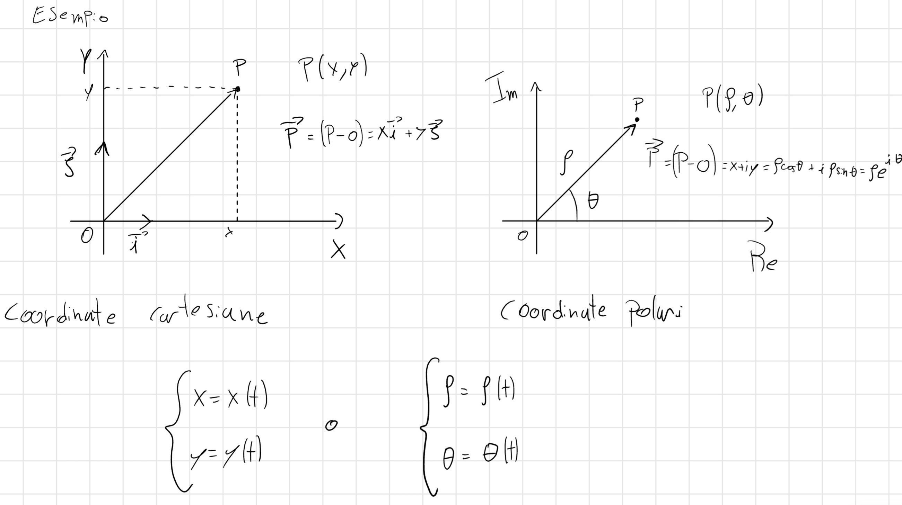

# Introduzione

Salve lettori, questa pagina è stata creata per riassumere o ampliare gli appunti che prendiamo a lezione, questi appunti possono servire per capire meglio l'argomento e non possono essere capiti completamente se non si seguono le lezioni. Se trovate errori o parti poco chiare vi prego di segnalarlo così provederemo a corregere. Buona lettura -NP

# Capitolo Uno: Cinematica

## 1.1 Cinematica del punto materiale

Nella cinematica del punto la cosa fondamentale da fare è:

1. Fissare un punto di riferimento.
2. Settare un numero di coordinate minimo per descrivere il movimento

Prova