# Introduzione

Salve lettori, questa pagina è stata creata per riassumere o ampliare gli appunti che prendiamo a lezione, questi appunti possono servire per capire meglio l'argomento e non possono essere capiti completamente se non si seguono le lezioni. Se trovate errori o parti poco chiare vi prego di segnalarlo così provederemo a corregere. Buona lettura -NP

# Capitolo Uno: Cinematica

## 1.1 Cinematica del punto materiale

Nella cinematica del punto la cosa fondamentale da fare è:

1. Fissare un punto di riferimento.
2. Settare un numero di coordinate minimo per descrivere il movimento

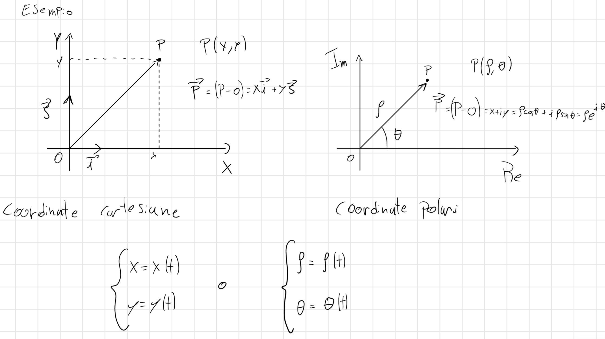

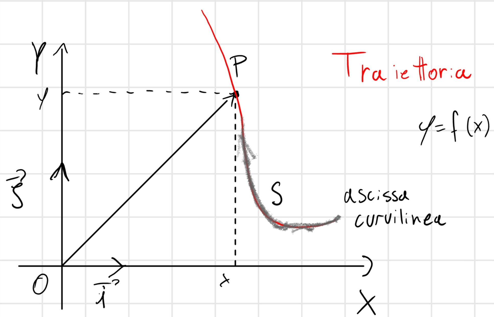

$$ \begin{cases}
y = f(x) \text{traiettoria} \\
s = s(t) \text{legge oraria}
\end{cases} $$

L'ascissa curvilinea descrive lo spostamento nel tempo, o la $\color{red}{legge \ oraria}$

**Altra Rappresentazione**

### Velocità

$\vec{v} = lim_{\Delta \to 0} \frac{\Delta \vec{P}}{\Delta t} = lim_{\Delta t \to  0} \frac{\vec{P}(t + \Delta t) - \vec{P}(t)}{\Delta t} = \frac{d \vec{P} (s(t))}{dt} = \frac{d \vec{P}}{ds} \cdot \frac{ds}{dt} = \dot{s} \frac{d \vec{P}}{ds} = \dot{s} \vec{t}$

N.B. Con $\vec{t}$ si intende la "tangente", nelle immagini si può trovare anche in versione t corsico con il simbolo di vettore sopra.

$lim_{\Delta t \to 0 (\Delta s \to 0)} |\frac{d\vec{P}}{ds}| = 1$

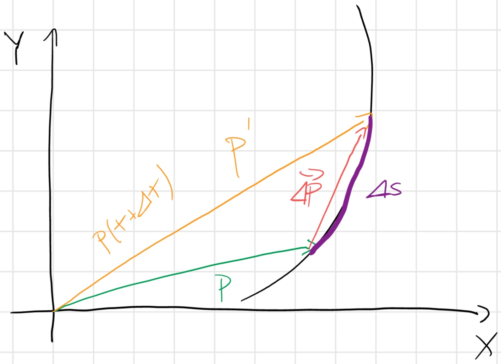

#### Fatal Error

**La velocità è SEMPRE tangente alla traiettoria.**

Dimostriamo questa cosa:

Ricordando che $i = e^{i \frac{\pi}{2}}$ in forma esponenziale.

$\vec{v} = \dot{\varrho} e^{i \theta} + \varrho i \dot{\theta} e^{i \theta} = \dot{\varrho} e^{i\theta} + \varrho \dot{\theta}e^{i(\theta + \frac{\pi}{2})}$

$v_x = \dot{x}$

$v_y = \dot{y}$

$\alpha = arctan (\frac{\dot{x}}{\dot{y}})$

$\vec{v} = v e^{i\alpha}$

$v = \sqrt{\dot{x}^2 + \dot{y}^2}$

$y = f(x)$

$tan \alpha = \frac{\dot{y}}{\dot{x}} = \frac{dy}{dt} \cdot \frac{dt}{dx} = \frac{dy}{dx} = f'(x)$

### Accelerazione

$\vec{a} = \frac{d \vec{v}}{dt} = \frac{d}{dt}(\dot{s} \frac{d \vec{P}}{ds}) = \ddot{s} \frac{d\vec{P}}{ds} + \dot{s} \frac{d}{dt}(\frac{d \vec{P}}{ds}) = \ddot{s}\vec{t} + \dot{s}^2 \frac{d^2\vec{P}}{ds^2} = \ddot{s}\vec{t} + \dot{s}^2\frac{\vec{n}}{\varrho}$, dove $\vec{n} =$ versore da $P$ al centro del cerchio osculatore e $\varrho =$ raggio osculatore.

Il cerchio osculatore condivide con la traiettoria 3 punti:

1. $P$.
2. $\vec{t}(\frac{d\vec{P}}{ds})$.
3. $c = \frac{1}{\varrho}$ con $c$ che indica la curvatura.

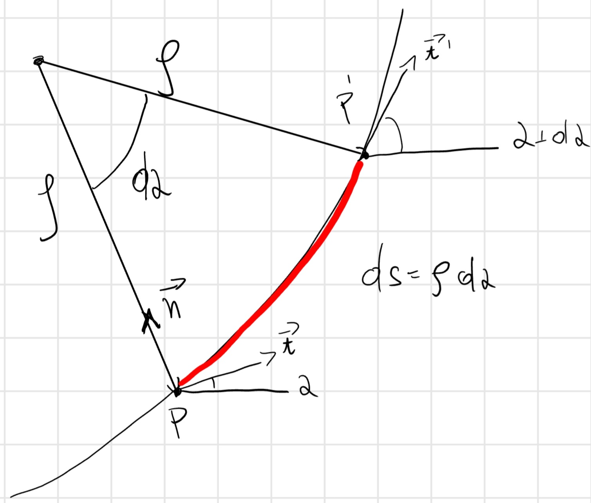

Dimostriamo che $\frac{d^2\vec{P}}{ds^2} = \frac{\vec{n}}{\varrho}$

$\frac{d^2\vec{P}}{ds^2} = \frac{d}{ds}\frac{d\vec{P}}{ds} = \frac{d\vec{t}}{ds} = lim_{\Delta s \to 0} \frac{\Delta \vec{t}}{\Delta s} = lim_{\Delta s \to 0} \frac{\vec{t'} - \vec{t}}{\Delta s} = \frac{d \alpha}{\varrho d \alpha} \vec{n} = \frac{\vec{n}}{\varrho}$

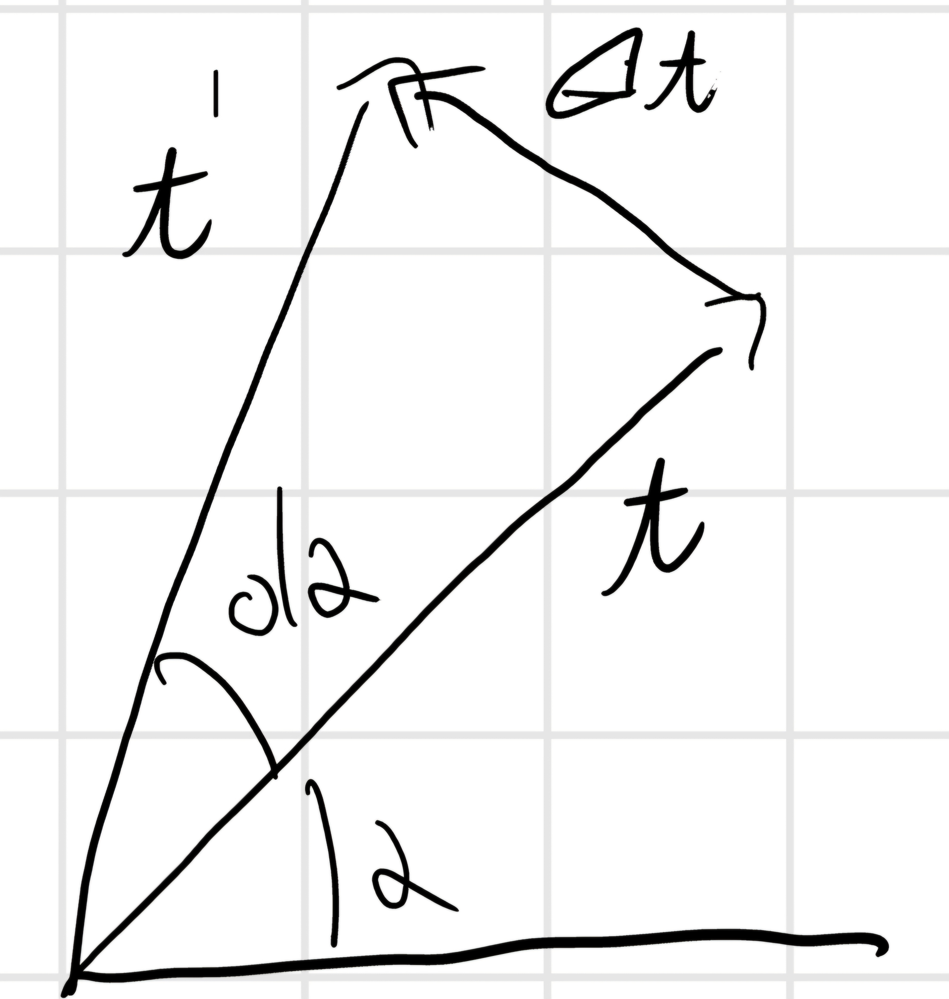

$|d\vec{t}| = |\vec{t}| d\alpha = d\alpha$

Quindi l'accelerazione è la somma di una componente tangenziale $a_t$ e una normale $a_n$.

$\vec{a} = a_t \vec{t} + a_n \vec{n}$

oppure è dcrivibile come:

$\vec{a} = \ddot{s} \vec{t} + \dot{s^2} \frac{\vec{n}}{\varrho} = \dot{v} + \frac{v^2}{\varrho}$

#### Fatal Error

L'accelerazione è **SEMPRE** composta da $\vec{a} = a_t \vec{t} + a_n \vec{n}$ quindi da accelerazione tangenziale e normale, solo in certi casi una delle due componenti si annulla.

Gli unici due casi sono:

- Rettilineo

$\varrho = \infty \implies a_n = 0$

- Uniforme

$v = \text{cost} \implies \dot{v} = 0 \implies a_t = 0$

## 1.2 Cinematica del corpo

Credo a sto punto sia ben chiaro che la prima parte di questa materia sarà sostanzialmente un ripasso di Fisica 1, introduciamo quindi un termine che potrebbe essere nuovo, l'**Atto di Moto**.

**Atto di Moto:** Valori della velocità che costituiscono un corpo in moto in un determinato istante di tempo.

### Spostamento Rigido

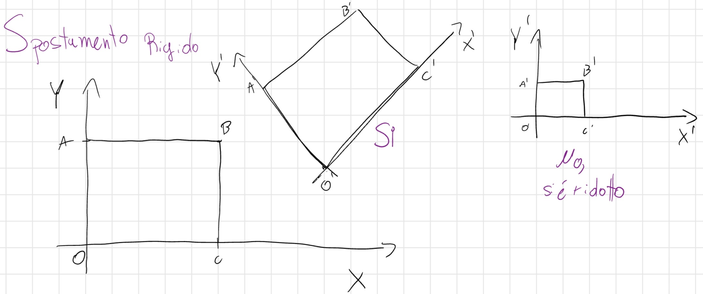

Uno spostamento si definisce rigido se posso trovare un nuovo sistema di riferimento da cui la posizione è la medesima rispetto a prima dello spostamento con il vecchio sistema di rifornimento, e senza che il corpo in se muti (si rompa, si riduca, si allarghi, esploda, etc...).

1. Per ogni spostamento, la lunghezza dei suoi componenti rimane invariata.
2. Per ogni spostamento, l'angolo formato per ogni coppia di componenti rimane invariato.

Il corpo rigido nel piano ha 3 **gradi di libertà (o gdl)** ovvero può muoversi liberamente in 3 direzioni, la coordinata $x$, la coordinata $y$ e l'angolo $\theta$ che forma con il sistema di riferimento, nello spazio il corpo rigido ha 6 gdl, oltre ai tre elencati ha coordinata $z$ e angolo dell'asse $\alpha$ che passa per il sio centro.

Ora vedremo una sequela di movimenti che il corpo rigido può fare:

### Tralsazione

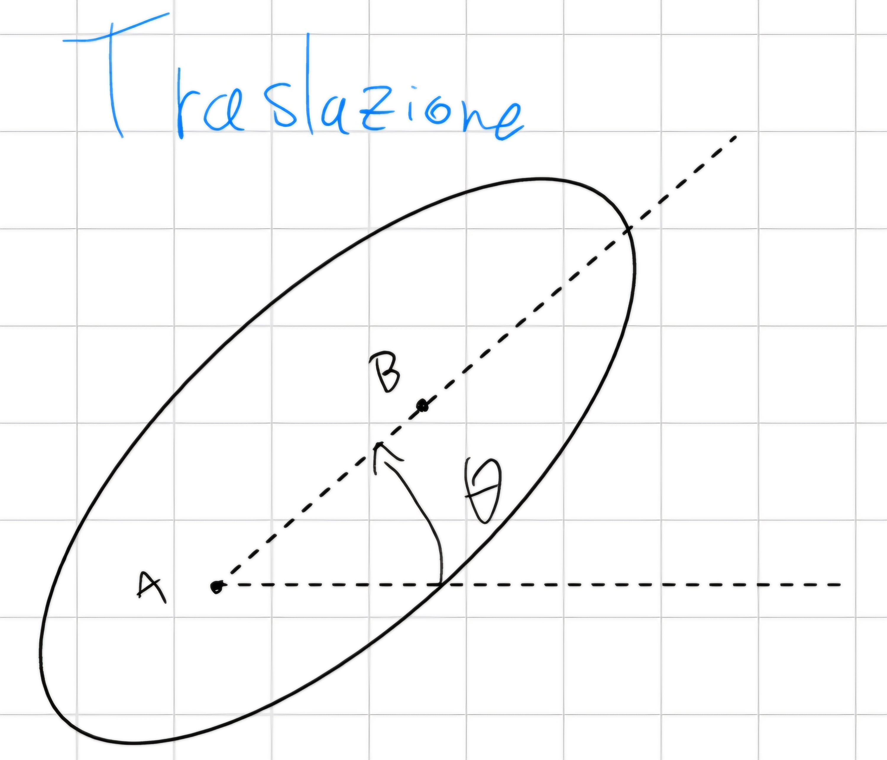

Cambiano le coordinate di $A$ e $B$ ma $\theta$ rimane costante, letteralmente trasla.

### Rotazione

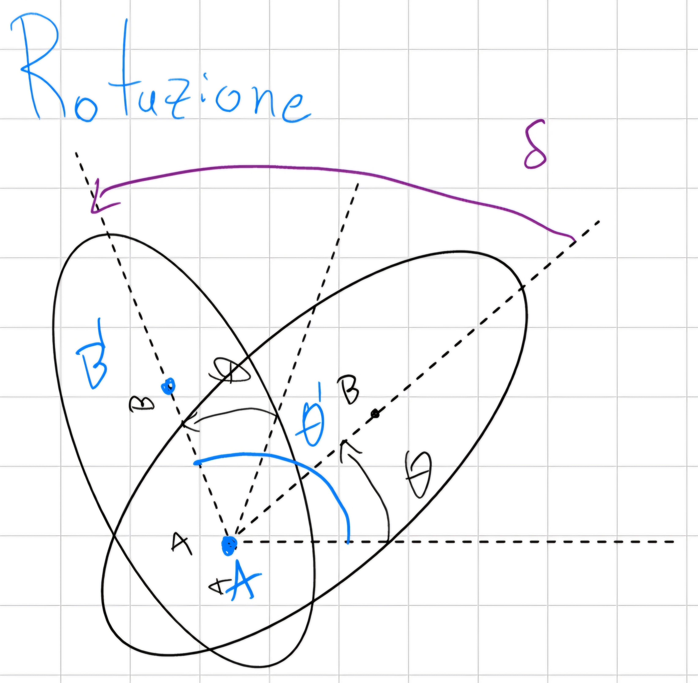

$\vec{\delta} = \delta \vec{k}$

Modifica la posizione mantenendo fisso un suo punto, es. $A$.

$A$ è chiamato **centro di rotazione.**

### Rototraslazione

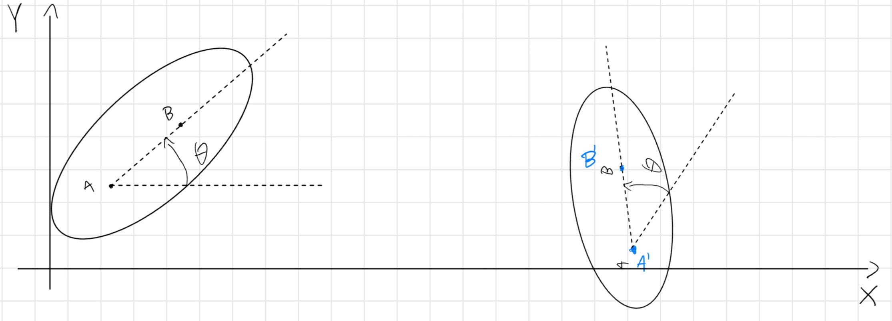

Varia posizione e angolo, si perde il centro di rotazione.

Questo movimento si analizza spezzetandolo nei due moti:

- Tralsazione.
- Rotazione

### Atto di moto

- Traslatorio

Se le componenti hanno velocità uguale in modulo, direzione e verso.

- Rotatorio

Se una componente ha una velocità a zero, quella componente viene chiamata **centro di istantanea rotazione**, può avere velocità $\not ={0}$ in un altro istante.

Il centro di rotazione ha velocità nulla per tutto il moto.

Se le velocità sono tutte diverse in modulo, direzione e verso, allora esiste un **CIR** attorno al quale sto ruotando.

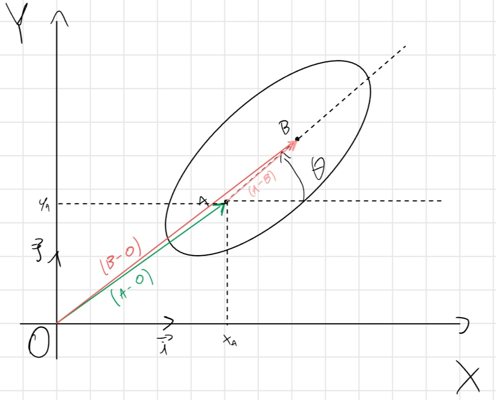

$(B - O) = (A - O) + (B - A)$

$(A - O) = x_A \vec{i} + y_A \vec{j}$

### Velocità

$\frac{d}{dt} (B - O) = \frac{d}{dt} (A - O) + \frac{d}{dt} (B - A)$

**Teorema di Rivals per le velocità**

$\vec{v_B} = \vec{v_A} + \overline{AB} i \dot{\theta} e^{i\theta} = \vec{v_A} + \overline{AB} \dot{\theta} e^{i(\theta + \frac{\pi}{2})}$

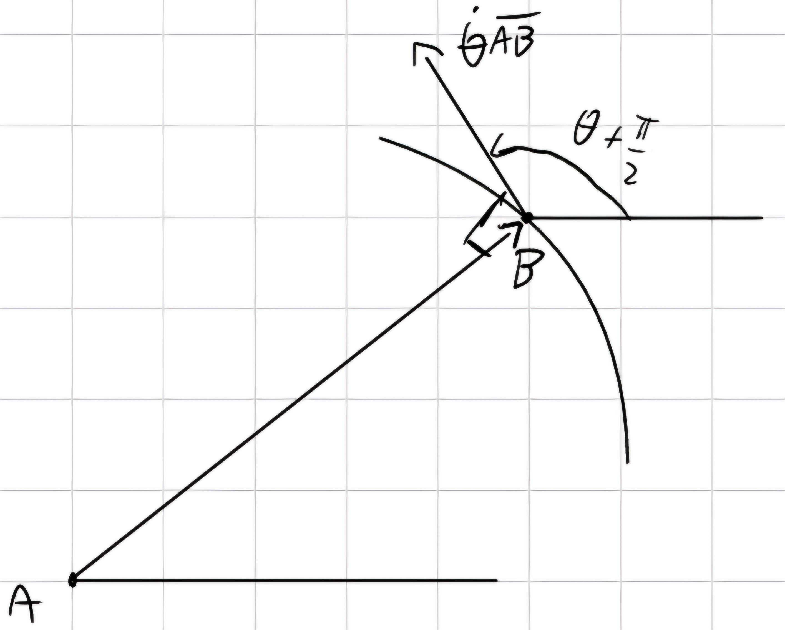

$\vec{w} = \dot{\theta} \vec{k} = w \vec{k} = w \overline{AB}$

$\vec{V_B} = \vec{V_A} + \vec{w} \times (B - A) = \vec{V_A} + \vec{V_B}$

### Accelerazione 

$\vec{a_B} = \vec{a_A} + \ddot{\theta}\overline{AB} e^{i(\theta + \frac{\pi}{2})} - \overline{AB} \dot{\theta^2}e^{i\theta}$

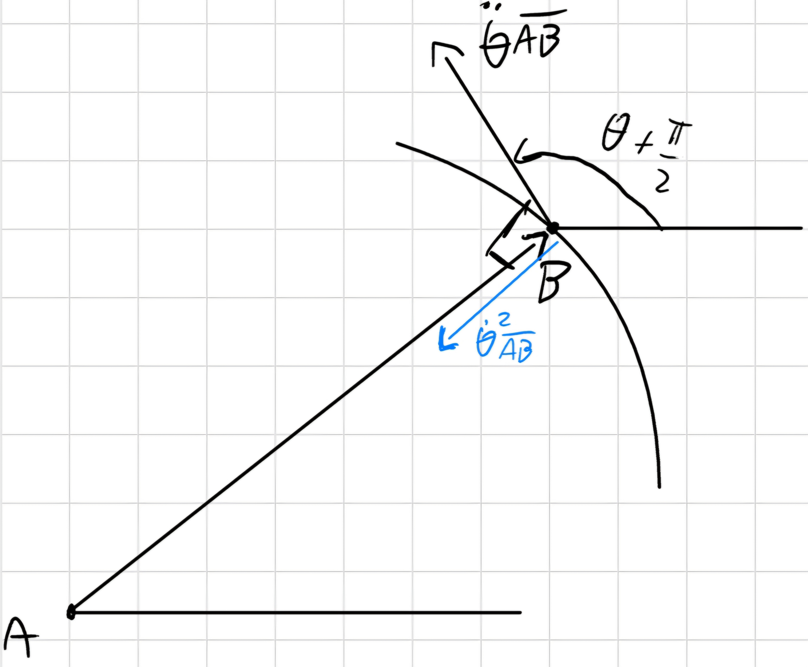

Ottengo:

- componente tangenziale: $\ddot{\theta} \overline{AB}$.
- componente normale: $- \dot{\theta^2} \overline{AB}$.

**Teorema di Rivals per le accelerazioni**

$\vec{a_B} = \vec{a_A} + \vec{a_{AB}}$

$\vec{a_B} = \vec{a_A} + \vec{a}_{AB}^{(t)} + \vec{a}_{AB}^{(n)}$

$\vec{a_B} = \vec{a_A} + \frac{d\vec{w}}{dt} \times (B - A) + \vec{w} \times \frac{d}{dt} (B - A) = \vec{a_A} + \dot{\vec{w}} \times (B - A) + \vec{w} \times [\vec{w} \times (B -A)]$

$\vec{a_B} = \vec{a_A} + \dot{\vec{w}} \times (B - A) - w^2 (B - A)$

## 1.3 Vincoli

Capitolo che raggruppa e presenta le varie tipologie di vincoli.

### Vincoli Tripli

#### Incastro

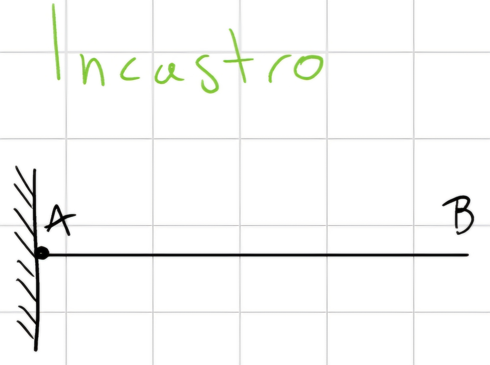

Il vincolo è triplo quindi vincola 3 gdl, che quindi impediscono i movimenti del piano, il corpo non ha più gradi di libertà.

Non può muoversi e non ruota.

$\begin{cases}
  x_A (t) = 0\\
  y_A (t) = 0\\
  \theta (t) = 0 
\end{cases}$

$\forall t$

$3$ condizioni di vincolo $- 3$ gradi di libertà $= 0$.

### Vincoli Doppi

#### Cerniera

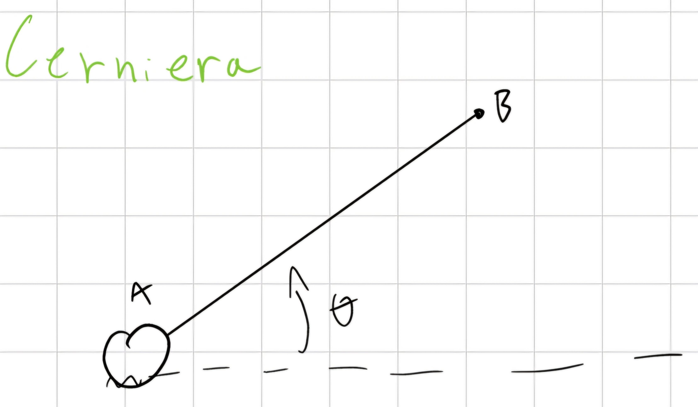

$\begin{cases}
   x_A (t) = 0\\
   y_A (t) = 0
\end{cases}$

$\forall t$, può ruotare $3$ gradi di libertà $- 2$ condizioni di vincolo $= 1$ grado di libertà.

#### Pattino

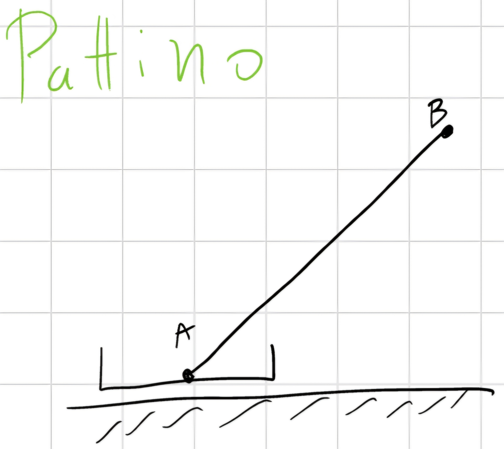

$\begin{cases}
    y_A (t) = 0\\
    \theta (t) = 0
\end{cases}$

$\forall t$, può muoversi parallelamente al piano, $3$ gradi di libertà $- 2$ condizioni di vincolo $= 1$ grado di libertà.

#### Manicotto

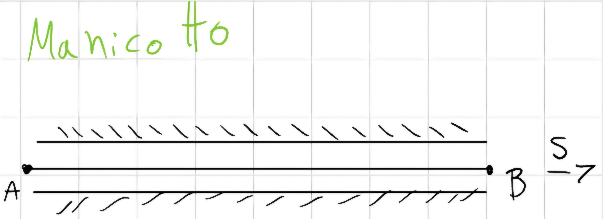

$\begin{cases}
  y_A (t) = 0\\
  \theta (t) = 0
\end{cases}$

$\forall t$, stessa cosa del pattino, in più nello spazio può ruotare sul proprio asse.

### Vincoli Singoli

#### Carrello

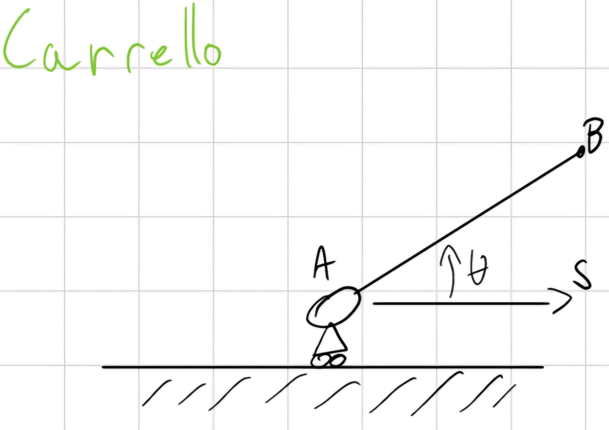

$\begin{cases}
  y_A (t) = 0
\end{cases}$

$\forall t$, $3$ gradi di libertà $- 1$ condizione di vincolo $= 2$ gradi di libertà rimanenti $s, \theta$.

Esempio di insiemi di vincoli:

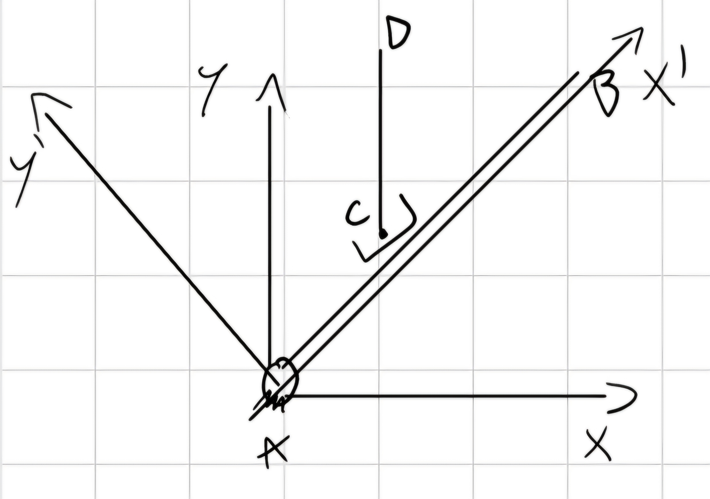

**Teorema dei moti relativi**

Asssegno un osservatore fisso in $A$ e uno mobile in $B$ che ruota con esso, scomponendo il moto rototraslatorio in due moti poù facili da analizzare.

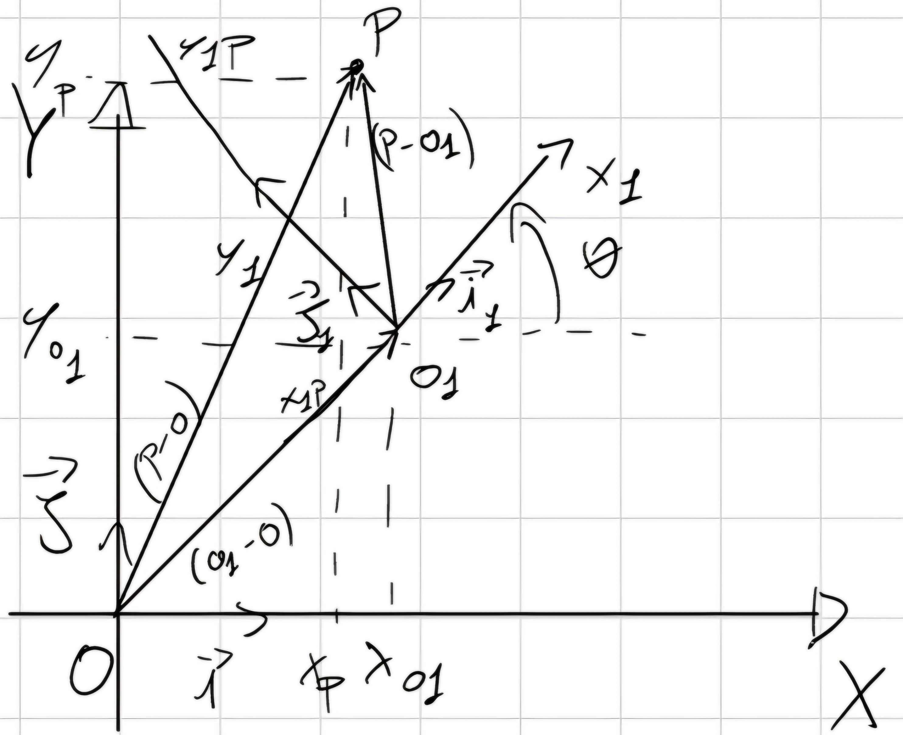

dati noti: $x_{O1} (t), y_{O1} (t), \theta (t)$

Si sa che il punto $P$ rispetto a $O$ è dato da: $(P - O) = (O_1 - O) + (P - O_1) \implies x_P\vec{i} + y_P\vec{j} = x_{O1}\vec{i} + y_{O1}\vec{j} + y_{P,1}\vec{i_1} + y_{P,1}\vec{j_1}$.

Questo è quello che si fa sostanzialmente con i moti relativi, si crea un Sistema di Riferimento fisso $(X,Y)$ e uno mobile $(X_1,Y_1)$ e si determina la posizione del punto $P$ nello spazio e nel tempo.

### Velocità

$\frac{d}{dt} (P - O) = \frac{d}{dt} (O_1 - O) + \frac{d}{dt} (P - O_1)$

$\dot{x_P}\vec{i} + \dot{y_P}\vec{j} = \dot{x_{O1}} \vec{i} +\dot{y_{O1}} \vec{j} + \dot{x_{P,1}} \vec{i_1} + \dot{y_{P,1}} \vec{j_1} + x_{P,1} \frac{d\vec{i_1}}{dt} + y_{P,1} \frac{d\vec{j_1}}{dt}$

$\vec{v_P} = \vec{v_{O1}} + \vec{v_{rel, P}} + \vec{w} \times (x_{P,1} \vec{i_1} + y_{P,1} \vec{j_1})$

$\vec{v_P} = \vec{v_{O1}} + \vec{v_{rel,P}} + \vec{w} \times (P - O_1)$

Per capire il valore $(P - O_1)$ c'è bisogno di un analisi con la scomposizione su $\vec{i_1}, \vec{j_1}$

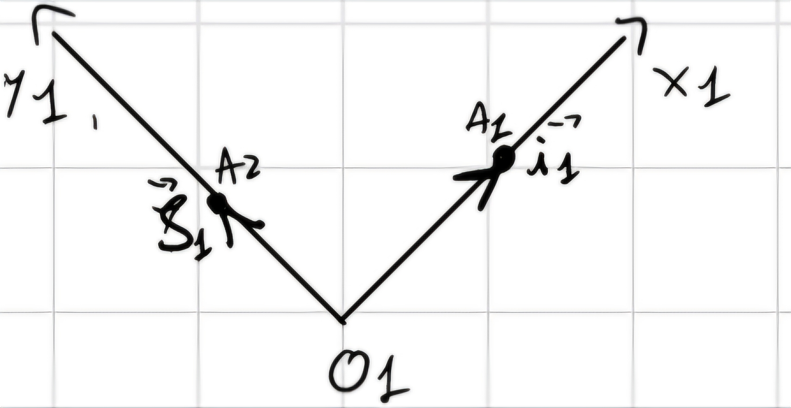

$|\overline{OA_1}| = |\overline{OA_2}| = 1$

$\begin{cases}
  A_1 - O_1 = \vec{i_1}\\
  A_2 - O_1 = \vec{j_1}
\end{cases}$

$\begin{cases}
  (A_1 - O) = (O_1 - O) + (A_1 - O_1)\\
  (A_2 - O) = (0_1 - O) + (A_2 - O_1)
\end{cases}$

$\frac{d}{dt} (A_1 - O) = \frac{d}{dt} (O_1 - O) + \frac{d}{dt} (A_1 - O_1)$

$\vec{v_{A_1}} = \vec{v_{O_1}} + \frac{d \vec{i_1}}{dt}$

Per Rivals $\vec{v_{A_1}} = \vec{v_{O_1}} + \vec{w} \times (A_1 - O_1) \implies \vec{v_{O_1}} + \vec{w} \times (A_1 - O_1) = \vec{v_{O_1}} + \frac{d \vec{i_1}}{dt}$

Da qui siamo arrivati alla soluzione che cercavamo con la scomposizione, questo si chiama **Poisson**.

$\frac{d \vec{i_1}}{dt} = \vec{w} \times \vec{i_1}$

$\frac{d \vec{j_1}}{dt} = \vec{w} \times \vec{j_1}$

La somma tra $v_{O_1} + \vec{w} \times (P - O_1)$ si chiama **velocità di trascinamento** o $\vec{v_{tr,P}} \implies \vec{v_P} = \vec{v_{tr,P}} + \vec{v_{rel,P}}$.

### Accelerazione

$\vec{a_P} = \frac{d \vec{v_P}}{dt} = \frac{d}{dt} \vec{v_{O_1}} + \frac{d}{dt}(\vec{w} \times (P - O_1)) + \frac{d}{dt} \vec{v_{rel,P}}$.

$d(\vec{w} \times (P - O_1)) = \frac{d \vec{w_1}}{dt} \times (P - O_1) + \vec{w} \times \frac{d}{dt} (P - O_1) \implies \vec{\dot{w}} \times (P - O_1) + \vec{w} \times v_{rel,P} + \vec{w} \times [\vec{w} \times (P - O_1)]$

$\frac{d v_{rel,P}}{dt} = \ddot{x_{P,1}} \vec{i_1} + \ddot{y_{P,1}} \vec{j_1} + \dot{x_{P,1}} \frac{d \vec{i_1}}{dt} + \dot{y_{P,1}} \frac{d \vec{j_1}}{dt}\\
= \vec{a_{rel,P}} + \dot{x_{P,1}} \vec{w} \times \vec{i_1} + \dot{y_{P,1}} \vec{w} \times \vec{j_1}\\
= \vec{a_{rel,P}} + \vec{w} \times (\dot{x_{P,1}} \vec{i_1} + \dot{y_{P,1}} \vec{j_1}) = \vec{a_{rel,P}} + \vec{w} \times \vec{v_{rel,P}}$

$\vec{a_P} = \vec{a_{O_1}} + \dot{\vec{w}} \times (P - O_1) + \vec{w} \times [\vec{w} \times (P - O_1)] + 2 \vec{w} \times \vec{v_{rel,P}} + \vec{a_{rel,P}} \implies a^{(t)} + a^{(n)} + 2 \vec{w} \times \vec{v_{rel,P}} + \vec{a_{rel,P}}$

Con $a^{(t)} =$ accelerazione tangeziale e $a^{(n)} =$ accelerazone normale.

**Teorema di Coriolis**

$\vec{a_P} = \vec{a_{tr,P}} + \vec{a_{rel,P}} + \vec{a_{co}}$

$\vec{a_{co}} =$ Accelerazione di Coriolis

$\vec{a_{co}} = 0$ in certi casi:

1. $\vec{w} // \vec{v_{rel,P}}$ (impossibile nel piano)
2. $\vec{w} = 0$
3. $\vec{v_{rel,P}} = 0$

# Capitolo Due: I sistemi meccanici

**Sistema meccanico:** insieme di corpi rigidi vincolati tra loro e vincolati a un corpo esterno fisso, chiamato **telaio**.

# Capitolo Fatal Error

Capitolo in cui si raggruppano tutti i Fatal Error del corso, errori che possono comportare la bocciatura.

- **La velocità è SEMPRE tangente alla traiettoria.**
- **L'accelerazione è SEMPRE composta da $\vec{a} = a_t \vec{t} + a_n \vec{n}$ quindi da accelerazione tangenziale e normale, solo in certi casi una delle due componenti si annulla.**