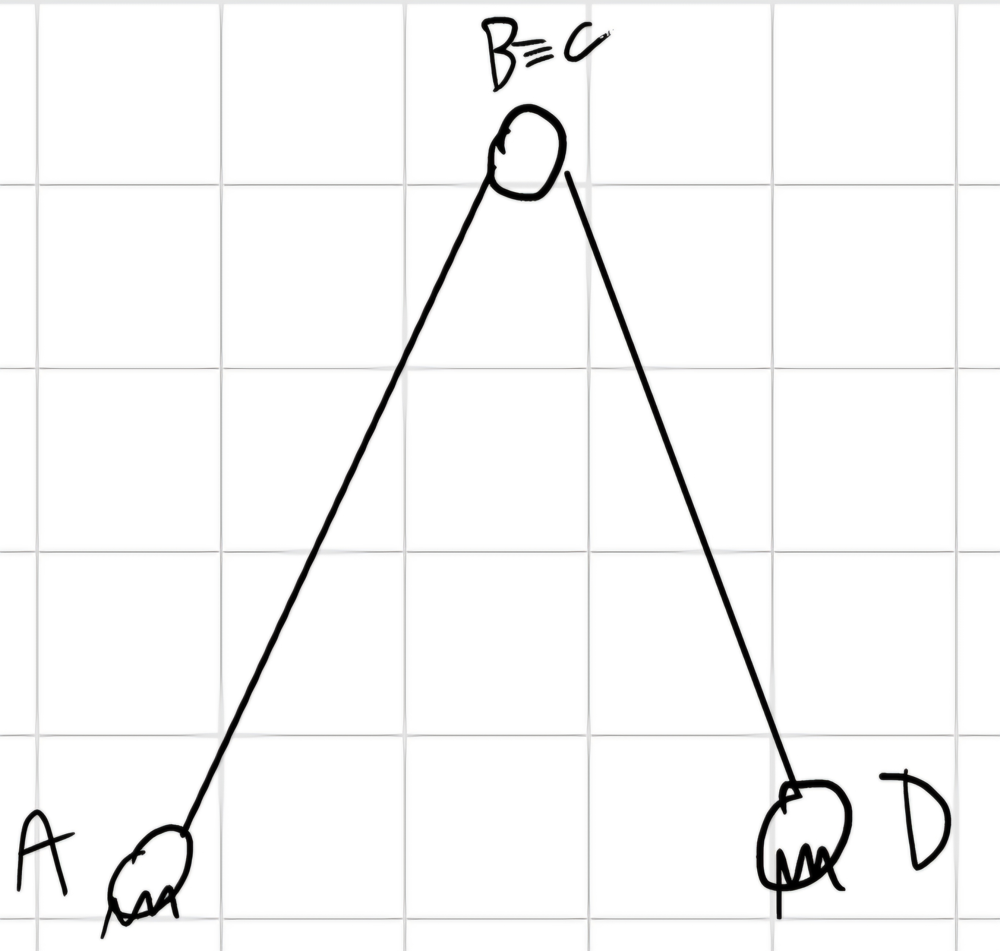

# Introduzione

Salve lettori, questa pagina è stata creata per riassumere o ampliare gli appunti che prendiamo a lezione, questi appunti possono servire per capire meglio l'argomento e non possono essere capiti completamente se non si seguono le lezioni. Se trovate errori o parti poco chiare vi prego di segnalarlo così provederemo a corregere. Buona lettura -NP

# Capitolo Uno: Cinematica

## 1.1 Cinematica del punto materiale

Nella cinematica del punto la cosa fondamentale da fare è:

1. Fissare un punto di riferimento.
2. Settare un numero di coordinate minimo per descrivere il movimento

$$ \begin{cases}
y = f(x) \text{traiettoria} \\
s = s(t) \text{legge oraria}
\end{cases} $$

L'ascissa curvilinea descrive lo spostamento nel tempo, o la $\color{red}{legge \ oraria}$

**Altra Rappresentazione**

### Velocità

$\vec{v} = lim_{\Delta \to 0} \frac{\Delta \vec{P}}{\Delta t} = lim_{\Delta t \to  0} \frac{\vec{P}(t + \Delta t) - \vec{P}(t)}{\Delta t} = \frac{d \vec{P} (s(t))}{dt} = \frac{d \vec{P}}{ds} \cdot \frac{ds}{dt} = \dot{s} \frac{d \vec{P}}{ds} = \dot{s} \vec{t}$

N.B. Con $\vec{t}$ si intende la "tangente", nelle immagini si può trovare anche in versione t corsico con il simbolo di vettore sopra.

$lim_{\Delta t \to 0 (\Delta s \to 0)} |\frac{d\vec{P}}{ds}| = 1$

#### Fatal Error

**La velocità è SEMPRE tangente alla traiettoria.**

Dimostriamo questa cosa:

Ricordando che $i = e^{i \frac{\pi}{2}}$ in forma esponenziale.

$\vec{v} = \dot{\varrho} e^{i \theta} + \varrho i \dot{\theta} e^{i \theta} = \dot{\varrho} e^{i\theta} + \varrho \dot{\theta}e^{i(\theta + \frac{\pi}{2})}$

$v_x = \dot{x}$

$v_y = \dot{y}$

$\alpha = arctan (\frac{\dot{x}}{\dot{y}})$

$\vec{v} = v e^{i\alpha}$

$v = \sqrt{\dot{x}^2 + \dot{y}^2}$

$y = f(x)$

$tan \alpha = \frac{\dot{y}}{\dot{x}} = \frac{dy}{dt} \cdot \frac{dt}{dx} = \frac{dy}{dx} = f'(x)$

### Accelerazione

$\vec{a} = \frac{d \vec{v}}{dt} = \frac{d}{dt}(\dot{s} \frac{d \vec{P}}{ds}) = \ddot{s} \frac{d\vec{P}}{ds} + \dot{s} \frac{d}{dt}(\frac{d \vec{P}}{ds}) = \ddot{s}\vec{t} + \dot{s}^2 \frac{d^2\vec{P}}{ds^2} = \ddot{s}\vec{t} + \dot{s}^2\frac{\vec{n}}{\varrho}$, dove $\vec{n} =$ versore da $P$ al centro del cerchio osculatore e $\varrho =$ raggio osculatore.

Il cerchio osculatore condivide con la traiettoria 3 punti:

1. $P$.
2. $\vec{t}(\frac{d\vec{P}}{ds})$.
3. $c = \frac{1}{\varrho}$ con $c$ che indica la curvatura.

Dimostriamo che $\frac{d^2\vec{P}}{ds^2} = \frac{\vec{n}}{\varrho}$

$\frac{d^2\vec{P}}{ds^2} = \frac{d}{ds}\frac{d\vec{P}}{ds} = \frac{d\vec{t}}{ds} = lim_{\Delta s \to 0} \frac{\Delta \vec{t}}{\Delta s} = lim_{\Delta s \to 0} \frac{\vec{t'} - \vec{t}}{\Delta s} = \frac{d \alpha}{\varrho d \alpha} \vec{n} = \frac{\vec{n}}{\varrho}$

$|d\vec{t}| = |\vec{t}| d\alpha = d\alpha$

Quindi l'accelerazione è la somma di una componente tangenziale $a_t$ e una normale $a_n$.

$\vec{a} = a_t \vec{t} + a_n \vec{n}$

oppure è dcrivibile come:

$\vec{a} = \ddot{s} \vec{t} + \dot{s^2} \frac{\vec{n}}{\varrho} = \dot{v} + \frac{v^2}{\varrho}$

#### Fatal Error

L'accelerazione è **SEMPRE** composta da $\vec{a} = a_t \vec{t} + a_n \vec{n}$ quindi da accelerazione tangenziale e normale, solo in certi casi una delle due componenti si annulla.

Gli unici due casi sono:

- Rettilineo

$\varrho = \infty \implies a_n = 0$

- Uniforme

$v = \text{cost} \implies \dot{v} = 0 \implies a_t = 0$

## 1.2 Cinematica del corpo

Credo a sto punto sia ben chiaro che la prima parte di questa materia sarà sostanzialmente un ripasso di Fisica 1, introduciamo quindi un termine che potrebbe essere nuovo, l'**Atto di Moto**.

**Atto di Moto:** Valori della velocità che costituiscono un corpo in moto in un determinato istante di tempo.

### Spostamento Rigido

Uno spostamento si definisce rigido se posso trovare un nuovo sistema di riferimento da cui la posizione è la medesima rispetto a prima dello spostamento con il vecchio sistema di rifornimento, e senza che il corpo in se muti (si rompa, si riduca, si allarghi, esploda, etc...).

1. Per ogni spostamento, la lunghezza dei suoi componenti rimane invariata.
2. Per ogni spostamento, l'angolo formato per ogni coppia di componenti rimane invariato.

Il corpo rigido nel piano ha 3 **gradi di libertà (o gdl)** ovvero può muoversi liberamente in 3 direzioni, la coordinata $x$, la coordinata $y$ e l'angolo $\theta$ che forma con il sistema di riferimento, nello spazio il corpo rigido ha 6 gdl, oltre ai tre elencati ha coordinata $z$ e angolo dell'asse $\alpha$ che passa per il sio centro.

Ora vedremo una sequela di movimenti che il corpo rigido può fare:

### Tralsazione

Cambiano le coordinate di $A$ e $B$ ma $\theta$ rimane costante, letteralmente trasla.

### Rotazione

$\vec{\delta} = \delta \vec{k}$

Modifica la posizione mantenendo fisso un suo punto, es. $A$.

$A$ è chiamato **centro di rotazione.**

### Rototraslazione

Varia posizione e angolo, si perde il centro di rotazione.

Questo movimento si analizza spezzetandolo nei due moti:

- Tralsazione.
- Rotazione

### Atto di moto

- Traslatorio

Se le componenti hanno velocità uguale in modulo, direzione e verso.

- Rotatorio

Se una componente ha una velocità a zero, quella componente viene chiamata **centro di istantanea rotazione**, può avere velocità $\not ={0}$ in un altro istante.

Il centro di rotazione ha velocità nulla per tutto il moto.

Se le velocità sono tutte diverse in modulo, direzione e verso, allora esiste un **CIR** attorno al quale sto ruotando.

$(B - O) = (A - O) + (B - A)$

$(A - O) = x_A \vec{i} + y_A \vec{j}$

### Velocità

$\frac{d}{dt} (B - O) = \frac{d}{dt} (A - O) + \frac{d}{dt} (B - A)$

**Teorema di Rivals per le velocità**

$\vec{v_B} = \vec{v_A} + \overline{AB} i \dot{\theta} e^{i\theta} = \vec{v_A} + \overline{AB} \dot{\theta} e^{i(\theta + \frac{\pi}{2})}$

$\vec{w} = \dot{\theta} \vec{k} = w \vec{k} = w \overline{AB}$

$\vec{V_B} = \vec{V_A} + \vec{w} \times (B - A) = \vec{V_A} + \vec{V_B}$

### Accelerazione 

$\vec{a_B} = \vec{a_A} + \ddot{\theta}\overline{AB} e^{i(\theta + \frac{\pi}{2})} - \overline{AB} \dot{\theta^2}e^{i\theta}$

Ottengo:

- componente tangenziale: $\ddot{\theta} \overline{AB}$.
- componente normale: $- \dot{\theta^2} \overline{AB}$.

**Teorema di Rivals per le accelerazioni**

$\vec{a_B} = \vec{a_A} + \vec{a_{AB}}$

$\vec{a_B} = \vec{a_A} + \vec{a}_{AB}^{(t)} + \vec{a}_{AB}^{(n)}$

$\vec{a_B} = \vec{a_A} + \frac{d\vec{w}}{dt} \times (B - A) + \vec{w} \times \frac{d}{dt} (B - A) = \vec{a_A} + \dot{\vec{w}} \times (B - A) + \vec{w} \times [\vec{w} \times (B -A)]$

$\vec{a_B} = \vec{a_A} + \dot{\vec{w}} \times (B - A) - w^2 (B - A)$

## 1.3 Vincoli

Capitolo che raggruppa e presenta le varie tipologie di vincoli.

### Vincoli Tripli

#### Incastro

Il vincolo è triplo quindi vincola 3 gdl, che quindi impediscono i movimenti del piano, il corpo non ha più gradi di libertà.

Non può muoversi e non ruota.

$\begin{cases}
  x_A (t) = 0\\
  y_A (t) = 0\\
  \theta (t) = 0 
\end{cases}$

$\forall t$

$3$ condizioni di vincolo $- 3$ gradi di libertà $= 0$.

### Vincoli Doppi

#### Cerniera

$\begin{cases}
   x_A (t) = 0\\
   y_A (t) = 0
\end{cases}$

$\forall t$, può ruotare $3$ gradi di libertà $- 2$ condizioni di vincolo $= 1$ grado di libertà.

#### Pattino

$\begin{cases}
    y_A (t) = 0\\
    \theta (t) = 0
\end{cases}$

$\forall t$, può muoversi parallelamente al piano, $3$ gradi di libertà $- 2$ condizioni di vincolo $= 1$ grado di libertà.

#### Manicotto

$\begin{cases}
  y_A (t) = 0\\
  \theta (t) = 0
\end{cases}$

$\forall t$, stessa cosa del pattino, in più nello spazio può ruotare sul proprio asse.

### Vincoli Singoli

#### Carrello

$\begin{cases}
  y_A (t) = 0
\end{cases}$

$\forall t$, $3$ gradi di libertà $- 1$ condizione di vincolo $= 2$ gradi di libertà rimanenti $s, \theta$.

Esempio di insiemi di vincoli:

**Teorema dei moti relativi**

Asssegno un osservatore fisso in $A$ e uno mobile in $B$ che ruota con esso, scomponendo il moto rototraslatorio in due moti poù facili da analizzare.

dati noti: $x_{O1} (t), y_{O1} (t), \theta (t)$

Si sa che il punto $P$ rispetto a $O$ è dato da: $(P - O) = (O_1 - O) + (P - O_1) \implies x_P\vec{i} + y_P\vec{j} = x_{O1}\vec{i} + y_{O1}\vec{j} + y_{P,1}\vec{i_1} + y_{P,1}\vec{j_1}$.

Questo è quello che si fa sostanzialmente con i moti relativi, si crea un Sistema di Riferimento fisso $(X,Y)$ e uno mobile $(X_1,Y_1)$ e si determina la posizione del punto $P$ nello spazio e nel tempo.

### Velocità

$\frac{d}{dt} (P - O) = \frac{d}{dt} (O_1 - O) + \frac{d}{dt} (P - O_1)$

$\dot{x_P}\vec{i} + \dot{y_P}\vec{j} = \dot{x_{O1}} \vec{i} +\dot{y_{O1}} \vec{j} + \dot{x_{P,1}} \vec{i_1} + \dot{y_{P,1}} \vec{j_1} + x_{P,1} \frac{d\vec{i_1}}{dt} + y_{P,1} \frac{d\vec{j_1}}{dt}$

$\vec{v_P} = \vec{v_{O1}} + \vec{v_{rel, P}} + \vec{w} \times (x_{P,1} \vec{i_1} + y_{P,1} \vec{j_1})$

$\vec{v_P} = \vec{v_{O1}} + \vec{v_{rel,P}} + \vec{w} \times (P - O_1)$

Per capire il valore $(P - O_1)$ c'è bisogno di un analisi con la scomposizione su $\vec{i_1}, \vec{j_1}$

$|\overline{OA_1}| = |\overline{OA_2}| = 1$

$\begin{cases}
  A_1 - O_1 = \vec{i_1}\\
  A_2 - O_1 = \vec{j_1}
\end{cases}$

$\begin{cases}
  (A_1 - O) = (O_1 - O) + (A_1 - O_1)\\
  (A_2 - O) = (0_1 - O) + (A_2 - O_1)
\end{cases}$

$\frac{d}{dt} (A_1 - O) = \frac{d}{dt} (O_1 - O) + \frac{d}{dt} (A_1 - O_1)$

$\vec{v_{A_1}} = \vec{v_{O_1}} + \frac{d \vec{i_1}}{dt}$

Per Rivals $\vec{v_{A_1}} = \vec{v_{O_1}} + \vec{w} \times (A_1 - O_1) \implies \vec{v_{O_1}} + \vec{w} \times (A_1 - O_1) = \vec{v_{O_1}} + \frac{d \vec{i_1}}{dt}$

Da qui siamo arrivati alla soluzione che cercavamo con la scomposizione, questo si chiama **Poisson**.

$\frac{d \vec{i_1}}{dt} = \vec{w} \times \vec{i_1}$

$\frac{d \vec{j_1}}{dt} = \vec{w} \times \vec{j_1}$

La somma tra $v_{O_1} + \vec{w} \times (P - O_1)$ si chiama **velocità di trascinamento** o $\vec{v_{tr,P}} \implies \vec{v_P} = \vec{v_{tr,P}} + \vec{v_{rel,P}}$.

### Accelerazione

$\vec{a_P} = \frac{d \vec{v_P}}{dt} = \frac{d}{dt} \vec{v_{O_1}} + \frac{d}{dt}(\vec{w} \times (P - O_1)) + \frac{d}{dt} \vec{v_{rel,P}}$.

$d(\vec{w} \times (P - O_1)) = \frac{d \vec{w_1}}{dt} \times (P - O_1) + \vec{w} \times \frac{d}{dt} (P - O_1) \implies \vec{\dot{w}} \times (P - O_1) + \vec{w} \times v_{rel,P} + \vec{w} \times [\vec{w} \times (P - O_1)]$

$\frac{d v_{rel,P}}{dt} = \ddot{x_{P,1}} \vec{i_1} + \ddot{y_{P,1}} \vec{j_1} + \dot{x_{P,1}} \frac{d \vec{i_1}}{dt} + \dot{y_{P,1}} \frac{d \vec{j_1}}{dt}\\
= \vec{a_{rel,P}} + \dot{x_{P,1}} \vec{w} \times \vec{i_1} + \dot{y_{P,1}} \vec{w} \times \vec{j_1}\\
= \vec{a_{rel,P}} + \vec{w} \times (\dot{x_{P,1}} \vec{i_1} + \dot{y_{P,1}} \vec{j_1}) = \vec{a_{rel,P}} + \vec{w} \times \vec{v_{rel,P}}$

$\vec{a_P} = \vec{a_{O_1}} + \dot{\vec{w}} \times (P - O_1) + \vec{w} \times [\vec{w} \times (P - O_1)] + 2 \vec{w} \times \vec{v_{rel,P}} + \vec{a_{rel,P}} \implies a^{(t)} + a^{(n)} + 2 \vec{w} \times \vec{v_{rel,P}} + \vec{a_{rel,P}}$

Con $a^{(t)} =$ accelerazione tangeziale e $a^{(n)} =$ accelerazone normale.

**Teorema di Coriolis**

$\vec{a_P} = \vec{a_{tr,P}} + \vec{a_{rel,P}} + \vec{a_{co}}$

$\vec{a_{co}} =$ Accelerazione di Coriolis

$\vec{a_{co}} = 0$ in certi casi:

1. $\vec{w} // \vec{v_{rel,P}}$ (impossibile nel piano)
2. $\vec{w} = 0$
3. $\vec{v_{rel,P}} = 0$

# Capitolo Due: I sistemi meccanici

**Sistema meccanico:** insieme di corpi rigidi vincolati tra loro e vincolati a un corpo esterno fisso, chiamato **telaio**.

**Grübler**

Hp:

- Sistema piano.
- Vincoli connettono al più 2 corpi.

**Calcolo gradi di libertà:** $n = n_0 - n_v = 3n_c - (1n_1 + 2n_2 +3n_3)$

con $n_c =$ numero di corpi rigidi, $n_1 =$ numero vincoli singoli, $n_2 =$ numero vincoli doppi e $n_3 =$ numero vincoli tripli.

## 2.1 Esempi e definizioni

$n_c = 2 \implies n = 3n_c = 6$ gdl.

$n_v = 2*2 = 4 \implies n = 3*2 - 4 = 2$ gdl, $\alpha, \beta$

$n_v = 2*2 + 1*1 = 5 \implies n = 6 - 5 = 1$ gdl, $\alpha \lor c$

$n_v = 2*3 = 6 \implies n = 6 - 6 = 0$ gdl, $n_v = n_0$

$n_v = 2*2 + 3*1 = 7 \implies n = 6 - 7 = 0$gdl, $n_v > n_0$

### Nomenclatura

- $n = 0$ gdl $\implies$ **Struttura.**
- $n \geq 1$ gdl $\implies$ **Meccanismo.**
- $n_v = n_0 \implies$ **Isostatica.**
- $n_v > n_0 \implies$ **Iperstatica.**

 Anche il meccanismo si può identificare in due sottoclassi:

 - Catena cinematica aperta: Ogni corpo (telaio incluso) è sempre connesso al corpo che lo precede o al corpo che lo segue.
 - Catena cinematica chiusa: Ogni corpo (telaio incluso) è sempre connesso al corpo che lo precede e al corpo che lo segue.

Su una catena chiusa ho un **equazione di chiusura,** derivandola rispetto al tempo posso avere: posizione, velocità e accelerazione di ogni corpo.

## 2.2 Selective Compliance Assembly Robot Arm (SCARA)

$2$ gdl $: \alpha, \beta \to \alpha (t), \beta (t)$

$(B - O) = (A - O) + (B - A)$

N.B. Qui **NON** abbiamo alcuna equazone di chiusura perchè non ho corpi che chiudono il meccanismo.

Qui procederemo con la solita procedura per trovare *posizione, velocità e accelerazione* quindi se non si vuole rivedere tutta la procedura skippate direttamente ai capitoli desiderati e avrete la formula.

Intato guardiamo tutto con la forma più elegante e bella che sia mai stata inventata, la forma complessa: $(B - O) = ae^{i\alpha} + be^{i(\alpha + \beta)}$

### Posizione

$\begin{cases}
  x_B = a cos (\alpha) + b cos (\alpha + \beta)\\
  y_B = a sin (\alpha) + b sin (\alpha + \beta)
\end{cases}$

### Velocità

$\vec{v_B} = a \dot{\alpha} e^{i (\alpha + \frac{\pi}{2})} + b (\dot{\alpha} + \dot{\beta})e^{i(\alpha + \beta \frac{\pi}{2})}$

$\begin{cases}
  \vec{v_{X,B}} = -a \dot{\alpha} sin(\alpha) - b (\dot{\alpha} + \dot{\beta}) sin (\alpha + \beta)\\
  \vec{v_{Y,B}} = a \dot{\alpha} cos (\alpha) + b (\dot{\alpha} + \dot{\beta}) cos (\alpha + \beta)
\end{cases}$

Ora approccio differente, proviamo a derivare la velocità usando i moti relativi.

$\vec{v_B} = \vec{v_{tr,B}} + \vec{v_{rel,B}}$

Introduco un sistema di riferimento mobile in $A$, vedendolo come un moto circolatorio con velocità angolare $\vec{w}$.

Sapendo che nella terna traslante $w_t = 0$

$\vec{v_{tr,B}} = \vec{v_A} + \cancel{\vec{w_t} \times (B - A)} \implies a \dot{\alpha} e^{i(\alpha + \frac{\pi}{2})}$

$\vec{v_{rel,B}} = \vec{w_{BA}} \times (B - A) \implies b(\dot{\alpha} + \dot{\beta}) e^{i(\alpha + \beta + \frac{\pi}{2})}$

$\vec{v_B} = a \dot{\alpha}e^{i(\alpha + \frac{\pi}{2})} + b(\dot{\alpha} + \dot{\beta}) e^{i(\alpha + \beta + \frac{\pi}{2})}$

### Accelerazione

$\vec{a_B} = a \ddot{\alpha}e^{i(\alpha + \frac{\pi}{2})} - a \dot{\alpha^2} e^{i\alpha} + b(\ddot{\alpha} + \ddot{\beta})e^{i (\alpha + \beta + \frac{\pi}{2})} - b(\dot{\alpha} + \dot{\beta})^2 e^{i(\alpha + \beta)}$

$\begin{cases}
  \ddot{x_B} = -a\ddot{\alpha} sin (\alpha) - a \dot{\alpha^2} cos(\alpha) - b (\ddot{\alpha} + \ddot{\beta}) sin (\alpha + \beta) - b (\dot{\alpha} + \dot{\beta})^2 cos(\alpha + \beta)\\
  \ddot{y_B} = a \ddot{\alpha} cos (\alpha) - a \dot{\alpha^2} sin (\alpha) + b (\ddot{\alpha} + \ddot{\beta}) cos (\alpha + \beta) - b (\dot{\alpha} + \dot{\beta})^2 sin (\alpha + \beta)
\end{cases}$

$\vec{a_B} = \ddot{x_B} \vec{i} + \ddot{y_B} \vec{j}$

Come prima abbiamo derivato la velocità anche con i moti relativi qui proveremo a ricavare l'accelerazione con il Teorema di Coriolis.

$\vec{a_B} = \vec{a_{tr,B}} + \vec{a_{rel,B}} + \cancel{\vec{a_{co}}}$

$\vec{a_{co}} = 2 \vec{w_t} \times \vec{v_rel,B} = \vec{0} \implies \vec{w_t} = 0 \implies \dot{\vec{w_t}} = 0$

$\vec{a_{tr,B}} = \vec{a_A} + \cancel{\dot{\vec{w_t}} \times (B - A)} + \cancel{\vec{w_t} \times \vec{w_t} \times (B - A)} \implies \dot{\vec{w_{AO}}} \times (A - O) + \vec{w_{AO}} \times \vec{w_{AO}} \times (A - O)$

$\vec{a_{rel,B}} = \dot{\vec{w_{AB}}} \times (B - A) + \vec{w_{AB}} \times \vec{w_{AB}} \times (B - A)$

$\vec{a_B} = \vec{a_{tr,B}^{(t)}} + \vec{a_{tr,B}^{(n)}} + \vec{a_{rel,B}^{(t)}} + \vec{a_{rel,B}^{(n)}}$

$\vec{a_B} = a \ddot{\alpha}e^{i(\alpha + \frac{\pi}{2})} - a \dot{\alpha^2} e^{i\alpha} + b (\ddot{\alpha} + \ddot{\beta})e^{i(\alpha + \beta \frac{\pi}{2})} - b(\dot{\alpha} + \dot{\beta})^2 e^{i (\alpha + \beta)}$

## 2.3 Manovellismo

$n_c = 3$

$n_0 = 3*3 = 9$

$n_v = 4*2 = 8 \implies n = 1$ gdl

Questo sistema meccanico può essere schematizzato anche come:

### Manovellismo ordinario centrato

$n_c = 2, n_0 = 6, n_v = 2*2 + 1 = 5 \implies n = 1$ gdl

Si può notare che cambiamo il punto di vista del numero dei corpi e dei vincoli ma i gradi di libertà rimangono invariati.

### Manovellismo ordinario deviato

In questo corso tratteremo principalmente "manovellismo ordinario centrato".

### Esempio

Consideriamo un manovellismo ordinario centrato.

Noti $\alpha (t), \dot{\alpha} (t), \ddot{\alpha} (t)$

Si vogliono cercare $\vec{v_B}, \vec{a_B}, \dot{\beta}. \ddot{\beta}$

### Posizione

Per studiarne il movimento cercando i dati richiesti, guarderemo il sistema guardando i punti da lui raggiungibili, partiamo dal **punto morto esterno (PME)**.

$\alpha = 0, c = c_{MAX} = a + b, v_B = 0, |a_B| = |a_{MAX}|$

Ora quando $\alpha = \frac{\pi}{2}$

Abbiamo che $|v_B| \approx |v_{MAX}|$

Questa apprissimazione è vera quanto più il **rapporto caratteristico del manovellismo** $\lambda = \frac{a}{b}$ è più piccolo di 1.

$\delta \in (-\frac{\pi}{2}; \frac{\pi}{2})$

$\beta = 2 \pi - \delta$

Inoltre sappiamo che in questa figura $cos(\beta) > 0$ sempre.

Ora guardiamo quando ci troviamo nel **punto morto interno(PMI)**

$c = c_{min} = b - a, v_B = 0, |a_B| = |a_{MAX}|$

Questo grafico indica il cambiamento della posizione al variare dell'angolo $\alpha$

### Velocità

Si può dare anche una rappresentazione vettoriale della catena chiusa.

Una catena chiusa ha anche un **equazione di chiusura:** $\vec{c} = \vec{a} + \vec{b}$

Mettendo la vettorializzazione in un sistema di riferimento troviamo che l'equazione di chiusura è rappresentabile come: $a e^{i \alpha} + be^{i \beta} = c e^{i\gamma} = c$

Ora proiettiamo su $x$ e $y$ e ricaviamo il seguente sistema.

$\begin{cases}
  x : a cos (\alpha) + b cos (\beta) = c\\
  y : a sin (\alpha) + b sin (\beta) = 0
\end{cases}$

$sin (\beta) = - \frac{a}{b} sin (\alpha) = - \lambda sin (\alpha)$

$cos^2(\beta) + sin^2(\beta) = 1 \implies cos (\beta) = + \sqrt{1 - \lambda^2 sin^2 (\alpha)}$ 

La radice dovrebbe avere $+$ e $-$ davanti ma essendo il coseno solo positivo il $-$ non lo consideriamo.

$cos (\beta) = + \sqrt{1 - \lambda^2 sin^2 (\alpha)}$

$c = a cos (\alpha) + b \sqrt{1 - \lambda^2 sin^2(\alpha)}$, ma essendo $\lambda<<1$ lo approssimo a $\lambda = 0$, questo è impossibile fisicamente ma per i calcoli approssimiamo.

$c \cong a cos (\alpha) + b \implies$ **approssimazione del primo ordine**

Per cercare la velocità derivo rispetto al tempo:

$ia \dot{\alpha}e^{i\alpha} + i b \dot{\beta} e^{i\beta} = \dot{c}$

$\dot{\alpha} a e ^{i(\frac{\pi}{2} + \alpha)} + \dot{\beta} b e^{i(\frac{\pi}{2} + \beta)} = \dot{c}$

con $w_t = 0$

$\vec{v}_{tr,B} + \vec{v}_{rel,B} = \vec{v}_B$

Proietto su $x$ e $y$ e dopo metto tutto in forma matriciale.

$\begin{cases}
  x : -a\dot{\alpha} sin (\alpha) - b \dot{\beta} sin (\beta) = \dot{c}\\
  y: a \dot{\alpha} cos(\alpha) + b \dot{\beta} cos (\beta) = 0
\end{cases}$

$\begin{bmatrix}
  1 & b sin(\beta)\\
  0 & -b cos(\beta)
\end{bmatrix}$
$\begin{Bmatrix}
  \dot{c}\\
  \dot{\beta}
\end{Bmatrix}$
$=$
$\begin{Bmatrix}
  -a \dot{\alpha} sin (\alpha)\\
  a \dot{\alpha} cos (\alpha)
\end{Bmatrix}$

$[A] \underline{X} = \underline{Y} \implies \underline{X} = [A]^{-1} \underline{Y}$

$\dot{\beta} = - \frac{a \dot{\alpha} cos (\alpha)}{b cos (\beta)}$

$[A]^{-1} =$
$\begin{bmatrix}
  1 & tan (\beta)\\
  0 & - \frac{1}{b cos (\beta)}
\end{bmatrix}$

Otteniamo quindi che:

$\dot{c} = -a \dot{\alpha} sin (\alpha) + a \dot{\alpha} cos (\alpha) tan (\beta)$

A questo punto introduciamo lo Jacobiano $\curlywedge_B = \frac{v_B}{\dot{\alpha}} = \frac{\dot{c}}{\dot{\alpha}} = \frac{d c}{\cancel{dt}} * \frac{\cancel{dt}}{d \alpha} = \frac{dc}{d \alpha}$

$\curlywedge_B = - a(sin (\alpha) - cos (\alpha) tan(\beta)) = \curlywedge_B (\alpha)$

$v_B = \curlywedge w = \frac{dc}{d \alpha} w$

### Accelerazione

$a \ddot{\alpha} e^{i (\alpha + \frac{\pi}{2})} - a \dot{\alpha^2} e^{i\alpha} + b \ddot{\beta} e^{i(\beta + \frac{\pi}{2})} - b \dot{\beta^2} e^{i\beta} = \ddot{c}$

$\vec{a}_{co} = 2 \vec{w}_t \times \vec{v}_{rel,B} = \vec{0}$

Questo perchè $\vec{w}_t = \vec{0}$

$\begin{cases}
  -a \ddot{\alpha} sin (\alpha) - a \dot{\alpha^2} cos (\alpha) - b \ddot{\beta} sin (\beta) - b \dot{\beta^2} cos (\beta) = \ddot{c}\\
  -a \ddot{\alpha} cos (\alpha) - a \dot{\alpha^2} sin (\alpha) + b \ddot{\beta} cos (\beta) - b \dot{\beta^2} sin (\beta) = 0 
\end{cases}$

$\begin{bmatrix}
  1 & b sin(\beta)\\
  0 & -b cos(\beta)
\end{bmatrix}$
$\begin{Bmatrix}
  \ddot{c}\\
  \ddot{\beta}
\end{Bmatrix}$
$=$
$\begin{Bmatrix}
  -a \ddot{\alpha} sin (\alpha) - a \dot{\alpha^2} cos (\alpha) - b \ddot{\beta} sin (\beta) - b \dot{\beta^2} cos (\beta)\\
  -a \ddot{\alpha} cos (\alpha) - a \dot{\alpha^2} sin (\alpha) + b \ddot{\beta} cos (\beta) - b \dot{\beta^2} sin (\beta)
\end{Bmatrix}$

$v_B = \curlywedge (\alpha) \dot{\alpha}$

$a_B = \frac{d \curlywedge (\alpha)}{dt} \dot{\alpha} + \curlywedge(\alpha) \ddot{\alpha} = \frac{d}{dt}(\frac{dc}{d\alpha}) \dot{\alpha} + \frac{dc}{d\alpha} \ddot{\alpha} = \frac{d^2 c}{d\alpha^2} \dot{\alpha^2} + \frac{dc}{d\alpha} \ddot{\alpha}$

# Capitolo Tre: Statica

In questo capitolo studieremo la statica del punto e del corpo, e i metodi per capirne l'equilibrio.

## 3.1 Statica del punto materiale

**Condizione necessaria e sufficiente per l'equilibrio statico del punto materiale:** $\vec{R} = \vec{0}$, La condizione NeS affinchè un punto materiale si dica in equilibrio è che la risultate delle forse attive e reattive, $\vec{R}$, che agiscono sul corpo sia nulla, $\implies \Sigma_{i=1}^n \vec{F}_i = \vec{0}$

### Esempio

Avendo noto che la forza $F$ applicata a $P$ sia: $F = \frac{\sqrt{3}}{3} mg$ e che il corpo è in equilibrio determiniamo l'angolo $\theta$.

Studiando le forze nel dettaglio notiamo che:

Impostiamo quindi le condizioni di equilibrio.

$\begin{cases}
  R_x = 0\\
  R_y = 0
\end{cases}$
$\implies$
$\begin{cases}
  F - T sin (\theta) = 0\\
  T cos (\theta) - mg = 0
\end{cases}$

$tan (\theta) = \frac{F}{mg} = \frac{\sqrt{3}}{3} \implies \theta = 30°$

$T = \frac{F}{sin (\theta)} = 2F$

## 3.2 Statica del corpo rigido

**Condizione necessaria e sufficiente per l'equilibrio statico del corpo rigido:** La codizione NeS affinchè un corpo rigido si possa definire in equilibrio è che:

1. La risultate delle forze attive e reattive, $\vec{R}$,  si annulli. $\vec{R} = 0 \implies \Sigma_{i = 1}^n \vec{F}_i = \vec{0}$
2. La risultate dei momenti di tutte le forze, $\vec{M}_O$, si annulli su in generico polo $O$. $\vec{M}_O = \vec{0} \implies \Sigma_{i = 1}^n (P_i - O) \times \vec{F}_i + \Sigma_{j = 1}^m \vec{C}_j = \vec{0}$.

Con $\Sigma_{i = 1}^n (P_i - O) \times \vec{F}_i$ che indica il **momento di $F_i$** e $\Sigma_{j = 1}^m \vec{C}_j$ che indica le **coppie**.

### Momento

$\vec{M}_O = (P - O) \times \vec{F} = F \overline{PO} sin (\theta) \vec{k} = F \overline{OH} \vec{k} = F b \vec{k}$

con $b$ che indica il **braccio** ovvero la distanza dal polo $O$.

$\vec{M}_O = (x_P \vec{i} + y_P \vec{j}) \times (F_x \vec{i} + F_y \vec{j}) = x_P F_y \vec{k} - F_x y_P \vec{k} = (F_y x_P - F_x y_P)\vec{k}$

### Coppia

Si idicano come coppie quel "sistema" che ha:

1. $\vec{F}_1 // \vec{F}_2$
2. $|\vec{F}_1| = |\vec{F}_2| = F$
3. $\vec{F}_1 = -\vec{F}_2$
4. $P_1 \not ={P_2}$

$\vec{C} = F d \vec{k}$

$\vec{M}_O = (P_1 - O) \times \vec{F}_1 + (P_2 - O) \times \vec{F}_2 = (P_1 - O) \times \vec{F}_1 - (P_2 - O) \times \vec{F}_1 = [(P_1 - O) - (P_2 - O)] \times \vec{F}_1 = (P_1 - P_2) \times \vec{F}_1 \implies F d \vec{k}$

# Capitolo Quattro: Centro di Massa

### Baricentro

$\begin{cases}
  x_G = \frac{1}{m}\Sigma_i x_i m_i\\
  y_G = \frac{1}{m} \Sigma_i y_i m_i
\end{cases}$

$m = \Sigma_i m_i$

$G$ è il centro delle forze peso

$\vec{M}_Q = \Sigma_i (P_i - Q) \times \vec{F}_P{_i} = 0$

$\vec{M}_Q = -\Sigma_i (x_i - x_Q)m_i g \vec{k} = 0$

$\Sigma (x_i - x_Q) m_i \cancel{g} = 0$

$\Sigma x_i m_i = \Sigma_i x_Q m_i = x_Q \Sigma m_i = x_Q m$

$x_Q = \frac{\Sigma x_i m_i}{m} = x_G$

$\begin{cases}
  x_G = \frac{1}{m} \int_m x dm\\
  y_G = \frac{1}{m} \int_m y dm 
\end{cases}$

$dm = \rho (x,y,z) dV$

$\rho [\frac{kg}{m^3}] =$ densità di massa.

$x_G = \frac{1}{m} \int_V \rho x dV = \frac{\delta y}{m}$

$y_G = \frac{1}{m} \int_V \rho y dV = \frac{\delta x}{m}$

- Omogeneo $\implies \rho (x,y,z) = \rho =$ cost.
- Spessore costante $\implies R =$ cost $V = A h$

$\begin{cases}
  x_G = \frac{1}{m} \int_A \rho x h dA = \frac{\rho R}{\rho R A} \int_A xdA = \frac{1}{A} \int_A xdA\\
  y_G = \frac{1}{A} \int_A ydA
\end{cases}$

## 4.1 Momento d'inerzia

$J_a = md^2 = S_a^{II}$ : Momento statico del II ordine o momento d'inerzia.

$J_a = \Sigma_i m_i d_i^2$

$J_{ZO} = J_O = \int_m d^2 dm = \int_V \rho d^2 dV$

$J_O = \int_V \rho (x^2 + y^2) dV$

Omogeneo, spessore costante, $dV = hdA$

$J_O = \rho h \int_A (x^2 + y^2) dA$

**Teorema del trasporto o "teorema di Huygens" :** $J_O = J_G + m \overline{OG}^2$

$J_O = \int_V \rho (x^2 + y^2) dV = \int_V \rho [(x_G + x_1)^2 + (y_G + y_1)^2]dV$

$= \int_V \rho (x_G^2 + y_G^2) dV + \int_V (x_1^2 + y_1^2) dV + 2 \int_V x_1 x_G dV + 2 \int_V y_1 y_G dV$

Notiamo che:

$\int_V \rho (x_G^2 + y_G^2) dV = (x_G^2 + y_G^2) \int_V \rho dV = m \overline{OG}^2$

e

$2x_G \int_V x_1 \rho dV = 0$

ne deduciamo che:

$= J_G + m \overline{OG}^2$

### Esempio

#### Trave

$
J_G = \rho h \int_A (x^2 + y^2) dA\\
= \rho h \int_{- \frac{a}{2}}^{\frac{a}{2}} \int_{-\frac{b}{2}}^{\frac{b}{2}} (x^2 + y^2) dx dy\\
=\rho h \int_{-\frac{b}{2}}^{\frac{b}{2}} x^2 dx \int_{-\frac{a}{2}}^{\frac{a}{2}} dy + \rho h \int_{- \frac{a}{2}}^{\frac{a}{2}} y^2 dy \int_{-\frac{b}{2}}^{\frac{b}{2}} dx\\
=\rho h a [\frac{x^3}{3}]_{-\frac{b}{2}}^{\frac{b}{2}} + \rho h b[\frac{y^3}{3}]_{-\frac{a}{2}}^{\frac{a}{2}}\\
= \rho h a (\frac{b^3}{24} + \frac{b^3}{24}) + \rho h b (\frac{a^3}{24} + \frac{a^3}{24})\\
= \rho h a b (\frac{b^2 + a^2}{12}) = \frac{m}{12}(a^2 + b^2) [kg \cdot m^3]
$

Nel caso di trave snella $b >> a \implies J_G = \frac{m}{12}b^2$

Introduciamo il **raggio giratorio d'inerzia** $r_G = \frac{b}{\sqrt{12}}$

da qui capiamo che $J_G = m r_G^2$

#### Corona

Sapendo che: 
- $A = \pi (R_e^2 - R_i^2)$
- $V = Ah$
- $m=\rho V$

Proviamo a trovare il momento d'inerzia della corona applicando la definizione:

$
J_G = \rho h \int_A (x^2 + y^2) dA = \rho h \int_A r^2 dA = \rho h \int_0^{2\pi} \int_{R_i}^{R_e} r^3 dr d\alpha\\
= 2\pi \rho h \int_{R_i}^{R_e} r^3 dr = 2 \pi \rho h [\frac{r^4}{4}]_{R_i}^{R_e}\\
= 2 \pi \rho h \frac{R_e^2 - R_i^2}{4} = \frac{\pi \rho h}{2}(R_e^2 - R_i^2)(R_e^2 + R_i^2)\\
= \frac{m}{2}(R_e^2 + R_i^2)
$

#### Anello

Da qui daremo solo la formula del momento di inerzia:

$R_e = R_i = R$

$J_G = m R^2$

$r_G = R$

#### Disco

$R_i = 0$

$R_e = R$

$J_G = \frac{m R^2}{2}$

$r_G = \frac{\sqrt{2}}{2} R \cong 0,7 R$

## 4.2 Principio D'Alambert

Equilibrio dinamico:

- Equazioni cardinali dinamica (non lo vedremo).
- Principio D'Alambert.

Approccio energetico:

- PLV (Principio dei Lavori Virtuali).
- BdP (Bilancio di Potenze o teorema dell'energia cinetica).
- Equazioni di Lagrange.

### Punto

Preso un punto in figura e applicate le forse che si vedono per Newton sappiamo che:

$\Sigma_i \vec{F}_i = m \vec{a} \to \Sigma_i \vec{F}_i - m \vec{a} = 0$

Si introduce la forza d'inerzia $\vec{F}_{in} = -m \vec{a}$

indica la resistenza del corpo a muoversi, quindi quanta forza deve applicare a $m$ per farlo andare a un accelerazione $a$.

$\Sigma_i \vec{F}_i + \vec{F}_{in} = \vec{0}$

con: 

- $\Sigma_i \vec{F}_i :$ Forze attive e reattive.

come si agisce ?

- Forze note $\implies \vec{a} ?$ Dinamica diretta.
- $a$ nota $\implies$ Forze ? Dinamica inversa (o cinetostatica).

### Corpo rigido

$\begin{cases}
  \vec{R} = \vec{0}\\
  \vec{M}_o = \vec{0}
\end{cases}$

Forze, coppie, attive e reattive.

Condizioni di equilibrio dinamico

$\begin{cases}
  \vec{R} = \vec{0}\\
  \vec{M}_o = \vec{0}
\end{cases}$

Forze, coppie, attive, reattive e inerzia.

$\begin{cases}
  \Sigma_i \vec{F}_i + \vec{F}_{in} = \vec{0}\\
  \Sigma_i (P_i - O) \land \vec{F}_i + \Sigma_k C_k + (G - O) \land \vec{F}_{in} + \vec{C}_{in} = 0
\end{cases}$

Calcoliamo $F_{in}$ e $C_{in}$ per il corpo rigido:

Corpo rigido costituito da infiniti punti, per ogni punto $P$ infitesimale, ho una $F_{in}$ uguale all'accelerazione $a_P$ per la massa infinitesimale $dm$.

$d \vec{F}_{in} = - \vec{a_P} dm = - \vec{a_P} \rho dV$

$d\vec{C}_{in} = - (P - G) \land \rho \vec{a_P} dV$

### Forza di inerzia

**Rivals** $= \vec{a_P} = \vec{a_G} + \vec{\dot{w}} \land (P - G) + \vec{w} \land \vec{w} \land (P - G)$

$=\vec{a_G} + a_{PG}^{(t)} + a_{PG}^{(n)}$

$\vec{F}_{in} = - \int_V{\rho \vec{a_P} dV} = - \int_V{\rho \vec{a_G} dV} - \int_V{\dot{\vec{w}} \land (P - G) \rho dV} - \int_V{\vec{w} \land \vec{w} \land (P - G) \rho dV}$

$= - \vec{a_G} \int_V{\rho dV} - \cancel{\vec{\dot{w}} \land \int_V{(P - G) \rho dV}} - \cancel{\vec{w} \land \vec{w} \land \int_V{(P - G) \rho dV}}$

### Coppia

$(P - G) \land \vec{a_P} =  (P - G) \land \vec{a_G} + (P - G) \land \vec{\dot{w}} \land (P - G) + \cancel{(P - G) \land \vec{w} \land \vec{w} \land (P - G)}$

$= (P - G) \land \vec{a_G} + \dot{\vec{w}} \overline{PG^2}$

$\vec{C}_{in} = - \cancel{[\int_V{(P - G) \rho dV}]} \land \vec{a_G} + \dot{\vec{w}} \int_V{\overline{PG^2} \rho dV} = - J_G \dot{\vec{w}}$

$|C_{in}| = J_G |\vec{\dot{w}}|$

### Condizioni equilibrio dinamico

$\begin{cases}
  \Sigma_i \vec{F}_i - m \vec{a_G} =  \vec{0}\\
  \Sigma_i(P - O) \land \vec{F}_i + \Sigma_k C_k - (G - O) \land m \vec{a_G} - J_G \vec{\dot{w}} = \vec{0}
\end{cases}$

### Esempio

Dati:

- $m = 6 kg$
- $l = 1 m$
- $\alpha = 30°$
- $\dot{\alpha} = 3 rad/s$
- $\ddot{\alpha} = 1 rad/s$

Incognite:

- $M$
- $H_o$
- $V_o$

$1 gdl : \alpha$

$\begin{cases}
  R_x = 0 \implies H_o - m \ddot{\alpha} \frac{l}{2} cos(\alpha) + m \dot{\alpha^2} \frac{l}{2} sin(\alpha) = 0\\
  R_y = 0 \implies V_o - mg - m\dot{\alpha^2} \frac{l}{2} cos(\alpha) - m \ddot{\alpha} \frac{l}{2} sin(\alpha) = 0\\
  \vec{M_o} = 0 \implies M - J_G \ddot{\alpha} - mg \frac{l}{2} sin(\alpha) - m \ddot{\alpha} \frac{l^2}{4} = 0
 \end{cases}$

 $M = \ddot{\alpha} (J_G + m \frac{l^2}{4}) + m g \frac{l}{2} sin(\alpha) = 16,7 Nm$

 $H_o = m (\ddot{\alpha} \frac{l}{2} cos(\alpha) - \dot{\alpha^2} \frac{l}{2} sin(\alpha)) = -10,9 N$

 $V_o = m (g + \dot{\alpha^2} \frac{l}{2} cos(\alpha) + \ddot{\alpha} \frac{l}{2} sin(\alpha)) = 83,7N$

 ### Sistema corpi rigidi

$\begin{cases}
  \vec{R_J} = \vec{0} \implies \Sigma_i \vec{F}_{i,J} + \vec{F}_{in,J} = 0\\
  \vec{M}_{O,J} = \vec{0} \implies \Sigma_i (P_i - O) \land \vec{F}_{i,J} + \Sigma_k \vec{C}_{k,J} + (G_J - O) \land \vec{F}_{in,J} + \vec{C}_{in,J} = 0
\end{cases}$

# Capitolo Cinque: Bilancio di Potenze

Ipotesi:

- Vincoli fissi.
- perfetti: no attrito.
- bilateri: vincolo da entrambe le direzioni.

### Teorema dell'energia cinetica

$W = 0$

$W_{att} + W_{in} = 0 \forall t$

$W = \vec{F} \times \vec{v_P}$

$W = F v_P cos(\theta)$

$W = \vec{C} \times \vec{w} = \plusmn Cw$

$\Sigma_i <\vec{F}_i, \vec{v}_{Pi}> + \Sigma_{j=1}^{n_c} (<\vec{F}_{m,J}, \vec{v}_{G,J}> + <\vec{C}_{m,J}, \vec{w}_J>) = 0$

con:

- $W_{att} = \Sigma_i <\vec{F}_i, \vec{v}_{Pi}>$
- $W_{in} = \Sigma_{j=1}^{n_c} (<\vec{F}_{m,J}, \vec{v}_{G,J}> + <\vec{C}_{m,J}, \vec{w}_J>)$

$\vec{F}_{in} = - m \vec{a}_G$

$\vec{C}_{in} = -J_G \vec{\dot{w}}$

$W_{att} - \Sigma_{j=1}^{n_c} (<\vec{F}_{m,J}, \vec{v}_{G,J}> + <\vec{C}_{m,J}, \vec{w}_J>) = 0$

Si sa che:

$W_{in} = - \frac{dE_c}{dt} \implies W_{att} - \frac{dE_c}{dt} = 0$

**Teorema energia cinetica:** $W_{att} = \frac{dE_c}{dt}$

$E_c = \frac{1}{2} m v^2 = \frac{1}{2} m \vec{v} \vec{v}$

$E_c = \int_m{\frac{1}{2} \vec{v_P} \vec{v_P} dm} = \int_V{\frac{1}{2} \vec{v_P} \vec{v_P} \rho dV}$

**Rivals:** $\vec{v_P} = \vec{v_G} + \vec{w} \land (P - G)$

$E_c = \frac{1}{2} \int_V{\vec{v_G} \vec{v_G} \rho dV} + \frac{1}{2} \int_V{\vec{v_G} [\vec{w} \land (P - G)] \rho dV} + \frac{1}{2} \int_V{[\vec{w} \land (P - G)] \vec{v_G} \rho dV} + \frac{1}{2} \int_V{w^2 \overline{PG}^2 \rho dV}$

## 5.1 Coulomb attrito statico

Questo è sostanzialmente un ripasso di fisica quindi non ci perdiamo troppo tempo.

$T \leq T_{lim} = f_s N$

$\begin{cases}
  T_1 = T = F\\
  N_1 = N = P
\end{cases}$

## 5.2 Attrito dinamico

$\begin{cases}
  \vec{T}_1 = - \vec{T}_2\\
  \vec{N}_1 = - \vec{N}_2
\end{cases}$

$\begin{cases}
  |\vec{T}_1| = |\vec{T}_2| = T\\
  |\vec{N}_1| = |\vec{N}_2| = N
\end{cases}$

Nel caso dell'attrito noi sappiamo che se rispetta Coulomb allora l'attrito è statico altrimenti è dinamico, dunque $\implies T \leq T_{lim} = f_s N :$

- OK: Attrito statico.
- KO: attrito dinamico $\implies$ moto relativo. $N = P$

Con Coulomb $\implies |\vec{T}_1| = T = f_d N$

da fisica sappiamo che: 

$f_d < f_s$

Esempio:

- $f_d \cong 0,1$ acciaio - acciaio.
- $f_d \cong 0,7$ pneumatico - strada.

$\vec{T}_1 = -f_d N \frac{\vec{v}_{12}}{|\vec{v}_{12}|}$

$\vec{T}_2 = -f_d N \frac{\vec{v}_{21}}{|\vec{v}_{21}|} = f_d N \frac{\vec{v}_{12}}{|\vec{v}_{12}|}$

#### **FATAL ERROR: Orientare ben l'attrito**

Nel modello teorico di Coulomb la transizione da $f_s$ a $f_d$ è istantanea, nella realtà non è così, ma la velocità di transizione è talmente alta che possiamo fare questa assunzione.

### Potenza attrito dinamico

$P = <\vec{T}_1, \vec{v}_1> + <\vec{T}_2, \vec{v}_2> + \cancel{<\vec{N}_1, \vec{v}_1>} + \cancel{<\vec{N}_2, \vec{v}_2>}$

$= <\vec{T}_1, (\vec{v}_1 - \vec{v}_2)> = <- f_d N \frac{\vec{v}_{12}}{|\vec{v}_{12}|}, \vec{v}_{12}> = -f_d N |\vec{v}_{12}| = P_d < 0$

Si sa che la potenza dell'attrito dinamico è **SEMPRE** negativa.

L'attrito dissipa sempre, in attrito statico non dissipa e produce nulla.

#### **FATAL ERROR: L'attrito dinamico dissipa sempre potenza, $P_d < 0$**

#### **FATAL ERROR: L'attrito statico ha $P_s = 0$**

## 5.3 Resistenza al rotolamento

Ipotesi:

- Puro rotolamento

$\vec{v}_c = \vec{0} \implies c \equiv CIR \implies 1gdl: \theta (o\ x) \implies v = Rw$

$\implies$ attrito statico $\implies T \leq T_{lim} = f_s N$

$P = P_d = \cancel{<\vec{T}, \vec{v}_c>} + \cancel{<\vec{N}, \vec{v}_c>} = 0$

Ma cosa accade nella realtà ? Vediamo meglio:

Quando si è in statica si crea una deformazione che crea un area di contatto, simmetrica.

Ora vediamo cosa succede quando il corpo cerca di muoversi.

Quando il corpo si muove la simmetria si sposta.

Questo disassamento crea una forza chiamata, **Forza di resistenza al rotolamento.**

$P = P_d = \cancel{<\vec{T}, \vec{v}_c>} + \cancel{<\vec{N}, \vec{v}_c>} + <\vec{C}_r, \vec{w}> = -C_r w = - N u w < 0$ sempre.

Sempre puro rotolamento ma più realistico, il corpo rigido ha la reazione vincolare disallineata rispetto a $c$ di $u$.

Anche nel caso di resistenza al rotolamento viene dato un coefficiente di attrito, chiamato **coefficiente di attrito volvente:** $f_v = \frac{u}{R}$

N.B. l'attrito volvente **NON** esiste, è sempre attrito statico.

$f_v \cong 0,01$ pneumatico - strada.

$f_v \cong 0,001$ acciaio - acciaio.

$f_v$ dipende dalla deformabilità del corpo.

Ipotesi:

- Puro rotolamento

$T \leq T_{lim} = f_s N:$

- Nel caso di puro rotolamento

$C \equiv CIR$

$v = wR$

$P_d = <\vec{C}_r, \vec{w}>$

Attrito statico

- Nel caso di strisciamento (rompiamo Coulomb)

$v_c \not ={0}$

$T = - f_d N \frac{\vec{v}_c}{|\vec{v}_c|}$

$P_d = <\vec{T}, \vec{v}_c> \not ={0} (<0)$

L'attrito volvente è talmente piccolo da essere trascurabile.

### Esempio

$\begin{cases}
  v = wR\\
  a = \dot{w}R
\end{cases}$

$\begin{cases}
  T = ma\\
  N = P + mg\\
  C_m - C_R - J \dot{w} - maR = 0
\end{cases}$

$(J + mR^2) \dot{w} = C_m - C_r = C_m - Nu$

$T \leq T_{lim} = f_s N$

$ma \leq f_s (P + mg)$

$T = - f_d N \frac{\vec{v}_c}{|\vec{v}_c|}$

$2gdl: w, v$

Punto della situzione:

Ad ora sapevamo che:

Lavoravamo con vincoli fissi, perfetti e bilateri.

BdP: $P_{att} + P_{in} = 0$

Teorema $E_c: P_{att} = \frac{dE_c}{dt}$

Ma con l'attrito non abbiamo più la perfezione dei vincoli, quindi:

Con vincoli fissi e bilateri.

BdP: $P_{att} + P_d + P_{in} = 0 \forall t$

Teorema $E_c: P_{att} + P_d = \frac{dE_c}{dt} \forall t$

#### **FATAL ERROR: $T = f_v N$**

#### **FATAL ERROR: $T \leq f_v N$**

#### **FATAL ERROR: $T = f_d N v$**

#### **FATAL ERROR: $T = f_d N v_{12}$**

# Capitolo Sei: La Macchina

### Definizione

Sistema meccanico che preleva energia per compiere un lavoro utile.

**Macchina (MTU)** composta da:

- Motore: produce potenza meccanica.
- Trasmissione: rende possibile il trasferimento di potenza da uno all'altro.
- Utilizzatore: usa la potenza prodotta dal motore.

Noi studiamo macchine a $1\ gdl : w_m = \frac{d \theta_m}{dt} \implies$ velocità angolare del motore.

Jacobiamo: $\mathbb{J} = \frac{v}{w_m}$

Teorema $E_c : \Sigma P = \frac{dE_c}{dt}$

Nelle macchine MTU a $1\ gdl$ è meglio non fare la sommatoria unica ma far vedere il contributo di ogni componente:

$P_m + P_u + P_p = \frac{d}{dt}(E_{c_m} + E_{c_u} + E_{c_T})$

- $P_m :$ Motore.
- $P_u :$ Utilizzatore
- $P_p :$ potenza dissipata per attrito da trasmissione $(<0)$ sempre.
- $E_{c_T} :$ trascurabile perché molto piccolo.

$P_m + P_u + P_p = \frac{d}{dt}(E_{c_m} + E_{c_u})$

## 6.1 Motore

Noi studieremo 3 motori:

- Combustione interna.
- Elettrici:
  - Continua.
  - Alternata.

$C_m :$ coppia ridotta all'albero motore.

$P_m = \vec{C}_m \times \vec{w}_m = \Sigma_i \vec{F}_i \times \vec{v}_i + \Sigma_j \vec{C}_j \times \vec{w}_j = (\Sigma_i \vec{F}_i \mathbb{J}_{v_i} + \Sigma_j \vec{C}_j \mathbb{J}_{w_j}) \times \vec{w}_m$

$\vec{v} = \mathbb{J}_{v_i} \vec{w}_m$

$\vec{w} = \mathbb{J}_{w_j} \vec{w}_m$

Volàno equivalente $J_m$

$E_{c_m} = \frac{1}{2} J_m w_m^2 = \frac{1}{2} \Sigma_{i = 1}^{n_c} (m_i v_{G_i}^2 + J_{G_i} w_i^2)$

$= \frac{1}{2} \Sigma_{i = 1}^{n_c} (m_i \mathbb{J}_{v_{G_i}}^2 + J_{G_i} \mathbb{J}_{w_i}^2) w_m^2$

$\begin{cases}
  C_m = C_m (w_m): \text{funzione in funzione di}\ w_m\\
  J_m = \text{cost}
\end{cases}$

questo di solito, in altri casi si può trovare

$\begin{cases}
  C_m = C_m (w_m, \theta_m)\\
  J_m = J_m (\theta_m)
\end{cases}$

questa si chiama **macchina a regime periodico** (es. macchina a combustione).

$\dot{c} = \mathbb{J} (\theta_m) w_m:$ velocità pistone.

Trascuriamo sempre $\theta_m$, ma consideriamo sola la **curva caratteristica del motore.**

## 6.2 Curva caratteristica del motore

Legame che mette in relazione $C_m$ con $w_m$, in condizioni di regime.

Condizioni di regime:

- $w_m =$ const.
- $\dot{w}_m = 0$

### Motore a combustione interna

$w_{min} =$ il motore si ferma sotto $w_{min}$.

$w_{max} =$ il motore va fuorigiri sopra $w_{max}$.

$C_m (\overline{w_m}) = \gamma C_{max} (\overline{w_m}) + (1 - \gamma) C_{min} (\overline{w_m})$

### Motore a corrente continua

$\begin{cases}
  V_a = R_a i_a + e \ \text{Kirchoff}\\
  e = k_\phi w_m\ \text{Faraday}\\
  C_m = k_\phi i_a \ \text{Lorenz}
\end{cases}$

- $e =$ f.e.m.
- $k_\phi =$ capacità caratteristica del motore.

$i_a = \frac{V_a - k_\phi w_m}{R_a}$

$C_m = \frac{k_\phi V_a - k_\phi^2 w_m}{R_a}$

### Motore a corrente alternata

## 6.3 Utilizzatore

$P_u = \vec{C}_u \times \vec{w}_u$

$E_{c_u} = \frac{1}{2} J_u w_u^2$

Come per il motere si ha che: $C_u = C_u (w_u)$

### Sollevatore

### Compressore

### Compressore e Sollevatore

Al momento quello che abbiamo è uno schema della macchina MTU incompleta in cui M e U sono schematizzati come alberi con un Volàno con $J_u$ e $J_m$.

## 6.4 Trasmissione

### Cinematica

$\tau = \frac{w_u}{w_m}$ = rapporto di trasmissione.

Il $\tau$ può avere due comportamenti:

- $\tau =$ cost $\implies$ trasmissione omocinetica.
- $\tau < 1 \implies$ trasmissione riducente $\implies w_u = \tau w_n < w_m$

### Dinamica

Con il BdP: $P_1 + P_2 + P_p = \frac{dE_c}{dt} = 0$

Si possono vedere due comportamenti differenti a seconda del moto:

1. $P_1 > 0, P_2 < 0, P_p < 0:$ Moto diretto.
2. $P_1 < 0, P_2 > 0, P_p < 0:$ Moto retrogrado.

$\eta = \frac{P_{out}}{P_{in}}:$ rendimento

### Moto diretto

$P_1 = -(P_2 + P_p)$

$\eta_d = \frac{|P_2|}{P_1} = - \frac{P_2}{P_1}$

$0 < \eta_d < 1$ sempre

$P_2 = -\eta_d P_1$

$P_p = - P_1 - P_2 = - (1 - \eta_d) P_1$

### Moto retrogrado

$P_2 = - (P_1 + P_p)$

$\eta_d = - \frac{P_1}{P_2} = \frac{|P_1|}{P_2}$

$0 < \eta_R < 1$ sempre

$\eta_R < \eta_d$

$P_p = - (P_1 + P_2) = - (1 - \eta_R) P_2 \implies$ retrogrado.

$P_p = - (1 - \eta_d) P_1 \implies$ diretto.

**Condizioni moto diretto**

$P_1 > 0\  \lor \ P_2 < 0$

**Condizioni moto retrogrado**

$P_2 > 0\ \lor \ P_1 < 0$

**Importante** $P_1 \not ={P_m}$ e $P_2 \not ={P_u}$

## 6.5 The End

$P_m - P_1 = \frac{dE_{c_m}}{dt} \to \frac{dE_{c_m}}{dw_m} \frac{dw_m}{dt}$

$E_{c_m} = \frac{1}{2} J_m w_m^2$

$C_m w_m - P_1 = J_m w_m \dot{w}_m$

$P_1 = (C_m - J_m \dot{w}_m)w_m$

Ora per gestire questi casi abbiamo 2 modi, uno veloce e uno potenzialmente triste:

1. $\dot{w}_m$ noto $\implies$ conosco dunque $P_1:$

   - $P_1 > 0$ moto diretto
   - $P_1 < 0$ moto retrogrado

2. $\dot{w}_m$ non noto, dunque si fanno ipotesi, ipotizzo moto diretto

$P_p = - (1 - \eta_d) P_1$

$P_p + P_u + P_m = \frac{d}{dt} (E_{c_m} + E_{c_u})$

$\dot{w}_m$

$P_1 = (C_m - J_m \dot{w}_m) w_m \implies$ speriamo sia giusto.

### Riepilogo

$P_m + P_u + P_p = \frac{d}{dt} (E_{c_m} + E_{c_u})$

$\dot{w}_m ?$ Ipotizzo moto diretto

$P_m = C_m w_m$

$\tau = \frac{w_u}{w_m}$

$P_u = - C_u w_u \implies P_u = - C_u \tau w_m$

$E_{c_u} = \frac{1}{2} J_u w_u^2 = \frac{1}{2} J \tau^2 w_m^2$

$P_p = (1 - \eta_d) P_1 = (1 - \eta_d) (C_m - J_m \dot{w}_m) w_m$

BdP: $C_m w_m - \tau C_u w_m - (1 - \eta_d) (C_m - J_m \dot{w}_m) w_m = J_m w_m \dot{w}_m + J_u \tau^2 w_m \dot{w_m}$ semplifico $w_m$

$C_m - \tau C_u - (1 - \eta_d) (C_m - J_m \dot{w}_m) = J_m \dot{w}_m + J_u \tau^2 \dot{w}_m$

$\dot{w}_m = \frac{\eta_d C_m - \tau C_u}{\eta_d J_m + \tau^2 J_u}$

Verifichiamo

$P_1 = (C_m - J_m \dot{w}_m)w_m$

$P_1 > 0$ giusto, moto diretto.

$P_1 < 0$ sbagliato, moto retrogrado, si piange e si ricalcola $\dot{w}_m$

$P_p = - (1 - \eta_R) P_2$

### Condizioni di moto vario o transitorio

- $\dot{w}_m \not ={0}$
- $E_c \not ={cost}$
- $w_m \not ={cost}$

### Condizioni regime assoluto

- $w_m = cost$
- $E_c = cost$
- $\dot{w}_m = 0$

$\eta_d C_m (\overline{w_m}) = \tau C_u (\overline{w_m})$

**Esempio**

### Condizioni regime periodico

- $E_c = 0$ dentro un periodo

### Trasmissioni concatenate

Ipotesi moto diretto

no coppie, no inerzie su albero $i$.

$\tau_1 = \frac{w_1}{w_1}\ \tau_2 = \frac{w_2}{w_i}$

$\tau = \frac{w_2}{w_1} = \tau_1 \tau_2 = \frac{\cancel{w_i}}{w_1} \frac{w_2}{\cancel{w_i}}$

$\tau = \tau_1 \tau_2$

$\eta_1 = \frac{|P_i|}{P_1} \ \eta_2 = \frac{|P_2|}{|P_i|}$

$\eta = \frac{|P_2|}{P_1} = \eta_1 \eta_2 = \frac{\cancel{|P_i|}}{P_1} \frac{|P_2|}{\cancel{|P_i|}} \implies \frac{|P_2|}{P_1}$

$\eta = \eta_1 \eta_2$

Con questo si conclude questo corso, spero vi sia piaciuto.

Se trovate errori è presente il pulsante per segnalare tutto, bye bye.

# Capitolo Fatal Error

Capitolo in cui si raggruppano tutti i Fatal Error del corso, errori che possono comportare la bocciatura.

- **La velocità è SEMPRE tangente alla traiettoria.**
- **L'accelerazione è SEMPRE composta da $\vec{a} = a_t \vec{t} + a_n \vec{n}$ quindi da accelerazione tangenziale e normale, solo in certi casi una delle due componenti si annulla.**
- **Orientare ben l'attrito**
- **L'attrito dinamico dissipa sempre potenza, $P_d < 0$**
- **L'attrito statico ha $P_s = 0$**
- $T = f_v N$
- $T \leq f_v N$
- $T = f_d N v$
- $T = f_d N v_{12}$