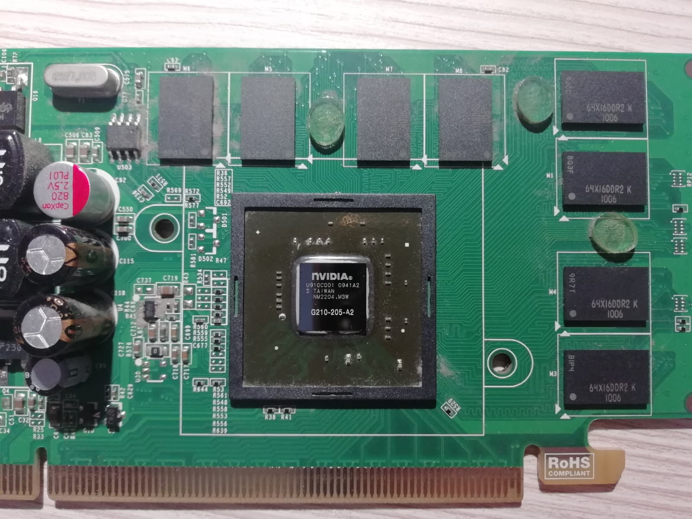

# Introduction

The topic of **Parallel Computing** explores how parallel machines work and how algorithms can be parallelized, analysing all the gains and drawbacks of such a choice.

Measuring the performance of a parallel algorithm is not straightforward: multiple metrics are involved and, depending on the context, different assumptions must be made.

Starting from the abstract representation of a parallel machine, different architectures will be presented through this document.

# PRAM Machine and Performance Evaluation

The **PRAM** (Parallel Random Access Memory) machine is an extension of the conventional RAM machine. It is used to model a theoretical parallel machine able to run parallel algorithms.

PRAM is easy and intuitive and eliminates a great amount of synchronization issues, allowing us to focus on understanding the algorithm. Variations of the PRAM exists in the real world (e.g. CUDA enabled GPUs) and abtract PRAM algorithms can be easiliy adapted to other parallel architectures.

The PRAM model has the following characteristics:

- infinite number of processors each one knowing its own index;
- infinite number of registers per processor;
- infinite number of shared memory cells;
- infinite number of input memory cells;
- infinite number of output memory cells;
- each cell can store an integer of an arbitrary length;
- all processors can access any memory cell at the same time;
- processors communicate over shared memory.

In a PRAM, all the processors executes the same instructions at the same time. For this reason cocurrent writes and/or reads to/from the same memory cell may happen.

PRAM machines can be classified with respect to their ability to perform concurrent reads/writes the memory: reads/writes can be **exclusive** (all processors can concurrently read/write to/from _distinct_ memory cells) or **concurrent** (all processors can concurrently read/write to any memory cell, even the same one).

While concurrent reads are trivial and are not an issue, what happens when two or more processors try to write something to the same memory cell? Three possible solutions:

- **Priority CW**: the value that is written to the memory is the one coming from the processor priority;
- **Common CW**: the value gets written if and only if _all_ the processors that are trying to perform the write are writing the same value (if this does not happen, the state of the cell becomes undefined);
- **Random CW**: only one randomly chosen processor is allowed to perform the write.

::: {.callout .callout-example title="Common CW machine"}
While the _priority_ and _random_ CW machines are trivial to understand, _common_ CW machines may be not, so a clarificatory example is provided.

Assume you have a machine that has to evaluate the disjunction of a large number of formulae. The way the formulae are read from the input is not of our interest.

The machines start initializing a chosen output cell (e.g. the first) with a value representing "false". This may happen by making only a chosen processor write to the cell or making all the processors writing to the same cell at the same time (that works because the same value is written).

After that, each processor starts evaluating their formula and, if the formula was evaluated to be "true", writes it to the output cell, otherwise does nothing.

This algorithm works because a disjunction of formulae is true if and only if at least one of the formulae is true. If no formulae were evaluated to be true, the initial "false" value will not be modified while if one or more formulae were avaluated to be true, the corresponding processors will write a value representing "true" to the cell.

This is a valid algorithm because if multiple processors write to the output cell, they are writing the same value so there are no undefined behaviors.
:::

There are other types of PRAM machines (mostly obtained constraining the amount of resources available): machines with a bounded shared memory, machines with a bounded number of processors, machines with a bounded word size and machines with other constraints on simultaneous memory access. Those kinds of machines will not be considered for the time being.

Let $A, B \in \{\text{EREW}, \text{CREW}, \text{Priority}, \text{Common}, \text{Random}\}$. We define an order relation $A \le B \iff \text{any algorithm written for } A \text{ will also work unchanged on } B$. If $A \le B$ then $B$ is computationally stronger than $A$ but it is also less realistic.

::: {.callout .callout-note title="Note"}
The more powerful is a PRAM, the least realistic it is.
:::

With respect to the aforedescribed order relation, all the PRAMs can be sorted as follows:

$$
\text{EREW} \le \text{CREW} \le \text{Priority} \le \text{Common} \le \text{Random}
$$

As said before, measuring the performance of an algorithm running on a PRAM machine is not trivial: the existence of multiple processors running in parallel makes everything harder. Moreover, not all processors may be running at the same time (this is not in contrast with the fact that each processors run the same instructions at the same time, this will be explained later in this document) so only a fractions of them are working while the others are just idling.

While explaining all the performance metrics involved in the process of measuring, _"to solve a problem of input size $n$"_ will be used as a synonim to _"running an algorithm whose input can be expressed as a function of $n$"_.

Let $T^*(n)$ be the time it takes to solve a problem of input size $n$ on a single processor using the best sequential algorithm currently available, $T_p(n)$ the time it takes to solve the same problem using $p$ processors and $T_\infty(n)$ the time it takes to solve the same problem with any number of processors (read that as "as many processors that can be used").

The **speedup** is defined as _how faster can we run the algorithm using $p$ processors_ and it is calculated as

$$
SU_p(n) = \frac{T^*(n)}{T_p(n)}
$$

The **efficiency** is defined as _how good we are using each single processor_ and it is calculated as

$$
E_p(n) = \frac{T_1(n)}{p T_p(n)}
$$

An efficiency close to $1$ means that the processors are almost never idling while an efficiency close to $0$ means that the processors are almost always idling.

For a finite-size problem, it is useless to make $p$ greater than the $SU$: at some point, there will be not enough data to occupy all the processors and the efficiency will decrease.

If $T^* \simeq T_1$ (that is a realistic assumption) then

$$
E_p(n) = \frac{T_1(n)}{p T_p(n)} \simeq \frac{T^*(n)}{p T_p(n)} = \frac{SU_p(n)}{p}
$$

Let $C(n)$ be the cost (in a currency of choice, AWS credits or any similar unit) of using a PRAM to solve an $n$-sized problem, $P(n)$ the number of processors used and $T(n)$ the total time for which the processors were used, then $C(n) = P(n) \cdot T(n)$.

Let $W(n)$ the total work (i.e. the total number of operations) performed by a PRAM machine.

As processors may be idling, it is true that $W \le C$.

The energy consumption of the PRAM machine is proportional to $\frac{W}{T_p}$.

We mentioned before that we may apply constraints to the _unbounded_ PRAM machine: in this way we get a more realistic version that can be used to analyze more in detail its practical application (as an example, CUDA enabled GPUs are really similar to a constrained PRAM machine).

Two lemmas are given to simplify the computation of performance metrics in the case of specific constraints applied to PRAM machines.

::: {.callout .callout-theorem title="Lemma"}
Any problem that can be solved in $T$ steps using $P$ processors can also be solved using $P' \lt P$ processors in $O(TP/P')$ steps.

It is possible to obtain this assigning multiple _tasks_ (defining _task_ as what is done on a single processor of the bigger PRAM) so a single processor of the smaller PRAM.
:::

::: {.callout .callout-theorem title="Lemma"}
Any problem that can be solved in $T$ steps on a PRAM with $p$ processors and $m$ memory cells can be solved on a machine with $\max(p, m')$ processors and $m'$ memory cells (with $m' \lt m$) on $O(Tm/m')$ steps.
:::

## Scaling: Amdahl's law vs. Gustafson's law

**Amdahl's law** and **Gustafson's law** are two laws used to determine how the performance of a parallel machine will scale. Both laws are more or less realistic but they use different assumptions so the context in which the laws is really important.

According to Amdahl's law, any program consists of an interleaving of non-parallelizable (serial) segments with parallelizable segments.

In this case, $T_p \gt \frac{T_1}{p}$ because the serial segments will take always the same time to complete (they run on a single processor and cannot be parallelized). This means that $SU \lt p$.

Let $f$ be the fraction of the program that is paarallelizable (so that $1-f$ is the fraction that is _not_ parallelizable), then the speedup according to Amdahl's law is computed as

$$
SU(p, f) = \frac{T_1}{T_1 \cdot (1-f) + \frac{T_1 \cdot f}{p}} = \frac{1}{1 - f + \frac{f}{p}}
$$

With an infinite number of processor, the parallelizable segments of the program will take no time to execute:

$$
\lim_{p \to \infty} SU(p, f) = \frac{1}{1 - f}
$$

According to the formulae, Amdahl is pessimistic: the performance increase obtained by adding new processors decreases with the number of processors. This means that there will be a point where the performance increase cannot justify the cost of a new processor.

While Amdahl assumes that the portion of the algorithm that is parallelizable is fixed, Gustafson drops this assumption.

According to Gustafson, it is possible to increase the size of the problem to make use of more processors: let $s$ be the fraction of the time used to execute the serial part of the algorithm (so that $1 - s$ is the time to complete the parallelizable part of the algorithm), then

$$
SU(p) = \frac{T_1}{T_p} = \frac{s + p \cdot (1 - s)}{s + (1 - s)} = s + p \cdot (1 - s)
$$

Note that, according to Gustafson, the speedup depends only on the number of processors so it is always a good idea to increase processors when the size of the problem increses (linear speedup, Gustafson is optimistic).

Gustafson model is also called **time-fixed**, meaning that, if we add both processors and new data to be processed, the total execution time remains unchanged. In contrast, Amdahl model is called **fixed-serial-time** because the serial part of the program is fixed and does not change.

::: {.callout .callout-definition title="Strong scaling"}
**Strong scaling** is the ability of a system to improve performance of a program increasing the number of processors while keeping the problem constant.

This type of scaling is often analyzed using Amdahl's law.
:::

::: {.callout .callout-definition title="Weak scaling"}
**Weak scaling** is the ability of a system to maintain the efficiency when the number of processor is modified proportionally to how the workload size changes.

This type of scaling is often analyzed using Gustafson's law.
:::

Gustafson's law assumptions better fit the reality because, currently, there is an almost infinite amount of data that can be processed in countless ways just to produce and extract even more data. As computing power, nowdays, is relatively cheap, it is almost always possible to add more processors to get faster results.

# Computer architectures

A **computer program** is just a list of elementary instructions that are executed by the processor. A single instruction may take more than one clock cycle to be completely executed (expecially common in CISC processors) or, in some processors, multiple instructions ae executed at the same time (e.g. in Sony PlayStation2 EmotionEngine's Vector Units or in XDNA NPUs Compute Tiles). It may even happen that different parts of the CPU handle different phases of the execution of different instructions at the same time (pipelining). Instructions (and data) are stored in memory.

As we will see in the following sections, the three key point to make an application that will efficiently make use of all the resources provided, are:

1. have enough data to feed into the parallel processors;
2. group similar elaborations with SIMD;
3. create more threads than the ones that could be supported by the hardware to mask latencies.

](assets/full-cpu.png)

## Processor architecture

Nowdays, CPUs are really complex machines: you can have a _quick_ look at the evolution and the complete specification for almost every Intel CPU from the 1978 up to the present days in [this _handy_ 5198-pages-long manual](https://www.intel.com/content/www/us/en/developer/articles/technical/intel-sdm.html).

If you are interested, a good amount of documentation about the aforementioned Compute Tiles is availabe [here](https://docs.amd.com/r/en-US/am020-versal-aie-ml) (although at the time of writing I could not find the instruction set reference).

In the following paragraphs we will discuss about all the techniques used by hardware designers to get the most out of the silicon. While the techniques are presented separately, it is really common to find a combination of multiple of them actually being used in real processors.

A processor is generally composed by three functional blocks:

- **Fetch/Decode Unit (FDU)**: determines what the processor must do;
- **Arithmetic Logic Unit (ALU)**: actually executes the instructions;
- **Execution Context (EC)**: contains the register files, the CPU FSM and all the state that has to be preserved on the CPU.

Let's consider the simplest possible single-cycle CPU.

A **single-cycle CPU** is the simplest kind of processor and it executes a single instruction per clock cycle (one clock cycle is the same as one machine cycle).

Single-cycle CPUs are usually used for educational puproses only as they are less complex than other types of cpu but are also slower (this is because the clock speed must be lowered to give the slowest critical path enough slack time). In this section we do not care about splitting instructions in simpler steps for performance, we only consider parallelization.

Single-cycle CPUs are usually paired with pipelines because it is almost impossible to read from memory, perform a computation step and then write back to memory all in a single cycle.

The **Program Counter (PC)** register contains the address in memory of the next instruction to execute.

How can the performance of the simple CPU be improved? Hardware designers can choose between plenty of different parallelization strategies.

### Superscalar processors

If an instruction $A$ uses the results of another instruction $B$, then $A$ is dependent on $B$ (this is called **data dependency**) so the processor cannot execute $A$ before or while executing $B$. This dependency is obviously a transitive property.

It may happen that there is no dependency between two (or more)instructions so that they can be executed simoultaneously: this is exactly what superscalar processors do.

Superscalar processors are composed of multiple FDUs, multiple ALUs (which all work on the same execution context) and an **Out-of-order** control logic that finds independent instuctions and feeds them into the different FDUs.

It is possible that there is a long chain of dependent instructions: in that case, only one FDU and one ALU are occupied while the others are left waiting.

### Multicore processors

Plain superscalar processors used lots of silicon to make a single instruction stream run fast: big caches, out-of-order execution units, branch predictors and pre-fetchers would occupy a large die area compared to the actual processing power.

What if, instead of using silicon to make _smarter_ processors, it was used to make _more_ processors, maybe on a single die? Meet **Multicore processors**.

Multicore processors are, as the name implies, composed by multiple independent processor cores on a single die. Each core may be simpler and slower than a full-featured superscalar processor but there is a big potential for speedup and the entire chip is easier to design and manufacture in general.

Of course, if one does not exploit the existence of multiple cores, silicon can be considered wasted and performance will be pretty bad.

#### Multithreading

To exploit multicore processors, the programmer must create multiple threads that will run in parallel but what happens if the programmer creates more threads than the ones that are available in hardware? Multicore systems often come with a scheduling system that manages the execution of the threads, possibly interleaving them if the available hardware threads are not sufficient.

The process of pausing one thread, saving its state and loading another thread is called **context switch** and it does consume time. To try save some of the time used to switch between different threads, multiple Execution Contexts (hardware threads) are placed on a single core to reduce the need to access memory to save the state of a thread.

If the hardware threads are not sufficient, context switch will still need to access the memory.

Multithreading also helps masking the issues caused by the memory latency as described in [this section](#multithreading-to-mask-latencies).

### SIMD Processors

**SIMD** is an acronym that stands for **Same Instructions Multiple Data**. SIMD processors are able to apply the same transformation to entire vectors of data. For this reason, SIMD instructions can also be called _vector instructions_.

In the silicon, SIMD instructions are implemented by placing multiple ALUs in the same core.

The **number of lanes** describes how many elements can be processed at the same time: as an example, to perform the elementwise sum of two vectors of 16 `int32_t`s values, you will need 16 32-bit lanes.

Depending on the architecture, ALUs can be combined to process bigger data: instead of the 16 32-bit lanes from the example above, it may be possible to use the same ALUs to compute the elementwise sum between two vectors of 32 `int16_t`s (32 lanes) or between two vectors of 8 `int64_t`s (8 lanes).

Intel's interpretation of SIMD instructions is composed of AVX (Advanced Vector eXtension) instructions.

#### Conditional execution

It is possible that not all the elements in a vector need to be processed in the same way: branching (i.e. `if-else`) is used. In this case, the condition is applied to each element in the vector and a mask is produced containing the result of the comparisons.

After the mask has been produced, all the branches are executed and, according to the mask, each result can be saved or discarded.

This means that it may happen that not all the results are used so the ALU work is wasted. This decreases efficiency by a lot.

**Coherency** is the property of a program where the same instruction sequence applies to all the elements to be processed (i.e. if all the elements are processed by the same code path). Coherency is necessary only if all the threads must eecute the same instruction at the same time (like in CUDA).

## Memory access

We have quickly discussed how parallelism can be achieved in a single processor but instructions and data is stored in memory: the most powerful processor cannot do anything if the memory is slow.

The memory is just an array of bytes indexed with incremental addresses.

Memories require time to read/save a value: that time is called **Memory access latency**. [Here](https://www.alldatasheet.com/datasheet-pdf/download/152881/ETC1/HY6116AP.html) you can find the datasheet (which also includes timing information) for a very old memory chip: it is simple enough to be understood without any special knowledge.

High memory latencies forces the processor to remain idle (_stalls_) waiting for the requested data/instructions. Hardware developers adopt multiple strategies (or a combination of them) to minimize this problem:

- caches (developers may place fast caches close to the processor);
- prefetching (branch prediction logic also try to prefetch instructions and data that will probably be used in the future so that the processor does not need to wait for them);
- same-core multithreading (while one thread is waiting for data, another uses the ALUs; programs with more arithmetic per memory access needs less threads to hide the latency).

While those strategies are extensively used in basically any system, there exist also some exotic architectures that are designed explicitly to not make use of any of them: XDNA NPUs are an an example.

In XDNA NPUs, each Compute Tile have plenty of vector registers and a dedicated L1 memory containing instructions and data. Each tile can read/write directly from/to the neighbor tiles' memories. Compute Tiles are grouped in columns, each column has also a big Memory Tile (L2 memory). Communication between tiles is scheduled at compile time and is synchronized using hardware locks. There is no caching or prefetching: data is always where it is expected to be and execution time is always predictable (no cache misses).

### Multithreading to mask latencies

A multi threaded processor can hide the memory latencies by performing arithmetic from other threads while one thread is waiting for the memory. Programs that needs to do more arithmetic operations per memory access need fewer threads to completely mask stalls due to memory latency.

As said before, to implement hardware support for multithreading, multiple Execution Contexts must be placed in the processor. There are two main types of multithreading that can be implemented in hardware: _Interleaved multithreading_ and _Simultaneous multithreading_.

#### Interleaved multithreading

With **Interleaved multithreading**, at the beginning of each time interval, the core decides what thread to run, giving it access to all the ALUs.

Interleaved multithreading can be **coarse** (context switch happens only on long stalls, loke memory stalls) of **fine** (constext switch may happen up to every clock cycle, maximum efficiency).

#### Simultaneous multithreading (SMT)

With **Simultaneous multithreading**, at the beginning of each time interval, the core assigns the ALUs to instructions from different threads (e.g. Intel Hyper threading).

. For more information on the HT technology, please refer to the [same _handy_ manual as before](https://www.intel.com/content/www/us/en/developer/articles/technical/intel-sdm.html). Photo from author.](assets/pentium4ht.png)

With SMT, threads run when there are resources assigned to them.

### Memory bandwidth

The term **Memory Bandwidth** refers to the rate at which the memory can feed data into the processor. It is measured in transfer units per unit of time. Another important paramenter is the **Latency** that is the time it is spent by the CPU while waiting for an answer from the memory.

If a given computation is simple enough (or if the processor is powerful enough or if the memory is slow enough), the computation is called **Bandwidth Limited**. This means that the memory is not able to feed data into the processor fast enough to keep it occupied all the time.

To overcome this problem, the programmer musst write the parallel program in such a way that memory access is infrequent and well planned. With powerful processors, arithmetic computation is free compared to memory access so computing the same value every time it needs to be used may be (and usually is) faster than computing it once and retrieving it every time from memory.

## Communication between threads

There are three main ways in which threads can communicate (a.k.a. **Programming Model**s), each one with their advantages and disadvantages: **Shared Memory**, **Message Passing** and **Data Parallel**.

With shared memory, all the threads can access the same memory space: every thread can _peek_ and _poke_ at every cell location at any time. The threads must be synchronized using **locks** and **atomic instructions** to prevent data races.

In hardware, the shared memory model is implemented using some sort of interconnect that can assume the form of a **shared bus**, a **crossbar** or a **multistage network**.

With message passing, threads communicate using only `send` and `receive` primitives. Message passing is simpler than shared memory and it is widely used to connect the multiple machines in a cluster.

The data parallel model is very similar to SIMD: it consists in using a set of primitive (`map`, `reduce`, `scan`, `shift`, `gather`, `scatter`, `filter`, ...) that applies the same operation on all the elements of a collection.

## GPU Architecture

GPUs were once designed and used to actually process graphics. Graphics were (and still are) processed by shaders and undergo lots of parallelizable operations (mostly matrix-vector multiplications and pixel-wise operations). In 2004, someone at Stanford noticed that telling GPUs something on the line of "_Heyyy, those are pixels, don't worry. Can you process those pixels for me, please?_" while feeding actual data to be processed into the GPU would actually work. Three years later, in 2007, the guy down below decided that selling GPUs built specifically to be used as a general purpose processor without any workaround would also be a good idea. Boy was he right!


In this section, we'll analyze only CUDA compatible architectures (i.e. 99% NVIDIA GPUs, 1% brands that you'll ever hear once in the news announced as _The company that will single handedly stop NVIDIA domination_ before them ending up forever _into the shadow realm_).

The first CUDA compatible (read that as "specifically built not only for graphics") GPU were the one built following the **Tesla** Architecture.



CUDA compatible GPUs are built following a hierarchical structure: hardware-wise, each graphic processor is composed by multiple **Streaming Multiprocessor**s (SMs).

One SM is composed of a **Warp Selector** (combined with an  FDU), multiple rows of a number of **Functional Units** (that are, more or less, ALUs) (each row having a dedicated **Load/Store Unit** (LSU) and an optional **Tensor Core Unit**), a number of **warp**s and an L1 memory serving both as cache and as shared memory.

A warp is a big register file containing the execution context and all the registers needed by all the threads of a group (usually 32). Registers are really scarce: if a thread needs more registers than the ones available, **register spilling** will happen and performance will worsen noticeably.

All threads shares the same global memory (the _VRAM_) but accessing it is orders of magnitude slower than using cache, registers or shared memory.

A hierarchical structure is followed also thread-wise: threads are grouped into **block**s (in a one-, two-, or even three-dimensional fashion). The **grid** contains all the blocks (also in a one-, two-, or even three-dimensional fashion). Threads in a block are split in warps (that correspond to the _hardware_ warps).

Each thread in a warp shares the same PC register so they all execute the same instruction at the same time (control divergence may occour and it is handled as described in [this paragraph](#conditional-execution)).

Each SM is capable of running one warp at a time (except for newer GPUs that has multiple SM (called _sub cores_) in each SM). As long as there is enough space in the execution context storage and in the shared memory, multiple blocks can be assigned to a single SM. Whenever a block is complete, the resources are assigned to another block.

Each thread in the same block can also access the same shared memory (placed in the L1 memory). Threads in the same block can wait for each other using the `__syncthreads()` primitive (usually used after writes in shared memory to make sure that all the threads have written their result before it can be read, it makes a thread stay idle until all the threads have reached their next `__syncthreads()`).

To achieve a "wait for all blocks" effect, the kernel must be split into multiple ones (that will be called in sequence): the cuts have to be placed wherever synchronization between blocks is required (synchronization happens using writes to the global memory).

Atomic operations may be used to achieve atomic operations both on shared and global memory.

Each block can be scheduled to run in no particular order, the same is true for the warps in a given block.

The skeleton of a CUDA application consists of **host code** and **device code**. The former one usually allocates memory on the GPU, writes data on it, calls the kernels and retrieves the results, while the latter contains the kernels and other functions called by them. Both host and device code may live peacefully in the same file.

GPU kernels are declared using the `__global__` attribute while functions called only by the kernels are declared using `__device__`.

The programmer may choose how many threads and blocks to spawn in the GPU. The geometry of the grid should reflect the geometry of the problem to solve.

::: {.callout .callout-example title="Grid geometry"}
We know from before that blocks in the grid may be positioned with up to a three dimensional fashion. The same is true for threads in a block.

The best way to use this multi-dimensionality is to instantiate threads and blocks to "cover" the input data.

Take as an example the problem to process an image. A good way to exploit the multi-dimensionality of a grid is to make each thread process a single pixel.

The blocks should be placed bi-dimensionally into the grid so that a single block will process a chunk of the image.

Threads should be placed bi-dimensionally into each block so that each thread will compute a single pixel of the chunk covered by the block.
:::

Each thread knows its offset inside the block, the offset of its block inside the grid and the dimensions of the block(thus making it possible to compute its offset inside the grid). This information is contained into the `threadIdx`, `blockDim` and `blockIdx` structs.

A barebone CUDA kernel looks like this:

```cpp
__global__ void kernel(/* parameters */) {
    __shared__ int shared_memory[...];  // Declare shared memory area
    int thread_id = threadIdx.x + threadIdx.y * blockDim.x + threadIdx.x * blockDim.y * blockDim.x;  // Thread ID inside a block

    // Out of bounds checks are omitted here

    // Read data from global memory

    shared_memory[...] = ...;  // Writes to shared memory
    
    __syncthreads();

    // Perform some other computation

    // Write results to global memory
}
```

and it is launced like this

```cpp
// Malloc and write data to GPU global memory

dim3 blocks(...);
dim3 threadsPerBlock(...);
kernel<<<blocks, threadPerBlock>>>(/* parameters */)

// Read results from GPU global memory
```

It is useless to write here all the peculiarities, intrinsics and things one can do with CUDA, only the most notable ones will be considered. For a more complete CUDA explanation, please refer to [CUDA by examples](https://developer.nvidia.com/cuda-example).

### GPU memory

Streaming multiprocessors are really fast. So fast that GPU memory (the **VRAM**) cannot keep it up. This is the reason why caches and other types of memories were introduced.

Since the memory is the main bottleneck, using the correct memory access patterns is a must, otherwise the gpu will be idle for the majority of the time.

Each thread has its registers and shares a region called **shared memory** (creative naming, I know) with all the other threads in the same block. All the threads in all blocks may read from both the **global memory** and the **constant memory** and also write to the first one.

The shared memory is stored in the L1 cache that also stores the instructions that will be run by each thread.

Intuitively, registers are the smallest and faster form of storage while global memory is bigger but slower.

A good CUDA program will always prefer re-computing something when it is needed instead of computing it once, and reading it from memory when needed (unless, of course, the computation is so complex that it would take longer than a memory access, but this usually never happens) and make use of memory coalescence (we will see this later).

Shared memory may be used to store intermediate results in place of the global memory, if the amount of data to store is small.

To speed up memory trasfers (mainly reducing overhead), DRAM bursting is implemented: with this technique, a large amount of data (usually requested by multiple threads) is transferred in a single batch (thus, saving on the time required to initialize each single transfer). DRAM bursting happens when memory access is **coalesced**.

Coalesced memory access happens when the threads in a warp access memory at an offset that can be expressed as `f(...) + threadIdx.x` where f _does not_ depend on `threadIdx.x`.

## Shared cache architecture

When multiple threads access caches that may or may not be shared and backed by a bigger and slower memory, it is important to ensure coherence and consistency between all the threads so that no undefined behaviour happens.

**Memory coherence** ensures that a system that reads and writes to a shared cache will behave just the same as if there were no caches (basically, it ensures that all the processors see the ame values when reading from the same cell).

When multiple accesses happens at the same time, the result of said accesses must be coherent between all the processors (i.e. if multiple processors read at the same time, they will read the same value and if multiple processors write at the same time, all the processors must agree on what will be actually written).

Coherence is required because using caches, data is duplicates, so there has to be a way to synchronize changes.

**Memory consistency** defines _when_ the memory writes from one processor will be propagated to all the other processor or, better, when the changes to the memory applied by one processor are viewed by all the other processors.

Basically, memory consistency defines what a compiler can or cannot do and what precautions the programmer has to take in order to produce functioning programs. It also depends on the hardware configuration.

Both requirements are not trivial to satisfy and they heavily affect the life of the programmer (they should think about those problem and adapt their algorithms) and the performace (instruction reordering may break things and memory latencies are harder to mask).

In practice, in a multithreaded application, all the access to memory must happen as if there were a single processor doing all the work sequentially. Given two variables `x` and `y`, in the case of a reads and writes involving both of the variables, it should always be possible to determine which operation happens before the other.

There are four different types of memory operation orderings:

- $W_x \to R_y$: a write to $x$ must commit before a subsequent read from $y$;
- $R_x \to R_y$: a read from $x$ must commit before a subsequent read from $y$;
- $R_x \to W_y$: a read from $x$ must commit before a subsequent write to $y$
- $W_x \to W_y$: a write to $x$ must commit before a subsequent write to $y$.

There are three main consistency models that defines how and when changes to memory by one processor are propagated to all the others.

The **sequentially consistent** model consists in enforcing all the four orderings as they appear in the program: when one thread writes, the changes must be propagated to every other thread before anything else happen (basically the entire memory is a big shared area).

This model is really strong but also strongly limits the performances. We can relax the $W_x \to R_y$ rule to obtain the **total store ordering** model. Basically, we place a write buffer between the memory and the processor, allowing it to read a variable before its own changes to another variables are propagated (we move reads before writes).

With TSO, writes are _not_ reordered.

In general, we can relax memory operation ordering until it is not possible to keep computation consistent.

Consistency is not related to the presence of caches: even with multiple processors accessing the same shared memory, it must be guaranteed.

We can also allow write operations to be reordered (relaxation of $W_x \to R_y$ and $W_x \to W_y$) to obtain **partial store ordering**.

We can also allow to reorder _all_ the types of memory access operations to get the fastest speed (**weak ordering** and **release consistency**). The more we relax, the more need to use synchronization primitives we have (otherwise access to a same memory location may be non deterministic, causing _funny and easy to debug problems_ like **data races**).

### Synchronization primitives

**Syncronization primitives** are used to synchronize memory accesses from multiple sources. Programmers may use **lock**s, **semaphore**s and more.

A possible strategy to implement simple locks are the **atomic taest-and-set** instructions. Baically, they atomically perform a load from memory to a register and, if certain conditions are met, the value stored in memory is changed. In this way, it is possible to _query_ the status of the lock, waiting for it to be released safely.

A good lock system have the following characteristics:

- low latency;
- low interconnect traffic (if more than one processors wants to acquire the lock at the same time, they all should be able to do so sequentially, without generating too much traffic on the bus);
- scalability;
- low storage cost;
- fairness.

Test-and-set lock aren't idea: they generate a lot of traffic, they are not easily scalable and there is no guarantee of fairness.

**Test-and-test-and-set** locks are a different approach: the processor continues to query the status of the lock until it is released. At that point, it tries to acquire it and, if it fails, it goes back to waiting.

This type of locks have a slightly higher latency but generate less traffic (no continuous loads) and are more scalable.

# Parallel programming

_Note: a great part of this section is in common with [Advanced Algorithms and Parallel Programming](../Advanced%20Algorithm%20and%20Parallel%20Programming/index.html)_.

There are three types of parallelism that can be implemented:

- **bit level parallelism**: multiple words of bits are processed at the same (simd);
- **instruction level parallelism**: multiple instructions are executed on the same core at the same time (pipeline, hyperthreading);
- **task level parallelism**: multiple programs or code blocks (tasks) are executed at the same time on multiple processors.

With task level parallelism, program is split into different tasks. Based on the dependency graph between tasks, multiple independent tasks can be run at the same time.

Tasks can be pipelined to save time.

Tasks can communicate either over **shared memory** or with **message passing** (each task has its own private memory and communicates with other tasks by sending and receiving _messages_ of data).

In order to tell the compiler that parallelism can be extracted from our source code, we must give it precise instructions and hint. Take as an example a function that process an array elementwise and writes the result on another array. Since the compiler cannot guarantee that the two array does not overlap, it will not parallelie anything. If instead we mark the arrays as `restrict`, the compiler will be more prone to use simd instructions or similar stuff (in this case, if we do not respect the restrictedness constraing, undefined behaviour may happen).

Also, the types of optimization that you (or the compiler) can introduce may be suitable for the architecture you are programming: unsuitable paralleliation techniques will either cause undefined behaviours or introduce useless overhead.

Multiple parallelization libraries and technologies may be used at the same time, as long as they do not interfere with each other: as an example, one can use CUDA to send computation on the GPU while performing parallelized computation on the CPU with OpenMP. It is even possible to mix MPI and OpenMP to parallelize on multiple cores on multiple chips.

## Parallel algorithms

Designing a parallel algorithm is not trivial, often times the PCAM procedure is followed:

1. **Partitioning**: decompose problem in smaller tasks;
2. **Communication**: choose how the tasks need to exchange information between each other;
3. **Agglomeration**: group similar and independent  to reduce overhead;
4. **Mapping**: assign resources to each agglomerate.

Partitioning can be performed with **domain decomposition** (split data with the least possible replication and assign each subset to a task) or **functional decomposition**  (the problem is split in smaller subproblems).

The partitions must be such that there should be at least an order of magnitude more tasks that there are processors available. Each task must be such that there is no useless redundant computation performed, each task should take a comparable amount of time to be completed and the number of them should be able to scale with the problem size.

Communication can be **local** (communication only between _close_ tasks) or **global** (communication between everyone), **structured** (information flows following a pattern like tree, grid, mesh, o-ring, etc.) or **unstructured** (information can flow in arbitrary patterns), **static** (communication partners are decided at compile time) or **dynamic** (communication partners are decided at run time).

Communication can also be **explicit** (using messages) or **implicit** (reading and writing on shared memory).

The synchronization between communication partners can either be **synchronous** (blocking and with handshake) or **asynchronous** (data transfer is independent from execution flow).

## Threads

A single process can spawn multiple threads. Each thread can access all the resources acquired by the main process.

A thread is an abstraction: it may or may not correspond to an hardware execution unit and may or may not be executed in parallel with other threads.

## Pthread

To use pthread, one must `#include <pthread.h>` and use `-pthread` when compiling.

When using pthreads, threads are created with `pthread_create`. A thread ca terminate itself callong a `return` or a `pthread_exit`. Threads can terminate other threads using `pthread_cancel`. If the main process is terminated, all threads are terminated as well, but if the main thread calls `pthread_exit` then all the threads survive.

Threads can wait for other threads to exit calling `pthread_join`.

Barriers are crated with `pthread_barrier_init` and are used through `pthread_barrier_wait`.

Mutexes are available: `pthread_mutex_lock` and `pthread_mutex_unlock`.

## OpenMP

To use OpenMP, one must `#include <omp.h>` and use `-fopenmp` when compiling.

OpenMP parallelizes stuff written in a `parallel` block:

```c
#pragma omp parallel
{

}
```

It is possible to specify how many threads will be used in the section:

```c
#pragma omp parallel num_threads(4)
{

}
```

_Note: one can also use `OMP_NUM_THREADS` or `omp_set_num_threads`._

### Sections

Sections represent the functional parallelism.

Sections can be defined to run independnt tasks concurrently:

```c
#pragma omp parallel sections
{
    #pragma omp section
    {
        task1();
    }

    #pragma omp section
    {
        task2();
    }
    ...
}
```

### For

For represents data parallelism.

One can parallelize the iterations of a for-loop:

```c
#pragma omp parallel for
for(...) {

}
```

Since each thread receives a block of iteration to process sequentially, it is possible to specify `schedule(...)` to be `static` (when all the iterations takes more or less the same time), `dynamic` (when different iterations takes different times) or `runtime` (based on `OMP_SCHEDULE`).

`reduction` is used to perform a reduce over a specified variable at the end of all the iterations (all the threads keeps a private copy of the variable to reduce and then a global reduction is performed to save the result on the shared variable).

### Synchronization

Code wrapped by `#pragma omp single` is executed by only one single thread, if it is instead wrapped by `#pragma omp master` the code will be executed specifically by the master thread.

`#pragma omp critical` is used to denote sections that must be executed atomically by one thread at a time. `critical`s may be named, in that case, critical sections with different names can be run in parallel.

`#pragma omp barrier` is used to wait for all the threads to reach the same barrier.

`#pragma omp atomic` ensures that the memory access in the following statement are performed atomically.

### Visibility

**Data Scope Attribute Clauses** are used to tell OpenMP how the variables are shared between threads.

Variables may be declared as `private` (all threads have their local non-shared copy) or `shared` (all threads share the same variable).

It is possible to specify `default(shared)` or `default(private)` to set the visibility of all the variables whose visibility was not specified or `default(none)` to force the programmer to specify visibility for _all_ variables.

## Parallel patterns

Patterns are known solutions to known problems. There exist known parallel patterns to solve known parallel problems.

The main problem in parallel programming is **dependency** (that arises when multiple statements needs to access the same resources).

There are three types of dependency: $\delta$ (**true/flow dependency**: inputs for one statement are the outputs for a previous one), $\delta^0$ (**output dependency**: two statements have the same outputs) and $\delta^{-1}$ (**antidependence**: outputs for one statements are the inputs for a previous one).

Two statements can be executed in parallel if and only if there are no dependencies of any kind between them. Dependencies may be removed by rearranging or eliminating statements.

Prallelism can also be extracted in loops: if each iteration (or groups of iterations, in the case the dependency is between non-consecutive iterations) are independent from each other, the loop can be parallelized or unrolled.

If parallelism can be extracted from multiple loops, it is possible to group one iteration from all loops into a single thread.

In a nutshell, to be able to execute statements in parallel, there must not be dependencies between those statements and the order in which they would be executed serially should not matter.

Parallel patterns are used to solve specific types of issues that arises when moving from a serial implementation to a parallel one.

Some kond of patterns can be classified as **collective**s: those are the patterns that operates on the entire collection of data rather than on the single elements.

Reduce, scan, partition, scatter and gather are collectives.

### Control patterns

**Control patterns** are used to control the execution flow in parallel programs.

The **fork-join** pattern is used to split computation in multiple flows and reconcile them at the end.

The **map** pattern is used to apply the same function (called **elemental function**) to all the elements of a sequence in parallel.

Elemental functions must be pure.

The **stencil** pattern is a generalization of the map pattern where the elemental function requires also to access _nearby_ elements of the sequence.

The **reduction** pattern is used to reduce a sequence into a single element.

The **scan** pattern is used to compute every partial reduction of a sequence.

The **recurrence** pattern is an even-more-generalized version of map where multiple iterations of map are performed and each iteration depends on the results of the previous ones (not only the single elements but also neighbors).

### Data management patterns

Data management patterns are strategies used to allocate and move data for each thread.

The **pack** pattern (opposite of **unpack**) is used to remove unused space from a sequence to reduce memory consumption.

Parallel pack works by creating a mask of `1`s and `0`s where `1` means that the element is present and must be kept. After that, the mask undergo a pass of prefix sum (scan with addition operator) to get an array of incremental indices to feed into a scatter.

Unpack works in the opposite way: given the mask, the prefix sum is computed and the input (sequentially indexed) is written into the output (indexed by the prefix sum).

**split** (opposite of **unsplit**) is a variation of pack that puts all the `1` elements on one side and all the other on another side.

**bin** is just split but with more than 2 categories (there are multiple masks and prefix sums).

**expand** is just map but can produce an arbitrary number of output elements for each input element.

The **pipeline** pattern is used to move data between tasks exactly as it sounds.

The **geometric decomposition** pattern is used to split data into smaller subproblems based off the geometry of the input data. May be **overlapping** or **not overlapping**.

The **gather** pattern is used to read some data given the list of positions to read from. Opposite of **scatter** (which may result in race contitions).

**shift**, **zip** and **unzip** are variations of gather.

As scatter performs multiple writes, collisions may happen. In this case we must choose between a number of rules to handle them. **atomic scatter** chooses randomly the final value; **permutation scatter** gives an error in case of collision (and the output is a pure permutation of the input); **merge scatter** reduces the values causing a collision into a single value using a provided associative and commutative operator; **priority scatter** uses the priority of the element to be written (usually using the input index from which the element is coming);

### Other patterns

The **superscalar sequence** pattern consists in writing tasks and ordering them only depending on their dependencies.

The **futures** pattern is just like javascript promises, nothing more.

The **speculative selection** pattern is just an higher level implementation of hardware speculative execution.

The **workpile** pattern is just a map that, for each element of the initial collection, may produce an arbitrary number of other elements to be processed.

The **search** pattern is literally what is seems to be.

The **segmentation** pattern is  map but applied to non-overlapping non-necessarily-uniform-sized partitions of the problem.

The **expand** pattern is a combination of pack and map.

The **category reduction** pattern is a combination of filter and reduce.

### AoS vs SoA

AoS stands for **array of structures** while SoA stands for "Structure of arrays".

The former consists in storing the problem structures all in one single array while the latter consists in having a struct containing one array for each attribute containing all the corresponding attributes.

AoS is good for random access (best cache usage) while SoA is good for vectorization et similia.

Both methods may need padding to be correctly aligned. Padding may be placed at the end, after each structure (for AoS) or after each array (for SoA).

# Heterogeneous computing

**Heterogeneous computing** refers to the kind of computation that is performed over different devices and architectures. Examples of heterogeneous computing may be using both a cpu and a gpu, maybe with some tensor processing units or FPGAs.

Heterogenous computing is useful because real world problems are very variagate and some kind of hardware may be better suited than others to solve them.

Another advantae of heterogeneous systems is that the more general purpose a chip is, the slower ant power hunghry it is (but also the easier to program).

There exist **Domain Specific Language**s (DSLs) that trade generality with performance and productivity: it may be easy to use them for really specific tasks but as general purpose languages, they are a really bad choice.

## Halide

Halide is a programming language used to decouple the algorithm from the scheduling. With Halide is easy to change _how_ an algorithm is executed (on which hardware, in which order) to try and find the best configuration.

## FPGAs

**Field Programmable Gate Array** are a kind of reconfigurable chip generally composed by a large number of configurable logic blocks and a configurable routing system. Each logic block usually contains a small lookup table and a flip flop. Multiple blocks can be configured to compute specific functions in order to achieve the required result.

FPGAs can both be programmed with RTL languages (VHDL, Verilog, etc) to keep a very fine-grained control over the entire chip (with all the disadvantages of the case) or with HLS (using higher level languages to produce modules).

With HLS, the compiler takes the higher level speciication, the constraints and optional optimization directives to have an RTL module as output. With HLS it is also easier to iterate over multiple designs and to perform verification (if a slower result is acceptable).

With HLS, multiple constraints can be produced:

- minimun delay/minimum area;
- scheduling constraints;
- power consumption constraints;
- clock constraints.
