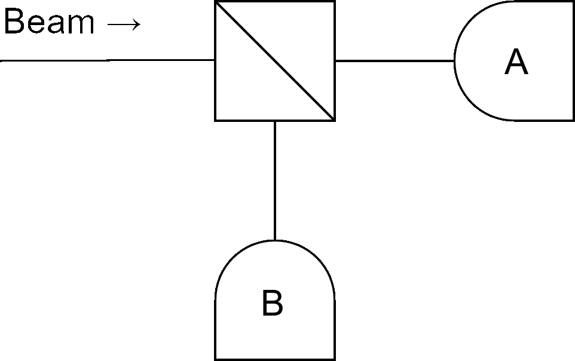
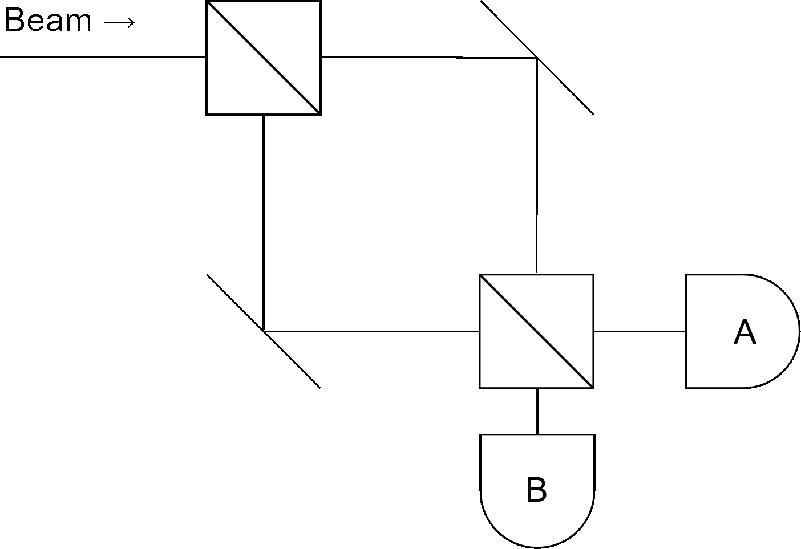

# Introduction

[This](https://www.youtube.com/watch?v=Wzc0rCniHag) is the only introduction you need. In this document we will explain both the theory and the math behind quantum behaviors and the experiments that prove that they are not just dreams of scientists on drugs but that they are real and verifiable.

In this document, the following two assumptions will be made:

- there are no massless paticles;
- relativistic effects are ignored.

A good "popular" introduction to relativistic effects can be found [here](https://www.youtube.com/watch?v=Y-W-w8yNiKU).

# Fundamentals

We will now give the fundamental tools and concepts to understand more advanced topics.

## Wave-particle duality

The **wave-particle duality** is at the foundation of the entire field of quantum mechanics. Hoc can you prove that a particle is, in fact, a particle? Consider the following setup, where a beam of particles if thrown into a 50/50 beam-splitter:

Since the beam-splitter is a 50/50 one (this also works with any generic type of beam-splitter), both detectors $A$ and $B$ will measure about the same numbers of particles. If, isntead of a beam, a single particle at a time is thrown into the setup, only one of the two detector will fire for each particle, with 50/50 probability (**randomness**). This means that the particle is effectively a particle that moves along a trajectory and that does not propagate like a wave.

Consider now the **Mach-Zender interferometer**:

Intuitively, sending a beam of particles inside this setup would make both detectors measure 50% beam intensity, but this does not happen. Assuming that both the upper path and the lower path are exactly the same length, detector $A$ will always measure 100% of the beam intensity.

Sending a particle at a time shows the same result (therefore no interference between different particles).

The mathematic modellization of the Mach-Zender interferometer will be presented [here](#translation-operator).

The Mach-Zender interferometer demonstrates that each particle also propagates like a wave, taking both the upper and the lower paths at the same time (**superposition**), interfering with itself at the second beam-splitter.

## Superposition

We saw with the Mach-Zender interferometer that a particle is also a wave, so it cannot be described with the usual **state of motion** tuple (position and velocity) like we do in classical mechanics, therefore a new kind of algebra is needed.

Let $|u\rangle$ be the **quantum state** (the equivalent of the state of motion) describing a particle.

Just as with the classical counterpart, knowing the quantum state of a particle at a give time, unless irreversible operations like [measurements](#measurements) are performed, is enough information to let us compute the quantum state of the same particle forever in the past and in the future.

$|u\rangle$ belongs to the Hilbert (i.e. a vector space with a scalar product) space $\mathcal{H}$ that contains all the possible quantum states for the particle. Since $\mathcal{H}$ is an Hilbert space, three operations are defined:

- $(+): \mathcal{H} \times \mathcal{H} \to H \overset{\Delta}{=} |u\rangle> + |v\rangle \mapsto |u+v\rangle$
- $(\cdot): \mathbb{C} \times \mathcal{H} \to \mathcal{H} \overset{\Delta}{=} \alpha |v\rangle \mapsto |\alpha v\rangle$
- $\langle \cdot | \cdot \rangle: \mathcal{H} \times \mathcal{H} \to \mathbb{C}$

The first operation is called the **superposition operation**, the third one is the **bracket**.

::: {.callout .callout-property title="Properties of Hilbert operators"}
Since $\mathcal{H}$ is an Hilbert space, a few properties holds:

- $\langle v | \alpha u \rangle = \alpha \langle v | u \rangle$, $\langle \alpha v | u \rangle = \alpha^* \langle v | u \rangle$
- $\langle v | u \rangle = \langle u | v \rangle^*$
- $\langle v | u + w \rangle = \langle v | u \rangle + \langle v | w \rangle$
- $\langle v | v \rangle \in \mathbb{R}$, $\langle v | v \rangle \ge 0$, $\langle v | v \rangle = \langle v | v \rangle^*$
- $\|v\| = \sqrt{\langle v | v \rangle}$
:::

A generic state can be represended as a weighted sum (a.k.a. **superposition** or **linear combination**) of other states. Weights are complex numbers.

Any superposition of valid states is another valid state for the system.

$$
|u\rangle = \sum_{j=1}^n \alpha_j |v_j\rangle \qquad |u\rangle, |v_j\rangle \in \mathcal{H}, \alpha_j \in \mathbb{C}
$$

::: {.callout .callout-example title="Schr&ouml;dinger's cat"}
The notorious Schr&ouml;dinger's cat is in a superposition of "being alive" and "being dead" at the same time:

$$
|cat\rangle = |alive\rangle + |dead\rangle
$$

If the cat is really sick, it is possible that

$$
|cat\rangle = \frac{1}{10}|alive\rangle + 100i|dead\rangle
$$
:::

## Measurements

A **measurement** is the act of extracting information about the quantum system we are working with. A measurement is always performed against an **observable**, i.e. a measurable quantity or property of the system.

A measurement is an irreversible operation: whenever a measurement is performed, the state collapses to one of the **proper states** of the observed quantity.

This means that a quantum experiment is generally not repeatable: if multiple measurements in the same conditions must be performed, the only way to do so is to create multiple replicas of the same experiments.

::: {.callout .callout-example title="Schr&ouml;dinger's cat"}
The _aliveness_ of the cat is a binary observable property that has two proper states (i.e. "alive" and "dead").

When we measure the cat aliveness, we can only observe if it is dead or alive, not that it is "42% alive".

When we perform the measure (e.g. looking at the cat), the system collapse to one of its proper state (i.e. "alive cat") and when we look away, the system starts evolving from that proper state.
:::

The probability of observing a specific observable value when performing a measurement depends on the quantum state of the system.

Let $|O_j\rangle$ be the quantum state in which a measurement on a given observable will always yield $O_j$ as a result and $|u\rangle$ the quantum state of the system we are working with, then

$$
|u\rangle = \sum_{j=1}^n \alpha_j |O_j\rangle
$$

The various $|O_j\rangle$s are therefore all proper states.

::: {.callout .callout-note title="Invariance w.r.t. multiplication by a phase factor"}
The same information encoded in $|u\rangle$ is also the one encoded in both $e^{i\varphi}|u\rangle$ and $A|u\rangle$. They all describe the exact same quantum state.
:::

The $\alpha_j$ coefficient are enough to determine the state of a quantum systemm therefore knowing $\alpha = [\alpha_1, \alpha_2, \dots]^T$ at a specific time allows us to determine the same vector forever in the past and in the future (unless irreversible operations are performed).

The probability of observing a specific value $O_j$ when performing a measurement is given by the Born rule.

::: {.callout .callout-definition title="Born rule"}
The **Born rule** gives the prorability of observing a given value $O_j$ when performing a measurement on $|u\rangle$:

$$
P(O = O_j) = \frac{a_j^* a_j}{\langle u | u \rangle} = \frac{}{}
$$
:::

Proper states are mutually exclusive: we cannot measure $O = 3.14$ and $O = 2.71$ at the same time. Let $|O_i\rangle, |O_j\rangle$ be two normalized proper states, then

$$
\langle O_i | O_j \rangle = \delta_{ji} = \begin{cases}
    0 & i \ne j \\
    1 & i = j
\end{cases}
$$

::: {.callout .callout-note title="Copenhagen interpretation"}
The Born rule comes from the Copenhagen interpretation of quantum mechanics. The _why_ quantum physic works like it does is still a mystery today and various _interpretations_ (hypothesis) exist and the Copenhagen one is one of those.

An interpretation is **consistent** when it does not break probability laws (i.e. when the probability of measuring _something_ when oerforming a measurement is 1):

$$
\sum_{j=1}^n P(O = O_j) = 1
$$

The Copenhagen interpretation is **consistent**.
:::

Let $|u\rangle$ be a quantum state, then $\alpha_j = \langle O_j | u \rangle$.

::: {.collapsible title="Proof"}
$$
\begin{align*}
    \langle O_j | u \rangle &= \langle O_j | \left( \sum \alpha_j | O_j \rangle \right) \\
    &= \langle O_j | \left( \alpha_1 | O_1 \rangle + \alpha_2 | O_2 \rangle + \dots \right) \\
    &= \langle O_j | \alpha_1 | O_1 \rangle + \langle O_j | \alpha_2 | O_2 \rangle + \dots \\
    &= \alpha_1 \langle O_j | O_1 \rangle + \alpha_2 \langle O_j | O_2 \rangle + \dots \\
    &= \alpha_1
\end{align*}
$$
:::

Since a measurement is a stochastic process, we can define the **expectation value** of an observable

$$
\langle O \rangle = \sum O_j \cdot P(O_j)
$$

and the measurement **variance**

$$
\sigma_O^2 = \sum (O_j - \langle O \rangle)^2 P(O_j)
$$

## Vector representation

_Vector representation is not to be confused with "position representation", "energy representation" et similia. The former is used to indicate the "data structure" used in the computations, the latters are used to indicate the "basis" for those data structures. This will become clear later._

To operate numerically with quantum states, we should choose an appropriate Hilbert space that is isomorphic to the space of quantum states allowable by the quantum system we are working with. $\{0\}$ and $\mathbb{C}^n \forall n \in \mathbb{N}$ are all good examples of Hilbert spaces that can be used to describe quantum systems. Vectors used to describe the state of a quantum system are called **statevector**s.

Orthogonal states must be associated to orthogonal vectors.

::: {.callout .callout-example title="Schr&ouml;dinger's cat"}
Schr&ouml;dinger's cat is both alive and dead at the same time. We associate

$$
|alive\rangle \to \begin{bmatrix} 1 \\ 0 \end{bmatrix} \qquad |dead\rangle \to \begin{bmatrix} 0 \\ 1 \end{bmatrix}
$$

therefore

$$
|cat\rangle = |alive\rangle + |dead\rangle \to \begin{bmatrix} 1 \\ 0 \end{bmatrix} + \begin{bmatrix} 0 \\ 1 \end{bmatrix} = \begin{bmatrix} 1 \\ 1 \end{bmatrix}
$$

It is always good to keep statevectors normalized to simplify algebra:

$$
|cat\rangle \to \frac{1}{\sqrt{2}} \begin{bmatrix} 1 \\ 1 \end{bmatrix}
$$

In this document we will frequently use the equal sign ($=$) instead of the association arrow ($\to$) to make syntax less cumbersome.
:::

The set of vectors associated to proper states must be a basis for the chosen Hilbert space, therefore multiple representations can coexist at the same time. Let

$$
|u\rangle = \sum \alpha_j |O_j\rangle = \sum \beta_j |v_j\rangle
$$

then 

$$
\begin{align*}
    \langle O_k | \sum \alpha_j | O_j \rangle &= \langle O_k | \sum \beta_i | v_i \rangle \\
    \sum \alpha_j \langle O_k | O_j \rangle &= \sum \beta_i \langle O_k | O_i \rangle \\
    \alpha_k &= \sum_i \langle O_k | v_i \rangle \beta_i
\end{align*}
$$

therefore, if $\alpha = [\alpha_1, \alpha_2, \dots]^T$ and $\beta = [\beta_1, \beta_2, \dots]^T$ then

$$
\begin{align*}
    \alpha = \mathcal{U}\beta &\qquad\qquad \mathcal{U} = [u_{ki}] = [\langle O_k | v_i \rangle] \\
    \beta = \mathcal{W} \alpha &\qquad\qquad \mathcal{W} = \mathcal{U}^T
\end{align*}
$$

Both $\mathcal{U}$ and $\mathcal{W}$ are unitary.

::: {.collapsible title="Proof"}
$$
\beta = \mathcal{W} \alpha = \mathcal{WU} \beta \implies \mathcal {WU} = \mathbb{I}
$$
:::

While $(+)$ and $(\cdot)$ are quite intuitive when using a complex vector space to describe quantum systems, the braket operator may not be so trivial:

$$
\langle u | v \rangle = \sum_{ji} \alpha_j^* \beta_i \delta_{ji} = \sum_j \alpha_j^* \beta_j
$$

_Vector representation will be the default for discrete systems for the remaining of this document._

## Discrete vs continuous systems

What we have seen so far was just for discrete systems (in the sense that observables can only assume quantized values). In reality, everything can be adapted to work for continuous systems with a few, intuitive tweaks.

Usually, it is just a matter of using integrals instead of sums and probability density functions instead of probabilities.

The quantum state describing a system can be written as

$$
|u\rangle = \int \alpha(\xi) |O(\xi)\rangle d\xi
$$

The statevector containing all the coefficients is now called **statefunction** (or, for a position observable, **wave function**):

$$
\psi(x) \overset{\Delta}{=} \langle O(x) | u \rangle
$$

The bracket is computed as

$$
\begin{align*}
    \langle u | v \rangle &= \int \alpha^*(\xi) \beta(\xi) d\xi \\
    \langle u | u \rangle &= \int |\alpha(\xi)| d\xi \\
    \langle O(\xi) | O(\eta) \rangle &= \delta(\xi - \eta) \\
\end{align*}
$$

$\delta$ is the continuous extension of the Dirac delta we've used before:

$$
f(\eta) = \int f(\xi) \delta(\xi - \eta) 
$$

Observables probabilities are now computed with

$$
f(\xi) = Pdf(O(\xi)) = \frac{|\alpha(\xi)|}{\langle u | u \rangle} \\
f(\xi_0) = \lim_{\Delta \xi \to 0} \frac{P(\xi_0 \lt \xi \lt \xi + \Delta \xi)}{\Delta \xi} \\
P(\xi_1 \lt \xi \lt \xi_2) = \int_{\xi_1}^{\xi_2} f(\xi) d\xi
$$

_This representation will be the default for continuous systems for the remaining of this document._

# Operators

Changes to a quantum systems are represented by changes in the corresponding statevector. Said changes are encoded in linear functions that act on the quantum state and return the modified quantum state.

## Commutators

We denote with $[\hat O_1, \hat O_2]$ the commutator of the two operators $\hat O_1$ and $\hat O_2$.

Two operators are said to **commute** if and only if $\hat O_1 \hat O_2 = \hat O_2 \hat O_1$. In this case, the order of application of the two operators does not matter.

::: {.callout .callout-property title="Properties of commuting operators"}

Two operators commute if and only if they share a common set of eigenvalues

::: {.collapsible title="Proof"}
We will now prove that if two operators share the same set of eigenvalues, they commute.

Let $|u\rangle$ belong to the common set of eigenstates, then

$$
\hat A \hat B |u\rangle = \hat A(B|u\rangle) = B(\hat A|u\rangle) = BA|u\rangle = AB|u\rangle = A(\hat B|u\rangle) = \hat B(A|u\rangle) = \hat B \hat A|u\rangle
$$

therefore $\hat B \hat A = \hat A \hat B$.

We will now prove that if two operators commute, they share the same set of eigenvalues

Let $\hat A$ and $\hat B$ be commuting operators without degenerate eigenvalues and $|u\rangle$ be one of their eigenstates, then

$$
\hat B|u\rangle = B|u\rangle \implies \hat A \hat B |u\rangle = \hat A B |u\rangle
$$

Since $\hat A$ and $\hat B$ commute, then $\hat A \hat B = \hat B \hat A$. Let $|v\rangle = \hat A|u\rangle$ so that $\hat B \hat A |u\rangle = B|v\rangle$ but there is only one eigenstate for a given eigenvalue so $|v\rangle = A|u\rangle$ therefore $\hat A|v\rangle = A|v\rangle$
:::
:::

Commutation between operators is an equivalence relation.

Let $\{\hat A, \hat B, \hat C, \dots\}$ be a set of operators such that if two operators are in that set, they commute. We denote one of the shared eigenstates with $|a_n, b_m, c_o, \dots \rangle$ to clearly indicate that

$$
\begin{cases}\begin{align*}
    \hat A |a_n, b_m, c_o, \dots \rangle &= a_n |a_n, b_m, c_o, \dots \rangle \\
    \hat B |a_n, b_m, c_o, \dots \rangle &= b_m |a_n, b_m, c_o, \dots \rangle \\
    \hat C |a_n, b_m, c_o, \dots \rangle &= c_o |a_n, b_m, c_o, \dots \rangle \\
    &\dots
\end{align*}\end{cases}
$$

## Operators associated to observables

If an operator is linear and also **hermitian** (a.k.a. **self adjoint**, i.e. it holds that $\langle u | \hat O v \rangle = \langle \hat O v | u \rangle$) then it is associated with an observable.

We can write the following eigenequation

$$
\hat O |u \rangle = O |u \rangle
$$

The solution of said eigenequation yields all possible observables $O$ (from now on, **eigenvalues**) associated with the respective proper states (from now on **eigenstates**).

An eigenvalue may be degenerate: in such a case, when that value is measured, the system will collapse in a superposition of the eigenstates associated to that eigenvalue.

If we knew all the possible eigenvalues and the associated eigenstates, any operator associated to an observable property can be described as

$$
\hat O = \sum O_j |O_j \rangle\langle O_j| \\
\hat O = \int O(\xi) |O(\xi) \rangle \langle O(\xi)| d\xi
$$

::: {.callout .callout-property title="Hermitianity test"}
Given an operator $\hat A$, then

$$
\exists \hat A^\dagger : \langle v | A u \rangle = \langle \hat A^\dagger v | u \rangle
$$

If $\hat A$ is hermitian, then $\hat A = \hat A^\dagger$.

To check if $\hat A$ it sufficies to chech whether $\langle v | \hat A u \rangle = \langle \hat A v | u \rangle$.

This is equivalent to check whether $A = A^H$.
:::

Since eigenvalues correspond to a measurable quantity, they must always be real (and they are).

::: {.collapsible title="Proof"}
Let $|u\rangle$ be an eigenvector for $\hat O$ that is associated with the eigenvalue $O$, then

$$
\langle u | (\hat O | u \rangle) = \langle u | (O | u \rangle) = O \langle u | u \rangle \\
\langle u | (\hat O | u \rangle) = \langle \hat O u | u \rangle = \langle O u | u \rangle = O \langle u | u \rangle
$$

therefore it must be true that $O = O^*$, that is equivalent to say that $\Im\{O\} = 0$.
:::

A really important relation exists between operators and expectation values:

$$
\langle O \rangle = \frac{\langle u | \hat O | u \rangle}{\langle u | u \rangle}
$$

::: {.collapsible title="Proof"}
Let $u\rangle = \sum \alpha_j |O_j\rangle$ and assume it is normalized (otherwise divide everyhting by $\langle u | u \rangle$), then

$$
\langle O \rangle = \sum_j O_j P(O_j) = \sum_j O_j |\alpha_j|^2 = \sum o_j \alpha_j^* \alpha_j = \sum_j O_j \langle u | O_j \rangle \langle O_j | u \rangle = \langle u | \left( \sum_j O_j | O_j \rangle \langle O_j | \right) u \rangle = \langle u | \hat O | \rangle
$$
:::

::: {.callout .callout-example title="Ammonia molecule"}
An ammonia molecule (NH3) is shaped like a tetrahedron with one atom at each vertex. Consider the plane described by the three hydrogen atoms and say that it is perpendicular to the Z axis, with the origin for said axis where it intersect the plane.

The nitrogen atom can be found either above the plane at position $+Z_0$ or below, at position $-Z_0$.

We associate this observable quantity to two orthogonal quantum states:

$$
|+Z_0\rangle = \begin{bmatrix} 1 \\ 0 \end{bmatrix} \qquad |-Z_0\rangle = \begin{bmatrix} 0 \\ 1 \end{bmatrix}
$$

The operator associated with the relative position of the nitrogen atom is

$$
\hat Z = Z_0 \begin{bmatrix} 1 \\ 0 \end{bmatrix} \begin{bmatrix} 1 & 0 \end{bmatrix} + (-Z_0) \begin{bmatrix} 0 \\ 1 \end{bmatrix} \begin{bmatrix} 0 & 1 \end{bmatrix} = \begin{bmatrix} Z_0 & 0 \\ 0 & -Z_0 \end{bmatrix}
$$

We now define the **reflection operator** $\hat R$ that, when applied to the ammonia molecule, it flips it

$$
\begin{cases}
    \hat R |+Z_0\rangle = |-Z_0\rangle \\
    \hat R |-Z_0\rangle = |+Z_0\rangle \\
\end{cases} \implies \hat R = \begin{bmatrix}
    0 & 1 \\ 1 & 0
\end{bmatrix}
$$

Since this is an hermitian operator, it is associated to some observabe property of the system that, in this case, is the parity of the molecule.

Its two eigenstates are **gerade**

$$
\lambda_g = 1 \qquad |g\rangle = \begin{bmatrix}\frac{1}{\sqrt{2}} \\ \frac{1}{\sqrt{2}}\end{bmatrix} \qquad \hat R |g\rangle = |g\rangle
$$

and **ungerade**

$$
\lambda_u = -1 \qquad |u\rangle = \begin{bmatrix}\frac{1}{\sqrt{2}} \\ -\frac{1}{\sqrt{2}}\end{bmatrix} \qquad \hat R |u\rangle = -|u\rangle
$$

We now introdice the energy observable (that will be discussed in detail later) associated with the operator $\hat E$. It is safe to assume that the molecule energy does not care about the orientation of the molecule, so

$$
\hat E \hat R |v\rangle = E \hat R |v\rangle \implies\hat R^{-1}\hat E\hat R |v\rangle = E|v\rangle = \hat E|v\rangle \implies \hat E \hat R = \hat R \hat E
$$

hence, $\hat R$ and $\hat E$ commutes.

Since $\hat E$ is associated with an observable, it is hermitian, therefore

<!-- TODO: why is this true? -->

$$
\hat E = \begin{bmatrix} a & b \\ b & a \end{bmatrix}
$$

The eigenvalues of $\hat E$ are $E = \pm b + a$. We take $a = 0$ to make the eigenvalues symmetric, therefore

$$
\hat E = \frac{\Delta E}{2}\begin{bmatrix}
    0 & 1 \\ 1 & 0
\end{bmatrix}
$$

Note that energy is quantized!

Usually, the lower energy state is associated with the gerade state and the higher one is associated with ungerade.

Assume that we let the molecule rest enough time to reach the gerade state, the expectation value of the orientation of the molecule in the gerade state can be computed as

$$
\langle Z \rangle = \langle g | \hat Z | g \rangle = g^H \cdot \hat Z \cdot g = 0
$$

<!-- TODO: is this representationally correct??? -->

This means that we have an equal probability to find the particle in any orientation.

We can reach this same conclusion, for example, by calculating the probabilities for the particle to be oriented in a specific way:

$$
P(Z_0) = \frac{|\langle +Z_0 | g \rangle|^2}{\langle g | g \rangle} = |\langle +Z_0 | g \rangle|^2 = \left| \begin{bmatrix} 1 & 0 \end{bmatrix}\begin{bmatrix}\frac{1}{\sqrt{2}} \\ \frac{1}{\sqrt{2}}\end{bmatrix}\right|^2 = \frac{1}{2}
$$
:::

# Heisenberg uncertainty principle

Given two operators $\hat A$ and $\hat B$ with the standard deviation associated to the measurement of the associated observables $\sigma_A, \sigma_B$, the Heisenberg uncertainty principle states that

$$
\sigma_A\sigma_B \ge \left|\frac{i}{2} \langle u | [\hat A, \hat B]|u\rangle \right|
$$

This meas that, in a joined measurement of $A$ and $B$, it is impossible to get bot standard deviations low, no matter the precision of the instruments, this uncertainty is intrinsicly built into quantum mechanics: the lowe is one, the higher the other one.

::: {.collapsible title="Proof"}
Let $|u\rangle$ be normalized, then

$$
\begin{align*}
    \sigma_A^2 &\overset{\Delta}{=} \langle u | (\hat A - \langle A \rangle)^2)|u\rangle = \langle u | \hat A^2 + \langle A \rangle^2 - 2 \hat A \langle A \rangle |u \rangle \\
    &= \langle u | \hat A^2 | u \rangle + \langle A \rangle^2\langle u|u \rangle - 2 \langle A \rangle \langle u|\hat A|u \rangle \\
    &= \langle u|\hat A^2|u \rangle - \langle A \rangle^2 \\
    &= \langle u|\hat A^2 - \langle A \rangle^2|u \rangle
\end{align*}
$$

Let $\hat A' = \hat A - \langle A \rangle$ so that $\sigma_A^2 = \sigma_{A'}$, then

<!-- This proof does not make any sense! -->
$$
\begin{align*}
    \sigma_A^2 \sigma_B^2 = \sigma_{A'} \sigma_{B'} &=\langle u |\hat A'^2| u \rangle \langle u | \hat B'^2| u \rangle = \langle u|\hat A' \hat A'|u \rangle\langle u|\hat B' \hat B'|u \rangle \\
    &= \langle \hat A' u | \hat A' u \rangle \langle \hat B' u | \hat B' u \rangle \overset{(1)}{\ge} |\langle \hat A' u | \hat B ' u \rangle|^2 \\
    &= \left[ \Re\{\langle \hat A'u | \hat B'u \rangle \} \right]^2 + \left[ \Im\{\langle \hat A'u | \hat B'u \rangle \} \right]^2 \\
    &\ge \left[ \Im\{\langle \hat A'u | \hat B'u \rangle \} \right]^2 \overset{(2)}{=} \left[ \frac{i}{2} \left(\langle \hat A'u | \hat B'u \rangle - \langle \hat B'u | \hat A'u \rangle\right) \right] \\
    &= \left[ \frac{i}{2} \left( \langle u|\hat A' \hat B'|u \rangle - \langle u|\hat B' \hat A'|u \rangle \right) \right]^2 \\
    &= \left[ \frac{i}{2} \left( \langle u | \hat A' \hat B' - \hat B' \hat A' | u \rangle \right) \right]^2 \\
    &\overset{(3)}{=} \left[ \frac{i}{2} \left( \langle u | [\hat A, \hat B] | u \rangle \right) \right]^2
\end{align*}
$$

where in $(1)$ we used the Cauchy-Schwarz inequality ($\langle v|v \rangle \langle u|u \rangle \ge |\langle v|u \rangle|^2$), in $(2)$ we used the fact that $\Im\{c\} = -i \frac{c - c^*}{2}$ and in $(3)$ we used the fact that $[\hat A, \hat B] = [\hat A', \hat B']$.

The thesis follows.
:::

# Complex systems

A complex system is a system in which we consider multiple degrees of freedom. It may be a system composed of multiple particles or a system in which we look at different properties of the same particle (or both).

To describe a complex system, quantum states needs to belong to a tensor product of multiple Hilbert spaces, one for each particle/properties observed: a combined state may be expressed as 

$$
|u\rangle^{(1)}|v\rangle^{(2)} \in \mathcal{H}^{(1)} \otimes \mathcal{H}^{(2)}
$$

::: {.callout .callout-property title="Property of tensor product"}
- $\alpha |\cdot\rangle^{(1)} + \beta |\cdot\rangle^{(2)} \in \mathcal{H}^{(1)} \otimes \mathcal{H}^{(2)}$
- $\langle (|u\rangle^{(1)} |v\rangle^{(2)}) | = \langle u|^{(1)} \langle v|^{(2)}$
- $(\langle u|^{(1)} \langle v|^{(2)})(|w\rangle^{(1)} |y\rangle^{(2)}) = \langle u|w \rangle^{(1)} \langle v|y \rangle^{(2)}$
:::

A composite state is said to be **entangled** if it cannot be expressed as a product of states, all belonging to different Hilbert spaces (otherwise it is said to be **disentangled**).

::: {.callout .callout-example title="Entangled states"}
Let

$$
|u\rangle = (|T\rangle^{(1)} + |H\rangle^{(1)})(|T\rangle^{(2)} + |H\rangle^{(2)}) \\
|v\rangle = |T\rangle^{(1)} |T\rangle^{(2)} + |H\rangle^{(1)} |H\rangle^{(2)}
$$

then, the former is disentangled and the latter is entangled.
:::

The most general form to be used to express a generic complex system is

$$
|w\rangle^{(1) \otimes (2)} = \sum_{ji} \gamma_{ji} |O_j\rangle^{(1)} |O_i\rangle^{(2)}
$$

while, if the system is disentangled, it can be expressed as

$$
|w\rangle^{(1) \otimes (2)} = \sum_{ji} \alpha_i \beta_j |O_i\rangle^{(1)} |O_j\rangle^{(2)}
$$

It is possible to apply composite operators to composite systems: each operator is only applied to components of the state belonging to the same Hilbert space it belongs to.

If $|u\rangle = |a\rangle^{(1)} |b\rangle^{(2)}$ then

$$
\hat O^{(1)} \hat O^{(2)} |u\rangle = (\hat O^{(1)}|a\rangle^{(1)})(\hat O^{(2)}|b\rangle^{(2)})
$$

It is possible to compute the probability of a joined measurement: let $|w\rangle$ be a general complex system composed of two degrees of freedom, then the probability of measuring $O_j$ for the first degree of freedom and, at the same time, $O_i$ for the second one is

$$
P = \frac{\|\gamma_{ji}\|}{\langle w|w \rangle}
$$

Let $|w\rangle = \sum_{ji} \gamma_{ji} |O_j\rangle^{(1)} |O_i\rangle^{(2)}$ and $|y\rangle = \sum_{kl} \delta_{kl} |O_k\rangle^{(1)} |O_l\rangle^{(2)}$, then

$$
\langle w|y \rangle = \sum_{jikl} \gamma_{ji}^* \delta_{kl} \langle O_j|O_k \rangle^{(1)} \langle O_i|O_l \rangle^{(2)} = \sum_{ji} \gamma_{ji} \delta_{ji}
$$

Continuous extension of compisite system use multidimensional integrals.

Compisite systems can be represented using vectors and the **Kroneker product** as tensor product.

# Momentum and position operators

Position and velocity are the basic properties to describe the state of motion of a particle. In quantum mechanics we use, instead of velocity, the momentum, due to some difficulties in handling velocities in complex systems.

Both the momentum operator and the position operators operates on the **position representation** of a quantum state, meaning that, the quantum state must be written like 

$$
|u\rangle = \int \psi(x) |O(x)\rangle dx
$$

where the statefunction $psi$ is the **wave function** of the system (i.e. one of the functions whose square norm is the probability density function of the position distribution).

Let $f(x) = |\psi(x)|^2$, then

$$
\langle x \rangle = \langle \psi(x) | \hat X | \psi(x) \rangle =  \int x f(x) dx = \int \psi^*(x) x \psi(x) dx = \int \psi^*(x) \hat X \psi(x) dx
$$

therefore, the position operator is just a "multiplication by scalar" operator:

$$
\hat X \psi = x \psi
$$

The n-dimensional exptension is trivial ($\hat{\vec{X}} = \hat X \cdot \vec{u_x} + \hat Y \cdot \vec{u_y} + \dots$).

Deriving the momentum operator is more difficult: a proof is provided below, for now just say that it can be written as

$$
\hat P_x = -i \hbar\frac{\partial}{\partial x} \qquad \hbar = 1.054 \cdot 10^{-34} Js
$$

::: {.collapsible title="Two-hours-long proof"}

I'm not joking, this proof is very long. It took me 1 hour and 27 minutes just to write it all down here, you can imagine how much time I spent trying to fully understand it, and I still do not think I have fully grasped everything. This is the fourth time I've rewritten this, finding new errors every time. This is probably the longest proof here on TiTilda.

We will now demonstrate and derive the momentum operator. The proof will be articulated in multiple steps for better clarity:

1. properties of an isolated system;
2. translation and momentum commute;
3. translation eigenstates;
4. distribution of translation eigenvalues;
5. momentum eigenvalues and operator derivation;
6. proof that momentum is hermitian.

**Properties of an isolated system**

We know that 

$$
F_x = ma_x = m \frac{dv_x}{dt} = \frac{d}{dt}(m v_x) = \frac{d}{dt}P_x
$$

and that

$$
F_x = -\frac{\partial V}{\partial x}(x)
$$

therefore we can state that if $F_x = 0$ (i.e. we are looking at an isolated system), it means that $P_x$ is constant and that the system is invariant w.r.t. translations.

**Translation and momentum operators commute**

Let $\hat T_R$ be the operator associated with translations

$$
\hat T_R \psi(x) \overset{\Delta}{=} \psi(x - R)
$$

and assume we already know how the momentum operator $\hat P$ works, then

$$
\hat P_x \varphi(x) = P_x \varphi(x)
$$

As momentum is invariant w.r.t. translations, then

$$
\begin{align*}
    \hat P_x(\hat T_R \varphi(x)) &= P_x(\hat T_R \varphi(x)) \\
    \hat T_{-R} \hat P_x \hat T_R \varphi(x) &=\hat T_{-R} P_x \hat T_R \varphi(x) \\
    &= P_X \hat T_{-R} \hat T_R \varphi(x) \\
    &= P_x \varphi(x) \\
    \hat P_x \hat T_R &= \hat T_R \hat P_x
\end{align*}
$$

hence, the translation operator and the translation operator commute, therefore they share the same set of eigenstates.

**Translation eigenvalues**

Intuitively, two translations $\hat T_R$ and $\hat T_{R'}$ commute, so they share the same set of eigenstates. Let $\alpha(x)$ be one of the tranlsation eigenvalues, then

$$
\hat T_{R + R'} \varphi(x) = \varphi(x - R - R') = \alpha(R + R') \varphi(x)
$$

and

$$
\hat T_{R + R'} \varphi(x) = \hat T_{R'} \hat T_R \varphi(x) = \hat T_{R'} \varphi(x - R) = \alpha(R) \hat T_{R'} \varphi(x) = \alpha(R) \varphi(x - R') = \alpha(R) \alpha(R') \varphi(x)
$$

from which, it must be true that

$$
\alpha(R + R') = \alpha(R) + \alpha(R')
$$

We also have to impose that translation does not vary the norm of the wave function:

$$
\begin{align*}
    1 \overset{!}{=} \int_{-\infty}^{+\infty} |\varphi(x)|^2 dx = \int_{-\infty}^{+\infty} |\hat T_R \varphi(x)|^2 dx &= \int_{-\infty}^{+\infty} |\varphi(x - R)|^2 dx = \int_{-\infty}^{+\infty} |\varphi(x')|^2 dx \\
    1 \overset{!}{=} \int_{-\infty}^{+\infty} |\varphi(x)|^2 dx = \int_{-\infty}^{+\infty} |\hat T_R \varphi(x)|^2 dx &= \int_{-\infty}^{+\infty} |\alpha(R) \varphi(x)|^2 dx = \int_{-\infty}^{+\infty} |\alpha(R)|^2|\varphi(x)|^2 dx = |\alpha(R)|^2 \int_{-\infty}^{+\infty} |\varphi(x)|^2 = |\alpha(R)|^2
\end{align*}
$$

from which $|\alpha(R)|^2 = 1$ regardless of the translation amount $R$.

One possible function that satisfies those requirements is

$$
\alpha(R) = e^{ikR} \qquad k \in \mathbb{R}
$$

Given a translation amount $R$, the associated operator $\hat T_R$ has an infinite amount of eigenvalues, indexed with the $k$ value.

**Distribution of translation eigenvalues**
<!-- TODO: Hic sunt leones! - ci sono errori nella dimostrazione, capire. Dal paragrafo dopo, psi e phi sembrano wave functions, qui sembrano eigenvalues, come si fa? -->
<!-- Ok, sono eigenfunctions, una ok e l'altra la stessa ma translata, ora come ci arriva la x all'esponente??? -->
<!-- W.H.A.T. am I looking at???? -->
<!-- Now it looks like it works a litte bit better -->

We define $\psi_k(x) \overset{\Delta}{=} e^{-ikx} \varphi_k(x)$, from which it follows that

$$
\varphi_k(x) = \psi_k(x) e^{ikx} \qquad \varphi_k(x - R) = \psi_k(x - R) e^{ik(x - R)}
$$

Since

$$
\varphi_k(x - R) = e^{-ikR} \varphi_k(x)
$$

then, by substitution,

$$
\psi_k(x - R) \cancel{e^{ik(x - R)}} = \cancel{e^{-ikR}} \psi_k(x) \cancel{e^{ikx}} \\
\psi_k(x - R) = \psi_k(x)
$$

from which it follows that $\psi_k$ must be constant regardless of $R$: $\psi_k(x) \equiv \psi_k$.

Since $\psi_k$ is constant, then it follows that

$$
\varphi_k(x) = Ce^{ikx}
$$

where $C = \psi_k$ is the normalization constant.

Let $L$ be the size of the domain (e.g. th length of the laboratory). If we impose normalization,

$$
\int_{-\frac{L}{2}}^{+\frac{L}{2}} |\varphi_k(x)|^2 \overset{!}{=} 1
$$

we get that 

$$
C = \frac{1}{\sqrt{L}}
$$

::: {.callout .callout-note title="Infinite domain"}
Techically, taking $L = \infty$ is possible but it breaks the algebra, so we assume that $L \lt +\infty$.
:::

We can now write that

$$
\hat P_x \varphi_k(x) = \frac{1}{\sqrt{L}} \hat P_x e^{ikx} = \frac{1}{\sqrt{L}} P_x e^{ikx}
$$

therefore, for a well defined momentum, each eigenstate is equally possible.

**Momentum eigenvalues and operator derivation**

We know that $P_x$ should be a function of $k$ and that it does not depend on the mass of the particle. Consider two non-interacting (a.k.a. disengangled) particles with momentums $P_{x_1}(k_1)$ and $P_{x_2}(k_2)$ respectively, then we associate the two momentum eigenvalues with the corresponding translation eigenvalues:

<!-- TODO: WHAT??? -->

$$
P_{x_1}(k_1) \to \varphi_{k_1}(x_1) = \frac{1}{\sqrt{L}} e^{i k_1 x_1} \\
P_{x_2}(k_2) \to \varphi_{k_2}(x_2) = \frac{1}{\sqrt{L}} e^{i k_2 x_2}
$$

We define

$$
\varphi_{tot}(x_1, x_2) = \varphi_{k_1}(x_1) \varphi_{k_2}(x_2) = \frac{1}{L} e^{i(k_1 x_1 + k_2 x_2)}
$$

If we apply a translation of the total $\varphi$, we get that

$$
\hat T_R \varphi_{tot}(x_1, x_2) = \varphi_{tot}(x_1 - R, x_2 - R) = \frac{1}{L} e^{i(k_1 + k_2)R} e^{i(k_1 x_1 + k_2 x_2)} = e^{-i k_{tot} R} \varphi(x_1, x_2)
$$

where $k_{tot} = k_1 + k_2$.

This means that the eigenvalues for the translation operator in a two-particle system depends only on the $k$ indices.

We know that momentum sums so $P_{tot}(k_1 + k_2) = P_{x_1}(k_1) + P_{x_2}(k_2)$, therefore $P$ must be the proportionality function.
It can be demonstrated that the proportionality constant is  the **reduced Plank constant**:

$$
\hbar = 1.054 \cdot 10^{-34} Js
$$

Finally, since

$$
\hat P_x = e^{ikx} = \hbar k e^{ikx}
$$

then

$$
\hat P_x = -i \hbar \frac{\partial}{\partial x}
$$

**Proof that momentum is hermitian**

To check whether $\hat P_x$ is hermitian, we must check if $\langle \hat P_x \psi | \varphi \rangle = \langle \psi | \hat P_x \varphi \rangle$.

$$
\begin{align*}
    \langle \psi | \hat P_x \varphi \rangle &= \int_{-\infty}^{+\infty} \psi^*(x) \left( -i \hbar \frac{\partial}{\partial x} \right) \varphi(x) dx \\
    &= -i \hbar \int_{-\infty}^{+\infty} \psi^*(x) \frac{\partial}{\partial x} \varphi(x) dx \\
    &= -i \hbar \left[ \underbrace{\left(\psi^*(x) \varphi(x)\right)_{-\infty}^{+\infty}}_{(1)} - \int_{-\infty}^{+\infty} \left( \frac{\partial}{\partial x} \psi^*(x) \right) \varphi(x) dx\right] \\
    &= \int_{-\infty}^{+\infty} \underbrace{\left( i \hbar \frac{\partial}{\partial x} \psi^*(x) \right)}_{(2)} \varphi(x) dx \\
    &= \langle \hat P_x \psi | \varphi \rangle
\end{align*}
$$

where $(1) = 0$ otherwise we would have had a non-sensical diverging integral, and $(2) = (-\hat P_x \psi^*) = (\hat P_x \psi)^*$.

Do we say QED? Nah, [this](https://sciencehumor.io/math-memes/how-to-properly-end-a-proof-ldj8) is better.
:::

Just as for the position operator, also the n-dimensional extension of the momentum operator is trivial:

$$
\hat{\vec{P}} = -i \hbar \vec{\nabla}
$$

Momentum and position operators do not commute: $[\hat{\vec{P}}_x, \hat X] = -i \hbar \ne 0$ therefore, according to the [Heisenberg uncertainty principle](#heisenberg-uncertainty-principle) we can say that

$$
\sigma_{P_x} \sigma_x \ge \frac{\hbar}{2}
$$

Knowing that $v = \frac{P}{m}$ then, we can also say that

$$
\sigma_{v_x} \sigma_x = \frac{\hbar}{2m}
$$

::: {.collapsible title="Proof"}
$$
\begin{align*}
    [\hat P_x, \hat X] \psi(x) &= \hat P_x(x\psi(x)) - x \hat P_x \psi(x) \\
    &=-i \hbar \frac{\partial}{\partial x}(x \psi(x)) + i \hbar x \frac{\partial}{\partial x} \psi(x) \\
    &= -i \hbar \left( \psi(x) + x \frac{\partial}{\partial x} \psi(x) \right) + i \hbar x \frac{\partial}{\partial x} \psi(x) \\
    &= -i \hbar \left( 1 + x \frac{\partial}{\partial x} \right) \psi(x) \\
    &= -i\hbar \psi(x)
\end{align*}
$$

therefore

$$
[\hat P_x, \hat X] = -i \hbar \ne 0
$$
:::

Since $\hbar$ is really small, the Heisenberg uncertainty principle is not a too strict of a limitation, even for systems as small as $1\r{A}$. This is exactly the reason why classical mechanics work. It is so big that quantum uncertainty is really negligible.

# Translation operator

The translation operator was already introduced in the two-hours-long proof in the previous section. We will now analyze it in more detail.

We saw that the translation operator is used to, well, translate stuff:

$$
\hat T_R \psi(x) = \psi(x - R) = \psi(x) \left.\frac{\partial \psi}{\partial x}\right|_{R = 0} + O(R)
$$

Since

$$
\frac{\partial \psi}{\partial x} = \frac{i \hat P_x}{\hbar} \psi
$$

then

$$
\psi(x - R) = \sum_{j = 0}^\infty \frac{1}{j!}\left( -\frac{i}{\hbar} \hat P_x R \right)^j \psi(x) = \underbrace{e^{\frac{-i\hat P_x R}{\hbar}}}_{\hat T_R} \psi(x)
$$

::: {.callout .callout-example title="Modellization of the Mach-Zender interferometer using the Translation operator"}
Assume we have a Mach-Zender interferometer like the one in the image below.

We describe the beam as a quantum superposition of "entering from the top of the beam-splitter" or "from the right".

$$
|T\rangle = \begin{bmatrix} 1 \\ 0 \end{bmatrix} \qquad
|B\rangle = \begin{bmatrix} 0 \\ 1 \end{bmatrix}
$$

Assume that the beam-splitters are both 50/50.

The beam-splitter effect on the beam is represented by the following operator

$$
\hat B = \frac{1}{\sqrt{2}}\begin{bmatrix}
    1 & 1 \\ 1 & -1
\end{bmatrix}
$$

One can easily verify that, wherever the beam is coming from, it is always split in two equally intense beams.

In the setup depicted above, particles that exit the first beamsplit from the right enters the second from the top, so they are still described by $|T\rangle$. A similar reasoning can be performed for the other particles and $|B\rangle$.

Particles following the upper paths ($|T\rangle$) are translated by $L_{top}$ (hence, $\hat T^{top} = \hat T_{L_{top}}$), while the other ones ($|B\rangle$) are translated by $L_{bot}$ (hence, $\hat T^{bot} = \hat T_{L_{bot}}$).

$$
\hat T = \begin{bmatrix}
    \hat T^{top} & 0 \\ 0 & \hat T^{bot}
\end{bmatrix}
$$

The overll Mach-Zender interferometer can then be expressed as

$$
\psi_{fin} = \hat B \hat T \hat B \psi_{in}
$$

Assuming that the starting beam comes from the left and enters to the right of the first beam-splitter, then $\psi_{in} = [0, 1]^T$, therefore

$$
\begin{align*}
    \psi_{fin} &= \hat B \hat T \hat B \psi_{in} = \frac{1}{\sqrt{2}}\begin{bmatrix}
        1 & 1 \\ 1 & -1
    \end{bmatrix}
    \begin{bmatrix}
        e^{\frac{-i P L}{\hbar}} & 0 \\
        0 & e^{\frac{-i P L}{\hbar}}
    \end{bmatrix}
    \frac{1}{\sqrt{2}}\begin{bmatrix}
        1 & 1 \\ 1 & -1
    \end{bmatrix} \begin{bmatrix}
        0 \\ 1
    \end{bmatrix} \\
    &= \frac{1}{2} \begin{bmatrix}
        1 & 1 \\ 1 & -1
    \end{bmatrix}
    \begin{bmatrix}
        e^{\frac{-i P L}{\hbar}} & 0 \\
        0 & e^{\frac{-i P L}{\hbar}}
    \end{bmatrix} \begin{bmatrix}
        1 \\ -1
    \end{bmatrix} \\
    &= \frac{1}{2} \begin{bmatrix}
        1 & 1 \\ 1 & -1
    \end{bmatrix}
    \begin{bmatrix}
        e^{\frac{-i P L}{\hbar}} \\
        -e^{\frac{-i P L}{\hbar}}
    \end{bmatrix} \\
    &= \frac{1}{2} \begin{bmatrix}
        0 \\
        2e^{\frac{-i P L}{\hbar}}
    \end{bmatrix} \\
    &= \begin{bmatrix}
        0 \\ e^{\frac{-i P L}{\hbar}}
    \end{bmatrix}
\end{align*}
$$

As you can see, in the end, we get the same beam, just translated.
:::

# Energy

The energy of a particle can be a sum of multiple terms, depending on the context of the particle. Usually, it is a sum of a potential term that depends on the position and a kinetic term that depends on the momentum:

$$
E = E(\vec{P}, \vec{r}) = V(\vec{r}) + T(\vec{P}) \\
$$

We can already give the expansion of the kinetic term (the potential term depends on the pofition but also on the context in which the particle can be found):

$$
T(\vec{P}) = \frac{1}{2} \frac{P^2}{m} = \frac{1}{2m} (-i\hbar \vec{\nabla})(-i\hbar \vec{\nabla}) = -\frac{\hbar^2}{2m} \vec{\nabla}^2
$$

The operator associated with the energy observable is called **hamiltonian**:

$$
\hat H = -\frac{\hbar^2}{2m} \vec{\nabla}^2 + V(\vec{r})
$$

Having defined $\hat H$, we can now write the non-relativistic version of the **Schr&ouml;dinger equation**:

$$
\hat H \psi = E \psi
$$

In order to solve the Schr&ouml;dinger equation, we need information on the system we are working with.

Basically, we need to get the hamiltonian for each different potential and then we need to impose continuity of the solution and of it's first derivative.

As noted in the introduction, we will ignore any relativistic effect. For a really short introduction to relativistic effects, see the video linked in the [introduction](#introduction).

## Free particle

We will now consider a **free particle**, i.e. an unconstrained particle free to move anywhere in an equipotential space. Since the potential $V$ does not depend on the position and it's constant, we will set its origin to the constant so that $V \equiv 0$.

The Schr&ouml;dinger equation for the free particle is also called **Poisson equation** and looks like this:

$$
\hat H \psi = -\frac{\hbar^2}{2m} \vec{\nabla}^2 \psi(\vec{R}) = E \psi(\vec{r})
$$

Solutions to this equations are shaped like

$$
\psi(\vec{r}) = C \cdot e^{i \vec{k} \vec{r}}
$$

therefore $\|\psi\|^2 = C^2$ hence, a free particle has the same probability of being anywhere.

Since

$$
-\frac{\hbar^2}{2m}\vec{\nabla}(\vec{\nabla} C e^{i \vec{k} \vec{r}}) = ECe^{i \vec{k} \vec{r}}
$$

we can say that the eigenvalues for the enerdy do not depend on the normalization constant $C$ and are shaped like

$$
E = \frac{\hbar^2 k^2}{2m}
$$

Please note that, in this case, the eigenvalues are always positive. Considering $V \ne 0$, it would be possible to obtain negative eigenvalues for the kinetic term but summing them to $V$ would always yield positive energies (see below).

$\hat P$ and $\hat H$ share the same set of eigenstates, so they commute:

$$
\hat P C e^{i \vec{k} \vec{r}} = \vec{P} C e^{i \vec{k} \vec{r}} \\
-i \hbar \vec{\nabla}^2 e^{i \vec{k} \vec{r}} = \vec{P} e^{i \vec{k} \vec{r}} \\
\vec{P} = \hbar \vec{k}
$$

therefore we could also write

$$
E = \frac{\hbar^2 k^2}{2m} = \frac{P^2}{2m}
$$

Let's now consider a non-zero constant potential (e.g. we move the origin), then

$$
\begin{align*}
    \hat H \psi(\vec{r}) &= -\frac{\hbar^2}{2m} \vec{\nabla}^2 \psi(\vec{r}) + V\psi(\vec{r}) = E \psi(\vec{r}) \\
    &= -\frac{\hbar^2}{2m} \vec{\nabla}^2 \psi(\vec{r}) = \underbrace{(E - V)}_{E'} \psi(\vec{r}) \\
\end{align*}
$$

meaning that

$$
E' = \frac{\hbar^2 k^2}{2m}
$$

We can reverse the prevoius formula to get the definition of $k$:

$$
k = \sqrt{\frac{E' 2m}{\hbar^2}} = \sqrt{\frac{(E - V)2m}{\hbar^2}}
$$

Since the origin of $V$ can be chosen arbitrarily, it must not influence the final result in any way.

## Constrained particles

When a particle is not free, it is constrained. Depending on the shape of the potential, we can say that we have a [particle in a box](#particle-in-a-potential-box), a [potential step](#potential-step), a [realistic potential well](#realistic-potential-well), a [finite potential wall](#finite-potential-wall) or an [harmonic oscillator](#harmonic-oscillator).

In the most general case, the Schr&ouml;dinger equation

$$
-\frac{\hbar^2}{2m} \frac{\partial^2}{\partial x^2} \psi(x) + V(x)\psi(x) = E \psi(x)
$$

must remain valid everywhere and since we know that, in each section, the wave function must be a superposition of particles moving from the left and particles moving from the right, we can state that the general shape of the solution is shaped like

$$
\psi(x) = A e^{+ ikx} + B e^{- ikx} \qquad k = \sqrt{(E - V(x)) \frac{2m}{\hbar^2}}
$$

Once the formula for the potential is known, it is just a matter of substitution and imposition of $\psi \in \mathcal{C}^1$.

## Particle in a (potential) box

A monodimensional quantum box is mathematically represented by a potential shaped like

$$
V(x) = \begin{cases}
    V_0 & 0 \lt x \lt L \\
    +\infty & x \le 0 \cup x \ge L
\end{cases}
$$

If that is the case, then, outside the boundaries of the box, it holds that $\|\psi(x)\| = 0$.

To find the energy eigenstates, we must solve the Schr&ouml;dinger equations, knowing that multiple constraints must be satisfied.

First, inside the box, the particle is free and is in a superposition of "going to the left" and "going to the right":

$$
\psi(x) = \alpha e^{ikx} \pm \beta e^{-ikx}
$$

After this, we know that $\psi$ must be continuous with a continuous derivative, so, putting everything all together, we get that

$$
\begin{cases}
    |\psi(x)|^2 = 0 & x \le 0 \cup x \ge L \\
    \psi(x) = \alpha e^{ikx} \pm \beta e^{-ikx} & 0 \lt x \lt L \\
    \lim\limits_{x \to 0^+} \psi(x) = \lim\limits_{x \to L^-}\psi(x) = 0 \\
    \lim\limits_{x \to 0^+} \psi'(x) = \lim\limits_{x \to L^-} \psi'(x) = 0
\end{cases}
$$

The solution to this looks like

$$
\begin{cases}
    \psi(x) = C \cdot \sin(kx) \qquad k = \frac{n\pi}{L} \qquad n \in \mathbb{N}^+ & 0 \lt x \lt L \\
    0 & \text{otherwise}
\end{cases}
$$

Since the associated eigenvalue $E$ depends on $k$, then $E$ can only assume quantized values (hence the _quantum_ in quantum mechanics):

$$
E = \frac{\hbar^2 k^2}{2m} = \frac{\hbar^2 \pi^2}{2mL}n^2
$$

Please note that $n = 0$ would yield a non normalizable eigenstate so it is not acceptable.

If the box is symmetric (i.e. it goes from $-\frac{L}{2}$ to $+\frac{L}{2}$ instead of going from $0$ to $L$) then the **ground state** (n=1) and all the other states with an odd $n$ value are symmetric (in terms ow wave-function) while the ones with an even $n$ value are antisymmetric. <!-- TODO: this does not look right --> [Geogebra](https://www.geogebra.org/m/naprbxmy)

### Multidimensional version

The multidimensional extension to the particle in a box is trivial: all the multidimensional equations and constraints get split into multiple monodimensional ones. Take, as an example, the three-dimensional case:

$$
-\frac{h^2}{2m}\left( \frac{\partial^2}{\partial x^2} + \frac{\partial^2}{\partial y^2} + \frac{\partial^2}{\partial z^2} \right) \psi(x, y, z) = E \psi(x, y, z)
$$

Since the particle is free inside the box, there are no entanglement between coordinates, so we can express

$$
\psi(x, y, z) = X(x) Y(y) Z(z)
$$

therefore

$$
-\frac{\hbar^2}{2m} \left[ \left( \frac{\partial^2 X(x)}{\partial x^2} \right) Y(y) Z(z) + X(x) \left( \frac{\partial^2 Y(y)}{\partial y^2} \right) Z(z) + X(x) Y(y) \left( \frac{\partial^2 Z(z)}{\partial z^2} \right) \right] = E X(x) Y(x) Z(z) \\
E = -\frac{\hbar^2}{2m}\left[ \underbrace{\left( \frac{\partial^2 X(x)}{\partial x^2} \right) \frac{1}{X(x)}}_{g(x)} + \underbrace{\left( \frac{\partial^2 Y(y)}{\partial y^2} \right) \frac{1}{Y(y)}}_{h(y)} + \underbrace{\left( \frac{\partial^2 Z(z)}{\partial z^2} \right) \frac{1}{Z(z)}}_{l(z)} \right]
$$

Since kinetic energy is constant w.r.t. position, all $g, h, l$ must be constants, so we can split the equation in three:

$$
\begin{cases}
    E_x = -\frac{\hbar^2}{2m}g \\
    E_y = -\frac{\hbar^2}{2m}h \\
    E_z = -\frac{\hbar^2}{2m}l
\end{cases}
$$

Since we already know the solution in the monodimensional case, we can write that

$$
\begin{align*}
    X(x) = \sin(k_x x) &\qquad E_x = \left( \frac{\pi^2 \hbar^2}{2mL_x} \right)n_x^2 \\
    Y(y) = \sin(k_y y) &\qquad E_y = \left( \frac{\pi^2 \hbar^2}{2mL_y} \right)n_y^2 \\
    Z(z) = \sin(k_z z) &\qquad E_z = \left( \frac{\pi^2 \hbar^2}{2mL_z} \right)n_z^2 \\
\end{align*}
$$

therefore

$$
E_{tot} = E_x + E_y + E_z = \frac{\pi^2 \hbar}{2m} \left( \frac{n_x^2}{L_x} + \frac{n_y^2}{L_y} + \frac{n_z^2}{L_z} \right)
$$

where $n_x, n_y, n_z \in \mathbb{N}^+$. If one of the $n$ values were $0$ it would mean that a particle has no kinetic energy in one direction therefore we could be able to measure its position with infinite precision on that direction, disprooving the [Heisenberg uncertainty principle](#heisenberg-uncertainty-principle). Fortunately (?) this is impossible because that would yield a non normalizable eigenstate, which is forbidden.

## Potential step

Assume we have a potential step shaped like

$$
V(x) = \begin{cases}
    V_0 \gt 0 & x \lt 0 \\
    0 & x \gt 0
\end{cases}
$$

Since particles always have positive kinetic energy, total energy eigenvalues $E$ are always strictly greater than the minimum potential (in this case, $E \gt 0$).

We will now discuss the two possible case in which we an find the particle under analysis: we could either have $E \gt V_0$ or $E \lt V_0$.

We will now analyze the case where $E \gt V_0$. In this case, since the total energy is greater than the step, the particle does not always get reflected back. Those who get reflected keeps the same kinetic energy, the other ones see it decreased.

Since the particle will never enter the _forbidden zone_ (a place where the potential is higher than the total energy, causing the kinetic energy to be negative), the wave function must be a piecewise sinusoidal function, with different amplitudes and phase factors on the left and on the right of the step.

In the specific piecewise context we are analyzing, the general solution can be rewritten as

$$
\psi(x) = \begin{cases}
    A e^{+ ik_lx} + B e^{- ik_lx} & k_l = \sqrt{(E - V_0) \frac{2m}{\hbar^2}} & x \lt 0 \\
    C e^{+ ik_rx} + D e^{- ik_rx} & k_r = \sqrt{E \frac{2m}{\hbar^2}} & x \gt 0
\end{cases}
$$

where $A$ is the intensity of the beam of particles going right on the left of the step, $B$ is the intensity of the beam of particles going left on the left of the step, $C$ is the intensity of the beam going right on the right of the step and $D$ is the intensity of the particles going left on th right of the step. Since there are no particles coming from the left of the step, we set $A = 0$.

$D$ must be given as it is the "input" beam intensity

To find the solution, we must impose that $\psi \in \mathcal C^1(\mathbb{R})$:

$$
\begin{cases}
    \lim\limits_{x \to 0^+} \psi(x) = \lim\limits_{x \to 0^-} \psi(x) \\
    \lim\limits_{x \to 0^+} \psi'(x) = \lim\limits_{x \to 0^-} \psi'(x) \\
\end{cases}
$$

which gives

$$
\begin{cases}
    B = C + D \\
    k_l^2B = -k_r^2C + k_r^2D
\end{cases}
$$

which, in turn, gives

$$
B = \frac{2k_r^2}{k_r^2 + k_l^2}D \qquad C = \frac{k_r^2 - k_l^2}{k_r^2 + k_l^2}D
$$

::: {.callout .callout-note title="Sanity-check"}
Since particles do not disappear, we can always use the fact that $A + B = C + D$ to see if math is mathing. The fact that "particles do not disappear, can also be adapted to any other kind of piecewise potential constrained particle.
:::

We can now identify the **transmission coefficient** (which gives the ratio of beam that can cross the step)

$$
T = \frac{|B|^2}{|D|^2}
$$

and the **reflection coefficient** (which gives the ratio of beam that gets reflected back)

$$
R = \frac{|C|^2}{|D|^2}
$$

It always holds that $T + R = 1$

We will now analyze the case where $0 \lt E \lt V_0$. In this case the particle can still trespass the step, except that it has an exponential probability (exponential w.r.t. distance from the step) to be reflected back. When the particle has trespassed the step but has not been reflected, it is in the _forbidden zone_ where kinetic energy become negative.

All the considerations for the previus case remains true also here: when the particle enters the forbidden zone, $k$ becomes imaginary and cancels out the $i$ at the exponents, replacing oscilaltions with an enpoential.

::: {.callout .callout-note title="$k$ sign"}
Since $k$ comes from a quare root, be sure to take the correct positive or negative sign to get a decreasing (in the direction _before_ the reflection) expenential, otherwise you will get a non normalizable state that will completely break the algebra.
:::

Just for the sake of completism, and to highlight the subtle differences, we report here the computation again.

](assets/sabaku.gif)

In this case, all the particles, eventually, gets reflected so we say that the solution is shaped like

$$
\psi(x) = \begin{cases}
    Ae^{ik_lx} + Be^{-ik_lx} & k_l = \sqrt{(E - V_0)\frac{2m}{\hbar^2}} & x \lt 0 \\
    Ce^{ik_rx} + De^{-ik_rx} & k_r = \sqrt{E\frac{2m}{\hbar^2}} & x \gt 0
\end{cases}
$$

where $A$ are the particles going right on the left of the step, $B$ are the particles going left on the left of the step, $C$ are the particles going right on the right of the step and $D$ are the particles going left on the right of the step.

We continue to have $A = 0$ and $D$ given.

Since $E \lt V_0$ then $k_l \in \mathbb{C}, \Re\{k_l\} = 0$, if we only consider the exponent of the non-zeroed term in the $x \lt 0$ equation, it becomes an increasing exponential. This is needed because going from zero towards negative infinity, the area under said exponential is bounded and can, therefore, be normalized.

::: {.callout .callout-note title="Quick trick"}
In reality, instead of the first equation, we could have also written only something like $Fe^{\pm ik_lx}$ choosing the sign to obtain a non-divergent exponential. This is a quick trick to prevent confusion trying to understant what coefficient between $A$ and $B$ must be turned off.
:::

## Realistic potential well

A realistic potential well is like a box, except that the outer potential is finite:

$$
V(x) = \begin{cases}
    V_l & x \le 0 \\
    V_r & x \ge L \\
    0 & 0 \lt x \lt L
\end{cases}
$$

The reasoning for the solution follows the one for the [potential step](#potential-step):

$$
\psi(x) = \begin{cases}
    Be^{-ik_lx} & k_l = \sqrt{(E - V_l)\frac{2m}{\hbar^2}} & x \le 0 \\
    Ce^{ik_0x} + De^{-ik_0x} & k_0 = \sqrt{E\frac{2m}{\hbar^2}} & 0 \lt x \lt L \\
    Ee^{ik_rx} & k_r = \sqrt{(E - V_r)\frac{2m}{\hbar^2}} & x \ge L \\
\end{cases}
$$

We have to consider multiple cases, that we will summarize in this table:

| Conditions                 | $x \le 0$         | $0 \lt x \lt L$ | $x \ge L$         |
| -------------------------- | ----------------- | --------------- | ----------------- |
| $E \gt V_l \cap E \gt V_r$ | Oscillatory       | Oscillatory     | Oscillatory       |
| $E \gt V_l \cap E \lt V_r$ | Oscillatory       | Oscillatory     | Exponential decay |
| $E \lt V_l \cap E \gt V_r$ | Exponential decay | Oscillatory     | Oscillatory       |
| $E \lt V_l \cap E \lt V_r$ | Exponential decay | Oscillatory     | Exponential decay |

Repeating filling in numbers, we get that for $x \le 0$ and $x \ge L$ we get an exponential that decreases while getting far from the well while inside the well we get oscillatory behaviour.

Imposing $\psi \in \mathcal{C}^1(\mathbb{R})$ we get that

$$
\begin{cases}
    \lim\limits_{x \to 0^-} Be^{-ik_lx} = \lim\limits_{x \to 0^+} Ce^{ik_0x} + De^{-ik_0x} \\
    \lim\limits_{x \to L^-} Ce^{ik_0x} + De^{-ik_0x} = \lim\limits_{x \to L^+} Ee^{ik_rx} \\
    \lim\limits_{x \to 0^-} -ik_lBe^{-ik_lx} = \lim\limits_{x \to 0^+} ik_0Ce^{ik_0x} - ik_0De^{-ik_0x} \\
    \lim\limits_{x \to L^-} ik_0Ce^{ik_0x} - ik_0De^{-ik_0x} = \lim\limits_{x \to L^+} ik_rEe^{ik_rx}
\end{cases}
$$

Which gives

$$
\begin{cases}
    B = C + D \\
    -ik_lB = ik_0C - ik_0D
\end{cases}
$$

<!-- TODO -->

_Incomplete computations._

Symmetric box consideration still applies here.

## Finite potential wall

A finite potential wall is the complement of the [realistic potential well](#realistic-potential-well):

$$
V(x) = \begin{cases}
    V_0 & 0 \le x \le L \\
    0 & x \lt 0 \cup x \gt L
\end{cases}
$$

Here there are the two usual different cases to be analyzed: $E \gt V_0$ and $E \lt $V_0$. The former will not be repeated as it is, again, a piecewise sinusoidal function.

We rewrite here the general form of the wave function in this context, with a slight twist:

$$
\psi(x) = \begin{cases}
    Ae^{ik_ox} + Be^{-ik_ox} & k_o = \sqrt{E \frac{2m}{\hbar^2}} & x \lt 0 \\
    Ce^{-ik_ix} + De^{ik_ix} & k_i = \sqrt{(E - V_0)\frac{2m}{\hbar^2}} & 0 \le x \le L \\
    t(E)Ae^{ik_ox} & & x \gt L
\end{cases}
$$

$t(E)$ is called **trasmissivity coefficient** and it is used to calculate the probability of a particle _tunneling_ through the wall:

$$
T(E) = |t(E)|^2 = \left|\frac{A + B}{A}\right|^2e^{-2k_iL}
$$

$T(E)$ decreases exponentially with the energy difference ($E - V_0$) and the wall thickness ($L$).

There is always a non-zero chance that the particle will be able to trespass the wall: this is called **quantum tunneling**.

The $D$ coefficient is the one that is used to indicate the fact that the end of the wall may also reflect particles back: while in reality this number is not null, it is so small that for the sake of clarity we will assume it to be zero.

Imposing $\psi(x) \in \mathcal{C}^1(\mathbb{R})$ we get that

$$
\begin{cases}
    A + B = C \\
    |t(E)Ae^{ik_oL}|^2 = |Ce^{-ik_iL}|^2
\end{cases}
$$

::: {.callout .callout-example title="$\alpha$-decay"}
$\alpha$-decays can be explained by quantum tunneling.

An $\alpha$-decay consists in an helium nucleus being shot out from a bigger atom nucleus.

<!-- TODO: add formula and plot and comments -->
:::

::: {.callout .callout-example title="Ammonia molecule, again"}
<!-- TODO -->
:::

## Harmonic oscillator

The quantum harmonic oscillator is the quantum equivalent of a bouncing spring and it represent the behavior of a system close to equilibrium.

For an harmonic potential shaped like

$$
V(x) = \frac{1}{2} kx^2 = \frac{1}{2}m \omega^2 x^2
$$

the hamiltonian can be rewritten as

$$
\hat H = \frac{1}{2m}\hat P^2 + \frac{1}{2}m\omega^2\hat X^2
$$

We already said that energy is quantized, so there will be infinite eigenstates for this hamiltonian, indexed by $n \in \mathbb{N}$ (this time including $0$).

::: {.collapsible title="Ground state eigenpair"}
The ground eigenfunction is shaped like a gaussian:

$$
\psi_0(x) = Ce^{-\alpha x^2}
$$

If we plug $\psi_0$ into the eigenequation, we get that

$$
\begin{align*}
    -\frac{\hbar^2}{2m} \frac{\partial^2}{\partial x^2} \psi_0 + \frac{1}{2}m\omega^2x^2\psi_0 &= E_0\psi_0 \\
    -\frac{\hbar^2}{2m} \left( C4\alpha^2 x^2 e^{-\alpha x^2} - C2\alpha e^{-\alpha x^2} \right) + \frac{1}{2} m \omega^2 x^2 Ce^{-\alpha x^2} &= E_0 Ce^{-\alpha x^2} \\
    -\frac{\hbar^2}{2m}\left( 4 \alpha^2 x^2 -2 \alpha \right) + \frac{1}{2} m \omega^2 x^2 &= E_0 \\
    \frac{\hbar^2 \alpha}{m} - 2\frac{\hbar^2 \alpha^2}{m} x^2 + \frac{1}{2} m \omega^2x^2 &= E_0
\end{align*}
$$

Since the ground energy should be constant regardless of $x$, we impose that the sum of all the terms depending on $x$ gets cancelled out:

$$
-2\frac{\hbar^2 \alpha^2}{m} + \frac{1}{2} m \omega^2 = 0
$$

which entails

$$
\alpha = \pm \frac{1}{2} \frac{m \omega}{\hbar}
$$

Since we want a gaussian, we must take the positive value of $\alpha$ otherwise it would explode.

With the newly found $\alpha$ value, we can also state that

$$
E_0 = \frac{\hbar^2 \alpha}{m} = \frac{1}{2} \hbar \omega
$$

Again, note that $E_0 \gt 0$ strictly. If it were $E_0 = 0$ then the particle would have had $v = 0$ and we would be able to perfectly know both position and velocity perfectly at the same time. This is yet another mathematical confirmation of the [Heisenberg Uncertainty Principle](#heisenberg-uncertainty-principle).
:::

In general, the $n$-th eigenfunction can be expressed as

$$
\psi_n(x) = C_n e^{\frac{-\alpha^2 x^2}{2}}H_n(\alpha x)
$$

where $H_n$ denotes the $n$-th physicists [Hermite polynomial](https://en.wikipedia.org/wiki/Hermite_polynomials).

### Ladder operators

Instead of using Hermite polynomials, it is easier to use **ladder operators** to go up and down energy levels, like with a ladder.

We define two dimensionless operators: the **creation/increasing** operator

$$
\hat a^\dagger \overset{\Delta}{=} \frac{1}{\sqrt{2m\hbar\omega}} (-i \hat P_x + m \omega x)
$$

and the **destruction/annihilation/lowering** operator

$$
\hat a \overset{\Delta}{=} \frac{1}{\sqrt{2m\hbar\omega}} (+i \hat P_x + m \omega x)
$$

Since those operatos are not hermitian, they do not correspond to any physical observable.

The hamiltonian can be rewritten making use of the ladder operators:

$$
\hat H = \hbar \omega\left( \hat a \hat a^\dagger - \frac{1}{2} \right) = \hbar \omega \left( \hat a^\dagger \hat a + \frac{1}{2} \right) = \frac{1}{2} (\hat a^\dagger \hat a - \hat a \hat a^\dagger)
$$

::: {.callout .callout-property title="Ladder operators properties"}
$$
\langle \psi | \hat a \varphi \rangle = \langle \hat a^\dagger \psi | \varphi \rangle \qquad \langle \psi | \hat a^\dagger \varphi \rangle = \langle \hat a \psi | \varphi \rangle \\
[\hat a, \hat a^\dagger] = 1 \qquad [\hat H, \hat a^\dagger] = \hbar \omega \hat a^\dagger \qquad [\hat H, \hat a] = -\hbar \omega \hat a \\
\hat a |\psi_0\rangle = 0
$$
:::

Let $|n\rangle$ have $\psi_n$ as a wavefunction, then the ladders operators operate on $|n\rangle$ in the following ways:

$$
\hat a^\dagger |n\rangle = \sqrt{n + 1}|n + 1\rangle \qquad \hat a |n\rangle = \sqrt{n}|n - 1\rangle
$$

Energy is quantized: energy of two consecutive levels differ by $\hbar \omega$, therefore, since $E_0 = \frac{1}{2}\hbar\omega$ then

$$
E_n = E_0 + n\hbar\omega = \hbar \omega\left( n + \frac{1}{2} \right)
$$

::: {.collapsible title="Proof"}
First, we will proove that the application of $\hat a^\dagger$ gives another valid solution for the Schr&ouml;dinger equation, then, we will compute the exact value.

Assume we want to compute $\hat H \hat a^\dagger |n\rangle$.

Since $\hat H \hat a^\dagger = \hbar \omega \hat a^\dagger + \hat a^\dagger \hat H$ then

$$
\hat H(\hat a^\dagger|n\rangle) = (\hbar \omega \hat a^\dagger + \hat a^\dagger \hat H)|n\rangle = \hbar \omega \hat a^\dagger |n\rangle + \hat a^\dagger \hat H |n\rangle = \hbar \omega \hat a^\dagger |n\rangle + \hat a^\dagger E_n |n\rangle = (\hbar \omega + E_n)(\hat a^\dagger |n\rangle)
$$

thus, $\hat a^\dagger |n\rangle$ is another valid solution for the Schr&ouml;dinger equation. We shall call this new solution $|n + 1\rangle$. The same proof can be adapted for $\hat a$.

Assume that $|n\rangle$ and $|n + 1\rangle$ are already normalized, then

$$
\begin{align*}
    \|\hat a^\dagger|n\rangle\|^2 &= \langle (\hat a^\dagger|n\rangle)|(\hat a^\dagger|n\rangle)\rangle = \langle n | \hat a \hat a^\dagger | n \rangle = \langle n | \frac{\hat H}{\hbar \omega} + \frac{1}{2} | n \rangle \\
    &= \langle n | \frac{\hat H}{\hbar \omega} | n \rangle + \langle n | \frac{1}{2} | n \rangle = \langle n |\frac{\hbar\omega}{\hbar\omega} (n + \frac{1}{2}) | n \rangle + \langle n | \frac{1}{2} | n \rangle \\
    &= \left( n + \frac{1}{2} \right)\langle n | n \rangle + \frac{1}{2} \langle n | n \rangle \\
    &= n + 1
\end{align*}
$$

therefore, if $\hat a^\dagger |n\rangle = C|n + 1\rangle$ then, it must be that $C = \sqrt{n + 1}$.

The same proof can be adapted for $\hat a$.
:::

From the properties above, it follows that $\hat a^\dagger \hat a$ is an operator that gives the number of energy quanta in the system

$$
\hat a^\dagger \hat a | n \rangle = n |n\rangle
$$

# Dynamics

A dynamic system is a system that mutates over time. We already saw that, unless irreversible operations are applied on the system, knowing it's precise state at a given moment is enough information to deterministically predict its evolution both forever in the past and in the future, we will now analyze how to do that.

We denote a time-dependent state with

$$
|u(t)\rangle = \sum_j \alpha_j(t) |O_j\rangle \\
|u(t)\rangle = \int \psi(\xi, t)|O(\xi)\rangle d\xi
$$

::: {.callout .callout-note title="Momentum parallelism"}
If momentum is the quantity that does not change with the origin of position, energy is the one that does not change with the origin of time.
:::

Assume that $\hat H |\psi(t)\rangle = E |\psi(t)\rangle$ then, if $\psi(t)$ is a solution, $\psi(t + \tau)$ must be another valid solution.

We introduce the time translation operator $\hat t_\tau$ such that $\hat t_\tau \psi(t) = \psi(t + \tau)$.

Let $|\psi_j(0)\rangle$ be an eigenstate for energy, then, its time evolution is given by

$$
|\psi_j(t)\rangle = \hat t_t |\psi(0)\rangle = e^{\frac{-iE_jt}{\hbar}}|\psi_j(0)\rangle
$$

therefore, if

$$
|u(0)\rangle = \sum_j \alpha_j |psi_j(0)\rangle
$$

its time evolution is given by

$$
|u(t)\rangle = \sum_j \alpha_j |\psi_j(t)\rangle = \sum_j \alpha_j \hat t_t |\psi_j(0)\rangle = \sum \alpha_j e^{\frac{-iE_jt}{\hbar}} |\psi_j(0)\rangle
$$

We define

$$
\omega = \frac{E}{\hbar}
$$

If a generic ket $|u\rangle$ is a solution of the Schr&ouml;dinger equation (that, from now on, will be called **time-independent Schr&ouml;dinger equation**), then $|u\rangle$ is called **stationary state**, i.e. a state whose time evolution is given simply by a multiplication by a phase factor (in practice, energy eigenstates).

A more general equation is needed: enter the **time-dependent Schr&ouml;dinger equation**. Any ket $|u(t)\rangle$ must be a solution of this equation for every $t$:

$$
\hat H |u(t)\rangle = i \hbar \frac{d}{dt} |u(t)\rangle
$$

::: {.collapsible title="Derivation"}
$$
\begin{align*}
    \frac{d}{dt} |u(t)\rangle &= \sum_j \alpha_j \left( -\frac{i}{\hbar} E_j \right) e^{\frac{-iE_jt}{\hbar}} |\psi_j(0)\rangle \\
    &=-\frac{i}{\hbar} \sum_j \alpha_j E_j e^{\frac{-iE_jt}{\hbar}} |\psi_j(t)\rangle \\
    &= -\frac{i}{\hbar} \sum_j e^{\frac{-iE_jt}{\hbar}} \hat H|\psi_j(0)\rangle \\
    &= -\frac{i}{\hbar} \hat H \sum_j \alpha_j e^{\frac{-iE_jt}{\hbar}}|\psi_j(0)\rangle \\
    &= -\frac{i}{\hbar} \hat H |u(t)\rangle
\end{align*}
$$

Thesis follows.
:::

The time-dependent Schr&ouml;dinger equation is always valid, no matter the choice of $|u(t)\rangle$, as long as it is in energy representation.

We can express any time dependent ket as an entanglement of a time-independent ket and a time dependence:

$$
|u(t)\rangle = |v\rangle e^{-i\omega t}
$$

The hamiltonian operator $\hat H$ only operates on the time-independent part:

$$
\hat H |u(t)\rangle = e^{-i \omega t}\hat H|v\rangle
$$

If we now apply the time-dependent Schr&ouml;dinger equation

$$
\begin{align*}
    \hat H |u(t)\rangle &= i \hbar \frac{\partial}{\partial t} |u(t)\rangle \\
    e^{-i \omega t} \hat H |v\rangle &= i \hbar (-i \omega) e^{-i \omega t} |v\rangle \\
    \hat H |v\rangle &= \hbar \omega |v\rangle \\
    \hat H |v\rangle &= E |v\rangle
\end{align*}
$$

hence, the solution of the time-independent Schr&ouml;dinger equation does not depend on time.

It may happen to have a time-dependent hamiltonian, such in the case of a particle in an oscillating electric field. The time-dependent Schr&ouml;dinger equation can be extended to handle this case but it is beyond the scope of this document.

The most general expression of the time translation operator is

$$
\hat t_t = e^{-\frac{i \hat H t}{\hbar}}
$$

::: {.collapsible title="Proof"}
$$
\begin{align*}
    |u(t)\rangle &= |u(0)\rangle + \left. \frac{d}{dt} |u(t)\rangle\right|_{t=0} + \left.\frac{1}{2} \frac{d^2}{dt^2} |u(t)\rangle\right|_{t=0} + \dots \\
    &= \sum_k \frac{1}{k!} \left( \left. \frac{d^k}{dt^k} |u(t)\rangle \right|_{t=0} \right) \\
    &= \left[ \sum_k \frac{1}{k!} \left( -\frac{i}{\hbar} \hat H t \right)^k \right] \left(|u(t)\rangle\right)_{t=0} \\
    &= \left[ \sum_k \frac{1}{k!} \left( -\frac{i}{\hbar} \hat H t \right)^k \right] |u(0)\rangle \\
    &= e^{-\frac{i \hat H t}{\hbar}} |u(0)\rangle
\end{align*}
$$

In physics, this series, always converges.
:::

### Energy and position measurement

Let $|v\rangle$ and $|w\rangle$ be normalized stationary states and $|u\rangle = \alpha |v\rangle + \beta |w\rangle$ normalized, then

$$
|u(t)\rangle = \alpha e^{-\frac{-iE_vt}{\hbar}} |v\rangle + \beta e^{-\frac{-iE_wt}{\hbar}} |w\rangle
$$

Assume we want to measure the position in function of time on the $x$ axis, then

$$
\begin{align*}
    \langle x(t) \rangle &= \langle u(t) | \hat X | u(t) \rangle \\
    &= \left( \alpha e^{\frac{iE_vt}{\hbar}} \langle v| + \beta e^{\frac{iE_wt}{\hbar}} \langle w| \right) \hat X \left( \alpha e^{-\frac{iE_vt}{\hbar}} |v\rangle + \beta e^{-\frac{iE_wt}{\hbar}} |w\rangle \right) \\
    &= \alpha^2 \langle v | \hat X | v \rangle + \beta^2 \langle w | \hat X | w \rangle + \alpha \beta e^{\frac{i(E_v - E_w)t}{\hbar}} \langle v | \hat X | w \rangle + \beta \alpha e^{\frac{i(E_w - E_v)t}{\hbar}} \langle w | \hat X | v \rangle \\
    &= \langle x(0) \rangle + \alpha \beta \left[ e^{\frac{i\Delta Et}{\hbar}} \langle v | \hat X | w \rangle + e^{\frac{-i\Delta Et}{\hbar}} \langle w | \hat X | v \rangle \right] \\
    &= \langle x(0) \rangle + 2 \alpha \beta \Re \left\{ e^{\frac{i\Delta Et}{\hbar}} \langle v | \hat X | w \rangle \right\} \\
    &= \langle x(0) \rangle + 2 \alpha \beta \langle v | \hat X | w \rangle \cos\left( \frac{\Delta Et}{\hbar} \right)
\end{align*}
$$

where we assumed that $\langle v | \hat X | w \rangle \in \mathbb{C}$

From the previous computation, we can conclude that the expectation value for the position is linked to the energy difference of the two "base" states.

::: {.callout .callout-example title="Ammonia molecule"}
Assume that we have an excited ammonia molecule in a superposition of $|-Z_0\rangle$ and $|+Z_0\rangle$: the frequency of oscillation is around $24\ GHz$.

Charges going up and down the molecule makes the molecule itself an antenna that emits electromagnetic waves.

Measuring the frequency of the emitted waves can give a really precise indication about the difference between enegy levels:

$$
\omega = \frac{\Delta E}{\hbar}
$$
:::

### Ehrenfest theorem

Ehrenfest theorem is one of the few things in common between quantum and classical mechanics. It is used to determine how generic observables mutate in time.

::: {.callout .callout-theorem title="Ehrenfest theorem"}
$$
\frac{\partial}{\partial t} \langle O \rangle = \frac{i}{\hbar} \langle [\hat H, \hat O] \rangle + \langle \frac{\partial \hat O}{\partial t} \rangle
$$

::: {.collapsible title="Proof"}
$$
\begin{align*}
    \frac{\partial}{\partial t} \langle O \rangle &= \langle \frac{\partial}{\partial t} u | \hat O | u \rangle + \langle u | \frac{\partial}{\partial t} \hat O | u \rangle + \langle u | \hat O | \frac{\partial}{\partial t} u \rangle \\
    &= \langle -\frac{i}{\hbar} \hat H u | \hat O | u \rangle + \langle u | \hat O | -\frac{i}{\hbar} \hat H u \rangle + \langle \frac{\partial \hat O}{\partial t} \rangle \\
    &= \frac{i}{\hbar} \left( \langle u | \hat H \hat O | u \rangle - \langle u | \hat O \hat H | u \rangle \right) + \langle \frac{\partial \hat O}{\partial t} \rangle \\
    &= \frac{i}{\hbar} \langle u | [\hat H, \hat O] | u \rangle + \langle \frac{\partial \hat O}{\partial t} \rangle \\
    &= \frac{i}{\hbar} \langle [\hat H, \hat O] \rangle + \langle \frac{\partial \hat O}{\partial t} \rangle
\end{align*}
$$
:::
:::

Even if this theorem is quite general and works even with time-dependent operators, we will only use it on time-independent operators.

This fantastic theorem can be used to derive the formula for the velocity of a particle, to derive the second law of thermodynamics and for much more.

::: {.collapsible title="Velocity"}
Velocity is the derivative of position.

$$
\frac{\partial}{\partial t} \langle x \rangle = \frac{i}{\hbar} \langle [\hat H, \hat X] \rangle = \frac{i}{\hbar} \left( \langle [\hat T_x, \hat X] \rangle + \langle [\hat V(x), \hat X] \rangle\right)
$$

Since

$$
\hat T_x = -\frac{\hbar^2}{2m} \frac{d^2}{dx^2}
$$

then

$$
\begin{align*}
    [\hat T_x, \hat X]\varphi &= \hat T_x \hat X \varphi - \hat X \hat T_x \varphi \\
    &= \hat T_x x \varphi + \hat X \frac{\hbar^2}{2m} \frac{d^2 \varphi}{dx^2} \\
    &= -\frac{\hbar^2}{2m} \left[ \frac{d}{dx} \left( \frac{d}{dx} (x \varphi) \right) -x \frac{d^2 \varphi}{dx^2} \right] \\
    &= -\frac{\hbar^2}{2m} \left[ \frac{d}{dx} \left( \varphi + x \frac{d\varphi}{dx} \right) - x\frac{d^2 \varphi}{dx^2} \right] \\
    &= -\frac{\hbar^2}{2m} \left[ \frac{d\varphi}{dx} + \frac{d\varphi}{dx} + x \frac{d^2\varphi}{dx^2} - x \frac{d^2\varphi}{dx^2} \right] \\
    &= -\frac{\hbar^2}{m} \frac{d}{dx} \varphi
\end{align*}
$$

therefore

$$
[\hat T_x, \hat X] = -\frac{\hbar^2}{m} \frac{d}{dx}
$$

<!-- TODO: HOWWWWWWWWWW is V(x) a scalar mult??? -->
Since $\hat V(x)$ and $\hat X$ are both multiplication by scalars, their commutator is zero.

Since

$$
[\hat H, \hat X] = -\frac{\hbar^2}{m} \frac{d}{dx} = -\frac{i \hbar}{m} \left( -i \hbar \frac{\partial}{\partial x} \right) = -\frac{i \hbar}{m} \hat P_x = -i \hbar \hat v
$$

therefore

$$
\frac{\partial}{\partial t} \langle x \rangle = \frac{i}{\hbar} \cdot (-i \hbar \langle \hat v \rangle) = \langle \hat v \rangle
$$
:::

::: {.collapsible title="Second law of thermodynamics"}
Force is the derivative of momentum. Since

$$
[\hat H, \hat P_x] = [\hat T_x, \hat P_x] + [\hat V(x), \hat P_x] = [\hat V(x), \hat P_x]
$$

then

$$
\begin{align*}
    [\hat V(x), \hat P_x] \varphi &= \hat V(x) \hat P_x \varphi - \hat P_x \hat V(x) \varphi \\
    &=-\hat V(x) i \hbar \frac{d\varphi}{dx} + i\hbar \frac{d}{dx} (V(x) \varphi) \\
    &= -i \hbar \left( V(x) \frac{d\varphi}{dx} - \frac{dV(x)}{dx} \varphi - V(x) \frac{d\varphi}{dx} \right) \\
    &= i \hbar \frac{dV(x)}{dx} \varphi
\end{align*}
$$

therefore

$$
[\hat H, \hat P_x] = -i \hbar \frac{dV(x)}{dt}
$$

Expanding $\hat T_x$ and $\hat P_x$ we can see that they commute, therefore

$$
\frac{d}{dt} \langle P_x \rangle = -\langle \frac{dV(X)}{dt} \rangle = \langle -\frac{dV(x)}{dt} \rangle = \langle F_x \rangle
$$
:::

While it may look at least curious that with this theorem we are able to derive conventional mechanics laws, notice that it is not in contrast with anything. In particular, this theorem does not tell us that we can know both position and velocity precisely at the same time, it just tells us how their expectation values (that implies, by definition, some uncertainty) are related.

::: {.callout .callout-example title="Bubble chamber"}
A bubble chamber consists in a really thin, rectangular-like chamber filled with liquid pressurized just under vapor pressure. A single particle entering the chamber will bring just enough energy to the liquid that it starts bubbling.

When the particles enter the liquid, it will leave a trail of little bubbles (that will then start expanding quickly, the trail lasts a reaaaaaaly small amount of time before turning into plain boiling liquid).

Each bubble is a measurement: the expectation value of the particle position is "the center of the bubble" and its speed can be determined by measuring the time between two consecutive bubbles appear (this requires a really fast camera). The bubbles are really close one to each other because each bubble, that is a measurement, make the system collapse to the measured state. Since the measurements happen really quickly, the system doesn't have much time to evolve between them, so a tight trail of bubbles is generated.

Three types of trails may be observed in a bubble chamber:

- **V-shaped trails**: generated by a neutral paticle hitting the liquid and splitting into opposite charged particles;
- **spiraling trails**: particles interacting with magnetic fields; the rotation direction of the particles determines the ign of the charged particle; a v-shaped trail is actually two opposite spirals
- **straight trails**: just big spirals caused by particles so powerful that the interaction with the magnetic field is negligible.

:::

# Angular Momentum

From conventional physics angular momentum is defined as

$$
\vec{L} \overset{\Delta}{=} \vec{r} \cdot \vec{P} = \vec{u_x} \cdot L_x + \vec{u_y} \cdot L_y + \vec{u_z} \cdot L_z \\
\vec{r} = \vec{u_x} x + \vec{u_y} y + \vec{u_z} z \qquad \vec{P} = \vec{u_x} P_x + \vec{u_y} P_y + \vec{u_z} P_z
$$

hence

$$
L_x = yP_z + zP_y \qquad L_y = zP_x + xP_z \qquad L_z = xP_y + yP_x
$$

Since we know the operators for position and momentum, the quantum equivalent immediately follow:

$$
\hat L_x = y \hat P_z + z \hat P_y \qquad \hat L_y = z \hat P_x + x \hat P_z \qquad L_z = x \hat P_y + y \hat P_x
$$

While dealing with angular stuff, it is easier to use spherical coordinates:

$$
\begin{cases}
    x = \rho\sin\theta\cos\phi \\
    y = \rho\sin\theta\sin\phi \\
    z = \rho\cos\theta
\end{cases}
$$

We can arbitrarily choose any **quantization axis** so we choose to use $z$ (it follow that, in this case, $\phi_z = \varphi$).

Let $\phi_x, \phi_y, \phi_z$ be the rotation around the corresponding axes, then

$$
\hat L_x = -i \hbar \frac{\partial}{\partial \phi_x} \qquad \hat L_y = -i \hbar \frac{\partial}{\partial \phi_y} \qquad \hat L_z = -i \hbar \frac{\partial}{\partial \phi_z} 
$$

::: {.collapsible title="Proof"}
In spherical coordinates, using $z$ as the quantization axis, $\varphi = \phi_z$, then

$$
\begin{align*}
    -i \hbar \frac{\partial}{\partial \varphi} &= -i \hbar \left( \frac{\partial}{\partial x} \frac{\partial x}{\partial \varphi} + \frac{\partial}{\partial y} \frac{\partial y}{\partial \varphi} + \frac{\partial}{\partial z} \frac{\partial z}{\partial \varphi} \right) \\
    &= -i \hbar \left( \rho\sin\theta\cos\varphi \frac{\partial}{\partial x} + \rho\sin\theta\cos\varphi \frac{\partial}{\partial y} \right) \\
    &= -i \hbar \left( y \frac{\partial}{\partial x} + x \frac{\partial}{\partial y} \right) \\
    &= \hat L_z
\end{align*}
$$
:::

::: {.callout .callout-note title="Commutation relations"}
Like [momentum](#momentum-and-position-operators) commutes with (and does not depend on) translations, angular momentum commutes with (and does not depend on) rotations.

As $\hat H$ commutes with momentum, it also commutes with angular momentum.
:::

Enter the rotation operator:

$$
\hat R_{\Delta \varphi} = e^{\frac{-L_z \Delta \varphi}{\hbar}}
$$

Let $\psi(\rho, \theta, \varphi)$ be the wave function in spherical coordinate representation, then

$$
\hat R_{\Delta \varphi} \psi(\rho, \theta, \varphi) = \psi(\rho, \theta, \varphi + \Delta \varphi)
$$

::: {.callout .callout-note title="Quantization axis"}
Again, note that this works only with $z$ as the quantization axis. $z$ was chosen because it allows for easier calculation. It is not true that if we chose $y$ (or $x$) as quantization axis, it would be $\varphi = \phi_y$.
:::

While position translations commute with each other, this does not happen with rotations:

$$
[\hat L_x, \hat L_y] = i \hbar \hat L_z \qquad
[\hat L_y, \hat L_z] = i \hbar \hat L_x \qquad
[\hat L_z, \hat L_x] = i \hbar \hat L_y
$$

therefore we cannot measure precise angular momentum w.r.t. more than one axis.

Since $\hat L_z$ only operates on $z$, we can rewrite $\psi$:

$$
\psi = \alpha(\rho, \theta)\varphi(\phi_z)
$$

Since

$$
-i \hbar \frac{\partial}{\partial \phi_z}\varphi(\phi_z) = L_z \varphi(\phi_z)
$$

then

<!-- TODO: HOW? -->
$$
\varphi(\phi_z) = e^{-im\phi_z} \qquad L_z = \hbar m
$$

$m$ is called **magnetic quantum number** and is the quantum number associated with angular momentum (<u>not the mass</u>). We see that, just like energy, angular momentum is quantized as well.

<!-- TODO: how??? -->
Since $\varphi(\phi_z) = \varphi(\phi_z + 2\pi)$ then $e^{2im\pi} = 1$, therefore $m \in \mathbb{Z}$.

We use $|m\rangle$ to denote particles whose magnetic quantum number is $m$:

$$
\hat L_z |m\rangle = \hbar m \rangle
$$

There exist an equivalent for the ladder operators:

$$
\hat L_\pm = \hat L_x \pm i \hat L_y
$$

Intuitively, the ladder operators act on an eigenstate $|m\rangle$ in the following ways:

$$
\hat L_\pm |m\rangle = C_\pm |m \pm 1\rangle
$$

::: {.collapsible title="Proof"}
Since $|m\rangle$ is an eigenstate for $\hat L_z$, then

$$
\begin{align*}
    \hat L_z\left( \hat L_\pm |m\rangle \right) &= \hat L_z \left( \hat L_x \pm i \hat L_y \right) |m\rangle = \left( \hat L_z \hat L_x \pm i \hat L_z \hat L_y \right) |m\rangle \\
    &= \left[ i \hbar \hat L_y + \hat L_x \hat L_y \pm \left( i \hat L_y \hat L_z + i \hbar \hat L_x \right) \right] |m\rangle \\
    &= \left[ (\hat L_x \pm i \hat L_y) \hat L_z + \hbar \left( \hat L_x \pm i \hat L_y \right) \right] |m\rangle \\
    &= \left( \hat L_x \pm i \hat L_y \right)\left( \hat L_z + \hbar \right) |m\rangle \\
    &= \hat L_\pm (\hbar m \pm \hbar) |m\rangle \\
    &= \hbar (m \pm 1) \hat L_\pm |m\rangle
\end{align*}
$$

To prove what are the values of $C_\pm$, more theory is needed. The relative proof can be found after the introducton of the total square angular momentum operator.

:::

::: {.callout .callout-note title="Hermitiantity"}
Notice that, since $\hat L_\pm$ are not hermitian, then, they do not correspont to any physical observable
:::

::: {.callout .callout-property title="Ladder properties"}
$$
\langle \hat L_\pm \varphi | \psi \rangle = \langle \varphi | \hat L_\mp \psi \rangle \\
[\hat L_+, \hat L_-] = 2 \hbar \hat L_z
$$
:::

We already know that the energy of a particle is the sum of a kinetic temr and a potential term: the kinetic term does not depent on the direction of the cartesian axes, so it is **sphere-symmetric**. If we assume that also $V$ depends only on distance from the origin (more than acceptable of an assumption, that is, for example, verified in the case of electrons around a nucleous).

In such a case, $\hat H$ is also sphere-symmetric and does not depend on rotations, so it commutes with $\hat L_x, \hat L_y, \hat L_Z$, therefore eigenstates of energy are also eigenstates for all these three operators. Having chosen $z$ as the quantization axis, we cannot measure precisely angular momentum on $x$ or $y$, therefore we need to introduce another operator, the **square angular momentum operator** defined as

$$
\hat L^2 = \hat L_x^2 + \hat L_y^2 + \hat L_z^2
$$

::: {.callout .callout-property title="Square angular momentum commutation"}
In a spherical-symmetric system

$$
[\hat L^2, \hat H] = 0 \\
[\hat L^2, \hat L_x] = [\hat L^2, \hat L_y] = [\hat L^2, \hat L_z] = 0 \\
[\hat L^2, \hat L_\pm] = 0
$$
:::

Since an eigenstate for $\hat H$ is also an eigenstate for all the momentum-related operators defined so far, their eigenvalues will be quantized as well.

We denote with $|\lambda(m), m\rangle$ a state that is an eigenstate both for $\hat L^2$ and $\hat L_z$:

$$
\begin{cases}
    \hat L^2 |\lambda(m), m\rangle = \lambda(m) |\lambda(m), m\rangle \\
    \hat L_z |\lambda(m), m\rangle = \hbar m |\lambda(m), m\rangle
\end{cases}
$$

The following relation holds between $m$ and $\lambda(m)$:

$$
|m| \le \frac{\sqrt{\lambda(m)}}{\hbar}
$$

::: {.collapsible title="Proof"}
Consider

$$
\langle \lambda(m), m | \hat L^2 - \hat L_z | \lambda(m), m \rangle
$$

Since it can be expressed as a sum of wxpectation values of square quantities, it is always non-negative:

$$
\langle \lambda(m), m | \hat L^2 - \hat L_z^2 | \lambda(m), m \rangle = \langle \lambda(m), m | \hat L_x^2 | \lambda(m), m \rangle + \langle \lambda(m), m | \hat L_y^2 | \lambda(m), m \rangle \ge 0
$$

therefore

$$
\langle \lambda(m), m | \hat L^2 - \hat L_z^2 | \lambda(m), m \rangle = \langle \lambda(m), m | \hat L^2 | \lambda(m), m \rangle - \langle \lambda(m), m | \hat L_z^2 | \lambda(m), m \rangle = \lambda(m) - \hbar^2 m^2 \ge 0
$$

Thesis follows.
:::

This means that the projection of the total angular momentum on the $z$ axis cannot be larger than the total angular momentum (how unintuitive, huh?).

It holds that $\hat L_+ |\lambda(m_{max}), m_{max}\rangle = \hat L_- |\lambda(m_{min}), m_{min}\rangle$ = 0.

It is easy to verify that, for a given $m$, there may be multiple solutions to the eigenequation that does not depend on $m$: we have more eigenstates associated with the same eigenvalue, so we need another quantum number to index them. Enter the **angular momentum quantum number**, denoted with $l$.

::: {.collapsible title="Proof"}
Let $l = m = m_{max}$. Since

$$
\hat L^2 = \hat L_x^2 + \hat L_y^2 + \hat L_z^2 = \hat L_z^2 + \frac{1}{2} \left( \hat L_+ \hat L_- + \hat L_- \hat L_+ \right) = \hat L_z^2 + \hbar \hat L_z + \hat L_- \hat L_+
$$

then

$$
\begin{align*}
    \hat L^2 |\lambda(l), l\rangle &= \hat L_z^2 |\lambda(l), l\rangle + \hbar \hat L_z |\lambda(l), l\rangle + \hat L_- \underbrace{\hat L_+ |\lambda(l), l\rangle}_{0} \\
    &= (\hbar^2 l^2 + \hbar^2 l) |\lambda(l), l\rangle \\
    &= \hbar^2 l(l+1) |\lambda(l), l\rangle
\end{align*}
$$

Since $\hat L^2$ and $\hat L_-$ commute, then

$$
\begin{align*}
    \hat L^2 \hat L_- |\lambda(l), l\rangle &= \hat L_- \hat L^2 |\lambda(l), l\rangle \\
    C_- \hat L^2 |\lambda(l), l - 1\rangle &= \hat L_- \hbar^2 l (l+1) |\lambda(l), l\rangle \\
    &= \hbar^2 l (l+1) C_- |\lambda(l), l - 1\rangle
\end{align*}
$$

Thesis follows <!-- TODO: HOW??? -->
:::

We modify the notation again to keep track of $l$:

$$
\begin{cases}
    \hat L^2 |l, m\rangle = \hbar^2 l(l+1) |l, m\rangle \\
    \hat L_z |l, m\rangle = \hbar m |l, m\rangle & m \in \{ l, l-1, \dots, +1, 0, -1, \dots, -(l - 1), -l \}
\end{cases}
$$

::: {.callout .callout-note title="PRactically speaking"}
Practically speaking, once we know the total angular momentum ($l$), we know all the possible values of the contributions of the $z$ angular momentum to the total.
:::

We call **degeneracy** of some angular momentum quantum number $l$ the number of possible values of $m$ (it is the number of possible eigenstates with the same $l$) and it is computed with

$$
2l + 1
$$

::: {.collapsible title="Ladder operator coefficients"}
Let $|m\rangle$ and $|m+1\rangle$ be normalized eigenstates for $\hat L_z$, then

$$
\langle \left( \hat L_\pm |m\rangle \right) | \hat L_\pm | m\ \rangle = C_\pm C_\pm^* \langle m + 1 | m + 1 \rangle = |C_\pm|^2
$$

Since

$$
\langle \hat L_\pm \varphi | \psi \rangle = \langle \varphi | \hat L_\mp \psi \rangle
$$

then

$$
|C_\pm|^2 = \langle m | \hat L_\mp \hat L_\pm | m \rangle = \langle l, m | \hat L_\mp \hat L_\pm | l, m \rangle
$$

Since

$$
\hat L_\mp \hat L_\pm = \hat L^2 - \hat L_z^2 \mp \hbar \hat L_z
$$

then

$$
\begin{align*}
    |C_\pm|^2 &= \langle l, m | \hat L^2 | l, m \rangle - \langle l, m | \hat L_z^2 | l, m \rangle \mp \langle l, m | \hbar \hat L_z | l, m \rangle \\
    &= \hbar l (l+1) \langle l, m | l, m \rangle - \hbar^2 l^2 \langle l, m | l, m \rangle \mp \hbar^2 m \langle l, m | l, m \rangle \\
    &= \hbar^2 \left[ l(l + 1) - m(m \pm 1) \right]
\end{align*}
$$

Since $C_\pm \in \mathbb{C}$, there are infinite equally valid values. For simplicity, we take a real one:

$$
C_\pm = \pm \hbar \sqrt{l(l + 1) - m(m \pm 1)}
$$
:::

::: {.callout .callout-example title="Ammonia ion, ammonia molecule and cabon monoxide"}
Consider an ammoina ion $[HN_4]^+$. That molecue is a tetrahedron with the four hydrogens at the corners and the nitrogen at the center.

The hamiltonian associated to the rotational energy is

$$
\hat H = \frac{1}{2} \left( \frac{\hat L_z^2}{I_z} + \frac{\hat L_y^2}{I_y} + \frac{\hat L_x^2}{I_x} \right)
$$

Since this ion is very symmetric, we can say that $I_z = I_y = I_x = =$:

$$
\hat H = \frac{1}{2I} (\hat L_z^2 + \hat L_y^2 + \hat L_x^2) = \frac{1}{2I} \hat L^2
$$

Now consider a normal ammonia molecule. This molecule is less symmetric than the ion:

$$
\hat H = \frac{1}{2} \left( \frac{\hat L_z^2}{I_z} + \frac{\hat L_y^2}{I_{xy}} \right) = \frac{1}{2} \left( \frac{\hat L_+ \hat L_- + \hat L_- \hat L_+}{2I_{xy}} + \frac{\hat L_z^2}{I_z} \right)
$$

In this case

$$
\hat |l, m\rangle = \frac{\hbar^2}{2} \left( \frac{l(l + 1) - m^2}{I_{xy}} + \frac{m^2}{I_z} \right) |l, m\rangle
$$

Now consider a carbon monoxide molecule. This molecule is shaped like a stick with one atom at each side. Since in this case $I_z = 0$, to prevent having to deal with infinities et. simila, nature forces $m = 0$.
:::

From definition, it holds that

$$
\hat L_+ \hat L_- |l, m\rangle = \hbar^2 [l(l + 1) - m(m - 1)]
$$

therefore, even rotation speed is quantized. _Who could have guessed, right?_

# Spin

The Pauli exclusion principle states that no more that on electron can occupy the same energy state. We will see a more formal introduction to this principle later. TODO link

The lowest evergy state so far is $(n, l, m) = (1, 0, 0)$ except that, experimentally, two electrons can stay here. There must be another quantum number that can be used to differentiate between those two electrons. We shall call this new number **spin**.

### Stern-Gerlach experiment

Due to the Zeeman effect, atoms in a magnetic field are deflected according to their $m$ state. The Stern-Gerlach experiment consists in shooting silver atoms (coming from a silver coated incandescent filament) through a specially shaped magnetic field. Since silver atoms have all $m = 0$ (in reality is not the atom but the outer electron), they should be deflected all in the same way, except that this does not happen and in the phosphor coated screen used to see where the atoms ends up, we see two spots. This confirms the fact that there must be another internal degree of freedom that interact with magnetic field. 

<!-- TODO: does atom have m=0 or m=1? -->

::: {.collapsible title="History time"}
In 1925 Kronig theorized that the undiscovered extra degree of freedom could be some sort of angular momentum, like electron rotation.

Pauli did not agree: shoudl this theory be true, then a point on the surface of the electron would spin faster than light.

In the same year, Uhlenbeck and Goudsmith proposed another similar model (that can be simplified with _an electron spinning w.r.t. the reference frame of the electron itself_) in a paper. Ehrenfest did not agree but published the paper anyway (the two were his students) because "Eh, you are young, even if you publish something completely wrong, it won't hurt your academic career at all".

The two were right, and Pauli had to accept that.
:::

## Spin algebra

In a former section, we have imposed periodicity of the wave function:

$$
\varphi(\rho, \theta, \phi_z) = \varphi(\rho, \theta, \phi_z + 2\pi)
$$

We now impose _the same probability_:

$$
\begin{align*}
    |\varphi(\rho, \theta, \phi_z)|^2 &= |\varphi(\rho, \theta, \phi_z + 2 \pi)|^2 \\
    e^{2 i m \phi_z} &= e^{2 i m (\phi_z + 2\pi)}
\end{align*}
$$

that is verified if

$$
m = 0, \pm \frac{1}{2}, \pm 1, \pm \frac{3}{2}, \dots
$$

Since we can have both positive and negative solutions, that explains the two spots in the Stern-Gerlach experiment.

By definition, electrons have half integer spins. This is not true for all particles, as we will see later.

We can look at the spin of a particle and consider it as a superposition of _positive_ and _negative_ spin, in the same way as $\sqrt{x^2}$ is a superposition of $+x$ and $-x$. Considering this interpretation, the Hilbert space describing an electron is

$$
\mathcal{H}_{electron} = \mathcal{H}_{space} \otimes \mathcal{H}_{spin}
$$

Let $\chi_+$ and $\chi_-$ be associated with positive and negative spin, respectively, then

$$
\chi_+ = \begin{bmatrix} 1 \\ 0 \end{bmatrix} \qquad \chi_- = \begin{bmatrix} 0 \\ 1 \end{bmatrix} \\
|u\rangle = \begin{bmatrix}
    \varphi(x, y, z) \\ \psi(x, y, z)
\end{bmatrix} = \varphi(x, y, z) \chi_+ + \psi(x, y, z) \chi_-
$$

Let $\hat S_z$ be the operator associated with the spin observable on the quantization axis. We use $s_z$ as the quantum number associated with spin:

$$
s_z = \pm \frac{1}{2}
$$

We also use $s$ like we used $l$ for the angular momentum ($s_z$ is the equivalent of $m$).

For electrons, $s$ (that is the equivalent of $l$ for the angular momentum) is $\frac{1}{2}$. As with the angular momentum, this is linked with the degeneracy of the state.

Since the spin is an angular momentum, then

$$
S_z = \hbar s_z = \pm \frac{\hbar}{2}
$$

We may now derive the $\hat S_z$ operator:

$$
\hat S_z = \frac{\hbar}{2} \begin{bmatrix} 1 & 0 \end{bmatrix} \begin{bmatrix} 1 \\ 0 \end{bmatrix} - \frac{\hbar}{2} \begin{bmatrix} 0 & 1 \end{bmatrix} \begin{bmatrix} 0 \\ 1 \end{bmatrix} = \frac{\hbar}{2} \begin{bmatrix} 1 & 0 \\ 0 & -1 \end{bmatrix}
$$

As per angular momentum, we define $\hat S^2$ as the operator to extract the total square spin of a particle:

$$
\hat S^2 = \hbar s(s + 1)
$$

There exist the ladder operators:

$$
\hat S_+ |s, s_z\rangle = C_+(s, s_z) |s, s_z + 1\rangle \qquad C_+(l, m) = \hbar \sqrt{l(l + 1) - m(m + 1)} \\
\hat S_- |s, s_z\rangle = C_-(s, s_z) |s, s_z - 1\rangle \qquad C_-(l, m) = \hbar \sqrt{l(l + 1) - m(m - 1)}
$$

It holds that

$$
\hat S_+ |\frac{1}{2}, \frac{1}{2}\rangle = 0 \qquad \hat S_+ |\frac{1}{2}, -\frac{1}{2}\rangle = C_+\left( \frac{1}{2}, -\frac{1}{2} \right) |\frac{1}{2}, \frac{1}{2}\rangle = \hbar |\frac{1}{2}, \frac{1}{2}\rangle \\
\hat S_- |\frac{1}{2}, -\frac{1}{2}\rangle = 0 \qquad \hat S_- | \frac{1}{2}, \frac{1}{2}\rangle = C_- \left(\frac{1}{2}, \frac{1}{2} \right) |\frac{1}{2}, -\frac{1}{2}\rangle = \hbar |\frac{1}{2}, -\frac{1}{2}\rangle
$$

::: {.collapsible title="Proof"}
If

$$
\hat S_+ = \begin{bmatrix} a & b \\ c & d \end{bmatrix}
$$

then

$$
\begin{cases}
    \begin{bmatrix} a & b \\ c & d \end{bmatrix} \begin{bmatrix} 1 \\ 0 \end{bmatrix} = \begin{bmatrix} 0 \\ 0 \end{bmatrix} \\
    \begin{bmatrix} a & b \\ c & d \end{bmatrix} \begin{bmatrix} 0 \\ 1 \end{bmatrix} = \hbar \begin{bmatrix} 1 \\ 0 \end{bmatrix}
\end{cases}
$$

It follows that

$$
\hat S_+ = \hbar \begin{bmatrix} 0 & 1 \\ 0 & 0 \end{bmatrix}
$$

If

$$
\hat S_- = \begin{bmatrix} a & b \\ c & d \end{bmatrix}
$$

then

$$
\begin{cases}
    \begin{bmatrix} a & b \\ c & d \end{bmatrix} \begin{bmatrix} 0 \\ 1 \end{bmatrix} = \begin{bmatrix} 0 \\ 0 \end{bmatrix} \\
    \begin{bmatrix} a & b \\ c & d \end{bmatrix} \begin{bmatrix} 1 \\ 0 \end{bmatrix} = \hbar \begin{bmatrix} 0 \\ 1 \end{bmatrix}
\end{cases}
$$

It follows that

$$
\hat S_+ = \hbar \begin{bmatrix} 0 & 0 \\ 1 & 0 \end{bmatrix}
$$
:::

Since

$$
\begin{cases}
    \hat S_+ = \hat S_x + i \hat S_y \\
    \hat S_- = \hat S_x - i \hat S_y
\end{cases}
$$

then we can extract also the $\hat S_x$ and $\hat S_y$ operators.

$$
\begin{cases}
    \hat S_x = \frac{\hat S_+ + \hat S_-}{2} = \frac{\hbar}{2} \begin{bmatrix} 0 & 1 \\ 1 & 0 \end{bmatrix} \\
    \hat S_y = \frac{\hat S_+ - \hat S_-}{2i} = \frac{\hbar}{2} \begin{bmatrix} 0 & -i \\ -i & 0 \end{bmatrix}
\end{cases}
$$

Since they correspond to physical observables, they should be hermitian. It is easy to verify that this is, in fact, true.

As if we needed another confirmation of the fact that spin is an angular momentum, those really suspicius commutation relations holds:

$$
[\hat S_x, \hat S_y] = i \hbar \hat S_z \qquad
[\hat S_y, \hat S_z] = i \hbar \hat S_x \qquad
[\hat S_z, \hat S_x] = i \hbar \hat S_y
$$

_Looks familiar to you?_

$\hat S_x$, $\hat S_y$ and $S_z$ matrices are called **Pauli matrices**.

We can now define the **total spin square operator**:

$$
\hat S^2 = \hat S_x^2 + \hat S_y^2 + \hat S_z^2 = \frac{3 \hbar}{4} \begin{bmatrix} 0 & 1 \\ 1 & 0 \end{bmatrix}
$$

We can get the projectio of the spin in an arbitrary $\vec{n}$ direction:

$$
\begin{align*}
    \hat S_n = \vec{n} \cdot \hat{\vec{S}} &= (\vec{n} \cdot \vec{u_x}) \hat S_x + (\vec{n} \cdot \vec{y}) \hat S_y + (\vec{n} \cdot \vec{u_z}) \hat S_z \\
    &= \cos \theta_x \cdot \hat S_x + \cos \theta_y \cdot \hat S_y + \cos \theta_z 
\end{align*}
$$

It can be demonstrated that the eigenvalues for $\hat S_n$ are still $\pm \frac{1}{2}$.

::: {.callout .callout-note title="Note"}
Quantum computers may use spin as a qubit.
:::

## Time evolution of spin in a magnetic field

As we already subtly mentioned while talking about the Stern-Gerlach experiment, spin couples with magnetic field. The hamiltonian associated with the coupling is

$$
\hat H_{int} = \mu \cdot \vec{B} \cdot \hat{\vec{S}}
$$

::: {.callout .callout-note title="Note on $\mu$"}
$\mu$ depends on the particle. Opposite particles have opposite $\mu$ values (e.g. electron and positron).
:::

In a constant magnetic field, $\vec{B}$ does not depend on position, so we can write

$$
\hat H = \hat T + \hat V + \hat H_{int}
$$

where $\hat T$ and $\hat V$ depends on position and $\hat H_{int}$ depends solely on spin.

For now, we will only consider $\hat H_{int}$. For more information about the two other terms, see [energy](#energy).

Since $\hat H_int$ has the same eigenstates of $\hat H$, we can apply the time-dependent Schr&ouml;dinger equation:

<!-- TODO: check that this is actually the TDSE and not something else -->

$$
\hat H_{int} |\chi(t)\rangle = i \hbar \frac{d}{dt} |\chi(t)\rangle
$$

Eigenvalues of $\hat H_{int}$ are

$$
E_{int} = \pm \frac{\hbar}{2}
$$

They are the same of $\hat H$ but multiplied by $\mu B$.

Let

$$
|\chi(0)\rangle = \begin{bmatrix} a \\ b \end{bmatrix} = \alpha \begin{bmatrix} 1 \\ 0 \end{bmatrix} + \beta \begin{bmatrix} 0 \\ 1 \end{bmatrix}
$$

be normalized, then it follows that

$$
|\chi(t)\rangle = \alpha e^{-i \frac{\hbar \mu B t}{2 \hbar}} \begin{bmatrix} 1 \\ 0 \end{bmatrix} + \beta e^{+i \frac{\hbar \mu B t}{2 \hbar}} \begin{bmatrix} 0 \\ 1 \end{bmatrix} = \begin{bmatrix} \alpha e^{-i \frac{\mu B t}{2}} \\ \beta e^{+i \frac{\mu B t}{2}} \end{bmatrix}
$$

We will now give the expectation values of the spin observable w.r.t. the three axes in function of time.

<!-- TODO: finish here -->

$$
\langle S_z \rangle = \frac{\hbar}{2}(\alpha^* \alpha - \beta^* \beta) \\
\langle S_x \rangle = \hbar A \cos(\mu B t + \phi) \\
\langle S_y \rangle = 
$$

The oscillatory behavior described by $\langle S_x \rangle$ and $\langle S_y \rangle$ is called **Larmor precession**.

Note that $\langle S_z \rangle$ is constant through time.

::: {.collapsible title="Proof"}
$$
\langle S_z \rangle = \langle \chi(t) | \hat S_z | \chi(t) \rangle = \begin{bmatrix}
    \alpha^* e^{+i \frac{\mu B t}{2}} &
    \beta^* e^{-i \frac{\mu B t}{2}}
\end{bmatrix} \frac{\hbar}{2} \begin{bmatrix}
    1 & 0 \\ 0 & -1
\end{bmatrix} \begin{bmatrix}
    \alpha e^{-i \frac{\mu B t}{2}} \\
    \beta e^{+i \frac{\mu B t}{2}} 
\end{bmatrix} = \frac{\hbar}{2} (\alpha^* \alpha - \beta^* \beta)
$$

$$
\langle S_x \rangle = \langle \chi(t) | \hat S_x | \chi(t) \rangle = \begin{bmatrix}
    \alpha^* e^{+i \frac{\mu B t}{2}} &
    \beta^* e^{-i \frac{\mu B t}{2}}
\end{bmatrix} \frac{\hbar}{2} \begin{bmatrix}
    0 & 1 \\ 1 & 0
\end{bmatrix} \begin{bmatrix}
    \alpha e^{-i \frac{\mu B t}{2}} \\
    \beta e^{+i \frac{\mu B t}{2}} 
\end{bmatrix} = \frac{\hbar}{2} \left( \alpha^* \beta e^{+i \mu B t} + \beta^* \alpha e^{-i \mu B t} \right) = \hbar \Re\{ \alpha^* \beta e^{+i \mu B t} \} = \hbar \Re\{ Ae^{i(\mu B t + \phi)} \} = \hbar A cos(\mu B t + \phi)
$$

<!-- TODO: finire qui -->

$$
\langle S_y \rangle = 
$$
:::

## Angular momentum of composite system

We will now consider what happens considering both the spatial degree of freedom (angular momentum) and the internal degree of freedom (spin):

<!-- TODO: how is a sum of elements from different spaces belong to the product of those spaces??? -->

$$
\hat{\vec{J}} = \hat{\vec{L}} + \hat{\vec{S}} \in \mathcal{H}_{space} \otimes \mathcal{H}_{spin}
$$

In the case of multiple particles

$$
\hat{\vec{J}} = \hat{\vec{J}}^{(1)} + \hat{\vec{J}}^{(2)} + \dots \in \mathcal{H}^{(1)} \otimes \mathcal{H}^{(2)} \otimes \cdots
$$

In an isolated system we have conservation of momentum, therefore, since $\vec{\hat{J}}$ is a sum of angular momenta, it is conserved.

The usual commutation relations still hold. Moreover, 

<!-- TODO: from here on: all those J without ^2 look sus -->

$$
[\hat{\vec{J}}, \hat{\vec{J}}^{(1)}] = [\hat{\vec{J}}, \hat{\vec{J}}^{(2)}] = \dots = 0
$$

As usual, we can write

$$
\begin{cases}
    \hat{\vec{J}} |J, M\rangle = \hbar J(J + 1) |J, M\rangle \\
    \hat{\vec{J}}_z |J, M\rangle = \hbar M |J, M\rangle
\end{cases}
$$

We denote with $|J, M, J_1, J_2\rangle$ the shared eigenstates between $\hat{\vec{J}}$, $\hat{\vec{J}}_z$, $\left[\hat{\vec{J}}^{(1)}\right]^2$ and $\left[\hat{\vec{J}}^{(2)}\right]^2$:

$$
\begin{cases}
    \left[\hat{\vec{J}}^{(1)}\right]^2 |J, M, J_1, J_2\rangle = \hbar^2 J_1 (J_1 + 1) |J, M, J_1, J_2\rangle \\
    \left[\hat{\vec{J}}^{(2)}\right]^2 |J, M, J_1, J_2\rangle = \hbar^2 J_2 (J_2 + 1) |J, M, J_1, J_2\rangle
\end{cases}
$$

Since

$$
\begin{align*}
    \left[ \hat{\vec{J}}^{(1)} + \hat{\vec{J}}^{(2)} \right]^2 &= \left[\hat{\vec{J}}^{(1)}\right]^2 + \left[\hat{\vec{J}}^{(2)}\right]^2 + 2 \hat{\vec{J}}^{(1)} \hat{\vec{J}}^{(2)} \\
    &= \left[\hat{\vec{J}}^{(1)}\right]^2 + \left[\hat{\vec{J}}^{(2)}\right]^2 + 2 \left[ \hat{\vec{J}}_x^{(1)} \hat{\vec{J}}_x^{(2)} + \hat{\vec{J}}_y^{(1)} \hat{\vec{J}}_y^{(2)} + \hat{\vec{J}}_z^{(1)} \hat{\vec{J}}_z^{(1)} \right]
\end{align*}
$$

then

$$
[\hat{\vec{J}}^2, \hat{\vec{J}}_z^{(1)}] \ne 0 \qquad [\hat{\vec{J}}^2, \hat{\vec{J}}_z^{(2)}] \ne 0
$$

# Identical particles

## Pauli exclusion principle

::: {.callout .callout-example title="Symmetrization"}

:::

### Consequences

<!-- adieu -->

- Case 1
- Case 2
- Case 3

# The Einstein-Podolski-Rosen paradox

## Hidden variables theory

## Quantum communication

_To be continued._
