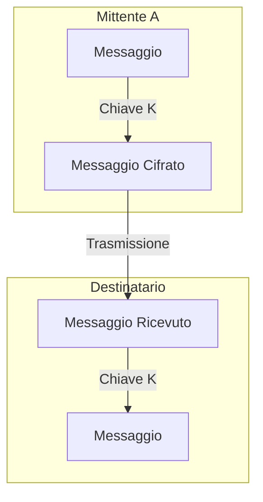
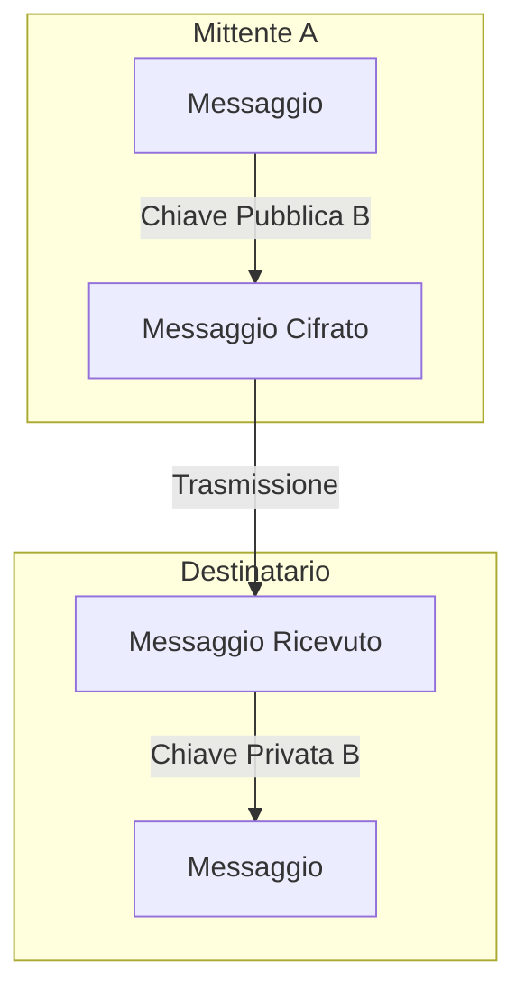
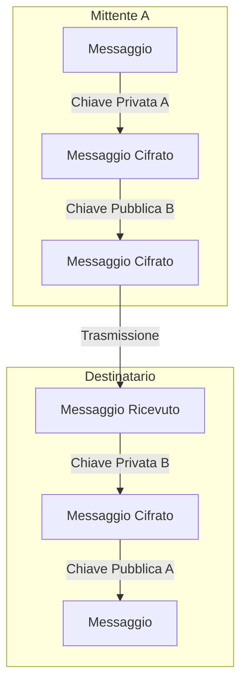
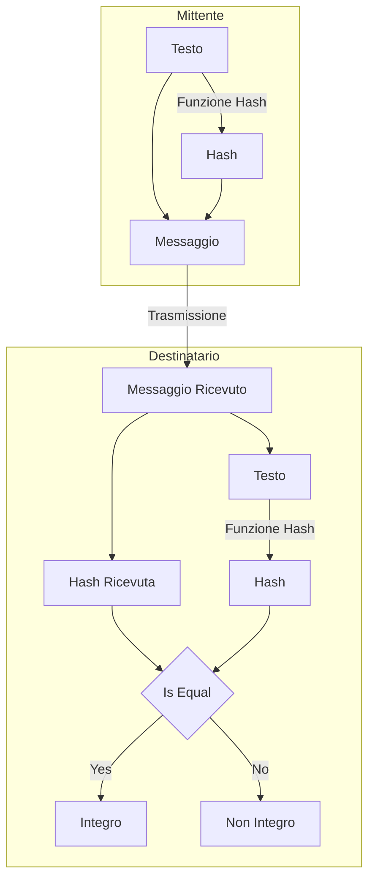
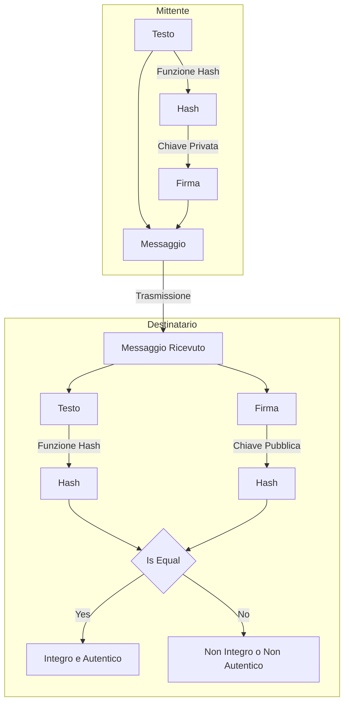
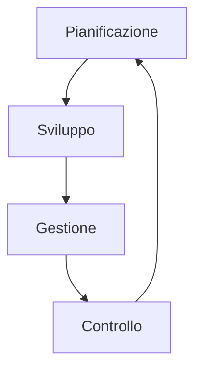
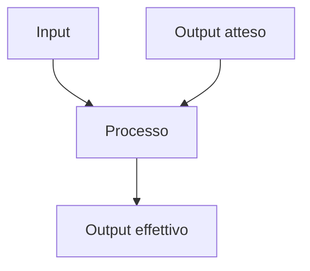
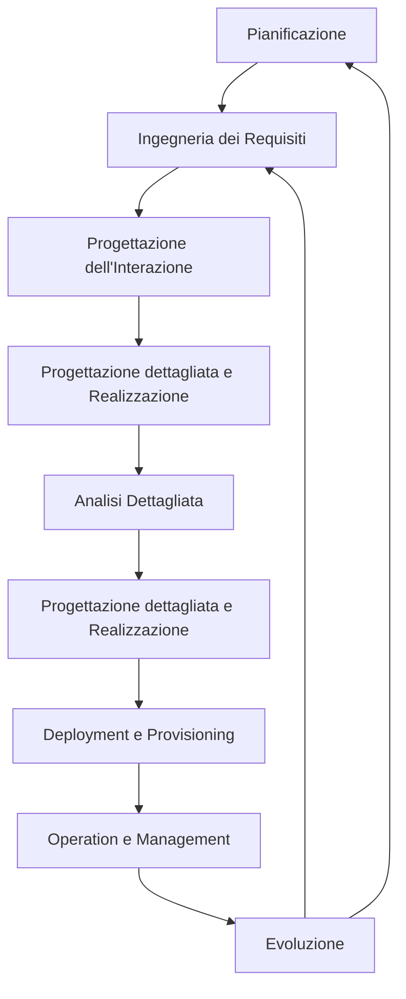

# Sistemi Informativi

## Capitolo Uno: Dati

I dati sono sempre più importanti all'interno del sistema informativo aziendale.
Secondo la **Piramide DIKW** è possibile dividere i dati e le informazioni in:

- **Data**: Il *dato* rappresenta la base della piramide. Esso rappresenta un elemento che descrive la realtà. Associato al dato c'è un tipo (numerico, stringa, etc) o un'unità di misura. Singolarmente il dato è poco utile (es. ci sono 32 gradi).
- **Information**: L'*informazione* è l'interpretazione di un singolo (o un insieme) di dati. Unendo diversi dati è possibile definire un contesto (es. a dicembre ci sono 32 gradi in aula).
- **Knowledge**: La *conoscenza* è ottenibile integrando l'informazione con l'esperienza. (es. se a dicembre ci sono 32 gradi in aula, c'è qualcosa che non va)
- **Wisdom**: La *saggezza* è applicare l'esperienza alla conoscenza per guidare all'azione più adatta al momento. (es. se a dicembre ci sono 32 gradi in aula, spegnere il riscaldamento).


## Capitolo Due: Organizzazioni

### 2.1 Risorse

Le risorse sono ciò con cui un'organizzazione opera, sia materiale che immateriale, e sono divise in:

- **Risorse Esterne**:
  - Ambiente sociale ed economico
  - Mercato
  - Clienti
- **Risorse Interne**:
  - Risorse di scambio: Prodotti, beni e servizi
  - Risorse di struttura: strumenti finanziari, persone, infrastrutture
  - Risorse di gestione: norme, organigrammi, piani, informazioni

Le risorse hanno un ciclo di vita:

- Pianificazione
- Acquisizione
- Gestione
- Manutenzione

### 2.2 Processi

I processi sono un'insieme di attività che l'organizzazione svolge per gestire il ciclo di vita di una risorsa.

#### Piramide di Anthony

Fornisce una classificazione dei processi e della applicazioni.

La tabella si basa su tre livelli:

- **Livello Operativo**: attività di tipo operative.
- **Livello di Programmazione e Controllo**: si considerano le attività tattiche come programmazione delle risorse e il controllo degli obiettivi.
- **Livello di Pianificazione Strategica**: Attività legate alla scelta degli obiettivi e politiche aziendali.


#### Modello di Porter

Questo modello considera esclusivamente i processi di livello operativo.
Le attività sono divise in:

- **Attività Primarie**: Attività verticali orientate agli obiettivi aziendali.
  - Logistica interna
  - Operations
  - Logistica Esterna
  - Marketing e Vendita
  - Servizi
- **Attività di Supporto**: Attività orizzontali che assicurano il corretto funzionamento dei processi primari.
  - Infrastruttura dell'Impresa
  - Gestione delle risorse umane
  - Sviluppo della Tecnologia
  - Approvvigionamenti

## Capitolo Tre: Sistemi informativi

I sistemi informativi sono un insieme di procedure, metodi e strumenti dedicati allo svolgimento di alcune funzioni per raggiungere un risultato.
Il sistema di alimenta di eventi basati da dati, li trasforma in informazioni tramite dei processi.

Un sistema informatico è un componente del sistema informativo. Il sistema IT per mette di elaborare, archiviare e gestire le informazioni secondo le Business Rules.

I sistemi informativi sono divisi in:

- **Sistemi Operazionali**: I quali svolgono operazioni di base, quotidiane. Le parti fondamentali sono la base dati operazionale e funzioni operative.
- **Sistemi Decisionali**: Sono sistemi a supporto delle attività decisionali e strategiche che sfruttano i dati per identificare informazioni utili.

I dati sono classificabili in base al livello (operativo/controllo/strategico).
I dati *operativi* sono ben strutturati, e in alti volume e provenienti dall'interno.
Andando verso il livello *strategico* i dati diventano sempre più aggregati, il formato potrebbe essere meno strutturato e potrebbero provenire anche da fonti esterne.

### 3.1 Base di Dati

I sistemi informativi sono applicazioni che interagiscono con basi di dati.
Le interazioni solitamente avvengono con le *transazioni*.

A seconda delle operazioni i sistemi si identificano come OLTP e OLAP.

#### OLTP

I sistemi **OLTP** (OnLine Transaction Processing) sono sistemi che trattano operazioni basate su un numero elevato di transazioni brevi e online. Questi sistemi sono molto rapidi e sono idonei alla gestione di processi di livello operativo e di controllo.

#### OLAP

I sistemi **OLAP** (OnLine Analytical Processing) sono sistemi che trattano grandi quantità di dati storici che si basano su poche transazioni complesse che aggregano diversi dati e hanno bisogno di molto tempo per essere processate.
Questi sistemi sono utilizzati per l'elaborazioni di dati a livello di pianificazione e strategico.

Un modello OLAP è rappresentato da un *Modello Multidimensionale* e le informazioni sono rappresentata da un *ipercubo*, formato da n *dimensioni* dove ogni dimensione permette di fare un'analisi.
Gli elementi di una base di dati multidimensionali sono:

- **Fatto**: elemento dell'ipercubo ottenuto specificando il valore per ogni dimensione
- **Dimensione**: coordinate degli elementi in corrispondenza ad una dimensione di analisi
- **Misura**: valore quantitativo del fatto elementare

Le dimensioni possono essere numerose e organizzate in maniera gerarchica, basate su dipendenze funzionali.

I sistemi OLAP godono delle proprietà FASMI:

- **Fast**: risponde in tempo ridotto
- **Analytics**: effettua analisi complesse
- **Shared**: permette ad utenti con permessi diversi di accedere ai dati
- **Multidimensional**: visione multidimensionali dai dati
- **Informational**: contiene le informazioni di interesse

Altre caratteristiche del DW sono:

- **Orientato alle entità**
- **Integrato**: i dati vengono prelevate sia da fonti interne che esterne all'azienda
- **Variabile nel Tempo**: i dati sono associati a un'etichetta temporale
- **Persistente**: i dati sono archiviati in sola lettura

### 3.2 Organizzazione e IT

Le scelte all'interno dell'azienda possono avere impatto sulle scelte tecnologiche (*Requirements Pull*) e derivano spesso dall'esigenza di nuove funzionalità o migliorare le funzionalità attuali.
In altri casi i cambiamenti delle nuove tecnologie possono portare a scelte nuove organizzative (*Technology Push*).

## Capitolo Quattro: Enterprise Architecture (EA)

L'*Enterprise Architecture* è usato per analizzare e descrivere lo stato attuale e futuro di un'azienda.
L'EA fornisce una panoramica dei processi, dei sistemi, delle tecnologie e delle capacità dell'azienda.

### 4.1 Framework di Zachman

Questa architettura viene descritta dal **Framework di Zachman** che utilizza una matrice per descrivere l'EA.
Zachman utilizza le colonne per definire gli *Aspetti* da analizzare:

- **Dati** (Cosa): rappresentano i dati che l'organizzazione ha bisogno per operare.
- **Funzioni** (Come): analizza le funzioni che l'azienda esegue per condurre il business.
- **Rete** (Chi): le persone che sono coinvolte nell'esecuzione delle funzioni aziendali.
- **Tempo** (Quando): indica gli elementi significativi del business.
- **Motivazione** (Perché): gli obiettivi dell'azienda.

Le righe invece indicano i *Punti di Vista* che possono interessare gli stakeholder. Ogni riga introduce quindi dei vincoli sul sistema.

- **Scopo** (Contestuale): interessa chi si occupa di pianificazione e rappresenta ad alto livello il sistema in base alla dimensione, forma, relazione e obiettivi.
- **Modello dell'Azienda** (Modello Contestuale): interessa il proprietario del sistema e offre una prospettiva orientata al business.
- **Modello del Sistema** (Modello Logico): interessa il progettista e offre una specifica dettagliata del modello del sistema.
- **Modello Tecnologico** (Modello Fisico): interessa chi deve realizzare il sistema e deve tradurre il progetto logico in fisico.
- **Rappresentazione Dettagliata**: raccoglie le specifiche per i programmatori per la realizzazione effettiva del sistema.

L'intersezione tra le righe e le colonne sono definite *Viste* e forniscono le informazioni su un particolare aspetto in base ad un punto di vista.

## Capitolo Cinque: Elementi Tecnologici

Le tecnologie si possono dividere in tre livelli:

### 5.1 Livello Applicativo

A livello applicativo le tecnologie supportano i processi operazionali e informazionali.
L'insieme delle tecnologie a livello applicativo viene detto *portafoglio applicativo* ed è costituito da:

- **Data Warehouse** (DW): archivio che contiene i dati di un'organizzazione in un modello multidimensionale.
- **Business Intelligence** (BI): insieme di moduli per la raccolta e l'analisi delle informazioni della situazione aziendale.
- **E-Business** (EB): strumenti digitali per la comunicazione, collaborazione tra imprese ed esecuzioni di transazioni.
- **Customer Relationship Management** (CRM): moduli per l'interazione con i clienti potenziali ed esistenti.
- **Enterprise Resource Planning** (ERP): suite di software formata da diversi moduli per supportare le attività aziendali.
- **Advanced Planning and Scheduling** (APS): Applicazioni usate in ambito manifatturiero per gestire le materie prime e la capacità produttive.
- **Manufacturing Execution System** (MES): Sistemi usati in ambito manifatturiero per tracciare e documentare il processo produttivo.

Le applicazioni sono strutturate in livelli logici detti *layer*:

- **Presentazione** (P): gestisce la logica legata alle interfacce grafiche e all'interazione con l'utente (front-end).
- **Applicativo** (A): gestisce le funzionalità dell'applicazione (back-end).
- **Accesso ai Dati** (D): gestisce le informazioni, tramite db o sistemi legacy.

Data la complessità della realizzazione (*make*) di applicazioni si predilige l'acquisto (*buy*), soprattutto di applicazioni come ERP e CMS.

#### ERP

Gli ERP sono software che offrono moduli a supporto del sistema operazionale.
Le proprietà che contraddistinguono gli ERP sono:

- **Unicità dell'Informazione**: presenza di un'unica base di dati per tutti i moduli per evitare ridondanza e incongruenza di dati.
- **Modularità**: i moduli sono autonomi ed auto-sufficienti, permettendone l'acquisto separato, aumentando la flessibilità e la scalabilità dell'applicazione.
- **Prescrittività**: i moduli incorporano la logica di "funzionamento" dell'impresa, permettendo di normare i processi.

I moduli possono essere poi divisi in tre categorie:

- **Sistemi Istituzionali**: moduli orizzontali (*intersettoriali*).
- **Moduli Settoriali**: moduli verticali specifici per un contesto aziendale.
- **Moduli Direzionali**: moduli orizzontali che elaborano i dati per dare una visione di insieme delle attività.

#### CRM

I CRM sono una suite di software che supportano le organizzazioni nelle interazione con i clienti. Questi software aiutano a capire i bisogni e i comportamenti degli utenti, migliorandone l'interazione.
Questi sistemi sono utili in contesti con una forte relazione con la clientela.

Il CRM ha tre componenti principali:

- **CRM Operativo**: è un modulo che si occupa dell'interazione dei clienti con l'azienda ed è formato da alcuni moduli:
  - **Marketing**: la strategia aziendale si baso soprattutto sulla fidelizzazione dei clienti attuali, questo è realizzabile tramite una buona campagna dedicata delle campagne marketing e sui dati a disposizione. Alcuni sistemi per fare ciò sono:
    - *Generazione Liste Clienti*: liste di clienti adatti a ricevere alcune comunicazioni di marketing.
    - *Gestione Campagne*: moduli progettati per l'automatizzazione delle attività e i processi di marketing
    - *Cross-Selling* e *Up-selling*: queste strategie si basano sull'aumento dei prodotti acquistati dall'utente e dall'aumento del del valore della singola vendita.
  - **Automazione Vendite**: sono moduli che permettono:
    - *Gestione Vendite*: modulo che si occupa della selezione dei contatti, supportare l'agente nella stesura dell'offerta
    - *Gestione Contatti*: gestisce i dati dei clienti permettendo di salvare anche informazioni aggiuntive che possono migliorare il rapporto con il cliente.
    - *Gestione Opportunità*: modulo che si occupa di trovare nuovi clienti o organizzazioni per vendite future.
  - **Servizi ai Clienti**: sono servizi che si occupano di curare la relazione post-vendita per migliorarne i rapporti. Alcuni sotto-moduli sono:
    - *Contact Center*: gestiscono le chiamate *inbound* (clienti chiamano azienda) e *outbound* (azienda chiama i clienti). Il CRM registra tutte le interazioni e fornisce funzionalità per la gestione della chiamata.
    - *Web Based Self Service*: permette ai clienti di usare il web per trovare le soluzioni ai problemi e contattare l'azienda.
    - *Call Scripting*: una base di dati messa a disposizione degli operatori con le soluzioni ai problemi dei clienti.
- **CRM Analitico**: usa i dati provenienti dal CRM Operativo per analizzare le preferenze, i comportamenti dei clienti ed estrarre pattern significativi a supporto del processo decisionale tramite il CRM Operativo. Le sue finalità principali sono:
  - *Reporting*: capire chi sono i clienti, le loro caratteristiche e preferenze.
  - *Analysis*: segmenta i clienti in categorie.
  - *Predicting*: predice le azioni e i desideri dei clienti.
- **CRM Collaborativo**: si occupa di calcolare alcuni indici rilevanti per l'intera azienda e condividere tali informazioni.

### 5.2 Livello di Piattaforma

L'implementazione delle applicazioni richiede l'utilizzo di componenti di supporto divise in quattro categorie:

- **Tecnologie Orientate alle Funzionalità**: Alcuni esempi sono:
  - **DataBase Management System** (DBMS): per gestire l'accesso e manipolazione dei dati.
  - **Business Process Management System** (BPMS): per modellare, automatizzare, eseguire, controllare e ottimizzare i flussi di attività.
  - **User Interface System** (UIS): servizi per l'interazione con gli utenti.
  - **Rule Engine**: sistema per definire, testare, eseguire regole di business.
- **Tecnologie Orientate agli Aspetti Funzionali**: tecnologie per garantire caratteristiche non funzionali (efficienza, sicurezza e la correttezza)
- **Tecnologie di Base**: tecnologie che permettono la comunicazione tra le applicazioni e i componenti.
- **Advanced Platform Technology**: sistemi per messaggistica, gestione degli eventi e delle transazioni.

### 5.3 Livello di Architettura Fisica

Questo livello indica l'architettura fisica che hosta l'applicazione.

## Capitolo Sei: Analisi dei Dati

I dati sono essenziali per supportare i processi decisionali all'interno dell'azienda. Bisogna quindi essere in grado di aggregare e interrogare i dati per analizzare ed estrarre eventuali correlazioni.
Alcuni strumenti di supporto alle decisioni sono:

- Report: mostrano dati analitici statici, con i quali non è possibile interagire e offrono una visione limitata
- Fogli di Calcolo: le analisi sono definite dall'utente, ma possono richiedere procedimenti complessi per estrarre i dati.

I dati a supporto delle attività strategiche e decisionali si caratterizzano per:

- *Obiettivo*: servono per prendere decisioni
- *Utenti*: sono utilizzati solo dai manager di alto livello
- *Orizzonte temporale*: sono utilizzati soprattutto dati storici relazionati a quelli presenti
- *Livello di Dettaglio*: sono dati aggregati a presi dai dati operazionali o da fonti esterne
- *Accesso*: l'accesso è in sola lettura

### 6.1 Data Warehouse

il Data Warehouse è una base di dati di tipo [OLAP](#olap) che si distingue dai tradizionali DBMS che sono sistemi di tipo [OLTP](#oltp), i quali sono caratterizzati da un gran numero di operazioni brevi.

All'interno del data warehouse è possibile individuare diversi basi di dati organizzati in maniera gerarchica.

Al primo livello si trovano le **sorgenti**, ovvero le fonti che popolano il DW, come il la base di dati operazionale e basi di dati esterne.
Queste sorgenti vengono sottoposte an operazioni dette ETL (Extraction, Transformation e Loading) che trasformano i dati dalle sorgenti in base alla struttura multidimensionali dell'OLAP.

A livello intermedio può esistere una base di dati intermedia detta **Staging Area**

In fine si trovano i **Data Mart** ovvero dei piccoli data warehouse tematici che contengono un estratto/vista delle informazioni del data warehouse. Questa divisione dei dati viene svolta in quanto il data warehouse può essere molto grande e i data contenuti non interessano a tutti gli utenti

Durante il processo **ETL** di *estrazione*, vengono definiti quali e come (aggregare, copiare, etc) devono essere estratti i dati. L'estrazione può essere *statica* se vengono considerati tutti i dati dei sorgenti; *Incrementale* se vengono presi in considerazione solo i dati creati a partire dall'ultimo aggiornamento.
I dati possono subire alcune trasformazioni come:

- **Data Cleaning**: i dati possono contenere errori che devono essere corretti. Questa fase risolve i problemi relativi alla qualità dei dati
- **Riconciliazione**: mettere in relazione i dati relativi alle stesse entità
- **Standardizzazione dei Formati**: i dati proveniente da sorgenti eterogenee devono essere standardizzati. Alcune operazioni sono:
  - Congiungere e spezzare i campi
  - Standardizzare dei codici
  - Standardizzazione dei formati
- **Ricerca ed Eliminazione dei Duplicati**: assicurarsi che non siano presenti gli stessi dati da sorgenti diverse

Le operazioni ETL sono documentate da **Metadati** che raccolgono:

- **Struttura del Data Warehouse**: dati come schemi, viste, dimensioni, gerarchie, etc
- **Metadati Operazionali**: storia, l'origine e le trasformazioni dei dati
- **Metadati per Mappare dati Operazionali ai dati del DW**
- **Statistiche**: descrivere come e quando viene utilizzato il dw

#### Modello Concettuale

I Data Warehouse vengono rappresentati tramite il **Dimensional Fact Model** (DFM) dove:

- Il *fatto* è rappresentato da un rettangolo che contiene le misure
- Le *dimensioni* sono rappresentate da cerchi etichettati e collegati ai fatti. Possono essere semplici attributi o gerarchie.

#### Modello Logico

Definito il modello concettuale esso deve essere memorizzato in un DBMS. Alcuni esempi sono:

- **Modello MOLAP** (Multidimensional OLAP): traduce il modello concettuale in una base multidimensionale. La traduzione avviene in maniera esatta e rende le interrogazioni efficienti e veloci. Queste basi di dati sono meno diffuse delle basi relazionali classiche e i linguaggi sono spesso proprietari
- **Modelli ROLAP** (Relational OLAP): traduce il modello concettuale in un modello relazionale che memorizza i dati tramite tabelle. Le interrogazioni avvengono con linguaggi come SQL. Questo modello ha lo svantaggio di essere più lento e spesso è difficile rappresentare perfettamente il modello multidimensionale.
- **Modelli HOLAP** (Hybrid OLAP): traduce il modello multidimensionale in un ibrido, solitamente usando una base di dati relazionale. la base multidimensionale sono usare per data mart tematici

Per mappare la base multidimensionale è necessario definire le tabelle.
Per fare ciò esistono due approcci:

- **Schema a Stella**: viene utilizzata una *tabella dei fatti* per memorizzare gli attributi corrispondenti alle misure del fatto ed ad ogni riga corrisponde un fatto; viene utilizzata la *tabella delle dimensioni*, per ogni dimensione, associa al fatto gli attributi relativi alla gerarchia.
- **Schema a Fiocco di Neve**: ad ogni dimensione vengono associate più tabelle che permettono di conservare le dipendenze funzionali.

#### Operazioni

I Data Warehouse comprende un'insieme di tecniche per analizzare i dati:

- **Drill-Down**: permette di ottenere dati dettagliati scendendo lungo la gerarchia di una dimensione, passando da un livello di aggregazione alto ad uno basso.
- **Roll-Up**: permette di passare da un livello dettagliato ad uno più ad alto livello.
- **Slice**: permette di focalizzare l'analisi su una porzione di dati fissando il valore di una delle dimensioni di analisi.
- **Dice**: permette di identificare un insieme di coordinate che riduce l'ipercubo

### 6.2 Data Mining

Il *Data Mining* è una tecnica che permette di riconoscere ed estrarre in modo automatico informazioni utili dai dati.

Il Data Mining si basa sulle seguenti fasi:

- **Selezione dei Dati**: vengono selezionati i dati rilevanti per l'analisi
- **Cleaning**: i dati vengono puliti per eliminare errori e ridondanze
- **Trasformazione**: i dati vengono trasformati in un formato adatto all'analisi, soprattutto quando i dati provengono da fonti diverse
- **Data Mining**: analisi dei dati per estrarre informazioni utili
- **Valutazione**: valutazione dei risultati ottenuti
- **Presentazione**: presentazione dei risultati

Le funzioni di Data Mining possono essere di diverse categorie:

- **Machine Learning**: istruire gli algoritmi con esempi ideali tramite tecniche di apprendimento supervisionato o non supervisionato
- **Tecniche descrittive**: analizzano i dati e li categorizzano, filtrano e aggregano per trovare pattern con funzioni matematiche
- **Tecniche predittive**: analizzano i dati per fare previsioni sul futuro

L'estrazione di informazioni dai dati può avvenire tramite:

- **Generalizzazione**: riduzione del numero di dati escludendo quelli non significativi e ad alta variabilità
- **Caratterizzazione**: capire la distribuzione dei dati, le tendenze (massimo, minimo, media, etc) e la variazione
- **Associazione**: le regole associative mettono in relazione due o più attributi che si verificano spesso contemporaneamente.
  Queste associazioni sono espresse dalla regola `X ⇒ Y` dove `X` è l'antecedente e `Y` il conseguente.
  La validità di una regola è data da:
  - **Supporto**: frequenza con cui si verifica la regola P(X ∩ Y)
  - **Confidenza**: probabilità che la regola sia valida P(Y|X)
- **Classificazione**: assegnare un oggetto ad una classe predefinita in base alle sue caratteristiche.
  Questa tecnica si basa su un modello addestrato tramite apprendimento supervisionato. I modelli possono essere caratterizzati in base all'accuratezza, la velocità, la scalabilità, la robustezza e la interpretabilità.
  L'accuratezza è data dal numero di classificazioni corrette (veri positivi (TP) e veri negativi (TN)) rispetto al numero di classificazioni errate (falsi positivi (FP) e falsi negativi (FN)): `Accuratezza = (TP) / (TP + FP)`
- **Clustering**: raggruppare gli oggetti in base alle loro caratteristiche. Questa tecnica si basa su un modello addestrato tramite apprendimento non supervisionato, privi di classi d'appartenenza predefinite. L'appartenenza ad un cluster è data dalla somiglianza massima con gli altri oggetti del cluster e la somiglianza minima con gli oggetti degli altri cluster.
  Gli algoritmi possono essere classificati in base all'assegnazione degli elementi in un cluster:
  - **Esclusivi**: ogni elemento appartiene ad un solo cluster
  - **Sovrapposti**: un elemento può appartenere a più cluster
  - **Fuzzy**: un elemento può appartenere a più cluster in base ad un peso
  - **Complete**: ogni elemento appartiene ad un cluster
  - **Parziali**: un elemento può non appartenere a nessun cluster

### 6.3 Process Discovery

Il *Process Discovery* è una tecnica che permette di estrarre i processi da un insieme di dati, solitamente da un log di eventi.

Le relazioni che possono esistere tra gli eventi sono:

- **Successione**: un evento segue direttamente l'altro (x > y)
- **Causale**: un evento causa l'altro (x → y)
- **Parallelo**: due eventi avvengono contemporaneamente (x || y se x > y e y > x)
- **Scelta**: due eventi non vengono mai eseguiti in sequenza (x # y se ~ (x > y) e ~ (y > x))

Questa analisi permette di analizzare la frequenza delle attività, durata delle attività, la sequenza delle attività e la relazione tra le attività.
Queste informazioni possono essere utilizzate per migliorare i processi, identificare i problemi e le opportunità.

## Capitolo Sette: Tecnologie Livello Piattaforma

Le tecnologie a livello piattaforma forniscono l'infrastruttura, gli strumenti e i servizi che consentono lo sviluppo.
Un sistema informativo è formato da diversi moduli applicativi che realizzano delle funzionalità. Tali moduli devono essere collegati tra di loro per permettere la collaborazione.

E' importante che tra i vari moduli ci sia un buon flusso informativo perché

- Informazioni rilevanti per più funzioni necessiterebbero della duplicazione di tali dati, generando un problema nella gestione e incongruenze in caso di modifica
- Si evita lo scambio di informazioni diretto tra operatori umani limitando il rischio di errore
- Una struttura a *silos* (Siloed applications, applicazioni che non comunicano) influenza la struttura aziendale che vede una mancanza di collaborazione

Spesso il sistema informativo aziendale deve comunicare con sistemi di aziende esterne. E' probabile che questi sistemi siano differenti, bisogna quindi trovare tecniche per collaborare efficacemente.

### 7.1 Tecniche di Integrazione

Per poter coordinare attività intra-organizzative e inter-organizzative bisogna adottare tecniche di integrazione quali:

#### Integrazione a Livello Dati

Per garantire incongruenze tra dati è essenziale che sia presente un'unica sorgente condivisa.

Una prima soluzione potrebbe essere quella di utilizzare un'unica base di dati comune dove ogni operazione è immediatamente visibile agli altri applicativi.
Questa soluzione risulta essere radicale in quanto potrebbe essere necessario ripensare interamente il sistema attuale.

Una soluzione più flessibile consiste nell'introdurre un *middleware* che garantisce la congruenza tra i dati presenti in diversi database in caso di duplicazione.
Il *middleware* si occupa anche di uniformare il **formato** e la **semantica** dei dati provenienti da db differenti.

I problemi che si originano dall'integrazione dei dati sono:

- **Rappresentazione**: la stessa informazione può essere rappresentata diversamente tra i diversi moduli.
- **Struttura**: la rappresentazione è uguale, ma i campi sono ordinati in maniera differente.
- **Presentazione**: lo stesso dato può essere presentato in formati diversi (esempio il prezzo in base alla valuta di riferimento dell'azienda)

#### Integrazione a livello di Logica Applicativa

Un altro approccio consiste nel mettere in comunicazione diretta diversi applicativi.
Questo approccio non è sempre possibile e dipende dall'apertura dell'applicativo.

#### Integrazione a Livello di Presentazione

Questo approccio è possibile in applicativi modulari dove il frontend è separato dal backend ed è quindi possibile modificare il client per interagire con funzioni lato server di altri applicativi.

### 7.2 Modelli di Integrazione delle Applicazioni

L'integrazione delle tecniche di integrazione può avvenire mediante diversi modelli:

#### Architettura Punto-a-Punto

In questo modello ogni applicazione è connessa in maniera diretta alle altre tramite API personalizzate.
Questa architettura porta porta i singoli sistemi a comunicare in maniera indipendente, senza un intermediario centralizzato.

La logica di integrazione viene codificata internamente a ciascun sistema rendendo difficile la sostituzione di uno dei componenti.
Questa soluzione risulta poco scalabile in quanto, per ogni applicazione, sono presenti N-1 interfacce. Questo porta a dover implementare N^2 interfacce, dove N è il numero di applicazioni coinvolte.

#### Architettura Hub-and-Spoke

Questo modello di basa sull'introduzione di un **hub** centrale a cui vengono collegati i vari sistemi tramite *adattatori* (**spoke**).
In questo modo il collegamento tra i vari moduli viene gestito da un componente apposito. Questo permette di astrarre la comunicazione che non deve essere sviluppata ad-hoc per ogni componente.

Questo modello permette di coordinare il flusso di informazioni, indirizzando le richieste ed effettuando eventuali trasformazioni tra i dati.

Questa soluzione permette una maggiore sostituibilità dei componenti portando ad implementare solo N interfacce, una per applicazione.

#### Integrazione con BPMS

Nell'architettura hub-and-spoke, la realizzazione comprende la definizione di alcune regole. Qualora le applicazioni siano numerose, e sia necessario un coordinamento tra le funzionalità che possono variare nel tempo, è possibile usare un applicativo a livello di piattaforma come supporto all'automatizzazione.

Un **Business process Management System** (BPMS), detto anche Workflow component, consente, tramite dei processi, di gestire lo stato dei flussi informativi e semplifica le modifiche nei moduli applicativi.
E' possibile definire processi di integrazione tramite componenti di automazione consentendo lo scambio di messaggi in maniera integrata.

#### Architettura a Servizi

Questa architettura si basa sul paradigma dell'*architettura orientata ai servizi* (SOA) che prevede la realizzazione delle funzionalità in maniera modulare interrogabili tramite il protocollo HTTP.

Questa architettura permette di essere invocata sia internamente che esternamente all'azienda.

I vari servizi hanno un alto livello di disaccoppiamento permettendo l'indipendenza tra servizi.
Questa architettura ha anche il vantaggio di funzionare come una scatola nera dove i consumatori necessitano di conoscere solo l'interfaccia per chiamare la funzionalità.

Questo paradigma facilita l'integrazione dato che ciascun componente definisce la propria interfaccia che specifica i servizi offerti dal sistema, quali messaggi vengono scambiati in ingresso e in uscita.

#### Composizione e Orchestrazione di Servizi

Sevizi diversi possono essere usati in maniera congiunta da una singola applicazione. Bisogna poter quindi comporre un servizio più complesso a partire da servizi atomici.

Per comporre un servizio si usa una *service orchestration* che determina una sequenza di invocazione per i servizi.

## Capitolo Otto: Tecnologie livello Architettura Fisica

Le architetture fisiche si dividono solitamente in *centralizzate* e *distribuite*.

In un'**architettura centralizzata**, tutti i componenti (dita e le applicazioni) sono localizzati in un unico nodo di elaborazione.

Questa era una delle prime soluzioni e presentava solo pochi *terminali* che interagivano con il software installato sul *mainframe*.

L'avvento dei personal computer, del modello client/server e delle reti di comunicazione ha portato alla nascita delle **architetture distribuite**.

Un'architettura si dice distribuita quando una delle seguenti condizioni è verificata:

- **Elaborazione Distribuita**: le applicazioni, fra loro cooperanti, sono distribuite su più nodi
- **Base di Dati Distribuita**: i dati sono distribuiti su più nodi

### 8.1 Applicazioni Distribuite

Nei sistemi distribuiti i livelli logici (*layer*) sono distribuiti su una o più macchine detti livelli (*tier*).
A seconda di come avviene la distribuzione dei layer sui tier si possono avere diverse architetture:

#### Architettura Single Tiered

Questa architettura si basa su un unico nodo di elaborazione che contiene tutti i layer logici.

Questa architettura risulta simile ai mainframe e presenta i seguenti vantaggi: prestazioni elevate, affidabilità, sicurezza e facilità di manutenzione.

Questa architettura presenta però dei limiti in termini di scalabilità e flessibilità.

#### Architettura Two-Tiered

Questa architettura si basa su due nodi di elaborazione: il client e il server. In questo modo l'elaborazione è divisa tra i due nodi.

In base a come avviene la distribuzione dei layer (Presentazione, Applicativa e Gestione Dati) sui due nodi si possono avere due tipi di architetture:

- **Thin Client**: il client si occupa solo della presentazione, mentre il server si occupa della logica applicativa e della gestione dei dati.
- **Thick Client**: il client si occupa della presentazione e parte (o tutta) la logica applicativa, mentre il server si occupa della gestione dei dati.

#### Architettura Three-Tiered

Questa architettura si basa su tre nodi di elaborazione: il client, un server intermedio (middle tier) e un server per la gestione dei dati.

Un sistema a tre tier conferisce buona scalabilità e flessibilità.

#### Architettura N-Tiered

Per diminuire il carico sui server e migliorare le prestazioni si possono aggiungere ulteriori nodi di elaborazione dove ognuno si occupa di un compito specifico.

### 8.2 Scalabilità

Con scalabilità si intende la capacità di un sistema di adattarsi a un aumento di carico.

Esistono due tipologie di scalabilità:

- **Scalabilità Verticale** (scale-up): consiste nell'aggiungere risorse (CPU, RAM, etc) ad un singolo nodo di elaborazione. Questa soluzione è abbastanza semplice da realizzare, ma ha dei limiti in termini di prestazioni a causa dei limiti fisici.
- **Scalabilità Orizzontale** (scale-out): consiste nell'aggiungere nuovi nodi di elaborazione per distribuire il carico. Questa soluzione necessita l'introduzione di un sistema di load balancing per distribuire il carico di lavoro tra le diverse macchine.

In ambito web si tende a parlare di *elasticità* del sistema piuttosto che di scalabilità. Un sistema è elastico se è in grado di adattarsi automaticamente alle variazioni di carico.

#### Server Farm

Una *server farm* è un insieme di server che condividono un carico di lavoro. Questa soluzione permette di distribuire il carico di lavoro tra i vari server (scale-out).

Le server farm possono essere realizzate secondo due principi:

- **Cloning**: i server sono identici e contengono le stesse informazioni. Questa soluzione presenta un'ottima tolleranza ai guasti. I dati vengono gestiti in due modalità:
  - **shared-nothing**: i dati sono replicati tra i vari server. Questa soluzione risulta problematica in caso di aggiornamenti frequenti dei dati.
  - **shared-disk**: i server condividono un server dedicato alla memorizzazione e alla gestione dei dati.
- **Partitioning**: i server contengono informazioni e applicativi differenti.

### 8.3 Virtualizzazione

La *virtualizzazione* è una tecnica che permette di creare una versione virtuale di un sistema operativo. Questo permette di:

- Disaccoppiare le risorse fisiche dalle applicazioni
- Frazionare una risorsa fisica in più risorse virtuali
- Creare un ambiente di isolato

Le risorse virtuali sono dette *macchine virtuali* (VM) e sono gestite da un software detto *hypervisor*.

Questa tecnica permette di avere all'interno della medesima macchina fisica più macchine virtuali, ognuna con la propria applicazione.

### 8.4 Cloud Computing

Il *Cloud Computing* è un modello che permette l'accesso a risorse informatiche tramite internet, senza la necessità di possedere fisicamente le risorse.

Le risorse sono offerte da un *cloud provider* che si occupa della gestione delle risorse, e della manutenzione, che vengono fornite on-demand (solo quando servono).

Il cloud computing si basa su cinque **caratteristiche**:

- **On-demand self-service**: le risorse possono essere richieste e rilasciate autonomamente
- **Accesso alla rete onnipresente**: le risorse sono accessibili tramite internet
- **Accesso indipendente dalla locazione**: le risorse sono accessibili da qualsiasi luogo
- **Elasticity**: le risorse possono essere scalate in base alle necessità
- **Monitoraggio sull'utilizzo**: le risorse sono monitorate e il costo è in base all'utilizzo

Il cloud computing si basa su tre modelli di **servizio**:

- **IaaS** (Infrastructure as a Service): il cloud provider fornisce le risorse di base (CPU, RAM, Storage) e il cliente si occupa di installare e gestire il software su una VM gestita dall'utente.
- **PaaS** (Platform as a Service): il cloud provider fornisce le risorse fisiche e alcune tecnologie di livello piattaforma come il DBMS.
- **SaaS** (Software as a Service): il cloud provider fornisce un'applicazione pronta all'uso e il cliente non ha alcun controllo sul servizio, ma può solo configurare alcuni parametri.
- **\*aaS** (Everything as a Service): il cloud provider fornisce i vari componenti a livello applicativo.

Il cloud computing si basa su quattro modelli di **deployment**:

- **Private Cloud**: il cloud è fornito per un'unica organizzazione. Questo modello permette di avere un maggiore controllo sulla sicurezza e sulla privacy.
- **Community Cloud**: il cloud è fornito per un gruppo di organizzazioni che condividono gli stessi interessi.
- **Public Cloud**: il cloud è fornito per il pubblico in generale. Questo modello è il più economico, ma presenta dei problemi di sicurezza e privacy.
- **Hybrid Cloud**: il cloud è una combinazione di due o più cloud.

## Capitolo Nove: Sicurezza

La sicurezza nei sistemi informativi è l'insieme delle misure atte a proteggere i seguenti requisiti:

- **Integrità**: il sistema deve impedire l'alterazione delle informazioni, sia da parte di utenti e processi non autorizzati, sia da eventi accidentali
- **Autenticità**: il sistema deve garantire che le informazioni siano autentiche e che l'utente sia chi dice di essere. Per fare ciò bisogna avere un sistema di *autenticazione*. Ogni *agente* (entità in grado di intraprendere azioni col sistema) deve essere identificato prima di poter interagire col sistema.
- **Riservatezza**: nessun utente non autorizzato deve poter accedere alle informazioni che non è autorizzato a conoscere.
- **Disponibilità**: il sistema deve rendere disponibili agli utenti abilitati, le informazioni e le risorse alle quali hanno accesso.
- **Non Ripudio**: il sistema deve garantire che un utente non possa negare di aver compiuto un'azione.

### 9.1 Minacce alla Sicurezza

Le minacce alla sicurezza possono essere di vario tipo:

- **Fisiche**: danni all'infrastruttura del sistema
- **Logiche**: sottrazione o alterazione delle informazioni o risorse
- **Accidentali**: errori di configurazione del software, malfunzionamenti, etc

Le minacce logiche nascono dalla presenza di *vulnerabilità* nel sistema. Una vulnerabilità è una debolezza del sistema che può essere sfruttata da un attaccante per compromettere la sicurezza del sistema.
Le vulnerabilità vengono sfruttate da *exploit*, ovvero tecniche che sfruttano le vulnerabilità per compiere azioni non autorizzate.

Gli *attacchi* sono azioni che colpiscono le basi di dati, infrastrutture, le reti o dispositivi tramite atti malevoli finalizzati al furto. alterazione o distruzione di elementi, violando le regole d'accesso.

Gli attacchi più comuni a livello di rete sono:

- **Sniffing**: intercettazione dei messaggi scambiati tra due agenti
- **Spoofing**: falsificazione dell'identità di un agente
- **Hijacking**: deviare le comunicazioni verso un agente malevolo al fine di intercettare e modificare i messaggi
- **Flooding**: intasamento della rete con traffico non desiderato al fine di creare un Denial of Service (DoS)

Gli attacchi più comuni a livello applicativo sono:

- **Phishing**: invio di email fraudolente per ottenere informazioni sensibili
- **Malware**: software malevolo che danneggia il sistema
  - **Virus**: software che si auto-replica e si diffonde tramite altri programmi
  - **Worm**: software che si auto-replica e si diffonde autonomamente
  - **Trojan**: software che si presenta come legittimo, ma in realtà è malevolo
  - **Ransomware**: software che limita l'accesso al sistema e chiede un riscatto per sbloccarlo
- **Backdoor**: programma progettato per bypassare le misure di sicurezza, solitamente per motivi di manutenzione, ma può essere sfruttato da un attaccante
- **Spyware**: software che raccoglie informazioni sulle attività dell'utente senza il suo consenso
- **Vulnerabilità Zero-Day**: vulnerabilità sconosciuta agli sviluppatori e agli utenti

E' necessario adottare misure per difendersi da queste minacce che possono essere sia di origine esterna che interna.

### 9.2 Crittografia

Crittografare significa codificare un messaggio in modo che solo il destinatario possa leggerlo.

I meccanismi si crittografia sa basano sulla presenza di un algoritmo (*funzione crittografica*) e una chiave.
La segretezza della chiava è fondamentale per garantire la sicurezza del messaggio e deve essere scelta tra un vasto numero di combinazioni (*spazio delle chiavi*) e deve essere cambiata periodicamente (One Time Password OTP).

La sicurezza dipende dalla lunghezza della chiave e dall'ampiezza dei possibili valori della chiave.

La crittografia si divide in due categorie:

#### Crittografia Simmetrica

Nella crittografia simmetrica mittente e destinatario condividono la stessa chiave segreta K che deve essere condivisa in maniera sicura.
Il mittente codifica il messaggio con la chiave segreta e il destinatario lo decodifica con la stessa chiave.
Questo tipo di cifratura ha il vantaggio di essere veloce, ma presenta il problema dello scambio della chiave.



In caso di sniffing, l'attaccante può intercettare numerosi messaggi cifrati ed applicare un'analisi per ricavare la chiave K. Per evitare questo problema si cerca di cambiare spesso la chiave K, tendenzialmente ad ogni sessione.

Le tecniche principali della crittografia simmetrica sono:

- **Sostituzione**: sostituzione di un carattere con un altro secondo una regola ben definita (esempio: cifrario di Cesare)
- **Trasposizione**: permutazione dei caratteri del messaggio secondo una regola ben definita (esempio: cifrario di Colonna)

Spesso per garantire la sicurezza vengono applicati in blocco sia la sostituzione che la trasposizione.

Per la massima sicurezza la lunghezza della chiave dovrebbe essere uguale alla lunghezza del messaggio da cifrare.

Alcuni esempi sono: DES, 3DES, AES.

#### Crittografia Asimmetrica

Nella crittografia asimmetrica mittente e destinatario possiedono due chiavi distinte: una chiave pubblica Kpub e una chiave privata Kpriv.
Il principio è che un messaggio cifrato con la chiave pubblica può essere decifrato solo con la chiave privata e viceversa.

Per garantire la sicurezza, la chiave pubblica deve essere resa pubblica, mentre la chiave privata deve essere mantenuta segreta e non deve essere possibile risalire alla chiave privata a partire dalla chiave pubblica, e viceversa.

Questo tipo di cifratura è più lenta della simmetrica, ma presenta il vantaggio di non dover scambiare la chiave.

Quando il mittente A vuole inviare un messaggio al destinatario B, cifra il messaggio con la chiave pubblica di B. Solo B potrà decifrare il messaggio con la sua chiave privata.



Questa prima configurazione ha il problema che essendo la chiave di B pubblica, chiunque può cifrare un messaggio per B (man-in-the-middle).
Per ovviare a questo problema si può introdurre una fase di autenticazione di A, dove A cifra il messaggio con la propria chiave privata e la chiave pubblica di B. In questo modo B può decifrare il messaggio con la chiave pubblica di A e la propria chiave privata.



La generazione delle chiavi avviene mediante una semplice funzione matematica che genera due chiavi distinte, ma correlate. E' importante che la funzione inversa sia difficile da calcolare.

Un esempio di crittografia asimmetrica è RSA che genera le chiavi basandosi sulla fattorizzazione di numeri primi:

1. Si scelgono due numeri primi elevati $p$ e $q$
2. Si calcola $n = p * q$ e $z = (p - 1) * (q - 1)$
3. Si sceglie un numero $e$ (con $e < n$) coprimo con $z$
4. Si calcola $d$ tale che $(d * e) \mod z \equiv 1$
5. Si definiscono le chiavi pubbliche e private:
   - Chiave Pubblica: $(n, e)$
   - Chiave Privata: $(n, d)$

Dato il messaggio da cifrare $m$ e il messaggio cifrato $c$, la cifratura e decifratura avvengono come segue:

- Cifratura: $c = m^e \mod n$
- Decifratura: $m = c^d \mod n$

Lo svantaggio della cifratura asimmetrica è la lentezza computazionale. Per ovviare a questo problema si utilizza la cifratura asimmetrica per scambiare in maniera sicura la chiave simmetrica che verrà utilizzata per la comunicazione.

### 9.3 Integrità e Funzione di Hash

La *funzione di hash* è una funzione che mappa un input di lunghezza arbitraria in un output di lunghezza fissa chiamato *fingerprint*, *hash* o *digest*.

La funzione di hash deve avere le seguenti proprietà:

- **Deterministica**: dato un input, la funzione deve restituire sempre lo stesso output
- **Univocità**: la probabilità che due input diversi producano lo stesso output deve essere molto bassa
- **Non Invertibilità**: non deve essere possibile risalire all'input a partire dall'output

Le funzioni di hash sono utilizzate per garantire l'integrità dei dati. Per garantire l'integrità di un messaggio, il mittente calcola l'hash del messaggio e lo invia insieme al messaggio. Il destinatario calcola l'hash del messaggio ricevuto e lo confronta con l'hash ricevuto. Se i due hash coincidono, il messaggio è integro.



#### Firma Digitale

La *firma digitale* è un meccanismo che permette di garantire l'autenticità e l'integrità di un messaggio.

Per creare una firma digitale, il mittente calcola l'hash del messaggio e lo cifra con la propria chiave privata. Il destinatario decifra la firma con la chiave pubblica del mittente e confronta l'hash del messaggio con l'hash ricevuto.



#### Gestione delle chiavi

La crittografia necessita di un sistema di gestione delle chiavi che permetta di generare, distribuire, archiviare e distruggere le chiavi.

La **Generazione delle Chiavi** viene svolto da chi svolgerà le operazioni crittografiche, o in casi particolari da un ente certificatore.

Lo **Scambio delle chiavi** è un'operazione delicata che deve essere svolta in maniera sicura, soprattutto nella crittografia simmetrica. Una tecnica utilizzata è OOB (Out Of Band) dove la chiave viene scambiata tramite un canale diverso da quello utilizzato per la comunicazione. Altrimenti si può utilizzare la crittografia asimmetrica per scambiare la chiave simmetrica.
Nel caso delle chiavi pubbliche, queste vengono distribuite e identificata tramite un *certificato* rilasciato da un ente certificatore.

I sistemi che si occupano della generazione e della gestione delle chiavi sono dette PKI (Public Key Infrastructure) e si occupano di:

- Emissione di certificati
- Revoca di certificati
- Distribuzione di chiavi pubbliche

I certificati sono rilasciati da un ente certificatore (CA) e identificano il proprietario della chiave pubblica tramite un Autorità di Registrazione (RA).
I certificati vengono poi firmati dalla CA per garantire l'autenticità del certificato.

### 9.4 Gestione Utenti

#### Autenticazione

Prima di far accedere un agente al sistema è necessario autenticarlo. L'autenticazione può avvenire tramite:

- **Something you know** (SYK): qualcosa che l'utente conosce (esempio: password)
- **Something you have** (SYH): qualcosa che l'utente possiede (esempio: smart card, smartphone)
- **Something you are** (SYA): qualcosa che l'utente è (esempio: impronta digitale, riconoscimento facciale)

Un tipo semplice di autenticazione si basa su una coppia username/password.
Per aumentare il livello di sicurezza si possono utilizzare tecniche di autenticazione a due fattori (2FA) con meccanismi di challenge-response.

L'autenticazione a più fattori (**Multiple Factor Authentication** - MFA) si basa sull'utilizzo di più fattori di autenticazione di natura diversa (es. SYK + SYH).
Spesso il secondo fattore è un token generato da un'applicazione o inviato tramite SMS ottenuti tramite uno smartphone che funziona come OTP.

#### Autorizzazione

Dopo aver autenticato un agente, è necessario verificare se l'agente ha l'autorizzazione per svolgere delle funzioni elementari (*read*, *write* e *execute*) su delle date risorse.

Il controllo alle funzioni può essere relativo a diverse risorse come il sistema operativo o un DBMS.

- **Autorizzatori**: al momento della creazione di una risorsa di diventa owner ed è possibile assegnare diritti di accesso ad altri utenti.
In un DBMS il controllo si basa su delle *regole d'accesso* che sono formate da:
- **Soggetti**: utenti o gruppi di utenti
- **Oggetti**: risorse a cui si vuole accedere. Queste possono essere tabelle, viste, procedure, etc
- **Diritti**: operazioni che si possono svolgere sulla risorsa (esempio: CRUD - Create, Read, Update, Delete)

Le creazioni di queste regole crea la *politica di sicurezza* di un sistema.
Queste politiche possono essere i due tipi:

- Sistema Chiuso: l'accesso è permesso solo a chi ha un'autorizzazione esplicita
- Sistema Aperto: sono permessi tutti gli accessi tranne quelli esplicitamente vietati

Le regole d'accesso vengono definite con un *modello a componenti* che si basa su tre componenti: *subject*, *object* e *right*.
Questo modello è stato esteso con i *constrains* che rappresentano dei vincoli d'accesso dipendente dal contenuto.

```plaintext
(subject, object, right, constrain)
```

##### Politiche di accesso ai dati

Le politiche di accesso ai dati possono essere di due tipi:

Il primo tipo è detto **Discretionary Access Control** (DAC) dove l'accesso è basato sulle decisioni dell'owner della risorsa.

Per garantire che queste regole vengano rispettate in un DBMS si possono effettuare due tecniche:

- *Viste*: dare l'accesso ad un ruolo solo ad una vista modificata e non alla tabella originale
- *Query modification*: dando ad un ruolo l'accesso solo ad una tipologia di query, quando si effettua una query il DBMS modifica la query in modo da rispettare le regole d'accesso

Il secondo tipo è detto **Mandatory Access Control** (MAC) dove l'accesso è basato su regole di sicurezza definite da un'amministrazione centrale. Questo modello di politica assegna un *livello di sensitività* a ciascuna risorsa e a ciascun utente un *livello di clearance*.

Vengono poi definite delle *Security Class* (SC) in base ad una componente gerarchica, che definisce il livello di sensitività delle risorse, e un insieme di categorie che indicano l'area di appartenenza del dato.

I meccanismi di sicurezza si basano su due principi:

- *No-Read-Up*: un soggetto può leggere solo risorse con un livello di sensitività inferiore o uguale al proprio livello di clearance
- *No-Write-Down*: un soggetto può scrivere solo risorse con un livello di sensitività superiore o uguale al proprio livello di clearance

Nei sistemi MAC si realizzano tabelle multi-livello dove ad ogni riga o attributo è associato un attributo detto *Tuple Classification* (TC) che indica il livello di sensitività della tupla.

| field1_name | field1_classification | field2_name | field2_classification | tuple_classification |
|-------------|-----------------------|-------------|-----------------------|----------------------|
| value       | S                     | value       | S                     | S                    |
| value       | TS                    | value       | S                     | TS                   |
|             |                       |             |                       |                      |

Quando si prova ad effettuare l'accesso ad una risorsa il cui livello di sensitività è maggiore del proprio livello di clearance, il sistema può effettuare due azioni:

- Non mostrare la risorsa (mostrare un valore nullo)
- Mostrare dei dati fittizi

### 9.5 Cybersecurity

La *cybersecurity* è l'insieme delle misure fisiche, logiche e organizzative atte a proteggere i sistemi informativi da attacchi.

Un approccio per proteggersi dagli attacchi è utilizzare una politica di tipo *Zero Trust* che consiste nel limitare l'accesso alle risorse solo se strettamente necessario.

Con l'avvento del *cloud computing* e del *BYOD* (Bring Your Own Device) non esistono dei *perimetri di rete* e dei dispositivi affidabili di default ed è necessario proteggere i dati e le risorse da attacchi provenienti da dispositivi esterni.

L'approccio Zero Trust si basa su tre principi:

- Tutte le entità sono considerate non attendibili
- L'accesso è basato sul privilegio minimo
- Il sistema effettua una verifica continua della sicurezza

Il sistema effettua dei controlli sulle credenziali dell'utente prima di dare accesso alle risorse. Questo controllo viene poi ripetuto a brevi intervalli di tempo per verificare costantemente l'identità dell'utente.

Il sistema effettua anche dei operazioni di analisi, filtraggio e registrazione per verificare il comportamento delle entità alla ricerca di possibili minacce.

### 9.6 Meccanismi di sicurezza Infrastrutturali

#### Firewall

Il *firewall* è un dispositivo di rete che permette di filtrare il traffico in ingresso e in uscita da una rete. L'adozione di un firewall deve seguire re regole di sicurezza:

- Il firewall deve essere l'unico punto di accesso tra la rete interna (intranet) e la rete esterna (internet)
- Il firewall deve essere configurato in modo da permettere solo il traffico necessario ed autorizzato
- Il firewall deve essere sicuro a sua volta

I componenti principali di un firewall sono:

- **Screening Router**: filtra i pacchetti in base alla loro intestazione (*Packet filtering*) o al loro contenuto (*packet inspection*). Si basa su una tabella di regole che definisce quali pacchetti devono essere bloccati e quali devono essere inoltrati.
- **Application Gateway**: filtra il traffico in base al livello applicativo (esempio: HTTP, FTP) tramite un *proxy*. Il proxy si interpone tra il client e il server e permette di analizzare il traffico in maniera più approfondita.

I firewall possono essere usati per creare delle *DMZ* (Demilitarized Zone) che è una zona intermedia tra la rete interna e la rete esterna. Questa zona contiene i servizi che devono essere accessibili dall'esterno, ma che non devono avere accesso alla rete interna.

#### Intrusion Detection System (IDS)

L'*Intrusion Detection System* (IDS) è un sistema che permette di rilevare intrusioni monitorando gli eventi in un sistema o in una rete.

Questi dispositivi possono interagire con il firewall per bloccare una connessione da un indirizzo IP sospetto.

Gli IDS si basano su alcuni presupposti:

- Le attività sono osservabili
- Le attività malevole sono diverse da quelle legittime
- Si usano Features che catturano evidenze di intrusione
- Si usano Modelli che permettono di comporre tali evidenze

I componenti funzionali si un IDS sono:

- **Sensori** (information source): si occupano di raccogliere le informazioni che permettono di rilevare un'intrusione
- **Algoritmi di analisi**: si occupano di analizzare i dati raccolti dai sensori per rilevare un'intrusione
- **Alerting e Response**: si occupano di notificare l'utente in caso di intrusione e di intraprendere delle azioni per mitigare l'attacco

Gli IDS si dividono in due categorie in base al tipo di sensori utilizzati:

- **Network-Based IDS**: monitorano il traffico di rete alla ricerca di pattern sospetti. Ha il vantaggio di essere poco impattante sulle prestazioni della rete, ma hanno problemi durante la congestione di rete e se il traffico è cifrato.
- **Host-Based IDS**: monitorano le attività di un singolo host alla ricerca di pattern sospetti. Ha il vantaggio di essere più preciso, ma ha un impatto maggiore sulle prestazioni del sistema.

Un'altra classificazione può essere svolta in base al tipo di analisi effettuata:

- **Misure Detection**: analizzano l'attività del sistema alla ricerca di pattern noti. Ha il vantaggio di essere veloce, ma ha il problema di non rilevare attacchi nuovi, richiedendo aggiornamenti costanti.
- **Anomaly Detection**: analizzano l'attività del sistema alla ricerca di comportamenti anomali. Cercano di costruire un profilo che rappresenta in normale stato di funzionamento del sistema. Quando il sistema esce oltre a delle soglie massime dal normale funzionamento genera un allarme. Ha il vantaggio di rilevare attacchi nuovi, ma ha il problema di generare falsi positivi.

Infine gli IDS possono essere classificati in base al tipo di Response effettuata:

- **Active Response**: l'IDS interviene direttamente per bloccare l'attacco (esempio: bloccare un indirizzo IP sospetto)
- **Passive Response**: l'IDS notifica l'utente dell'attacco, ma non interviene direttamente

## Capitolo Dieci: Progettazione di Sistemi Informativi

La progettazione di un sistema informativo è una fase importante e deve essere svolta in maniera sistematica prendendo in considerazione diversi aspetti: scalabilità, cambiamenti sull'organizzazione e sulle strategie organizzative.

Durante il processo di gestione di un sistema informativo si susseguono diverse fasi in maniera ciclica e iterativa:

- **Pianificazione**: definizione delle linee guida strategiche, componenti organizzativi e istruzioni operative
- **Sviluppo**: raccolta e analisi dei requisite, definizione dell'architettura hardware e sviluppo software
- **Gestione**: interventi di routine eseguiti per il mantenimento
- **Controllo**: operazioni periodiche per valutare l'adeguatezza del sistema



Esistono due tipologie di cambiamenti di che possono causare la necessità di cambiare il sistema informativo:

- **Esogene all'organizzazione**: causati da fattori esterni all'organizzazione come cambiamenti normativi, tecnologici, etc
- **Endogene all'organizzazione**: causati da fattori interni all'organizzazione come cambiamenti organizzativi, strategici, rinnovamento, etc

### 10.1 Pianificazione

La pianificazione comprende due fasi:

#### Pianificazione strategica

La *pianificazione strategica* si basa sull'acquisizione di conoscenza del contesto e dello stato attuale dell'azienda. Questa fase si basa su due attività:

- l'analisi delle opportunità di sviluppo: analizzare le tecnologie, strategie e processi, delineando i possibili sviluppi del sistema
- l'analisi dei fabbisogni informativi: analizzare i bisogni informativi dell'azienda e definire i requisiti del sistema, definendo gli scambi informativi necessari e la modellazione delle informazioni

Questa fase è supportata dall'identificazione dei *business driver*, ovvero i fattori che influenzano il business e che devono essere presi in considerazione nella progettazione del sistema.
Questi fattori sono solitamente misurabili mediante i **KPI** (Key Performance Indicator).

I KPI sono utili per misurare l'efficacia e l'efficienza del sistema informativo in base a tre variabili: *input*, *output atteso* e *output effettivo*.



I business driver sono solitamente divisi in due categorie:

- **Efficacia**: definisce se l'azienda è stata in grado di raggiungere l'output atteso $$Efficacia = OutputEffettivo / OutputAtteso$$ A questo indicatore si aggiungono:
  - **Reach**: obiettivi che allargano *geograficamente*, *temporalmente* o *modalità* (canali) l'azienda
  - **Richness**: obiettivi che migliorano l'intensità della comunicazione con le parti con cui interagisce (es. clienti, fornitori)
- **Efficienza**: definisce se l'azienda è stata in grado di raggiungere l'output effettivo con il minor input possibile $$Efficienza = OutputEffettivo / Input$$

#### Studio di Fattibilità

Lo *studio di fattibilità* è un'analisi preliminare che permette di valutare la fattibilità di un progetto.

Questa fase si basa su tre fasi principali:

##### Definizione degli Obiettivi e Specifiche Funzionali

Questa fase mira a definire le aree su cui bisogna lavorare delineando i miglioramenti che si vogliono ottenere.

Definite le aree di interesse di descrivono ad alto livello le funzioni che il sistema dovrebbe fornire.

In fine ci si concentra sui vincoli da rispettare definiti da: costo, tempo e qualità. Questi vincoli possono essere ottimizzati a coppia, ma non tutti e tre insieme.

##### Progettazione della soluzione

La progettazione della soluzione si basa su tre fasi:

1. **Identificazione delle soluzioni**: in base alle specifiche e ai vincoli si definiscono delle soluzioni informatiche in grado di soddisfarli. Queste soluzioni possono portare a svolgere due tipologie di analisi:
    - *Make or Buy*: decidere se sviluppare internamente il sistema (make) o acquistare un sistema già pronto (buy). Sviluppare il proprio sistema permette di avere un sistema su misura, ma richiede tempo e risorse. Acquistare un sistema già pronto (COTS - Commercial Of-The-Shelf) permette di avere un sistema funzionante in tempi brevi, ma potrebbe non soddisfare tutte le esigenze.
    - *Sourcing*: decidere se affidare lo sviluppo del sistema ad un'azienda esterna (Outsourcing) o svilupparlo internamente (in-house). è possibile anche adottare una soluzione mista che si divide in 6 livelli:
      0. **In-House**: tutto lo sviluppo è svolto internamente
      1. **Servizi Condivisi**: l'organizzazione è supportata da un'azienda IT che lavora in collaborazione diretta con l'azienda
      2. **Supporto Esterno**: l'azienda si gestiscono internamente i sistemi, ma si appoggia ad aziende esterne per la supporto
      3. **Consorzio**: un gruppo di aziende si unisce per sviluppare un sistema comune dividendo i costi
      4. **Outsourcing Selettivo**: l'azienda si appoggia ad aziende esterne per lo sviluppo di alcune parti del sistema (solitamente non core)
      5. **Outsourcing Completo**: l'intera gestione del sistema è affidata ad aziende esterne
2. **Analisi di Fattibilità Tecnica**: si descrivono le possibili soluzioni per le esigenze definite. Le soluzioni vengono valutate in base a diversi criteri:
    - **Disponibilità**: valutare se la soluzione è realizzabile (o acquistabile) nei tempi previsti
    - **Maturità tecnologico**: valutare se lo stato di vita della tecnologia che si vuole adottare
    - **Affidabilità**: valutare l'esposizione ai guasti della soluzione individuata
    - **Sicurezza**: valutare la vulnerabilità della soluzione individuata
    - **Scalabilità**: valutare la capacità della soluzione di adattarsi a nuove esigenze e quanto costerebbe in termini di risorse
    - **Integrazione**: valutare la capacità della soluzione di integrarsi con i sistemi esistenti
3. **Valutazione degli Impatti Organizzativi**: valutare l'impatto che l'introduzione del nuovo sistema avrà sull'organizzazione.

##### Valutazione di Convenienza Economica

Le soluzioni proposte devono essere convenienti dal punto di vista economico, ovvero il costo della soluzione deve essere inferiore al beneficio che si otterrà.

I *costi* devono essere contabilizzati in maniera precisa.

I *benefici* devono essere tangibili e diretti, quindi monetizzabili. Alcuni benefici possono essere una riduzione dei costi operativi, un aumento della produttività, un aumento dei ricavi, etc.

### 10.2 Ciclo di Vita del Sistema Informativo

Una volta scelto effettuato lo studio di fattibilità e scelta la soluzione, si passa alla fase di sviluppo del sistema informativo che può variare in base a se si è scelto di sviluppare internamente il sistema o di acquistare un sistema già pronto.

#### Ciclo di Sviluppo con strategia Make

Il ciclo di sviluppo di un sistema informativo con strategia *make* si basa su un approccio iterativo basato su diverse fasi:

- Pianificazione
- Raccolta e Analisi dei requisiti
- Analisi delle funzionalità
  - Progettazione interfaccia
  - Analisi Dettagliata
- Progettazione dettagliata e Realizzazione
- Deployment e Provisioning
- Operations e Management
- Evoluzione



#### Ciclo di sviluppo con strategia Buy

In questo caso la difficoltà principale consiste nel selezionare il sistema più adatto alle esigenze dell'azienda.

Bisogna quindi individuare diversi indicatori:

- **Indicatori Funzionali**: valutano la capacità del sistema di soddisfare le esigenze dell'azienda
  - *Grado di Completezza* (o copertura funzionale): metrica che misura il rapporto tra le funzionalità offerte dal sistema e le funzionalità richieste
  - *Personalizzazione*: capacità del sistema di adattarsi alle esigenze dell'azienda, questo può essere solo basato sulla parametrizzazione o richiedere modifiche al codice
- **Indicatori Architetturali**: aspetti tecnologici del sistema
  - *Scalabilità*: capacità del sistema di adattarsi al crescere del carico di lavoro
  - *Interoperabilità*: capacità del sistema di interagire con altri sistemi
  - *Sicurezza*: sicurezza in termini di regolazione degli accessi, protocolli di sicurezza, etc
- **Costi**: valutare il costo di acquisto e di manutenzione del sistema. Questi cosi comprendono le licenze, consulenza, hardware, sviluppo, formazione, etc

Bisogna effettuare anche una valutazione sul venditore della soluzione presa in esame valutando fattori come la *credibilità* e la *capacità* del venditore.
Questi parametri vengono valutati in base all'esperienza, la presenza e la reputazione del venditore.
