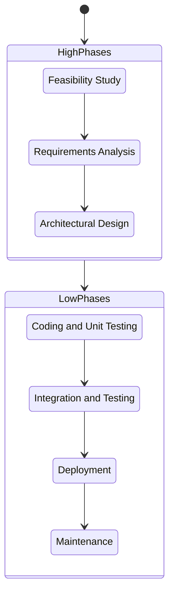

## Requirements Engineering (RE)

**Requirements Engineering (RE)** is the process responsible to discover and document the purpose of a software. This is done to avoid misunderstandings and build the right product.

RE is a _iterative_ and _collaborative_ process that needs continuous reviews.

The core activities of RE are:

- Stakeholder identification: Identify Stakeholders (users, customers, etc.) that will use or have interest in the product;
- Requirements elicitation: Discover and extract the needs and constraints from stakeholders;

### Requirements

Requirements can be broadly classified into three main categories.

#### Functional Requirements (FR)

The _functional requirements_ describe the services that the system should provide and the interactions between the system and the environment.

These requirements must be _implementation-independent_, meaning that they should not specify how the functionality will be implemented, but rather what the system should do.

#### Non-Functional Requirements (NFR)

The _non-functional requirements_ describe the quality and how well the system performs its functions. They doesn't describe specific behaviors or functions, but might model constraints on the system.

NFRs can be measured using specific metrics.

- **Performance**: How fast the system responds (time behavior, resource utilization, etc).
- **Usability**: How easy the system is to learn and use.
- **Reliability**: The system's ability to operate without failure (e.g., uptime, fault tolerance).
- **Security**: The system's ability to protect against unauthorized access or data breaches.
- **Maintainability**: How easy it is to modify or update the system.
- **Portability**: The system's ability to run on different platforms or environments.

#### Constraints

The _constraints_ are specific technical or business requirements that limit or restrict the solution.

> Examples of constraints include regulatory compliance, budget limitations, or specific technology choices.

### How to write requirements

Well-written requirements are essential for a successful project. They must be clear, precise, and unambiguous.

- **Single Concern**: Each statement should focus on a single, atomic requirement. Avoid combining multiple ideas into one sentence.
  - Bad: "The system shall allow users to log in and view their profile."
  - Good: "The system shall allow users to log in." and "The system shall allow users to view their profile."
- **Not Ambiguous**: The requirement should not be open to different interpretations. Use specific, technical language and avoid vague terms.
  - Bad: "The system shall be fast."
  - Good: "The system shall respond to user requests within 2 seconds."
- **Testable**: It must be possible to verify whether the requirement has been met. This requires quantifiable metrics.
  - Bad: "The system shall be user-friendly."
  - Good: "The system shall have a user satisfaction rating of at least 85% in user surveys."
- **Achievable**: The requirement must be realistic and within the scope of what the software can accomplish on its own. It shouldn't depend on external, uncontrollable factors.
  - Bad: "The system depends on Adobe Acrobat to function."

### Context

RE is responsible to to define the **phenomena** (the observable events) that are relevant to the project.

- **World**: This is the _real-world environment_ in which the machine operates. It includes events and properties that happen in the environment, not observable by the machine. Some phenomena could _goals_ (G) and _domains properties_ (D);
  - Example: user thoughts, weather conditions, etc.;
- **Machine**: This is the part of the system that is being developed. It's the software and hardware building. It includes events and properties that are observable by the machine;
  - Example: internal states, computations, etc.;
- **Shared Phenomena**: interaction between the world and the machine. Here reside the _requirements_ (R).
  - _Machine controlled_: the machine perform an action that the world can observe (e.g., display a message, interacting with external services);
  - _World controlled_: the world can perform an action that the machine can observe (e.g., user inputs a command).

A requirement is _complete_ iff it satisfy (logically entails) the goal in the context of the domain.

$$\text{R and D} \models G$$

## Software Design

Software Design is the phase where we decide **how** the system will be implemented. It bridges the gap between requirements and code by making high-level decisions about the system's structure.

Design is not about "perfection" but it's a negotiation between multiple tradeoffs (performance, maintainability, scalability, etc).

The workflow is:

To reduce the complexity the system is looked at different **views**:

### Module Structure (Static View)

The module structure describe how the system is decomposed into **Implementation Units** (modules, files, packages, libraries, etc) and how they relate to each other.

This view is used to evaluate:

- **Cohesion**: how closely related and focused the responsibilities of a single module are.
- **Coupling**: the degree of dependence between modules. Low coupling is desirable as it reduces the impact of changes in one module on others.
- Planning the implementation phase.

The module structure can be represented with:

- **Package Diagrams**: show the organization of the system into packages and their dependencies.
- **Class Diagrams**: show the classes within each package and their relationships.

### Component-and-Connector (C&C) Structure (Runtime View)

The C&C structure describe how the system behaves at runtime.

The view is separated between:

- **Components**: are the processing elements (modules, services, etc)
- **Connectors**: the mean of communication between components (APIs, message queues, etc).

This view is used to evaluate:

- Performance: identify bottleneck and scalability issues;
- Reliability: identify single point of failure;
- Security: identify access points and vulnerabilities.

The C&C structure can be represented with:

- **Component Diagrams**: show the components and their interactions.
- **Sequence Diagrams**: show the dynamic interactions between components over time.

### Deployment Structure (Physical View)

The deployment structure describe how the system is physically deployed on hardware and network infrastructure.

The components mapped are:

- **Hardware**: physical devices (servers, routers, etc);
- **Execution Environment**: software platforms (OS, containers, VMs, etc);
- **Networking**: network devices and configurations (Firewall, Load Balancer, etc).

This is crucial for non-functional requirements like performance, availability, and security.

The deployment structure can be represented with:

- **Deployment Diagrams**: show the physical nodes and their relationships.
