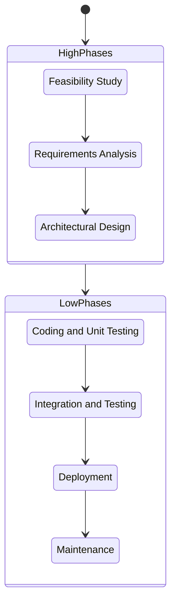
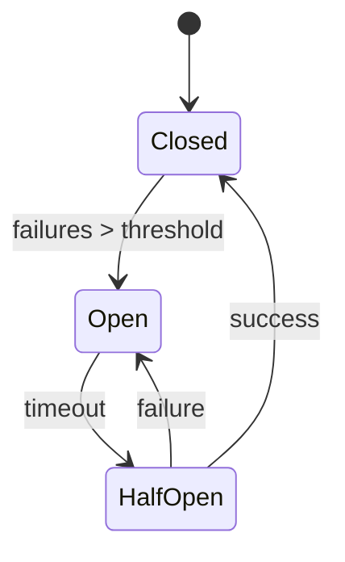

## Requirements Engineering (RE)

**Requirements Engineering (RE)** is the process responsible to discover and document the purpose of a software. This is done to avoid misunderstandings and build the right product.

RE is a _iterative_ and _collaborative_ process that needs continuous reviews.

The core activities of RE are:

- Stakeholder identification: Identify Stakeholders (users, customers, etc.) that will use or have interest in the product;
- Requirements elicitation: Discover and extract the needs and constraints from stakeholders;

### Requirements

Requirements can be broadly classified into three main categories.

#### Functional Requirements (FR)

The _functional requirements_ describe the services that the system should provide and the interactions between the system and the environment.

These requirements must be _implementation-independent_, meaning that they should not specify how the functionality will be implemented, but rather what the system should do.

#### Non-Functional Requirements (NFR)

The _non-functional requirements_ describe the quality and how well the system performs its functions. They doesn't describe specific behaviors or functions, but might model constraints on the system.

NFRs can be measured using specific metrics.

- **Performance**: How fast the system responds (time behavior, resource utilization, etc).
- **Usability**: How easy the system is to learn and use.
- **Reliability**: The system's ability to operate without failure (e.g., uptime, fault tolerance).
- **Security**: The system's ability to protect against unauthorized access or data breaches.
- **Maintainability**: How easy it is to modify or update the system.
- **Portability**: The system's ability to run on different platforms or environments.

#### Constraints

The _constraints_ are specific technical or business requirements that limit or restrict the solution.

> Examples of constraints include regulatory compliance, budget limitations, or specific technology choices.

### How to write requirements

Well-written requirements are essential for a successful project. They must be clear, precise, and unambiguous.

- **Single Concern**: Each statement should focus on a single, atomic requirement. Avoid combining multiple ideas into one sentence.
  - Bad: "The system shall allow users to log in and view their profile."
  - Good: "The system shall allow users to log in." and "The system shall allow users to view their profile."
- **Not Ambiguous**: The requirement should not be open to different interpretations. Use specific, technical language and avoid vague terms.
  - Bad: "The system shall be fast."
  - Good: "The system shall respond to user requests within 2 seconds."
- **Testable**: It must be possible to verify whether the requirement has been met. This requires quantifiable metrics.
  - Bad: "The system shall be user-friendly."
  - Good: "The system shall have a user satisfaction rating of at least 85% in user surveys."
- **Achievable**: The requirement must be realistic and within the scope of what the software can accomplish on its own. It shouldn't depend on external, uncontrollable factors.
  - Bad: "The system depends on Adobe Acrobat to function."

### Context

RE is responsible to to define the **phenomena** (the observable events) that are relevant to the project.

- **World**: This is the _real-world environment_ in which the machine operates. It includes events and properties that happen in the environment, not observable by the machine. Some phenomena could _goals_ (G) and _domains properties_ (D);
  - Example: user thoughts, weather conditions, etc.;
- **Machine**: This is the part of the system that is being developed. It's the software and hardware building. It includes events and properties that are observable by the machine;
  - Example: internal states, computations, etc.;
- **Shared Phenomena**: interaction between the world and the machine. Here reside the _requirements_ (R).
  - _Machine controlled_: the machine perform an action that the world can observe (e.g., display a message, interacting with external services);
  - _World controlled_: the world can perform an action that the machine can observe (e.g., user inputs a command).

A requirement is _complete_ iff it satisfy (logically entails) the goal in the context of the domain.

$$\text{R and D} \models G$$

## Alloy

Alloy is a logic-based formal notation used to specify models of a system. It allows developers to describe the structure and behavior of a system and perform automated analysis to check for consistency and correctness.

Alloy uses a **declarative** notation, meaning it describes _what_ the system should do (constraints and relationships) rather than _how_ to do it.

The analysis is performed by the **Alloy Analyzer**, which translates the model into a boolean formula and uses a SAT solver to find instances (examples) or counterexamples.

### Core Concepts

#### Signatures (`sig`)

Signatures define the types of objects (atoms) in the system. They are similar to classes in OOP but represent sets of atoms.

```alloy
sig Name, Addr {}
sig Book {
    addr: Name
}
```

- `abstract sig`: A signature that has no atoms of its own (must be extended).
- `one sig`: A signature that contains exactly one atom (singleton).
- `extends`: Creates a subset of another signature (disjoint by default).

#### Relations and Multiplicity

Fields in signatures define relations. Multiplicity keywords constrain the size of these relations:

- `set`: Any number (default).
- `one`: Exactly one.
- `some`: One or more (at least one).
- `lone`: Zero or one (optional).

#### Facts (`fact`)

Facts are constraints that are assumed to be always true in the model. They restrict the set of possible instances.

```alloy
fact NoSelfReference {
    all n: Node | n !in n.next
}
```

They can also be declared without a name or with the definition of a signature:

```alloy
sig Node {
    next: lone Node
} {
    next != this
}
```

#### Predicates (`pred`)

Predicates are parameterized constraints that can be reused. They are often used to describe operations or state transitions. They are not automatically enforced but can be invoked.

```alloy
pred add [b: Book, a: Addr] {
    b'.addr = b.addr + a
}
```

#### Functions (`fun`)

Functions are expressions that return a value (a set or relation) rather than a boolean.

```alloy
fun addrCount [b: Book]: Int {
    #b.addr
}
```

#### Assertions (`assert`)

Assertions are properties that the system is expected to satisfy. The analyzer checks if these hold given the facts.

```alloy
assert AddIdempotent {
    all b: Book, a: Addr |
        add[b, a] implies b'.addr = b.addr + a
}
```

### Analysis Commands

- **`run`**: Asks the analyzer to find an _instance_ where a predicate is true. Used for simulation and validation (checking if a scenario is possible).

  ```alloy
  run add for 3 but 1 Book
  ```

- **`check`**: Asks the analyzer to find a _counterexample_ to an assertion. Used for verification.

  ```alloy
  check AddIdempotent for 3
  ```

### Operators

- **Set Operators**: `+` (union), `&` (intersection), `-` (difference), `in` (subset).
- **Relational Join (`.`)**: Navigates relations (similar to dereferencing). `a.r` joins atom `a` with relation `r`.
- **Quantifiers**:
  - `all x: S | ...` (For all)
  - `some x: S | ...` (There exists)
  - `no x: S | ...` (There exists none)
  - `one x: S | ...` (There exists exactly one)
  - `lone x: S | ...` (There exists at most one)

### Temporal Logic (Alloy 6)

Alloy 6 introduces support for **Linear Temporal Logic (LTL)**, allowing the modeling of dynamic systems where state changes over time.

#### Mutable Signatures and Fields (`var`)

To model changing state, signatures and fields can be marked as `var`.

```alloy
var sig State {}
sig System {
    var status: one State
}
```

#### Temporal Operators

These operators are used to express properties over execution traces.

Operators about the future:

- **`always`**: The formula must hold in the current state and all future states.
- **`eventually`**: The formula must hold in the current state or some future state.
- **`after`**: The formula must hold in the next state.

Operators about the past:

- **`historically`**: The formula must have held in all past states.
- **`once`**: The formula must have held in some past state.
- **`before`**: The formula must have held in the previous state.

#### Prime Operator (`'`)

The prime symbol (`'`) is used to refer to the value of a variable in the _next_ state.

```alloy
fact Transition {
    always (x' = x + 1)
}
```

## Software Design

Software Design is the phase where we decide **how** the system will be implemented. It bridges the gap between requirements and code by making high-level decisions about the system's structure.

Design is not about "perfection" but it's a negotiation between multiple tradeoffs (performance, maintainability, scalability, etc).

The workflow is:



To reduce the complexity the system is looked at different **views**:

### Module Structure (Static View)

The module structure describe how the system is decomposed into **Implementation Units** (modules, files, packages, libraries, etc) and how they relate to each other.

This view is used to evaluate:

- **Cohesion**: how closely related and focused the responsibilities of a single module are.
- **Coupling**: the degree of dependence between modules. Low coupling is desirable as it reduces the impact of changes in one module on others.
- Planning the implementation phase.

The module structure can be represented with:

- **Package Diagrams**: show the organization of the system into packages and their dependencies.
- **Class Diagrams**: show the classes within each package and their relationships.

### Component-and-Connector (C&C) Structure (Runtime View)

The C&C structure describe how the system behaves at runtime.

The view is separated between:

- **Components**: are the processing elements (modules, services, etc)
- **Connectors**: the mean of communication between components (APIs, message queues, etc).

This view is used to evaluate:

- Performance: identify bottleneck and scalability issues;
- Reliability: identify single point of failure;
- Security: identify access points and vulnerabilities.

The C&C structure can be represented with:

- **Component Diagrams**: show the components and their interactions.
- **Sequence Diagrams**: show the dynamic interactions between components over time.

### Deployment Structure (Physical View)

The deployment structure describe how the system is physically deployed on hardware and network infrastructure.

The components mapped are:

- **Hardware**: physical devices (servers, routers, etc);
- **Execution Environment**: software platforms (OS, containers, VMs, etc);
- **Networking**: network devices and configurations (Firewall, Load Balancer, etc).

This is crucial for non-functional requirements like performance, availability, and security.

The deployment structure can be represented with:

- **Deployment Diagrams**: show the physical nodes and their relationships.

## Architecture Style

### Client-Server

The **Client-Server** architecture is a distributed structure that divides the system into two main components: the **server** (provider of services) and the **client** (consumer of services).

There are three main layers:

- **Presentation**: User interface and user experience.
- **Application Logic**: Business rules and processing.
- **Data Management**: Storage and retrieval of data.

The client-server model can be organized based on the distribution of workload:

- **Thick Client**: The client performs most of the processing, while the server mainly handles data storage and retrieval. This reduces server load and improves responsiveness but requires more powerful client devices.
- **Thin Client**: The client relies heavily on the server for processing and logic, handling mainly the user interface and input. This simplifies client devices but increases server load and network traffic.

### Concurrency Models (Handling Multiple Requests)

Servers must handle multiple requests simultaneously. Common approaches include:

#### Request per Process

Traditional servers (like older versions of _Apache_) handle concurrency by forking a new **process** (or thread) for each incoming request. This isolates requests but is resource-intensive and inefficient under high load due to context switching overhead.

#### Worker Pool

Modern servers (like _Nginx_) use a **worker pool**.

A fixed number of workers handle requests from a shared queue. This prevents resource exhaustion and handles high concurrency more efficiently, though it may introduce availability issues if the queue becomes full.

### REST (Representational State Transfer)

**REST** is an architectural style for distributed systems, commonly used over HTTP.

Key constraints include:

- **Statelessness**: Each request from the client must contain all the information needed to process it. The server does not store session state between requests.
- **Resource-Based**: Data is modeled as resources identified by URIs.

Data is serialized into formats like _JSON_, _XML_, or _Protocol Buffers_. These formats vary in:

- **Expressiveness**: Ability to represent complex data structures.
- **Interoperability**: Support across different languages and platforms.
- **Performance**: Serialization/deserialization speed and message size.
- **Transparency**: Human readability.

#### Error Handling

Error handling is decoupled. The server returns standard HTTP status codes (e.g., 400 Bad Request, 500 Internal Server Error) with an optional error body, and the client is responsible for handling them appropriately.

#### Versioning

To maintain backward compatibility, APIs should be versioned (e.g., `/api/v1/resource`). This allows introducing new features without breaking existing clients.

#### Interface Documentation

Documentation is crucial for developers consuming the API. Standard specifications like **OpenAPI** (formerly Swagger) allow describing:

- Endpoints and HTTP methods.
- Input parameters and request bodies.
- Response schemas.
- Authentication mechanisms.

Tools can generate documentation, client SDKs, and server stubs from these specifications.

### Event-Driven Architecture

**Event-Driven Architecture** is based on the **producer-consumer** pattern. Components communicate by emitting and reacting to **events**.

- **Producers** publish events to an **Event Bus** (or Broker).
- **Consumers** subscribe to specific events they are interested in.

This decouples producers from consumers; they do not need to know about each other, only about the event format.

#### Delivery Models

- **Push**: The event bus pushes events to consumers immediately.
- **Pull**: Consumers poll the event bus for new messages at their own pace, allowing time-decoupling.

#### Delivery Semantics

- **At most once**: The event is delivered zero or one time (fire-and-forget). Low overhead, but data loss is possible.
- **At least once**: The event is delivered one or more times. Ensures delivery but requires consumers to handle duplicates (idempotency).
- **Exactly once**: The event is delivered exactly once. High overhead and latency, difficult to achieve in distributed systems.

#### Kafka

_Apache Kafka_ is a popular distributed event streaming platform. It uses a **log-based** approach:

- **Topics**: Categories where records are published.
- **Partitions**: Topics are split into partitions for scalability and parallelism.
- **Brokers**: Servers that store data.

Kafka uses a **pull mechanism**, allowing consumers to process events at their own speed. It ensures fault tolerance through replication.

### Microservices

**Microservices** architecture structures an application as a collection of loosely coupled, independently deployable services. This contrasts with a **Monolithic** architecture, where all components are bundled into a single unit.

The main advantages of microservices include:

- **Scalability**: Services can be scaled independently based on demand (fine-grained scaling), unlike monoliths where the entire application must be replicated.
- **Decoupling**: Services are isolated; a failure in one service doesn't necessarily bring down the whole system.
- **Agility**: Smaller, separate codebases allow different teams to work in parallel using different technologies.

The main components of a microservices architecture are:

- **Data Store**: Each microservice owns its database to ensure loose coupling (Database-per-service pattern).
- **Business Logic**: Each service focuses on a specific business capability (Single Responsibility Principle).
- **Interface**: Services communicate via well-defined APIs (REST, gRPC) or messaging.

#### Service Discovery (Location Transparency)

In a dynamic environment, service instances scale up/down and change IP addresses. **Service Discovery** allows clients to locate services without hardcoding addresses.

1. **Registration**: Services register themselves with the Service Discovery upon startup.
2. **Discovery**: Clients query the Service Discovery to get the location of a service.
3. **Health Checks**: The Service Discovery monitors service health via heartbeats. If a service stops sending heartbeats, it is removed from the registry.

Key considerations:

- **Availability**: The registry must be highly available (often replicated).
- **Load Balancing**: the registry should balance requests among multiple instances.
- **Resilience**: The system should handle failures gracefully.

#### Resilience Patterns

To detect failures each service is called through a **Circuit Breaker**, a proxy that monitors calls to the service. It prevents the application from trying to execute an operation that is likely to fail.

- **Closed**: Normal operation. Requests pass through.
- **Open**: After a threshold of failures is reached, the circuit opens, and requests fail immediately (fail-fast) without waiting for timeouts.
- **Half-Open**: After a timeout, a limited number of requests are allowed to pass to test if the service has recovered.



#### Security Patterns (API Gateway)

Directly exposing microservices to clients creates security and complexity issues. An **API Gateway** acts as a single entry point for all clients.

- **Authentication & Authorization**: Verifies identity and permissions before routing requests.
- **Routing**: Forwards requests to the appropriate microservice.
- **Rate Limiting**: Protects services from overuse.

_Note: The Gateway can be a single point of failure, so it is usually replicated._

#### Communication & Coupling

Communication between services can be:

- **Synchronous (e.g., HTTP/REST)**: The client waits for a response. Tends to increase coupling and latency.
- **Asynchronous (e.g., Message Queues)**: The client sends a message and continues. Decouples services and handles bursts of traffic.

Using queues (like RabbitMQ or Kafka) buffers requests and decouples the sender from the receiver.

- **One-way**: Fire-and-forget.
- **Two-way**: Requires a response queue.

### Availability

Availability is the probability that a system is operational and able to perform its required function at a given instant of time. It is a measure of the system's readiness.

#### Failure Lifecycle

When a failure occurs, the recovery process involves several phases:

1. **Detection Time**: Time between the occurrence of the failure and its detection.
2. **Response Time**: Time to diagnose the issue and decide on a recovery strategy.
3. **Repair Time**: Time to fix the issue (replace component, restart service, etc.).
4. **Recovery Time**: Time to restore the system to normal operation (sync state, warm up caches).

#### Metrics

- **MTTF (Mean Time To Failure)**: The average time the system runs successfully before failing (Average Uptime).
- **MTTR (Mean Time To Repair)**: The average time required to repair the system after a failure (Average Downtime).
- **MTBF (Mean Time Between Failures)**: The average time between two consecutive failures.

The availability $A$ is calculated as:

$$A = \frac{MTTF}{MTBF} = \frac{MTTF}{MTTF + MTTR}$$

#### The "Nines" Notation

Availability is often expressed in "nines":

| Availability       | Downtime per year |
| ------------------ | ----------------- |
| 90% (1 nine)       | 36.5 days         |
| 99% (2 nines)      | 3.65 days         |
| 99.9% (3 nines)    | 8.76 hours        |
| 99.99% (4 nines)   | 52.56 minutes     |
| 99.999% (5 nines)  | 5.26 minutes      |
| 99.9999% (6 nines) | 31.5 seconds      |

The availability of a composite system depends on how its components are connected:

- **Serial Connection**: The system fails if _any_ component fails.
  $$A_{serial} = \prod_{i=1}^n A_i = A_1 \times A_2 \times \dots \times A_n$$
  _(Availability decreases)_

- **Parallel Connection**: The system fails only if _all_ components fail.
  $$A_{parallel} = 1 - \prod_{i=1}^n (1 - A_i) = 1 - (1 - A_1) \times (1 - A_2) \times \dots \times (1 - A_n)$$
  _(Availability increases)_

### Availability Tactics

#### Replication

Replication involves using multiple instances of a component to ensure continuity.

- **Active Redundancy**: All replicas process the same input in parallel. If one fails, others are already up-to-date.

  - **TMR (Triple Modular Redundancy)**: Three replicas process input, and a voter determines the result (majority wins). Handles value faults.

- **Passive Redundancy**: Only the primary replica processes input. Secondary replicas take over upon failure.
  - **Hot Spare**: The backup is fully synchronized and ready to switch over immediately.
  - **Warm Spare**: The backup is running but needs to load the latest state before taking over.
  - **Cold Spare**: The backup is not running and must be started and synchronized.

If the system is stateless, switching is immediate. If stateful, state synchronization is needed.

#### Forward Error Recovery

In forward error recovery, the system is designed to continue operating correctly even in the presence of faults.

From the normal state, the system goes to the failure state when a fault occurs. The system then detects the failure and transitions to a degraded state, where it takes corrective actions to return to the normal state.

## Design Document (DD) Structure

The Design Document (DD) describes the high-level design decisions and how the system will be implemented to satisfy the requirements specified in the RASD.

1. **Introduction**
   1. Scope: Defines the boundaries of the system and what is included/excluded.
   2. Definitions: Glossary of terms used in the document.
   3. Reference Documents: Lists related documents (e.g., RASD, project plan).
   4. Overview: High-level summary of the system's design and structure.
2. **Architectural Design**
   1. Overview: Informal description of high-level components and their interactions.
   2. Component View: Static component diagrams showing the system's modules and their relationships.
   3. Deployment View: Deployment diagrams illustrating physical nodes, hardware, and software environments.
   4. Component Interfaces: Signatures and descriptions of the interfaces between components.
   5. Runtime View: Dynamic interactions described via sequence diagrams.
   6. Selected Architectural Styles and Patterns: Justification and description of chosen styles (e.g., client-server, microservices).
   7. Other Design Decisions: Additional decisions impacting the design (e.g., trade-offs, constraints).
3. **User Interface Design**: Mockups or wireframes of the UI, refining the RASD from low to mid-fidelity prototypes.
4. **Requirements Traceability**: Mapping between requirements (from RASD) and design components, often using a traceability matrix.
5. **Implementation, Integration, and Test Plan**: Defines the order of component implementation (sequential/parallel), integration strategies, and testing approaches.
6. **Effort Spent**: Summary of time and resources expended during design activities.
7. **References**: Citations for external sources, standards, or tools used.

## Verification and Validation

**Verification** and **Validation** (V&V) are independent procedures that are used together for checking that a product meets requirements and specifications and that it fulfills its intended purpose.

- **Verification**: It's an internal process that ensures the product is built correctly according to the specifications.
- **Validation**: It's an external process that ensures the right product is built for the user.

The chain of causality for software problems is:

1. **Error (Mistake)**: A human action that produces an incorrect result.
2. **Defect (Fault/Bug)**: An imperfection or deficiency in a product where it does not meet its requirements or specifications.
3. **Failure**: An event in which a system or system component does not perform a required function within specified limits.

### Static Analysis

**Static Analysis** is the process of evaluating a system or component based on its form, structure, content, or documentation, without executing the code.

This can be achieved using linters, type checkers, formal verification tools.

Some common defects detected by static analysis tools include:

- Memory leaks, buffer overflows, null pointer dereferences.
- Concurrency issues (race conditions, deadlocks).
- Security vulnerabilities.
- Coding standard violations.

Since checking non-trivial properties of programs is undecidable (Rice's Theorem), static analysis tools must approximate. They need a balance precision (minimize false positives) and performance.

#### Data Flow Analysis

Data flow analysis gathers information about the possible set of values calculated at various points in a computer program. It operates on the **Control Flow Graph (CFG)**.

The CFG is a directed graph that represents all paths that might be traversed through a program during its execution. It is composed of:

- **Nodes**: Represent basic blocks (a sequence of instructions with a single entry and exit point).
- **Edges**: Represent control flow between basic blocks (e.g., jumps, branches).

##### Reaching Definitions Analysis

CFG can be used for **Reaching Definitions Analysis** that determines which definitions of a variable $v$ may reach a point $p$ in the code without being overwritten (killed).

For a basic block $n$:

- $Gen[n]$: Set of definitions generated within block $n$.
- $Kill[n]$: Set of definitions in the program that are overwritten by definitions in $n$.
- $In[n]$: Set of definitions reaching the entry of $n$.
- $Out[n]$: Set of definitions reaching the exit of $n$.

The data flow equations are:
$$In[n] = \bigcup_{p \in pred(n)} Out[p]$$
$$Out[n] = Gen[n] \cup (In[n] - Kill[n])$$

From the Reaching Definitions, we can derive the **liveness** of variables: a variable $v$ is "live" at a point $p$, meaning it holds a value that may be needed in the future.

It is also possible to build **def-use chains** and **use-def chains**:

- **Def-Use (DU)**: Connects a definition of a variable to all its possible uses.
- **Use-Def (UD)**: Connects a use of a variable to all its possible definitions.

These chains are essential for optimizations (like dead code elimination) and bug finding (like use-before-define).

### Symbolic Execution

**Symbolic Execution** is a program analysis technique that executes programs with symbolic inputs instead of concrete values. This allows to analyze reachability (which parts of the code can be executed), path feasibility (which paths are possible to take), and generate test cases.

During the symbolic execution, the program is executed symbolically. During the execution the **path condition** (logical formula that represents the constraints on the inputs that must hold for the execution to follow a particular path) is built.

When a branch is encountered (e.g., an `if` statement), the symbolic execution forks into two paths:

1. **True branch**: The path condition is updated to include the condition of the branch.
2. **False branch**: The path condition is updated to include the negation of the condition.

At the end of each path is possible to analyze the path condition to determine if the path is _feasible_ (i.e., if there exists an input that satisfies the path condition) or is _infeasible_.
