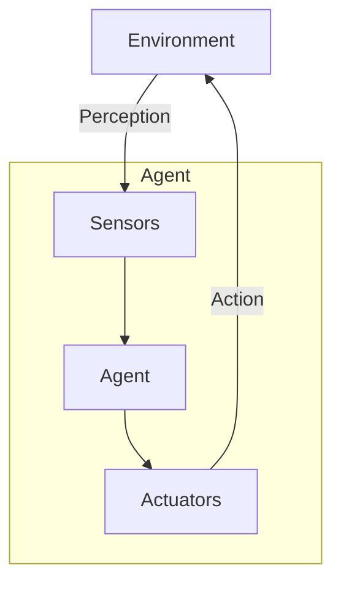

An **agent** is a system that perceives its environment and acts upon it. It can be a human, a robot, or a software program.

- The **Perception** is the process of obtaining information from the environment. This can be done through _sensors_ (Human: eyes, hear, etc; Robot: camera, etc; Software: file, network, etc).
- The **Action** is the process of affecting the environment. This can be done through _actuators_ (Human: hands, mouth, etc; Robot: motors, etc; Software: file, UI, etc).



An agent is defined by its **Agent Function**, which maps the _Built-in Knowledge_ and a sequence of percepts (_Percept Sequence_) to an _action_. The implementation of the agent function is called the **Agent Program**.

The agent's behavior is evaluated based on a **Performance Measure**, which is a criterion for success.

The goal of an **rational agent** is to maximize the expected value of its performance measure. We do that by evaluating the sequence of state the environment go through.

The nature of the **environment** can be classified based on different factors:

- **Observable**: Whether the agent can observe the environment.
  - **Fully Observable**: The agent can observe the entire state of the environment.
  - **Partially Observable**: The agent can't observe the entire state of the environment. Need to remember the past state.
- **Amount of Agent**: How many agents interact with the environment.
  - **Single Agent**: Only one agent in the environment.
  - **Multi-Agent**: Multiple agents in the environment.
    - **Competitive**: Agents have conflicting goals, need to maximize mine and minimize others.
    - **Cooperative**: Agents have the same goal, need to maximize the group's performance.
- **Deterministic**: Whether the environment is deterministic.
  - **Deterministic**: The next state is completely determined by the current state and the action.
  - **Stochastic**: The next state is not completely determined by the current state and the action.
- **History**: Whether the current state depends on the entire history of the environment.
  - **Episodic**: The current state depends only on the current state and the action.
  - **Sequential**: The current state depends on the entire history of the environment.
- **Dynamic**: Whether the environment changes while the agent is deciding on an action.
  - **Static**: The environment doesn't change while the agent is deciding on an action.
  - **Dynamic**: The environment changes while the agent is deciding on an action.
- **Discrete/Continuous**: Whether the environment is discrete or continuous.
  - **Discrete**: The environment is discrete.
  - **Continuous**: The environment is continuous.
- **Known/Unknown**: Whether the agent knows the environment and its rules.
  - **Known**: The agent knows the environment.
  - **Unknown**: The agent doesn't know the environment.

## Agent Architecture

The **Agent Architecture** is the design of the agent, which includes the agent's components and how they interact.

There are different types of agents based on their architecture:

### 2.1 Simple Reflex Agent


This is the simplest type of agent, which acts based on the current percept. It doesn't have memory.

The action is determined by the **Condition-Action Rule**, which maps the current percept to an action.

```plaintext
if condition then action
```

This agent is useful when the environment is **fully observable** and **deterministic**.
In partially observable environments, the agent might result in a **loop**. To avoid that we could randomize the action, but this could lead to _inefficiency_.

```plaintext
function SIMPLE-REFLEX-AGENT(percept) returns an action
    persistent: rules // a set of condition–action rules

    state = INTERPRET-INPUT(percept)
    rule = RULE-MATCH(state,rules)
    action = rule.ACTION

    return action
```

### 2.2 Model-Based Reflex Agent


To deal with partially observable environments, we can add a **State** to the agent, which stores information about the environment.

```plaintext
 function MODEL-BASED-REFLEX-AGENT(percept) returns an action
    persistent: state // the agent’s current conception of the world state
        transition_model // a description of how the next state depends on the current state and action
        sensor_model // a description of how the current world state is reflected in the agent’s percepts
        rules // a set of condition–action rules
        action // the most recent action, initially none

    state = UPDATE-STATE(state, action, percept, transition_model, sensor_model)
    rule = RULE-MATCH(state, rules)
    action = rule.ACTION

    return action
```

### 2.3 Goal-Based Agent


This agent has a **Goal** that describe the desired state of the environment. The agent uses a **Problem-Solving Algorithm** to find a sequence of actions that lead to the goal (search and planning).

### 2.4 Utility-Based Agent


The _goal_ is a binary value (achieved or not), but the _utility_ is a real number that describe how desirable a state is. The agent uses a **Utility Function** to evaluate the desirability of a state.

### 2.5 Learning Agent


This type of agent learns from experience and it can be applied to any of the previous architectures.

With learning, the agent can improve its performance over time and operate in unknown environments.

A learning agent has four main components:

- **Performance Element**: The part of the agent that selects actions.
- **Critic**: The part of the agent that evaluates the agent's actions.
- **Learning Element**: The part of the agent that learns from the critic and improve the performance element.
- **Problem Generator**: The part of the agent that suggests actions to explore new possibilities.
