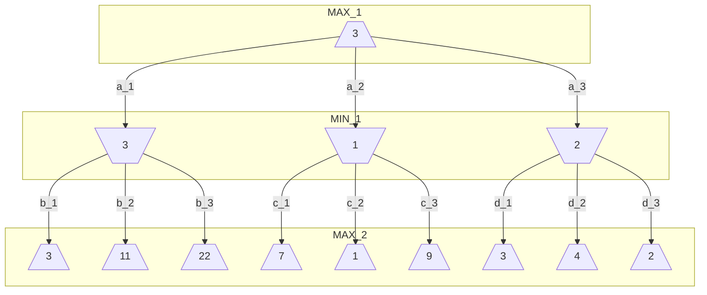

**Adversarial Search** is a type of search is used in _competitive environments_ where two or more agents have conflicting goals. In this type of search, the agent tries to maximize its performance while minimizing the performance of the opponent.

There are three main ways to represent a multi-agent environment:

- When there is a large number of agents, we can model them as an economy, allowing to predict the behavior of the whole system, instead of each agent.
- We can model the agent as part of the environment, making it nondeterministic. With this approach we miss the idea that the agent is actively trying to achieve a goal.
- We can explicitly model the agent as an opponent, allowing to predict the behavior of the agent.

## 5.1 Zero-Sum Games

A **Zero Sum Game** is a type of game where the sum of the rewards of the agents is zero. This means that the gain of one agent is the loss of the other agent.

This type of game is deterministic, fully observable, and has two players.

To model a zero-sum we need two players (MAX and MIN) and some elements:

- **Initial State** ($S_0$): The state of the game at the beginning.
- **Player** ($PLAYER(s)$): The player that has the turn in state $s$.
- **Actions** ($ACTIONS(s)$): The set of actions that the player can perform in state $s$.
- **Transition model** ($RESULT(s, a)$): The state that results from performing action $a$ in state $s$.
- **Terminal Test** ($IS-TERMINAL(s)$): A function that checks if the state $s$ is a terminal state.
- **Utility Function** ($UTILITY(s, p)$): A function that returns the result of the game for player $p$ in the terminal state $s$.

The initial state, the actions, and the transition model define the _state space graph_ of the game. The **Game Tree** is the search tree that follows every sequence of moves to a terminal state.

## 5.2 Minimax Algorithm

In a turn game the agents alternate their turns:

- During the turn of MAX, the agent tries to maximize the utility of MAX.
- During the turn of MIN, the agent tries to minimize the utility of MAX.

For each state of the game we can calculate the **Minimax Value** ($MINIMAX(s)$), which is the utility of MAX of being in that state assuming that both players play optimally.



The Minimax algorithm is a recursive algorithm that calculates the Minimax Value of each state of the game. It goes down to the leaves of the game tree and then goes back up to the root, performing a complete depth-first search.

```python
def MINIMAX(s)
"""
    return the minimax value of state s
"""
    if IS_TERMINAL(s)
        return UTILITY(s, MAX)

    if TO_MOVE(s) == MAX
        return argmax(ACTIONS(s), lambda a: MINIMAX(RESULT(s, a)))
    else
        return argmin(ACTIONS(s), lambda a: MINIMAX(RESULT(s, a)))
```

The time complexity of the Minimax algorithm is $O(b^m)$, where $b$ is the branching factor and $m$ is the maximum depth of the game tree.

The space complexity is $O(bm)$ if it generates alla actions at once, but it can be reduced to $O(m)$ if it generates the actions one at a time.

### 5.2.1 Multiplayer games

In a multiplayer game, there are more than two players. The utility function returns a vector that contains the utility of each player.

During the turn of a player, the agent tries to maximize the utility of that player.

## 5.3 Alpha-Beta Pruning

The Minimax algorithm can be improved by using **Alpha-Beta Pruning**, which allows to prune the search tree by removing the branches that don't affect the result and can reduce the number of nodes generated by half.

The algorithm uses two values, $\alpha$ and $\beta$, that represent the best value that MAX can achieve and the best value that MIN can achieve. Those values are updated during the search.

The algorithm starts with $\alpha = -\infin$ and $\beta = \infin$.

When the algorithm finds a value that is greater than $\beta$ (for MAX) or less than $\alpha$ (for MIN), it can prune the branch.

```python
def ALPHA_BETA_SEARCH(s)
"""
    return the minimax value of state s
"""
    return MAX-VALUE(s, -inf, inf)

def ALPHA_BETA(s, alpha, beta)
"""
    return the minimax value of state s
"""
    if IS_TERMINAL(s)
        return UTILITY(s, MAX)

    if TO_MOVE(s) == MAX
        v = -inf
        for a in ACTIONS(s)
            v = max(v, ALPHA_BETA(RESULT(s, a), alpha, beta))
            alpha = max(alpha, v)
            if beta <= alpha
                break
        return v
    else
        v = inf
        for a in ACTIONS(s)
            v = min(v, ALPHA_BETA(RESULT(s, a), alpha, beta))
            beta = min(beta, v)
            if beta <= alpha
                break
        return v
```

The time complexity of the Alpha-Beta Pruning algorithm is $O(b^{m/2})$ in the best case, $O(b^m)$ in the worst case, and $O(b^{3m/4})$ in the average case.

The efficiency of the algorithm depends on the order of the actions. If the best action is the first one, the algorithm can prune the entire tree. To achieve the best performance, the actions should be ordered based on the expected utility. The best moves are called **Killer Moves**.

During the search we can reach the same state multiple times using different paths. To avoid this we can use a **Transposition Table** that stores the values of the states that have already been visited.

The alpha-beta pruning algorithm is based on a **Depth-First Search** so, until the search reaches the leaves of the tree, it doesn't know which is the best move. This can be a problem if the search tree is too deep. To solve this we can use an **Iterative Deepening Alpha-Beta Pruning** that performs a depth-first search with a limited depth and then increases the depth until a solution is found.

## 5.4 Heuristic Alpha-Beta Pruning Search

Due to the high computational time we can try to limit the search to a specific depth and use a heuristic function to estimate the utility of the states that are not terminal. In this way we explore a _shallow but wide_ tree.

We replace the utility function with an **Evaluation Function** ($EVAL(s)$) that estimates the utility of the state $s$. If the state is terminal, the evaluation function returns the utility of the state and for non-terminal states, it returns the estimated utility between a win and a loss.

We also replace the terminal test with a **Cutoff Test** ($IS_CUTOFF(s, d)$) that checks if the state $s$ is terminal or if the depth $d$ is greater than a specific value or the state has a particular property.

```python
def H_MINIMAX(s, d):
"""
    return the minimax value of state s
"""
    if IS_CUTOFF(s, d)
        return EVAL(s, MAX)

    if TO_MOVE(s) == MAX
        return argmax(ACTIONS(s), lambda a: H_MINIMAX(RESULT(s, a), d+1))
    else
        return argmin(ACTIONS(s), lambda a: H_MINIMAX(RESULT(s, a), d+1))
```

### 5.4.1 Evaluation Function

A good evaluation function should be _fast to compute_ and should be correlated with the chance of winning.

Most evaluation functions are based on calculating **Features** of the state and then combining them to estimate the utility. The features can have a weight based on their importance. The weight should be between 0 (loss) and 1 (win).

The evaluation function can be implemented using a **Linear Combination** of the features.

$$EVAL(s) = \sum_{i=1}^n w_i \cdot f_i(s)$$

### 5.4.2 Cutoff Test

Instead of having a fixed depth, we can use the _Iterative Deepening Alpha-Beta Pruning_ algorithm until a time limit is reached.

The evaluation function should be used only on states that are **quiescent**, which means that the state is stable and doesn't have any pending actions that would change the utility significantly.
The cutoff test should perform a _quiescent search_ and avoid terminating on a state that is not quiescent.

Another problem is the **Horizon Effect**, which is the problem that the search algorithm can't see the consequences of a move that is beyond the search horizon. The algorithm will make moves that are good on the short term but bad on the long term.

One way to deal with this is to use **Singular Extensions**, which allows to extend the search when a move is considered good.

### 5.4.3 Forward Pruning

One way to optimize the search is with **Forward Pruning** that is a to prune the branches that have a low probability of being the best move. This strategy saves computational time at the risk of making errors. In this way we explore a _deep but narrow_ tree.

There are different approaches to forward pruning:

- **Beam Search**: The algorithm keeps track of the best $k$ moves and only explores those moves.
- **ProbCut**: The algorithm prunes the branches that have a low probability of being the best move. The probability is based on statistics gained from previous experiences.
- **Late Move Reduction**: The algorithm reduces the depth of the search for the moves that are considered bad. If the reduced space has a value above the current $\alpha$ value, the algorithm explores the branch.

### 5.4.4 Search vs Lookup

Another way to optimize the search is to use a **Lookup Table** that stores the values of the most common states. This allows to avoid to compute the search for the states that are already in the table.

When the search reaches a state that is not in the table, the algorithm will perform the search.

> For a chess game, it's better to have a lookup table to store the common openings and a search algorithm to explore the rest of the game.

## 5.5 Monte Carlo Tree Search

In games with a high branching factor, a high depth, and a complex evaluation function, the search algorithms can be slow and inefficient.

**Monte Carlo Tree Search** (MCTS) is a search algorithm that uses random _simulations_ to explore the search space. This algorithm doesn't use an evaluation function, but it uses the results of the simulations to estimate the utility of the states.

A simulation (or playout) is a sequence of random moves that starts from a state and ends in a terminal state.

Each node of the tree has a winning chance (utility) based on the amount of wins and the amount of simulations ($\text{utility} = \frac{\text{wins}}{\text{simulations}}$).

Instead of performing random simulations, the algorithm uses a **Playout Policy** tha biases the random moves towards the most promising moves.

We also have to introduce a **Selection Policy** that balances two factors

- **Exploitation**: The algorithm selects the moves that have the highest utility to get more accurate results. This is good for short-term decisions.
- **Exploration**: The algorithm selects the moves that have been explored less to get more information to reduce uncertainty. This is good for long-term decisions.

An effective policy is the **Upper Confidence bound applied to Trees** (UCT) that balances the exploitation and the exploration.

$$\text{UCT1}(n) = \frac{U(n)}{N(n)} + c \cdot \sqrt{\frac{\ln(N(\text{Parent}(n)))}{N(n)}}$$

Where $U(n)$ is the utility of the node $n$, $N(n)$ is the number of simulations of the node $n$, $\text{Parent}(n)$ is the parent of the node $n$.
$c$ is a constant that balances the exploitation and the exploration. If $c$ is high, the algorithm will explore more, if $c$ is low, the algorithm will exploit more.

$\frac{U(n)}{N(n)}$ is the exploitation term and $\sqrt{\frac{\ln(N(\text{Parent}(n)))}{N(n)}}$ is the exploration term.

The algorithm is divided into four steps:

1. **Selection**: The algorithm selects the most promising node of the tree based on the selection policy.
2. **Expansion**: The algorithm expands the selected node by adding a new node to the tree.
3. **Simulation**: The algorithm performs a playout based on the playout policy. These moves are not stored in the tree.
4. **Back-propagation**: once the simulation is finished, the algorithm updates the utility of the nodes that have been visited during the simulation based on the result of the simulation.

We repeat these steps until a time limit is reached and then we select the best move based on the number of playouts.

## 5.6 Stochastic Games

In a **Stochastic Game**, the environment is stochastic.

To create the game tree we must add a **Chance Node** that represents the stochastic nature of the environment. The chance node has a branch for each possible outcome of the stochastic event and each branch has the probability of that outcome.
Instead of having a defined minimax value, the chance node has an expected value (**Expectiminimax value**) that is the average of the values of the branches weighted by the probability of the branch.

```python
def EXPECTIMINIMAX(s)
"""
    return the expectiminimax value of state s
"""
    if IS_TERMINAL(s)
        return UTILITY(s, MAX)

    if TO_MOVE(s) == MAX
        return max(ACTIONS(s), lambda a: EXPECTIMINIMAX(RESULT(s, a)))
    elif TO_MOVE(s) == MIN
        return min(ACTIONS(s), lambda a: EXPECTIMINIMAX(RESULT(s, a)))
    else
        return sum(P(a) * EXPECTIMINIMAX(RESULT(s, a)) for a in ACTIONS(s))
```

The evaluation function should be a positive linear transformation of the probability of winning.

Considering the chance node, the time complexity of the expectiminimax algorithm is $O(b^m \dot n^m)$, where $b$ is the branching factor, $m$ is the maximum depth of the tree, and $n$ is the number of possible outcomes of the chance node.
