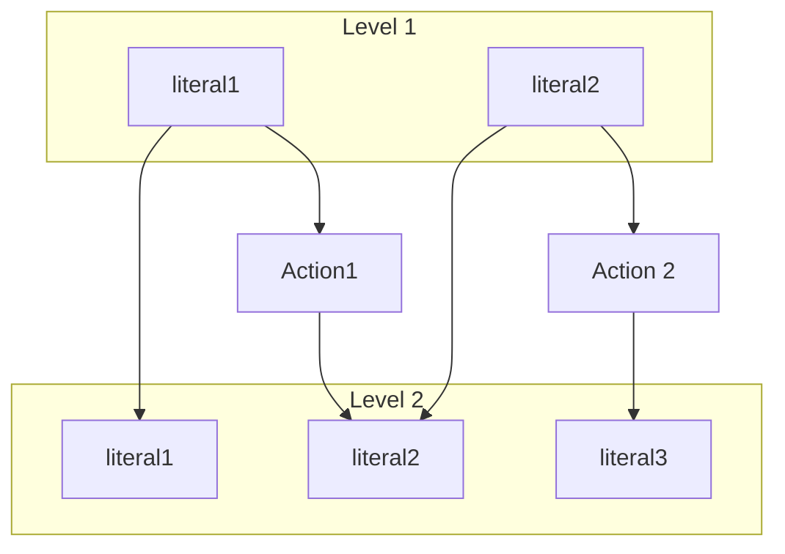

The **Classical Planning** is the task of finding a sequence of actions to accomplish a goal in a discrete, deterministic, static, and fully observable environment.

To achieve this we use a family language called **Planning Domain Definition Language** (PDDL) that is based on the following elements:

- **Objects** (or constants): The objects in the domain.
- **Predicates**: The predicates that define the state of the world, used to represent properties of objects and relationships between them.

The **State** is represented as a conjunction of ground atomic fluents. It means that:

- There are no variables in the state (ground).
- Each fluent is made by a single predicate. (atomic)

The planning problem is defined by:

- **Initial State**: The state of the world at the beginning.
- **Goal State**: A conjunction of literals (or sub-goals) that the state must satisfy.

Some assumptions of the are:

- **Unique Name Assumption** (UNA): Different constants denote different objects.
- **Domain Closuse Assumption** (DCA): The environment includes only the objects that are denoted by a constant
- **Closed World Assumption** (CWA): All the fluents that are not explicitly mentioned are false.

To reach the goal we need to perform an **Action** that is defined by:

- **Parameters**: The objects that are involved in the action.
- **Preconditions**: The conditions that must be true to perform the action.
- **Effects**: The effects of the action. The effects can be positive (add a predicate (_add list_)) or negative (remove a predicate (_delete list_)).

```plaintext
Action( Name(parameters),
    Precondition: [list of Preconditions]
    Effect: [list of Effects]
)
```

## 7.1 Algorithms for Planning

### 7.1.1 Forward State Space Search

The **Forward State Space Search** is a search algorithm that starts from the initial state and tries to reach the goal state by applying the _applicable_ actions available in the current state (preconditions are satisfied).

We can apply any search algorithm to perform the search.

The main problems are that for each state there might be a large number of actions and usually only a few actions are relevant to the goal. This increase the branching factor of the search tree, making the search inefficient.

### 7.1.2 Backward State Space Search

The **Backward State Space Search** (or regression search) is a search algorithm that starts from the goal state and tries to reach the initial state.

Instead of considering all applicable actions, only the _relevant_ and _consistent_ actions are considered. An action is relevant if it has an effect that is present in the goal or the current state. An action is consistent if it doesn't have effects that contradict the goal or the current state.

The **regression** from the the state $s$ over an action $a$ gives a new state $s'$ that satisfy the preconditions of the action $a$ and the application of the action $a$ to the state $s'$ gives a state that satisfy $s$.

$$s' = \text{regress}(s, a) = (s - \text{add}(a)) \land \text{pre}(a)$$

The backward search has a lower branching factor than the forward search, but it's harder to come up with a good heuristic due to the use of variables.

### 7.1.3 SAT Planning

The **SAT Planning** is a planning algorithm that uses a SAT solver to find a plan.

The PDDL representation need to be converted to propositional logic by encoding the initial state, the actions, and the goal $\gamma$ as a set of propositional sentences.

The KB is the conjunction of the initial state, the actions. If something is false in the initial state it must be state explicitly.

The solution is based on an iterative process that tries to find a model that satisfies the KB and the goal with a plan of length $l$ using DPLL. The algorithm starts with $l = 0$ and increases the length until a solution is found. A solution is found if a model of $\text{KB} \land \gamma^l$ is found.

All the symbols will have an index to indicate the time step.

$\text{Open}(Box) \to \text{OpenBox}^l$ : The box is open at time $l$.
$\text{open}(Box) \to \text{openBox}^l$ : The box will be open at time $l$ (with effects at time $l+1$).

To convert an action to a sentence we need to set the preconditions as a necessary condition as a implication of the action (**Precondition Axiom**).

$$\text{openBox}^l \implies \neg \text{OpenBox}^t$$
$$\neg \text{openBox}^l \lor \neg \text{OpenBox}^t$$

The effects of an action are dealt using **Fluent Axioms** that need to hold a fluent at time $t+1$.

$$P^{t+1} \iff \text{actionCausingP}^t \lor (P^t \land \neg \text{actionCausingNotP}^t)$$

We also have to impose that there are no two actions that are applicable at the same time (**Exclusion Axiom**).

$$\neg (\text{action}_i^t \land \text{action}_j^t)$$

Those three axioms need to be added to the KB for each step.

### 7.1.4 Graph Plan

The **Graph Plan** is a planning algorithm that uses a graph to represent the planning problem.

The graph has multiple layer (level) and each layer has all the literals that could be tre true in the state.

Between a level and the other we have to repeat the previous literals and apply all the available actions that can be applied to the level. The available action are those that are not been applied yet and have all the preconditions satisfied.



If all the literals of the goal are in the last level, the lower bound of the length of the plan is the number of levels.

### 7.1.5 Hierarchical Planning

The **Hierarchical Planning** is a planning algorithm that uses a hierarchy of sub-goals to reach the goal. Each sub-goal can be decomposed into smaller sub-goals until the sub-goals are primitive actions that the agent can perform.

## 7.2 Planning and Acting in complex worlds

The classical planning is based on the assumption that the environment is deterministic (each action has a single outcome), fully observable (everything stated in the state is sure), and static (the world doesn't change while the agent is planning).

There are some extensions to the classical planning to deal with more complex environments.

### 7.2.1 Sensorless Planning

Sensorless planning is used in environment with no observation. The initial state is not known but all the action are deterministic.

The agent has to plan a sequence of actions that will achieve the goal in any possible state of the world.

### 7.2.2 Contingent Planning

Contingent planning is used in environment where the action can have multiple outcomes.

The agent can perform some action to percept the environment and reduce uncertainty.

The planning include sequences and branches of actions that can be performed based on the outcome of the previous actions.

### 7.2.3 Replanning

Replanning is used in environment where the world can change while the agent is planning.

The agent keep monitoring the environment and replan if the world changes in a way that makes the current plan invalid.

To monitor the environment the agent can use three different strategies:

- **Action Monitoring**: Before executing an action, the agent checks if the preconditions are still satisfied.
- **Plan Monitoring**: The agent checks if the current plan is still valid.
- **Goal Monitoring**: The agent checks if there is a better goal to achieve.

There are some replanning strategies:

- New plan to reach the goal from the current state.
- New plan _repair_ to plan to reach the last state of the previous plan.
- New plan to reach the most convenient state of the previous plan (**serendipity**).

### 7.2.4 Continuous Planning

Continuous planning is used in dynamic environment where the agent has to plan and act at the same time.

The idea is to build a plan of length $m$ and than execute the first $n$ actions ($n < m$). After executing the first $n$ actions, the agent replans to reach the goal from the current state.
