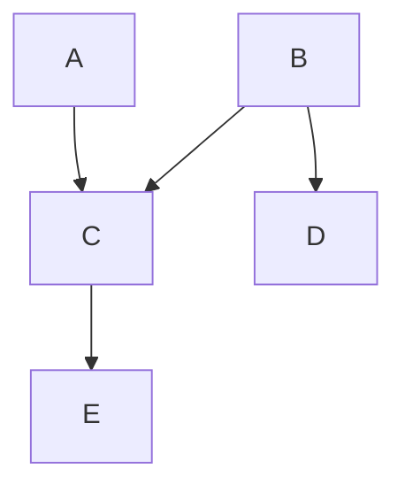

An agent, when has to deal with uncertainty, can't know for sure the state of the world or where it will end after a sequence of actions.

To handle uncertainty the agents use **Belief State** that is a representation of the set of _all_ possible states that the world can be in.

To handle uncertainty the agent should have a contingency plan that handle every possible state of the world.

In this cases is almost impossible to have a clear vision of the world, at most we can have some _degree of belief_ that a state is true. To handle this we use **Probability theory**.

The agent should also have some _preferences_ between different outcomes. To handle this we use **Utility theory** to express the _degree of usefulness_ associated to a state.

Probability theory and Utility theory are the basis of the **Decision Theory**. The idea is that an agent is rational iff it chooses the action with the highest expected utility, averaged over all the possible outcome of the action (**Maximum Expected Utility** - MEU).

```python
def DT_AGENT(percept):
"""
    return an action
"""
    belief = UPDATE_BELIEF(belief, percept)

    # select the action with the highest expected utility based on probability of outcomes
    return argmax(ACTIONS, lambda a: EU(a, belief))
```

## 8.1 Bayesian Networks

**Bayesian Networks** are an acyclic graphical representation of the probability distribution and dependencies of a set of random variables.

- **Nodes**: The random variables.
- **Edges**: The dependencies between the random variables.
- **Conditional Probability Table** (CPT): The probability of the node given the parents $P(X_i | \text{Parents}(X_i))$.

With a Bayesian Network we can compute the probability of a specific state of the world given the values of the variables.

To calculate it we use the **Chain Rule**:

$$P(X_1 = x_1 \land X_2 = x_2 \land ... \land X_n = x_n) = P(x_1, x_2, ..., x_n) = \prod_{i=1}^n P(X_i | \text{Parents}(X_i))$$

The **Inference** in Bayesian Networks is the process of computing the probability of a specific state of the world given some evidences E and some hidden variable Y ($P(X_i | e_1, e_2, ..., e_n)$).

To calculate it we use **marginalization**:

$$P(X = x_i \land E = e) = \sum_{y} P(X = x_i \land E = e \land Y = y_j)$$

### 8.1.1 Inference

With chain rule and marginalization we can compute some reasoning:

- **Casual Reasoning**: How parents ($Y$) influence children ($X$). $P(X | Y)$
- **Evidential Reasoning**: How children ($X$) influence parents($Y$). $P(Y | X)$
- **Intercausal Reasoning**: How parents influence each other. $P(X | Y \land Z)$



|           | X influence Y?         | Example   |
| --------- | ---------------------- | --------- |
| X → Y     | Yes (casual)           | A → C     |
| X ← Y     | Yes (evidential)       | A ← C     |
| X → Z → Y | Yes (casual chain)     | A → C → B |
| X ← Z ← Y | Yes (evidential chain) | A ← C ← B |
| X ← Z → Y | Yes                    | C ← B → D |
| X → Z ← Y | No                     | A → C ← B |

What would change if we have a new evidence $E$?

|           | X influence Y? | X influence Y? | Example   |
| --------- | -------------- | -------------- | --------- |
|           | $Z \notin E$   | $Z \in E$      |           |
| X → Z → Y | Yes            | No             | A → C → B |
| X ← Z ← Y | Yes            | No             | A ← C ← B |
| X ← Z → Y | Yes            | No             | C ← B → D |
| X → Z ← Y | No/Yes (child) | Yes            | A → C ← B |

We say that a trail is **Active** if there are no v-structures in the trail that block the influence to flow.

### 8.1.2 Approximate inference

The exact inference in Bayesian Networks is computationally expensive because it requires to compute the probability of all the possible states of the world.

To make the inference more efficient way called **Sampling** can be used. The idea is to generate multiple samples of the possible states of the world and compute the probability based on the sample.
