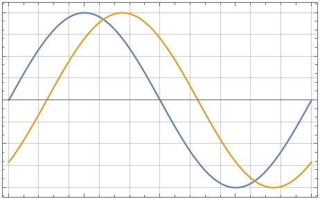

# Riassuntino di Misure

## Capitolo Uno: Formule di base

Siano $x_i$, con $i = 1, \dots, N$, le $N$ misurazioni effettuate, allora posso calcolare la media del misurando ($\overline x$), la varianza campionaria ($S^2(x)$), la varianza del valor medio ($S^2(\overline x)$) e la sua incertezza o deviazione standard ($S(\overline x) = u(x)$).

$$
\overline x = \frac{1}{N} \sum_{i = 1}^N [x_i] \\
S^2(x) = \frac{1}{N - 1} \sum_{i = 1}^{N} \left[(x_i - \overline x)^2\right] \\
S^2(\overline x) = \frac{S^2(x)}{N} \\
S(\overline x) = u(x) = \sqrt{S^2(\overline x)}
$$

### 1.1 Derivate dalle precedenti

Ovviamente, ci sono alcune formule comode che sono derivate dalle precedenti, che permettono, in alcuni casi, conti più veloci.

$$
u(x) = \frac{S(\overline x)}{\sqrt N} \\
S(x) = \sqrt{\frac{1}{N - 1} \sum_{i = 1}^N \left[(x_i - \overline x)^2 \right]} \\
u(x) = \sqrt{\frac{1}{N(N - 1)}\sum_{i = 1}^N \left[(x_i - \overline x)^2\right]}
$$

## Capitolo Due: Formule riguardanti l'incertezza

Ci sono due tipi di incertezze: (A) calcolate con metodi statistici (vedere [formule di base](#formule-di-base)) e (B) conosciute a priori e/o in altro modo.

Nel caso in cui una misurazione coinvolga entrambi i tipi di incertezze, è necessario calcolare l'incertezza composta ($u_C(x)$).

$$
u_C(x) = \sqrt{u_A^2(x) + u_B^2(x)}
$$

Se si devono inserire i valori calcolati in delle formule, è possibile calcolare l'incertezza del risultato conoscendo l'incertezza dei vari valori utilizzati (se i valori utilizzato sono correlati tra loro, vedere [misure indirette](#misure-indirette)).
Ad esempio, sia $R = R(a, b, \dots)$ la formula e $a, b, \dots$ i parametri, allora

$$
u(R) = \sqrt{\left(\frac{\partial R}{\partial a}\right)^2 \cdot u^2(a) + \left( \frac{\partial R}{\partial b} \right)^2 \cdot u^2(b) + \dots}
$$

Può essere necessario conoscere l'incertezza relativa ($u_r(x)$) di una misurazione rispetto alla misurazione stessa.

$$
u_r(x) = \frac{u(x)}{\overline x}
$$

Date $N$ misurazioni, è anche possibile calcolare l'incertezza dell'incertezza:

siano $\nu = N - 1$ i gradi di libertà della misura allora

$$
u(u) = \frac{1}{\sqrt{2 \nu}} = \frac{1}{\sqrt{2 \cdot (N - 1)}}
$$

### 2.1 Misure indirette

Nel caso in cui si debba compiere una misurazione indiretta, il cui risultato è descritto dalla funzione $R = R(x_1, x_2, \dots, x_N)$ dove $x_1, x_2, \dots, x_N$ sono i valori utilizzati nel calcolo, l'incertezza finale è data dalla formula

$$
u_C(R) = \sqrt{\underbrace{\sum_{i=1}^N \left[ \left( \frac{\partial R}{\partial x_i} \right)^2 \cdot u^2(x_i) \right]}_{\text{Somma pesata varianze}} + \underbrace{2 \sum_{i = 1}^{N - 1} \sum_{j = i + 1}^{N} \left[ \left( \frac{\partial R}{\partial x_i} \right) \left( \frac{\partial R}{\partial x_j} \right) \cdot u^2(x_i, x_j) \right]}_{\text{Somma pesata covarianze}}}
$$

Se si vuole calcolare quanto due misure siano correlate tra loro, è necessario calcolare il coefficiente di correlazione ($r_{ij}$).

$$
r_{ij}(x_i, x_j) = \frac{u(x_i, x_j)}{u(x_i) \cdot u(x_j)} \in [-1, 1]
$$

Se $x_i$ e $x_j$ sono statisticamente indipendenti allora $r_{ij} = 0$.

### 2.2 Incertezza estesa

E' possibile che un'incertezza venga espressa come percentuale. In tal caso viene data la probabilità che una misurazione ricada in un dato range.

Data un'incertezza estesa $U(x)$ e la sua percentuale, è possibile calcolare l'incertezza $u(x)$.

$$
u(x) = \frac{U(x)}{k}
$$

| $k$ (fattore di copertura) | Percentuale |
| -------------------------- | ----------- |
| 1                          | 68.3%       |
| 2                          | 95.5%       |
| 3                          | 99.7%       |

Due misure $x_a$ e $x_b$ sono dette compatibili se è possibile trovare un $k$ inferiore a 3 tale per cui

$$
|x_a - x_b| \le k \sqrt{u^2(x_a) + u^2(x_b) - \underbrace{2r_{ab}u(x_a)u(x_b)}_{\text{Nullo se indipendenti}}}
$$

### 2.3 Incertezza di tipo B

L'incertezza di tipo B si basa su dati conosciuto a priori (ad esempio ci viene data dal manuale).

In molti casi è fornita la PDF con l'errore massimo da cui è possibile estrapolare i vari valori che interessano.

#### PDF normale (gaussiana)

| $\sigma$  | Intervallo                          | Probabilità |
| --------- | ----------------------------------- | ----------- |
| $1\sigma$ | $\mu - \sigma < x < \mu + \sigma$   | 68.3%       |
| $2\sigma$ | $\mu - 2\sigma < x < \mu + 2\sigma$ | 95.5%       |
| $3\sigma$ | $\mu - 3\sigma < x < \mu + 3\sigma$ | 99.7%       |

#### PDF quadrata

Sia $\Delta x$ l'errore massimo e quindi anche la base della PDF. L'altezza è $\frac{1}{\Delta x}$.

$$
p(x) = \begin{cases}
    0 & x \lt \mu - \frac{\Delta x}{2} \\
    \frac{1}{\Delta x} & \mu - \frac{\Delta x}{2} \le x \le \mu + \frac{\Delta x}{2}
    0 & x \gt \mu + \frac{\Delta x}{2}
\end{cases} \\
\mu(x) = \int_{-\infty}^{+\infty} x \cdot p(x) \cdot dx \\
\sigma = \frac{\Delta x}{\sqrt {12}}
$$

#### PDF triangolare

Sia $\Delta x$ l'errore massimo e quindi anche la base della PDF. L'altezza è $\frac{2}{\Delta x}$.

$$
\sigma = \frac{\Delta x}{\sqrt {24}}
$$

### 2.4 Derivate dalle precedenti

In caso si voglia calcolare l'incertezza del risultato di una formula che sia una produttoria, è possibile utilizzare un formula semplificata. Sia $R = R(a, b, \dots) = a^{e_a} \cdot b^{e_b} \cdot \dots$ allora

$$
u_r(R) = \sqrt{(e_a)^2 \cdot u_r^2(a) + (e_b)^2 \cdot u_r^2(b) + \dots}
$$

E' possibile calcolare una media pesata di più misurazioni con le relative incertezze e l'incertezza della media pesata.

$$
x_{mp} = \frac{x_1 \cdot \frac{1}{u^2(x_1)} + x_2 \cdot \frac{1}{u^2(x_2)} + \dots}{\frac{1}{u^2(x_1)} + \frac{1}{u^2(x_2)}} + \dots \\
u(x_{mp}) = \sqrt{\frac{1}{\frac{1}{u^2(x_1)}+\frac{1}{u^2(x_2)} + \dots}}
$$

## Capitolo Tre: Regressione lineare

Data una serie di coppie $(x_i, y_i)$ è possibile calcolarne la regressione lineare (nella forma $y = mx + q$) con le seguenti formule.

$$
m = \frac{n\sum[x_i y_i] - \sum x_i \sum y_i}{n \sum x_i^2 - (\sum x_i)^2} \\
q = \frac{\sum x_i^2 \sum y_i - \sum x_i \sum x_i y_i}{n \sum x_i^2 - (\sum x_i)^2} = \frac{\sum y_i - m \sum x_i}{n} = \overline y - m \overline x
$$

La formula per la soglia si può derivare dalla formula della regressione una volta che si conoscono $m$ e $q$:

$$
\begin{cases}
  y = mx + q \\
  y = 0
\end{cases} \implies x = -\frac{q}{m}
$$

## Capitolo Quattro: Voltmetro ad approssimazioni successive (SAR)

Un voltemtro ad approssimazioni successive funziona un po' come una ricerca binaria su di una lista, solo che è applicata ad una tensione.

La tensione in ingresso viene confrontata $n$ volte con una tansione di riferimento varaibile generata dal voltmetro, dove $n$ è il numero di bit di tale voltmetro.

Tutti i bit del valore letto, inizialmente sono posti a zero. Successivamente, partendo dal MSB, per ogni bit, accade che

1. Si accende tale bit;
2. Si fa generare al voltmetro una tensione che, quando letta, corrisponde al valore letto;
3. Se la tensione generata è minore, si mantiene il bit acceso, altrimenti lo si rispegne, successivamente si ripete il procedimento col bit successivo.

Un voltmetro SAR a $n$ bit effettua sempre $n$ confronti per ciascuna misurazione, dunque

$$
T_{confronto} = \frac{1}{f_{confronto}} \qquad T_{misurazione} = n \cdot T_{confronto} \qquad f_{misurazione} = \frac{1}{T_{misurazione}}
$$

E' molto probbile che il valore letto non corrisponda esattamente con il valore in ingresso (servirebbe un numero potenzilmente infinito di bit); il valore letto si calcola come

$$
V_l = \frac{S}{2^n} \cdot D
$$

ove $S$ è il il valore della stringa di bit prdotta dalla misurazione, convertito in decimale e $D$ è la dinamica del voltmetro (assumendo che la dinamica del voltmetro parta da zero, altrimenti bisogna inserire degli offset).

E' possibile calcolare $S$ in maniera veloce come segue

$$
S = \left\lfloor \frac{V_{in} \cdot 2^n}{D} \right\rfloor
$$

## Capitolo Cinque: Voltmetro integratore a doppia rampa

Il voltmetro integratore a doppia rampa è il voltmetro più preciso e resistente ai dusturbi (ma anche quello più lento) esistente.

Sinteticamente, la sequenza di operazioni che tale voltmetro effettua per arrivare ad una lettura si può schematizzare come segue

1. Integrazione della tensione d'ingresso per un tempo $T_{up}$ prestabilito attraverso un opamp in configurazione integrante
2. Integrazione con lo stesso opamp (quindi il valore da cui si parte è lo stesso ottenuto prima) di un valore di tensione costante e misura del tempo $T_{down}$ impiegato per raggiungere lo zero

Le formule su cui si basa il tutto sono

$$
V_{in} \cdot T_{up} = |V_{ref}| \cdot T_{down} \qquad T_{up} = N_{up} \cdot T_{clock} \qquad T_{down} = N_{down} \cdot T_{clock}
$$

Da queste formule si possono ricavare tutte le seguenti informazioni

- Tempo di misura massimo: si risolve la prima equazione per $T_{down}$ con $V_{in}$ pari alla tensione di fondoscala ($T_down = $) e $T_{mis} = T_{up} + T_{down}$
  $$
  V_{fs} \cdot T_{up} = |V_{ref}| \cdot T_{down} \implies T_{down} = \frac{V_{fs}}{|V_{ref}|} \cdot T_{up}
  $$
- Risoluzione dimensionale: si calcola la minima tensione che può essere de-integrata nella seconda fase in un solo ciclo di clock
  $$
  \Delta V \cdot N_{up} \cdot \cancel{T_{clock}} = |V_{ref}| \cdot 1 \cdot \cancel{T_{clock}} \implies \Delta V = \frac{|V_{ref}|}{N_{up}}
  $$
  Una formula alternativa può essere
  $$
  \Delta V = \frac{V_{in}}{N_{down}}
  $$
- Risoluzione adimensionale:
  $$
  \delta = \frac{1}{N_{down}}
  $$
- Incertezza teorica del valore misurato:
  $$
  V_{in} \cdot T_{up} = |V_{ref}| \cdot T_{down} \implies V_{in} = |V_{ref}| \cdot \frac{T_{down}}{T_{up}} = |V_{ref}| \cdot \frac{N_{down}}{N_{up}} \implies u_r(V_{in}) = \sqrt{u_r^2(V_{ref}) + u_r^2(N_{down}) + u_r^2(N_{up})}
  $$
  Si suppone che il voltmetro abbia un clock molto preciso per cui si può dire che $u(T_{up}) \simeq 0$ e che quindi $u(N_{up}) = 0$; per l'incertezza di $N_{down}$, invece $N_{down} = \frac{1}{\sqrt{12}}$

Con i voltmetri integratori a doppia rampa è possibile scegliere un $T_{up}$ che vada a eliminare completamente (reiezione infinita) i disturbi a date frequenze (e tutti i multipli di tali frequenze). Ad esempio, con due frequenze diverse:

$$
\begin{cases}
  n_1 = f_{d,1} \cdot T_{up} \\
  n_2 = f_{d,2} \cdot T_{up}
\end{cases} \implies \frac{n_1}{n_2} = \frac{f_{d,1}}{f_{d,2}} \implies \begin{cases}
  n_1 = \dots \\
  n_2 = \dots \\
\end{cases} \implies T_{up} = \frac{n_1}{f_{d,1}} = \frac{n_2}{f_{d,2}}
$$

Per più frequenze, è necessario trovare il minimo comune multiplo dei periodi associati.

Progettare un voltmetro integratore a doppia rampa significa, dati portata, risoluzione, frequenze dei disturbi da rigettare e tensione di riferimento, trovare $T_{up}$, $T_{clock}$, $f_{clock}$ e $N_{up}$.

E' possibile anche, conoscendo la massima tensione in uscita dall'integratore ($V_0$), calcolare quanto vale la costante di tempo $RC$.
Per raggiungere la massima tensione, è necessario misurare la tensione di fondoscala ($V_x = V_{fs}$).

$$
V_0 = - V_x \cdot \frac{T_{up}}{RC} \implies RC = \frac{-V_x \cdot T_{up}}{V_0}
$$

Il ragionamento dietro tale formula è quello di voler eguagliare l'integrale della tensione d'ingresso sul tempo con quello della tensione in uscita sulla costante di tempo.

## Capitolo Sei: Oscilloscopio

Un oscilloscopio è uno strumento per visualizzare come cambia un segnale nel tempo.

Lo schermo dell'oscilloscopio è suddiviso in 8 divisioni verticali e 10 orizzontali.

Su un oscilloscopio è possibile impostare il trigger su un canale per iniziare a disegnare i segnali solo quando alcune condizioni vengono rispettare.

I nove parametri da regolare per visualizzare bene uno (o più) segnali su un oscilloscopio sono i seguenti:

- **Amplificazione verticale**: va regolata per ciascun canale in ingresso e serve per regolare "quanto è alto" il segnale sullo schermo; si misura in $V / DIV$ e può assumere valori come $1, 2, 5$ moltiplicati per $10^n V$.
- **Offset**: va regolato per ciascun canale e serve per spostare verticalmente il segnale sullo schermo.
- **Coupling**: può essere _DC_ (il segnale mostrato è quello in ingresso), _AC_ (il segnale mostrato è quello in ingresso privato delle sue componenti continue) o _GND_ (il segnale mostrato è $0 V$).
- **Amplificazione orizzontale**: serve per regolare "quanto è largo" il segnale; siccome in un oscilloscopio la base dei tempi è unica, questa impostazione va ad influenzare entrambi i segnali.
- **Canale di trigger**: il canale su cui valutare se è momemto di iniziare a disegnare i segnali da mostrare.
- **Modalità trigger**: può essere _NORMAL_ (il segnale viene disegnato appena la condizione di trigger è soddisfatta) o _AUTO_ (il segnale viene mostrato anche se le condizioni di trigger non sono rispettate).
- **Livello di trigger**: regola la tensione attrraverso la qule il segnale deve passare per dare inizio al disegno del segnale.
- **Pendenza di trigger**: regola se il segnale deve passare attraverso il livello sopra specificato; può essere _POSITIVA_ (si inizia a disegnare quando il segnale passa da sotto il livello a sopra il livello) o _NEGATIVA_ (si inizia a disegnare quando il segnale passa da sopra il livello a sotto il livello).
- **Coupling del trigger**: come il coupling per i segnali ma applicato prima di verificare le condizioni del trigger (non influenza il trigger del segnale disegnato).

Non sempre c'è un valore ottimo utilizzabile per questi parametri, spesso ci sono più combinazioni di valori che possono andare bene. L'importante è seguire alcune linee guida (e anche intuito e buon senso non fanno mai male).

- Per ciascun canale, scegliese se si vuole osservarne anche la componente DC (se presente) o solamente quella AC e scegliere il coupling di conseguenza. Spesso, scegliendo AC oppure DC con offset pari all'opposto della componente continua del segnale si ottiene lo stesso risultato.
- Scegliere un offset tale per cui il segnale sia verticalmente centrato secondo necessità sullo schermo.
- Scegliere un'amplificazione verticale tale per cui il segnale possa spaziare il più possibile verticalmente sullo schermo (si calcola $D / 8$ e si sceglie il più piccolo valore in $V / DIV$ disponibile maggiore del rapporto calcolato)
- Scegliere un'amplificazione temporale tale per cui si riescano a visualizzare a schermo un numero di periodi adeguiato dei segnali da analizzare; siccome l'asse dei tempi è univoca, se, ad esempio, si vuole visualizzare un periodo di due segnali, di cui uno più veloce, il calcolo si basa sul segnale più lento (sapendo che l'oscilloscopio dispone di 10 divisioni, l'amplificazione orizzontale da scegliere sarà maggiore o uguale a un decimo del periodo del segnale più lento).
- Scegliere le impostazioni di trigger:
  - Solitamente si usa il segnale che cresce più velocemente (ad esempio, un onda quadra è migliore rispetto ad una sinusoide e tra segnali simili, è preferibile usare quello più ampio); logicamente, si deve prestare attenzione al fatto che se un segnale è più veloce di un altro, si rischia che il trigger venga attivato più volte durante uno stesso periodo del segnale più lento, facendo in modo che il disegno sia incompleto
  - Per scegliere livello, pendenza e coupling del trigger, si devono scegliere valori tali per cui il segnale passi per tali segnali una sola volta per periodo, per evitare che il disegno venga interrotto prima di aver completato un periodo completo

Quanto riportato sopra, vale solo per segnali periodici ma è adattabile anche per segnali non periodici.

Gli oscilloscopi digitali di solito montano un convertitore flash a 256 livelli (8 bit).

Di seguito, le formule per calcolare dinamica e risoluzione.

$$
D = 8 \cdot A_v \qquad \Delta V = \frac{D}{256}
$$

Per un oscilloscopio analogico, la risoluzione è empiricamente deinita come "metà tacchetta" (ovvero circa un decimo di divisione; il nome deriva dal fatto che ogni divisione è divisa in 5 sottodivisioni da alcune tacchette).

Il resto (incertezze varie) è identico a quanto visto precedentemente.

Un oscilloscopio, ha una massima banda passante, dovuta alle caratteristiche dei componenti attraverso i quali il segnale passa. Un segnale sinusoidale di frequenza esattamente pari alla banda dell'oscilloscopio verrà disegnato con ampiezza pari alla metà dell'ampiezza originale e sfasato di $\frac{\pi}{2}$.

Un segnale come un'onda quadra non ideale non può commutare di stato improvvisamente: c'è un tempo di salita (che è il tempo che impiega per passare dal 10% al 90% della sua transizione di stato).

Siccome anche l'oscilloscopio non è ideale, anch'esso contribuisce ad aumentare il tempo di salita.

Siano $B$ la banda dell'oscilloscopio, $t_{ss}$ il tempo di salita del segnale, $t_{so}$ il tempo di salita dell'oscilloscopio e $t_{sm}$ il tempo di salita misurato (quello visualizzato sull'oscilloscopio), allora

$$
t_{so} = \frac{0.35}{B} \qquad t_{sm} = \sqrt{t_{so} + t_{ss}}
$$

Per visualizzare due tracce contemporaneamente, è possibile scegliere tra modalità _CHOPPED_ o _ALTERNATED_.

La prima è utile per segnali a bassa frequenza ($\le 1kHz$) è consiste nel disegnare, alternativamente, un pezzetto di ciascun segnale per volta.

La seconda, invece, è utile per segnali più veloci e consiste nel disegnare una schermata intera alla volta, per ogni segnale.

Se un segnale è molto più veloce del campionatore dell'oscilloscopio, si può utilizzare una tecnica di campionamento in tempo equivalente (tali tecniche sono utili solo per segnali periodici; è quasi impossibile riuscire ad individuare eventuali glitch nel segnale).

Il campionamento in tempo equivalente sequenziale consiste nel capionare un segnale ogni $T + \tau$ tempo ($T$ è il periodo del segnale e $\tau \lt \lt T$) in modo da ottenere $\frac{T}{\tau}$ punti che poi vengono uniti per ricreare la forma d'onda.

Col campionamento in tempo casuale, invece, si fa lavorare il campionatore alla massima velocità e poi si riordinano i punti in base a quanto tempo è passato dall'ultimo trigger a quando sono stati campionati, poi si visualizza il segnale.

## Capitolo Sette: Definizioni varie

### 7.1 Definizioni base

Accuratezza
: Grado di concordanza tra un valore misurato ed il valore vero del misurando.

Incertezza
: Stima quantitativa, con metodi convenzionali, del livello di non conoscenza del misurando.

Sensibilità
: Rapporto tra la variazione della grandezza di uscita e la corrispondente variazione della grandezza d'ingresso.

Risoluzione
: Capacità di uno strumento di risolvere stati diversi del misurando.

Ripetibilità
: Capacità di ottenere, per uno stesso misurando, valori di lettura vicini tra loro nel breve periodo e nelle stesse condizioni.

Stabilità
: Capacità di ottenere, per uno stesso misurando, valori di lettura vicini tra loro in un periodo di tempo ben definito e chiaramente specificato.

Riproducibilità
: Capacità di ottenere, per uno stesso misurando, valori di lettura vicini tra loro in diverse e specificate condizioni di misura (il tempo non conta).

Riferibilità
: Proprietà di una misura di essere messa in relazione (riferita) con quella fornita da un campione riconosciuto.

### 7.2 Unità di misura del nuovo Sistema Internazionale

Secondo 
: L'intervallo di tempo che contiene 9192631770 periodi della radiazione emessa da un atomo di cesio imperturbato che decade tra due livelli iperfini dello stato fondamentale.

Metro
: Il tragitto compiuto dalla luce nel vuoto in $\frac{1}{299792458}$ secondi.

Chilogrammo
: La quantità di massa necessaria per bilanciare una forza di $6.62607015 \cdot 10^{-34} \, J \cdot s$ in una bilancia di Watt.

Ampere
: L'intensità di corrente in un conduttore attravarsato da una corrente di 1 C in un secondo (dove la carica di un elettrone è pari a $1.602176565 \cdot 10^{-19}$).

Kelvin
: E' derivato dalla costante di Boltzmann $k_B = 1.3086488 \cdot 10^{23} \frac{J}{K}$

Mole
: La quantità di sostanza che contiene esattamente $6.02214129 \cdot 10^{23}$ (pari al numero di Avogadro) entità elementari.

Candela
: L'intensità luminosa in una data direzione di una sorgente che emette radiazione monocromatica alla frequenza di $540 \cdot 10^{12} Hz$ con intensità radiante di $\frac{1}{683} W$ 

### 7.3 Taratura e messa in punto

Taratura
: E' una fotografia dello stato di uno strumento che consente di valutarne l'incertezza. ☻

Messa in punto
: La regolazione dello strumento per fare in modo che operi nelle migliori condizioni possibili.

### 7.4 Errori

E. sistematici
: Errori che si presentano nella stessa entità ogni volta che si ripete la misura (offset/polarizzazione)

E. accidentali
: Errori che si presentano in maniera impredicibile ogni volta che si ripete la misura

### 7.5 Tipologie di campioni

C. primari
: Realizzano l'unità con i maggiori livelli di accuratezza possibili.

C. secondari
: Consentono di trasferire l'unità e di effettuare confronti tra i c. primari e gli altri.

C. di trasferimento
: Adatti al trasporto e usati per trasferire l'unità.

C. locali
: Si trovano all'interno degli istituti o delle aziente e si dividono in c. di lavoro e c. di riferimento.

C. di riferimento
: Usati nei centri di taratura e di certificazione; usati poco frequentemente.

C. di lavoro
: Usati nei lavori di routine previo confronto con quelli di riferimento.

### 7.6 Gradi di libertà

Gradi di libertà
: Misurano la bontà della stima, in quanto ogni stima dell'incertezza è a sua volta incerta.
