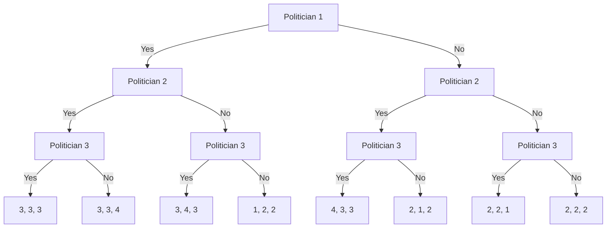
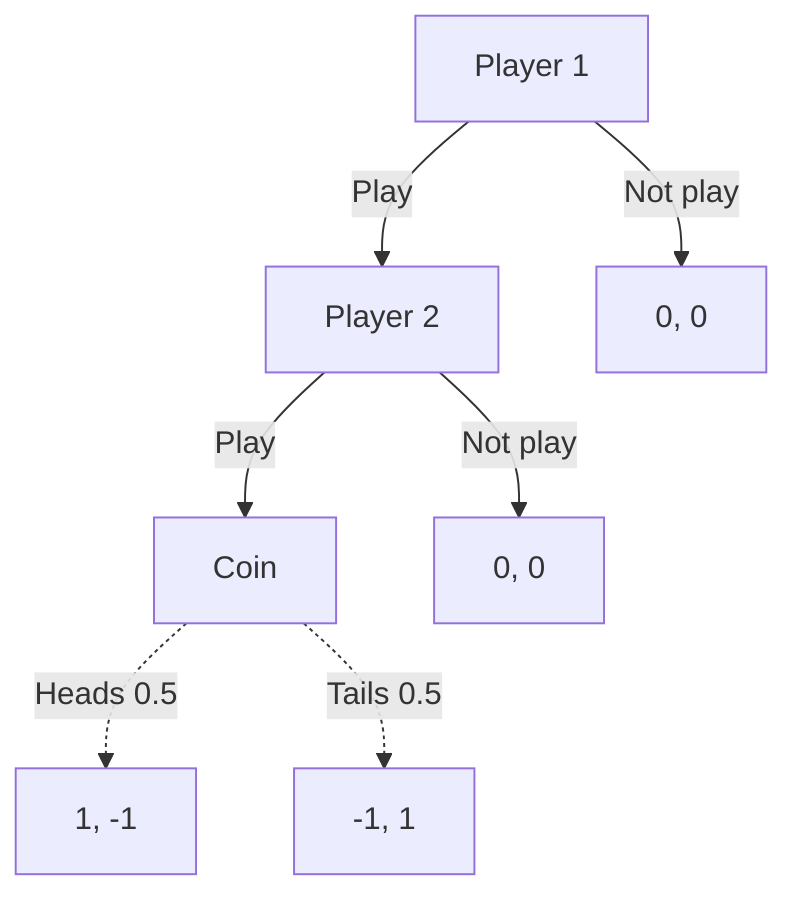
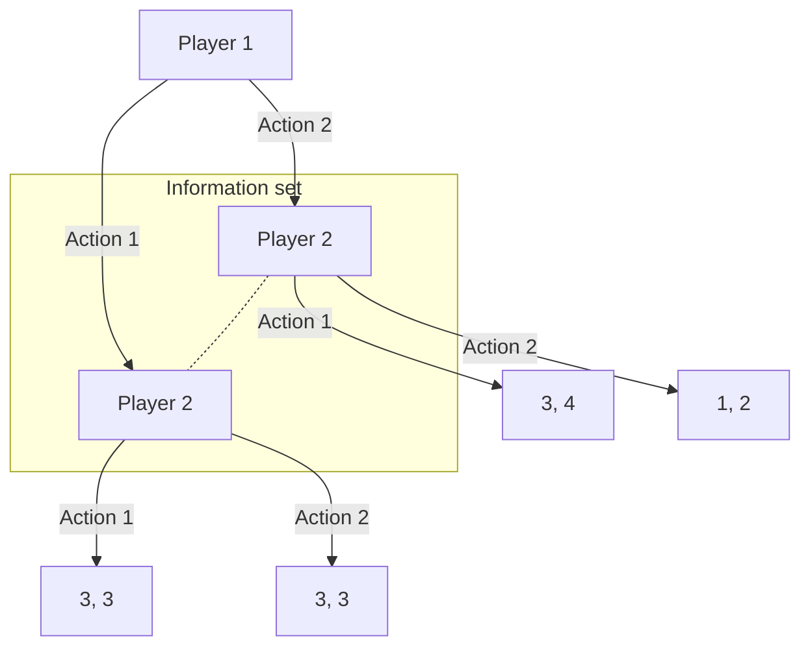

## Introduction to Games

Game theory studies situations where the outcome for one person depends not only on their own choices but on the choices of others.

A game is a process defined by:

- a set of *players*
- an *initial situation*
- *rules* that all players must follow
- a set of *possible final situations* (outcomes)
- a *preference* for every player over the final situations

### Players

A **player** is an agent who can make decisions in a game. Players are assumed to be **selfish** (cares only about their own outcome) and **rational** (always picks the best option available to them, given what they believe others will do).

1. Players can provide a preference ordering over outcomes.
2. Players can always express that preference as a utility function.
3. Players use the laws of probability consistently under uncertainty.
4. Players understand the consequences of their own actions, of others' actions, and of how others' actions affect their own.
5. Players use decision theory whenever it applies.

#### Preference relations

A preference relation $\succeq$ ("is at least as good as") is a binary relation over the set of outcomes $X$ satisfying:

- **Reflexive**: $x \succeq x$ for all $x \in X$
- **Complete**: for all $x, y \in X$, either $x \succeq y$ or $y \succeq x$ (or both)
- **Transitive**: for all $x, y, z \in X$, if $x \succeq y$ and $y \succeq z$, then $x \succeq z$

A preference relation can be represented by a **utility function** $u : X \to \mathbb{R}$ such that:

$$x \succeq y \iff u(x) \geq u(y)$$

## Extensive Form Representation

The **extensive form represents** a game as a **decision tree**, useful when players move in sequence.

An extensive form game with perfect information consists of:

- a finite set of players $N = {1, \dots, n}$
- a game tree $(V, E, x_0)$
- a partition of the non-leaf vertices into ${P_1, \dots, P\_{n+1}}$ (which player moves at each vertex; $P\_{n+1}$ is reserved for chance moves)
- a probability distribution over the outgoing edges of each chance vertex
- an $n$-dimensional payoff vector attached to each leaf

Each vertex is a decision point, each edge is an available action, and each leaf carries the resulting payoff for every player.

> e.g. Three politicians vote **sequentially and publicly** on whether to raise their own salaries. Each politician privately wants the raise but wants to be seen voting against it.
>
> Personal utility, from worst to best:
>
> | Value | Meaning |
> | --- | --- |
> | 1 | voted yes, no raise |
> | 2 | voted no, no raise |
> | 3 | voted yes, raise happens |
> | 4 | voted no, raise happens (ideal: get the money, dodge the blame) |

### Extensive form with chance

A **chance node** is a node in the tree where, instead of a player choosing, randomness picks a branch according to a fixed probability distribution.

> e.g. Two players decide, in sequence, whether to play. If **both** choose to play, a fair coin is tossed: heads means player 1 wins, tails means player 2 wins.

### Backward induction

The **backward induction** method allows to find the rational outcome of a perfect-information game.

It is based on the idea that, at each decision node, the player there will pick whatever is best for them based on the outcome of the game.

Starting from the leaves, at each decision node, the player there picks the action that maximizes their own payoff, and that choice is treated as the resolved outcome for that node. This process continues up the tree until reaching the root.

Applying backward induction to the three-politician example, we can summarize the choices and outcomes in a table:

| Node | Player | Choice | Resolves to |
| --- | --- | --- | --- |
| D | 3 | No (4 > 3) | (3, 3, 4) |
| E | 3 | Yes (3 > 2) | (3, 4, 3) |
| F | 3 | Yes (3 > 2) | (4, 3, 3) |
| G | 3 | No (2 > 1) | (2, 2, 2) |
| B | 2 | No, E (4 > 3) | (3, 4, 3) |
| C | 2 | Yes, F (3 > 2) | (4, 3, 3) |
| A | 1 | No, C (4 > 3) | **(4, 3, 3)** |

Leading to the rational outcome of the game: politician 1 votes *No*, politician 2 votes *Yes*, and politician 3 votes *Yes*. The raise happens, and only politician 1 gets to dodge the blame while getting the ideal payoff.

### Impartial Combinatorial Games

An impartial combinatorial game has:

- two players who move in strict alternation
- a finite game with no chance elements
- both players sharing the exact same set of legal moves at any position
- the player unable to move loses

It is possible to classify positions into two types:

| Position | Meaning |
| --- | --- |
| **P-position** | Losing position for the player about to move, every move leads to an N-position |
| **N-position** | Winning position for the player about to move, at least one move leads to a P-position |

A player who moves into a P-position for their opponent can always force a win by playing optimally.

#### Nim game

**Nim** is an impartial combinatorial game with $k$ piles $(n_1, \dots, n_k)$, on each turn a player removes any positive number of objects from a single pile, and the player who takes the last object wins.

Nim is solved with the **nim-sum**, $\oplus$: binary addition without carrying (equivalently, bitwise XOR). The natural numbers under $\oplus$ form an abelian group with identity $0$.

According to the **Bouton theorem**, a position $(n_1, \dots, n_k)$ is a P-position if and only if the nim-sum of the pile sizes is zero:

$$n_1 \oplus n_2 \oplus \cdots \oplus n_k = 0$$

### Perfect-information theorems

For any finite two-player game of perfect information with no chance moves (chess is the classic example), exactly one of the following holds:

1. Player 1 has a **winning strategy**, regardless of what player 2 does.
2. Player 2 has a **winning strategy**, regardless of what player 1 does.
3. Both players have a strategy that **guarantees at least a draw**, regardless of what the other does.

A winning strategy for player 1 means:

$$\exists a_1 \in A_1 : \forall b_1 \in B_1 : \exists a_2 \in A_2 : \forall b_2 \in B_2 : \cdots : \exists a_n \in A_n : \forall b_n \in B_n : \text{P1 wins}$$

This notation means that there exists a sequence of moves for player 1 such that, no matter what moves player 2 makes, player 1 can always respond in a way that leads to a win.

If this is not true, then player 2 can guarantee at least a draw.

### Solution concepts

The rational outcome of a game is called a **solution** and can be classified as follows:

- **Very weak solution**: A rational outcome exists, but it is not practically reachable/computable
- **Weak solution**: The outcome is known, but not *how* to reach it
- **Solution**: The outcome is known and a way to reach it is known

### Imperfect Information

A game has *perfect information* if every player knows exactly where they are in the game tree at all times. If there are missing information or simultaneous moves, the game has **imperfect information**.

#### Information sets

For player $i$, an information set $U_i$ is a collection of vertices in $P_i$ (player $i$'s decision vertices) that $i$ cannot distinguish between. Formally, an information set $U_i$ satisfies:

- $U_i \subseteq P_i$
- every vertex in $U_i$ has the same number of children (same available actions)
- $A(U_i)$ is a partition of the children of the vertices in $U_i$, representing the actions available to $i$ at that information set

The formal definition of an imperfect-information game is the same as a perfect-information game, with:

- A partition of each player's decision vertices into information sets, $U_i^j \in P_i, \forall i, j$.

A game with perfect information can be represented as a game with imperfect information where each information set contains exactly one vertex.

## Strategies

A **Strategy** is a complete plan of action for a player, specifying what they will do at every information set they might encounter.

There are two types of strategies:

- **Pure strategy**: the player is able to choose a single action at each information set, leading to a deterministic outcome.
- **Mixed strategy**: the player chooses a probability distribution over their pure strategies, leading to a stochastic outcome.

### Strategic Form Representation

The **strategic form** represents a game as a payoff matrix, useful when players choose their strategies independently.

The **Payoff matrix** shows the payoffs for each player for every combination of strategies. Each row corresponds to a strategy of player 1, each column corresponds to a strategy of player 2, and each cell contains the payoff pair (player 1's payoff, player 2's payoff) for that combination.

| | P2: Strategy 1 | P2: Strategy 2 |
| --- | --- | --- |
| P1: Strategy 1 | (3, 3) | (3, 4) |
| P1: Strategy 2 | (4, 3) | (1, 2) |

Taking only player 1's payoffs gives player 1's utility matrix:

| | P2: Strategy 1 | P2: Strategy 2 |
| --- | --- | --- |
| P1: Strategy 1 | 3 | 4 |
| P1: Strategy 2 | 2 | 1 |

#### Dominant strategies

A strategy **dominates** another if it gives a better outcome regardless of what the other player does. In the matrix above, for player 1, Strategy 1 dominates Strategy 2: $3 > 2$ and $4 > 1$, so Strategy 1 is at least as good in every case and strictly better in at least one case.
